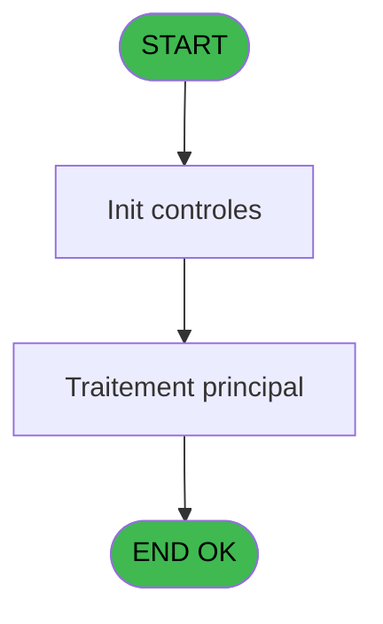
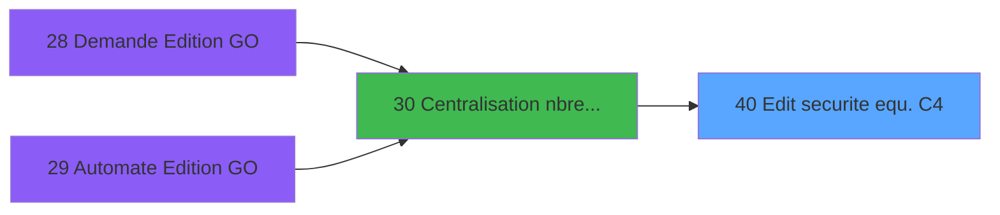

# PBP IDE 40 - Edit securite equ. C4

> **Analyse**: Phases 1-4 2026-02-03 08:51 -> 08:51 (22s) | Assemblage 08:51
> **Pipeline**: V7.2 Enrichi
> **Structure**: 4 onglets (Resume | Ecrans | Donnees | Connexions)

<!-- TAB:Resume -->

## 1. FICHE D'IDENTITE

| Attribut | Valeur |
|----------|--------|
| Projet | PBP |
| IDE Position | 40 |
| Nom Programme | Edit securite equ. C4 |
| Fichier source | `Prg_40.xml` |
| Domaine metier | General |
| Taches | 2 (1 ecrans visibles) |
| Tables modifiees | 0 |
| Programmes appeles | 0 |

## 2. DESCRIPTION FONCTIONNELLE

**Edit securite equ. C4** assure la gestion complete de ce processus, accessible depuis [Centralisation nbre edition (IDE 30)](PBP-IDE-30.md).

Le flux de traitement s'organise en **2 blocs fonctionnels** :

- **Calcul** (1 tache) : calculs de montants, stocks ou compteurs
- **Traitement** (1 tache) : traitements metier divers

Detail : phases du traitement

#### Phase 1 : Traitement (1 tache)

- **40** - Veuillez patienter... **[[ECRAN]](#ecran-t1)**

#### Phase 2 : Calcul (1 tache)

- **40.1** - Calcul Chaine

## 3. BLOCS FONCTIONNELS

### 3.1 Traitement (1 tache)

Traitements internes.

---

#### 40 - Veuillez patienter... [[ECRAN]](#ecran-t1)

**Role** : Traitement : Veuillez patienter....
**Ecran** : 429 x 59 DLU (MDI) | [Voir mockup](#ecran-t1)

### 3.2 Calcul (1 tache)

Calculs metier : montants, stocks, compteurs.

---

#### 40.1 - Calcul Chaine

**Role** : Calcul : Calcul Chaine.

## 5. REGLES METIER

*(Aucune regle metier identifiee)*

## 6. CONTEXTE

- **Appele par**: [Centralisation nbre edition (IDE 30)](PBP-IDE-30.md)
- **Appelle**: 0 programmes | **Tables**: 3 (W:0 R:1 L:2) | **Taches**: 2 | **Expressions**: 119

<!-- TAB:Ecrans -->

## 8. ECRANS

### 8.1 Forms visibles (1 / 2)

| # | Position | Tache | Nom | Type | Largeur | Hauteur | Bloc |
|---|----------|-------|-----|------|---------|---------|------|
| 1 | 40 | 40 | Veuillez patienter... | MDI | 429 | 59 | Traitement |

### 8.2 Mockups Ecrans

---

#### 40 - Veuillez patienter...
**Tache** : [40](#t1) | **Type** : MDI | **Dimensions** : 429 x 59 DLU
**Bloc** : Traitement | **Titre IDE** : Veuillez patienter...

<!-- FORM-DATA:
{
    "width":  429,
    "vFactor":  8,
    "type":  "MDI",
    "hFactor":  8,
    "controls":  [
                     {
                         "x":  0,
                         "type":  "label",
                         "var":  "",
                         "y":  0,
                         "w":  423,
                         "fmt":  "",
                         "name":  "",
                         "h":  29,
                         "color":  "",
                         "text":  "",
                         "parent":  null
                     },
                     {
                         "x":  120,
                         "type":  "label",
                         "var":  "",
                         "y":  10,
                         "w":  221,
                         "fmt":  "",
                         "name":  "",
                         "h":  8,
                         "color":  "7",
                         "text":  "Traitement en cours ...",
                         "parent":  null
                     },
                     {
                         "x":  0,
                         "type":  "label",
                         "var":  "",
                         "y":  29,
                         "w":  423,
                         "fmt":  "",
                         "name":  "",
                         "h":  27,
                         "color":  "",
                         "text":  "",
                         "parent":  null
                     },
                     {
                         "x":  46,
                         "type":  "label",
                         "var":  "",
                         "y":  38,
                         "w":  333,
                         "fmt":  "",
                         "name":  "",
                         "h":  8,
                         "color":  "",
                         "text":  "Edition Securite Equipage (C5)",
                         "parent":  null
                     },
                     {
                         "x":  4,
                         "type":  "image",
                         "var":  "",
                         "y":  2,
                         "w":  72,
                         "fmt":  "",
                         "name":  "",
                         "h":  25,
                         "color":  "",
                         "text":  "",
                         "parent":  null
                     }
                 ],
    "taskId":  "40",
    "height":  59
}
-->

## 9. NAVIGATION

Ecran unique: **Veuillez patienter...**

### 9.3 Structure hierarchique (2 taches)

| Position | Tache | Type | Dimensions | Bloc |
|----------|-------|------|------------|------|
| **40.1** | [**Veuillez patienter...** (40)](#t1) [mockup](#ecran-t1) | MDI | 429x59 | Traitement |
| **40.2** | [**Calcul Chaine** (40.1)](#t2) | MDI | - | Calcul |

### 9.4 Algorigramme

> **Legende**: Vert = START/END OK | Rouge = END KO | Bleu = Decisions
> *Algorigramme auto-genere. Utiliser `/algorigramme` pour une synthese metier detaillee.*

<!-- TAB:Donnees -->

## 10. TABLES

### Tables utilisees (3)

| ID | Nom | Description | Type | R | W | L | Usages |
|----|-----|-------------|------|---|---|---|--------|
| 35 | personnel_go______go |  | DB | R |   |   | 1 |
| 281 | crew |  | DB |   |   | L | 1 |
| 730 | arc_ez_card |  | DB |   |   | L | 1 |

### Colonnes par table (2 / 1 tables avec colonnes identifiees)

Table 35 - personnel_go______go (R) - 1 usages

| Lettre | Variable | Acces | Type |
|--------|----------|-------|------|
| A | > numero poste | R | Numeric |
| B | < chaine | R | Alpha |
| C | v. cdrt crew | R | Logical |

## 11. VARIABLES

### 11.1 Autres (117)

Variables diverses.

| Lettre | Nom | Type | Usage dans |
|--------|-----|------|-----------|
| A | > date | Date | - |
| B | c 1001 | Alpha | - |
| C | c 1002 | Alpha | - |
| D | c 1103 | Alpha | - |
| E | c 1202 | Alpha | - |
| F | c 1213 | Alpha | - |
| G | c 1214 | Alpha | - |
| H | c 925 | Alpha | - |
| I | c 1102 | Alpha | - |
| J | c 1209 | Alpha | - |
| K | c 1210 | Alpha | - |
| L | c 1211 | Alpha | - |
| M | c 1212 | Alpha | - |
| N | c 1101 | Alpha | - |
| O | c 1110 | Alpha | - |
| P | c 1120 | Alpha | - |
| Q | c 1223 | Alpha | - |
| R | c 1224 | Alpha | - |
| S | c 1113 | Alpha | - |
| T | c 1004 | Alpha | - |
| U | c 1003 | Alpha | - |
| V | c 1007 | Alpha | - |
| W | c 1008 | Alpha | - |
| X | c 1006 | Alpha | - |
| Y | c 1005 | Alpha | - |
| Z | c 933 | Alpha | - |
| BA | c 935 | Alpha | - |
| BB | c 1121 | Alpha | - |
| BC | c 932 | Alpha | - |
| BD | c 934 | Alpha | - |
| BE | c 931 | Alpha | - |
| BF | c 601 | Alpha | - |
| BG | c 504 | Alpha | - |
| BH | c 1216 | Alpha | - |
| BI | c 1217 | Alpha | - |
| BJ | c 1222 | Alpha | - |
| BK | c 1122 | Alpha | - |
| BL | c 1123 | Alpha | - |
| BM | c 1221 | Alpha | - |
| BN | c 1403 | Alpha | - |
| BO | c1220 | Alpha | - |
| BP | c1201 | Alpha | - |
| BQ | c 921 | Alpha | - |
| BR | c 922 | Alpha | - |
| BS | c1219 | Alpha | - |
| BT | c 911 | Alpha | - |
| BU | c 912 | Alpha | - |
| BV | c 927 | Alpha | - |
| BW | c 903 | Alpha | - |
| BX | c 904 | Alpha | - |
| BY | c 926 | Alpha | - |
| BZ | c 930 | Alpha | - |
| CA | c 936 | Alpha | - |
| CB | c 1401 | Alpha | - |
| CC | c 505 | Alpha | - |
| CD | c 1218 | Alpha | - |
| CE | c 1315 | Alpha | - |
| CF | c 1402 | Alpha | - |
| CG | c 1407 | Alpha | - |
| CH | c 1504 | Alpha | - |
| CI | c 804 | Alpha | - |
| CJ | c 1215 | Alpha | - |
| CK | c 923 | Alpha | - |
| CL | c 924 | Alpha | - |
| CM | c 913 | Alpha | - |
| CN | c 914 | Alpha | - |
| CO | c 905 | Alpha | - |
| CP | c 906 | Alpha | - |
| CQ | c 901 | Alpha | - |
| CR | c 902 | Alpha | - |
| CS | c 1313 | Alpha | - |
| CT | c 1314 | Alpha | - |
| CU | c 705 | Alpha | - |
| CV | c 701 | Alpha | - |
| CW | c 1203 | Alpha | - |
| CX | c 1204 | Alpha | - |
| CY | c 915 | Alpha | - |
| CZ | c 916 | Alpha | - |
| DA | c 907 | Alpha | - |
| DB | c 908 | Alpha | - |
| DC | c 402 | Alpha | - |
| DD | c 1507 | Alpha | - |
| DE | c 803 | Alpha | - |
| DF | c 1310 | Alpha | - |
| DG | c 1124 | Alpha | - |
| DH | c 1125 | Alpha | - |
| DI | c 1309 | Alpha | - |
| DJ | c 937 | Alpha | - |
| DK | c 1308 | Alpha | - |
| DL | c 603 | Alpha | - |
| DM | c 1205 | Alpha | - |
| DN | c 1206 | Alpha | - |
| DO | c 1307 | Alpha | - |
| DP | c 917 | Alpha | - |
| DQ | c 918 | Alpha | - |
| DR | c 1306 | Alpha | - |
| DS | c 909 | Alpha | - |
| DT | c 910 | Alpha | - |
| DU | c 1305 | Alpha | - |
| DV | c 406 | Alpha | - |
| DW | c 602 | Alpha | - |
| DX | c 1304 | Alpha | - |
| DY | c 1303 | Alpha | - |
| DZ | c 1312 | Alpha | - |
| EA | c 1406 | Alpha | - |
| EB | c 403 | Alpha | - |
| EC | c 1302 | Alpha | - |
| ED | c 1311 | Alpha | - |
| EE | c 1207 | Alpha | - |
| EF | c 1208 | Alpha | - |
| EG | c 1506 | Alpha | - |
| EH | c 1509 | Alpha | - |
| EI | c 801 | Alpha | - |
| EJ | c 919 | Alpha | - |
| EK | c 920 | Alpha | - |
| EL | c 1602 | Alpha | - |
| EM | c 1601 | Alpha | - |

Toutes les 117 variables (liste complete)

| Cat | Lettre | Nom Variable | Type |
|-----|--------|--------------|------|
| Autre | **A** | > date | Date |
| Autre | **B** | c 1001 | Alpha |
| Autre | **C** | c 1002 | Alpha |
| Autre | **D** | c 1103 | Alpha |
| Autre | **E** | c 1202 | Alpha |
| Autre | **F** | c 1213 | Alpha |
| Autre | **G** | c 1214 | Alpha |
| Autre | **H** | c 925 | Alpha |
| Autre | **I** | c 1102 | Alpha |
| Autre | **J** | c 1209 | Alpha |
| Autre | **K** | c 1210 | Alpha |
| Autre | **L** | c 1211 | Alpha |
| Autre | **M** | c 1212 | Alpha |
| Autre | **N** | c 1101 | Alpha |
| Autre | **O** | c 1110 | Alpha |
| Autre | **P** | c 1120 | Alpha |
| Autre | **Q** | c 1223 | Alpha |
| Autre | **R** | c 1224 | Alpha |
| Autre | **S** | c 1113 | Alpha |
| Autre | **T** | c 1004 | Alpha |
| Autre | **U** | c 1003 | Alpha |
| Autre | **V** | c 1007 | Alpha |
| Autre | **W** | c 1008 | Alpha |
| Autre | **X** | c 1006 | Alpha |
| Autre | **Y** | c 1005 | Alpha |
| Autre | **Z** | c 933 | Alpha |
| Autre | **BA** | c 935 | Alpha |
| Autre | **BB** | c 1121 | Alpha |
| Autre | **BC** | c 932 | Alpha |
| Autre | **BD** | c 934 | Alpha |
| Autre | **BE** | c 931 | Alpha |
| Autre | **BF** | c 601 | Alpha |
| Autre | **BG** | c 504 | Alpha |
| Autre | **BH** | c 1216 | Alpha |
| Autre | **BI** | c 1217 | Alpha |
| Autre | **BJ** | c 1222 | Alpha |
| Autre | **BK** | c 1122 | Alpha |
| Autre | **BL** | c 1123 | Alpha |
| Autre | **BM** | c 1221 | Alpha |
| Autre | **BN** | c 1403 | Alpha |
| Autre | **BO** | c1220 | Alpha |
| Autre | **BP** | c1201 | Alpha |
| Autre | **BQ** | c 921 | Alpha |
| Autre | **BR** | c 922 | Alpha |
| Autre | **BS** | c1219 | Alpha |
| Autre | **BT** | c 911 | Alpha |
| Autre | **BU** | c 912 | Alpha |
| Autre | **BV** | c 927 | Alpha |
| Autre | **BW** | c 903 | Alpha |
| Autre | **BX** | c 904 | Alpha |
| Autre | **BY** | c 926 | Alpha |
| Autre | **BZ** | c 930 | Alpha |
| Autre | **CA** | c 936 | Alpha |
| Autre | **CB** | c 1401 | Alpha |
| Autre | **CC** | c 505 | Alpha |
| Autre | **CD** | c 1218 | Alpha |
| Autre | **CE** | c 1315 | Alpha |
| Autre | **CF** | c 1402 | Alpha |
| Autre | **CG** | c 1407 | Alpha |
| Autre | **CH** | c 1504 | Alpha |
| Autre | **CI** | c 804 | Alpha |
| Autre | **CJ** | c 1215 | Alpha |
| Autre | **CK** | c 923 | Alpha |
| Autre | **CL** | c 924 | Alpha |
| Autre | **CM** | c 913 | Alpha |
| Autre | **CN** | c 914 | Alpha |
| Autre | **CO** | c 905 | Alpha |
| Autre | **CP** | c 906 | Alpha |
| Autre | **CQ** | c 901 | Alpha |
| Autre | **CR** | c 902 | Alpha |
| Autre | **CS** | c 1313 | Alpha |
| Autre | **CT** | c 1314 | Alpha |
| Autre | **CU** | c 705 | Alpha |
| Autre | **CV** | c 701 | Alpha |
| Autre | **CW** | c 1203 | Alpha |
| Autre | **CX** | c 1204 | Alpha |
| Autre | **CY** | c 915 | Alpha |
| Autre | **CZ** | c 916 | Alpha |
| Autre | **DA** | c 907 | Alpha |
| Autre | **DB** | c 908 | Alpha |
| Autre | **DC** | c 402 | Alpha |
| Autre | **DD** | c 1507 | Alpha |
| Autre | **DE** | c 803 | Alpha |
| Autre | **DF** | c 1310 | Alpha |
| Autre | **DG** | c 1124 | Alpha |
| Autre | **DH** | c 1125 | Alpha |
| Autre | **DI** | c 1309 | Alpha |
| Autre | **DJ** | c 937 | Alpha |
| Autre | **DK** | c 1308 | Alpha |
| Autre | **DL** | c 603 | Alpha |
| Autre | **DM** | c 1205 | Alpha |
| Autre | **DN** | c 1206 | Alpha |
| Autre | **DO** | c 1307 | Alpha |
| Autre | **DP** | c 917 | Alpha |
| Autre | **DQ** | c 918 | Alpha |
| Autre | **DR** | c 1306 | Alpha |
| Autre | **DS** | c 909 | Alpha |
| Autre | **DT** | c 910 | Alpha |
| Autre | **DU** | c 1305 | Alpha |
| Autre | **DV** | c 406 | Alpha |
| Autre | **DW** | c 602 | Alpha |
| Autre | **DX** | c 1304 | Alpha |
| Autre | **DY** | c 1303 | Alpha |
| Autre | **DZ** | c 1312 | Alpha |
| Autre | **EA** | c 1406 | Alpha |
| Autre | **EB** | c 403 | Alpha |
| Autre | **EC** | c 1302 | Alpha |
| Autre | **ED** | c 1311 | Alpha |
| Autre | **EE** | c 1207 | Alpha |
| Autre | **EF** | c 1208 | Alpha |
| Autre | **EG** | c 1506 | Alpha |
| Autre | **EH** | c 1509 | Alpha |
| Autre | **EI** | c 801 | Alpha |
| Autre | **EJ** | c 919 | Alpha |
| Autre | **EK** | c 920 | Alpha |
| Autre | **EL** | c 1602 | Alpha |
| Autre | **EM** | c 1601 | Alpha |

## 12. EXPRESSIONS

**119 / 119 expressions decodees (100%)**

### 12.1 Repartition par type

| Type | Expressions | Regles |
|------|-------------|--------|
| CONSTANTE | 116 | 0 |
| CONCATENATION | 2 | 0 |
| OTHER | 1 | 0 |

### 12.2 Expressions cles par type

#### CONSTANTE (116 expressions)

| Type | IDE | Expression | Regle |
|------|-----|------------|-------|
| CONSTANTE | 81 | `1212` | - |
| CONSTANTE | 82 | `1213` | - |
| CONSTANTE | 83 | `1214` | - |
| CONSTANTE | 80 | `1211` | - |
| CONSTANTE | 77 | `1208` | - |
| ... | | *+111 autres* | |

#### CONCATENATION (2 expressions)

| Type | IDE | Expression | Regle |
|------|-----|------------|-------|
| CONCATENATION | 3 | `INIGet ('[MAGIC_LOGICAL_NAMES]preview')='O' OR INIGet ('[PREVIEW]'&Trim (Str (VG85,'4'))&'view')='O'` | - |
| CONCATENATION | 2 | `MlsTrans ('Edition du')&' '&DStr (Date (),'DD/MM/YYYY')&' '&MlsTrans ('à')&' '&TStr (Time (),'HH:MM:SS')` | - |

#### OTHER (1 expressions)

| Type | IDE | Expression | Regle |
|------|-----|------------|-------|
| OTHER | 1 | `'Village '&GetParam ('VILLAGE')` | - |

### 12.3 Toutes les expressions (119)

Voir les 119 expressions

#### CONSTANTE (116)

| IDE | Expression Decodee |
|-----|-------------------|
| 4 | `402` |
| 5 | `403` |
| 6 | `406` |
| 7 | `504` |
| 8 | `505` |
| 9 | `601` |
| 10 | `602` |
| 11 | `603` |
| 12 | `701` |
| 13 | `705` |
| 14 | `801` |
| 15 | `803` |
| 16 | `901` |
| 17 | `902` |
| 18 | `903` |
| 19 | `904` |
| 20 | `905` |
| 21 | `906` |
| 22 | `907` |
| 23 | `908` |
| 24 | `909` |
| 25 | `910` |
| 26 | `911` |
| 27 | `912` |
| 28 | `913` |
| 29 | `914` |
| 30 | `915` |
| 31 | `916` |
| 32 | `917` |
| 33 | `918` |
| 34 | `919` |
| 35 | `920` |
| 36 | `921` |
| 37 | `922` |
| 38 | `923` |
| 39 | `924` |
| 40 | `925` |
| 41 | `926` |
| 42 | `927` |
| 43 | `804` |
| 44 | `930` |
| 45 | `931` |
| 46 | `932` |
| 47 | `933` |
| 48 | `934` |
| 49 | `935` |
| 50 | `936` |
| 51 | `1001` |
| 52 | `1002` |
| 53 | `1003` |
| 54 | `1004` |
| 55 | `1005` |
| 56 | `1006` |
| 57 | `1007` |
| 58 | `1008` |
| 59 | `1101` |
| 60 | `1102` |
| 61 | `1103` |
| 62 | `1110` |
| 63 | `1113` |
| 64 | `1120` |
| 65 | `1121` |
| 66 | `1122` |
| 67 | `1123` |
| 68 | `1124` |
| 69 | `1125` |
| 70 | `1201` |
| 71 | `1202` |
| 72 | `1203` |
| 73 | `1204` |
| 74 | `1205` |
| 75 | `1206` |
| 76 | `1207` |
| 77 | `1208` |
| 78 | `1209` |
| 79 | `1210` |
| 80 | `1211` |
| 81 | `1212` |
| 82 | `1213` |
| 83 | `1214` |
| 84 | `1215` |
| 85 | `1216` |
| 86 | `1217` |
| 87 | `1218` |
| 88 | `1219` |
| 89 | `1220` |
| 90 | `1221` |
| 91 | `1222` |
| 92 | `1223` |
| 93 | `1224` |
| 94 | `1302` |
| 95 | `1303` |
| 96 | `1304` |
| 97 | `1305` |
| 98 | `1306` |
| 99 | `1307` |
| 100 | `1308` |
| 101 | `1309` |
| 102 | `1310` |
| 103 | `1311` |
| 104 | `1312` |
| 105 | `1313` |
| 106 | `1314` |
| 107 | `1315` |
| 108 | `1401` |
| 109 | `1402` |
| 110 | `1403` |
| 111 | `1406` |
| 112 | `1407` |
| 113 | `1504` |
| 114 | `1507` |
| 115 | `1506` |
| 116 | `1509` |
| 117 | `1601` |
| 118 | `1602` |
| 119 | `937` |

#### CONCATENATION (2)

| IDE | Expression Decodee |
|-----|-------------------|
| 2 | `MlsTrans ('Edition du')&' '&DStr (Date (),'DD/MM/YYYY')&' '&MlsTrans ('à')&' '&TStr (Time (),'HH:MM:SS')` |
| 3 | `INIGet ('[MAGIC_LOGICAL_NAMES]preview')='O' OR INIGet ('[PREVIEW]'&Trim (Str (VG85,'4'))&'view')='O'` |

#### OTHER (1)

| IDE | Expression Decodee |
|-----|-------------------|
| 1 | `'Village '&GetParam ('VILLAGE')` |

<!-- TAB:Connexions -->

## 13. GRAPHE D'APPELS

### 13.1 Chaine depuis Main (Callers)

Main -> ... -> [Centralisation nbre edition (IDE 30)](PBP-IDE-30.md) -> **Edit securite equ. C4 (IDE 40)**

### 13.2 Callers

| IDE | Nom Programme | Nb Appels |
|-----|---------------|-----------|
| [30](PBP-IDE-30.md) | Centralisation nbre edition | 1 |

### 13.3 Callees (programmes appeles)

### 13.4 Detail Callees avec contexte

| IDE | Nom Programme | Appels | Contexte |
|-----|---------------|--------|----------|
| - | (aucun) | - | - |

## 14. RECOMMANDATIONS MIGRATION

### 14.1 Profil du programme

| Metrique | Valeur | Impact migration |
|----------|--------|-----------------|
| Lignes de logique | 381 | Taille moyenne |
| Expressions | 119 | Logique moderee |
| Tables WRITE | 0 | Impact faible |
| Sous-programmes | 0 | Peu de dependances |
| Ecrans visibles | 1 | Ecran unique ou traitement batch |
| Code desactive | 0% (0 / 381) | Code sain |
| Regles metier | 0 | Pas de regle identifiee |

### 14.2 Plan de migration par bloc

#### Traitement (1 tache: 1 ecran, 0 traitement)

- **Strategie** : 1 composant(s) UI (Razor/React) avec formulaires et validation.
- Decomposer les taches en services unitaires testables.

#### Calcul (1 tache: 0 ecran, 1 traitement)

- **Strategie** : Services de calcul purs (Domain Services).
- Migrer la logique de calcul (stock, compteurs, montants)

### 14.3 Dependances critiques

| Dependance | Type | Appels | Impact |
|------------|------|--------|--------|

---
*Spec DETAILED generee par Pipeline V7.2 - 2026-02-03 08:51*
