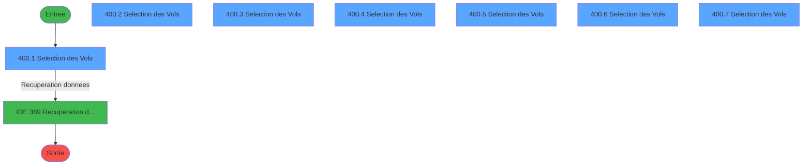
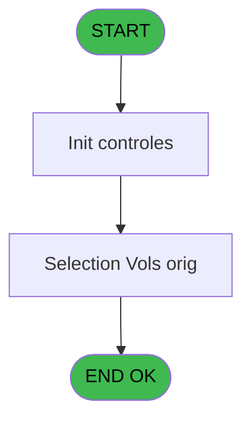
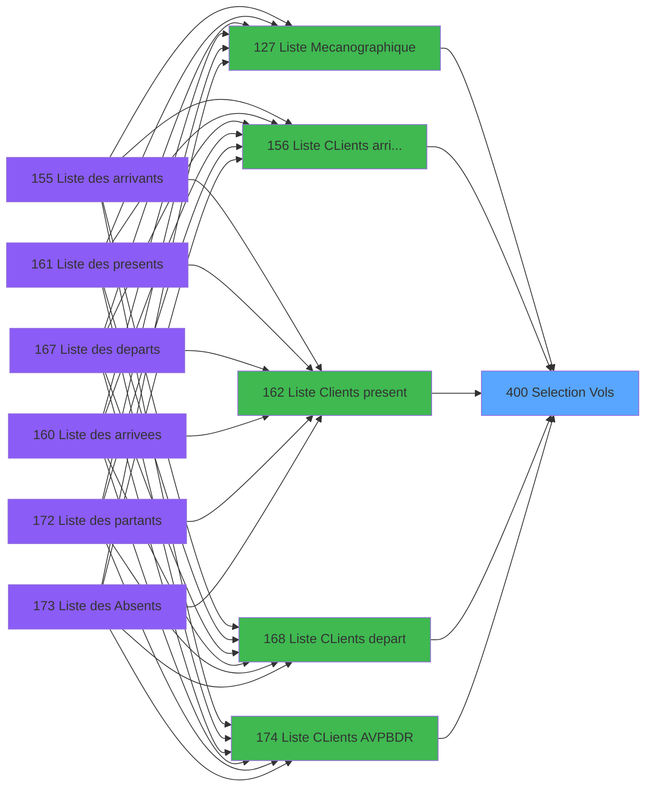
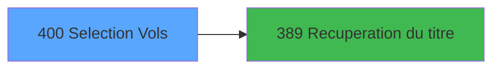

# PBP IDE 400 - Selection Vols

> **Analyse**: Phases 1-4 2026-02-03 16:49 -> 16:50 (17s) | Assemblage 16:50
> **Pipeline**: V7.2 Enrichi
> **Structure**: 4 onglets (Resume | Ecrans | Donnees | Connexions)

<!-- TAB:Resume -->

## 1. FICHE D'IDENTITE

| Attribut | Valeur |
|----------|--------|
| Projet | PBP |
| IDE Position | 400 |
| Nom Programme | Selection Vols |
| Fichier source | `Prg_400.xml` |
| Dossier IDE | Zoom |
| Taches | 8 (7 ecrans visibles) |
| Tables modifiees | 0 |
| Programmes appeles | 1 |

## 2. DESCRIPTION FONCTIONNELLE

**Selection Vols** assure la gestion complete de ce processus, accessible depuis [Liste CLients AVPBDR (IDE 174)](PBP-IDE-174.md), [  Liste Clients present (IDE 162)](PBP-IDE-162.md), [  Liste CLients arrivant (IDE 156)](PBP-IDE-156.md), [  Liste CLients depart (IDE 168)](PBP-IDE-168.md), [  Liste present personnel plan (IDE 227)](PBP-IDE-227.md), [  Liste personnels AVPBDR (IDE 234)](PBP-IDE-234.md), [Liste Mecanographique (IDE 127)](PBP-IDE-127.md).

Le flux de traitement s'organise en **1 blocs fonctionnels** :

- **Consultation** (8 taches) : ecrans de recherche, selection et consultation

**Logique metier** : 1 regles identifiees couvrant conditions metier.

Detail : phases du traitement

#### Phase 1 : Consultation (8 taches)

- **400** - Selection des Vols **[[ECRAN]](#ecran-t1)**
- **400.1** - Selection des Vols **[[ECRAN]](#ecran-t4)**
- **400.2** - Selection des Vols **[[ECRAN]](#ecran-t36)**
- **400.3** - Selection des Vols **[[ECRAN]](#ecran-t39)**
- **400.4** - Selection des Vols **[[ECRAN]](#ecran-t42)**
- **400.5** - Selection des Vols **[[ECRAN]](#ecran-t48)**
- **400.6** - Selection des Vols **[[ECRAN]](#ecran-t54)**
- **400.7** - Selection des Vols **[[ECRAN]](#ecran-t57)**

Delegue a : [Recuperation du titre (IDE 389)](PBP-IDE-389.md)

## 3. BLOCS FONCTIONNELS

### 3.1 Consultation (8 taches)

Ecrans de recherche et consultation.

---

#### 400 - Selection des Vols [[ECRAN]](#ecran-t1)

**Role** : Tache d'orchestration : point d'entree du programme (8 sous-taches). Coordonne l'enchainement des traitements.
**Ecran** : 374 x 165 DLU (MDI) | [Voir mockup](#ecran-t1)

7 sous-taches directes

| Tache | Nom | Bloc |
|-------|-----|------|
| [400.1](#t4) | Selection des Vols **[[ECRAN]](#ecran-t4)** | Consultation |
| [400.2](#t36) | Selection des Vols **[[ECRAN]](#ecran-t36)** | Consultation |
| [400.3](#t39) | Selection des Vols **[[ECRAN]](#ecran-t39)** | Consultation |
| [400.4](#t42) | Selection des Vols **[[ECRAN]](#ecran-t42)** | Consultation |
| [400.5](#t48) | Selection des Vols **[[ECRAN]](#ecran-t48)** | Consultation |
| [400.6](#t54) | Selection des Vols **[[ECRAN]](#ecran-t54)** | Consultation |
| [400.7](#t57) | Selection des Vols **[[ECRAN]](#ecran-t57)** | Consultation |

---

#### 400.1 - Selection des Vols [[ECRAN]](#ecran-t4)

**Role** : Selection par l'operateur : Selection des Vols.
**Ecran** : 361 x 191 DLU (MDI) | [Voir mockup](#ecran-t4)

---

#### 400.2 - Selection des Vols [[ECRAN]](#ecran-t36)

**Role** : Selection par l'operateur : Selection des Vols.
**Ecran** : 441 x 206 DLU (MDI) | [Voir mockup](#ecran-t36)

---

#### 400.3 - Selection des Vols [[ECRAN]](#ecran-t39)

**Role** : Selection par l'operateur : Selection des Vols.
**Ecran** : 441 x 206 DLU (MDI) | [Voir mockup](#ecran-t39)

---

#### 400.4 - Selection des Vols [[ECRAN]](#ecran-t42)

**Role** : Selection par l'operateur : Selection des Vols.
**Ecran** : 441 x 206 DLU (MDI) | [Voir mockup](#ecran-t42)

---

#### 400.5 - Selection des Vols [[ECRAN]](#ecran-t48)

**Role** : Selection par l'operateur : Selection des Vols.
**Ecran** : 441 x 206 DLU (MDI) | [Voir mockup](#ecran-t48)

---

#### 400.6 - Selection des Vols [[ECRAN]](#ecran-t54)

**Role** : Selection par l'operateur : Selection des Vols.
**Ecran** : 441 x 206 DLU (MDI) | [Voir mockup](#ecran-t54)

---

#### 400.7 - Selection des Vols [[ECRAN]](#ecran-t57)

**Role** : Selection par l'operateur : Selection des Vols.
**Ecran** : 441 x 206 DLU (MDI) | [Voir mockup](#ecran-t57)

## 5. REGLES METIER

1 regles identifiees:

### Autres (1 regles)

#### [RM-001] Condition toujours vraie (flag actif)

| Element | Detail |
|---------|--------|
| **Condition** | `{1` |
| **Si vrai** | 7} |
| **Si faux** | 'TRUE'LOG,InStr ('VV1,VV2,VV3',Trim (v.Requête DEP [L]))=0) |
| **Variables** | L (v.Requête DEP) |
| **Expression source** | Expression 25 : `IF ({1,7},'TRUE'LOG,InStr ('VV1,VV2,VV3',Trim (v.Requête DEP` |
| **Exemple** | Si {1 → 7}. Sinon → 'TRUE'LOG,InStr ('VV1,VV2,VV3',Trim (v.Requête DEP [L]))=0) |

## 6. CONTEXTE

- **Appele par**: [Liste CLients AVPBDR (IDE 174)](PBP-IDE-174.md), [  Liste Clients present (IDE 162)](PBP-IDE-162.md), [  Liste CLients arrivant (IDE 156)](PBP-IDE-156.md), [  Liste CLients depart (IDE 168)](PBP-IDE-168.md), [  Liste present personnel plan (IDE 227)](PBP-IDE-227.md), [  Liste personnels AVPBDR (IDE 234)](PBP-IDE-234.md), [Liste Mecanographique (IDE 127)](PBP-IDE-127.md)
- **Appelle**: 1 programmes | **Tables**: 3 (W:0 R:2 L:2) | **Taches**: 8 | **Expressions**: 26

<!-- TAB:Ecrans -->

## 8. ECRANS

### 8.1 Forms visibles (7 / 8)

| # | Position | Tache | Nom | Type | Largeur | Hauteur | Bloc |
|---|----------|-------|-----|------|---------|---------|------|
| 1 | 400.1 | 400.1 | Selection des Vols | MDI | 361 | 191 | Consultation |
| 2 | 400.2 | 400.2 | Selection des Vols | MDI | 441 | 206 | Consultation |
| 3 | 400.3 | 400.3 | Selection des Vols | MDI | 441 | 206 | Consultation |
| 4 | 400.4 | 400.4 | Selection des Vols | MDI | 441 | 206 | Consultation |
| 5 | 400.5 | 400.5 | Selection des Vols | MDI | 441 | 206 | Consultation |
| 6 | 400.7 | 400.6 | Selection des Vols | MDI | 441 | 206 | Consultation |
| 7 | 400.6 | 400.7 | Selection des Vols | MDI | 441 | 206 | Consultation |

### 8.2 Mockups Ecrans

---

#### 400.1 - Selection des Vols
**Tache** : [400.1](#t4) | **Type** : MDI | **Dimensions** : 361 x 191 DLU
**Bloc** : Consultation | **Titre IDE** : Selection des Vols

<!-- FORM-DATA:
{
    "width":  361,
    "vFactor":  8,
    "type":  "MDI",
    "hFactor":  8,
    "controls":  [
                     {
                         "x":  29,
                         "type":  "table",
                         "var":  "",
                         "name":  "",
                         "titleH":  12,
                         "color":  "196",
                         "w":  302,
                         "y":  4,
                         "fmt":  "",
                         "parent":  null,
                         "text":  "",
                         "rowH":  13,
                         "h":  141,
                         "cols":  [
                                      {
                                          "title":  "Vol",
                                          "layer":  1,
                                          "w":  88
                                      },
                                      {
                                          "title":  "Heure",
                                          "layer":  2,
                                          "w":  78
                                      },
                                      {
                                          "title":  "Compagnie",
                                          "layer":  3,
                                          "w":  102
                                      }
                                  ],
                         "rows":  3
                     },
                     {
                         "x":  1,
                         "type":  "label",
                         "var":  "",
                         "y":  172,
                         "w":  360,
                         "fmt":  "",
                         "name":  "",
                         "h":  19,
                         "color":  "",
                         "text":  "",
                         "parent":  null
                     },
                     {
                         "x":  35,
                         "type":  "edit",
                         "var":  "",
                         "y":  18,
                         "w":  82,
                         "fmt":  "",
                         "name":  "VOL Code Vol",
                         "h":  10,
                         "color":  "196",
                         "text":  "",
                         "parent":  1
                     },
                     {
                         "x":  122,
                         "type":  "edit",
                         "var":  "",
                         "y":  18,
                         "w":  72,
                         "fmt":  "HH:MM",
                         "name":  "VOL Heure",
                         "h":  10,
                         "color":  "196",
                         "text":  "",
                         "parent":  1
                     },
                     {
                         "x":  12,
                         "type":  "button",
                         "var":  "",
                         "y":  175,
                         "w":  154,
                         "fmt":  "\u0026Sélectionner",
                         "name":  "bouton select",
                         "h":  14,
                         "color":  "",
                         "text":  "",
                         "parent":  8
                     },
                     {
                         "x":  196,
                         "type":  "button",
                         "var":  "",
                         "y":  175,
                         "w":  154,
                         "fmt":  "\u0026Quitter",
                         "name":  "bouton quitter",
                         "h":  14,
                         "color":  "",
                         "text":  "",
                         "parent":  8
                     },
                     {
                         "x":  151,
                         "type":  "image",
                         "var":  "",
                         "y":  149,
                         "w":  58,
                         "fmt":  "",
                         "name":  "",
                         "h":  18,
                         "color":  "",
                         "text":  "",
                         "parent":  null
                     },
                     {
                         "x":  202,
                         "type":  "edit",
                         "var":  "",
                         "y":  19,
                         "w":  78,
                         "fmt":  "",
                         "name":  "vot_compagnie",
                         "h":  10,
                         "color":  "196",
                         "text":  "",
                         "parent":  1
                     }
                 ],
    "taskId":  "400.1",
    "height":  191
}
-->

<strong>Champs : 3 champs</strong>

| Pos (x,y) | Nom | Variable | Type |
|-----------|-----|----------|------|
| 35,18 | VOL Code Vol | - | edit |
| 122,18 | VOL Heure | - | edit |
| 202,19 | vot_compagnie | - | edit |

<strong>Boutons : 2 boutons</strong>

| Bouton | Pos (x,y) | Action |
|--------|-----------|--------|
| Sélectionner | 12,175 | Bouton fonctionnel |
| Quitter | 196,175 | Quitte le programme |

---

#### 400.2 - Selection des Vols
**Tache** : [400.2](#t36) | **Type** : MDI | **Dimensions** : 441 x 206 DLU
**Bloc** : Consultation | **Titre IDE** : Selection des Vols

<!-- FORM-DATA:
{
    "width":  441,
    "vFactor":  8,
    "type":  "MDI",
    "hFactor":  8,
    "controls":  [
                     {
                         "x":  9,
                         "type":  "table",
                         "var":  "",
                         "name":  "",
                         "titleH":  12,
                         "color":  "196",
                         "w":  422,
                         "y":  4,
                         "fmt":  "",
                         "parent":  null,
                         "text":  "",
                         "rowH":  13,
                         "h":  157,
                         "cols":  [
                                      {
                                          "title":  "Vol",
                                          "layer":  1,
                                          "w":  88
                                      },
                                      {
                                          "title":  "Compagnie",
                                          "layer":  2,
                                          "w":  98
                                      },
                                      {
                                          "title":  "Heure",
                                          "layer":  3,
                                          "w":  83
                                      },
                                      {
                                          "title":  "Heure Village",
                                          "layer":  4,
                                          "w":  118
                                      }
                                  ],
                         "rows":  4
                     },
                     {
                         "x":  0,
                         "type":  "label",
                         "var":  "",
                         "y":  186,
                         "w":  438,
                         "fmt":  "",
                         "name":  "",
                         "h":  19,
                         "color":  "",
                         "text":  "",
                         "parent":  null
                     },
                     {
                         "x":  16,
                         "type":  "edit",
                         "var":  "",
                         "y":  19,
                         "w":  82,
                         "fmt":  "",
                         "name":  "VOL Code Vol",
                         "h":  10,
                         "color":  "196",
                         "text":  "",
                         "parent":  1
                     },
                     {
                         "x":  10,
                         "type":  "button",
                         "var":  "",
                         "y":  189,
                         "w":  154,
                         "fmt":  "\u0026Sélectionner",
                         "name":  "bouton select",
                         "h":  14,
                         "color":  "",
                         "text":  "",
                         "parent":  8
                     },
                     {
                         "x":  276,
                         "type":  "button",
                         "var":  "",
                         "y":  189,
                         "w":  154,
                         "fmt":  "\u0026Quitter",
                         "name":  "bouton quitter",
                         "h":  14,
                         "color":  "",
                         "text":  "",
                         "parent":  8
                     },
                     {
                         "x":  190,
                         "type":  "image",
                         "var":  "",
                         "y":  165,
                         "w":  58,
                         "fmt":  "",
                         "name":  "",
                         "h":  18,
                         "color":  "",
                         "text":  "",
                         "parent":  null
                     },
                     {
                         "x":  106,
                         "type":  "edit",
                         "var":  "",
                         "y":  19,
                         "w":  83,
                         "fmt":  "",
                         "name":  "vot_compagnie",
                         "h":  10,
                         "color":  "196",
                         "text":  "",
                         "parent":  1
                     },
                     {
                         "x":  203,
                         "type":  "edit",
                         "var":  "",
                         "y":  19,
                         "w":  66,
                         "fmt":  "HH:MM",
                         "name":  "vot_heure",
                         "h":  10,
                         "color":  "196",
                         "text":  "",
                         "parent":  1
                     },
                     {
                         "x":  283,
                         "type":  "edit",
                         "var":  "",
                         "y":  19,
                         "w":  111,
                         "fmt":  "",
                         "name":  "v.Heure arrivée Village",
                         "h":  10,
                         "color":  "196",
                         "text":  "",
                         "parent":  1
                     }
                 ],
    "taskId":  "400.2",
    "height":  206
}
-->

<strong>Champs : 4 champs</strong>

| Pos (x,y) | Nom | Variable | Type |
|-----------|-----|----------|------|
| 16,19 | VOL Code Vol | - | edit |
| 106,19 | vot_compagnie | - | edit |
| 203,19 | vot_heure | - | edit |
| 283,19 | v.Heure arrivée Village | - | edit |

<strong>Boutons : 2 boutons</strong>

| Bouton | Pos (x,y) | Action |
|--------|-----------|--------|
| Sélectionner | 10,189 | Bouton fonctionnel |
| Quitter | 276,189 | Quitte le programme |

---

#### 400.3 - Selection des Vols
**Tache** : [400.3](#t39) | **Type** : MDI | **Dimensions** : 441 x 206 DLU
**Bloc** : Consultation | **Titre IDE** : Selection des Vols

<!-- FORM-DATA:
{
    "width":  441,
    "vFactor":  8,
    "type":  "MDI",
    "hFactor":  8,
    "controls":  [
                     {
                         "x":  9,
                         "type":  "table",
                         "var":  "",
                         "name":  "",
                         "titleH":  12,
                         "color":  "196",
                         "w":  422,
                         "y":  4,
                         "fmt":  "",
                         "parent":  null,
                         "text":  "",
                         "rowH":  13,
                         "h":  157,
                         "cols":  [
                                      {
                                          "title":  "Vol",
                                          "layer":  1,
                                          "w":  88
                                      },
                                      {
                                          "title":  "Compagnie",
                                          "layer":  2,
                                          "w":  98
                                      },
                                      {
                                          "title":  "Heure",
                                          "layer":  3,
                                          "w":  83
                                      },
                                      {
                                          "title":  "Heure Village",
                                          "layer":  4,
                                          "w":  118
                                      }
                                  ],
                         "rows":  4
                     },
                     {
                         "x":  0,
                         "type":  "label",
                         "var":  "",
                         "y":  186,
                         "w":  438,
                         "fmt":  "",
                         "name":  "",
                         "h":  19,
                         "color":  "",
                         "text":  "",
                         "parent":  null
                     },
                     {
                         "x":  16,
                         "type":  "edit",
                         "var":  "",
                         "y":  19,
                         "w":  82,
                         "fmt":  "",
                         "name":  "VOL Code Vol",
                         "h":  10,
                         "color":  "196",
                         "text":  "",
                         "parent":  1
                     },
                     {
                         "x":  10,
                         "type":  "button",
                         "var":  "",
                         "y":  189,
                         "w":  154,
                         "fmt":  "\u0026Sélectionner",
                         "name":  "bouton select",
                         "h":  14,
                         "color":  "",
                         "text":  "",
                         "parent":  8
                     },
                     {
                         "x":  276,
                         "type":  "button",
                         "var":  "",
                         "y":  189,
                         "w":  154,
                         "fmt":  "\u0026Quitter",
                         "name":  "bouton quitter",
                         "h":  14,
                         "color":  "",
                         "text":  "",
                         "parent":  8
                     },
                     {
                         "x":  190,
                         "type":  "image",
                         "var":  "",
                         "y":  165,
                         "w":  58,
                         "fmt":  "",
                         "name":  "",
                         "h":  18,
                         "color":  "",
                         "text":  "",
                         "parent":  null
                     },
                     {
                         "x":  106,
                         "type":  "edit",
                         "var":  "",
                         "y":  19,
                         "w":  83,
                         "fmt":  "",
                         "name":  "vot_compagnie",
                         "h":  10,
                         "color":  "196",
                         "text":  "",
                         "parent":  1
                     },
                     {
                         "x":  203,
                         "type":  "edit",
                         "var":  "",
                         "y":  19,
                         "w":  66,
                         "fmt":  "HH:MM",
                         "name":  "vot_heure",
                         "h":  10,
                         "color":  "196",
                         "text":  "",
                         "parent":  1
                     },
                     {
                         "x":  283,
                         "type":  "edit",
                         "var":  "",
                         "y":  19,
                         "w":  111,
                         "fmt":  "",
                         "name":  "v.Heure arrivée Village",
                         "h":  10,
                         "color":  "196",
                         "text":  "",
                         "parent":  1
                     }
                 ],
    "taskId":  "400.3",
    "height":  206
}
-->

<strong>Champs : 4 champs</strong>

| Pos (x,y) | Nom | Variable | Type |
|-----------|-----|----------|------|
| 16,19 | VOL Code Vol | - | edit |
| 106,19 | vot_compagnie | - | edit |
| 203,19 | vot_heure | - | edit |
| 283,19 | v.Heure arrivée Village | - | edit |

<strong>Boutons : 2 boutons</strong>

| Bouton | Pos (x,y) | Action |
|--------|-----------|--------|
| Sélectionner | 10,189 | Bouton fonctionnel |
| Quitter | 276,189 | Quitte le programme |

---

#### 400.4 - Selection des Vols
**Tache** : [400.4](#t42) | **Type** : MDI | **Dimensions** : 441 x 206 DLU
**Bloc** : Consultation | **Titre IDE** : Selection des Vols

<!-- FORM-DATA:
{
    "width":  441,
    "vFactor":  8,
    "type":  "MDI",
    "hFactor":  8,
    "controls":  [
                     {
                         "x":  9,
                         "type":  "table",
                         "var":  "",
                         "name":  "",
                         "titleH":  12,
                         "color":  "196",
                         "w":  422,
                         "y":  4,
                         "fmt":  "",
                         "parent":  null,
                         "text":  "",
                         "rowH":  13,
                         "h":  157,
                         "cols":  [
                                      {
                                          "title":  "Vol",
                                          "layer":  1,
                                          "w":  88
                                      },
                                      {
                                          "title":  "Compagnie",
                                          "layer":  2,
                                          "w":  98
                                      },
                                      {
                                          "title":  "Heure",
                                          "layer":  3,
                                          "w":  83
                                      },
                                      {
                                          "title":  "Heure Village",
                                          "layer":  4,
                                          "w":  118
                                      }
                                  ],
                         "rows":  4
                     },
                     {
                         "x":  0,
                         "type":  "label",
                         "var":  "",
                         "y":  186,
                         "w":  438,
                         "fmt":  "",
                         "name":  "",
                         "h":  19,
                         "color":  "",
                         "text":  "",
                         "parent":  null
                     },
                     {
                         "x":  16,
                         "type":  "edit",
                         "var":  "",
                         "y":  19,
                         "w":  82,
                         "fmt":  "",
                         "name":  "VOL Code Vol",
                         "h":  10,
                         "color":  "196",
                         "text":  "",
                         "parent":  1
                     },
                     {
                         "x":  10,
                         "type":  "button",
                         "var":  "",
                         "y":  189,
                         "w":  154,
                         "fmt":  "\u0026Sélectionner",
                         "name":  "bouton select",
                         "h":  14,
                         "color":  "",
                         "text":  "",
                         "parent":  8
                     },
                     {
                         "x":  276,
                         "type":  "button",
                         "var":  "",
                         "y":  189,
                         "w":  154,
                         "fmt":  "\u0026Quitter",
                         "name":  "bouton quitter",
                         "h":  14,
                         "color":  "",
                         "text":  "",
                         "parent":  8
                     },
                     {
                         "x":  190,
                         "type":  "image",
                         "var":  "",
                         "y":  165,
                         "w":  58,
                         "fmt":  "",
                         "name":  "",
                         "h":  18,
                         "color":  "",
                         "text":  "",
                         "parent":  null
                     },
                     {
                         "x":  106,
                         "type":  "edit",
                         "var":  "",
                         "y":  19,
                         "w":  83,
                         "fmt":  "",
                         "name":  "vot_compagnie",
                         "h":  10,
                         "color":  "196",
                         "text":  "",
                         "parent":  1
                     },
                     {
                         "x":  203,
                         "type":  "edit",
                         "var":  "",
                         "y":  19,
                         "w":  66,
                         "fmt":  "HH:MM",
                         "name":  "vot_heure",
                         "h":  10,
                         "color":  "196",
                         "text":  "",
                         "parent":  1
                     },
                     {
                         "x":  283,
                         "type":  "edit",
                         "var":  "",
                         "y":  19,
                         "w":  111,
                         "fmt":  "",
                         "name":  "v.Heure arrivée Village",
                         "h":  10,
                         "color":  "196",
                         "text":  "",
                         "parent":  1
                     }
                 ],
    "taskId":  "400.4",
    "height":  206
}
-->

<strong>Champs : 4 champs</strong>

| Pos (x,y) | Nom | Variable | Type |
|-----------|-----|----------|------|
| 16,19 | VOL Code Vol | - | edit |
| 106,19 | vot_compagnie | - | edit |
| 203,19 | vot_heure | - | edit |
| 283,19 | v.Heure arrivée Village | - | edit |

<strong>Boutons : 2 boutons</strong>

| Bouton | Pos (x,y) | Action |
|--------|-----------|--------|
| Sélectionner | 10,189 | Bouton fonctionnel |
| Quitter | 276,189 | Quitte le programme |

---

#### 400.5 - Selection des Vols
**Tache** : [400.5](#t48) | **Type** : MDI | **Dimensions** : 441 x 206 DLU
**Bloc** : Consultation | **Titre IDE** : Selection des Vols

<!-- FORM-DATA:
{
    "width":  441,
    "vFactor":  8,
    "type":  "MDI",
    "hFactor":  8,
    "controls":  [
                     {
                         "x":  9,
                         "type":  "table",
                         "var":  "",
                         "name":  "",
                         "titleH":  12,
                         "color":  "196",
                         "w":  422,
                         "y":  4,
                         "fmt":  "",
                         "parent":  null,
                         "text":  "",
                         "rowH":  13,
                         "h":  157,
                         "cols":  [
                                      {
                                          "title":  "Vol",
                                          "layer":  1,
                                          "w":  88
                                      },
                                      {
                                          "title":  "Compagnie",
                                          "layer":  2,
                                          "w":  98
                                      },
                                      {
                                          "title":  "Heure",
                                          "layer":  3,
                                          "w":  83
                                      },
                                      {
                                          "title":  "Heure Village",
                                          "layer":  4,
                                          "w":  118
                                      }
                                  ],
                         "rows":  4
                     },
                     {
                         "x":  0,
                         "type":  "label",
                         "var":  "",
                         "y":  186,
                         "w":  438,
                         "fmt":  "",
                         "name":  "",
                         "h":  19,
                         "color":  "",
                         "text":  "",
                         "parent":  null
                     },
                     {
                         "x":  16,
                         "type":  "edit",
                         "var":  "",
                         "y":  19,
                         "w":  82,
                         "fmt":  "",
                         "name":  "VOL Code Vol",
                         "h":  10,
                         "color":  "196",
                         "text":  "",
                         "parent":  1
                     },
                     {
                         "x":  10,
                         "type":  "button",
                         "var":  "",
                         "y":  189,
                         "w":  154,
                         "fmt":  "\u0026Sélectionner",
                         "name":  "bouton select",
                         "h":  14,
                         "color":  "",
                         "text":  "",
                         "parent":  8
                     },
                     {
                         "x":  276,
                         "type":  "button",
                         "var":  "",
                         "y":  189,
                         "w":  154,
                         "fmt":  "\u0026Quitter",
                         "name":  "bouton quitter",
                         "h":  14,
                         "color":  "",
                         "text":  "",
                         "parent":  8
                     },
                     {
                         "x":  190,
                         "type":  "image",
                         "var":  "",
                         "y":  165,
                         "w":  58,
                         "fmt":  "",
                         "name":  "",
                         "h":  18,
                         "color":  "",
                         "text":  "",
                         "parent":  null
                     },
                     {
                         "x":  106,
                         "type":  "edit",
                         "var":  "",
                         "y":  19,
                         "w":  83,
                         "fmt":  "",
                         "name":  "vot_compagnie",
                         "h":  10,
                         "color":  "196",
                         "text":  "",
                         "parent":  1
                     },
                     {
                         "x":  203,
                         "type":  "edit",
                         "var":  "",
                         "y":  19,
                         "w":  66,
                         "fmt":  "HH:MM",
                         "name":  "vot_heure",
                         "h":  10,
                         "color":  "196",
                         "text":  "",
                         "parent":  1
                     },
                     {
                         "x":  283,
                         "type":  "edit",
                         "var":  "",
                         "y":  19,
                         "w":  111,
                         "fmt":  "",
                         "name":  "v.Heure arrivée Village",
                         "h":  10,
                         "color":  "196",
                         "text":  "",
                         "parent":  1
                     }
                 ],
    "taskId":  "400.5",
    "height":  206
}
-->

<strong>Champs : 4 champs</strong>

| Pos (x,y) | Nom | Variable | Type |
|-----------|-----|----------|------|
| 16,19 | VOL Code Vol | - | edit |
| 106,19 | vot_compagnie | - | edit |
| 203,19 | vot_heure | - | edit |
| 283,19 | v.Heure arrivée Village | - | edit |

<strong>Boutons : 2 boutons</strong>

| Bouton | Pos (x,y) | Action |
|--------|-----------|--------|
| Sélectionner | 10,189 | Bouton fonctionnel |
| Quitter | 276,189 | Quitte le programme |

---

#### 400.7 - Selection des Vols
**Tache** : [400.6](#t54) | **Type** : MDI | **Dimensions** : 441 x 206 DLU
**Bloc** : Consultation | **Titre IDE** : Selection des Vols

<!-- FORM-DATA:
{
    "width":  441,
    "vFactor":  8,
    "type":  "MDI",
    "hFactor":  8,
    "controls":  [
                     {
                         "x":  9,
                         "type":  "table",
                         "var":  "",
                         "name":  "",
                         "titleH":  12,
                         "color":  "196",
                         "w":  422,
                         "y":  4,
                         "fmt":  "",
                         "parent":  null,
                         "text":  "",
                         "rowH":  13,
                         "h":  157,
                         "cols":  [
                                      {
                                          "title":  "Vol",
                                          "layer":  1,
                                          "w":  88
                                      },
                                      {
                                          "title":  "Compagnie",
                                          "layer":  2,
                                          "w":  98
                                      },
                                      {
                                          "title":  "Heure",
                                          "layer":  3,
                                          "w":  83
                                      },
                                      {
                                          "title":  "Heure Village",
                                          "layer":  4,
                                          "w":  118
                                      }
                                  ],
                         "rows":  4
                     },
                     {
                         "x":  0,
                         "type":  "label",
                         "var":  "",
                         "y":  186,
                         "w":  438,
                         "fmt":  "",
                         "name":  "",
                         "h":  19,
                         "color":  "",
                         "text":  "",
                         "parent":  null
                     },
                     {
                         "x":  16,
                         "type":  "edit",
                         "var":  "",
                         "y":  19,
                         "w":  82,
                         "fmt":  "",
                         "name":  "VOL Code Vol",
                         "h":  10,
                         "color":  "196",
                         "text":  "",
                         "parent":  1
                     },
                     {
                         "x":  10,
                         "type":  "button",
                         "var":  "",
                         "y":  189,
                         "w":  154,
                         "fmt":  "\u0026Sélectionner",
                         "name":  "bouton select",
                         "h":  14,
                         "color":  "",
                         "text":  "",
                         "parent":  8
                     },
                     {
                         "x":  276,
                         "type":  "button",
                         "var":  "",
                         "y":  189,
                         "w":  154,
                         "fmt":  "\u0026Quitter",
                         "name":  "bouton quitter",
                         "h":  14,
                         "color":  "",
                         "text":  "",
                         "parent":  8
                     },
                     {
                         "x":  190,
                         "type":  "image",
                         "var":  "",
                         "y":  165,
                         "w":  58,
                         "fmt":  "",
                         "name":  "",
                         "h":  18,
                         "color":  "",
                         "text":  "",
                         "parent":  null
                     },
                     {
                         "x":  106,
                         "type":  "edit",
                         "var":  "",
                         "y":  19,
                         "w":  83,
                         "fmt":  "",
                         "name":  "vot_compagnie",
                         "h":  10,
                         "color":  "196",
                         "text":  "",
                         "parent":  1
                     },
                     {
                         "x":  203,
                         "type":  "edit",
                         "var":  "",
                         "y":  19,
                         "w":  66,
                         "fmt":  "HH:MM",
                         "name":  "vot_heure",
                         "h":  10,
                         "color":  "196",
                         "text":  "",
                         "parent":  1
                     },
                     {
                         "x":  283,
                         "type":  "edit",
                         "var":  "",
                         "y":  19,
                         "w":  111,
                         "fmt":  "",
                         "name":  "v.Heure arrivée Village",
                         "h":  10,
                         "color":  "196",
                         "text":  "",
                         "parent":  1
                     }
                 ],
    "taskId":  "400.7",
    "height":  206
}
-->

<strong>Champs : 4 champs</strong>

| Pos (x,y) | Nom | Variable | Type |
|-----------|-----|----------|------|
| 16,19 | VOL Code Vol | - | edit |
| 106,19 | vot_compagnie | - | edit |
| 203,19 | vot_heure | - | edit |
| 283,19 | v.Heure arrivée Village | - | edit |

<strong>Boutons : 2 boutons</strong>

| Bouton | Pos (x,y) | Action |
|--------|-----------|--------|
| Sélectionner | 10,189 | Bouton fonctionnel |
| Quitter | 276,189 | Quitte le programme |

---

#### 400.6 - Selection des Vols
**Tache** : [400.7](#t57) | **Type** : MDI | **Dimensions** : 441 x 206 DLU
**Bloc** : Consultation | **Titre IDE** : Selection des Vols

<!-- FORM-DATA:
{
    "width":  441,
    "vFactor":  8,
    "type":  "MDI",
    "hFactor":  8,
    "controls":  [
                     {
                         "x":  9,
                         "type":  "table",
                         "var":  "",
                         "name":  "",
                         "titleH":  12,
                         "color":  "196",
                         "w":  422,
                         "y":  4,
                         "fmt":  "",
                         "parent":  null,
                         "text":  "",
                         "rowH":  13,
                         "h":  157,
                         "cols":  [
                                      {
                                          "title":  "Vol",
                                          "layer":  1,
                                          "w":  88
                                      },
                                      {
                                          "title":  "Compagnie",
                                          "layer":  2,
                                          "w":  98
                                      },
                                      {
                                          "title":  "Heure",
                                          "layer":  3,
                                          "w":  83
                                      },
                                      {
                                          "title":  "Heure Village",
                                          "layer":  4,
                                          "w":  118
                                      }
                                  ],
                         "rows":  4
                     },
                     {
                         "x":  0,
                         "type":  "label",
                         "var":  "",
                         "y":  186,
                         "w":  438,
                         "fmt":  "",
                         "name":  "",
                         "h":  19,
                         "color":  "",
                         "text":  "",
                         "parent":  null
                     },
                     {
                         "x":  16,
                         "type":  "edit",
                         "var":  "",
                         "y":  19,
                         "w":  82,
                         "fmt":  "",
                         "name":  "VOL Code Vol",
                         "h":  10,
                         "color":  "196",
                         "text":  "",
                         "parent":  1
                     },
                     {
                         "x":  10,
                         "type":  "button",
                         "var":  "",
                         "y":  189,
                         "w":  154,
                         "fmt":  "\u0026Sélectionner",
                         "name":  "bouton select",
                         "h":  14,
                         "color":  "",
                         "text":  "",
                         "parent":  8
                     },
                     {
                         "x":  276,
                         "type":  "button",
                         "var":  "",
                         "y":  189,
                         "w":  154,
                         "fmt":  "\u0026Quitter",
                         "name":  "bouton quitter",
                         "h":  14,
                         "color":  "",
                         "text":  "",
                         "parent":  8
                     },
                     {
                         "x":  190,
                         "type":  "image",
                         "var":  "",
                         "y":  165,
                         "w":  58,
                         "fmt":  "",
                         "name":  "",
                         "h":  18,
                         "color":  "",
                         "text":  "",
                         "parent":  null
                     },
                     {
                         "x":  106,
                         "type":  "edit",
                         "var":  "",
                         "y":  19,
                         "w":  83,
                         "fmt":  "",
                         "name":  "vot_compagnie",
                         "h":  10,
                         "color":  "196",
                         "text":  "",
                         "parent":  1
                     },
                     {
                         "x":  203,
                         "type":  "edit",
                         "var":  "",
                         "y":  19,
                         "w":  66,
                         "fmt":  "HH:MM",
                         "name":  "vot_heure",
                         "h":  10,
                         "color":  "196",
                         "text":  "",
                         "parent":  1
                     },
                     {
                         "x":  283,
                         "type":  "edit",
                         "var":  "",
                         "y":  19,
                         "w":  111,
                         "fmt":  "",
                         "name":  "v.Heure arrivée Village",
                         "h":  10,
                         "color":  "196",
                         "text":  "",
                         "parent":  1
                     }
                 ],
    "taskId":  "400.6",
    "height":  206
}
-->

<strong>Champs : 4 champs</strong>

| Pos (x,y) | Nom | Variable | Type |
|-----------|-----|----------|------|
| 16,19 | VOL Code Vol | - | edit |
| 106,19 | vot_compagnie | - | edit |
| 203,19 | vot_heure | - | edit |
| 283,19 | v.Heure arrivée Village | - | edit |

<strong>Boutons : 2 boutons</strong>

| Bouton | Pos (x,y) | Action |
|--------|-----------|--------|
| Sélectionner | 10,189 | Bouton fonctionnel |
| Quitter | 276,189 | Quitte le programme |

## 9. NAVIGATION

### 9.1 Enchainement des ecrans

**Detail par enchainement :**

| Depuis | Action | Vers | Retour |
|--------|--------|------|--------|
| Selection des Vols | Recuperation donnees | [Recuperation du titre (IDE 389)](PBP-IDE-389.md) | Retour ecran |

### 9.3 Structure hierarchique (8 taches)

| Position | Tache | Type | Dimensions | Bloc |
|----------|-------|------|------------|------|
| **400.1** | [**Selection des Vols** (400)](#t1) [mockup](#ecran-t1) | MDI | 374x165 | Consultation |
| 400.1.1 | [Selection des Vols (400.1)](#t4) [mockup](#ecran-t4) | MDI | 361x191 | |
| 400.1.2 | [Selection des Vols (400.2)](#t36) [mockup](#ecran-t36) | MDI | 441x206 | |
| 400.1.3 | [Selection des Vols (400.3)](#t39) [mockup](#ecran-t39) | MDI | 441x206 | |
| 400.1.4 | [Selection des Vols (400.4)](#t42) [mockup](#ecran-t42) | MDI | 441x206 | |
| 400.1.5 | [Selection des Vols (400.5)](#t48) [mockup](#ecran-t48) | MDI | 441x206 | |
| 400.1.6 | [Selection des Vols (400.6)](#t54) [mockup](#ecran-t54) | MDI | 441x206 | |
| 400.1.7 | [Selection des Vols (400.7)](#t57) [mockup](#ecran-t57) | MDI | 441x206 | |

### 9.4 Algorigramme

> **Legende**: Vert = START/END OK | Rouge = END KO | Bleu = Decisions
> *Algorigramme auto-genere. Utiliser `/algorigramme` pour une synthese metier detaillee.*

<!-- TAB:Donnees -->

## 10. TABLES

### Tables utilisees (3)

| ID | Nom | Description | Type | R | W | L | Usages |
|----|-----|-------------|------|---|---|---|--------|
| 132 | code_vol_________vot |  | DB | R |   | L | 7 |
| 134 | groupe_arr_dep___vol |  | DB | R |   |   | 1 |
| 1021 | Table_1021 |  | MEM |   |   | L | 6 |

### Colonnes par table (2 / 2 tables avec colonnes identifiees)

Table 132 - code_vol_________vot (R/L) - 7 usages

| Lettre | Variable | Acces | Type |
|--------|----------|-------|------|
| A | P.requete complémentaire | R | Unicode |
| F | v.Requete SQL | R | Unicode |
| G | v.Requete SQL | R | Unicode |

Table 134 - groupe_arr_dep___vol (R) - 1 usages

| Lettre | Variable | Acces | Type |
|--------|----------|-------|------|
| A | v.vol? | R | Logical |
| B | v.Autorisation quitter | R | Logical |
| C | bouton select | R | Alpha |
| D | bouton quitter | R | Alpha |
| E | v.Titre | R | Alpha |
| F | v.Heure du vol | R | Time |

## 11. VARIABLES

### 11.1 Parametres entrants (9)

Variables recues du programme appelant ([Liste CLients AVPBDR (IDE 174)](PBP-IDE-174.md)).

| Lettre | Nom | Type | Usage dans |
|--------|-----|------|-----------|
| A | p.i.Date | Date | - |
| B | p.i.o.N°Vol | Alpha | - |
| C | p.i.o Compagnie | Alpha | - |
| D | p.i.TypeVol | Alpha | - |
| E | p.i.CatMin | Alpha | - |
| F | p.i.CatMax | Alpha | - |
| G | p.o.Heure min | Numeric | - |
| H | p.i.Affiche VV | Logical | - |
| I | p.i.Type Liste | Unicode | - |

### 11.2 Variables de session (7)

Variables persistantes pendant toute la session.

| Lettre | Nom | Type | Usage dans |
|--------|-----|------|-----------|
| J | v.Titre | Alpha | - |
| K | v.Requête MEC | Alpha | - |
| L | v.Requête DEP | Alpha | 1x session |
| M | v.Heure du vol | Time | 1x session |
| N | v.Duree transfert | Time | - |
| O | v.Heure arrivée Village | Time | 1x session |
| P | v.Heure arrivée Village 24H | Time | - |

Toutes les 16 variables (liste complete)

| Cat | Lettre | Nom Variable | Type |
|-----|--------|--------------|------|
| P0 | **A** | p.i.Date | Date |
| P0 | **B** | p.i.o.N°Vol | Alpha |
| P0 | **C** | p.i.o Compagnie | Alpha |
| P0 | **D** | p.i.TypeVol | Alpha |
| P0 | **E** | p.i.CatMin | Alpha |
| P0 | **F** | p.i.CatMax | Alpha |
| P0 | **G** | p.o.Heure min | Numeric |
| P0 | **H** | p.i.Affiche VV | Logical |
| P0 | **I** | p.i.Type Liste | Unicode |
| V. | **J** | v.Titre | Alpha |
| V. | **K** | v.Requête MEC | Alpha |
| V. | **L** | v.Requête DEP | Alpha |
| V. | **M** | v.Heure du vol | Time |
| V. | **N** | v.Duree transfert | Time |
| V. | **O** | v.Heure arrivée Village | Time |
| V. | **P** | v.Heure arrivée Village 24H | Time |

## 12. EXPRESSIONS

**26 / 26 expressions decodees (100%)**

### 12.1 Repartition par type

| Type | Expressions | Regles |
|------|-------------|--------|
| CAST_LOGIQUE | 3 | 5 |
| CONSTANTE | 7 | 0 |
| NEGATION | 1 | 0 |
| OTHER | 9 | 0 |
| CONDITION | 5 | 0 |
| STRING | 1 | 0 |

### 12.2 Expressions cles par type

#### CAST_LOGIQUE (3 expressions)

| Type | IDE | Expression | Regle |
|------|-----|------------|-------|
| CAST_LOGIQUE | 25 | `IF ({1,7},'TRUE'LOG,InStr ('VV1,VV2,VV3',Trim (v.Requête DEP [L]))=0)` | [RM-001](#rm-RM-001) |
| CAST_LOGIQUE | 22 | `'TRUE'LOG` | - |
| CAST_LOGIQUE | 11 | `CASE('TRUE'LOG,
    [AN]='MEC',[AP],
    [AN]='DEP',[AQ],'')` | - |

#### CONSTANTE (7 expressions)

| Type | IDE | Expression | Regle |
|------|-----|------------|-------|
| CONSTANTE | 15 | `'&Quitter'` | - |
| CONSTANTE | 23 | `''` | - |
| CONSTANTE | 24 | `0` | - |
| CONSTANTE | 14 | `'&Selectionner'` | - |
| CONSTANTE | 1 | `1` | - |
| ... | | *+2 autres* | |

#### NEGATION (1 expressions)

| Type | IDE | Expression | Regle |
|------|-----|------------|-------|
| NEGATION | 2 | `NOT VG88` | - |

#### OTHER (9 expressions)

| Type | IDE | Expression | Regle |
|------|-----|------------|-------|
| OTHER | 20 | `{1,5}` | - |
| OTHER | 19 | `{1,4}` | - |
| OTHER | 26 | `v.Heure arrivée Village [O]` | - |
| OTHER | 21 | `{1,2}` | - |
| OTHER | 18 | `{1,1}` | - |
| ... | | *+4 autres* | |

#### CONDITION (5 expressions)

| Type | IDE | Expression | Regle |
|------|-----|------------|-------|
| CONDITION | 7 | `[AN]='PEP'` | - |
| CONDITION | 8 | `[AN]='PEA'` | - |
| CONDITION | 6 | `[AN]='AVP'` | - |
| CONDITION | 4 | `[AN]='ARR'` | - |
| CONDITION | 5 | `[AN]='PRE'` | - |

#### STRING (1 expressions)

| Type | IDE | Expression | Regle |
|------|-----|------------|-------|
| STRING | 13 | `Trim ({1,18})` | - |

### 12.3 Toutes les expressions (26)

Voir les 26 expressions

#### CAST_LOGIQUE (3)

| IDE | Expression Decodee |
|-----|-------------------|
| 11 | `CASE('TRUE'LOG,
    [AN]='MEC',[AP],
    [AN]='DEP',[AQ],'')` |
| 25 | `IF ({1,7},'TRUE'LOG,InStr ('VV1,VV2,VV3',Trim (v.Requête DEP [L]))=0)` |
| 22 | `'TRUE'LOG` |

#### CONSTANTE (7)

| IDE | Expression Decodee |
|-----|-------------------|
| 1 | `1` |
| 9 | `'[cafil008_dat]
	INNER JOIN  [cafil012_dat]
	ON [gmr_societe] = [heb_societe]
	AND [gmr_code_gm] = [heb_num_compte]
	AND [gmr_filiation_villag] = [heb_filiation]
	INNER JOIN [view_arrivees_retours] 
  	ON [heb_societe] = [vad_societe]
	AND [heb_nom_logement] = [vad_code_vol]'` |
| 10 | `'[view_arrivees_retours]
INNER JOIN [cafil012_dat]
	ON [vad_societe] = [heb_societe]
	AND [vad_date] = [heb_date_debut]
	AND [vad_heure] = [heb_heure_debut]'` |
| 14 | `'&Selectionner'` |
| 15 | `'&Quitter'` |
| 23 | `''` |
| 24 | `0` |

#### NEGATION (1)

| IDE | Expression Decodee |
|-----|-------------------|
| 2 | `NOT VG88` |

#### OTHER (9)

| IDE | Expression Decodee |
|-----|-------------------|
| 3 | `IN([AN],'MEC','DEP')` |
| 12 | `v.Heure du vol [M]` |
| 16 | `GetParam ('SOCIETE')` |
| 17 | `{1,3}` |
| 18 | `{1,1}` |
| 19 | `{1,4}` |
| 20 | `{1,5}` |
| 21 | `{1,2}` |
| 26 | `v.Heure arrivée Village [O]` |

#### CONDITION (5)

| IDE | Expression Decodee |
|-----|-------------------|
| 4 | `[AN]='ARR'` |
| 5 | `[AN]='PRE'` |
| 6 | `[AN]='AVP'` |
| 7 | `[AN]='PEP'` |
| 8 | `[AN]='PEA'` |

#### STRING (1)

| IDE | Expression Decodee |
|-----|-------------------|
| 13 | `Trim ({1,18})` |

<!-- TAB:Connexions -->

## 13. GRAPHE D'APPELS

### 13.1 Chaine depuis Main (Callers)

Main -> ... -> [Liste CLients AVPBDR (IDE 174)](PBP-IDE-174.md) -> **Selection Vols (IDE 400)**

Main -> ... -> [  Liste Clients present (IDE 162)](PBP-IDE-162.md) -> **Selection Vols (IDE 400)**

Main -> ... -> [  Liste CLients arrivant (IDE 156)](PBP-IDE-156.md) -> **Selection Vols (IDE 400)**

Main -> ... -> [  Liste CLients depart (IDE 168)](PBP-IDE-168.md) -> **Selection Vols (IDE 400)**

Main -> ... -> [  Liste present personnel plan (IDE 227)](PBP-IDE-227.md) -> **Selection Vols (IDE 400)**

Main -> ... -> [  Liste personnels AVPBDR (IDE 234)](PBP-IDE-234.md) -> **Selection Vols (IDE 400)**

Main -> ... -> [Liste Mecanographique (IDE 127)](PBP-IDE-127.md) -> **Selection Vols (IDE 400)**

### 13.2 Callers

| IDE | Nom Programme | Nb Appels |
|-----|---------------|-----------|
| [174](PBP-IDE-174.md) | Liste CLients AVPBDR | 6 |
| [162](PBP-IDE-162.md) |   Liste Clients present | 4 |
| [156](PBP-IDE-156.md) |   Liste CLients arrivant | 3 |
| [168](PBP-IDE-168.md) |   Liste CLients depart | 3 |
| [227](PBP-IDE-227.md) |   Liste present personnel plan | 3 |
| [234](PBP-IDE-234.md) |   Liste personnels AVPBDR | 3 |
| [127](PBP-IDE-127.md) | Liste Mecanographique | 2 |

### 13.3 Callees (programmes appeles)

### 13.4 Detail Callees avec contexte

| IDE | Nom Programme | Appels | Contexte |
|-----|---------------|--------|----------|
| [389](PBP-IDE-389.md) | Recuperation du titre | 1 | Recuperation donnees |

## 14. RECOMMANDATIONS MIGRATION

### 14.1 Profil du programme

| Metrique | Valeur | Impact migration |
|----------|--------|-----------------|
| Lignes de logique | 428 | Taille moyenne |
| Expressions | 26 | Peu de logique |
| Tables WRITE | 0 | Impact faible |
| Sous-programmes | 1 | Peu de dependances |
| Ecrans visibles | 7 | Interface complexe multi-ecrans |
| Code desactive | 0% (0 / 428) | Code sain |
| Regles metier | 1 | Quelques regles a preserver |

### 14.2 Plan de migration par bloc

#### Consultation (8 taches: 8 ecrans, 0 traitement)

- **Strategie** : Composants de recherche/selection en modales.
- 8 ecrans : Selection des Vols, Selection des Vols, Selection des Vols, Selection des Vols, Selection des Vols, Selection des Vols, Selection des Vols, Selection des Vols

### 14.3 Dependances critiques

| Dependance | Type | Appels | Impact |
|------------|------|--------|--------|
| [Recuperation du titre (IDE 389)](PBP-IDE-389.md) | Sous-programme | 1x | Normale - Recuperation donnees |

---
*Spec DETAILED generee par Pipeline V7.2 - 2026-02-03 16:50*
