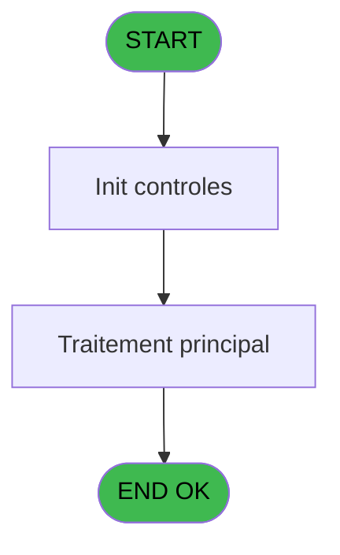
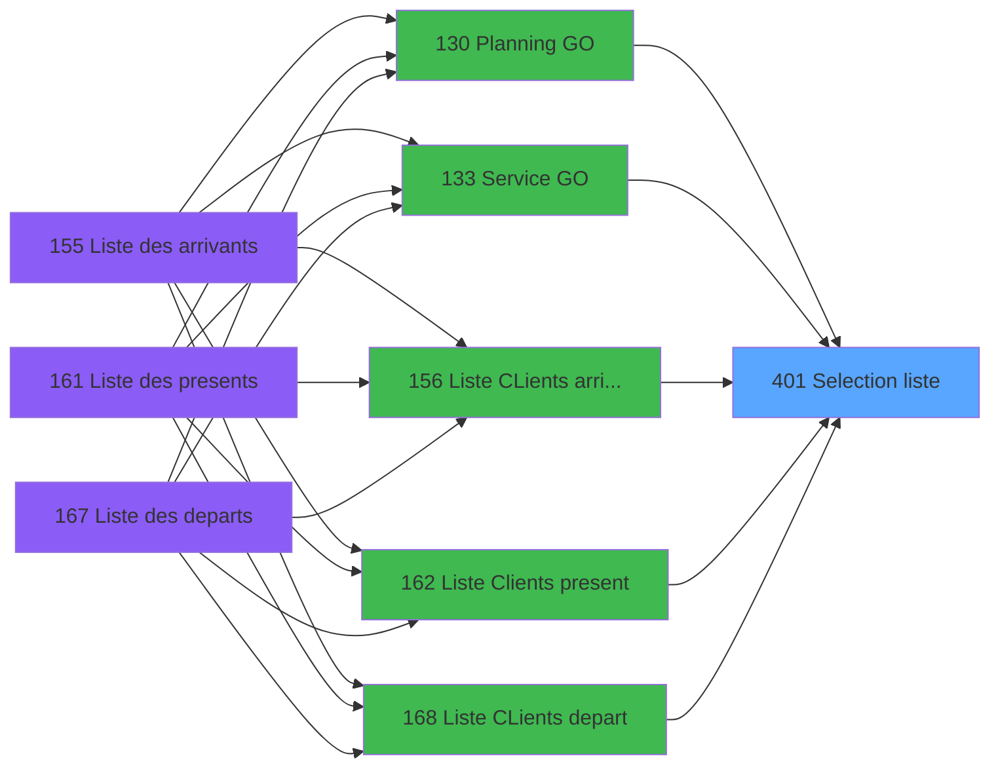
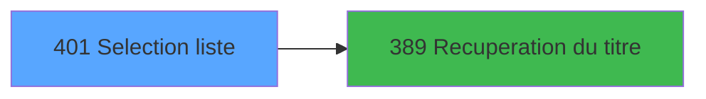

# PBP IDE 401 - Selection liste

> **Analyse**: Phases 1-4 2026-02-03 16:50 -> 16:50 (24s) | Assemblage 16:50
> **Pipeline**: V7.2 Enrichi
> **Structure**: 4 onglets (Resume | Ecrans | Donnees | Connexions)

<!-- TAB:Resume -->

## 1. FICHE D'IDENTITE

| Attribut | Valeur |
|----------|--------|
| Projet | PBP |
| IDE Position | 401 |
| Nom Programme | Selection liste |
| Fichier source | `Prg_401.xml` |
| Dossier IDE | Zoom |
| Taches | 1 (1 ecrans visibles) |
| Tables modifiees | 0 |
| Programmes appeles | 1 |

## 2. DESCRIPTION FONCTIONNELLE

**Selection liste** assure la gestion complete de ce processus, accessible depuis [Service GO (IDE 133)](PBP-IDE-133.md), [Planning GO (IDE 130)](PBP-IDE-130.md), [Liste CLients AVPBDR (IDE 174)](PBP-IDE-174.md), [  Liste present personnel plan (IDE 227)](PBP-IDE-227.md), [  Liste personnels AVPBDR (IDE 234)](PBP-IDE-234.md), [  Liste logement PASDL (IDE 258)](PBP-IDE-258.md), [  Liste CLients arrivant (IDE 156)](PBP-IDE-156.md), [  Liste Clients present (IDE 162)](PBP-IDE-162.md), [  Liste CLients depart (IDE 168)](PBP-IDE-168.md).

Le flux de traitement s'organise en **1 blocs fonctionnels** :

- **Consultation** (1 tache) : ecrans de recherche, selection et consultation

## 3. BLOCS FONCTIONNELS

### 3.1 Consultation (1 tache)

Ecrans de recherche et consultation.

---

#### 401 - selection liste [[ECRAN]](#ecran-t1)

**Role** : Selection par l'operateur : selection liste.
**Ecran** : 402 x 170 DLU (MDI) | [Voir mockup](#ecran-t1)
**Variables liees** : A (<Liste), D (<TopListe), G (bouton selectionner)

## 5. REGLES METIER

*(Aucune regle metier identifiee)*

## 6. CONTEXTE

- **Appele par**: [Service GO (IDE 133)](PBP-IDE-133.md), [Planning GO (IDE 130)](PBP-IDE-130.md), [Liste CLients AVPBDR (IDE 174)](PBP-IDE-174.md), [  Liste present personnel plan (IDE 227)](PBP-IDE-227.md), [  Liste personnels AVPBDR (IDE 234)](PBP-IDE-234.md), [  Liste logement PASDL (IDE 258)](PBP-IDE-258.md), [  Liste CLients arrivant (IDE 156)](PBP-IDE-156.md), [  Liste Clients present (IDE 162)](PBP-IDE-162.md), [  Liste CLients depart (IDE 168)](PBP-IDE-168.md)
- **Appelle**: 1 programmes | **Tables**: 1 (W:0 R:1 L:0) | **Taches**: 1 | **Expressions**: 15

<!-- TAB:Ecrans -->

## 8. ECRANS

### 8.1 Forms visibles (1 / 1)

| # | Position | Tache | Nom | Type | Largeur | Hauteur | Bloc |
|---|----------|-------|-----|------|---------|---------|------|
| 1 | 401 | 401 | selection liste | MDI | 402 | 170 | Consultation |

### 8.2 Mockups Ecrans

---

#### 401 - selection liste
**Tache** : [401](#t1) | **Type** : MDI | **Dimensions** : 402 x 170 DLU
**Bloc** : Consultation | **Titre IDE** : selection liste

<!-- FORM-DATA:
{
    "width":  402,
    "vFactor":  8,
    "type":  "MDI",
    "hFactor":  8,
    "controls":  [
                     {
                         "x":  11,
                         "type":  "table",
                         "var":  "",
                         "name":  "",
                         "titleH":  12,
                         "color":  "196",
                         "w":  387,
                         "y":  8,
                         "fmt":  "",
                         "parent":  null,
                         "text":  "",
                         "rowH":  13,
                         "h":  103,
                         "cols":  [
                                      {
                                          "title":  "Libellé",
                                          "layer":  1,
                                          "w":  353
                                      }
                                  ],
                         "rows":  1
                     },
                     {
                         "x":  0,
                         "type":  "label",
                         "var":  "",
                         "y":  145,
                         "w":  398,
                         "fmt":  "",
                         "name":  "",
                         "h":  20,
                         "color":  "",
                         "text":  "",
                         "parent":  null
                     },
                     {
                         "x":  14,
                         "type":  "edit",
                         "var":  "",
                         "y":  23,
                         "w":  344,
                         "fmt":  "",
                         "name":  "PAR LIBELLE TRENTE",
                         "h":  8,
                         "color":  "196",
                         "text":  "",
                         "parent":  1
                     },
                     {
                         "x":  239,
                         "type":  "button",
                         "var":  "",
                         "y":  148,
                         "w":  144,
                         "fmt":  "\u0026Quitter",
                         "name":  "bouton quitter",
                         "h":  14,
                         "color":  "",
                         "text":  "",
                         "parent":  5
                     },
                     {
                         "x":  15,
                         "type":  "button",
                         "var":  "",
                         "y":  148,
                         "w":  144,
                         "fmt":  "\u0026Sélectionner",
                         "name":  "bouton selectionner",
                         "h":  14,
                         "color":  "",
                         "text":  "",
                         "parent":  5
                     },
                     {
                         "x":  167,
                         "type":  "image",
                         "var":  "",
                         "y":  122,
                         "w":  58,
                         "fmt":  "",
                         "name":  "",
                         "h":  18,
                         "color":  "",
                         "text":  "",
                         "parent":  null
                     }
                 ],
    "taskId":  "401",
    "height":  170
}
-->

<strong>Champs : 1 champs</strong>

| Pos (x,y) | Nom | Variable | Type |
|-----------|-----|----------|------|
| 14,23 | PAR LIBELLE TRENTE | - | edit |

<strong>Boutons : 2 boutons</strong>

| Bouton | Pos (x,y) | Action |
|--------|-----------|--------|
| Quitter | 239,148 | Quitte le programme |
| Sélectionner | 15,148 | Bouton fonctionnel |

## 9. NAVIGATION

Ecran unique: **selection liste**

### 9.3 Structure hierarchique (1 tache)

| Position | Tache | Type | Dimensions | Bloc |
|----------|-------|------|------------|------|
| **401.1** | [**selection liste** (401)](#t1) [mockup](#ecran-t1) | MDI | 402x170 | Consultation |

### 9.4 Algorigramme

> **Legende**: Vert = START/END OK | Rouge = END KO | Bleu = Decisions
> *Algorigramme auto-genere. Utiliser `/algorigramme` pour une synthese metier detaillee.*

<!-- TAB:Donnees -->

## 10. TABLES

### Tables utilisees (1)

| ID | Nom | Description | Type | R | W | L | Usages |
|----|-----|-------------|------|---|---|---|--------|
| 112 | tables_paris |  | DB | R |   |   | 1 |

### Colonnes par table (1 / 1 tables avec colonnes identifiees)

Table 112 - tables_paris (R) - 1 usages

| Lettre | Variable | Acces | Type |
|--------|----------|-------|------|
| A | <Liste | R | Alpha |
| B | >CodeAlphaMin | R | Alpha |
| C | >CodeAlphaMax | R | Alpha |
| D | <TopListe | R | Alpha |
| E | w0_AutoriseQuitter | R | Logical |
| F | bouton quitter | R | Alpha |
| G | bouton selectionner | R | Alpha |
| H | v. titre | R | Alpha |

## 11. VARIABLES

### 11.1 Variables de session (1)

Variables persistantes pendant toute la session.

| Lettre | Nom | Type | Usage dans |
|--------|-----|------|-----------|
| H | v. titre | Alpha | 1x session |

### 11.2 Autres (7)

Variables diverses.

| Lettre | Nom | Type | Usage dans |
|--------|-----|------|-----------|
| A | <Liste | Alpha | 1x refs |
| B | >CodeAlphaMin | Alpha | 1x refs |
| C | >CodeAlphaMax | Alpha | 1x refs |
| D | <TopListe | Alpha | 1x refs |
| E | w0_AutoriseQuitter | Logical | - |
| F | bouton quitter | Alpha | - |
| G | bouton selectionner | Alpha | 1x refs |

## 12. EXPRESSIONS

**15 / 15 expressions decodees (100%)**

### 12.1 Repartition par type

| Type | Expressions | Regles |
|------|-------------|--------|
| CONSTANTE | 4 | 0 |
| OTHER | 3 | 0 |
| CONDITION | 5 | 0 |
| CAST_LOGIQUE | 1 | 0 |
| STRING | 2 | 0 |

### 12.2 Expressions cles par type

#### CONSTANTE (4 expressions)

| Type | IDE | Expression | Regle |
|------|-----|------------|-------|
| CONSTANTE | 4 | `'&Selectionner'` | - |
| CONSTANTE | 5 | `'TLIST'` | - |
| CONSTANTE | 2 | `2` | - |
| CONSTANTE | 3 | `'&Quitter'` | - |

#### OTHER (3 expressions)

| Type | IDE | Expression | Regle |
|------|-----|------------|-------|
| OTHER | 14 | `[J]` | - |
| OTHER | 11 | `[I]` | - |
| OTHER | 6 | `GetParam ('LANGUE')` | - |

#### CONDITION (5 expressions)

| Type | IDE | Expression | Regle |
|------|-----|------------|-------|
| CONDITION | 10 | `<Liste [A]` | - |
| CONDITION | 15 | `bouton selectionner [G]='CA85' AND VG73 OR bouton selectionner [G]<>'CA85'` | - |
| CONDITION | 9 | `<TopListe [D]` | - |
| CONDITION | 7 | `>CodeAlphaMin [B]` | - |
| CONDITION | 8 | `>CodeAlphaMax [C]` | - |

#### CAST_LOGIQUE (1 expressions)

| Type | IDE | Expression | Regle |
|------|-----|------------|-------|
| CAST_LOGIQUE | 13 | `'TRUE'LOG` | - |

#### STRING (2 expressions)

| Type | IDE | Expression | Regle |
|------|-----|------------|-------|
| STRING | 12 | `Trim (v. titre [H])` | - |
| STRING | 1 | `Trim ([I])` | - |

<!-- TAB:Connexions -->

## 13. GRAPHE D'APPELS

### 13.1 Chaine depuis Main (Callers)

Main -> ... -> [Service GO (IDE 133)](PBP-IDE-133.md) -> **Selection liste (IDE 401)**

Main -> ... -> [Planning GO (IDE 130)](PBP-IDE-130.md) -> **Selection liste (IDE 401)**

Main -> ... -> [Liste CLients AVPBDR (IDE 174)](PBP-IDE-174.md) -> **Selection liste (IDE 401)**

Main -> ... -> [  Liste present personnel plan (IDE 227)](PBP-IDE-227.md) -> **Selection liste (IDE 401)**

Main -> ... -> [  Liste personnels AVPBDR (IDE 234)](PBP-IDE-234.md) -> **Selection liste (IDE 401)**

Main -> ... -> [  Liste logement PASDL (IDE 258)](PBP-IDE-258.md) -> **Selection liste (IDE 401)**

Main -> ... -> [  Liste CLients arrivant (IDE 156)](PBP-IDE-156.md) -> **Selection liste (IDE 401)**

Main -> ... -> [  Liste Clients present (IDE 162)](PBP-IDE-162.md) -> **Selection liste (IDE 401)**

Main -> ... -> [  Liste CLients depart (IDE 168)](PBP-IDE-168.md) -> **Selection liste (IDE 401)**

### 13.2 Callers

| IDE | Nom Programme | Nb Appels |
|-----|---------------|-----------|
| [133](PBP-IDE-133.md) | Service GO | 4 |
| [130](PBP-IDE-130.md) | Planning GO | 2 |
| [174](PBP-IDE-174.md) | Liste CLients AVPBDR | 2 |
| [227](PBP-IDE-227.md) |   Liste present personnel plan | 2 |
| [234](PBP-IDE-234.md) |   Liste personnels AVPBDR | 2 |
| [258](PBP-IDE-258.md) |   Liste logement PASDL | 2 |
| [156](PBP-IDE-156.md) |   Liste CLients arrivant | 1 |
| [162](PBP-IDE-162.md) |   Liste Clients present | 1 |
| [168](PBP-IDE-168.md) |   Liste CLients depart | 1 |

### 13.3 Callees (programmes appeles)

### 13.4 Detail Callees avec contexte

| IDE | Nom Programme | Appels | Contexte |
|-----|---------------|--------|----------|
| [389](PBP-IDE-389.md) | Recuperation du titre | 1 | Recuperation donnees |

## 14. RECOMMANDATIONS MIGRATION

### 14.1 Profil du programme

| Metrique | Valeur | Impact migration |
|----------|--------|-----------------|
| Lignes de logique | 30 | Programme compact |
| Expressions | 15 | Peu de logique |
| Tables WRITE | 0 | Impact faible |
| Sous-programmes | 1 | Peu de dependances |
| Ecrans visibles | 1 | Ecran unique ou traitement batch |
| Code desactive | 0% (0 / 30) | Code sain |
| Regles metier | 0 | Pas de regle identifiee |

### 14.2 Plan de migration par bloc

#### Consultation (1 tache: 1 ecran, 0 traitement)

- **Strategie** : Composants de recherche/selection en modales.
- 1 ecran : selection liste

### 14.3 Dependances critiques

| Dependance | Type | Appels | Impact |
|------------|------|--------|--------|
| [Recuperation du titre (IDE 389)](PBP-IDE-389.md) | Sous-programme | 1x | Normale - Recuperation donnees |

---
*Spec DETAILED generee par Pipeline V7.2 - 2026-02-03 16:50*
