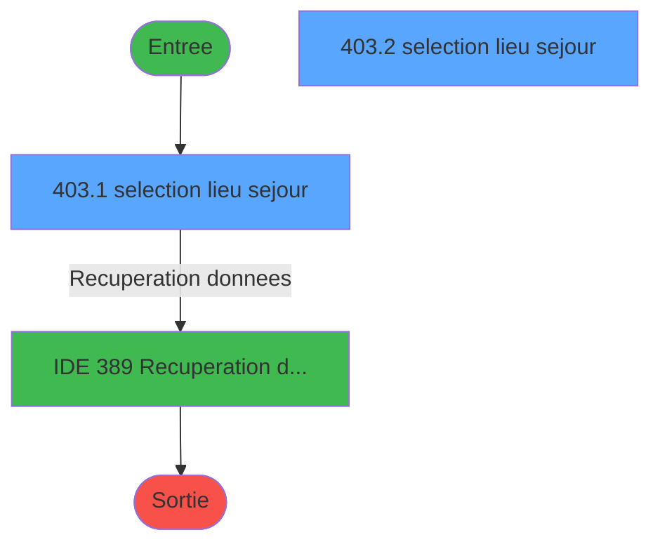
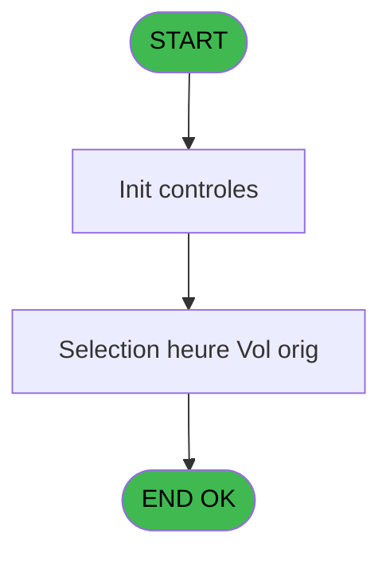
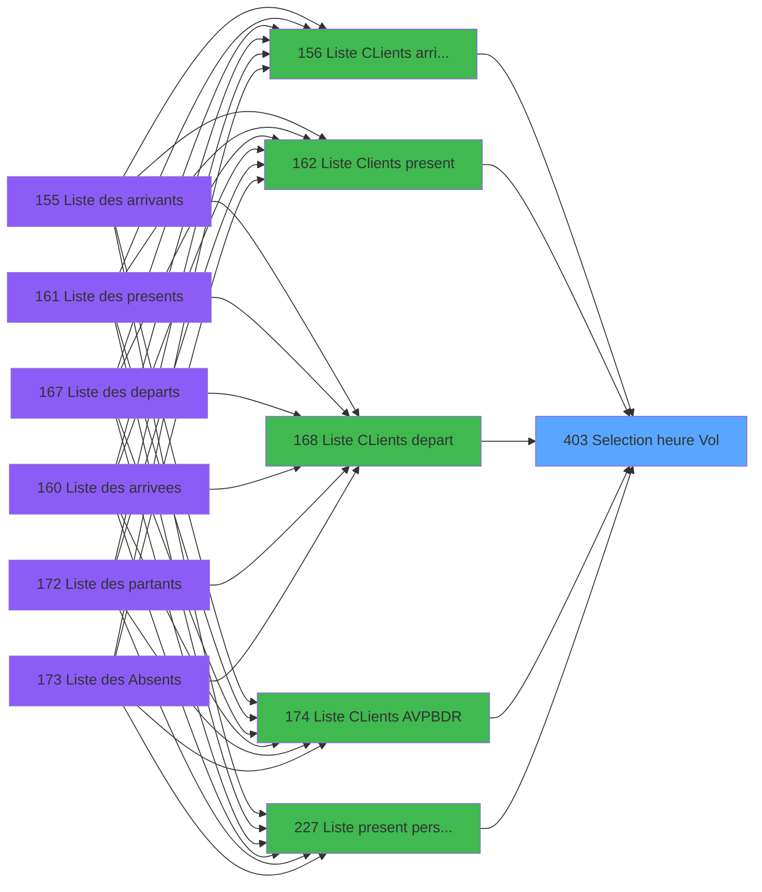
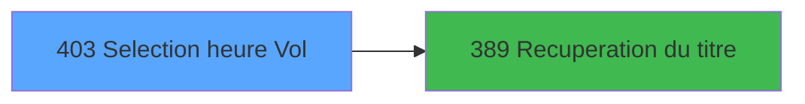

# PBP IDE 403 - Selection heure / Vol

> **Analyse**: Phases 1-4 2026-02-03 16:51 -> 16:51 (29s) | Assemblage 16:51
> **Pipeline**: V7.2 Enrichi
> **Structure**: 4 onglets (Resume | Ecrans | Donnees | Connexions)

<!-- TAB:Resume -->

## 1. FICHE D'IDENTITE

| Attribut | Valeur |
|----------|--------|
| Projet | PBP |
| IDE Position | 403 |
| Nom Programme | Selection heure / Vol |
| Fichier source | `Prg_403.xml` |
| Dossier IDE | Zoom |
| Taches | 3 (2 ecrans visibles) |
| Tables modifiees | 0 |
| Programmes appeles | 1 |

## 2. DESCRIPTION FONCTIONNELLE

**Selection heure / Vol** assure la gestion complete de ce processus, accessible depuis [Liste CLients AVPBDR (IDE 174)](PBP-IDE-174.md), [  Liste present personnel plan (IDE 227)](PBP-IDE-227.md), [  Liste personnels AVPBDR (IDE 234)](PBP-IDE-234.md), [  Liste CLients arrivant (IDE 156)](PBP-IDE-156.md), [  Liste Clients present (IDE 162)](PBP-IDE-162.md), [  Liste CLients depart (IDE 168)](PBP-IDE-168.md).

Le flux de traitement s'organise en **1 blocs fonctionnels** :

- **Consultation** (3 taches) : ecrans de recherche, selection et consultation

## 3. BLOCS FONCTIONNELS

### 3.1 Consultation (3 taches)

Ecrans de recherche et consultation.

---

#### 403 - selection lieu sejour [[ECRAN]](#ecran-t1)

**Role** : Selection par l'operateur : selection lieu sejour.
**Ecran** : 360 x 175 DLU (MDI) | [Voir mockup](#ecran-t1)
**Variables liees** : G (p.i.Selection min), H (p.i.Selection max)

---

#### 403.1 - selection lieu sejour [[ECRAN]](#ecran-t4)

**Role** : Selection par l'operateur : selection lieu sejour.
**Ecran** : 360 x 175 DLU (MDI) | [Voir mockup](#ecran-t4)
**Variables liees** : G (p.i.Selection min), H (p.i.Selection max)

---

#### 403.2 - selection lieu sejour [[ECRAN]](#ecran-t7)

**Role** : Selection par l'operateur : selection lieu sejour.
**Ecran** : 360 x 175 DLU (MDI) | [Voir mockup](#ecran-t7)
**Variables liees** : G (p.i.Selection min), H (p.i.Selection max)

## 5. REGLES METIER

*(Aucune regle metier identifiee)*

## 6. CONTEXTE

- **Appele par**: [Liste CLients AVPBDR (IDE 174)](PBP-IDE-174.md), [  Liste present personnel plan (IDE 227)](PBP-IDE-227.md), [  Liste personnels AVPBDR (IDE 234)](PBP-IDE-234.md), [  Liste CLients arrivant (IDE 156)](PBP-IDE-156.md), [  Liste Clients present (IDE 162)](PBP-IDE-162.md), [  Liste CLients depart (IDE 168)](PBP-IDE-168.md)
- **Appelle**: 1 programmes | **Tables**: 2 (W:0 R:2 L:0) | **Taches**: 3 | **Expressions**: 17

<!-- TAB:Ecrans -->

## 8. ECRANS

### 8.1 Forms visibles (2 / 3)

| # | Position | Tache | Nom | Type | Largeur | Hauteur | Bloc |
|---|----------|-------|-----|------|---------|---------|------|
| 1 | 403.1 | 403.1 | selection lieu sejour | MDI | 360 | 175 | Consultation |
| 2 | 403.2 | 403.2 | selection lieu sejour | MDI | 360 | 175 | Consultation |

### 8.2 Mockups Ecrans

---

#### 403.1 - selection lieu sejour
**Tache** : [403.1](#t4) | **Type** : MDI | **Dimensions** : 360 x 175 DLU
**Bloc** : Consultation | **Titre IDE** : selection lieu sejour

<!-- FORM-DATA:
{
    "width":  360,
    "vFactor":  8,
    "type":  "MDI",
    "hFactor":  8,
    "controls":  [
                     {
                         "x":  18,
                         "type":  "table",
                         "var":  "",
                         "name":  "",
                         "titleH":  12,
                         "color":  "196",
                         "w":  323,
                         "y":  3,
                         "fmt":  "",
                         "parent":  null,
                         "text":  "",
                         "rowH":  13,
                         "h":  116,
                         "cols":  [
                                      {
                                          "title":  "Date",
                                          "layer":  1,
                                          "w":  128
                                      },
                                      {
                                          "title":  "Heure",
                                          "layer":  2,
                                          "w":  74
                                      },
                                      {
                                          "title":  "Vol",
                                          "layer":  3,
                                          "w":  87
                                      }
                                  ],
                         "rows":  3
                     },
                     {
                         "x":  0,
                         "type":  "label",
                         "var":  "",
                         "y":  153,
                         "w":  353,
                         "fmt":  "",
                         "name":  "",
                         "h":  19,
                         "color":  "",
                         "text":  "",
                         "parent":  null
                     },
                     {
                         "x":  24,
                         "type":  "edit",
                         "var":  "",
                         "y":  18,
                         "w":  123,
                         "fmt":  "",
                         "name":  "VOL Date",
                         "h":  9,
                         "color":  "196",
                         "text":  "",
                         "parent":  1
                     },
                     {
                         "x":  176,
                         "type":  "edit",
                         "var":  "",
                         "y":  18,
                         "w":  30,
                         "fmt":  "",
                         "name":  "VOL Heure",
                         "h":  9,
                         "color":  "196",
                         "text":  "",
                         "parent":  1
                     },
                     {
                         "x":  227,
                         "type":  "edit",
                         "var":  "",
                         "y":  18,
                         "w":  75,
                         "fmt":  "",
                         "name":  "VOL Code Vol",
                         "h":  8,
                         "color":  "196",
                         "text":  "",
                         "parent":  1
                     },
                     {
                         "x":  10,
                         "type":  "button",
                         "var":  "",
                         "y":  156,
                         "w":  154,
                         "fmt":  "\u0026Sélectionner",
                         "name":  "bouton selectionner",
                         "h":  14,
                         "color":  "",
                         "text":  "",
                         "parent":  9
                     },
                     {
                         "x":  185,
                         "type":  "button",
                         "var":  "",
                         "y":  156,
                         "w":  154,
                         "fmt":  "\u0026Quitter",
                         "name":  "bouton quitter",
                         "h":  14,
                         "color":  "",
                         "text":  "",
                         "parent":  9
                     },
                     {
                         "x":  147,
                         "type":  "image",
                         "var":  "",
                         "y":  128,
                         "w":  58,
                         "fmt":  "",
                         "name":  "",
                         "h":  18,
                         "color":  "",
                         "text":  "",
                         "parent":  null
                     }
                 ],
    "taskId":  "403.1",
    "height":  175
}
-->

<strong>Champs : 3 champs</strong>

| Pos (x,y) | Nom | Variable | Type |
|-----------|-----|----------|------|
| 24,18 | VOL Date | - | edit |
| 176,18 | VOL Heure | - | edit |
| 227,18 | VOL Code Vol | - | edit |

<strong>Boutons : 2 boutons</strong>

| Bouton | Pos (x,y) | Action |
|--------|-----------|--------|
| Sélectionner | 10,156 | Bouton fonctionnel |
| Quitter | 185,156 | Quitte le programme |

---

#### 403.2 - selection lieu sejour
**Tache** : [403.2](#t7) | **Type** : MDI | **Dimensions** : 360 x 175 DLU
**Bloc** : Consultation | **Titre IDE** : selection lieu sejour

<!-- FORM-DATA:
{
    "width":  360,
    "vFactor":  8,
    "type":  "MDI",
    "hFactor":  8,
    "controls":  [
                     {
                         "x":  18,
                         "type":  "table",
                         "var":  "",
                         "name":  "",
                         "titleH":  12,
                         "color":  "196",
                         "w":  323,
                         "y":  3,
                         "fmt":  "",
                         "parent":  null,
                         "text":  "",
                         "rowH":  13,
                         "h":  116,
                         "cols":  [
                                      {
                                          "title":  "Date",
                                          "layer":  1,
                                          "w":  128
                                      },
                                      {
                                          "title":  "Heure",
                                          "layer":  2,
                                          "w":  74
                                      },
                                      {
                                          "title":  "Vol",
                                          "layer":  3,
                                          "w":  87
                                      }
                                  ],
                         "rows":  3
                     },
                     {
                         "x":  0,
                         "type":  "label",
                         "var":  "",
                         "y":  153,
                         "w":  353,
                         "fmt":  "",
                         "name":  "",
                         "h":  19,
                         "color":  "",
                         "text":  "",
                         "parent":  null
                     },
                     {
                         "x":  24,
                         "type":  "edit",
                         "var":  "",
                         "y":  18,
                         "w":  123,
                         "fmt":  "",
                         "name":  "VOL Date",
                         "h":  9,
                         "color":  "196",
                         "text":  "",
                         "parent":  1
                     },
                     {
                         "x":  176,
                         "type":  "edit",
                         "var":  "",
                         "y":  18,
                         "w":  30,
                         "fmt":  "",
                         "name":  "VOL Heure",
                         "h":  9,
                         "color":  "196",
                         "text":  "",
                         "parent":  1
                     },
                     {
                         "x":  227,
                         "type":  "edit",
                         "var":  "",
                         "y":  18,
                         "w":  75,
                         "fmt":  "",
                         "name":  "VOL Code Vol",
                         "h":  8,
                         "color":  "196",
                         "text":  "",
                         "parent":  1
                     },
                     {
                         "x":  10,
                         "type":  "button",
                         "var":  "",
                         "y":  156,
                         "w":  154,
                         "fmt":  "\u0026Sélectionner",
                         "name":  "bouton selectionner",
                         "h":  14,
                         "color":  "",
                         "text":  "",
                         "parent":  9
                     },
                     {
                         "x":  185,
                         "type":  "button",
                         "var":  "",
                         "y":  156,
                         "w":  154,
                         "fmt":  "\u0026Quitter",
                         "name":  "bouton quitter",
                         "h":  14,
                         "color":  "",
                         "text":  "",
                         "parent":  9
                     },
                     {
                         "x":  147,
                         "type":  "image",
                         "var":  "",
                         "y":  128,
                         "w":  58,
                         "fmt":  "",
                         "name":  "",
                         "h":  18,
                         "color":  "",
                         "text":  "",
                         "parent":  null
                     }
                 ],
    "taskId":  "403.2",
    "height":  175
}
-->

<strong>Champs : 3 champs</strong>

| Pos (x,y) | Nom | Variable | Type |
|-----------|-----|----------|------|
| 24,18 | VOL Date | - | edit |
| 176,18 | VOL Heure | - | edit |
| 227,18 | VOL Code Vol | - | edit |

<strong>Boutons : 2 boutons</strong>

| Bouton | Pos (x,y) | Action |
|--------|-----------|--------|
| Sélectionner | 10,156 | Bouton fonctionnel |
| Quitter | 185,156 | Quitte le programme |

## 9. NAVIGATION

### 9.1 Enchainement des ecrans

**Detail par enchainement :**

| Depuis | Action | Vers | Retour |
|--------|--------|------|--------|
| selection lieu sejour | Recuperation donnees | [Recuperation du titre (IDE 389)](PBP-IDE-389.md) | Retour ecran |

### 9.3 Structure hierarchique (3 taches)

| Position | Tache | Type | Dimensions | Bloc |
|----------|-------|------|------------|------|
| **403.1** | [**selection lieu sejour** (403)](#t1) [mockup](#ecran-t1) | MDI | 360x175 | Consultation |
| 403.1.1 | [selection lieu sejour (403.1)](#t4) [mockup](#ecran-t4) | MDI | 360x175 | |
| 403.1.2 | [selection lieu sejour (403.2)](#t7) [mockup](#ecran-t7) | MDI | 360x175 | |

### 9.4 Algorigramme

> **Legende**: Vert = START/END OK | Rouge = END KO | Bleu = Decisions
> *Algorigramme auto-genere. Utiliser `/algorigramme` pour une synthese metier detaillee.*

<!-- TAB:Donnees -->

## 10. TABLES

### Tables utilisees (2)

| ID | Nom | Description | Type | R | W | L | Usages |
|----|-----|-------------|------|---|---|---|--------|
| 134 | groupe_arr_dep___vol |  | DB | R |   |   | 1 |
| 1021 | Table_1021 |  | MEM | R |   |   | 1 |

### Colonnes par table (2 / 2 tables avec colonnes identifiees)

Table 134 - groupe_arr_dep___vol (R) - 1 usages

| Lettre | Variable | Acces | Type |
|--------|----------|-------|------|
| A | w0_AutoriseQuitter | R | Logical |
| B | bouton selectionner | R | Alpha |
| C | bouton quitter | R | Alpha |

Table 1021 - Table_1021 (R) - 1 usages

| Lettre | Variable | Acces | Type |
|--------|----------|-------|------|
| A | w0_AutoriseQuitter | R | Logical |
| B | bouton selectionner | R | Alpha |
| C | bouton quitter | R | Alpha |

## 11. VARIABLES

### 11.1 Parametres entrants (8)

Variables recues du programme appelant ([Liste CLients AVPBDR (IDE 174)](PBP-IDE-174.md)).

| Lettre | Nom | Type | Usage dans |
|--------|-----|------|-----------|
| A | p.Type Vol | Alpha | - |
| B | p.i.Date | Date | - |
| C | p.o.Date village | Date | - |
| D | p.i.o.Heure village | Alpha | - |
| E | p.o.Code vol | Alpha | - |
| F | p.i.o.Code ville | Alpha | - |
| G | p.i.Selection min | Alpha | - |
| H | p.i.Selection max | Alpha | - |

### 11.2 Variables de session (1)

Variables persistantes pendant toute la session.

| Lettre | Nom | Type | Usage dans |
|--------|-----|------|-----------|
| I | v.Titre | Alpha | - |

## 12. EXPRESSIONS

**17 / 17 expressions decodees (100%)**

### 12.1 Repartition par type

| Type | Expressions | Regles |
|------|-------------|--------|
| CONSTANTE | 3 | 0 |
| NEGATION | 1 | 0 |
| OTHER | 7 | 0 |
| CONDITION | 2 | 0 |
| CAST_LOGIQUE | 1 | 0 |
| STRING | 3 | 0 |

### 12.2 Expressions cles par type

#### CONSTANTE (3 expressions)

| Type | IDE | Expression | Regle |
|------|-----|------------|-------|
| CONSTANTE | 16 | `''` | - |
| CONSTANTE | 15 | `0` | - |
| CONSTANTE | 1 | `71` | - |

#### NEGATION (1 expressions)

| Type | IDE | Expression | Regle |
|------|-----|------------|-------|
| NEGATION | 2 | `NOT VG88` | - |

#### OTHER (7 expressions)

| Type | IDE | Expression | Regle |
|------|-----|------------|-------|
| OTHER | 9 | `{1,1}` | - |
| OTHER | 10 | `{1,2}` | - |
| OTHER | 17 | `[P]` | - |
| OTHER | 8 | `GetParam ('SOCIETE')` | - |
| OTHER | 4 | `[K]` | - |
| ... | | *+2 autres* | |

#### CONDITION (2 expressions)

| Type | IDE | Expression | Regle |
|------|-----|------------|-------|
| CONDITION | 13 | `CndRange ({1,8}<>'',{1,8})` | - |
| CONDITION | 12 | `CndRange ({1,7}<>'',{1,7})` | - |

#### CAST_LOGIQUE (1 expressions)

| Type | IDE | Expression | Regle |
|------|-----|------------|-------|
| CAST_LOGIQUE | 14 | `'TRUE'LOG` | - |

#### STRING (3 expressions)

| Type | IDE | Expression | Regle |
|------|-----|------------|-------|
| STRING | 11 | `Val ({1,4},'2')` | - |
| STRING | 5 | `Str ([L],'2P0Z0')` | - |
| STRING | 3 | `Trim ({1,19})` | - |

<!-- TAB:Connexions -->

## 13. GRAPHE D'APPELS

### 13.1 Chaine depuis Main (Callers)

Main -> ... -> [Liste CLients AVPBDR (IDE 174)](PBP-IDE-174.md) -> **Selection heure / Vol (IDE 403)**

Main -> ... -> [  Liste present personnel plan (IDE 227)](PBP-IDE-227.md) -> **Selection heure / Vol (IDE 403)**

Main -> ... -> [  Liste personnels AVPBDR (IDE 234)](PBP-IDE-234.md) -> **Selection heure / Vol (IDE 403)**

Main -> ... -> [  Liste CLients arrivant (IDE 156)](PBP-IDE-156.md) -> **Selection heure / Vol (IDE 403)**

Main -> ... -> [  Liste Clients present (IDE 162)](PBP-IDE-162.md) -> **Selection heure / Vol (IDE 403)**

Main -> ... -> [  Liste CLients depart (IDE 168)](PBP-IDE-168.md) -> **Selection heure / Vol (IDE 403)**

### 13.2 Callers

| IDE | Nom Programme | Nb Appels |
|-----|---------------|-----------|
| [174](PBP-IDE-174.md) | Liste CLients AVPBDR | 6 |
| [227](PBP-IDE-227.md) |   Liste present personnel plan | 6 |
| [234](PBP-IDE-234.md) |   Liste personnels AVPBDR | 6 |
| [156](PBP-IDE-156.md) |   Liste CLients arrivant | 3 |
| [162](PBP-IDE-162.md) |   Liste Clients present | 3 |
| [168](PBP-IDE-168.md) |   Liste CLients depart | 3 |

### 13.3 Callees (programmes appeles)

### 13.4 Detail Callees avec contexte

| IDE | Nom Programme | Appels | Contexte |
|-----|---------------|--------|----------|
| [389](PBP-IDE-389.md) | Recuperation du titre | 1 | Recuperation donnees |

## 14. RECOMMANDATIONS MIGRATION

### 14.1 Profil du programme

| Metrique | Valeur | Impact migration |
|----------|--------|-----------------|
| Lignes de logique | 77 | Programme compact |
| Expressions | 17 | Peu de logique |
| Tables WRITE | 0 | Impact faible |
| Sous-programmes | 1 | Peu de dependances |
| Ecrans visibles | 2 | Quelques ecrans |
| Code desactive | 0% (0 / 77) | Code sain |
| Regles metier | 0 | Pas de regle identifiee |

### 14.2 Plan de migration par bloc

#### Consultation (3 taches: 3 ecrans, 0 traitement)

- **Strategie** : Composants de recherche/selection en modales.
- 3 ecrans : selection lieu sejour, selection lieu sejour, selection lieu sejour

### 14.3 Dependances critiques

| Dependance | Type | Appels | Impact |
|------------|------|--------|--------|
| [Recuperation du titre (IDE 389)](PBP-IDE-389.md) | Sous-programme | 1x | Normale - Recuperation donnees |

---
*Spec DETAILED generee par Pipeline V7.2 - 2026-02-03 16:51*
