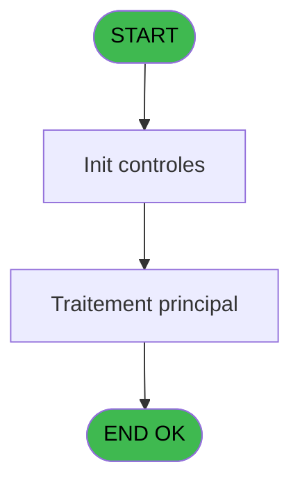
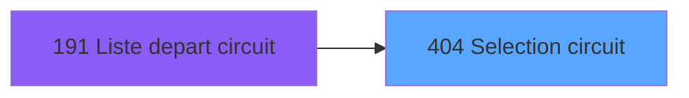
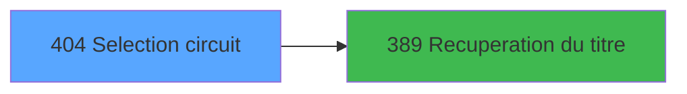

# PBP IDE 404 - Selection circuit

> **Analyse**: Phases 1-4 2026-02-03 16:52 -> 16:52 (17s) | Assemblage 16:52
> **Pipeline**: V7.2 Enrichi
> **Structure**: 4 onglets (Resume | Ecrans | Donnees | Connexions)

<!-- TAB:Resume -->

## 1. FICHE D'IDENTITE

| Attribut | Valeur |
|----------|--------|
| Projet | PBP |
| IDE Position | 404 |
| Nom Programme | Selection circuit |
| Fichier source | `Prg_404.xml` |
| Dossier IDE | Zoom |
| Taches | 1 (1 ecrans visibles) |
| Tables modifiees | 0 |
| Programmes appeles | 1 |

## 2. DESCRIPTION FONCTIONNELLE

**Selection circuit** assure la gestion complete de ce processus, accessible depuis [Liste depart circuit (IDE 191)](PBP-IDE-191.md).

Le flux de traitement s'organise en **1 blocs fonctionnels** :

- **Consultation** (1 tache) : ecrans de recherche, selection et consultation

## 3. BLOCS FONCTIONNELS

### 3.1 Consultation (1 tache)

Ecrans de recherche et consultation.

---

#### 404 - selection lieu sejour [[ECRAN]](#ecran-t1)

**Role** : Selection par l'operateur : selection lieu sejour.
**Ecran** : 406 x 174 DLU (MDI) | [Voir mockup](#ecran-t1)
**Variables liees** : D (bouton selectionner)

## 5. REGLES METIER

*(Aucune regle metier identifiee)*

## 6. CONTEXTE

- **Appele par**: [Liste depart circuit (IDE 191)](PBP-IDE-191.md)
- **Appelle**: 1 programmes | **Tables**: 1 (W:0 R:1 L:0) | **Taches**: 1 | **Expressions**: 9

<!-- TAB:Ecrans -->

## 8. ECRANS

### 8.1 Forms visibles (1 / 1)

| # | Position | Tache | Nom | Type | Largeur | Hauteur | Bloc |
|---|----------|-------|-----|------|---------|---------|------|
| 1 | 404 | 404 | selection lieu sejour | MDI | 406 | 174 | Consultation |

### 8.2 Mockups Ecrans

---

#### 404 - selection lieu sejour
**Tache** : [404](#t1) | **Type** : MDI | **Dimensions** : 406 x 174 DLU
**Bloc** : Consultation | **Titre IDE** : selection lieu sejour

<!-- FORM-DATA:
{
    "width":  406,
    "vFactor":  8,
    "type":  "MDI",
    "hFactor":  8,
    "controls":  [
                     {
                         "x":  21,
                         "type":  "table",
                         "var":  "",
                         "name":  "",
                         "titleH":  12,
                         "color":  "196",
                         "w":  371,
                         "y":  5,
                         "fmt":  "",
                         "parent":  null,
                         "text":  "",
                         "rowH":  13,
                         "h":  116,
                         "cols":  [
                                      {
                                          "title":  "Code",
                                          "layer":  1,
                                          "w":  86
                                      },
                                      {
                                          "title":  "Libellé",
                                          "layer":  2,
                                          "w":  250
                                      }
                                  ],
                         "rows":  2
                     },
                     {
                         "x":  2,
                         "type":  "label",
                         "var":  "",
                         "y":  153,
                         "w":  401,
                         "fmt":  "",
                         "name":  "",
                         "h":  19,
                         "color":  "",
                         "text":  "",
                         "parent":  null
                     },
                     {
                         "x":  27,
                         "type":  "edit",
                         "var":  "",
                         "y":  19,
                         "w":  82,
                         "fmt":  "",
                         "name":  "CCI Code Circuit",
                         "h":  10,
                         "color":  "196",
                         "text":  "",
                         "parent":  1
                     },
                     {
                         "x":  114,
                         "type":  "edit",
                         "var":  "",
                         "y":  19,
                         "w":  238,
                         "fmt":  "",
                         "name":  "CCI Libelle",
                         "h":  10,
                         "color":  "196",
                         "text":  "",
                         "parent":  1
                     },
                     {
                         "x":  28,
                         "type":  "button",
                         "var":  "",
                         "y":  156,
                         "w":  154,
                         "fmt":  "\u0026Sélectionner",
                         "name":  "bouton selectionner",
                         "h":  14,
                         "color":  "",
                         "text":  "",
                         "parent":  7
                     },
                     {
                         "x":  222,
                         "type":  "button",
                         "var":  "",
                         "y":  156,
                         "w":  154,
                         "fmt":  "\u0026Quitter",
                         "name":  "bouton quitter",
                         "h":  14,
                         "color":  "",
                         "text":  "",
                         "parent":  7
                     },
                     {
                         "x":  173,
                         "type":  "image",
                         "var":  "",
                         "y":  126,
                         "w":  58,
                         "fmt":  "",
                         "name":  "",
                         "h":  18,
                         "color":  "",
                         "text":  "",
                         "parent":  null
                     }
                 ],
    "taskId":  "404",
    "height":  174
}
-->

<strong>Champs : 2 champs</strong>

| Pos (x,y) | Nom | Variable | Type |
|-----------|-----|----------|------|
| 27,19 | CCI Code Circuit | - | edit |
| 114,19 | CCI Libelle | - | edit |

<strong>Boutons : 2 boutons</strong>

| Bouton | Pos (x,y) | Action |
|--------|-----------|--------|
| Sélectionner | 28,156 | Bouton fonctionnel |
| Quitter | 222,156 | Quitte le programme |

## 9. NAVIGATION

Ecran unique: **selection lieu sejour**

### 9.3 Structure hierarchique (1 tache)

| Position | Tache | Type | Dimensions | Bloc |
|----------|-------|------|------------|------|
| **404.1** | [**selection lieu sejour** (404)](#t1) [mockup](#ecran-t1) | MDI | 406x174 | Consultation |

### 9.4 Algorigramme

> **Legende**: Vert = START/END OK | Rouge = END KO | Bleu = Decisions
> *Algorigramme auto-genere. Utiliser `/algorigramme` pour une synthese metier detaillee.*

<!-- TAB:Donnees -->

## 10. TABLES

### Tables utilisees (1)

| ID | Nom | Description | Type | R | W | L | Usages |
|----|-----|-------------|------|---|---|---|--------|
| 127 | code_circuit |  | DB | R |   |   | 1 |

### Colonnes par table (1 / 1 tables avec colonnes identifiees)

Table 127 - code_circuit (R) - 1 usages

| Lettre | Variable | Acces | Type |
|--------|----------|-------|------|
| A | <Circuit | R | Alpha |
| B | >date debut | R | Date |
| C | w0_AutoriseQuitter | R | Logical |
| D | bouton selectionner | R | Alpha |
| E | bouton quitter | R | Alpha |
| F | v. titre | R | Alpha |

## 11. VARIABLES

### 11.1 Variables de session (1)

Variables persistantes pendant toute la session.

| Lettre | Nom | Type | Usage dans |
|--------|-----|------|-----------|
| F | v. titre | Alpha | - |

### 11.2 Autres (5)

Variables diverses.

| Lettre | Nom | Type | Usage dans |
|--------|-----|------|-----------|
| A | <Circuit | Alpha | 1x refs |
| B | >date debut | Date | 1x refs |
| C | w0_AutoriseQuitter | Logical | - |
| D | bouton selectionner | Alpha | 1x refs |
| E | bouton quitter | Alpha | - |

## 12. EXPRESSIONS

**9 / 9 expressions decodees (100%)**

### 12.1 Repartition par type

| Type | Expressions | Regles |
|------|-------------|--------|
| CONSTANTE | 2 | 0 |
| CONDITION | 2 | 0 |
| OTHER | 3 | 0 |
| CAST_LOGIQUE | 1 | 0 |
| STRING | 1 | 0 |

### 12.2 Expressions cles par type

#### CONSTANTE (2 expressions)

| Type | IDE | Expression | Regle |
|------|-----|------------|-------|
| CONSTANTE | 8 | `''` | - |
| CONSTANTE | 3 | `72` | - |

#### CONDITION (2 expressions)

| Type | IDE | Expression | Regle |
|------|-----|------------|-------|
| CONDITION | 6 | `<Circuit [A]` | - |
| CONDITION | 2 | `>date debut [B]` | - |

#### OTHER (3 expressions)

| Type | IDE | Expression | Regle |
|------|-----|------------|-------|
| OTHER | 9 | `[G]` | - |
| OTHER | 5 | `GetParam ('SOCIETE')` | - |
| OTHER | 4 | `bouton selectionner [D]` | - |

#### CAST_LOGIQUE (1 expressions)

| Type | IDE | Expression | Regle |
|------|-----|------------|-------|
| CAST_LOGIQUE | 7 | `'TRUE'LOG` | - |

#### STRING (1 expressions)

| Type | IDE | Expression | Regle |
|------|-----|------------|-------|
| STRING | 1 | `Trim ([J])` | - |

<!-- TAB:Connexions -->

## 13. GRAPHE D'APPELS

### 13.1 Chaine depuis Main (Callers)

Main -> ... -> [Liste depart circuit (IDE 191)](PBP-IDE-191.md) -> **Selection circuit (IDE 404)**

### 13.2 Callers

| IDE | Nom Programme | Nb Appels |
|-----|---------------|-----------|
| [191](PBP-IDE-191.md) | Liste depart circuit | 2 |

### 13.3 Callees (programmes appeles)

### 13.4 Detail Callees avec contexte

| IDE | Nom Programme | Appels | Contexte |
|-----|---------------|--------|----------|
| [389](PBP-IDE-389.md) | Recuperation du titre | 1 | Recuperation donnees |

## 14. RECOMMANDATIONS MIGRATION

### 14.1 Profil du programme

| Metrique | Valeur | Impact migration |
|----------|--------|-----------------|
| Lignes de logique | 22 | Programme compact |
| Expressions | 9 | Peu de logique |
| Tables WRITE | 0 | Impact faible |
| Sous-programmes | 1 | Peu de dependances |
| Ecrans visibles | 1 | Ecran unique ou traitement batch |
| Code desactive | 0% (0 / 22) | Code sain |
| Regles metier | 0 | Pas de regle identifiee |

### 14.2 Plan de migration par bloc

#### Consultation (1 tache: 1 ecran, 0 traitement)

- **Strategie** : Composants de recherche/selection en modales.
- 1 ecran : selection lieu sejour

### 14.3 Dependances critiques

| Dependance | Type | Appels | Impact |
|------------|------|--------|--------|
| [Recuperation du titre (IDE 389)](PBP-IDE-389.md) | Sous-programme | 1x | Normale - Recuperation donnees |

---
*Spec DETAILED generee par Pipeline V7.2 - 2026-02-03 16:52*
