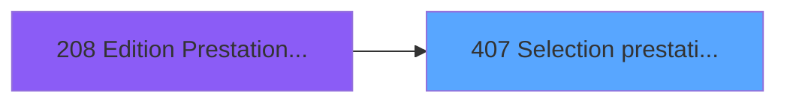
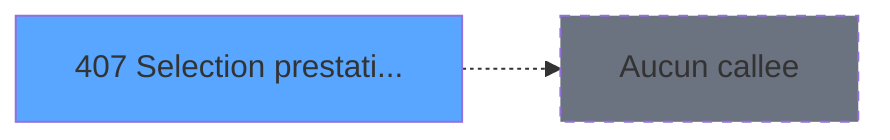

# PBP IDE 407 - Selection prestation Multiple

> **Analyse**: Phases 1-4 2026-02-03 16:53 -> 16:53 (14s) | Assemblage 16:53
> **Pipeline**: V7.2 Enrichi
> **Structure**: 4 onglets (Resume | Ecrans | Donnees | Connexions)

<!-- TAB:Resume -->

## 1. FICHE D'IDENTITE

| Attribut | Valeur |
|----------|--------|
| Projet | PBP |
| IDE Position | 407 |
| Nom Programme | Selection prestation Multiple |
| Fichier source | `Prg_407.xml` |
| Dossier IDE | Zoom |
| Taches | 3 (1 ecrans visibles) |
| Tables modifiees | 1 |
| Programmes appeles | 0 |

## 2. DESCRIPTION FONCTIONNELLE

**Selection prestation Multiple** assure la gestion complete de ce processus, accessible depuis [Edition Prestation ==V2 (IDE 208)](PBP-IDE-208.md).

Le flux de traitement s'organise en **2 blocs fonctionnels** :

- **Consultation** (2 taches) : ecrans de recherche, selection et consultation
- **Traitement** (1 tache) : traitements metier divers

**Donnees modifiees** : 1 tables en ecriture (Table_948).

Detail : phases du traitement

#### Phase 1 : Traitement (1 tache)

- **407** - Sélection prestation Multiple **[[ECRAN]](#ecran-t1)**

#### Phase 2 : Consultation (2 taches)

- **407.1** - MajListeSelection
- **407.2** - MajListeSelection

#### Tables impactees

| Table | Operations | Role metier |
|-------|-----------|-------------|
| Table_948 | **W**/L (3 usages) |  |

## 3. BLOCS FONCTIONNELS

### 3.1 Traitement (1 tache)

Traitements internes.

---

#### 407 - Sélection prestation Multiple [[ECRAN]](#ecran-t1)

**Role** : Traitement : Sélection prestation Multiple.
**Ecran** : 467 x 348 DLU (Type6) | [Voir mockup](#ecran-t1)
**Variables liees** : A (P.o.Liste_Prestation), E (v.filtre prestations), G (v.NombrePrestationCochées), H (CHG_REASON_v.filtre prestation), I (CHG_PRV_v.filtre prestations)

### 3.2 Consultation (2 taches)

Ecrans de recherche et consultation.

---

#### 407.1 - MajListeSelection

**Role** : Selection par l'operateur : MajListeSelection.

---

#### 407.2 - MajListeSelection

**Role** : Selection par l'operateur : MajListeSelection.

## 5. REGLES METIER

*(Aucune regle metier identifiee)*

## 6. CONTEXTE

- **Appele par**: [Edition Prestation ==V2 (IDE 208)](PBP-IDE-208.md)
- **Appelle**: 0 programmes | **Tables**: 3 (W:1 R:1 L:2) | **Taches**: 3 | **Expressions**: 13

<!-- TAB:Ecrans -->

## 8. ECRANS

### 8.1 Forms visibles (1 / 3)

| # | Position | Tache | Nom | Type | Largeur | Hauteur | Bloc |
|---|----------|-------|-----|------|---------|---------|------|
| 1 | 407 | 407 | Sélection prestation Multiple | Type6 | 467 | 348 | Traitement |

### 8.2 Mockups Ecrans

---

#### 407 - Sélection prestation Multiple
**Tache** : [407](#t1) | **Type** : Type6 | **Dimensions** : 467 x 348 DLU
**Bloc** : Traitement | **Titre IDE** : Sélection prestation Multiple

<!-- FORM-DATA:
{
    "width":  467,
    "vFactor":  8,
    "type":  "Type6",
    "hFactor":  8,
    "controls":  [
                     {
                         "x":  21,
                         "type":  "table",
                         "var":  "",
                         "name":  "",
                         "titleH":  12,
                         "color":  "196",
                         "w":  430,
                         "y":  52,
                         "fmt":  "",
                         "parent":  null,
                         "text":  "",
                         "rowH":  14,
                         "h":  270,
                         "cols":  [
                                      {
                                          "title":  "Code",
                                          "layer":  1,
                                          "w":  99
                                      },
                                      {
                                          "title":  "Libellé",
                                          "layer":  2,
                                          "w":  256
                                      },
                                      {
                                          "title":  "X",
                                          "layer":  3,
                                          "w":  40
                                      }
                                  ],
                         "rows":  3
                     },
                     {
                         "x":  2,
                         "type":  "label",
                         "var":  "",
                         "y":  327,
                         "w":  462,
                         "fmt":  "",
                         "name":  "",
                         "h":  19,
                         "color":  "",
                         "text":  "",
                         "parent":  null
                     },
                     {
                         "x":  27,
                         "type":  "edit",
                         "var":  "",
                         "y":  68,
                         "w":  82,
                         "fmt":  "",
                         "name":  "LIBP Code Prestation",
                         "h":  10,
                         "color":  "196",
                         "text":  "",
                         "parent":  1
                     },
                     {
                         "x":  126,
                         "type":  "edit",
                         "var":  "",
                         "y":  68,
                         "w":  238,
                         "fmt":  "",
                         "name":  "LIBP Libelle",
                         "h":  10,
                         "color":  "196",
                         "text":  "",
                         "parent":  1
                     },
                     {
                         "x":  21,
                         "type":  "button",
                         "var":  "",
                         "y":  330,
                         "w":  154,
                         "fmt":  "\u0026Sélectionner",
                         "name":  "bouton selectionner",
                         "h":  14,
                         "color":  "",
                         "text":  "",
                         "parent":  7
                     },
                     {
                         "x":  297,
                         "type":  "button",
                         "var":  "",
                         "y":  330,
                         "w":  154,
                         "fmt":  "\u0026Quitter",
                         "name":  "bouton quitter",
                         "h":  14,
                         "color":  "",
                         "text":  "",
                         "parent":  7
                     },
                     {
                         "x":  389,
                         "type":  "checkbox",
                         "var":  "",
                         "y":  68,
                         "w":  22,
                         "fmt":  "",
                         "name":  "Select_Presta",
                         "h":  9,
                         "color":  "196",
                         "text":  "",
                         "parent":  1
                     },
                     {
                         "x":  69,
                         "type":  "combobox",
                         "var":  "",
                         "y":  11,
                         "w":  328,
                         "fmt":  "",
                         "name":  "v.filtre prestations",
                         "h":  12,
                         "color":  "",
                         "text":  "A,C,T",
                         "parent":  null
                     },
                     {
                         "x":  69,
                         "type":  "combobox",
                         "var":  "",
                         "y":  31,
                         "w":  328,
                         "fmt":  "",
                         "name":  "CHG_PRV_v.filtre prestati_0001",
                         "h":  12,
                         "color":  "",
                         "text":  "",
                         "parent":  null
                     }
                 ],
    "taskId":  "407",
    "height":  348
}
-->

<strong>Champs : 5 champs</strong>

| Pos (x,y) | Nom | Variable | Type |
|-----------|-----|----------|------|
| 27,68 | LIBP Code Prestation | - | edit |
| 126,68 | LIBP Libelle | - | edit |
| 389,68 | Select_Presta | - | checkbox |
| 69,11 | v.filtre prestations | - | combobox |
| 69,31 | CHG_PRV_v.filtre prestati_0001 | - | combobox |

<strong>Boutons : 2 boutons</strong>

| Bouton | Pos (x,y) | Action |
|--------|-----------|--------|
| Sélectionner | 21,330 | Bouton fonctionnel |
| Quitter | 297,330 | Quitte le programme |

## 9. NAVIGATION

Ecran unique: **Sélection prestation Multiple**

### 9.3 Structure hierarchique (3 taches)

| Position | Tache | Type | Dimensions | Bloc |
|----------|-------|------|------------|------|
| **407.1** | [**Sélection prestation Multiple** (407)](#t1) [mockup](#ecran-t1) | Type6 | 467x348 | Traitement |
| **407.2** | [**MajListeSelection** (407.1)](#t2) | - | - | Consultation |
| 407.2.1 | [MajListeSelection (407.2)](#t6) | - | - | |

### 9.4 Algorigramme

> **Legende**: Vert = START/END OK | Rouge = END KO | Bleu = Decisions
> *Algorigramme auto-genere. Utiliser `/algorigramme` pour une synthese metier detaillee.*

<!-- TAB:Donnees -->

## 10. TABLES

### Tables utilisees (3)

| ID | Nom | Description | Type | R | W | L | Usages |
|----|-----|-------------|------|---|---|---|--------|
| 135 | libelle_prestation | Prestations/services vendus | DB | R |   |   | 1 |
| 948 | Table_948 |  | MEM |   | **W** | L | 3 |
| 1725 | Table_1725 |  | MEM |   |   | L | 1 |

### Colonnes par table (2 / 2 tables avec colonnes identifiees)

Table 135 - libelle_prestation (R) - 1 usages

| Lettre | Variable | Acces | Type |
|--------|----------|-------|------|
| A | P.o.Liste_Prestation | R | Alpha |
| E | v.filtre prestations | R | Alpha |
| G | v.NombrePrestationCochées | R | Numeric |
| H | CHG_REASON_v.filtre prestation | R | Numeric |
| I | CHG_PRV_v.filtre prestations | R | Alpha |

Table 948 - Table_948 (**W**/L) - 3 usages

| Lettre | Variable | Acces | Type |
|--------|----------|-------|------|
| A | P.o.Liste_Prestation | W | Alpha |
| B | P.o.Nombre | W | Numeric |
| C | bouton selectionner | W | Alpha |
| D | bouton quitter | W | Alpha |
| E | v.filtre prestations | W | Alpha |
| F | v.cochage auto catégorie | W | Numeric |
| G | v.NombrePrestationCochées | W | Numeric |
| H | CHG_REASON_v.filtre prestation | W | Numeric |
| I | CHG_PRV_v.filtre prestations | W | Alpha |
| J | CHG_REASON_v.cochage auto caté | W | Numeric |
| K | CHG_PRV_v.cochage auto catégor | W | Numeric |

## 11. VARIABLES

### 11.1 Parametres entrants (2)

Variables recues du programme appelant ([Edition Prestation ==V2 (IDE 208)](PBP-IDE-208.md)).

| Lettre | Nom | Type | Usage dans |
|--------|-----|------|-----------|
| A | P.o.Liste_Prestation | Alpha | - |
| B | P.o.Nombre | Numeric | - |

### 11.2 Variables de session (3)

Variables persistantes pendant toute la session.

| Lettre | Nom | Type | Usage dans |
|--------|-----|------|-----------|
| E | v.filtre prestations | Alpha | - |
| F | v.cochage auto catégorie | Numeric | - |
| G | v.NombrePrestationCochées | Numeric | - |

### 11.3 Autres (6)

Variables diverses.

| Lettre | Nom | Type | Usage dans |
|--------|-----|------|-----------|
| C | bouton selectionner | Alpha | - |
| D | bouton quitter | Alpha | - |
| H | CHG_REASON_v.filtre prestation | Numeric | - |
| I | CHG_PRV_v.filtre prestations | Alpha | - |
| J | CHG_REASON_v.cochage auto caté | Numeric | - |
| K | CHG_PRV_v.cochage auto catégor | Numeric | - |

## 12. EXPRESSIONS

**13 / 13 expressions decodees (100%)**

### 12.1 Repartition par type

| Type | Expressions | Regles |
|------|-------------|--------|
| CALCULATION | 1 | 0 |
| CONSTANTE | 5 | 0 |
| CONDITION | 4 | 0 |
| CAST_LOGIQUE | 2 | 0 |
| FORMAT | 1 | 0 |

### 12.2 Expressions cles par type

#### CALCULATION (1 expressions)

| Type | IDE | Expression | Regle |
|------|-----|------------|-------|
| CALCULATION | 9 | `{1,18}+1` | - |

#### CONSTANTE (5 expressions)

| Type | IDE | Expression | Regle |
|------|-----|------------|-------|
| CONSTANTE | 10 | `0` | - |
| CONSTANTE | 12 | `''` | - |
| CONSTANTE | 5 | `2` | - |
| CONSTANTE | 1 | `''` | - |
| CONSTANTE | 2 | `0` | - |

#### CONDITION (4 expressions)

| Type | IDE | Expression | Regle |
|------|-----|------------|-------|
| CONDITION | 8 | `[AB]=0` | - |
| CONDITION | 13 | `{1,18}=1` | - |
| CONDITION | 3 | `CndRange([W]<>'A',IF([W]='C','','AA'))` | - |
| CONDITION | 4 | `CndRange([W]<>'A',IF([W]='C','','ZZ'))` | - |

#### CAST_LOGIQUE (2 expressions)

| Type | IDE | Expression | Regle |
|------|-----|------------|-------|
| CAST_LOGIQUE | 11 | `'TRUE'LOG` | - |
| CAST_LOGIQUE | 6 | `'TRUE'LOG` | - |

#### FORMAT (1 expressions)

| Type | IDE | Expression | Regle |
|------|-----|------------|-------|
| FORMAT | 7 | `MlsTrans(StrBuild('Il y a @1@ prestations cochées',Str([AF],'3')))` | - |

<!-- TAB:Connexions -->

## 13. GRAPHE D'APPELS

### 13.1 Chaine depuis Main (Callers)

Main -> ... -> [Edition Prestation ==V2 (IDE 208)](PBP-IDE-208.md) -> **Selection prestation Multiple (IDE 407)**

### 13.2 Callers

| IDE | Nom Programme | Nb Appels |
|-----|---------------|-----------|
| [208](PBP-IDE-208.md) | Edition Prestation ==V2 | 1 |

### 13.3 Callees (programmes appeles)

### 13.4 Detail Callees avec contexte

| IDE | Nom Programme | Appels | Contexte |
|-----|---------------|--------|----------|
| - | (aucun) | - | - |

## 14. RECOMMANDATIONS MIGRATION

### 14.1 Profil du programme

| Metrique | Valeur | Impact migration |
|----------|--------|-----------------|
| Lignes de logique | 61 | Programme compact |
| Expressions | 13 | Peu de logique |
| Tables WRITE | 1 | Impact faible |
| Sous-programmes | 0 | Peu de dependances |
| Ecrans visibles | 1 | Ecran unique ou traitement batch |
| Code desactive | 3.3% (2 / 61) | Code sain |
| Regles metier | 0 | Pas de regle identifiee |

### 14.2 Plan de migration par bloc

#### Traitement (1 tache: 1 ecran, 0 traitement)

- **Strategie** : 1 composant(s) UI (Razor/React) avec formulaires et validation.
- Decomposer les taches en services unitaires testables.

#### Consultation (2 taches: 0 ecran, 2 traitements)

- **Strategie** : Composants de recherche/selection en modales.

### 14.3 Dependances critiques

| Dependance | Type | Appels | Impact |
|------------|------|--------|--------|
| Table_948 | Table WRITE (Memory) | 2x | Schema + repository |

---
*Spec DETAILED generee par Pipeline V7.2 - 2026-02-03 16:53*
