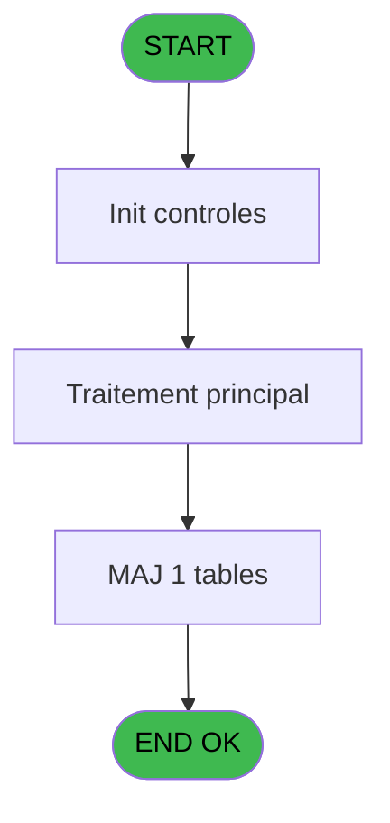
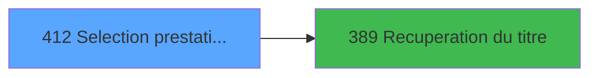

# PBP IDE 412 - Selection prestation-Catégorie

> **Analyse**: Phases 1-4 2026-02-03 16:55 -> 16:55 (14s) | Assemblage 16:55
> **Pipeline**: V7.2 Enrichi
> **Structure**: 4 onglets (Resume | Ecrans | Donnees | Connexions)

<!-- TAB:Resume -->

## 1. FICHE D'IDENTITE

| Attribut | Valeur |
|----------|--------|
| Projet | PBP |
| IDE Position | 412 |
| Nom Programme | Selection prestation-Catégorie |
| Fichier source | `Prg_412.xml` |
| Dossier IDE | Sauvegardes |
| Taches | 1 (1 ecrans visibles) |
| Tables modifiees | 1 |
| Programmes appeles | 1 |
| :warning: Statut | **ORPHELIN_POTENTIEL** |

## 2. DESCRIPTION FONCTIONNELLE

**Selection prestation-Catégorie** assure la gestion complete de ce processus.

Le flux de traitement s'organise en **1 blocs fonctionnels** :

- **Traitement** (1 tache) : traitements metier divers

**Donnees modifiees** : 1 tables en ecriture (libelle_prestation).

## 3. BLOCS FONCTIONNELS

### 3.1 Traitement (1 tache)

Traitements internes.

---

#### 412 - Sélection prestation Multiple [[ECRAN]](#ecran-t1)

**Role** : Traitement : Sélection prestation Multiple.
**Ecran** : 957 x 348 DLU (Type6) | [Voir mockup](#ecran-t1)
**Delegue a** : [Recuperation du titre (IDE 389)](PBP-IDE-389.md)

## 5. REGLES METIER

*(Aucune regle metier identifiee)*

## 6. CONTEXTE

- **Appele par**: (aucun)
- **Appelle**: 1 programmes | **Tables**: 2 (W:1 R:0 L:1) | **Taches**: 1 | **Expressions**: 8

<!-- TAB:Ecrans -->

## 8. ECRANS

### 8.1 Forms visibles (1 / 1)

| # | Position | Tache | Nom | Type | Largeur | Hauteur | Bloc |
|---|----------|-------|-----|------|---------|---------|------|
| 1 | 412 | 412 | Sélection prestation Multiple | Type6 | 957 | 348 | Traitement |

### 8.2 Mockups Ecrans

---

#### 412 - Sélection prestation Multiple
**Tache** : [412](#t1) | **Type** : Type6 | **Dimensions** : 957 x 348 DLU
**Bloc** : Traitement | **Titre IDE** : Sélection prestation Multiple

<!-- FORM-DATA:
{
    "width":  957,
    "vFactor":  8,
    "type":  "Type6",
    "hFactor":  8,
    "controls":  [
                     {
                         "x":  22,
                         "type":  "table",
                         "var":  "",
                         "name":  "",
                         "titleH":  12,
                         "color":  "196",
                         "w":  1269,
                         "y":  7,
                         "fmt":  "",
                         "parent":  null,
                         "text":  "",
                         "rowH":  14,
                         "h":  309,
                         "cols":  [
                                      {
                                          "title":  "Code",
                                          "layer":  1,
                                          "w":  99
                                      },
                                      {
                                          "title":  "Libellé",
                                          "layer":  2,
                                          "w":  256
                                      },
                                      {
                                          "title":  "Catégorie prestation",
                                          "layer":  3,
                                          "w":  157
                                      },
                                      {
                                          "title":  "Libellé catégorie",
                                          "layer":  4,
                                          "w":  362
                                      },
                                      {
                                          "title":  "Category label",
                                          "layer":  5,
                                          "w":  362
                                      }
                                  ],
                         "rows":  5
                     },
                     {
                         "x":  2,
                         "type":  "label",
                         "var":  "",
                         "y":  327,
                         "w":  955,
                         "fmt":  "",
                         "name":  "",
                         "h":  19,
                         "color":  "",
                         "text":  "",
                         "parent":  null
                     },
                     {
                         "x":  29,
                         "type":  "edit",
                         "var":  "",
                         "y":  22,
                         "w":  82,
                         "fmt":  "",
                         "name":  "LIBP Code Prestation",
                         "h":  12,
                         "color":  "196",
                         "text":  "",
                         "parent":  1
                     },
                     {
                         "x":  128,
                         "type":  "edit",
                         "var":  "",
                         "y":  22,
                         "w":  238,
                         "fmt":  "",
                         "name":  "LIBP Libelle",
                         "h":  12,
                         "color":  "196",
                         "text":  "",
                         "parent":  1
                     },
                     {
                         "x":  779,
                         "type":  "button",
                         "var":  "",
                         "y":  330,
                         "w":  154,
                         "fmt":  "\u0026Quitter",
                         "name":  "bouton quitter",
                         "h":  14,
                         "color":  "",
                         "text":  "",
                         "parent":  7
                     },
                     {
                         "x":  541,
                         "type":  "edit",
                         "var":  "",
                         "y":  22,
                         "w":  358,
                         "fmt":  "",
                         "name":  "cap_libelle_categorie_FRA",
                         "h":  12,
                         "color":  "196",
                         "text":  "",
                         "parent":  1
                     },
                     {
                         "x":  902,
                         "type":  "edit",
                         "var":  "",
                         "y":  22,
                         "w":  358,
                         "fmt":  "",
                         "name":  "cap_libelle_categorie_ANG",
                         "h":  12,
                         "color":  "196",
                         "text":  "",
                         "parent":  1
                     },
                     {
                         "x":  384,
                         "type":  "combobox",
                         "var":  "",
                         "y":  22,
                         "w":  101,
                         "fmt":  "",
                         "name":  "code_categorie_prestation_0001",
                         "h":  12,
                         "color":  "",
                         "text":  "",
                         "parent":  1
                     }
                 ],
    "taskId":  "412",
    "height":  348
}
-->

<strong>Champs : 5 champs</strong>

| Pos (x,y) | Nom | Variable | Type |
|-----------|-----|----------|------|
| 29,22 | LIBP Code Prestation | - | edit |
| 128,22 | LIBP Libelle | - | edit |
| 541,22 | cap_libelle_categorie_FRA | - | edit |
| 902,22 | cap_libelle_categorie_ANG | - | edit |
| 384,22 | code_categorie_prestation_0001 | - | combobox |

<strong>Boutons : 1 boutons</strong>

| Bouton | Pos (x,y) | Action |
|--------|-----------|--------|
| Quitter | 779,330 | Quitte le programme |

## 9. NAVIGATION

Ecran unique: **Sélection prestation Multiple**

### 9.3 Structure hierarchique (1 tache)

| Position | Tache | Type | Dimensions | Bloc |
|----------|-------|------|------------|------|
| **412.1** | [**Sélection prestation Multiple** (412)](#t1) [mockup](#ecran-t1) | Type6 | 957x348 | Traitement |

### 9.4 Algorigramme

> **Legende**: Vert = START/END OK | Rouge = END KO | Bleu = Decisions
> *Algorigramme auto-genere. Utiliser `/algorigramme` pour une synthese metier detaillee.*

<!-- TAB:Donnees -->

## 10. TABLES

### Tables utilisees (2)

| ID | Nom | Description | Type | R | W | L | Usages |
|----|-----|-------------|------|---|---|---|--------|
| 135 | libelle_prestation | Prestations/services vendus | DB |   | **W** |   | 1 |
| 1725 | Table_1725 |  | MEM |   |   | L | 1 |

### Colonnes par table (1 / 1 tables avec colonnes identifiees)

Table 135 - libelle_prestation (**W**) - 1 usages

| Lettre | Variable | Acces | Type |
|--------|----------|-------|------|
| A | w0_TitreEcran | W | Alpha |
| B | bouton quitter | W | Alpha |

## 11. VARIABLES

### 11.1 Autres (2)

Variables diverses.

| Lettre | Nom | Type | Usage dans |
|--------|-----|------|-----------|
| A | w0_TitreEcran | Alpha | - |
| B | bouton quitter | Alpha | - |

## 12. EXPRESSIONS

**8 / 8 expressions decodees (100%)**

### 12.1 Repartition par type

| Type | Expressions | Regles |
|------|-------------|--------|
| CONSTANTE | 2 | 0 |
| OTHER | 2 | 0 |
| CONDITION | 3 | 0 |
| STRING | 1 | 0 |

### 12.2 Expressions cles par type

#### CONSTANTE (2 expressions)

| Type | IDE | Expression | Regle |
|------|-----|------------|-------|
| CONSTANTE | 6 | `263` | - |
| CONSTANTE | 5 | `'  1'` | - |

#### OTHER (2 expressions)

| Type | IDE | Expression | Regle |
|------|-----|------------|-------|
| OTHER | 2 | `[AI]` | - |
| OTHER | 1 | `[T]` | - |

#### CONDITION (3 expressions)

| Type | IDE | Expression | Regle |
|------|-----|------------|-------|
| CONDITION | 8 | `[T]<>''` | - |
| CONDITION | 4 | `GetParam ('CODELANGUE')<>'FRA'` | - |
| CONDITION | 3 | `GetParam ('CODELANGUE')='FRA'` | - |

#### STRING (1 expressions)

| Type | IDE | Expression | Regle |
|------|-----|------------|-------|
| STRING | 7 | `Trim([AP])` | - |

<!-- TAB:Connexions -->

## 13. GRAPHE D'APPELS

### 13.1 Chaine depuis Main (Callers)

**Chemin**: (pas de callers directs)

### 13.2 Callers

| IDE | Nom Programme | Nb Appels |
|-----|---------------|-----------|
| - | (aucun) | - |

### 13.3 Callees (programmes appeles)

### 13.4 Detail Callees avec contexte

| IDE | Nom Programme | Appels | Contexte |
|-----|---------------|--------|----------|
| [389](PBP-IDE-389.md) | Recuperation du titre | 1 | Recuperation donnees |

## 14. RECOMMANDATIONS MIGRATION

### 14.1 Profil du programme

| Metrique | Valeur | Impact migration |
|----------|--------|-----------------|
| Lignes de logique | 23 | Programme compact |
| Expressions | 8 | Peu de logique |
| Tables WRITE | 1 | Impact faible |
| Sous-programmes | 1 | Peu de dependances |
| Ecrans visibles | 1 | Ecran unique ou traitement batch |
| Code desactive | 0% (0 / 23) | Code sain |
| Regles metier | 0 | Pas de regle identifiee |

### 14.2 Plan de migration par bloc

#### Traitement (1 tache: 1 ecran, 0 traitement)

- **Strategie** : 1 composant(s) UI (Razor/React) avec formulaires et validation.
- 1 sous-programme(s) a migrer ou a reutiliser depuis les services existants.
- Decomposer les taches en services unitaires testables.

### 14.3 Dependances critiques

| Dependance | Type | Appels | Impact |
|------------|------|--------|--------|
| libelle_prestation | Table WRITE (Database) | 1x | Schema + repository |
| [Recuperation du titre (IDE 389)](PBP-IDE-389.md) | Sous-programme | 1x | Normale - Recuperation donnees |

---
*Spec DETAILED generee par Pipeline V7.2 - 2026-02-03 16:55*
