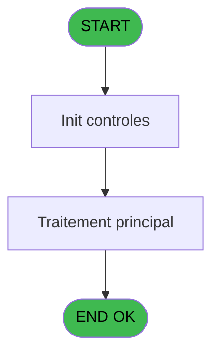
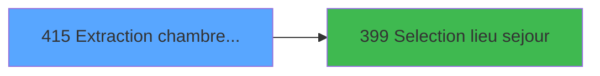

# PBP IDE 415 - Extraction chambres dispos

> **Analyse**: Phases 1-4 2026-02-03 16:56 -> 16:56 (19s) | Assemblage 16:56
> **Pipeline**: V7.2 Enrichi
> **Structure**: 4 onglets (Resume | Ecrans | Donnees | Connexions)

<!-- TAB:Resume -->

## 1. FICHE D'IDENTITE

| Attribut | Valeur |
|----------|--------|
| Projet | PBP |
| IDE Position | 415 |
| Nom Programme | Extraction chambres dispos |
| Fichier source | `Prg_415.xml` |
| Dossier IDE | Sauvegardes |
| Taches | 3 (1 ecrans visibles) |
| Tables modifiees | 0 |
| Programmes appeles | 1 |
| :warning: Statut | **ORPHELIN_POTENTIEL** |

## 2. DESCRIPTION FONCTIONNELLE

**Extraction chambres dispos** assure la gestion complete de ce processus.

Le flux de traitement s'organise en **2 blocs fonctionnels** :

- **Consultation** (2 taches) : ecrans de recherche, selection et consultation
- **Traitement** (1 tache) : traitements metier divers

Detail : phases du traitement

#### Phase 1 : Traitement (1 tache)

- **415** - Extraction des chambres dispos **[[ECRAN]](#ecran-t13)**

#### Phase 2 : Consultation (2 taches)

- **415.1** - Selection ligne Chambres **[[ECRAN]](#ecran-t14)**
- **415.1.1** - Selection ligne GM non loges **[[ECRAN]](#ecran-t21)**

Delegue a : [Selection lieu sejour (IDE 399)](PBP-IDE-399.md)

## 3. BLOCS FONCTIONNELS

### 3.1 Traitement (1 tache)

Traitements internes.

---

#### 415 - Extraction des chambres dispos [[ECRAN]](#ecran-t13)

**Role** : Traitement : Extraction des chambres dispos.
**Ecran** : 634 x 206 DLU (MDI) | [Voir mockup](#ecran-t13)

### 3.2 Consultation (2 taches)

Ecrans de recherche et consultation.

---

#### 415.1 - Selection ligne Chambres [[ECRAN]](#ecran-t14)

**Role** : Selection par l'operateur : Selection ligne Chambres.
**Ecran** : 842 x 616 DLU | [Voir mockup](#ecran-t14)
**Delegue a** : [Selection lieu sejour (IDE 399)](PBP-IDE-399.md)

---

#### 415.1.1 - Selection ligne GM non loges [[ECRAN]](#ecran-t21)

**Role** : Selection par l'operateur : Selection ligne GM non loges.
**Ecran** : 586 x 454 DLU | [Voir mockup](#ecran-t21)
**Delegue a** : [Selection lieu sejour (IDE 399)](PBP-IDE-399.md)

## 5. REGLES METIER

*(Aucune regle metier identifiee)*

## 6. CONTEXTE

- **Appele par**: (aucun)
- **Appelle**: 1 programmes | **Tables**: 4 (W:0 R:2 L:2) | **Taches**: 3 | **Expressions**: 16

<!-- TAB:Ecrans -->

## 8. ECRANS

### 8.1 Forms visibles (1 / 3)

| # | Position | Tache | Nom | Type | Largeur | Hauteur | Bloc |
|---|----------|-------|-----|------|---------|---------|------|
| 1 | 415.1 | 415 | Extraction des chambres dispos | MDI | 634 | 206 | Traitement |

### 8.2 Mockups Ecrans

---

#### 415.1 - Extraction des chambres dispos
**Tache** : [415](#t13) | **Type** : MDI | **Dimensions** : 634 x 206 DLU
**Bloc** : Traitement | **Titre IDE** : Extraction des chambres dispos

<!-- FORM-DATA:
{
    "width":  634,
    "vFactor":  8,
    "type":  "MDI",
    "hFactor":  8,
    "controls":  [
                     {
                         "x":  1,
                         "type":  "label",
                         "var":  "",
                         "y":  0,
                         "w":  631,
                         "fmt":  "",
                         "name":  "",
                         "h":  19,
                         "color":  "1",
                         "text":  "",
                         "parent":  null
                     },
                     {
                         "x":  1,
                         "type":  "label",
                         "var":  "",
                         "y":  182,
                         "w":  631,
                         "fmt":  "",
                         "name":  "",
                         "h":  24,
                         "color":  "1",
                         "text":  "",
                         "parent":  null
                     },
                     {
                         "x":  1,
                         "type":  "label",
                         "var":  "",
                         "y":  24,
                         "w":  415,
                         "fmt":  "",
                         "name":  "",
                         "h":  150,
                         "color":  "195",
                         "text":  "Paramètres",
                         "parent":  null
                     },
                     {
                         "x":  21,
                         "type":  "label",
                         "var":  "",
                         "y":  63,
                         "w":  125,
                         "fmt":  "",
                         "name":  "",
                         "h":  10,
                         "color":  "",
                         "text":  "Date Fin",
                         "parent":  6
                     },
                     {
                         "x":  21,
                         "type":  "label",
                         "var":  "",
                         "y":  85,
                         "w":  125,
                         "fmt":  "",
                         "name":  "",
                         "h":  10,
                         "color":  "",
                         "text":  "Lieu de séjour",
                         "parent":  6
                     },
                     {
                         "x":  438,
                         "type":  "label",
                         "var":  "",
                         "y":  24,
                         "w":  192,
                         "fmt":  "",
                         "name":  "",
                         "h":  150,
                         "color":  "",
                         "text":  "",
                         "parent":  null
                     },
                     {
                         "x":  21,
                         "type":  "label",
                         "var":  "",
                         "y":  41,
                         "w":  125,
                         "fmt":  "",
                         "name":  "",
                         "h":  10,
                         "color":  "",
                         "text":  "Date Debut",
                         "parent":  6
                     },
                     {
                         "x":  21,
                         "type":  "label",
                         "var":  "",
                         "y":  115,
                         "w":  125,
                         "fmt":  "",
                         "name":  "",
                         "h":  10,
                         "color":  "",
                         "text":  "Extraction",
                         "parent":  6
                     },
                     {
                         "x":  161,
                         "type":  "edit",
                         "var":  "",
                         "y":  63,
                         "w":  126,
                         "fmt":  "DD/MM/YYYYZ",
                         "name":  "w0_DateCalcul",
                         "h":  10,
                         "color":  "110",
                         "text":  "",
                         "parent":  6
                     },
                     {
                         "x":  289,
                         "type":  "button",
                         "var":  "",
                         "y":  64,
                         "w":  26,
                         "fmt":  "...",
                         "name":  "b_DateFin",
                         "h":  9,
                         "color":  "",
                         "text":  "",
                         "parent":  6
                     },
                     {
                         "x":  161,
                         "type":  "edit",
                         "var":  "",
                         "y":  85,
                         "w":  51,
                         "fmt":  "",
                         "name":  "w0_Lieu de séjour",
                         "h":  10,
                         "color":  "6",
                         "text":  "",
                         "parent":  6
                     },
                     {
                         "x":  455,
                         "type":  "button",
                         "var":  "",
                         "y":  151,
                         "w":  154,
                         "fmt":  "\u0026Extraction",
                         "name":  "b_extraire",
                         "h":  18,
                         "color":  "",
                         "text":  "",
                         "parent":  null
                     },
                     {
                         "x":  13,
                         "type":  "button",
                         "var":  "",
                         "y":  185,
                         "w":  154,
                         "fmt":  "\u0026Quitter",
                         "name":  "b_Quitter",
                         "h":  18,
                         "color":  "",
                         "text":  "",
                         "parent":  5
                     },
                     {
                         "x":  13,
                         "type":  "edit",
                         "var":  "",
                         "y":  1,
                         "w":  267,
                         "fmt":  "20",
                         "name":  "",
                         "h":  8,
                         "color":  "",
                         "text":  "",
                         "parent":  1
                     },
                     {
                         "x":  368,
                         "type":  "edit",
                         "var":  "",
                         "y":  6,
                         "w":  254,
                         "fmt":  "WWW DD MMM YYYYT",
                         "name":  "",
                         "h":  8,
                         "color":  "",
                         "text":  "",
                         "parent":  1
                     },
                     {
                         "x":  13,
                         "type":  "edit",
                         "var":  "",
                         "y":  9,
                         "w":  331,
                         "fmt":  "25",
                         "name":  "VG.NOM VILLAGE",
                         "h":  8,
                         "color":  "",
                         "text":  "",
                         "parent":  1
                     },
                     {
                         "x":  448,
                         "type":  "image",
                         "var":  "",
                         "y":  32,
                         "w":  170,
                         "fmt":  "",
                         "name":  "",
                         "h":  136,
                         "color":  "",
                         "text":  "",
                         "parent":  14
                     },
                     {
                         "x":  161,
                         "type":  "edit",
                         "var":  "",
                         "y":  99,
                         "w":  230,
                         "fmt":  "",
                         "name":  "nom_import",
                         "h":  10,
                         "color":  "42",
                         "text":  "",
                         "parent":  6
                     },
                     {
                         "x":  289,
                         "type":  "button",
                         "var":  "",
                         "y":  86,
                         "w":  26,
                         "fmt":  "...",
                         "name":  "b.Lieu de sejour",
                         "h":  9,
                         "color":  "",
                         "text":  "",
                         "parent":  6
                     },
                     {
                         "x":  161,
                         "type":  "edit",
                         "var":  "",
                         "y":  41,
                         "w":  126,
                         "fmt":  "DD/MM/YYYYZ",
                         "name":  "w0_Datedebut",
                         "h":  10,
                         "color":  "110",
                         "text":  "",
                         "parent":  6
                     },
                     {
                         "x":  289,
                         "type":  "button",
                         "var":  "",
                         "y":  41,
                         "w":  26,
                         "fmt":  "...",
                         "name":  "b_DateDebut_0001",
                         "h":  9,
                         "color":  "",
                         "text":  "",
                         "parent":  6
                     },
                     {
                         "x":  161,
                         "type":  "radio",
                         "var":  "",
                         "y":  107,
                         "w":  139,
                         "fmt":  "",
                         "name":  "v.choix Globale / Detaille",
                         "h":  35,
                         "color":  "",
                         "text":  "G,D",
                         "parent":  6
                     }
                 ],
    "taskId":  "415.1",
    "height":  206
}
-->

<strong>Champs : 7 champs</strong>

| Pos (x,y) | Nom | Variable | Type |
|-----------|-----|----------|------|
| 161,63 | w0_DateCalcul | - | edit |
| 161,85 | w0_Lieu de séjour | - | edit |
| 13,1 | 20 | - | edit |
| 368,6 | WWW DD MMM YYYYT | - | edit |
| 13,9 | VG.NOM VILLAGE | - | edit |
| 161,99 | nom_import | - | edit |
| 161,41 | w0_Datedebut | - | edit |

<strong>Boutons : 5 boutons</strong>

| Bouton | Pos (x,y) | Action |
|--------|-----------|--------|
| ... | 289,64 | Bouton fonctionnel |
| Extraction | 455,151 | Bouton fonctionnel |
| Quitter | 13,185 | Quitte le programme |
| ... | 289,86 | Bouton fonctionnel |
| ... | 289,41 | Bouton fonctionnel |

## 9. NAVIGATION

Ecran unique: **Extraction des chambres dispos**

### 9.3 Structure hierarchique (3 taches)

| Position | Tache | Type | Dimensions | Bloc |
|----------|-------|------|------------|------|
| **415.1** | [**Extraction des chambres dispos** (415)](#t13) [mockup](#ecran-t13) | MDI | 634x206 | Traitement |
| **415.2** | [**Selection ligne Chambres** (415.1)](#t14) [mockup](#ecran-t14) | - | 842x616 | Consultation |
| 415.2.1 | [Selection ligne GM non loges (415.1.1)](#t21) [mockup](#ecran-t21) | - | 586x454 | |

### 9.4 Algorigramme

> **Legende**: Vert = START/END OK | Rouge = END KO | Bleu = Decisions
> *Algorigramme auto-genere. Utiliser `/algorigramme` pour une synthese metier detaillee.*

<!-- TAB:Donnees -->

## 10. TABLES

### Tables utilisees (4)

| ID | Nom | Description | Type | R | W | L | Usages |
|----|-----|-------------|------|---|---|---|--------|
| 30 | gm-recherche_____gmr | Index de recherche | DB |   |   | L | 1 |
| 34 | hebergement______heb | Hebergement (chambres) | DB | R |   |   | 2 |
| 103 | logement_client__loc |  | DB |   |   | L | 1 |
| 118 | tables_imports |  | DB | R |   |   | 1 |

### Colonnes par table (2 / 2 tables avec colonnes identifiees)

Table 34 - hebergement______heb (R) - 2 usages

| Lettre | Variable | Acces | Type |
|--------|----------|-------|------|
| A | v.chambre indisponible? | R | Logical |
| B | v.Ligne extraction | R | Alpha |

Table 118 - tables_imports (R) - 1 usages

| Lettre | Variable | Acces | Type |
|--------|----------|-------|------|
| A | w0_Titre | R | Alpha |
| B | w0_Datedebut | R | Date |
| C | w0_Datefin | R | Date |
| D | b_DateDebut | R | Alpha |
| E | b_DateFin | R | Alpha |
| F | v.choix Globale / Detaille | R | Alpha |
| G | b_extraire | R | Alpha |
| H | b_Quitter | R | Alpha |
| I | b.Lieu de séjour | R | Alpha |
| J | w0_Lieu  de séjour | R | Alpha |
| K | w0_Retour lieu de séjour | R | Logical |

## 11. VARIABLES

### 11.1 Variables de session (1)

Variables persistantes pendant toute la session.

| Lettre | Nom | Type | Usage dans |
|--------|-----|------|-----------|
| F | v.choix Globale / Detaille | Alpha | - |

### 11.2 Autres (10)

Variables diverses.

| Lettre | Nom | Type | Usage dans |
|--------|-----|------|-----------|
| A | w0_Titre | Alpha | - |
| B | w0_Datedebut | Date | - |
| C | w0_Datefin | Date | - |
| D | b_DateDebut | Alpha | - |
| E | b_DateFin | Alpha | - |
| G | b_extraire | Alpha | - |
| H | b_Quitter | Alpha | - |
| I | b.Lieu de séjour | Alpha | - |
| J | w0_Lieu  de séjour | Alpha | - |
| K | w0_Retour lieu de séjour | Logical | - |

## 12. EXPRESSIONS

**16 / 16 expressions decodees (100%)**

### 12.1 Repartition par type

| Type | Expressions | Regles |
|------|-------------|--------|
| CONSTANTE | 6 | 0 |
| DATE | 2 | 0 |
| REFERENCE_VG | 1 | 0 |
| OTHER | 4 | 0 |
| CONDITION | 3 | 0 |

### 12.2 Expressions cles par type

#### CONSTANTE (6 expressions)

| Type | IDE | Expression | Regle |
|------|-----|------------|-------|
| CONSTANTE | 6 | `'...'` | - |
| CONSTANTE | 12 | `'Lieu de séjour inconnu'` | - |
| CONSTANTE | 13 | `'G'` | - |
| CONSTANTE | 1 | `'Extraction des chambre disponibles'` | - |
| CONSTANTE | 4 | `'&Imprimer'` | - |
| ... | | *+1 autres* | |

#### DATE (2 expressions)

| Type | IDE | Expression | Regle |
|------|-----|------------|-------|
| DATE | 7 | `Date()-1` | - |
| DATE | 2 | `Date ()` | - |

#### REFERENCE_VG (1 expressions)

| Type | IDE | Expression | Regle |
|------|-----|------------|-------|
| REFERENCE_VG | 3 | `VG2` | - |

#### OTHER (4 expressions)

| Type | IDE | Expression | Regle |
|------|-----|------------|-------|
| OTHER | 14 | `SetCrsr(2)` | - |
| OTHER | 15 | `SetCrsr(1)` | - |
| OTHER | 8 | `GetParam('SOCIETE')` | - |
| OTHER | 9 | `[P]` | - |

#### CONDITION (3 expressions)

| Type | IDE | Expression | Regle |
|------|-----|------------|-------|
| CONDITION | 16 | `CndRange({1,16}<>'',{1,16})` | - |
| CONDITION | 11 | `[P]<>'' AND NOT([Q])` | - |
| CONDITION | 10 | `VG44>1 AND VG45='O'` | - |

<!-- TAB:Connexions -->

## 13. GRAPHE D'APPELS

### 13.1 Chaine depuis Main (Callers)

**Chemin**: (pas de callers directs)

### 13.2 Callers

| IDE | Nom Programme | Nb Appels |
|-----|---------------|-----------|
| - | (aucun) | - |

### 13.3 Callees (programmes appeles)

### 13.4 Detail Callees avec contexte

| IDE | Nom Programme | Appels | Contexte |
|-----|---------------|--------|----------|
| [399](PBP-IDE-399.md) | Selection lieu sejour | 2 | Selection/consultation |

## 14. RECOMMANDATIONS MIGRATION

### 14.1 Profil du programme

| Metrique | Valeur | Impact migration |
|----------|--------|-----------------|
| Lignes de logique | 140 | Programme compact |
| Expressions | 16 | Peu de logique |
| Tables WRITE | 0 | Impact faible |
| Sous-programmes | 1 | Peu de dependances |
| Ecrans visibles | 1 | Ecran unique ou traitement batch |
| Code desactive | 0% (0 / 140) | Code sain |
| Regles metier | 0 | Pas de regle identifiee |

### 14.2 Plan de migration par bloc

#### Traitement (1 tache: 1 ecran, 0 traitement)

- **Strategie** : 1 composant(s) UI (Razor/React) avec formulaires et validation.
- 1 sous-programme(s) a migrer ou a reutiliser depuis les services existants.
- Decomposer les taches en services unitaires testables.

#### Consultation (2 taches: 2 ecrans, 0 traitement)

- **Strategie** : Composants de recherche/selection en modales.
- 2 ecrans : Selection ligne Chambres, Selection ligne GM non loges

### 14.3 Dependances critiques

| Dependance | Type | Appels | Impact |
|------------|------|--------|--------|
| [Selection lieu sejour (IDE 399)](PBP-IDE-399.md) | Sous-programme | 2x | Haute - Selection/consultation |

---
*Spec DETAILED generee par Pipeline V7.2 - 2026-02-03 16:56*
