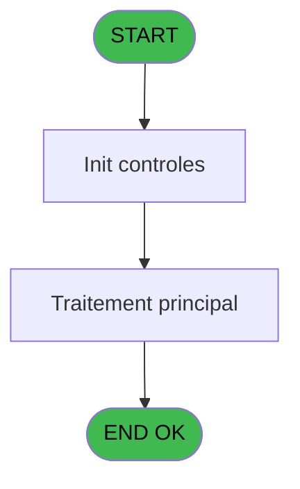

# PBP IDE 416 - Deficit GM echange Repas V3

> **Analyse**: Phases 1-4 2026-02-03 16:56 -> 16:57 (21s) | Assemblage 16:57
> **Pipeline**: V7.2 Enrichi
> **Structure**: 4 onglets (Resume | Ecrans | Donnees | Connexions)

<!-- TAB:Resume -->

## 1. FICHE D'IDENTITE

| Attribut | Valeur |
|----------|--------|
| Projet | PBP |
| IDE Position | 416 |
| Nom Programme | Deficit GM echange Repas V3 |
| Fichier source | `Prg_416.xml` |
| Dossier IDE | Sauvegardes |
| Taches | 2 (0 ecrans visibles) |
| Tables modifiees | 0 |
| Programmes appeles | 0 |
| :warning: Statut | **ORPHELIN_POTENTIEL** |

## 2. DESCRIPTION FONCTIONNELLE

**Deficit GM echange Repas V3** assure la gestion complete de ce processus.

Le flux de traitement s'organise en **1 blocs fonctionnels** :

- **Traitement** (2 taches) : traitements metier divers

**Logique metier** : 1 regles identifiees couvrant conditions metier.

## 3. BLOCS FONCTIONNELS

### 3.1 Traitement (2 taches)

Traitements internes.

---

#### 416.1 - Deficit IGR ECH

**Role** : Traitement : Deficit IGR ECH.

---

#### 416 - GM ECH

**Role** : Traitement : GM ECH.

## 5. REGLES METIER

1 regles identifiees:

### Autres (1 regles)

#### [RM-001] Si [DV]='IGRALA' alors 'GM/IGR Echange repas chalets et inter villages allant à' sinon 'GM/IGR Echange repas chalets et inter villages venant de')&'  '&[DW]

| Element | Detail |
|---------|--------|
| **Condition** | `[DV]='IGRALA'` |
| **Si vrai** | 'GM/IGR Echange repas chalets et inter villages allant à' |
| **Si faux** | 'GM/IGR Echange repas chalets et inter villages venant de')&'  '&[DW] |
| **Expression source** | Expression 8 : `IF([DV]='IGRALA','GM/IGR Echange repas chalets et inter vill` |
| **Exemple** | Si [DV]='IGRALA' → 'GM/IGR Echange repas chalets et inter villages allant à' |

## 6. CONTEXTE

- **Appele par**: (aucun)
- **Appelle**: 0 programmes | **Tables**: 2 (W:0 R:1 L:1) | **Taches**: 2 | **Expressions**: 32

<!-- TAB:Ecrans -->

## 8. ECRANS

*(Programme sans ecran visible)*

## 9. NAVIGATION

### 9.3 Structure hierarchique (2 taches)

| Position | Tache | Type | Dimensions | Bloc |
|----------|-------|------|------------|------|
| **416.1** | [**Deficit IGR ECH** (416.1)](#t1) | - | - | Traitement |
| 416.1.1 | [GM ECH (416)](#t2) | - | - | |

### 9.4 Algorigramme

> **Legende**: Vert = START/END OK | Rouge = END KO | Bleu = Decisions
> *Algorigramme auto-genere. Utiliser `/algorigramme` pour une synthese metier detaillee.*

<!-- TAB:Donnees -->

## 10. TABLES

### Tables utilisees (2)

| ID | Nom | Description | Type | R | W | L | Usages |
|----|-----|-------------|------|---|---|---|--------|
| 825 | fac_hebergement_pro | Hebergement (chambres) | DB | R |   |   | 1 |
| 949 | Table_949 |  | MEM |   |   | L | 1 |

### Colonnes par table (1 / 1 tables avec colonnes identifiees)

Table 825 - fac_hebergement_pro (R) - 1 usages

| Lettre | Variable | Acces | Type |
|--------|----------|-------|------|
| A | V.Nb repas midi | R | Numeric |
| B | V.Nb repas soir | R | Numeric |
| C | V.Nb jh midi | R | Numeric |
| D | V.Nb jh soir | R | Numeric |

## 11. VARIABLES

### 11.1 Parametres entrants (2)

Variables recues en parametre.

| Lettre | Nom | Type | Usage dans |
|--------|-----|------|-----------|
| E | P.Nom lieu | Alpha | 2x parametre entrant |
| F | P.Gestion crise ? | Logical | - |

### 11.2 Variables de session (5)

Variables persistantes pendant toute la session.

| Lettre | Nom | Type | Usage dans |
|--------|-----|------|-----------|
| A | V.Nb repas midi | Numeric | 2x session |
| B | V.Nb repas soir | Numeric | - |
| C | V.Nb jh midi | Numeric | - |
| D | V.Nb jh soir | Numeric | 1x session |
| G | V.Total nb jh | Numeric | - |

## 12. EXPRESSIONS

**32 / 32 expressions decodees (100%)**

### 12.1 Repartition par type

| Type | Expressions | Regles |
|------|-------------|--------|
| CONDITION | 8 | 5 |
| CALCULATION | 12 | 0 |
| CONSTANTE | 5 | 0 |
| FORMAT | 1 | 0 |
| OTHER | 5 | 0 |
| STRING | 1 | 0 |

### 12.2 Expressions cles par type

#### CONDITION (8 expressions)

| Type | IDE | Expression | Regle |
|------|-----|------------|-------|
| CONDITION | 8 | `IF([DV]='IGRALA','GM/IGR Echange repas chalets et inter villages allant à','GM/IGR Echange repas chalets et inter villages venant de')&'  '&[DW]` | [RM-001](#rm-RM-001) |
| CONDITION | 16 | `[EA]='DEJ' OR [EA]='DDE'` | - |
| CONDITION | 32 | `CndRange({1,5}<>'',{1,5})` | - |
| CONDITION | 19 | `[EA]='DIN' OR [EA]='DDE'` | - |
| CONDITION | 9 | `[DV]<>''` | - |
| ... | | *+3 autres* | |

#### CALCULATION (12 expressions)

| Type | IDE | Expression | Regle |
|------|-----|------------|-------|
| CALCULATION | 28 | `[DI]-(([EC]+[EG])*[CR])` | - |
| CALCULATION | 27 | `[DG]-([EC]+[EG])` | - |
| CALCULATION | 26 | `[DH]-(([EC]+[EG])*[CR])` | - |
| CALCULATION | 31 | `{1,3}-(([EC]+[EG])*[CR])` | - |
| CALCULATION | 30 | `[DH]+[DI]` | - |
| ... | | *+7 autres* | |

#### CONSTANTE (5 expressions)

| Type | IDE | Expression | Regle |
|------|-----|------------|-------|
| CONSTANTE | 13 | `'ECH'` | - |
| CONSTANTE | 18 | `0` | - |
| CONSTANTE | 12 | `'IGR'` | - |
| CONSTANTE | 1 | `'GM Echange (Repas)'` | - |
| CONSTANTE | 2 | `'800160274'` | - |

#### FORMAT (1 expressions)

| Type | IDE | Expression | Regle |
|------|-----|------------|-------|
| FORMAT | 3 | `Trim(Translate('%club_exportdata%'))&'trsft\'&Trim(V.Nb jh soir [D])&IF(P.Nom lieu [E]<>'','_'&Trim(P.Nom lieu [E])&'_','_')&'EFF_Deficit_ECH_'&IF([K],Trim(DStr(Date()-2,'YYYYMM')),Trim(DStr(Date(),'YYYYMM')))&'.htm'` | - |

#### OTHER (5 expressions)

| Type | IDE | Expression | Regle |
|------|-----|------------|-------|
| OTHER | 11 | `{1,2}` | - |
| OTHER | 14 | `[DV]` | - |
| OTHER | 10 | `{1,1}` | - |
| OTHER | 5 | `CMonth(V.Nb repas midi [A])` | - |
| OTHER | 6 | `Day(EOM(V.Nb repas midi [A]))` | - |

#### STRING (1 expressions)

| Type | IDE | Expression | Regle |
|------|-----|------------|-------|
| STRING | 4 | `Trim(VG37)` | - |

### 12.3 Toutes les expressions (32)

Voir les 32 expressions

#### CONDITION (8)

| IDE | Expression Decodee |
|-----|-------------------|
| 15 | `[CT]='+'` |
| 17 | `[CT]='-'` |
| 8 | `IF([DV]='IGRALA','GM/IGR Echange repas chalets et inter villages allant à','GM/IGR Echange repas chalets et inter villages venant de')&'  '&[DW]` |
| 7 | `P.Nom lieu [E]<>''` |
| 9 | `[DV]<>''` |
| 16 | `[EA]='DEJ' OR [EA]='DDE'` |
| 19 | `[EA]='DIN' OR [EA]='DDE'` |
| 32 | `CndRange({1,5}<>'',{1,5})` |

#### CALCULATION (12)

| IDE | Expression Decodee |
|-----|-------------------|
| 20 | `[DF]+[EC] +[EG]` |
| 21 | `[DH]+(([EC]+[EG])*[CR])` |
| 22 | `{1,3}+(([EC]+[EG])*[CR])` |
| 23 | `[DG]+[EC] + [EG]` |
| 24 | `[DI]+(([EC]+[EG])*[CR])` |
| 25 | `[DF]-([EC]+[EG])` |
| 26 | `[DH]-(([EC]+[EG])*[CR])` |
| 27 | `[DG]-([EC]+[EG])` |
| 28 | `[DI]-(([EC]+[EG])*[CR])` |
| 29 | `[DF]+[DG]` |
| 30 | `[DH]+[DI]` |
| 31 | `{1,3}-(([EC]+[EG])*[CR])` |

#### CONSTANTE (5)

| IDE | Expression Decodee |
|-----|-------------------|
| 1 | `'GM Echange (Repas)'` |
| 2 | `'800160274'` |
| 12 | `'IGR'` |
| 13 | `'ECH'` |
| 18 | `0` |

#### FORMAT (1)

| IDE | Expression Decodee |
|-----|-------------------|
| 3 | `Trim(Translate('%club_exportdata%'))&'trsft\'&Trim(V.Nb jh soir [D])&IF(P.Nom lieu [E]<>'','_'&Trim(P.Nom lieu [E])&'_','_')&'EFF_Deficit_ECH_'&IF([K],Trim(DStr(Date()-2,'YYYYMM')),Trim(DStr(Date(),'YYYYMM')))&'.htm'` |

#### OTHER (5)

| IDE | Expression Decodee |
|-----|-------------------|
| 5 | `CMonth(V.Nb repas midi [A])` |
| 6 | `Day(EOM(V.Nb repas midi [A]))` |
| 10 | `{1,1}` |
| 11 | `{1,2}` |
| 14 | `[DV]` |

#### STRING (1)

| IDE | Expression Decodee |
|-----|-------------------|
| 4 | `Trim(VG37)` |

<!-- TAB:Connexions -->

## 13. GRAPHE D'APPELS

### 13.1 Chaine depuis Main (Callers)

**Chemin**: (pas de callers directs)

### 13.2 Callers

| IDE | Nom Programme | Nb Appels |
|-----|---------------|-----------|
| - | (aucun) | - |

### 13.3 Callees (programmes appeles)

### 13.4 Detail Callees avec contexte

| IDE | Nom Programme | Appels | Contexte |
|-----|---------------|--------|----------|
| - | (aucun) | - | - |

## 14. RECOMMANDATIONS MIGRATION

### 14.1 Profil du programme

| Metrique | Valeur | Impact migration |
|----------|--------|-----------------|
| Lignes de logique | 64 | Programme compact |
| Expressions | 32 | Peu de logique |
| Tables WRITE | 0 | Impact faible |
| Sous-programmes | 0 | Peu de dependances |
| Ecrans visibles | 0 | Ecran unique ou traitement batch |
| Code desactive | 0% (0 / 64) | Code sain |
| Regles metier | 1 | Quelques regles a preserver |

### 14.2 Plan de migration par bloc

#### Traitement (2 taches: 0 ecran, 2 traitements)

- **Strategie** : 2 service(s) backend injectable(s) (Domain Services).
- Decomposer les taches en services unitaires testables.

### 14.3 Dependances critiques

| Dependance | Type | Appels | Impact |
|------------|------|--------|--------|

---
*Spec DETAILED generee par Pipeline V7.2 - 2026-02-03 16:57*
