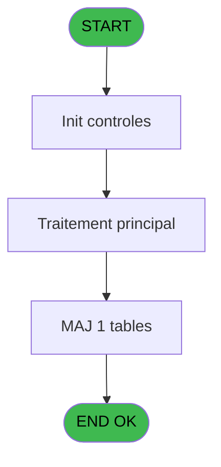
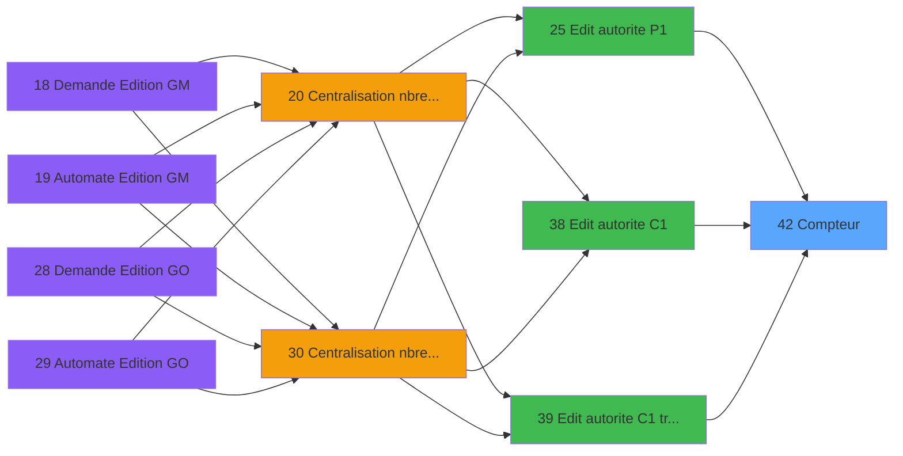

# PBP IDE 42 - Compteur

> **Analyse**: Phases 1-4 2026-02-03 08:52 -> 08:53 (22s) | Assemblage 08:53
> **Pipeline**: V7.2 Enrichi
> **Structure**: 4 onglets (Resume | Ecrans | Donnees | Connexions)

<!-- TAB:Resume -->

## 1. FICHE D'IDENTITE

| Attribut | Valeur |
|----------|--------|
| Projet | PBP |
| IDE Position | 42 |
| Nom Programme | Compteur |
| Fichier source | `Prg_42.xml` |
| Domaine metier | Comptabilite |
| Taches | 1 (0 ecrans visibles) |
| Tables modifiees | 1 |
| Programmes appeles | 0 |

## 2. DESCRIPTION FONCTIONNELLE

**Compteur** assure la gestion complete de ce processus, accessible depuis [Edit autorite P1 (IDE 25)](PBP-IDE-25.md), [Edit autorite C1 (IDE 38)](PBP-IDE-38.md), [Edit autorite C1 trie national (IDE 39)](PBP-IDE-39.md).

Le flux de traitement s'organise en **1 blocs fonctionnels** :

- **Calcul** (1 tache) : calculs de montants, stocks ou compteurs

**Donnees modifiees** : 1 tables en ecriture (tempo_hebergement).

## 3. BLOCS FONCTIONNELS

### 3.1 Calcul (1 tache)

Calculs metier : montants, stocks, compteurs.

---

#### 42 - Compteur

**Role** : Calcul : Compteur.

## 5. REGLES METIER

*(Aucune regle metier identifiee)*

## 6. CONTEXTE

- **Appele par**: [Edit autorite P1 (IDE 25)](PBP-IDE-25.md), [Edit autorite C1 (IDE 38)](PBP-IDE-38.md), [Edit autorite C1 trie national (IDE 39)](PBP-IDE-39.md)
- **Appelle**: 0 programmes | **Tables**: 1 (W:1 R:0 L:0) | **Taches**: 1 | **Expressions**: 19

<!-- TAB:Ecrans -->

## 8. ECRANS

*(Programme sans ecran visible)*

## 9. NAVIGATION

### 9.3 Structure hierarchique (1 tache)

| Position | Tache | Type | Dimensions | Bloc |
|----------|-------|------|------------|------|
| **42.1** | [**Compteur** (42)](#t1) | MDI | - | Calcul |

### 9.4 Algorigramme

> **Legende**: Vert = START/END OK | Rouge = END KO | Bleu = Decisions
> *Algorigramme auto-genere. Utiliser `/algorigramme` pour une synthese metier detaillee.*

<!-- TAB:Donnees -->

## 10. TABLES

### Tables utilisees (1)

| ID | Nom | Description | Type | R | W | L | Usages |
|----|-----|-------------|------|---|---|---|--------|
| 599 | tempo_hebergement | Hebergement (chambres) | DB |   | **W** |   | 1 |

### Colonnes par table (1 / 1 tables avec colonnes identifiees)

Table 599 - tempo_hebergement (**W**) - 1 usages

| Lettre | Variable | Acces | Type |
|--------|----------|-------|------|
| A | > date | W | Date |
| B | > date debut | W | Date |
| C | > date de fin | W | Date |
| D | > nationality | W | Alpha |

## 11. VARIABLES

### 11.1 Autres (4)

Variables diverses.

| Lettre | Nom | Type | Usage dans |
|--------|-----|------|-----------|
| A | > date | Date | 5x refs |
| B | > date debut | Date | 4x refs |
| C | > date de fin | Date | 4x refs |
| D | > nationality | Alpha | 1x refs |

## 12. EXPRESSIONS

**19 / 19 expressions decodees (100%)**

### 12.1 Repartition par type

| Type | Expressions | Regles |
|------|-------------|--------|
| CALCULATION | 6 | 0 |
| CONSTANTE | 6 | 0 |
| REFERENCE_VG | 1 | 0 |
| CONDITION | 6 | 0 |

### 12.2 Expressions cles par type

#### CALCULATION (6 expressions)

| Type | IDE | Expression | Regle |
|------|-----|------------|-------|
| CALCULATION | 16 | `[S]+1` | - |
| CALCULATION | 18 | `[W]+1` | - |
| CALCULATION | 19 | `[AA]+1` | - |
| CALCULATION | 3 | `[H]+1` | - |
| CALCULATION | 4 | `[L]+1` | - |
| ... | | *+1 autres* | |

#### CONSTANTE (6 expressions)

| Type | IDE | Expression | Regle |
|------|-----|------------|-------|
| CONSTANTE | 9 | `'TOT'` | - |
| CONSTANTE | 10 | `'Z'` | - |
| CONSTANTE | 11 | `'P'` | - |
| CONSTANTE | 6 | `'T'` | - |
| CONSTANTE | 7 | `'A'` | - |
| ... | | *+1 autres* | |

#### REFERENCE_VG (1 expressions)

| Type | IDE | Expression | Regle |
|------|-----|------------|-------|
| REFERENCE_VG | 1 | `VG1` | - |

#### CONDITION (6 expressions)

| Type | IDE | Expression | Regle |
|------|-----|------------|-------|
| CONDITION | 14 | `> date [A]=> date debut [B]` | - |
| CONDITION | 15 | `> date [A]=> date de fin [C]` | - |
| CONDITION | 17 | `Range (> date [A],> date debut [B],> date de fin [C])` | - |
| CONDITION | 2 | `> nationality [D]` | - |
| CONDITION | 12 | `> date debut [B]<> date [A] AND > date de fin [C]>> date [A]` | - |
| ... | | *+1 autres* | |

<!-- TAB:Connexions -->

## 13. GRAPHE D'APPELS

### 13.1 Chaine depuis Main (Callers)

Main -> ... -> [Edit autorite P1 (IDE 25)](PBP-IDE-25.md) -> **Compteur (IDE 42)**

Main -> ... -> [Edit autorite C1 (IDE 38)](PBP-IDE-38.md) -> **Compteur (IDE 42)**

Main -> ... -> [Edit autorite C1 trie national (IDE 39)](PBP-IDE-39.md) -> **Compteur (IDE 42)**

### 13.2 Callers

| IDE | Nom Programme | Nb Appels |
|-----|---------------|-----------|
| [25](PBP-IDE-25.md) | Edit autorite P1 | 1 |
| [38](PBP-IDE-38.md) | Edit autorite C1 | 1 |
| [39](PBP-IDE-39.md) | Edit autorite C1 trie national | 1 |

### 13.3 Callees (programmes appeles)

### 13.4 Detail Callees avec contexte

| IDE | Nom Programme | Appels | Contexte |
|-----|---------------|--------|----------|
| - | (aucun) | - | - |

## 14. RECOMMANDATIONS MIGRATION

### 14.1 Profil du programme

| Metrique | Valeur | Impact migration |
|----------|--------|-----------------|
| Lignes de logique | 57 | Programme compact |
| Expressions | 19 | Peu de logique |
| Tables WRITE | 1 | Impact faible |
| Sous-programmes | 0 | Peu de dependances |
| Ecrans visibles | 0 | Ecran unique ou traitement batch |
| Code desactive | 0% (0 / 57) | Code sain |
| Regles metier | 0 | Pas de regle identifiee |

### 14.2 Plan de migration par bloc

#### Calcul (1 tache: 0 ecran, 1 traitement)

- **Strategie** : Services de calcul purs (Domain Services).
- Migrer la logique de calcul (stock, compteurs, montants)

### 14.3 Dependances critiques

| Dependance | Type | Appels | Impact |
|------------|------|--------|--------|
| tempo_hebergement | Table WRITE (Database) | 1x | Schema + repository |

---
*Spec DETAILED generee par Pipeline V7.2 - 2026-02-03 08:53*
