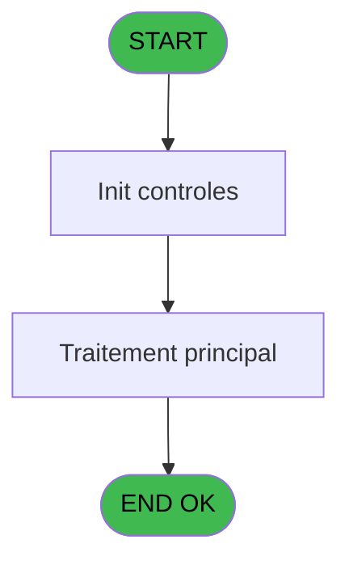

# PBP IDE 45 - Export CM2

> **Analyse**: Phases 1-4 2026-02-03 08:54 -> 08:54 (21s) | Assemblage 08:54
> **Pipeline**: V7.2 Enrichi
> **Structure**: 4 onglets (Resume | Ecrans | Donnees | Connexions)

<!-- TAB:Resume -->

## 1. FICHE D'IDENTITE

| Attribut | Valeur |
|----------|--------|
| Projet | PBP |
| IDE Position | 45 |
| Nom Programme | Export CM2 |
| Fichier source | `Prg_45.xml` |
| Domaine metier | General |
| Taches | 1 (0 ecrans visibles) |
| Tables modifiees | 0 |
| Programmes appeles | 0 |
| :warning: Statut | **ORPHELIN_POTENTIEL** |

## 2. DESCRIPTION FONCTIONNELLE

**Export CM2** assure la gestion complete de ce processus.

Le flux de traitement s'organise en **1 blocs fonctionnels** :

- **Traitement** (1 tache) : traitements metier divers

## 3. BLOCS FONCTIONNELS

### 3.1 Traitement (1 tache)

Traitements internes.

---

#### 45 - Export CM2

**Role** : Traitement : Export CM2.

## 5. REGLES METIER

*(Aucune regle metier identifiee)*

## 6. CONTEXTE

- **Appele par**: (aucun)
- **Appelle**: 0 programmes | **Tables**: 9 (W:0 R:1 L:8) | **Taches**: 1 | **Expressions**: 18

<!-- TAB:Ecrans -->

## 8. ECRANS

*(Programme sans ecran visible)*

## 9. NAVIGATION

### 9.3 Structure hierarchique (1 tache)

| Position | Tache | Type | Dimensions | Bloc |
|----------|-------|------|------------|------|
| **45.1** | [**Export CM2** (45)](#t1) | MDI | - | Traitement |

### 9.4 Algorigramme

> **Legende**: Vert = START/END OK | Rouge = END KO | Bleu = Decisions
> *Algorigramme auto-genere. Utiliser `/algorigramme` pour une synthese metier detaillee.*

<!-- TAB:Donnees -->

## 10. TABLES

### Tables utilisees (9)

| ID | Nom | Description | Type | R | W | L | Usages |
|----|-----|-------------|------|---|---|---|--------|
| 26 | comptes_speciaux_spc | Comptes GM (generaux) | DB | R |   |   | 1 |
| 30 | gm-recherche_____gmr | Index de recherche | DB |   |   | L | 1 |
| 31 | gm-complet_______gmc |  | DB |   |   | L | 1 |
| 34 | hebergement______heb | Hebergement (chambres) | DB |   |   | L | 1 |
| 119 | tables_pays_tel_ |  | DB |   |   | L | 1 |
| 285 | email |  | DB |   |   | L | 1 |
| 358 | import_mod |  | DB |   |   | L | 1 |
| 478 | tempo_ventes | Table temporaire ecran | TMP |   |   | L | 1 |
| 845 | stat_vendeur_date |  | TMP |   |   | L | 1 |

### Colonnes par table (1 / 1 tables avec colonnes identifiees)

Table 26 - comptes_speciaux_spc (R) - 1 usages

| Lettre | Variable | Acces | Type |
|--------|----------|-------|------|
| A | v.retour compte special | R | Logical |
| B | v.separateur | R | Alpha |
| C | v.add info | R | Alpha |
| D | v.ligne | R | Alpha |

## 11. VARIABLES

### 11.1 Variables de session (4)

Variables persistantes pendant toute la session.

| Lettre | Nom | Type | Usage dans |
|--------|-----|------|-----------|
| A | v.retour compte special | Logical | - |
| B | v.separateur | Alpha | 1x session |
| C | v.add info | Alpha | 1x session |
| D | v.ligne | Alpha | 1x session |

## 12. EXPRESSIONS

**18 / 18 expressions decodees (100%)**

### 12.1 Repartition par type

| Type | Expressions | Regles |
|------|-------------|--------|
| CONSTANTE | 3 | 0 |
| DATE | 1 | 0 |
| CONCATENATION | 3 | 0 |
| OTHER | 7 | 0 |
| REFERENCE_VG | 3 | 0 |
| NEGATION | 1 | 0 |

### 12.2 Expressions cles par type

#### CONSTANTE (3 expressions)

| Type | IDE | Expression | Regle |
|------|-----|------------|-------|
| CONSTANTE | 6 | `'H'` | - |
| CONSTANTE | 2 | `'C'` | - |
| CONSTANTE | 1 | `'c:\temp\exp_fidelio.csv'` | - |

#### DATE (1 expressions)

| Type | IDE | Expression | Regle |
|------|-----|------------|-------|
| DATE | 3 | `Date ()` | - |

#### CONCATENATION (3 expressions)

| Type | IDE | Expression | Regle |
|------|-----|------------|-------|
| CONCATENATION | 10 | `'Member Id'&[AO]&'Title'&[AO]&'Name'&[AO]&'Surname'&[AO]&'Begin of Stay'&[AO]&'End of Stay'&[AO]&'Room Number'&[AO]&'Birthdate'&[AO]&'docType'&[AO]&'docNumber'&[AO]&'documentAdditionalInfo'&[AO]&'citizenship'&[AO]&'gender'&[AO]&'recType'&[AO]&'reservedNumber'&[AO]&'Fidelity'&[AO]&'Donator'&[AO]&'VIP'&[AO]&'Shareholder'&[AO]&'Ambassador'&[AO]&'Reported'&[AO]&'DeliveryCity'&[AO]&'StreetNumber'&[AO]&'StreetName'&[AO]&'Address2'&[AO]&'ZipCode'&[AO]&'City'&[AO]&'Email'&[AO]&'Mobile'&[AO]&'Country'&[AO]&'Loyalty'&[AO]&'FirstName2'&[AO]&'FirstName3'&[AO]&'FirstName4'` | - |
| CONCATENATION | 13 | `Str (v.ligne [D],'10P0Z0')&Str ([F],'3P0')&[AO]&Trim ([V])&[AO]&Trim ([W])&[AO]&Trim ([X])&[AO]&DStr ([K],'MM/DD/YYYY')&[AO]&DStr ([L],'MM/DD/YYYY')&[AO]&Trim ([R])&[AO]&DStr ([Y],'MM/DD/YYYY')&[AO]&IF ([AB]='RU','0','3')&[AO]&Trim ([AD])&[AO]&Trim ([AP])&[AO]&Trim ([AB])&[AO]&IF ([V]='Mr','0','1')&[AO]&IF (IN([CI],'VILL','LOC','OFFI','MARI','GE','STAG','ANS','PRES'),'0','1')&[AO]&Str ([AI],'9P0Z0')&Str ([AJ],'3P0')&[AO]&Trim([BU])&[AO]&Trim([BT])&[AO]&Trim([BV])&[AO]&Trim([BX])&[AO]&Trim([BW])&[AO]&Trim([BY])&[AO]&Trim([AG])&[AO]&Trim([BG])&[AO]&Trim([BH])&[AO]&Trim([BC])&[AO]&Trim([BD])&[AO]&Trim([BI])&[AO]&Trim([BN])&[AO]&Trim([BO])&[AO]&Trim([CF])&[AO]&Trim([CM])&[AO]&Trim([CN])&[AO]&Trim([CO])&[AO]&Trim([CP])` | - |
| CONCATENATION | 12 | `'DeliveryDate:'&DStr ([AE],'MM/DD/YYYY')&' ValidityDate:'&DStr ([AF],'MM/DD/YYYY')&' Country:'&Trim ([AH])` | - |

#### OTHER (7 expressions)

| Type | IDE | Expression | Regle |
|------|-----|------------|-------|
| OTHER | 11 | `SetCrsr (1)` | - |
| OTHER | 16 | `[CD]` | - |
| OTHER | 18 | `[BU]` | - |
| OTHER | 8 | `SetCrsr (2)` | - |
| OTHER | 4 | `v.separateur [B]` | - |
| ... | | *+2 autres* | |

#### REFERENCE_VG (3 expressions)

| Type | IDE | Expression | Regle |
|------|-----|------------|-------|
| REFERENCE_VG | 17 | `VG35` | - |
| REFERENCE_VG | 15 | `VG35` | - |
| REFERENCE_VG | 9 | `VG36` | - |

#### NEGATION (1 expressions)

| Type | IDE | Expression | Regle |
|------|-----|------------|-------|
| NEGATION | 14 | `NOT ([AK])` | - |

<!-- TAB:Connexions -->

## 13. GRAPHE D'APPELS

### 13.1 Chaine depuis Main (Callers)

**Chemin**: (pas de callers directs)

### 13.2 Callers

| IDE | Nom Programme | Nb Appels |
|-----|---------------|-----------|
| - | (aucun) | - |

### 13.3 Callees (programmes appeles)

### 13.4 Detail Callees avec contexte

| IDE | Nom Programme | Appels | Contexte |
|-----|---------------|--------|----------|
| - | (aucun) | - | - |

## 14. RECOMMANDATIONS MIGRATION

### 14.1 Profil du programme

| Metrique | Valeur | Impact migration |
|----------|--------|-----------------|
| Lignes de logique | 114 | Programme compact |
| Expressions | 18 | Peu de logique |
| Tables WRITE | 0 | Impact faible |
| Sous-programmes | 0 | Peu de dependances |
| Ecrans visibles | 0 | Ecran unique ou traitement batch |
| Code desactive | 0% (0 / 114) | Code sain |
| Regles metier | 0 | Pas de regle identifiee |

### 14.2 Plan de migration par bloc

#### Traitement (1 tache: 0 ecran, 1 traitement)

- **Strategie** : 1 service(s) backend injectable(s) (Domain Services).
- Decomposer les taches en services unitaires testables.

### 14.3 Dependances critiques

| Dependance | Type | Appels | Impact |
|------------|------|--------|--------|

---
*Spec DETAILED generee par Pipeline V7.2 - 2026-02-03 08:54*
