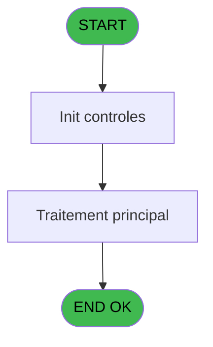
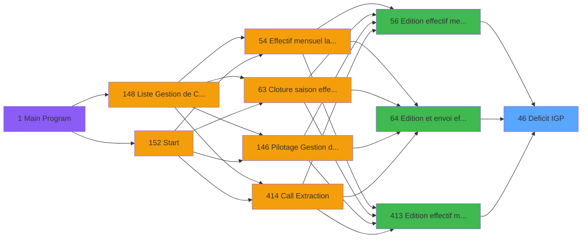

# PBP IDE 46 - Deficit IGP

> **Analyse**: Phases 1-4 2026-02-03 08:54 -> 08:55 (22s) | Assemblage 08:55
> **Pipeline**: V7.2 Enrichi
> **Structure**: 4 onglets (Resume | Ecrans | Donnees | Connexions)

<!-- TAB:Resume -->

## 1. FICHE D'IDENTITE

| Attribut | Valeur |
|----------|--------|
| Projet | PBP |
| IDE Position | 46 |
| Nom Programme | Deficit IGP |
| Fichier source | `Prg_46.xml` |
| Domaine metier | General |
| Taches | 2 (0 ecrans visibles) |
| Tables modifiees | 0 |
| Programmes appeles | 0 |

## 2. DESCRIPTION FONCTIONNELLE

**Deficit IGP** assure la gestion complete de ce processus, accessible depuis [Edition et envoi effectif (IDE 64)](PBP-IDE-64.md), [Edition effectif mensuel (IDE 56)](PBP-IDE-56.md), [Edition effectif mensuel (IDE 413)](PBP-IDE-413.md).

Le flux de traitement s'organise en **1 blocs fonctionnels** :

- **Traitement** (2 taches) : traitements metier divers

## 3. BLOCS FONCTIONNELS

### 3.1 Traitement (2 taches)

Traitements internes.

---

#### 46 - Deficit IGP

**Role** : Traitement : Deficit IGP.

---

#### 46.1 - Deficit IGP

**Role** : Traitement : Deficit IGP.

## 5. REGLES METIER

*(Aucune regle metier identifiee)*

## 6. CONTEXTE

- **Appele par**: [Edition et envoi effectif (IDE 64)](PBP-IDE-64.md), [Edition effectif mensuel (IDE 56)](PBP-IDE-56.md), [Edition effectif mensuel (IDE 413)](PBP-IDE-413.md)
- **Appelle**: 0 programmes | **Tables**: 2 (W:0 R:1 L:1) | **Taches**: 2 | **Expressions**: 30

<!-- TAB:Ecrans -->

## 8. ECRANS

*(Programme sans ecran visible)*

## 9. NAVIGATION

### 9.3 Structure hierarchique (2 taches)

| Position | Tache | Type | Dimensions | Bloc |
|----------|-------|------|------------|------|
| **46.1** | [**Deficit IGP** (46)](#t1) | - | - | Traitement |
| 46.1.1 | [Deficit IGP (46.1)](#t4) | - | - | |

### 9.4 Algorigramme

> **Legende**: Vert = START/END OK | Rouge = END KO | Bleu = Decisions
> *Algorigramme auto-genere. Utiliser `/algorigramme` pour une synthese metier detaillee.*

<!-- TAB:Donnees -->

## 10. TABLES

### Tables utilisees (2)

| ID | Nom | Description | Type | R | W | L | Usages |
|----|-----|-------------|------|---|---|---|--------|
| 802 | type_prestation | Prestations/services vendus | DB |   |   | L | 1 |
| 834 | tpe_par_terminal |  | DB | R |   |   | 1 |

### Colonnes par table (1 / 1 tables avec colonnes identifiees)

Table 834 - tpe_par_terminal (R) - 1 usages

| Lettre | Variable | Acces | Type |
|--------|----------|-------|------|
| A | P.Date debut | R | Date |
| B | P.Date fin | R | Date |
| C | P.Code village | R | Alpha |
| D | P.Lieu sejour | R | Alpha |
| E | P.Nom lieu sejour | R | Alpha |
| F | P.Gestion crise ? | R | Logical |
| G | P.IGP ou IGP2? | R | Unicode |
| H | V.Nb JH du mois | R | Numeric |
| I | V.Date debut | R | Date |
| J | V.Date fin | R | Date |
| K | V.Date debut premiere periode | R | Date |
| L | V.Date fin derniere periode | R | Date |
| M | V.Date debut sej | R | Date |
| N | V.Date fin sej | R | Date |
| O | V.Heure debut premiere periode | R | Alpha |
| P | V.Heure fin derniere periode | R | Alpha |

## 11. VARIABLES

### 11.1 Parametres entrants (6)

Variables recues du programme appelant ([Edition et envoi effectif (IDE 64)](PBP-IDE-64.md)).

| Lettre | Nom | Type | Usage dans |
|--------|-----|------|-----------|
| A | P.Date debut | Date | - |
| B | P.Date fin | Date | - |
| C | P.Code village | Alpha | - |
| D | P.Lieu sejour | Alpha | - |
| E | P.Nom lieu sejour | Alpha | - |
| F | P.Gestion crise ? | Logical | 2x parametre entrant |

### 11.2 Variables de session (10)

Variables persistantes pendant toute la session.

| Lettre | Nom | Type | Usage dans |
|--------|-----|------|-----------|
| G | V.Total JH avec CDV | Numeric | - |
| H | V.Total JH hors CDV | Numeric | - |
| I | V.Date debut | Date | - |
| J | V.Date fin | Date | - |
| K | V.Date debut premiere periode | Date | - |
| L | V.Date fin derniere periode | Date | - |
| M | V.Date debut sej | Date | - |
| N | V.Date fin sej | Date | - |
| O | V.Heure debut premiere periode | Alpha | - |
| P | V.Heure fin derniere periode | Alpha | - |

Toutes les 16 variables (liste complete)

| Cat | Lettre | Nom Variable | Type |
|-----|--------|--------------|------|
| P0 | **A** | P.Date debut | Date |
| P0 | **B** | P.Date fin | Date |
| P0 | **C** | P.Code village | Alpha |
| P0 | **D** | P.Lieu sejour | Alpha |
| P0 | **E** | P.Nom lieu sejour | Alpha |
| P0 | **F** | P.Gestion crise ? | Logical |
| V. | **G** | V.Total JH avec CDV | Numeric |
| V. | **H** | V.Total JH hors CDV | Numeric |
| V. | **I** | V.Date debut | Date |
| V. | **J** | V.Date fin | Date |
| V. | **K** | V.Date debut premiere periode | Date |
| V. | **L** | V.Date fin derniere periode | Date |
| V. | **M** | V.Date debut sej | Date |
| V. | **N** | V.Date fin sej | Date |
| V. | **O** | V.Heure debut premiere periode | Alpha |
| V. | **P** | V.Heure fin derniere periode | Alpha |

## 12. EXPRESSIONS

**30 / 30 expressions decodees (100%)**

### 12.1 Repartition par type

| Type | Expressions | Regles |
|------|-------------|--------|
| CALCULATION | 1 | 0 |
| CONSTANTE | 2 | 0 |
| FORMAT | 1 | 0 |
| OTHER | 12 | 0 |
| CONDITION | 4 | 0 |
| STRING | 10 | 0 |

### 12.2 Expressions cles par type

#### CALCULATION (1 expressions)

| Type | IDE | Expression | Regle |
|------|-----|------------|-------|
| CALCULATION | 27 | `[AN]+[DM]` | - |

#### CONSTANTE (2 expressions)

| Type | IDE | Expression | Regle |
|------|-----|------------|-------|
| CONSTANTE | 3 | `'IGP2'` | - |
| CONSTANTE | 2 | `'IGP'` | - |

#### FORMAT (1 expressions)

| Type | IDE | Expression | Regle |
|------|-----|------------|-------|
| FORMAT | 1 | `Trim(Translate('%club_exportdata%'))&'trsft\'&Trim([BU])&IF([CT]<>'','_'&Trim([CT])&'_','_')&'EFF_Deficit_IGP_'&IF([DF],Trim(DStr(Date()-2,'YYYYMM')),Trim(DStr(Date(),'YYYYMM')))&'.htm'` | - |

#### OTHER (12 expressions)

| Type | IDE | Expression | Regle |
|------|-----|------------|-------|
| OTHER | 23 | `MlsTrans('Type de logement')` | - |
| OTHER | 22 | `MlsTrans('Fin de séjour')` | - |
| OTHER | 21 | `MlsTrans('Début de séjour')` | - |
| OTHER | 26 | `MlsTrans('Motif')` | - |
| OTHER | 25 | `MlsTrans('Dossier')` | - |
| ... | | *+7 autres* | |

#### CONDITION (4 expressions)

| Type | IDE | Expression | Regle |
|------|-----|------------|-------|
| CONDITION | 29 | `[CJ]='IGP'` | - |
| CONDITION | 30 | `[CJ]='IGP2'` | - |
| CONDITION | 7 | `[CT]<>''` | - |
| CONDITION | 28 | `[CI]='GM' AND ([CJ]='IGP' OR [CJ]='IGP2')` | - |

#### STRING (10 expressions)

| Type | IDE | Expression | Regle |
|------|-----|------------|-------|
| STRING | 13 | `Trim(MlsTrans('Nombre de jours du mois'))` | - |
| STRING | 12 | `Trim(MlsTrans('Lieu de séjour'))` | - |
| STRING | 14 | `Trim(MlsTrans('Total JH du mois'))` | - |
| STRING | 16 | `Trim(MlsTrans('Total JH IGP2 NA du mois'))` | - |
| STRING | 15 | `Trim(MlsTrans('Total JH IGP NA du mois'))` | - |
| ... | | *+5 autres* | |

### 12.3 Toutes les expressions (30)

Voir les 30 expressions

#### CALCULATION (1)

| IDE | Expression Decodee |
|-----|-------------------|
| 27 | `[AN]+[DM]` |

#### CONSTANTE (2)

| IDE | Expression Decodee |
|-----|-------------------|
| 2 | `'IGP'` |
| 3 | `'IGP2'` |

#### FORMAT (1)

| IDE | Expression Decodee |
|-----|-------------------|
| 1 | `Trim(Translate('%club_exportdata%'))&'trsft\'&Trim([BU])&IF([CT]<>'','_'&Trim([CT])&'_','_')&'EFF_Deficit_IGP_'&IF([DF],Trim(DStr(Date()-2,'YYYYMM')),Trim(DStr(Date(),'YYYYMM')))&'.htm'` |

#### OTHER (12)

| IDE | Expression Decodee |
|-----|-------------------|
| 5 | `Day(EOM(P.Gestion crise ? [F]))` |
| 6 | `CMonth(P.Gestion crise ? [F])` |
| 17 | `MlsTrans('Invités gratuits pensions')` |
| 18 | `MlsTrans('Invitant')` |
| 19 | `MlsTrans('Nom')` |
| 20 | `MlsTrans('Prénom')` |
| 21 | `MlsTrans('Début de séjour')` |
| 22 | `MlsTrans('Fin de séjour')` |
| 23 | `MlsTrans('Type de logement')` |
| 24 | `MlsTrans('Nombre de JH')` |
| 25 | `MlsTrans('Dossier')` |
| 26 | `MlsTrans('Motif')` |

#### CONDITION (4)

| IDE | Expression Decodee |
|-----|-------------------|
| 7 | `[CT]<>''` |
| 28 | `[CI]='GM' AND ([CJ]='IGP' OR [CJ]='IGP2')` |
| 29 | `[CJ]='IGP'` |
| 30 | `[CJ]='IGP2'` |

#### STRING (10)

| IDE | Expression Decodee |
|-----|-------------------|
| 4 | `Trim(VG37)` |
| 8 | `Trim(MlsTrans('Nom du Chef de Village'))` |
| 9 | `Trim(MlsTrans('Signature du Chef de Village'))` |
| 10 | `Trim(MlsTrans('Village'))` |
| 11 | `Trim(MlsTrans('Mois'))` |
| 12 | `Trim(MlsTrans('Lieu de séjour'))` |
| 13 | `Trim(MlsTrans('Nombre de jours du mois'))` |
| 14 | `Trim(MlsTrans('Total JH du mois'))` |
| 15 | `Trim(MlsTrans('Total JH IGP NA du mois'))` |
| 16 | `Trim(MlsTrans('Total JH IGP2 NA du mois'))` |

<!-- TAB:Connexions -->

## 13. GRAPHE D'APPELS

### 13.1 Chaine depuis Main (Callers)

Main -> ... -> [Edition et envoi effectif (IDE 64)](PBP-IDE-64.md) -> **Deficit IGP (IDE 46)**

Main -> ... -> [Edition effectif mensuel (IDE 56)](PBP-IDE-56.md) -> **Deficit IGP (IDE 46)**

Main -> ... -> [Edition effectif mensuel (IDE 413)](PBP-IDE-413.md) -> **Deficit IGP (IDE 46)**

### 13.2 Callers

| IDE | Nom Programme | Nb Appels |
|-----|---------------|-----------|
| [64](PBP-IDE-64.md) | Edition et envoi effectif | 2 |
| [56](PBP-IDE-56.md) | Edition effectif mensuel | 1 |
| [413](PBP-IDE-413.md) | Edition effectif mensuel | 1 |

### 13.3 Callees (programmes appeles)

### 13.4 Detail Callees avec contexte

| IDE | Nom Programme | Appels | Contexte |
|-----|---------------|--------|----------|
| - | (aucun) | - | - |

## 14. RECOMMANDATIONS MIGRATION

### 14.1 Profil du programme

| Metrique | Valeur | Impact migration |
|----------|--------|-----------------|
| Lignes de logique | 103 | Programme compact |
| Expressions | 30 | Peu de logique |
| Tables WRITE | 0 | Impact faible |
| Sous-programmes | 0 | Peu de dependances |
| Ecrans visibles | 0 | Ecran unique ou traitement batch |
| Code desactive | 0% (0 / 103) | Code sain |
| Regles metier | 0 | Pas de regle identifiee |

### 14.2 Plan de migration par bloc

#### Traitement (2 taches: 0 ecran, 2 traitements)

- **Strategie** : 2 service(s) backend injectable(s) (Domain Services).
- Decomposer les taches en services unitaires testables.

### 14.3 Dependances critiques

| Dependance | Type | Appels | Impact |
|------------|------|--------|--------|

---
*Spec DETAILED generee par Pipeline V7.2 - 2026-02-03 08:55*
