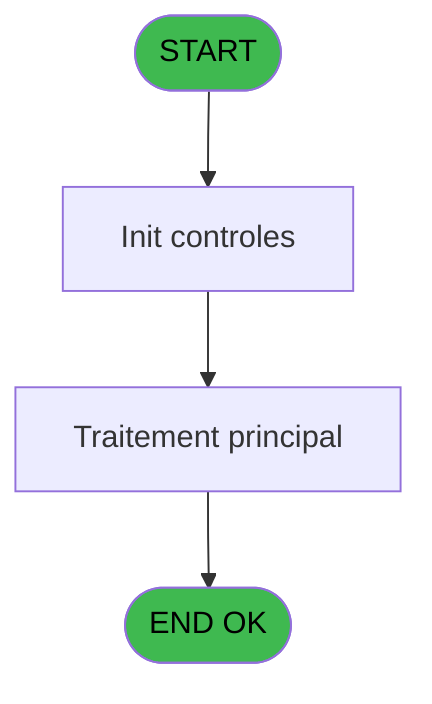
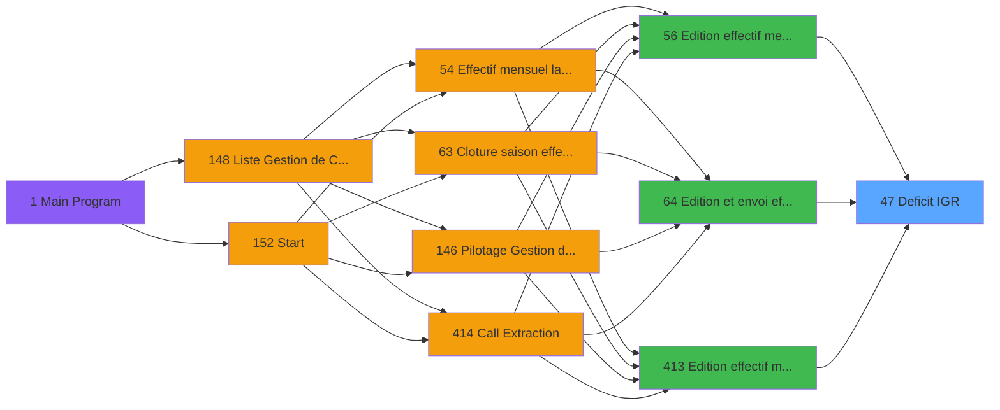

# PBP IDE 47 - Deficit IGR

> **Analyse**: Phases 1-4 2026-02-03 08:55 -> 08:55 (22s) | Assemblage 08:55
> **Pipeline**: V7.2 Enrichi
> **Structure**: 4 onglets (Resume | Ecrans | Donnees | Connexions)

<!-- TAB:Resume -->

## 1. FICHE D'IDENTITE

| Attribut | Valeur |
|----------|--------|
| Projet | PBP |
| IDE Position | 47 |
| Nom Programme | Deficit IGR |
| Fichier source | `Prg_47.xml` |
| Domaine metier | General |
| Taches | 3 (0 ecrans visibles) |
| Tables modifiees | 0 |
| Programmes appeles | 0 |

## 2. DESCRIPTION FONCTIONNELLE

**Deficit IGR** assure la gestion complete de ce processus, accessible depuis [Edition et envoi effectif (IDE 64)](PBP-IDE-64.md), [Edition effectif mensuel (IDE 56)](PBP-IDE-56.md), [Edition effectif mensuel (IDE 413)](PBP-IDE-413.md).

Le flux de traitement s'organise en **1 blocs fonctionnels** :

- **Traitement** (3 taches) : traitements metier divers

## 3. BLOCS FONCTIONNELS

### 3.1 Traitement (3 taches)

Traitements internes.

---

#### 47.1 - Deficit IGR

**Role** : Traitement : Deficit IGR.

---

#### 47 - IGR

**Role** : Traitement interne.

---

#### 47.2 - Deficit IGR

**Role** : Traitement : Deficit IGR.

## 5. REGLES METIER

*(Aucune regle metier identifiee)*

## 6. CONTEXTE

- **Appele par**: [Edition et envoi effectif (IDE 64)](PBP-IDE-64.md), [Edition effectif mensuel (IDE 56)](PBP-IDE-56.md), [Edition effectif mensuel (IDE 413)](PBP-IDE-413.md)
- **Appelle**: 0 programmes | **Tables**: 6 (W:0 R:2 L:4) | **Taches**: 3 | **Expressions**: 27

<!-- TAB:Ecrans -->

## 8. ECRANS

*(Programme sans ecran visible)*

## 9. NAVIGATION

### 9.3 Structure hierarchique (3 taches)

| Position | Tache | Type | Dimensions | Bloc |
|----------|-------|------|------------|------|
| **47.1** | [**Deficit IGR** (47.1)](#t1) | - | - | Traitement |
| 47.1.1 | [IGR (47)](#t2) | - | - | |
| 47.1.2 | [Deficit IGR (47.2)](#t6) | - | - | |

### 9.4 Algorigramme

> **Legende**: Vert = START/END OK | Rouge = END KO | Bleu = Decisions
> *Algorigramme auto-genere. Utiliser `/algorigramme` pour une synthese metier detaillee.*

<!-- TAB:Donnees -->

## 10. TABLES

### Tables utilisees (6)

| ID | Nom | Description | Type | R | W | L | Usages |
|----|-----|-------------|------|---|---|---|--------|
| 30 | gm-recherche_____gmr | Index de recherche | DB | R |   |   | 1 |
| 34 | hebergement______heb | Hebergement (chambres) | DB |   |   | L | 1 |
| 77 | articles_________art | Articles et stock | DB |   |   | L | 1 |
| 802 | type_prestation | Prestations/services vendus | DB |   |   | L | 1 |
| 825 | fac_hebergement_pro | Hebergement (chambres) | DB |   |   | L | 1 |
| 826 | wording_mention_legal |  | DB | R |   |   | 1 |

### Colonnes par table (2 / 2 tables avec colonnes identifiees)

Table 30 - gm-recherche_____gmr (R) - 1 usages

| Lettre | Variable | Acces | Type |
|--------|----------|-------|------|
| A | V.Total JH | R | Numeric |
| B | V.Lieu sejour | R | Alpha |

Table 826 - wording_mention_legal (R) - 1 usages

| Lettre | Variable | Acces | Type |
|--------|----------|-------|------|
| A | V.Nb repas midi ESF | R | Numeric |
| B | V.Nb repas soir ESF | R | Numeric |
| C | V.Nb jh midi ESF | R | Numeric |
| D | V.Nb jh soir ESF | R | Numeric |
| E | V.Existe ESF ? | R | Logical |
| F | V.Nb repas midi autre | R | Numeric |
| G | V.Nb repas soir autre | R | Numeric |
| H | V.Nb jh midi autre | R | Numeric |
| I | V.Nb jh soir autre | R | Numeric |

## 11. VARIABLES

### 11.1 Variables de session (10)

Variables persistantes pendant toute la session.

| Lettre | Nom | Type | Usage dans |
|--------|-----|------|-----------|
| A | V.Nb repas midi ESF | Numeric | 2x session |
| B | V.Nb repas soir ESF | Numeric | - |
| C | V.Nb jh midi ESF | Numeric | - |
| D | V.Nb jh soir ESF | Numeric | 1x session |
| E | V.Existe ESF ? | Logical | 6x session |
| F | V.Nb repas midi autre | Numeric | 2x session |
| G | V.Nb repas soir autre | Numeric | 2x session |
| H | V.Nb jh midi autre | Numeric | - |
| I | V.Nb jh soir autre | Numeric | - |
| J | V.Clause where vrl | Alpha | - |

## 12. EXPRESSIONS

**27 / 27 expressions decodees (100%)**

### 12.1 Repartition par type

| Type | Expressions | Regles |
|------|-------------|--------|
| FORMAT | 1 | 0 |
| OTHER | 19 | 0 |
| CONDITION | 4 | 0 |
| STRING | 1 | 0 |
| CONCATENATION | 2 | 0 |

### 12.2 Expressions cles par type

#### FORMAT (1 expressions)

| Type | IDE | Expression | Regle |
|------|-----|------------|-------|
| FORMAT | 1 | `Trim(Translate('%club_exportdata%'))&'trsft\'&Trim(V.Nb jh soir ESF [D])&IF(V.Existe ESF ? [E]<>'','_'&Trim(V.Existe ESF ? [E])&'_','_')&'EFF_Deficit_IGR_'&IF([P],Trim(DStr(Date()-2,'YYYYMM')),Trim(DStr(Date(),'YYYYMM')))&'.htm'` | - |

#### OTHER (19 expressions)

| Type | IDE | Expression | Regle |
|------|-----|------------|-------|
| OTHER | 21 | `MlsTrans('Nom')` | - |
| OTHER | 22 | `MlsTrans('Prénom')` | - |
| OTHER | 19 | `MlsTrans('Mois')` | - |
| OTHER | 20 | `MlsTrans('Total JH repas du mois')` | - |
| OTHER | 23 | `MlsTrans('Motif')` | - |
| ... | | *+14 autres* | |

#### CONDITION (4 expressions)

| Type | IDE | Expression | Regle |
|------|-----|------------|-------|
| CONDITION | 9 | `'vrlvsl_flag_annulation<>''A'''` | - |
| CONDITION | 10 | `V.Existe ESF ? [E]<>''` | - |
| CONDITION | 7 | `V.Existe ESF ? [E]<>'' AND V.Existe ESF ? [E]=V.Nb repas soir autre [G]` | - |
| CONDITION | 8 | `V.Existe ESF ? [E]<>'' AND V.Existe ESF ? [E]<>V.Nb repas soir autre [G]` | - |

#### STRING (1 expressions)

| Type | IDE | Expression | Regle |
|------|-----|------------|-------|
| STRING | 2 | `Trim(VG37)` | - |

#### CONCATENATION (2 expressions)

| Type | IDE | Expression | Regle |
|------|-----|------------|-------|
| CONCATENATION | 6 | `Trim(V.Nb repas midi autre [F])&' and heb_lieu_de_sejour<>'''&Trim(V.Existe ESF ? [E])&''''` | - |
| CONCATENATION | 5 | `Trim(V.Nb repas midi autre [F])&' and heb_lieu_de_sejour='''&Trim(V.Existe ESF ? [E])&''''` | - |

### 12.3 Toutes les expressions (27)

Voir les 27 expressions

#### FORMAT (1)

| IDE | Expression Decodee |
|-----|-------------------|
| 1 | `Trim(Translate('%club_exportdata%'))&'trsft\'&Trim(V.Nb jh soir ESF [D])&IF(V.Existe ESF ? [E]<>'','_'&Trim(V.Existe ESF ? [E])&'_','_')&'EFF_Deficit_IGR_'&IF([P],Trim(DStr(Date()-2,'YYYYMM')),Trim(DStr(Date(),'YYYYMM')))&'.htm'` |

#### OTHER (19)

| IDE | Expression Decodee |
|-----|-------------------|
| 3 | `CMonth(V.Nb repas midi ESF [A])` |
| 4 | `Day(EOM(V.Nb repas midi ESF [A]))` |
| 11 | `NOT([O])` |
| 12 | `[O]` |
| 13 | `MlsTrans('Signature du Chef de Village')` |
| 14 | `MlsTrans('Nom du Chef de Village')` |
| 15 | `MlsTrans('Village')` |
| 16 | `MlsTrans('PAS INSCRITS EN NA')` |
| 17 | `MlsTrans('Lieu de séjour')` |
| 18 | `MlsTrans('Nombre de jours du mois')` |
| 19 | `MlsTrans('Mois')` |
| 20 | `MlsTrans('Total JH repas du mois')` |
| 21 | `MlsTrans('Nom')` |
| 22 | `MlsTrans('Prénom')` |
| 23 | `MlsTrans('Motif')` |
| 24 | `MlsTrans('Date de consommation')` |
| 25 | `MlsTrans('Nombre de repas')` |
| 26 | `MlsTrans('Nombre de repas IGR')` |
| 27 | `MlsTrans('Invités gratuits repas (IGR)')` |

#### CONDITION (4)

| IDE | Expression Decodee |
|-----|-------------------|
| 7 | `V.Existe ESF ? [E]<>'' AND V.Existe ESF ? [E]=V.Nb repas soir autre [G]` |
| 8 | `V.Existe ESF ? [E]<>'' AND V.Existe ESF ? [E]<>V.Nb repas soir autre [G]` |
| 9 | `'vrlvsl_flag_annulation<>''A'''` |
| 10 | `V.Existe ESF ? [E]<>''` |

#### STRING (1)

| IDE | Expression Decodee |
|-----|-------------------|
| 2 | `Trim(VG37)` |

#### CONCATENATION (2)

| IDE | Expression Decodee |
|-----|-------------------|
| 5 | `Trim(V.Nb repas midi autre [F])&' and heb_lieu_de_sejour='''&Trim(V.Existe ESF ? [E])&''''` |
| 6 | `Trim(V.Nb repas midi autre [F])&' and heb_lieu_de_sejour<>'''&Trim(V.Existe ESF ? [E])&''''` |

<!-- TAB:Connexions -->

## 13. GRAPHE D'APPELS

### 13.1 Chaine depuis Main (Callers)

Main -> ... -> [Edition et envoi effectif (IDE 64)](PBP-IDE-64.md) -> **Deficit IGR (IDE 47)**

Main -> ... -> [Edition effectif mensuel (IDE 56)](PBP-IDE-56.md) -> **Deficit IGR (IDE 47)**

Main -> ... -> [Edition effectif mensuel (IDE 413)](PBP-IDE-413.md) -> **Deficit IGR (IDE 47)**

### 13.2 Callers

| IDE | Nom Programme | Nb Appels |
|-----|---------------|-----------|
| [64](PBP-IDE-64.md) | Edition et envoi effectif | 2 |
| [56](PBP-IDE-56.md) | Edition effectif mensuel | 1 |
| [413](PBP-IDE-413.md) | Edition effectif mensuel | 1 |

### 13.3 Callees (programmes appeles)

### 13.4 Detail Callees avec contexte

| IDE | Nom Programme | Appels | Contexte |
|-----|---------------|--------|----------|
| - | (aucun) | - | - |

## 14. RECOMMANDATIONS MIGRATION

### 14.1 Profil du programme

| Metrique | Valeur | Impact migration |
|----------|--------|-----------------|
| Lignes de logique | 131 | Programme compact |
| Expressions | 27 | Peu de logique |
| Tables WRITE | 0 | Impact faible |
| Sous-programmes | 0 | Peu de dependances |
| Ecrans visibles | 0 | Ecran unique ou traitement batch |
| Code desactive | 0.8% (1 / 131) | Code sain |
| Regles metier | 0 | Pas de regle identifiee |

### 14.2 Plan de migration par bloc

#### Traitement (3 taches: 0 ecran, 3 traitements)

- **Strategie** : 3 service(s) backend injectable(s) (Domain Services).
- Decomposer les taches en services unitaires testables.

### 14.3 Dependances critiques

| Dependance | Type | Appels | Impact |
|------------|------|--------|--------|

---
*Spec DETAILED generee par Pipeline V7.2 - 2026-02-03 08:55*
