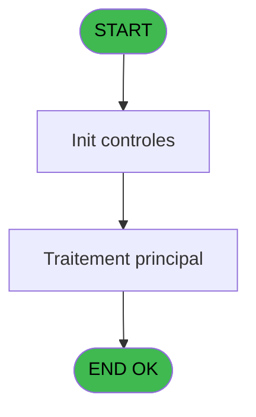
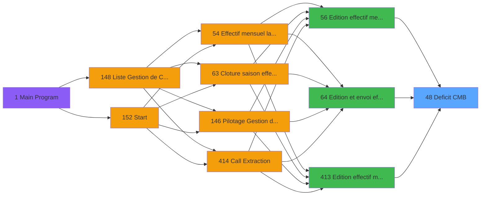

# PBP IDE 48 - Deficit CMB

> **Analyse**: Phases 1-4 2026-02-03 08:55 -> 08:56 (21s) | Assemblage 08:56
> **Pipeline**: V7.2 Enrichi
> **Structure**: 4 onglets (Resume | Ecrans | Donnees | Connexions)

<!-- TAB:Resume -->

## 1. FICHE D'IDENTITE

| Attribut | Valeur |
|----------|--------|
| Projet | PBP |
| IDE Position | 48 |
| Nom Programme | Deficit CMB |
| Fichier source | `Prg_48.xml` |
| Domaine metier | General |
| Taches | 1 (0 ecrans visibles) |
| Tables modifiees | 0 |
| Programmes appeles | 0 |

## 2. DESCRIPTION FONCTIONNELLE

**Deficit CMB** assure la gestion complete de ce processus, accessible depuis [Edition et envoi effectif (IDE 64)](PBP-IDE-64.md), [Edition effectif mensuel (IDE 56)](PBP-IDE-56.md), [Edition effectif mensuel (IDE 413)](PBP-IDE-413.md).

Le flux de traitement s'organise en **1 blocs fonctionnels** :

- **Traitement** (1 tache) : traitements metier divers

**Logique metier** : 1 regles identifiees couvrant conditions metier.

## 3. BLOCS FONCTIONNELS

### 3.1 Traitement (1 tache)

Traitements internes.

---

#### 48 - Deficit IGR

**Role** : Traitement : Deficit IGR.

## 5. REGLES METIER

1 regles identifiees:

### Autres (1 regles)

#### [RM-001] Si [CT]='-' alors -([CB]*IF([DJ]<>'DDE' sinon [CR],1)),[CB]*IF([DJ]<>'DDE',[CR],1))

| Element | Detail |
|---------|--------|
| **Condition** | `[CT]='-'` |
| **Si vrai** | -([CB]*IF([DJ]<>'DDE' |
| **Si faux** | [CR],1)),[CB]*IF([DJ]<>'DDE',[CR],1)) |
| **Expression source** | Expression 9 : `IF([CT]='-',-([CB]*IF([DJ]<>'DDE',[CR],1)),[CB]*IF([DJ]<>'DD` |
| **Exemple** | Si [CT]='-' → -([CB]*IF([DJ]<>'DDE'. Sinon → [CR],1)),[CB]*IF([DJ]<>'DDE',[CR],1)) |

## 6. CONTEXTE

- **Appele par**: [Edition et envoi effectif (IDE 64)](PBP-IDE-64.md), [Edition effectif mensuel (IDE 56)](PBP-IDE-56.md), [Edition effectif mensuel (IDE 413)](PBP-IDE-413.md)
- **Appelle**: 0 programmes | **Tables**: 2 (W:0 R:1 L:1) | **Taches**: 1 | **Expressions**: 28

<!-- TAB:Ecrans -->

## 8. ECRANS

*(Programme sans ecran visible)*

## 9. NAVIGATION

### 9.3 Structure hierarchique (1 tache)

| Position | Tache | Type | Dimensions | Bloc |
|----------|-------|------|------------|------|
| **48.1** | [**Deficit IGR** (48)](#t8) | - | - | Traitement |

### 9.4 Algorigramme

> **Legende**: Vert = START/END OK | Rouge = END KO | Bleu = Decisions
> *Algorigramme auto-genere. Utiliser `/algorigramme` pour une synthese metier detaillee.*

<!-- TAB:Donnees -->

## 10. TABLES

### Tables utilisees (2)

| ID | Nom | Description | Type | R | W | L | Usages |
|----|-----|-------------|------|---|---|---|--------|
| 825 | fac_hebergement_pro | Hebergement (chambres) | DB |   |   | L | 1 |
| 826 | wording_mention_legal |  | DB | R |   |   | 1 |

### Colonnes par table (1 / 1 tables avec colonnes identifiees)

Table 826 - wording_mention_legal (R) - 1 usages

| Lettre | Variable | Acces | Type |
|--------|----------|-------|------|
| A | P.Date debut | R | Date |
| B | P.Date fin | R | Date |
| C | P.Code village | R | Alpha |
| D | P.Lieu sejour | R | Alpha |
| E | P.Nom lieu sejour | R | Alpha |
| F | P.Gestion crise ? | R | Logical |
| G | V.Total jh | R | Numeric |

## 11. VARIABLES

### 11.1 Parametres entrants (6)

Variables recues du programme appelant ([Edition et envoi effectif (IDE 64)](PBP-IDE-64.md)).

| Lettre | Nom | Type | Usage dans |
|--------|-----|------|-----------|
| A | P.Date debut | Date | - |
| B | P.Date fin | Date | - |
| C | P.Code village | Alpha | - |
| D | P.Lieu sejour | Alpha | - |
| E | P.Nom lieu sejour | Alpha | - |
| F | P.Gestion crise ? | Logical | - |

### 11.2 Variables de session (1)

Variables persistantes pendant toute la session.

| Lettre | Nom | Type | Usage dans |
|--------|-----|------|-----------|
| G | V.Total jh | Numeric | - |

## 12. EXPRESSIONS

**28 / 28 expressions decodees (100%)**

### 12.1 Repartition par type

| Type | Expressions | Regles |
|------|-------------|--------|
| CONDITION | 8 | 5 |
| FORMAT | 1 | 0 |
| OTHER | 18 | 0 |
| STRING | 1 | 0 |

### 12.2 Expressions cles par type

#### CONDITION (8 expressions)

| Type | IDE | Expression | Regle |
|------|-----|------------|-------|
| CONDITION | 9 | `IF([CT]='-',-([CB]*IF([DJ]<>'DDE',[CR],1)),[CB]*IF([DJ]<>'DDE',[CR],1))` | [RM-001](#rm-RM-001) |
| CONDITION | 15 | `[CZ]<>''` | - |
| CONDITION | 4 | `[BZ]='VRLHP'` | - |
| CONDITION | 14 | `CndRange([CZ]<>'',[CZ])` | - |
| CONDITION | 6 | `[CT]='+'` | - |
| ... | | *+3 autres* | |

#### FORMAT (1 expressions)

| Type | IDE | Expression | Regle |
|------|-----|------------|-------|
| FORMAT | 13 | `Trim(Translate('%club_exportdata%'))&'trsft\'&Trim([CY])&IF([CZ]<>'','_'&Trim([CZ])&'_','_')&'EFF_Deficit_Rep_Enc_HP_'&IF([DI],Trim(DStr(Date()-2,'YYYYMM')),Trim(DStr(Date(),'YYYYMM')))&'.htm'` | - |

#### OTHER (18 expressions)

| Type | IDE | Expression | Regle |
|------|-----|------------|-------|
| OTHER | 22 | `MlsTrans('Lieu de séjour')` | - |
| OTHER | 23 | `MlsTrans('Total JH du mois')` | - |
| OTHER | 20 | `MlsTrans('Mois')` | - |
| OTHER | 21 | `MlsTrans('Nombre de jours du mois')` | - |
| OTHER | 24 | `MlsTrans('Nombre de JH')` | - |
| ... | | *+13 autres* | |

#### STRING (1 expressions)

| Type | IDE | Expression | Regle |
|------|-----|------------|-------|
| STRING | 10 | `Trim(VG37)` | - |

### 12.3 Toutes les expressions (28)

Voir les 28 expressions

#### CONDITION (8)

| IDE | Expression Decodee |
|-----|-------------------|
| 1 | `[CU]+([CB]*IF([DJ]<>'DDE',[CR],1))` |
| 6 | `[CT]='+'` |
| 7 | `[CU]-([CB]*IF([DJ]<>'DD',[CR],1))` |
| 8 | `[CT]='-'` |
| 9 | `IF([CT]='-',-([CB]*IF([DJ]<>'DDE',[CR],1)),[CB]*IF([DJ]<>'DDE',[CR],1))` |
| 4 | `[BZ]='VRLHP'` |
| 14 | `CndRange([CZ]<>'',[CZ])` |
| 15 | `[CZ]<>''` |

#### FORMAT (1)

| IDE | Expression Decodee |
|-----|-------------------|
| 13 | `Trim(Translate('%club_exportdata%'))&'trsft\'&Trim([CY])&IF([CZ]<>'','_'&Trim([CZ])&'_','_')&'EFF_Deficit_Rep_Enc_HP_'&IF([DI],Trim(DStr(Date()-2,'YYYYMM')),Trim(DStr(Date(),'YYYYMM')))&'.htm'` |

#### OTHER (18)

| IDE | Expression Decodee |
|-----|-------------------|
| 2 | `[CW]` |
| 3 | `[CX]` |
| 5 | `[BZ]` |
| 11 | `Day(EOM([CW]))` |
| 12 | `CMonth([CW])` |
| 16 | `MlsTrans('Nom du Chef de Village')` |
| 17 | `MlsTrans('Signature du Chef de Village')` |
| 18 | `MlsTrans('Village')` |
| 19 | `MlsTrans('PAS INSCRITS EN NA')` |
| 20 | `MlsTrans('Mois')` |
| 21 | `MlsTrans('Nombre de jours du mois')` |
| 22 | `MlsTrans('Lieu de séjour')` |
| 23 | `MlsTrans('Total JH du mois')` |
| 24 | `MlsTrans('Nombre de JH')` |
| 25 | `MlsTrans('Date de consommation')` |
| 26 | `MlsTrans('Motif')` |
| 27 | `MlsTrans('Nom')` |
| 28 | `MlsTrans('Repas encaissees HP (CMB)')` |

#### STRING (1)

| IDE | Expression Decodee |
|-----|-------------------|
| 10 | `Trim(VG37)` |

<!-- TAB:Connexions -->

## 13. GRAPHE D'APPELS

### 13.1 Chaine depuis Main (Callers)

Main -> ... -> [Edition et envoi effectif (IDE 64)](PBP-IDE-64.md) -> **Deficit CMB (IDE 48)**

Main -> ... -> [Edition effectif mensuel (IDE 56)](PBP-IDE-56.md) -> **Deficit CMB (IDE 48)**

Main -> ... -> [Edition effectif mensuel (IDE 413)](PBP-IDE-413.md) -> **Deficit CMB (IDE 48)**

### 13.2 Callers

| IDE | Nom Programme | Nb Appels |
|-----|---------------|-----------|
| [64](PBP-IDE-64.md) | Edition et envoi effectif | 2 |
| [56](PBP-IDE-56.md) | Edition effectif mensuel | 1 |
| [413](PBP-IDE-413.md) | Edition effectif mensuel | 1 |

### 13.3 Callees (programmes appeles)

### 13.4 Detail Callees avec contexte

| IDE | Nom Programme | Appels | Contexte |
|-----|---------------|--------|----------|
| - | (aucun) | - | - |

## 14. RECOMMANDATIONS MIGRATION

### 14.1 Profil du programme

| Metrique | Valeur | Impact migration |
|----------|--------|-----------------|
| Lignes de logique | 27 | Programme compact |
| Expressions | 28 | Peu de logique |
| Tables WRITE | 0 | Impact faible |
| Sous-programmes | 0 | Peu de dependances |
| Ecrans visibles | 0 | Ecran unique ou traitement batch |
| Code desactive | 0% (0 / 27) | Code sain |
| Regles metier | 1 | Quelques regles a preserver |

### 14.2 Plan de migration par bloc

#### Traitement (1 tache: 0 ecran, 1 traitement)

- **Strategie** : 1 service(s) backend injectable(s) (Domain Services).
- Decomposer les taches en services unitaires testables.

### 14.3 Dependances critiques

| Dependance | Type | Appels | Impact |
|------------|------|--------|--------|

---
*Spec DETAILED generee par Pipeline V7.2 - 2026-02-03 08:56*
