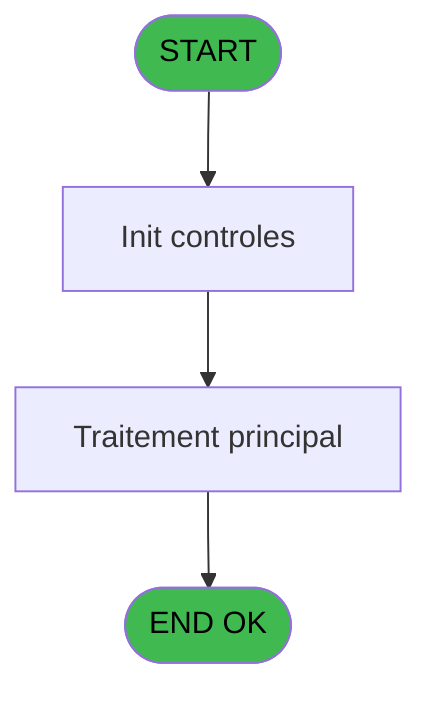
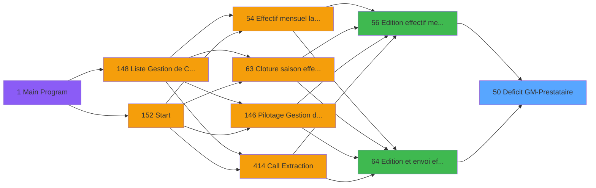

# PBP IDE 50 - Deficit GM-Prestataire

> **Analyse**: Phases 1-4 2026-02-03 08:56 -> 08:57 (29s) | Assemblage 08:57
> **Pipeline**: V7.2 Enrichi
> **Structure**: 4 onglets (Resume | Ecrans | Donnees | Connexions)

<!-- TAB:Resume -->

## 1. FICHE D'IDENTITE

| Attribut | Valeur |
|----------|--------|
| Projet | PBP |
| IDE Position | 50 |
| Nom Programme | Deficit GM-Prestataire |
| Fichier source | `Prg_50.xml` |
| Domaine metier | General |
| Taches | 3 (0 ecrans visibles) |
| Tables modifiees | 0 |
| Programmes appeles | 0 |

## 2. DESCRIPTION FONCTIONNELLE

**Deficit GM-Prestataire** assure la gestion complete de ce processus, accessible depuis [Edition effectif mensuel (IDE 56)](PBP-IDE-56.md), [Edition et envoi effectif (IDE 64)](PBP-IDE-64.md).

Le flux de traitement s'organise en **2 blocs fonctionnels** :

- **Calcul** (2 taches) : calculs de montants, stocks ou compteurs
- **Traitement** (1 tache) : traitements metier divers

**Logique metier** : 4 regles identifiees couvrant conditions metier.

Detail : phases du traitement

#### Phase 1 : Traitement (1 tache)

- **50** - Deficit GM-Prestataire

#### Phase 2 : Calcul (2 taches)

- **50.1** - Calcul JH absence
- **50.2** - Calcul regul ANS

## 3. BLOCS FONCTIONNELS

### 3.1 Traitement (1 tache)

Traitements internes.

---

#### 50 - Deficit GM-Prestataire

**Role** : Traitement : Deficit GM-Prestataire.

### 3.2 Calcul (2 taches)

Calculs metier : montants, stocks, compteurs.

---

#### 50.1 - Calcul JH absence

**Role** : Calcul : Calcul JH absence.
**Variables liees** : L (V.Nb jh absence)

---

#### 50.2 - Calcul regul ANS

**Role** : Calcul : Calcul regul ANS.
**Variables liees** : Q (V.tot jh regul)

## 5. REGLES METIER

4 regles identifiees:

### Autres (4 regles)

#### [RM-001] Si [AQ]<P.Nom lieu [F] alors P.Nom lieu [F] sinon [AQ])

| Element | Detail |
|---------|--------|
| **Condition** | `[AQ]<P.Nom lieu [F]` |
| **Si vrai** | P.Nom lieu [F] |
| **Si faux** | [AQ]) |
| **Variables** | F (P.Nom lieu) |
| **Expression source** | Expression 7 : `IF([AQ]<P.Nom lieu [F],P.Nom lieu [F],[AQ])` |
| **Exemple** | Si [AQ]<P.Nom lieu [F] → P.Nom lieu [F]. Sinon → [AQ]) |

#### [RM-002] Si [AS]>P.Gestion crise ? [G] alors P.Gestion crise ? [G] sinon [AS])

| Element | Detail |
|---------|--------|
| **Condition** | `[AS]>P.Gestion crise ? [G]` |
| **Si vrai** | P.Gestion crise ? [G] |
| **Si faux** | [AS]) |
| **Variables** | G (P.Gestion crise ?) |
| **Expression source** | Expression 8 : `IF([AS]>P.Gestion crise ? [G],P.Gestion crise ? [G],[AS])` |
| **Exemple** | Si [AS]>P.Gestion crise ? [G] → P.Gestion crise ? [G]. Sinon → [AS]) |

#### [RM-003] Si P.Qualite [D]<{1 alors 107} sinon {1,107},P.Qualite [D])

| Element | Detail |
|---------|--------|
| **Condition** | `P.Qualite [D]<{1` |
| **Si vrai** | 107} |
| **Si faux** | {1,107},P.Qualite [D]) |
| **Variables** | D (P.Qualite) |
| **Expression source** | Expression 61 : `IF(P.Qualite [D]<{1,107},{1,107},P.Qualite [D])` |
| **Exemple** | Si P.Qualite [D]<{1 → 107}. Sinon → {1,107},P.Qualite [D]) |

#### [RM-004] Si P.Lieu sejour [E]>{1 alors 108} sinon {1,108},P.Lieu sejour [E])

| Element | Detail |
|---------|--------|
| **Condition** | `P.Lieu sejour [E]>{1` |
| **Si vrai** | 108} |
| **Si faux** | {1,108},P.Lieu sejour [E]) |
| **Variables** | E (P.Lieu sejour) |
| **Expression source** | Expression 62 : `IF(P.Lieu sejour [E]>{1,108},{1,108},P.Lieu sejour [E])` |
| **Exemple** | Si P.Lieu sejour [E]>{1 → 108}. Sinon → {1,108},P.Lieu sejour [E]) |

## 6. CONTEXTE

- **Appele par**: [Edition effectif mensuel (IDE 56)](PBP-IDE-56.md), [Edition et envoi effectif (IDE 64)](PBP-IDE-64.md)
- **Appelle**: 0 programmes | **Tables**: 4 (W:0 R:3 L:1) | **Taches**: 3 | **Expressions**: 65

<!-- TAB:Ecrans -->

## 8. ECRANS

*(Programme sans ecran visible)*

## 9. NAVIGATION

### 9.3 Structure hierarchique (3 taches)

| Position | Tache | Type | Dimensions | Bloc |
|----------|-------|------|------------|------|
| **50.1** | [**Deficit GM-Prestataire** (50)](#t1) | - | - | Traitement |
| **50.2** | [**Calcul JH absence** (50.1)](#t2) | - | - | Calcul |
| 50.2.1 | [Calcul regul ANS (50.2)](#t3) | - | - | |

### 9.4 Algorigramme

> **Legende**: Vert = START/END OK | Rouge = END KO | Bleu = Decisions
> *Algorigramme auto-genere. Utiliser `/algorigramme` pour une synthese metier detaillee.*

<!-- TAB:Donnees -->

## 10. TABLES

### Tables utilisees (4)

| ID | Nom | Description | Type | R | W | L | Usages |
|----|-----|-------------|------|---|---|---|--------|
| 366 | pms_print_param |  | DB | R |   |   | 1 |
| 825 | fac_hebergement_pro | Hebergement (chambres) | DB |   |   | L | 1 |
| 826 | wording_mention_legal |  | DB | R |   |   | 1 |
| 834 | tpe_par_terminal |  | DB | R |   |   | 1 |

### Colonnes par table (2 / 3 tables avec colonnes identifiees)

Table 366 - pms_print_param (R) - 1 usages

| Lettre | Variable | Acces | Type |
|--------|----------|-------|------|
| A | V.Date debut absence | R | Date |
| B | V.Date fin absence | R | Date |
| C | V.J absence | R | Numeric |

Table 826 - wording_mention_legal (R) - 1 usages

*Table utilisee uniquement en Link ou aucune colonne Real identifiee dans le DataView.*

Table 834 - tpe_par_terminal (R) - 1 usages

| Lettre | Variable | Acces | Type |
|--------|----------|-------|------|
| A | P.Date debut | R | Date |
| B | P.Date fin | R | Date |
| C | P.Code village | R | Alpha |
| D | P.Qualite | R | Alpha |
| E | P.Lieu sejour | R | Alpha |
| F | P.Nom lieu | R | Alpha |
| G | P.Gestion crise ? | R | Logical |
| H | V.Nb JH du mois | R | Numeric |
| I | V.Total JH | R | Numeric |
| J | V.Date debut | R | Date |
| K | V.Date fin | R | Date |
| L | V.Nb jh absence | R | Numeric |
| M | V.Date debut premiere periode | R | Date |
| N | V.Date fin derniere periode | R | Date |
| O | V.Date debut sej | R | Date |
| P | V.Date fin sej | R | Date |
| Q | V.tot jh regul | R | Numeric |
| R | V.Heure debut premiere periode | R | Alpha |
| S | V.Heure fin derniere periode | R | Alpha |

## 11. VARIABLES

### 11.1 Parametres entrants (7)

Variables recues du programme appelant ([Edition effectif mensuel (IDE 56)](PBP-IDE-56.md)).

| Lettre | Nom | Type | Usage dans |
|--------|-----|------|-----------|
| A | P.Date debut | Date | - |
| B | P.Date fin | Date | - |
| C | P.Code village | Alpha | - |
| D | P.Qualite | Alpha | 1x parametre entrant |
| E | P.Lieu sejour | Alpha | 1x parametre entrant |
| F | P.Nom lieu | Alpha | 5x parametre entrant |
| G | P.Gestion crise ? | Logical | 3x parametre entrant |

### 11.2 Variables de session (12)

Variables persistantes pendant toute la session.

| Lettre | Nom | Type | Usage dans |
|--------|-----|------|-----------|
| H | V.Nb JH du mois | Numeric | 1x session |
| I | V.Total JH | Numeric | 1x session |
| J | V.Date debut | Date | - |
| K | V.Date fin | Date | - |
| L | V.Nb jh absence | Numeric | - |
| M | V.Date debut premiere periode | Date | - |
| N | V.Date fin derniere periode | Date | - |
| O | V.Date debut sej | Date | - |
| P | V.Date fin sej | Date | - |
| Q | V.tot jh regul | Numeric | - |
| R | V.Heure debut premiere periode | Alpha | - |
| S | V.Heure fin derniere periode | Alpha | - |

Toutes les 19 variables (liste complete)

| Cat | Lettre | Nom Variable | Type |
|-----|--------|--------------|------|
| P0 | **A** | P.Date debut | Date |
| P0 | **B** | P.Date fin | Date |
| P0 | **C** | P.Code village | Alpha |
| P0 | **D** | P.Qualite | Alpha |
| P0 | **E** | P.Lieu sejour | Alpha |
| P0 | **F** | P.Nom lieu | Alpha |
| P0 | **G** | P.Gestion crise ? | Logical |
| V. | **H** | V.Nb JH du mois | Numeric |
| V. | **I** | V.Total JH | Numeric |
| V. | **J** | V.Date debut | Date |
| V. | **K** | V.Date fin | Date |
| V. | **L** | V.Nb jh absence | Numeric |
| V. | **M** | V.Date debut premiere periode | Date |
| V. | **N** | V.Date fin derniere periode | Date |
| V. | **O** | V.Date debut sej | Date |
| V. | **P** | V.Date fin sej | Date |
| V. | **Q** | V.tot jh regul | Numeric |
| V. | **R** | V.Heure debut premiere periode | Alpha |
| V. | **S** | V.Heure fin derniere periode | Alpha |

## 12. EXPRESSIONS

**65 / 65 expressions decodees (100%)**

### 12.1 Repartition par type

| Type | Expressions | Regles |
|------|-------------|--------|
| CALCULATION | 7 | 0 |
| CONDITION | 19 | 4 |
| CONSTANTE | 4 | 0 |
| FORMAT | 1 | 0 |
| OTHER | 31 | 0 |
| NEGATION | 2 | 0 |
| STRING | 1 | 0 |

### 12.2 Expressions cles par type

#### CALCULATION (7 expressions)

| Type | IDE | Expression | Regle |
|------|-----|------------|-------|
| CALCULATION | 40 | `[AO]+([DD]-[DC]-1)` | - |
| CALCULATION | 64 | `(V.Nb JH du mois [H]-P.Gestion crise ? [G])+1` | - |
| CALCULATION | 65 | `{1,88}+V.Total JH [I]` | - |
| CALCULATION | 25 | `[AO]+0.5` | - |
| CALCULATION | 10 | `[AO]-[CJ]` | - |
| ... | | *+2 autres* | |

#### CONDITION (19 expressions)

| Type | IDE | Expression | Regle |
|------|-----|------------|-------|
| CONDITION | 61 | `IF(P.Qualite [D]<{1,107},{1,107},P.Qualite [D])` | [RM-003](#rm-RM-003) |
| CONDITION | 62 | `IF(P.Lieu sejour [E]>{1,108},{1,108},P.Lieu sejour [E])` | [RM-004](#rm-RM-004) |
| CONDITION | 7 | `IF([AQ]<P.Nom lieu [F],P.Nom lieu [F],[AQ])` | [RM-001](#rm-RM-001) |
| CONDITION | 8 | `IF([AS]>P.Gestion crise ? [G],P.Gestion crise ? [G],[AS])` | [RM-002](#rm-RM-002) |
| CONDITION | 41 | `[AO]<>0` | - |
| ... | | *+14 autres* | |

#### CONSTANTE (4 expressions)

| Type | IDE | Expression | Regle |
|------|-----|------------|-------|
| CONSTANTE | 37 | `''` | - |
| CONSTANTE | 63 | `0` | - |
| CONSTANTE | 6 | `'O'` | - |
| CONSTANTE | 20 | `0` | - |

#### FORMAT (1 expressions)

| Type | IDE | Expression | Regle |
|------|-----|------------|-------|
| FORMAT | 1 | `Trim(Translate('%club_exportdata%'))&'trsft\'&Trim([CA])&
IF([CW]<>'','_'&Trim([CW])&'_','_')&'EFF_Deficit_GM_'&Trim([CU])&'_'&
IF([DE],Trim(DStr(Date()-2,'YYYYMM')),Trim(DStr(Date(),'YYYYMM')))&'.htm'` | - |

#### OTHER (31 expressions)

| Type | IDE | Expression | Regle |
|------|-----|------------|-------|
| OTHER | 50 | `MlsTrans('Nom')` | - |
| OTHER | 51 | `MlsTrans('Prénom')` | - |
| OTHER | 52 | `MlsTrans('GM Prestataires')` | - |
| OTHER | 49 | `MlsTrans('Total JH et')` | - |
| OTHER | 46 | `MlsTrans('Mois')` | - |
| ... | | *+26 autres* | |

#### NEGATION (2 expressions)

| Type | IDE | Expression | Regle |
|------|-----|------------|-------|
| NEGATION | 32 | `NOT ExpCalc('72'EXP)` | - |
| NEGATION | 31 | `NOT ExpCalc('70'EXP)` | - |

#### STRING (1 expressions)

| Type | IDE | Expression | Regle |
|------|-----|------------|-------|
| STRING | 3 | `Trim(VG37)` | - |

### 12.3 Toutes les expressions (65)

Voir les 65 expressions

#### CALCULATION (7)

| IDE | Expression Decodee |
|-----|-------------------|
| 10 | `[AO]-[CJ]` |
| 11 | `[AN]+[AO]` |
| 24 | `[AO]+1` |
| 25 | `[AO]+0.5` |
| 40 | `[AO]+([DD]-[DC]-1)` |
| 64 | `(V.Nb JH du mois [H]-P.Gestion crise ? [G])+1` |
| 65 | `{1,88}+V.Total JH [I]` |

#### CONDITION (19)

| IDE | Expression Decodee |
|-----|-------------------|
| 7 | `IF([AQ]<P.Nom lieu [F],P.Nom lieu [F],[AQ])` |
| 8 | `IF([AS]>P.Gestion crise ? [G],P.Gestion crise ? [G],[AS])` |
| 61 | `IF(P.Qualite [D]<{1,107},{1,107},P.Qualite [D])` |
| 62 | `IF(P.Lieu sejour [E]>{1,108},{1,108},P.Lieu sejour [E])` |
| 9 | `[CL]='GM' AND [CM]=[CU]` |
| 13 | `[CU]='PRES'` |
| 14 | `CndRange([CW]<>'',[CW])` |
| 15 | `[CW]<>''` |
| 18 | `[CB]<[DC] OR [DC]=0` |
| 19 | `[CC]>[DD] OR [DD]=0` |
| 23 | `[DG]<[DC]` |
| 26 | `[DH]>[DD]` |
| 29 | `[AQ]<[DG] OR [DG]=0` |
| 30 | `[AS]>[DH] OR [DH]=0` |
| 41 | `[AO]<>0` |
| 33 | `Val([DJ],'2')<=15` |
| 34 | `Val([DJ],'2')<23` |
| 35 | `Val([DK],'2')>=12` |
| 36 | `Val([DK],'2')>=20` |

#### CONSTANTE (4)

| IDE | Expression Decodee |
|-----|-------------------|
| 6 | `'O'` |
| 20 | `0` |
| 37 | `''` |
| 63 | `0` |

#### FORMAT (1)

| IDE | Expression Decodee |
|-----|-------------------|
| 1 | `Trim(Translate('%club_exportdata%'))&'trsft\'&Trim([CA])&
IF([CW]<>'','_'&Trim([CW])&'_','_')&'EFF_Deficit_GM_'&Trim([CU])&'_'&
IF([DE],Trim(DStr(Date()-2,'YYYYMM')),Trim(DStr(Date(),'YYYYMM')))&'.htm'` |

#### OTHER (31)

| IDE | Expression Decodee |
|-----|-------------------|
| 2 | `GetParam('SOCIETE')` |
| 4 | `Day(EOM(P.Nom lieu [F]))` |
| 5 | `CMonth(P.Nom lieu [F])` |
| 12 | `EOM(P.Nom lieu [F])` |
| 16 | `[CB]` |
| 17 | `[CC]` |
| 21 | `P.Gestion crise ? [G]` |
| 22 | `P.Nom lieu [F]` |
| 27 | `[AQ]` |
| 28 | `[AS]` |
| 38 | `[DL]` |
| 39 | `[DM]` |
| 42 | `MlsTrans('Nom du Chef de Village')` |
| 43 | `MlsTrans('Signature du Chef de Village')` |
| 44 | `MlsTrans('Village')` |
| 45 | `MlsTrans('Nombre de jours du mois')` |
| 46 | `MlsTrans('Mois')` |
| 47 | `MlsTrans('Lieu de séjour')` |
| 48 | `MlsTrans('montant total facturé du mois')` |
| 49 | `MlsTrans('Total JH et')` |
| 50 | `MlsTrans('Nom')` |
| 51 | `MlsTrans('Prénom')` |
| 52 | `MlsTrans('GM Prestataires')` |
| 53 | `MlsTrans('Société')` |
| 54 | `MlsTrans('Date de naissance')` |
| 55 | `MlsTrans('Début de séjour')` |
| 56 | `MlsTrans('Fin de séjour')` |
| 57 | `MlsTrans('Nombre de JH')` |
| 58 | `{1,1}` |
| 59 | `{1,2}` |
| 60 | `{1,3}` |

#### NEGATION (2)

| IDE | Expression Decodee |
|-----|-------------------|
| 31 | `NOT ExpCalc('70'EXP)` |
| 32 | `NOT ExpCalc('72'EXP)` |

#### STRING (1)

| IDE | Expression Decodee |
|-----|-------------------|
| 3 | `Trim(VG37)` |

<!-- TAB:Connexions -->

## 13. GRAPHE D'APPELS

### 13.1 Chaine depuis Main (Callers)

Main -> ... -> [Edition effectif mensuel (IDE 56)](PBP-IDE-56.md) -> **Deficit GM-Prestataire (IDE 50)**

Main -> ... -> [Edition et envoi effectif (IDE 64)](PBP-IDE-64.md) -> **Deficit GM-Prestataire (IDE 50)**

### 13.2 Callers

| IDE | Nom Programme | Nb Appels |
|-----|---------------|-----------|
| [56](PBP-IDE-56.md) | Edition effectif mensuel | 1 |
| [64](PBP-IDE-64.md) | Edition et envoi effectif | 1 |

### 13.3 Callees (programmes appeles)

### 13.4 Detail Callees avec contexte

| IDE | Nom Programme | Appels | Contexte |
|-----|---------------|--------|----------|
| - | (aucun) | - | - |

## 14. RECOMMANDATIONS MIGRATION

### 14.1 Profil du programme

| Metrique | Valeur | Impact migration |
|----------|--------|-----------------|
| Lignes de logique | 114 | Programme compact |
| Expressions | 65 | Logique moderee |
| Tables WRITE | 0 | Impact faible |
| Sous-programmes | 0 | Peu de dependances |
| Ecrans visibles | 0 | Ecran unique ou traitement batch |
| Code desactive | 0% (0 / 114) | Code sain |
| Regles metier | 4 | Quelques regles a preserver |

### 14.2 Plan de migration par bloc

#### Traitement (1 tache: 0 ecran, 1 traitement)

- **Strategie** : 1 service(s) backend injectable(s) (Domain Services).
- Decomposer les taches en services unitaires testables.

#### Calcul (2 taches: 0 ecran, 2 traitements)

- **Strategie** : Services de calcul purs (Domain Services).
- Migrer la logique de calcul (stock, compteurs, montants)

### 14.3 Dependances critiques

| Dependance | Type | Appels | Impact |
|------------|------|--------|--------|

---
*Spec DETAILED generee par Pipeline V7.2 - 2026-02-03 08:57*
