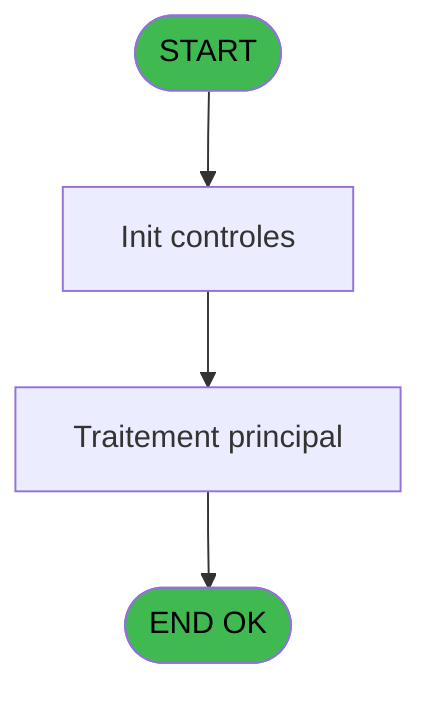
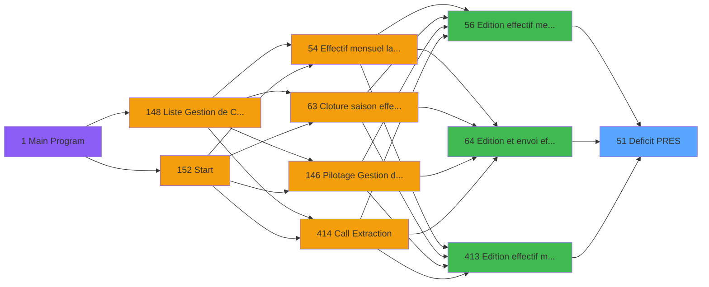

# PBP IDE 51 - Deficit PRES

> **Analyse**: Phases 1-4 2026-02-03 08:57 -> 08:57 (21s) | Assemblage 08:57
> **Pipeline**: V7.2 Enrichi
> **Structure**: 4 onglets (Resume | Ecrans | Donnees | Connexions)

<!-- TAB:Resume -->

## 1. FICHE D'IDENTITE

| Attribut | Valeur |
|----------|--------|
| Projet | PBP |
| IDE Position | 51 |
| Nom Programme | Deficit PRES |
| Fichier source | `Prg_51.xml` |
| Domaine metier | General |
| Taches | 2 (0 ecrans visibles) |
| Tables modifiees | 0 |
| Programmes appeles | 0 |

## 2. DESCRIPTION FONCTIONNELLE

**Deficit PRES** assure la gestion complete de ce processus, accessible depuis [Edition et envoi effectif (IDE 64)](PBP-IDE-64.md), [Edition effectif mensuel (IDE 56)](PBP-IDE-56.md), [Edition effectif mensuel (IDE 413)](PBP-IDE-413.md).

Le flux de traitement s'organise en **1 blocs fonctionnels** :

- **Traitement** (2 taches) : traitements metier divers

## 3. BLOCS FONCTIONNELS

### 3.1 Traitement (2 taches)

Traitements internes.

---

#### 51.1 - Deficit GMPRES

**Role** : Traitement : Deficit GMPRES.

---

#### 51 - GMPRES

**Role** : Traitement : GMPRES.

## 5. REGLES METIER

*(Aucune regle metier identifiee)*

## 6. CONTEXTE

- **Appele par**: [Edition et envoi effectif (IDE 64)](PBP-IDE-64.md), [Edition effectif mensuel (IDE 56)](PBP-IDE-56.md), [Edition effectif mensuel (IDE 413)](PBP-IDE-413.md)
- **Appelle**: 0 programmes | **Tables**: 2 (W:0 R:1 L:1) | **Taches**: 2 | **Expressions**: 38

<!-- TAB:Ecrans -->

## 8. ECRANS

*(Programme sans ecran visible)*

## 9. NAVIGATION

### 9.3 Structure hierarchique (2 taches)

| Position | Tache | Type | Dimensions | Bloc |
|----------|-------|------|------------|------|
| **51.1** | [**Deficit GMPRES** (51.1)](#t1) | - | - | Traitement |
| 51.1.1 | [GMPRES (51)](#t2) | - | - | |

### 9.4 Algorigramme

> **Legende**: Vert = START/END OK | Rouge = END KO | Bleu = Decisions
> *Algorigramme auto-genere. Utiliser `/algorigramme` pour une synthese metier detaillee.*

<!-- TAB:Donnees -->

## 10. TABLES

### Tables utilisees (2)

| ID | Nom | Description | Type | R | W | L | Usages |
|----|-----|-------------|------|---|---|---|--------|
| 825 | fac_hebergement_pro | Hebergement (chambres) | DB |   |   | L | 1 |
| 826 | wording_mention_legal |  | DB | R |   |   | 1 |

### Colonnes par table (1 / 1 tables avec colonnes identifiees)

Table 826 - wording_mention_legal (R) - 1 usages

| Lettre | Variable | Acces | Type |
|--------|----------|-------|------|
| A | V.Nb repas midi | R | Numeric |
| B | V.Nb repas soir | R | Numeric |
| C | V.Nb jh midi | R | Numeric |
| D | V.Nb jh soir | R | Numeric |

## 11. VARIABLES

### 11.1 Parametres entrants (2)

Variables recues du programme appelant ([Edition et envoi effectif (IDE 64)](PBP-IDE-64.md)).

| Lettre | Nom | Type | Usage dans |
|--------|-----|------|-----------|
| E | P.Nom lieu | Alpha | 2x parametre entrant |
| F | P.Gestion crise ? | Logical | - |

### 11.2 Variables de session (5)

Variables persistantes pendant toute la session.

| Lettre | Nom | Type | Usage dans |
|--------|-----|------|-----------|
| A | V.Nb repas midi | Numeric | 2x session |
| B | V.Nb repas soir | Numeric | - |
| C | V.Nb jh midi | Numeric | - |
| D | V.Nb jh soir | Numeric | 1x session |
| G | V.Total nb jh | Numeric | - |

## 12. EXPRESSIONS

**38 / 38 expressions decodees (100%)**

### 12.1 Repartition par type

| Type | Expressions | Regles |
|------|-------------|--------|
| CONDITION | 6 | 0 |
| CALCULATION | 12 | 0 |
| CONSTANTE | 2 | 0 |
| FORMAT | 1 | 0 |
| OTHER | 16 | 0 |
| STRING | 1 | 0 |

### 12.2 Expressions cles par type

#### CONDITION (6 expressions)

| Type | IDE | Expression | Regle |
|------|-----|------------|-------|
| CONDITION | 21 | `[DE]='DEJ' OR [DE]='DDE'` | - |
| CONDITION | 24 | `[DE]='DIN' OR [DE]='DDE'` | - |
| CONDITION | 38 | `CndRange({1,5}<>'',{1,5})` | - |
| CONDITION | 20 | `[CT]='+'` | - |
| CONDITION | 22 | `[CT]='-'` | - |
| ... | | *+1 autres* | |

#### CALCULATION (12 expressions)

| Type | IDE | Expression | Regle |
|------|-----|------------|-------|
| CALCULATION | 33 | `[DI]-([CB]*[CR])` | - |
| CALCULATION | 32 | `[DG]-[CB]` | - |
| CALCULATION | 31 | `[DH]-([CB]*[CR])` | - |
| CALCULATION | 36 | `{1,3}-([CB]*[CR])` | - |
| CALCULATION | 35 | `[DH]+[DI]` | - |
| ... | | *+7 autres* | |

#### CONSTANTE (2 expressions)

| Type | IDE | Expression | Regle |
|------|-----|------------|-------|
| CONSTANTE | 37 | `'GMPRES'` | - |
| CONSTANTE | 23 | `0` | - |

#### FORMAT (1 expressions)

| Type | IDE | Expression | Regle |
|------|-----|------------|-------|
| FORMAT | 1 | `Trim(Translate('%club_exportdata%'))&'trsft\'&Trim(V.Nb jh soir [D])&IF(P.Nom lieu [E]<>'','_'&Trim(P.Nom lieu [E])&'_','_')&'EFF_Deficit_PRES_'&IF([K],Trim(DStr(Date()-2,'YYYYMM')),Trim(DStr(Date(),'YYYYMM')))&'.htm'` | - |

#### OTHER (16 expressions)

| Type | IDE | Expression | Regle |
|------|-----|------------|-------|
| OTHER | 14 | `MlsTrans('Nombre de JH')` | - |
| OTHER | 15 | `MlsTrans('Nombre de repas')` | - |
| OTHER | 12 | `MlsTrans('Total JH repas du mois')` | - |
| OTHER | 13 | `MlsTrans('Repas Prestataire')` | - |
| OTHER | 18 | `{1,2}` | - |
| ... | | *+11 autres* | |

#### STRING (1 expressions)

| Type | IDE | Expression | Regle |
|------|-----|------------|-------|
| STRING | 2 | `Trim(VG37)` | - |

### 12.3 Toutes les expressions (38)

Voir les 38 expressions

#### CONDITION (6)

| IDE | Expression Decodee |
|-----|-------------------|
| 20 | `[CT]='+'` |
| 22 | `[CT]='-'` |
| 5 | `P.Nom lieu [E]<>''` |
| 21 | `[DE]='DEJ' OR [DE]='DDE'` |
| 24 | `[DE]='DIN' OR [DE]='DDE'` |
| 38 | `CndRange({1,5}<>'',{1,5})` |

#### CALCULATION (12)

| IDE | Expression Decodee |
|-----|-------------------|
| 25 | `[DF]+[CB]` |
| 26 | `[DH]+([CB]*[CR])` |
| 27 | `{1,3}+([CB]*[CR])` |
| 28 | `[DG]+[CB]` |
| 29 | `[DI]+([CB]*[CR])` |
| 30 | `[DF]-[CB]` |
| 31 | `[DH]-([CB]*[CR])` |
| 32 | `[DG]-[CB]` |
| 33 | `[DI]-([CB]*[CR])` |
| 34 | `[DF]+[DG]` |
| 35 | `[DH]+[DI]` |
| 36 | `{1,3}-([CB]*[CR])` |

#### CONSTANTE (2)

| IDE | Expression Decodee |
|-----|-------------------|
| 23 | `0` |
| 37 | `'GMPRES'` |

#### FORMAT (1)

| IDE | Expression Decodee |
|-----|-------------------|
| 1 | `Trim(Translate('%club_exportdata%'))&'trsft\'&Trim(V.Nb jh soir [D])&IF(P.Nom lieu [E]<>'','_'&Trim(P.Nom lieu [E])&'_','_')&'EFF_Deficit_PRES_'&IF([K],Trim(DStr(Date()-2,'YYYYMM')),Trim(DStr(Date(),'YYYYMM')))&'.htm'` |

#### OTHER (16)

| IDE | Expression Decodee |
|-----|-------------------|
| 3 | `CMonth(V.Nb repas midi [A])` |
| 4 | `Day(EOM(V.Nb repas midi [A]))` |
| 6 | `MlsTrans('Nom du Chef de Village')` |
| 7 | `MlsTrans('Signature du Chef de Village')` |
| 8 | `MlsTrans('Mois')` |
| 9 | `MlsTrans('Nombre de jours du mois')` |
| 10 | `MlsTrans('Village')` |
| 11 | `MlsTrans('Lieu de séjour')` |
| 12 | `MlsTrans('Total JH repas du mois')` |
| 13 | `MlsTrans('Repas Prestataire')` |
| 14 | `MlsTrans('Nombre de JH')` |
| 15 | `MlsTrans('Nombre de repas')` |
| 16 | `MlsTrans('Prestataire')` |
| 17 | `{1,1}` |
| 18 | `{1,2}` |
| 19 | `[BZ]` |

#### STRING (1)

| IDE | Expression Decodee |
|-----|-------------------|
| 2 | `Trim(VG37)` |

<!-- TAB:Connexions -->

## 13. GRAPHE D'APPELS

### 13.1 Chaine depuis Main (Callers)

Main -> ... -> [Edition et envoi effectif (IDE 64)](PBP-IDE-64.md) -> **Deficit PRES (IDE 51)**

Main -> ... -> [Edition effectif mensuel (IDE 56)](PBP-IDE-56.md) -> **Deficit PRES (IDE 51)**

Main -> ... -> [Edition effectif mensuel (IDE 413)](PBP-IDE-413.md) -> **Deficit PRES (IDE 51)**

### 13.2 Callers

| IDE | Nom Programme | Nb Appels |
|-----|---------------|-----------|
| [64](PBP-IDE-64.md) | Edition et envoi effectif | 2 |
| [56](PBP-IDE-56.md) | Edition effectif mensuel | 1 |
| [413](PBP-IDE-413.md) | Edition effectif mensuel | 1 |

### 13.3 Callees (programmes appeles)

### 13.4 Detail Callees avec contexte

| IDE | Nom Programme | Appels | Contexte |
|-----|---------------|--------|----------|
| - | (aucun) | - | - |

## 14. RECOMMANDATIONS MIGRATION

### 14.1 Profil du programme

| Metrique | Valeur | Impact migration |
|----------|--------|-----------------|
| Lignes de logique | 49 | Programme compact |
| Expressions | 38 | Peu de logique |
| Tables WRITE | 0 | Impact faible |
| Sous-programmes | 0 | Peu de dependances |
| Ecrans visibles | 0 | Ecran unique ou traitement batch |
| Code desactive | 0% (0 / 49) | Code sain |
| Regles metier | 0 | Pas de regle identifiee |

### 14.2 Plan de migration par bloc

#### Traitement (2 taches: 0 ecran, 2 traitements)

- **Strategie** : 2 service(s) backend injectable(s) (Domain Services).
- Decomposer les taches en services unitaires testables.

### 14.3 Dependances critiques

| Dependance | Type | Appels | Impact |
|------------|------|--------|--------|

---
*Spec DETAILED generee par Pipeline V7.2 - 2026-02-03 08:57*
