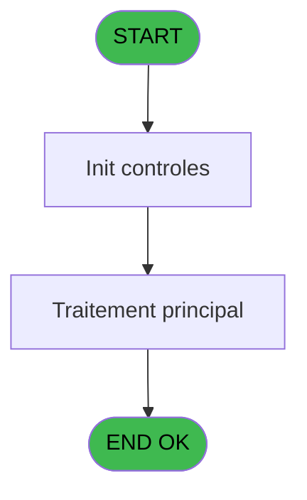
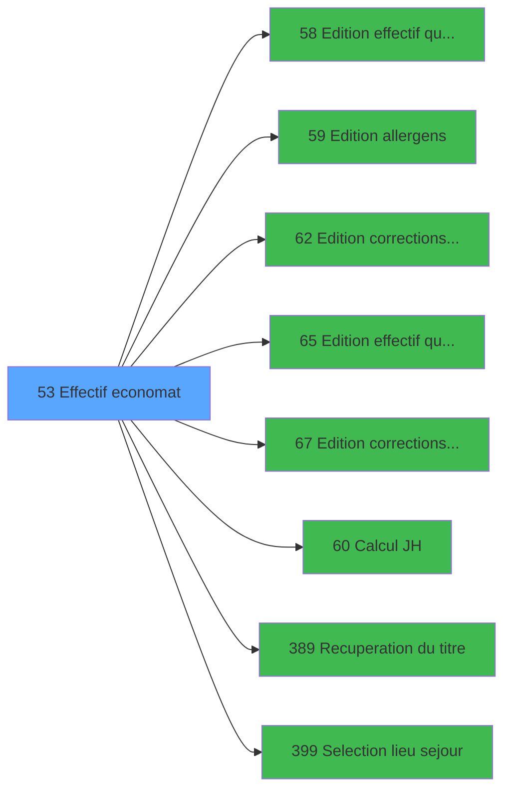

# PBP IDE 53 - Effectif economat

> **Analyse**: Phases 1-4 2026-02-03 08:58 -> 08:58 (22s) | Assemblage 08:58
> **Pipeline**: V7.2 Enrichi
> **Structure**: 4 onglets (Resume | Ecrans | Donnees | Connexions)

<!-- TAB:Resume -->

## 1. FICHE D'IDENTITE

| Attribut | Valeur |
|----------|--------|
| Projet | PBP |
| IDE Position | 53 |
| Nom Programme | Effectif economat |
| Fichier source | `Prg_53.xml` |
| Domaine metier | General |
| Taches | 2 (1 ecrans visibles) |
| Tables modifiees | 0 |
| Programmes appeles | 8 |
| :warning: Statut | **ORPHELIN_POTENTIEL** |

## 2. DESCRIPTION FONCTIONNELLE

**Effectif economat** assure la gestion complete de ce processus.

Le flux de traitement s'organise en **1 blocs fonctionnels** :

- **Traitement** (2 taches) : traitements metier divers

**Logique metier** : 1 regles identifiees couvrant conditions metier.

## 3. BLOCS FONCTIONNELS

### 3.1 Traitement (2 taches)

Traitements internes.

---

#### 53 - Economat [[ECRAN]](#ecran-t1)

**Role** : Traitement : Economat.
**Ecran** : 642 x 150 DLU (MDI) | [Voir mockup](#ecran-t1)
**Delegue a** : [Recuperation du titre (IDE 389)](PBP-IDE-389.md)

---

#### 53.1 - par lieu sejour

**Role** : Traitement : par lieu sejour.
**Variables liees** : J (v.lien lieu sejour), H (b.Bouton Lieu sejour), I (w0_Lieu_sejour)
**Delegue a** : [Recuperation du titre (IDE 389)](PBP-IDE-389.md)

## 5. REGLES METIER

1 regles identifiees:

### Autres (1 regles)

#### [RM-001] Traitement si [DR] est renseigne

| Element | Detail |
|---------|--------|
| **Condition** | `[DR]<>''` |
| **Si vrai** | 'TRUE'LOG |
| **Si faux** | 'FALSE'LOG) |
| **Expression source** | Expression 33 : `IF([DR]<>'','TRUE'LOG,'FALSE'LOG)` |
| **Exemple** | Si [DR]<>'' → 'TRUE'LOG. Sinon → 'FALSE'LOG) |

## 6. CONTEXTE

- **Appele par**: (aucun)
- **Appelle**: 8 programmes | **Tables**: 3 (W:0 R:2 L:2) | **Taches**: 2 | **Expressions**: 37

<!-- TAB:Ecrans -->

## 8. ECRANS

### 8.1 Forms visibles (1 / 2)

| # | Position | Tache | Nom | Type | Largeur | Hauteur | Bloc |
|---|----------|-------|-----|------|---------|---------|------|
| 1 | 53 | 53 | Economat | MDI | 642 | 150 | Traitement |

### 8.2 Mockups Ecrans

---

#### 53 - Economat
**Tache** : [53](#t1) | **Type** : MDI | **Dimensions** : 642 x 150 DLU
**Bloc** : Traitement | **Titre IDE** : Economat

<!-- FORM-DATA:
{
    "width":  642,
    "vFactor":  8,
    "type":  "MDI",
    "hFactor":  8,
    "controls":  [
                     {
                         "x":  1,
                         "type":  "label",
                         "var":  "",
                         "y":  0,
                         "w":  631,
                         "fmt":  "",
                         "name":  "",
                         "h":  19,
                         "color":  "1",
                         "text":  "",
                         "parent":  null
                     },
                     {
                         "x":  14,
                         "type":  "label",
                         "var":  "",
                         "y":  24,
                         "w":  415,
                         "fmt":  "",
                         "name":  "",
                         "h":  94,
                         "color":  "195",
                         "text":  "Paramètres",
                         "parent":  null
                     },
                     {
                         "x":  24,
                         "type":  "label",
                         "var":  "",
                         "y":  61,
                         "w":  64,
                         "fmt":  "",
                         "name":  "",
                         "h":  9,
                         "color":  "",
                         "text":  "Date",
                         "parent":  5
                     },
                     {
                         "x":  5,
                         "type":  "label",
                         "var":  "",
                         "y":  122,
                         "w":  631,
                         "fmt":  "",
                         "name":  "",
                         "h":  24,
                         "color":  "1",
                         "text":  "",
                         "parent":  null
                     },
                     {
                         "x":  438,
                         "type":  "label",
                         "var":  "",
                         "y":  24,
                         "w":  192,
                         "fmt":  "",
                         "name":  "",
                         "h":  94,
                         "color":  "",
                         "text":  "",
                         "parent":  null
                     },
                     {
                         "x":  24,
                         "type":  "label",
                         "var":  "",
                         "y":  79,
                         "w":  122,
                         "fmt":  "",
                         "name":  "",
                         "h":  10,
                         "color":  "",
                         "text":  "Lieu de séjour",
                         "parent":  5
                     },
                     {
                         "x":  149,
                         "type":  "edit",
                         "var":  "",
                         "y":  61,
                         "w":  126,
                         "fmt":  "DD/MM/YYYYA",
                         "name":  "w0_DateCalcul",
                         "h":  10,
                         "color":  "110",
                         "text":  "",
                         "parent":  5
                     },
                     {
                         "x":  291,
                         "type":  "button",
                         "var":  "",
                         "y":  61,
                         "w":  26,
                         "fmt":  "...",
                         "name":  "b_Date",
                         "h":  9,
                         "color":  "",
                         "text":  "",
                         "parent":  5
                     },
                     {
                         "x":  455,
                         "type":  "button",
                         "var":  "",
                         "y":  96,
                         "w":  154,
                         "fmt":  "\u0026Impression",
                         "name":  "b_Imprimer",
                         "h":  18,
                         "color":  "",
                         "text":  "",
                         "parent":  null
                     },
                     {
                         "x":  13,
                         "type":  "button",
                         "var":  "",
                         "y":  125,
                         "w":  154,
                         "fmt":  "\u0026Quitter",
                         "name":  "b_Quitter",
                         "h":  18,
                         "color":  "",
                         "text":  "",
                         "parent":  67
                     },
                     {
                         "x":  7,
                         "type":  "edit",
                         "var":  "",
                         "y":  1,
                         "w":  267,
                         "fmt":  "20",
                         "name":  "",
                         "h":  8,
                         "color":  "",
                         "text":  "",
                         "parent":  1
                     },
                     {
                         "x":  368,
                         "type":  "edit",
                         "var":  "",
                         "y":  6,
                         "w":  254,
                         "fmt":  "WWW DD MMM YYYYT",
                         "name":  "",
                         "h":  8,
                         "color":  "",
                         "text":  "",
                         "parent":  1
                     },
                     {
                         "x":  7,
                         "type":  "edit",
                         "var":  "",
                         "y":  9,
                         "w":  331,
                         "fmt":  "25",
                         "name":  "VG.NOM VILLAGE",
                         "h":  8,
                         "color":  "",
                         "text":  "",
                         "parent":  1
                     },
                     {
                         "x":  448,
                         "type":  "image",
                         "var":  "",
                         "y":  32,
                         "w":  170,
                         "fmt":  "",
                         "name":  "",
                         "h":  59,
                         "color":  "",
                         "text":  "",
                         "parent":  149
                     },
                     {
                         "x":  148,
                         "type":  "edit",
                         "var":  "",
                         "y":  79,
                         "w":  51,
                         "fmt":  "",
                         "name":  "v.Lieu de séjour",
                         "h":  10,
                         "color":  "110",
                         "text":  "",
                         "parent":  5
                     },
                     {
                         "x":  200,
                         "type":  "button",
                         "var":  "",
                         "y":  80,
                         "w":  26,
                         "fmt":  "...",
                         "name":  "b.Lieu de séjour",
                         "h":  9,
                         "color":  "",
                         "text":  "",
                         "parent":  5
                     },
                     {
                         "x":  148,
                         "type":  "edit",
                         "var":  "",
                         "y":  93,
                         "w":  230,
                         "fmt":  "",
                         "name":  "nom_import",
                         "h":  10,
                         "color":  "42",
                         "text":  "",
                         "parent":  5
                     }
                 ],
    "taskId":  "53",
    "height":  150
}
-->

<strong>Champs : 6 champs</strong>

| Pos (x,y) | Nom | Variable | Type |
|-----------|-----|----------|------|
| 149,61 | w0_DateCalcul | - | edit |
| 7,1 | 20 | - | edit |
| 368,6 | WWW DD MMM YYYYT | - | edit |
| 7,9 | VG.NOM VILLAGE | - | edit |
| 148,79 | v.Lieu de séjour | - | edit |
| 148,93 | nom_import | - | edit |

<strong>Boutons : 4 boutons</strong>

| Bouton | Pos (x,y) | Action |
|--------|-----------|--------|
| ... | 291,61 | Bouton fonctionnel |
| Impression | 455,96 | Bouton fonctionnel |
| Quitter | 13,125 | Quitte le programme |
| ... | 200,80 | Bouton fonctionnel |

## 9. NAVIGATION

Ecran unique: **Economat**

### 9.3 Structure hierarchique (2 taches)

| Position | Tache | Type | Dimensions | Bloc |
|----------|-------|------|------------|------|
| **53.1** | [**Economat** (53)](#t1) [mockup](#ecran-t1) | MDI | 642x150 | Traitement |
| 53.1.1 | [par lieu sejour (53.1)](#t2) | - | - | |

### 9.4 Algorigramme

> **Legende**: Vert = START/END OK | Rouge = END KO | Bleu = Decisions
> *Algorigramme auto-genere. Utiliser `/algorigramme` pour une synthese metier detaillee.*

<!-- TAB:Donnees -->

## 10. TABLES

### Tables utilisees (3)

| ID | Nom | Description | Type | R | W | L | Usages |
|----|-----|-------------|------|---|---|---|--------|
| 69 | initialisation___ini |  | DB | R |   |   | 1 |
| 118 | tables_imports |  | DB | R |   | L | 2 |
| 740 | pv_stock_movements | Articles et stock | DB |   |   | L | 1 |

### Colonnes par table (1 / 2 tables avec colonnes identifiees)

Table 69 - initialisation___ini (R) - 1 usages

| Lettre | Variable | Acces | Type |
|--------|----------|-------|------|
| A | w0_Titre | R | Alpha |
| B | w0_DateCalcul | R | Date |
| C | b_Date | R | Alpha |
| D | b_Imprimer | R | Alpha |
| E | b_Quitter | R | Alpha |
| F | V.Confirm recalcul ? | R | Numeric |
| G | V.Existe correctif ? | R | Logical |
| H | b.Bouton Lieu sejour | R | Alpha |
| I | w0_Lieu_sejour | R | Alpha |
| J | v.lien lieu sejour | R | Logical |

Table 118 - tables_imports (R/L) - 2 usages

*Table utilisee uniquement en Link ou aucune colonne Real identifiee dans le DataView.*

## 11. VARIABLES

### 11.1 Variables de session (3)

Variables persistantes pendant toute la session.

| Lettre | Nom | Type | Usage dans |
|--------|-----|------|-----------|
| F | V.Confirm recalcul ? | Numeric | - |
| G | V.Existe correctif ? | Logical | - |
| J | v.lien lieu sejour | Logical | - |

### 11.2 Autres (7)

Variables diverses.

| Lettre | Nom | Type | Usage dans |
|--------|-----|------|-----------|
| A | w0_Titre | Alpha | 1x refs |
| B | w0_DateCalcul | Date | 2x refs |
| C | b_Date | Alpha | - |
| D | b_Imprimer | Alpha | - |
| E | b_Quitter | Alpha | - |
| H | b.Bouton Lieu sejour | Alpha | - |
| I | w0_Lieu_sejour | Alpha | - |

## 12. EXPRESSIONS

**37 / 37 expressions decodees (100%)**

### 12.1 Repartition par type

| Type | Expressions | Regles |
|------|-------------|--------|
| CALCULATION | 1 | 0 |
| CAST_LOGIQUE | 3 | 5 |
| CONSTANTE | 5 | 0 |
| DATE | 3 | 0 |
| FORMAT | 3 | 0 |
| CONDITION | 6 | 0 |
| REFERENCE_VG | 3 | 0 |
| OTHER | 11 | 0 |
| NEGATION | 1 | 0 |
| STRING | 1 | 0 |

### 12.2 Expressions cles par type

#### CALCULATION (1 expressions)

| Type | IDE | Expression | Regle |
|------|-----|------------|-------|
| CALCULATION | 34 | `w0_DateCalcul [B]-1` | - |

#### CAST_LOGIQUE (3 expressions)

| Type | IDE | Expression | Regle |
|------|-----|------------|-------|
| CAST_LOGIQUE | 33 | `IF([DR]<>'','TRUE'LOG,'FALSE'LOG)` | [RM-001](#rm-RM-001) |
| CAST_LOGIQUE | 25 | `'TRUE'LOG` | - |
| CAST_LOGIQUE | 14 | `[DI]=6 OR 'TRUE'LOG` | - |

#### CONSTANTE (5 expressions)

| Type | IDE | Expression | Regle |
|------|-----|------------|-------|
| CONSTANTE | 7 | `'...'` | - |
| CONSTANTE | 31 | `'Lieu de séjour inconnu !'` | - |
| CONSTANTE | 6 | `'&Quitter'` | - |
| CONSTANTE | 2 | `7` | - |
| CONSTANTE | 5 | `'&Imprimer'` | - |

#### DATE (3 expressions)

| Type | IDE | Expression | Regle |
|------|-----|------------|-------|
| DATE | 18 | `Date()-1` | - |
| DATE | 10 | `Date()` | - |
| DATE | 3 | `Date ()` | - |

#### FORMAT (3 expressions)

| Type | IDE | Expression | Regle |
|------|-----|------------|-------|
| FORMAT | 19 | `'c:\temp\'&Trim(VG33)&'_EFF_Correctifs_'&Trim(DStr(Date(),'YYYYMM'))&'.htm'` | - |
| FORMAT | 12 | `'c:\temp\'&Trim([V])&'_effectif_allergens_'&Trim(DStr(Date(),'YYYYMMDD'))&'.htm'` | - |
| FORMAT | 11 | `'c:\temp\'&Trim([V])&'_effectif_quotidien_'&Trim(DStr(Date(),'YYYYMMDD'))&'.htm'` | - |

#### CONDITION (6 expressions)

| Type | IDE | Expression | Regle |
|------|-----|------------|-------|
| CONDITION | 27 | `(VG43 OR VG71) AND VG44>1 AND VG45='O' AND [DR]<>''` | - |
| CONDITION | 30 | `VG44>1 AND VG45='O'` | - |
| CONDITION | 32 | `[DR]<>'' AND NOT([DS])` | - |
| CONDITION | 22 | `([DL]='PLANNING' OR [DL]='INFORMATICIEN') AND w0_DateCalcul [B]=Date()` | - |
| CONDITION | 13 | `[DI]=6` | - |
| ... | | *+1 autres* | |

#### REFERENCE_VG (3 expressions)

| Type | IDE | Expression | Regle |
|------|-----|------------|-------|
| REFERENCE_VG | 37 | `VG71` | - |
| REFERENCE_VG | 21 | `VG1` | - |
| REFERENCE_VG | 4 | `VG2` | - |

#### OTHER (11 expressions)

| Type | IDE | Expression | Regle |
|------|-----|------------|-------|
| OTHER | 24 | `Delay(15)` | - |
| OTHER | 23 | `[DO]` | - |
| OTHER | 29 | `[DR]` | - |
| OTHER | 36 | `NOT(VG71) AND VG128` | - |
| OTHER | 35 | `NOT(VG71)` | - |
| ... | | *+6 autres* | |

#### NEGATION (1 expressions)

| Type | IDE | Expression | Regle |
|------|-----|------------|-------|
| NEGATION | 28 | `NOT ExpCalc('66'EXP)` | - |

#### STRING (1 expressions)

| Type | IDE | Expression | Regle |
|------|-----|------------|-------|
| STRING | 1 | `Trim (w0_Titre [A])` | - |

### 12.3 Toutes les expressions (37)

Voir les 37 expressions

#### CALCULATION (1)

| IDE | Expression Decodee |
|-----|-------------------|
| 34 | `w0_DateCalcul [B]-1` |

#### CAST_LOGIQUE (3)

| IDE | Expression Decodee |
|-----|-------------------|
| 33 | `IF([DR]<>'','TRUE'LOG,'FALSE'LOG)` |
| 14 | `[DI]=6 OR 'TRUE'LOG` |
| 25 | `'TRUE'LOG` |

#### CONSTANTE (5)

| IDE | Expression Decodee |
|-----|-------------------|
| 2 | `7` |
| 5 | `'&Imprimer'` |
| 6 | `'&Quitter'` |
| 7 | `'...'` |
| 31 | `'Lieu de séjour inconnu !'` |

#### DATE (3)

| IDE | Expression Decodee |
|-----|-------------------|
| 3 | `Date ()` |
| 10 | `Date()` |
| 18 | `Date()-1` |

#### FORMAT (3)

| IDE | Expression Decodee |
|-----|-------------------|
| 11 | `'c:\temp\'&Trim([V])&'_effectif_quotidien_'&Trim(DStr(Date(),'YYYYMMDD'))&'.htm'` |
| 12 | `'c:\temp\'&Trim([V])&'_effectif_allergens_'&Trim(DStr(Date(),'YYYYMMDD'))&'.htm'` |
| 19 | `'c:\temp\'&Trim(VG33)&'_EFF_Correctifs_'&Trim(DStr(Date(),'YYYYMM'))&'.htm'` |

#### CONDITION (6)

| IDE | Expression Decodee |
|-----|-------------------|
| 22 | `([DL]='PLANNING' OR [DL]='INFORMATICIEN') AND w0_DateCalcul [B]=Date()` |
| 13 | `[DI]=6` |
| 26 | `VG43 AND VG44>1 AND VG45='O' AND [DR]<>''` |
| 27 | `(VG43 OR VG71) AND VG44>1 AND VG45='O' AND [DR]<>''` |
| 30 | `VG44>1 AND VG45='O'` |
| 32 | `[DR]<>'' AND NOT([DS])` |

#### REFERENCE_VG (3)

| IDE | Expression Decodee |
|-----|-------------------|
| 4 | `VG2` |
| 21 | `VG1` |
| 37 | `VG71` |

#### OTHER (11)

| IDE | Expression Decodee |
|-----|-------------------|
| 8 | `SetCrsr (2)` |
| 9 | `SetCrsr (1)` |
| 15 | `FileDelete(Translate('%club_exportdata%traceeffectifquotidien.txt'))` |
| 16 | `SetCrsr(2)` |
| 17 | `SetCrsr(1)` |
| 20 | `GetParam('SOCIETE')` |
| 23 | `[DO]` |
| 24 | `Delay(15)` |
| 29 | `[DR]` |
| 35 | `NOT(VG71)` |
| 36 | `NOT(VG71) AND VG128` |

#### NEGATION (1)

| IDE | Expression Decodee |
|-----|-------------------|
| 28 | `NOT ExpCalc('66'EXP)` |

#### STRING (1)

| IDE | Expression Decodee |
|-----|-------------------|
| 1 | `Trim (w0_Titre [A])` |

<!-- TAB:Connexions -->

## 13. GRAPHE D'APPELS

### 13.1 Chaine depuis Main (Callers)

**Chemin**: (pas de callers directs)

### 13.2 Callers

| IDE | Nom Programme | Nb Appels |
|-----|---------------|-----------|
| - | (aucun) | - |

### 13.3 Callees (programmes appeles)

### 13.4 Detail Callees avec contexte

| IDE | Nom Programme | Appels | Contexte |
|-----|---------------|--------|----------|
| [58](PBP-IDE-58.md) | Edition effectif quotidien | 2 | Impression ticket/document |
| [59](PBP-IDE-59.md) | Edition allergens | 2 | Impression ticket/document |
| [62](PBP-IDE-62.md) | Edition corrections effectif | 2 | Impression ticket/document |
| [65](PBP-IDE-65.md) | Edition effectif quotidien V3 | 2 | Impression ticket/document |
| [67](PBP-IDE-67.md) | Edition corrections effectifV3 | 2 | Impression ticket/document |
| [60](PBP-IDE-60.md) | Calcul JH | 1 | Calcul de donnees |
| [389](PBP-IDE-389.md) | Recuperation du titre | 1 | Recuperation donnees |
| [399](PBP-IDE-399.md) | Selection lieu sejour | 1 | Selection/consultation |

## 14. RECOMMANDATIONS MIGRATION

### 14.1 Profil du programme

| Metrique | Valeur | Impact migration |
|----------|--------|-----------------|
| Lignes de logique | 110 | Programme compact |
| Expressions | 37 | Peu de logique |
| Tables WRITE | 0 | Impact faible |
| Sous-programmes | 8 | Dependances moderees |
| Ecrans visibles | 1 | Ecran unique ou traitement batch |
| Code desactive | 0% (0 / 110) | Code sain |
| Regles metier | 1 | Quelques regles a preserver |

### 14.2 Plan de migration par bloc

#### Traitement (2 taches: 1 ecran, 1 traitement)

- **Strategie** : Orchestrateur avec 1 ecrans (Razor/React) et 1 traitements backend (services).
- Les ecrans deviennent des composants UI, les traitements invisibles deviennent des services injectables.
- 8 sous-programme(s) a migrer ou a reutiliser depuis les services existants.
- Decomposer les taches en services unitaires testables.

### 14.3 Dependances critiques

| Dependance | Type | Appels | Impact |
|------------|------|--------|--------|
| [Edition effectif quotidien V3 (IDE 65)](PBP-IDE-65.md) | Sous-programme | 2x | Haute - Impression ticket/document |
| [Edition corrections effectifV3 (IDE 67)](PBP-IDE-67.md) | Sous-programme | 2x | Haute - Impression ticket/document |
| [Edition corrections effectif (IDE 62)](PBP-IDE-62.md) | Sous-programme | 2x | Haute - Impression ticket/document |
| [Edition effectif quotidien (IDE 58)](PBP-IDE-58.md) | Sous-programme | 2x | Haute - Impression ticket/document |
| [Edition allergens (IDE 59)](PBP-IDE-59.md) | Sous-programme | 2x | Haute - Impression ticket/document |
| [Selection lieu sejour (IDE 399)](PBP-IDE-399.md) | Sous-programme | 1x | Normale - Selection/consultation |
| [Recuperation du titre (IDE 389)](PBP-IDE-389.md) | Sous-programme | 1x | Normale - Recuperation donnees |
| [Calcul JH (IDE 60)](PBP-IDE-60.md) | Sous-programme | 1x | Normale - Calcul de donnees |

---
*Spec DETAILED generee par Pipeline V7.2 - 2026-02-03 08:59*
