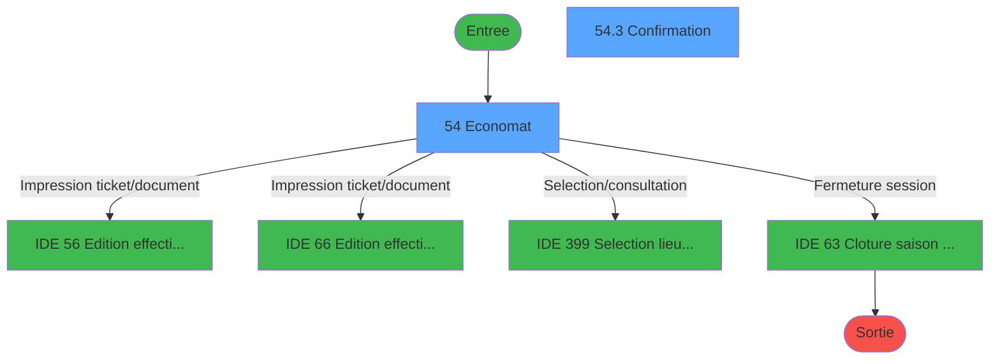
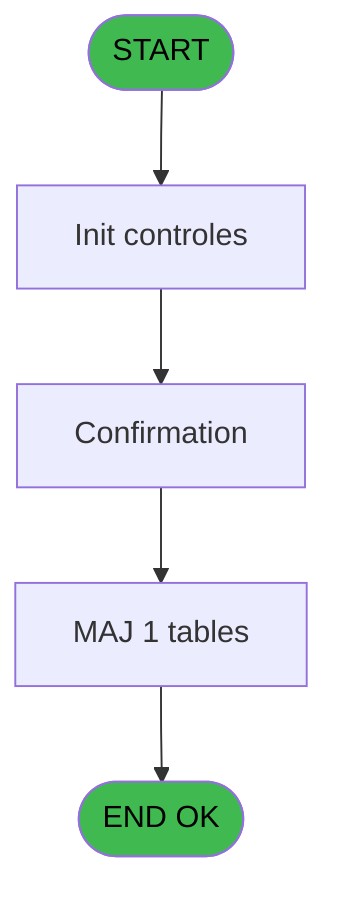
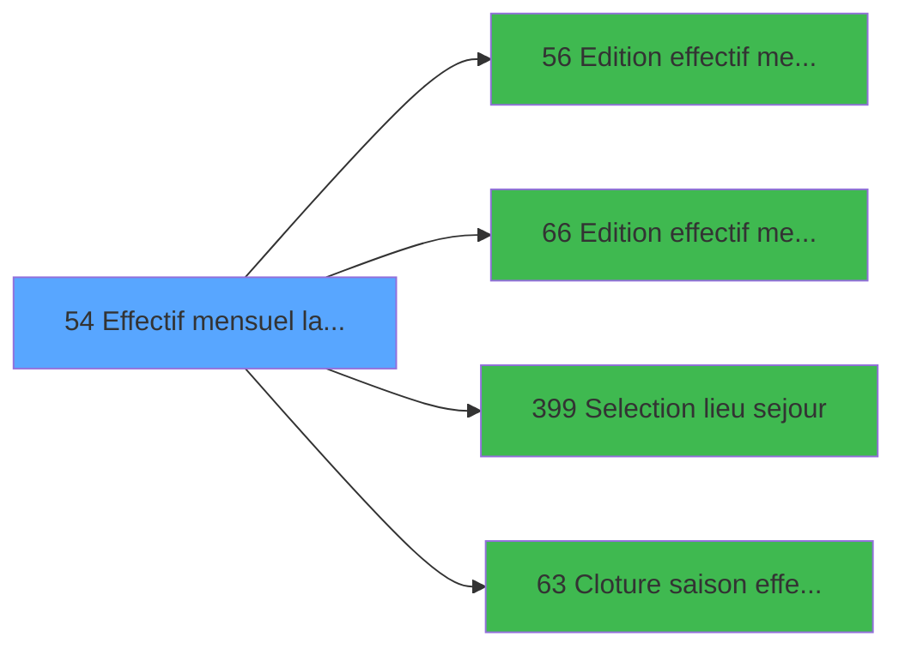

# PBP IDE 54 - Effectif mensuel lancement

> **Analyse**: Phases 1-4 2026-02-03 08:59 -> 08:59 (21s) | Assemblage 08:59
> **Pipeline**: V7.2 Enrichi
> **Structure**: 4 onglets (Resume | Ecrans | Donnees | Connexions)

<!-- TAB:Resume -->

## 1. FICHE D'IDENTITE

| Attribut | Valeur |
|----------|--------|
| Projet | PBP |
| IDE Position | 54 |
| Nom Programme | Effectif mensuel lancement |
| Fichier source | `Prg_54.xml` |
| Domaine metier | General |
| Taches | 4 (2 ecrans visibles) |
| Tables modifiees | 1 |
| Programmes appeles | 4 |
| :warning: Statut | **ORPHELIN_POTENTIEL** |

## 2. DESCRIPTION FONCTIONNELLE

**Effectif mensuel lancement** assure la gestion complete de ce processus.

Le flux de traitement s'organise en **2 blocs fonctionnels** :

- **Traitement** (3 taches) : traitements metier divers
- **Validation** (1 tache) : controles et verifications de coherence

**Donnees modifiees** : 1 tables en ecriture (tables_imports).

**Logique metier** : 2 regles identifiees couvrant conditions metier.

Detail : phases du traitement

#### Phase 1 : Traitement (3 taches)

- **54** - Economat **[[ECRAN]](#ecran-t1)**
- **54.1** - par lieu sejour
- **54.3** - Confirmation ? **[[ECRAN]](#ecran-t4)**

Delegue a : [Cloture saison effectif (IDE 63)](PBP-IDE-63.md)

#### Phase 2 : Validation (1 tache)

- **54.2** - verif cloture

#### Tables impactees

| Table | Operations | Role metier |
|-------|-----------|-------------|
| tables_imports | **W**/L (2 usages) |  |

## 3. BLOCS FONCTIONNELS

### 3.1 Traitement (3 taches)

Traitements internes.

---

#### 54 - Economat [[ECRAN]](#ecran-t1)

**Role** : Traitement : Economat.
**Ecran** : 866 x 172 DLU (MDI) | [Voir mockup](#ecran-t1)
**Delegue a** : [Cloture saison effectif (IDE 63)](PBP-IDE-63.md)

---

#### 54.1 - par lieu sejour

**Role** : Traitement : par lieu sejour.
**Variables liees** : H (b.Lieu de séjour), I (w0_Lieu  de séjour), J (w0_Retour lieu de séjour)
**Delegue a** : [Cloture saison effectif (IDE 63)](PBP-IDE-63.md)

---

#### 54.3 - Confirmation ? [[ECRAN]](#ecran-t4)

**Role** : Traitement : Confirmation ?.
**Ecran** : 414 x 86 DLU | [Voir mockup](#ecran-t4)
**Delegue a** : [Cloture saison effectif (IDE 63)](PBP-IDE-63.md)

### 3.2 Validation (1 tache)

Controles de coherence : 1 tache verifie les donnees et conditions.

---

#### 54.2 - verif cloture

**Role** : Verification : verif cloture.
**Variables liees** : K (V.confirm cloture saison ?), L (V.Existe cloture saison ?)

## 5. REGLES METIER

2 regles identifiees:

### Autres (2 regles)

#### [RM-001] Traitement si v.DateDebutHiver [P] est renseigne

| Element | Detail |
|---------|--------|
| **Condition** | `v.DateDebutHiver [P]<>''` |
| **Si vrai** | 'TRUE'LOG |
| **Si faux** | 'FALSE'LOG) |
| **Variables** | P (v.DateDebutHiver) |
| **Expression source** | Expression 23 : `IF(v.DateDebutHiver [P]<>'','TRUE'LOG,'FALSE'LOG)` |
| **Exemple** | Si v.DateDebutHiver [P]<>'' → 'TRUE'LOG. Sinon → 'FALSE'LOG) |

#### [RM-002] Si w0_DateCalcul [B] >= [Y] AND w0_DateCalcul [B] <= [Z] alors CMonth([Y]) sinon CMonth([AA]))

| Element | Detail |
|---------|--------|
| **Condition** | `w0_DateCalcul [B] >= [Y] AND w0_DateCalcul [B] <= [Z]` |
| **Si vrai** | CMonth([Y]) |
| **Si faux** | CMonth([AA])) |
| **Variables** | B (w0_DateCalcul) |
| **Expression source** | Expression 42 : `IF(w0_DateCalcul [B] >= [Y] AND w0_DateCalcul [B] <= [Z], CM` |
| **Exemple** | Si w0_DateCalcul [B] >= [Y] AND w0_DateCalcul [B] <= [Z] → CMonth([Y]). Sinon → CMonth([AA])) |

## 6. CONTEXTE

- **Appele par**: (aucun)
- **Appelle**: 4 programmes | **Tables**: 5 (W:1 R:2 L:3) | **Taches**: 4 | **Expressions**: 46

<!-- TAB:Ecrans -->

## 8. ECRANS

### 8.1 Forms visibles (2 / 4)

| # | Position | Tache | Nom | Type | Largeur | Hauteur | Bloc |
|---|----------|-------|-----|------|---------|---------|------|
| 1 | 54 | 54 | Economat | MDI | 866 | 172 | Traitement |
| 2 | 54.3 | 54.3 | Confirmation ? | Type0 | 414 | 86 | Traitement |

### 8.2 Mockups Ecrans

---

#### 54 - Economat
**Tache** : [54](#t1) | **Type** : MDI | **Dimensions** : 866 x 172 DLU
**Bloc** : Traitement | **Titre IDE** : Economat

<!-- FORM-DATA:
{
    "width":  866,
    "vFactor":  8,
    "type":  "MDI",
    "hFactor":  8,
    "controls":  [
                     {
                         "x":  1,
                         "type":  "label",
                         "var":  "",
                         "y":  0,
                         "w":  855,
                         "fmt":  "",
                         "name":  "",
                         "h":  19,
                         "color":  "1",
                         "text":  "",
                         "parent":  null
                     },
                     {
                         "x":  5,
                         "type":  "label",
                         "var":  "",
                         "y":  145,
                         "w":  855,
                         "fmt":  "",
                         "name":  "",
                         "h":  24,
                         "color":  "1",
                         "text":  "",
                         "parent":  null
                     },
                     {
                         "x":  5,
                         "type":  "label",
                         "var":  "",
                         "y":  24,
                         "w":  655,
                         "fmt":  "",
                         "name":  "",
                         "h":  119,
                         "color":  "195",
                         "text":  "Paramètres",
                         "parent":  null
                     },
                     {
                         "x":  29,
                         "type":  "label",
                         "var":  "",
                         "y":  61,
                         "w":  85,
                         "fmt":  "",
                         "name":  "",
                         "h":  10,
                         "color":  "",
                         "text":  "Date de fin",
                         "parent":  6
                     },
                     {
                         "x":  29,
                         "type":  "label",
                         "var":  "",
                         "y":  79,
                         "w":  125,
                         "fmt":  "",
                         "name":  "",
                         "h":  10,
                         "color":  "",
                         "text":  "Lieu de séjour",
                         "parent":  6
                     },
                     {
                         "x":  664,
                         "type":  "label",
                         "var":  "",
                         "y":  24,
                         "w":  192,
                         "fmt":  "",
                         "name":  "",
                         "h":  119,
                         "color":  "",
                         "text":  "",
                         "parent":  null
                     },
                     {
                         "x":  29,
                         "type":  "label",
                         "var":  "",
                         "y":  43,
                         "w":  85,
                         "fmt":  "",
                         "name":  "",
                         "h":  10,
                         "color":  "",
                         "text":  "Calendrier",
                         "parent":  6
                     },
                     {
                         "x":  174,
                         "type":  "edit",
                         "var":  "",
                         "y":  61,
                         "w":  154,
                         "fmt":  "DD/MM/YYYYZ A",
                         "name":  "w0_DateCalcul",
                         "h":  10,
                         "color":  "110",
                         "text":  "",
                         "parent":  6
                     },
                     {
                         "x":  331,
                         "type":  "button",
                         "var":  "",
                         "y":  61,
                         "w":  26,
                         "fmt":  "...",
                         "name":  "b_Date",
                         "h":  9,
                         "color":  "",
                         "text":  "",
                         "parent":  6
                     },
                     {
                         "x":  174,
                         "type":  "edit",
                         "var":  "",
                         "y":  80,
                         "w":  51,
                         "fmt":  "",
                         "name":  "w0_Lieu de séjour",
                         "h":  10,
                         "color":  "6",
                         "text":  "",
                         "parent":  6
                     },
                     {
                         "x":  682,
                         "type":  "button",
                         "var":  "",
                         "y":  122,
                         "w":  154,
                         "fmt":  "\u0026Impression",
                         "name":  "b_Imprimer",
                         "h":  18,
                         "color":  "",
                         "text":  "",
                         "parent":  null
                     },
                     {
                         "x":  13,
                         "type":  "button",
                         "var":  "",
                         "y":  148,
                         "w":  154,
                         "fmt":  "\u0026Quitter",
                         "name":  "b_Quitter",
                         "h":  18,
                         "color":  "",
                         "text":  "",
                         "parent":  5
                     },
                     {
                         "x":  7,
                         "type":  "edit",
                         "var":  "",
                         "y":  1,
                         "w":  267,
                         "fmt":  "20",
                         "name":  "",
                         "h":  8,
                         "color":  "",
                         "text":  "",
                         "parent":  1
                     },
                     {
                         "x":  597,
                         "type":  "edit",
                         "var":  "",
                         "y":  6,
                         "w":  254,
                         "fmt":  "WWW DD MMM YYYYT",
                         "name":  "",
                         "h":  8,
                         "color":  "",
                         "text":  "",
                         "parent":  1
                     },
                     {
                         "x":  7,
                         "type":  "edit",
                         "var":  "",
                         "y":  9,
                         "w":  331,
                         "fmt":  "25",
                         "name":  "VG.NOM VILLAGE",
                         "h":  8,
                         "color":  "",
                         "text":  "",
                         "parent":  1
                     },
                     {
                         "x":  674,
                         "type":  "image",
                         "var":  "",
                         "y":  32,
                         "w":  170,
                         "fmt":  "",
                         "name":  "",
                         "h":  59,
                         "color":  "",
                         "text":  "",
                         "parent":  14
                     },
                     {
                         "x":  174,
                         "type":  "edit",
                         "var":  "",
                         "y":  92,
                         "w":  230,
                         "fmt":  "",
                         "name":  "nom_import",
                         "h":  10,
                         "color":  "42",
                         "text":  "",
                         "parent":  6
                     },
                     {
                         "x":  302,
                         "type":  "button",
                         "var":  "",
                         "y":  79,
                         "w":  26,
                         "fmt":  "...",
                         "name":  "b.Lieu de sejour",
                         "h":  9,
                         "color":  "",
                         "text":  "",
                         "parent":  6
                     },
                     {
                         "x":  174,
                         "type":  "combobox",
                         "var":  "",
                         "y":  42,
                         "w":  183,
                         "fmt":  "",
                         "name":  "TypeCalendrier",
                         "h":  12,
                         "color":  "110",
                         "text":  "Comptable,Opérationnel",
                         "parent":  6
                     },
                     {
                         "x":  29,
                         "type":  "checkbox",
                         "var":  "",
                         "y":  107,
                         "w":  584,
                         "fmt":  "",
                         "name":  "w0_millesia",
                         "h":  12,
                         "color":  "",
                         "text":  "",
                         "parent":  null
                     }
                 ],
    "taskId":  "54",
    "height":  172
}
-->

<strong>Champs : 8 champs</strong>

| Pos (x,y) | Nom | Variable | Type |
|-----------|-----|----------|------|
| 174,61 | w0_DateCalcul | - | edit |
| 174,80 | w0_Lieu de séjour | - | edit |
| 7,1 | 20 | - | edit |
| 597,6 | WWW DD MMM YYYYT | - | edit |
| 7,9 | VG.NOM VILLAGE | - | edit |
| 174,92 | nom_import | - | edit |
| 174,42 | TypeCalendrier | - | combobox |
| 29,107 | w0_millesia | - | checkbox |

<strong>Boutons : 4 boutons</strong>

| Bouton | Pos (x,y) | Action |
|--------|-----------|--------|
| ... | 331,61 | Bouton fonctionnel |
| Impression | 682,122 | Bouton fonctionnel |
| Quitter | 13,148 | Quitte le programme |
| ... | 302,79 | Bouton fonctionnel |

---

#### 54.3 - Confirmation ?
**Tache** : [54.3](#t4) | **Type** : Type0 | **Dimensions** : 414 x 86 DLU
**Bloc** : Traitement | **Titre IDE** : Confirmation ?

<!-- FORM-DATA:
{
    "width":  414,
    "vFactor":  8,
    "type":  "Type0",
    "hFactor":  4,
    "controls":  [
                     {
                         "x":  26,
                         "type":  "checkbox",
                         "var":  "",
                         "y":  31,
                         "w":  16,
                         "fmt":  "",
                         "name":  "Reporter ?",
                         "h":  9,
                         "color":  "",
                         "text":  "",
                         "parent":  null
                     },
                     {
                         "x":  44,
                         "type":  "edit",
                         "var":  "",
                         "y":  31,
                         "w":  362,
                         "fmt":  "",
                         "name":  "Text",
                         "h":  10,
                         "color":  "",
                         "text":  "",
                         "parent":  null
                     },
                     {
                         "x":  331,
                         "type":  "button",
                         "var":  "",
                         "y":  65,
                         "w":  77,
                         "fmt":  "\u0026OK",
                         "name":  "BtnOK",
                         "h":  18,
                         "color":  "",
                         "text":  "",
                         "parent":  null
                     }
                 ],
    "taskId":  "54.3",
    "height":  86
}
-->

<strong>Champs : 2 champs</strong>

| Pos (x,y) | Nom | Variable | Type |
|-----------|-----|----------|------|
| 26,31 | Reporter ? | - | checkbox |
| 44,31 | Text | - | edit |

<strong>Boutons : 1 boutons</strong>

| Bouton | Pos (x,y) | Action |
|--------|-----------|--------|
| OK | 331,65 | Valide la saisie et enregistre |

## 9. NAVIGATION

### 9.1 Enchainement des ecrans

**Detail par enchainement :**

| Depuis | Action | Vers | Retour |
|--------|--------|------|--------|
| Economat | Impression ticket/document | [Edition effectif mensuel (IDE 56)](PBP-IDE-56.md) | Retour ecran |
| Economat | Impression ticket/document | [Edition effectif mensuel V3 (IDE 66)](PBP-IDE-66.md) | Retour ecran |
| Economat | Selection/consultation | [Selection lieu sejour (IDE 399)](PBP-IDE-399.md) | Retour ecran |
| Economat | Fermeture session | [Cloture saison effectif (IDE 63)](PBP-IDE-63.md) | Retour ecran |

### 9.3 Structure hierarchique (4 taches)

| Position | Tache | Type | Dimensions | Bloc |
|----------|-------|------|------------|------|
| **54.1** | [**Economat** (54)](#t1) [mockup](#ecran-t1) | MDI | 866x172 | Traitement |
| 54.1.1 | [par lieu sejour (54.1)](#t2) | - | - | |
| 54.1.2 | [Confirmation ? (54.3)](#t4) [mockup](#ecran-t4) | - | 414x86 | |
| **54.2** | [**verif cloture** (54.2)](#t3) | - | - | Validation |

### 9.4 Algorigramme

> **Legende**: Vert = START/END OK | Rouge = END KO | Bleu = Decisions
> *Algorigramme auto-genere. Utiliser `/algorigramme` pour une synthese metier detaillee.*

<!-- TAB:Donnees -->

## 10. TABLES

### Tables utilisees (5)

| ID | Nom | Description | Type | R | W | L | Usages |
|----|-----|-------------|------|---|---|---|--------|
| 69 | initialisation___ini |  | DB | R |   |   | 1 |
| 118 | tables_imports |  | DB |   | **W** | L | 2 |
| 372 | pv_budget |  | DB |   |   | L | 1 |
| 740 | pv_stock_movements | Articles et stock | DB |   |   | L | 1 |
| 838 | ##_pv_rentals_dat |  | DB | R |   |   | 1 |

### Colonnes par table (1 / 3 tables avec colonnes identifiees)

Table 69 - initialisation___ini (R) - 1 usages

| Lettre | Variable | Acces | Type |
|--------|----------|-------|------|
| A | w0_Titre | R | Alpha |
| B | w0_DateCalcul | R | Date |
| C | b_Date | R | Alpha |
| D | b_Imprimer | R | Alpha |
| E | b_Quitter | R | Alpha |
| F | V.Confirm recalcul ? | R | Numeric |
| G | V.Existe correctif ? | R | Logical |
| H | b.Lieu de séjour | R | Alpha |
| I | w0_Lieu  de séjour | R | Alpha |
| J | w0_Retour lieu de séjour | R | Logical |
| K | V.confirm cloture saison ? | R | Numeric |
| L | V.Existe cloture saison ? | R | Logical |
| M | TypeCalendrier | R | Unicode |
| N | v.DateDebutEte | R | Date |
| O | v.DateFinEte | R | Date |
| P | v.DateDebutHiver | R | Date |
| Q | v.DateFinHiver | R | Date |
| R | Reporter ? | R | Logical |
| S | v.PeriodeSur2Saison? | R | Logical |
| T | AfficheMessageReporter? | R | Logical |
| U | V.Nom1erMois | R | Unicode |
| V | v.DateReport | R | Unicode |
| W | v.TextReporter | R | Unicode |

Table 118 - tables_imports (**W**/L) - 2 usages

*Table utilisee uniquement en Link ou aucune colonne Real identifiee dans le DataView.*

Table 838 - ##_pv_rentals_dat (R) - 1 usages

*Table utilisee uniquement en Link ou aucune colonne Real identifiee dans le DataView.*

## 11. VARIABLES

### 11.1 Variables de session (12)

Variables persistantes pendant toute la session.

| Lettre | Nom | Type | Usage dans |
|--------|-----|------|-----------|
| F | V.Confirm recalcul ? | Numeric | 3x session |
| G | V.Existe correctif ? | Logical | 3x session |
| K | V.confirm cloture saison ? | Numeric | - |
| L | V.Existe cloture saison ? | Logical | - |
| N | v.DateDebutEte | Date | - |
| O | v.DateFinEte | Date | - |
| P | v.DateDebutHiver | Date | 4x session |
| Q | v.DateFinHiver | Date | 1x session |
| S | v.PeriodeSur2Saison? | Logical | - |
| U | V.Nom1erMois | Unicode | 1x session |
| V | v.DateReport | Unicode | 2x session |
| W | v.TextReporter | Unicode | 2x session |

### 11.2 Autres (11)

Variables diverses.

| Lettre | Nom | Type | Usage dans |
|--------|-----|------|-----------|
| A | w0_Titre | Alpha | - |
| B | w0_DateCalcul | Date | 8x refs |
| C | b_Date | Alpha | - |
| D | b_Imprimer | Alpha | 1x refs |
| E | b_Quitter | Alpha | - |
| H | b.Lieu de séjour | Alpha | - |
| I | w0_Lieu  de séjour | Alpha | - |
| J | w0_Retour lieu de séjour | Logical | - |
| M | TypeCalendrier | Unicode | - |
| R | Reporter ? | Logical | - |
| T | AfficheMessageReporter? | Logical | - |

Toutes les 23 variables (liste complete)

| Cat | Lettre | Nom Variable | Type |
|-----|--------|--------------|------|
| V. | **F** | V.Confirm recalcul ? | Numeric |
| V. | **G** | V.Existe correctif ? | Logical |
| V. | **K** | V.confirm cloture saison ? | Numeric |
| V. | **L** | V.Existe cloture saison ? | Logical |
| V. | **N** | v.DateDebutEte | Date |
| V. | **O** | v.DateFinEte | Date |
| V. | **P** | v.DateDebutHiver | Date |
| V. | **Q** | v.DateFinHiver | Date |
| V. | **S** | v.PeriodeSur2Saison? | Logical |
| V. | **U** | V.Nom1erMois | Unicode |
| V. | **V** | v.DateReport | Unicode |
| V. | **W** | v.TextReporter | Unicode |
| Autre | **A** | w0_Titre | Alpha |
| Autre | **B** | w0_DateCalcul | Date |
| Autre | **C** | b_Date | Alpha |
| Autre | **D** | b_Imprimer | Alpha |
| Autre | **E** | b_Quitter | Alpha |
| Autre | **H** | b.Lieu de séjour | Alpha |
| Autre | **I** | w0_Lieu  de séjour | Alpha |
| Autre | **J** | w0_Retour lieu de séjour | Logical |
| Autre | **M** | TypeCalendrier | Unicode |
| Autre | **R** | Reporter ? | Logical |
| Autre | **T** | AfficheMessageReporter? | Logical |

## 12. EXPRESSIONS

**46 / 46 expressions decodees (100%)**

### 12.1 Repartition par type

| Type | Expressions | Regles |
|------|-------------|--------|
| CALCULATION | 1 | 0 |
| CAST_LOGIQUE | 4 | 5 |
| CONDITION | 13 | 5 |
| CONSTANTE | 6 | 0 |
| DATE | 2 | 0 |
| FORMAT | 5 | 0 |
| REFERENCE_VG | 3 | 0 |
| OTHER | 8 | 0 |
| NEGATION | 2 | 0 |
| CONCATENATION | 1 | 0 |
| STRING | 1 | 0 |

### 12.2 Expressions cles par type

#### CALCULATION (1 expressions)

| Type | IDE | Expression | Regle |
|------|-----|------------|-------|
| CALCULATION | 29 | `EOM(V.Existe correctif ? [G]+7)` | - |

#### CAST_LOGIQUE (4 expressions)

| Type | IDE | Expression | Regle |
|------|-----|------------|-------|
| CAST_LOGIQUE | 23 | `IF(v.DateDebutHiver [P]<>'','TRUE'LOG,'FALSE'LOG)` | [RM-001](#rm-RM-001) |
| CAST_LOGIQUE | 39 | `'FALSE'LOG` | - |
| CAST_LOGIQUE | 38 | `'TRUE'LOG` | - |
| CAST_LOGIQUE | 13 | `'FALSE'LOG` | - |

#### CONDITION (13 expressions)

| Type | IDE | Expression | Regle |
|------|-----|------------|-------|
| CONDITION | 42 | `IF(w0_DateCalcul [B] >= [Y] AND w0_DateCalcul [B] <= [Z], CMonth([Y]), CMonth([AA]))` | [RM-002](#rm-RM-002) |
| CONDITION | 35 | `V.Confirm recalcul ? [F] = 'O' AND v.TextReporter [W] = 'O' AND VG74` | - |
| CONDITION | 25 | `V.Nom1erMois [U]=6` | - |
| CONDITION | 21 | `v.DateDebutHiver [P]<>'' AND NOT(v.DateFinHiver [Q])` | - |
| CONDITION | 41 | `V.Confirm recalcul ? [F] = 'O' AND v.TextReporter [W] = 'O' AND VG74 AND [AJ]` | - |
| ... | | *+8 autres* | |

#### CONSTANTE (6 expressions)

| Type | IDE | Expression | Regle |
|------|-----|------------|-------|
| CONSTANTE | 6 | `'...'` | - |
| CONSTANTE | 22 | `'Lieu de séjour inconnu'` | - |
| CONSTANTE | 37 | `'O'` | - |
| CONSTANTE | 1 | `'Edition états mensuel effectif'` | - |
| CONSTANTE | 4 | `'&Imprimer'` | - |
| ... | | *+1 autres* | |

#### DATE (2 expressions)

| Type | IDE | Expression | Regle |
|------|-----|------------|-------|
| DATE | 7 | `Date()-1` | - |
| DATE | 2 | `Date ()` | - |

#### FORMAT (5 expressions)

| Type | IDE | Expression | Regle |
|------|-----|------------|-------|
| FORMAT | 34 | `DVal('30/04/' & Str(IF(Range(Month(w0_DateCalcul [B]),5,12),Year(w0_DateCalcul [B])+1,Year(w0_DateCalcul [B])),'4'),'DD/MM/YYYY')` | - |
| FORMAT | 43 | `DStr([X] - 14,'DD/MM/YYYY')` | - |
| FORMAT | 33 | `DVal('01/11/' & Str(IF(Range(Month(w0_DateCalcul [B]),5,12),Year(w0_DateCalcul [B]),Year(w0_DateCalcul [B])-1),'4'),'DD/MM/YYYY')` | - |
| FORMAT | 31 | `DVal('01/05/'&Str(Year(w0_DateCalcul [B]),'4'),'DD/MM/YYYY')` | - |
| FORMAT | 32 | `DVal('31/10/'&Str(Year(w0_DateCalcul [B]),'4'),'DD/MM/YYYY')` | - |

#### REFERENCE_VG (3 expressions)

| Type | IDE | Expression | Regle |
|------|-----|------------|-------|
| REFERENCE_VG | 30 | `VG74` | - |
| REFERENCE_VG | 11 | `VG1` | - |
| REFERENCE_VG | 3 | `VG2` | - |

#### OTHER (8 expressions)

| Type | IDE | Expression | Regle |
|------|-----|------------|-------|
| OTHER | 27 | `SetCrsr(2)` | - |
| OTHER | 24 | `b_Imprimer [D]` | - |
| OTHER | 45 | `[AD] AND VG74` | - |
| OTHER | 28 | `SetCrsr(1)` | - |
| OTHER | 9 | `SetCrsr(1)` | - |
| ... | | *+3 autres* | |

#### NEGATION (2 expressions)

| Type | IDE | Expression | Regle |
|------|-----|------------|-------|
| NEGATION | 18 | `NOT ExpCalc('16'EXP) AND VG71` | - |
| NEGATION | 17 | `NOT ExpCalc('16'EXP) AND NOT(VG71)` | - |

#### CONCATENATION (1 expressions)

| Type | IDE | Expression | Regle |
|------|-----|------------|-------|
| CONCATENATION | 44 | `'Reporter sur le mois de ' & Trim([AG]) & ' les JH depuis le ' & Trim([AH])` | - |

#### STRING (1 expressions)

| Type | IDE | Expression | Regle |
|------|-----|------------|-------|
| STRING | 46 | `Trim([AI])` | - |

### 12.3 Toutes les expressions (46)

Voir les 46 expressions

#### CALCULATION (1)

| IDE | Expression Decodee |
|-----|-------------------|
| 29 | `EOM(V.Existe correctif ? [G]+7)` |

#### CAST_LOGIQUE (4)

| IDE | Expression Decodee |
|-----|-------------------|
| 23 | `IF(v.DateDebutHiver [P]<>'','TRUE'LOG,'FALSE'LOG)` |
| 13 | `'FALSE'LOG` |
| 38 | `'TRUE'LOG` |
| 39 | `'FALSE'LOG` |

#### CONDITION (13)

| IDE | Expression Decodee |
|-----|-------------------|
| 42 | `IF(w0_DateCalcul [B] >= [Y] AND w0_DateCalcul [B] <= [Z], CMonth([Y]), CMonth([AA]))` |
| 14 | `w0_DateCalcul [B]>Date()-1 AND NOT v.DateReport [V]` |
| 26 | `V.Confirm recalcul ? [F]='O' AND IF(VG3,Month(Date())=Month(V.Existe correctif ? [G]),Date()>V.Existe correctif ? [G]) AND NOT v.DateReport [V]` |
| 12 | `w0_DateCalcul [B]=0` |
| 15 | `VG43 AND VG44>1 AND VG45='O'` |
| 16 | `(VG43 OR VG71) AND VG44>1 AND VG45='O' AND v.DateDebutHiver [P]<>''` |
| 20 | `VG44>1 AND VG45='O'` |
| 21 | `v.DateDebutHiver [P]<>'' AND NOT(v.DateFinHiver [Q])` |
| 25 | `V.Nom1erMois [U]=6` |
| 35 | `V.Confirm recalcul ? [F] = 'O' AND v.TextReporter [W] = 'O' AND VG74` |
| 36 | `([X] >= [AA] AND [X] <= [AB] AND V.Existe correctif ? [G] >= [Y] AND V.Existe correctif ? [G] <= [Z]) OR ([X] >= [Y] AND [X] <= [Z] AND V.Existe correctif ? [G] >= [AA] AND V.Existe correctif ? [G] <= [AB])` |
| 40 | `([X] < [AA] AND w0_DateCalcul [B] > [AA]) OR ([X] < [Y] AND w0_DateCalcul [B] > [Y])` |
| 41 | `V.Confirm recalcul ? [F] = 'O' AND v.TextReporter [W] = 'O' AND VG74 AND [AJ]` |

#### CONSTANTE (6)

| IDE | Expression Decodee |
|-----|-------------------|
| 1 | `'Edition états mensuel effectif'` |
| 4 | `'&Imprimer'` |
| 5 | `'&Quitter'` |
| 6 | `'...'` |
| 22 | `'Lieu de séjour inconnu'` |
| 37 | `'O'` |

#### DATE (2)

| IDE | Expression Decodee |
|-----|-------------------|
| 2 | `Date ()` |
| 7 | `Date()-1` |

#### FORMAT (5)

| IDE | Expression Decodee |
|-----|-------------------|
| 31 | `DVal('01/05/'&Str(Year(w0_DateCalcul [B]),'4'),'DD/MM/YYYY')` |
| 32 | `DVal('31/10/'&Str(Year(w0_DateCalcul [B]),'4'),'DD/MM/YYYY')` |
| 33 | `DVal('01/11/' & Str(IF(Range(Month(w0_DateCalcul [B]),5,12),Year(w0_DateCalcul [B]),Year(w0_DateCalcul [B])-1),'4'),'DD/MM/YYYY')` |
| 34 | `DVal('30/04/' & Str(IF(Range(Month(w0_DateCalcul [B]),5,12),Year(w0_DateCalcul [B])+1,Year(w0_DateCalcul [B])),'4'),'DD/MM/YYYY')` |
| 43 | `DStr([X] - 14,'DD/MM/YYYY')` |

#### REFERENCE_VG (3)

| IDE | Expression Decodee |
|-----|-------------------|
| 3 | `VG2` |
| 11 | `VG1` |
| 30 | `VG74` |

#### OTHER (8)

| IDE | Expression Decodee |
|-----|-------------------|
| 8 | `SetCrsr(2)` |
| 9 | `SetCrsr(1)` |
| 10 | `GetParam('SOCIETE')` |
| 19 | `v.DateDebutHiver [P]` |
| 24 | `b_Imprimer [D]` |
| 27 | `SetCrsr(2)` |
| 28 | `SetCrsr(1)` |
| 45 | `[AD] AND VG74` |

#### NEGATION (2)

| IDE | Expression Decodee |
|-----|-------------------|
| 17 | `NOT ExpCalc('16'EXP) AND NOT(VG71)` |
| 18 | `NOT ExpCalc('16'EXP) AND VG71` |

#### CONCATENATION (1)

| IDE | Expression Decodee |
|-----|-------------------|
| 44 | `'Reporter sur le mois de ' & Trim([AG]) & ' les JH depuis le ' & Trim([AH])` |

#### STRING (1)

| IDE | Expression Decodee |
|-----|-------------------|
| 46 | `Trim([AI])` |

<!-- TAB:Connexions -->

## 13. GRAPHE D'APPELS

### 13.1 Chaine depuis Main (Callers)

**Chemin**: (pas de callers directs)

### 13.2 Callers

| IDE | Nom Programme | Nb Appels |
|-----|---------------|-----------|
| - | (aucun) | - |

### 13.3 Callees (programmes appeles)

### 13.4 Detail Callees avec contexte

| IDE | Nom Programme | Appels | Contexte |
|-----|---------------|--------|----------|
| [56](PBP-IDE-56.md) | Edition effectif mensuel | 2 | Impression ticket/document |
| [66](PBP-IDE-66.md) | Edition effectif mensuel V3 | 2 | Impression ticket/document |
| [399](PBP-IDE-399.md) | Selection lieu sejour | 2 | Selection/consultation |
| [63](PBP-IDE-63.md) | Cloture saison effectif | 1 | Fermeture session |

## 14. RECOMMANDATIONS MIGRATION

### 14.1 Profil du programme

| Metrique | Valeur | Impact migration |
|----------|--------|-----------------|
| Lignes de logique | 151 | Programme compact |
| Expressions | 46 | Peu de logique |
| Tables WRITE | 1 | Impact faible |
| Sous-programmes | 4 | Peu de dependances |
| Ecrans visibles | 2 | Quelques ecrans |
| Code desactive | 4% (6 / 151) | Code sain |
| Regles metier | 2 | Quelques regles a preserver |

### 14.2 Plan de migration par bloc

#### Traitement (3 taches: 2 ecrans, 1 traitement)

- **Strategie** : Orchestrateur avec 2 ecrans (Razor/React) et 1 traitements backend (services).
- Les ecrans deviennent des composants UI, les traitements invisibles deviennent des services injectables.
- 4 sous-programme(s) a migrer ou a reutiliser depuis les services existants.
- Decomposer les taches en services unitaires testables.

#### Validation (1 tache: 0 ecran, 1 traitement)

- **Strategie** : FluentValidation avec validators specifiques.
- Chaque tache de validation -> un validator injectable

### 14.3 Dependances critiques

| Dependance | Type | Appels | Impact |
|------------|------|--------|--------|
| tables_imports | Table WRITE (Database) | 1x | Schema + repository |
| [Selection lieu sejour (IDE 399)](PBP-IDE-399.md) | Sous-programme | 2x | Haute - Selection/consultation |
| [Edition effectif mensuel V3 (IDE 66)](PBP-IDE-66.md) | Sous-programme | 2x | Haute - Impression ticket/document |
| [Edition effectif mensuel (IDE 56)](PBP-IDE-56.md) | Sous-programme | 2x | Haute - Impression ticket/document |
| [Cloture saison effectif (IDE 63)](PBP-IDE-63.md) | Sous-programme | 1x | Normale - Fermeture session |

---
*Spec DETAILED generee par Pipeline V7.2 - 2026-02-03 08:59*
