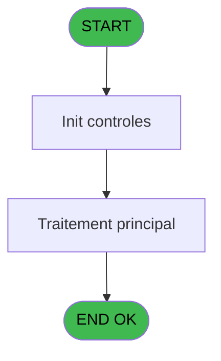

# PBP IDE 55 - Edition nuitées lancement

> **Analyse**: Phases 1-4 2026-02-03 08:59 -> 08:59 (20s) | Assemblage 08:59
> **Pipeline**: V7.2 Enrichi
> **Structure**: 4 onglets (Resume | Ecrans | Donnees | Connexions)

<!-- TAB:Resume -->

## 1. FICHE D'IDENTITE

| Attribut | Valeur |
|----------|--------|
| Projet | PBP |
| IDE Position | 55 |
| Nom Programme | Edition nuitées lancement |
| Fichier source | `Prg_55.xml` |
| Domaine metier | Impression |
| Taches | 1 (1 ecrans visibles) |
| Tables modifiees | 0 |
| Programmes appeles | 1 |
| :warning: Statut | **ORPHELIN_POTENTIEL** |

## 2. DESCRIPTION FONCTIONNELLE

**Edition nuitées lancement** assure la gestion complete de ce processus.

Le flux de traitement s'organise en **1 blocs fonctionnels** :

- **Traitement** (1 tache) : traitements metier divers

## 3. BLOCS FONCTIONNELS

### 3.1 Traitement (1 tache)

Traitements internes.

---

#### 55 - Economat [[ECRAN]](#ecran-t1)

**Role** : Traitement : Economat.
**Ecran** : 642 x 146 DLU (MDI) | [Voir mockup](#ecran-t1)

## 5. REGLES METIER

*(Aucune regle metier identifiee)*

## 6. CONTEXTE

- **Appele par**: (aucun)
- **Appelle**: 1 programmes | **Tables**: 2 (W:0 R:1 L:1) | **Taches**: 1 | **Expressions**: 12

<!-- TAB:Ecrans -->

## 8. ECRANS

### 8.1 Forms visibles (1 / 1)

| # | Position | Tache | Nom | Type | Largeur | Hauteur | Bloc |
|---|----------|-------|-----|------|---------|---------|------|
| 1 | 55 | 55 | Economat | MDI | 642 | 146 | Traitement |

### 8.2 Mockups Ecrans

---

#### 55 - Economat
**Tache** : [55](#t1) | **Type** : MDI | **Dimensions** : 642 x 146 DLU
**Bloc** : Traitement | **Titre IDE** : Economat

<!-- FORM-DATA:
{
    "width":  642,
    "vFactor":  8,
    "type":  "MDI",
    "hFactor":  8,
    "controls":  [
                     {
                         "x":  1,
                         "type":  "label",
                         "var":  "",
                         "y":  0,
                         "w":  631,
                         "fmt":  "",
                         "name":  "",
                         "h":  19,
                         "color":  "1",
                         "text":  "",
                         "parent":  null
                     },
                     {
                         "x":  5,
                         "type":  "label",
                         "var":  "",
                         "y":  122,
                         "w":  631,
                         "fmt":  "",
                         "name":  "",
                         "h":  24,
                         "color":  "1",
                         "text":  "",
                         "parent":  null
                     },
                     {
                         "x":  14,
                         "type":  "label",
                         "var":  "",
                         "y":  24,
                         "w":  415,
                         "fmt":  "",
                         "name":  "",
                         "h":  94,
                         "color":  "195",
                         "text":  "Paramètres",
                         "parent":  null
                     },
                     {
                         "x":  50,
                         "type":  "label",
                         "var":  "",
                         "y":  61,
                         "w":  86,
                         "fmt":  "",
                         "name":  "",
                         "h":  9,
                         "color":  "",
                         "text":  "Date de fin",
                         "parent":  6
                     },
                     {
                         "x":  438,
                         "type":  "label",
                         "var":  "",
                         "y":  24,
                         "w":  192,
                         "fmt":  "",
                         "name":  "",
                         "h":  94,
                         "color":  "",
                         "text":  "",
                         "parent":  null
                     },
                     {
                         "x":  50,
                         "type":  "label",
                         "var":  "",
                         "y":  44,
                         "w":  112,
                         "fmt":  "",
                         "name":  "",
                         "h":  9,
                         "color":  "",
                         "text":  "Date de debut",
                         "parent":  6
                     },
                     {
                         "x":  175,
                         "type":  "edit",
                         "var":  "",
                         "y":  44,
                         "w":  137,
                         "fmt":  "DD/MM/YYYYZ",
                         "name":  "w0_DateDebutCalcul",
                         "h":  10,
                         "color":  "110",
                         "text":  "",
                         "parent":  6
                     },
                     {
                         "x":  175,
                         "type":  "edit",
                         "var":  "",
                         "y":  61,
                         "w":  137,
                         "fmt":  "DD/MM/YYYYZ",
                         "name":  "w0_DateCalcul",
                         "h":  10,
                         "color":  "110",
                         "text":  "",
                         "parent":  6
                     },
                     {
                         "x":  317,
                         "type":  "button",
                         "var":  "",
                         "y":  61,
                         "w":  26,
                         "fmt":  "...",
                         "name":  "b_Date",
                         "h":  9,
                         "color":  "",
                         "text":  "",
                         "parent":  6
                     },
                     {
                         "x":  455,
                         "type":  "button",
                         "var":  "",
                         "y":  96,
                         "w":  154,
                         "fmt":  "\u0026Impression",
                         "name":  "b_Imprimer",
                         "h":  18,
                         "color":  "",
                         "text":  "",
                         "parent":  null
                     },
                     {
                         "x":  13,
                         "type":  "button",
                         "var":  "",
                         "y":  125,
                         "w":  154,
                         "fmt":  "\u0026Quitter",
                         "name":  "b_Quitter",
                         "h":  18,
                         "color":  "",
                         "text":  "",
                         "parent":  5
                     },
                     {
                         "x":  7,
                         "type":  "edit",
                         "var":  "",
                         "y":  1,
                         "w":  267,
                         "fmt":  "20",
                         "name":  "",
                         "h":  8,
                         "color":  "",
                         "text":  "",
                         "parent":  1
                     },
                     {
                         "x":  368,
                         "type":  "edit",
                         "var":  "",
                         "y":  6,
                         "w":  254,
                         "fmt":  "WWW DD MMM YYYYT",
                         "name":  "",
                         "h":  8,
                         "color":  "",
                         "text":  "",
                         "parent":  1
                     },
                     {
                         "x":  7,
                         "type":  "edit",
                         "var":  "",
                         "y":  9,
                         "w":  331,
                         "fmt":  "25",
                         "name":  "VG.NOM VILLAGE",
                         "h":  8,
                         "color":  "",
                         "text":  "",
                         "parent":  1
                     },
                     {
                         "x":  448,
                         "type":  "image",
                         "var":  "",
                         "y":  32,
                         "w":  170,
                         "fmt":  "",
                         "name":  "",
                         "h":  59,
                         "color":  "",
                         "text":  "",
                         "parent":  14
                     },
                     {
                         "x":  317,
                         "type":  "button",
                         "var":  "",
                         "y":  45,
                         "w":  26,
                         "fmt":  "...",
                         "name":  "b_Date_debut",
                         "h":  9,
                         "color":  "",
                         "text":  "",
                         "parent":  6
                     }
                 ],
    "taskId":  "55",
    "height":  146
}
-->

<strong>Champs : 5 champs</strong>

| Pos (x,y) | Nom | Variable | Type |
|-----------|-----|----------|------|
| 175,44 | w0_DateDebutCalcul | - | edit |
| 175,61 | w0_DateCalcul | - | edit |
| 7,1 | 20 | - | edit |
| 368,6 | WWW DD MMM YYYYT | - | edit |
| 7,9 | VG.NOM VILLAGE | - | edit |

<strong>Boutons : 4 boutons</strong>

| Bouton | Pos (x,y) | Action |
|--------|-----------|--------|
| ... | 317,61 | Bouton fonctionnel |
| Impression | 455,96 | Bouton fonctionnel |
| Quitter | 13,125 | Quitte le programme |
| ... | 317,45 | Bouton fonctionnel |

## 9. NAVIGATION

Ecran unique: **Economat**

### 9.3 Structure hierarchique (1 tache)

| Position | Tache | Type | Dimensions | Bloc |
|----------|-------|------|------------|------|
| **55.1** | [**Economat** (55)](#t1) [mockup](#ecran-t1) | MDI | 642x146 | Traitement |

### 9.4 Algorigramme

> **Legende**: Vert = START/END OK | Rouge = END KO | Bleu = Decisions
> *Algorigramme auto-genere. Utiliser `/algorigramme` pour une synthese metier detaillee.*

<!-- TAB:Donnees -->

## 10. TABLES

### Tables utilisees (2)

| ID | Nom | Description | Type | R | W | L | Usages |
|----|-----|-------------|------|---|---|---|--------|
| 69 | initialisation___ini |  | DB | R |   |   | 1 |
| 372 | pv_budget |  | DB |   |   | L | 1 |

### Colonnes par table (1 / 1 tables avec colonnes identifiees)

Table 69 - initialisation___ini (R) - 1 usages

| Lettre | Variable | Acces | Type |
|--------|----------|-------|------|
| A | w0_Titre | R | Alpha |
| B | w0_DateDebutCalcul | R | Date |
| C | w0_DateFinCalcul | R | Date |
| D | b_Date_debut | R | Alpha |
| E | b_Date_Fin | R | Alpha |
| F | b_Imprimer | R | Alpha |
| G | b_Quitter | R | Alpha |

## 11. VARIABLES

### 11.1 Autres (7)

Variables diverses.

| Lettre | Nom | Type | Usage dans |
|--------|-----|------|-----------|
| A | w0_Titre | Alpha | - |
| B | w0_DateDebutCalcul | Date | 1x refs |
| C | w0_DateFinCalcul | Date | - |
| D | b_Date_debut | Alpha | 1x refs |
| E | b_Date_Fin | Alpha | - |
| F | b_Imprimer | Alpha | - |
| G | b_Quitter | Alpha | - |

## 12. EXPRESSIONS

**12 / 12 expressions decodees (100%)**

### 12.1 Repartition par type

| Type | Expressions | Regles |
|------|-------------|--------|
| CONSTANTE | 4 | 0 |
| DATE | 2 | 0 |
| CONDITION | 1 | 0 |
| REFERENCE_VG | 1 | 0 |
| OTHER | 4 | 0 |

### 12.2 Expressions cles par type

#### CONSTANTE (4 expressions)

| Type | IDE | Expression | Regle |
|------|-----|------------|-------|
| CONSTANTE | 5 | `'&Quitter'` | - |
| CONSTANTE | 6 | `'...'` | - |
| CONSTANTE | 1 | `'Edition des Nuitées'` | - |
| CONSTANTE | 4 | `'&Imprimer'` | - |

#### DATE (2 expressions)

| Type | IDE | Expression | Regle |
|------|-----|------------|-------|
| DATE | 7 | `Date()-1` | - |
| DATE | 2 | `Date ()` | - |

#### CONDITION (1 expressions)

| Type | IDE | Expression | Regle |
|------|-----|------------|-------|
| CONDITION | 12 | `w0_DateDebutCalcul [B] > AddDate([W],0,6,0)` | - |

#### REFERENCE_VG (1 expressions)

| Type | IDE | Expression | Regle |
|------|-----|------------|-------|
| REFERENCE_VG | 3 | `VG2` | - |

#### OTHER (4 expressions)

| Type | IDE | Expression | Regle |
|------|-----|------------|-------|
| OTHER | 10 | `SetCrsr(1)` | - |
| OTHER | 11 | `MlsTrans('La période de l''éditiion ne doit pas dépasser 6 mois')` | - |
| OTHER | 8 | `b_Date_debut [D]` | - |
| OTHER | 9 | `SetCrsr(2)` | - |

<!-- TAB:Connexions -->

## 13. GRAPHE D'APPELS

### 13.1 Chaine depuis Main (Callers)

**Chemin**: (pas de callers directs)

### 13.2 Callers

| IDE | Nom Programme | Nb Appels |
|-----|---------------|-----------|
| - | (aucun) | - |

### 13.3 Callees (programmes appeles)

### 13.4 Detail Callees avec contexte

| IDE | Nom Programme | Appels | Contexte |
|-----|---------------|--------|----------|
| [361](PBP-IDE-361.md) | Edition nuitees | 1 | Impression ticket/document |

## 14. RECOMMANDATIONS MIGRATION

### 14.1 Profil du programme

| Metrique | Valeur | Impact migration |
|----------|--------|-----------------|
| Lignes de logique | 40 | Programme compact |
| Expressions | 12 | Peu de logique |
| Tables WRITE | 0 | Impact faible |
| Sous-programmes | 1 | Peu de dependances |
| Ecrans visibles | 1 | Ecran unique ou traitement batch |
| Code desactive | 0% (0 / 40) | Code sain |
| Regles metier | 0 | Pas de regle identifiee |

### 14.2 Plan de migration par bloc

#### Traitement (1 tache: 1 ecran, 0 traitement)

- **Strategie** : 1 composant(s) UI (Razor/React) avec formulaires et validation.
- 1 sous-programme(s) a migrer ou a reutiliser depuis les services existants.
- Decomposer les taches en services unitaires testables.

### 14.3 Dependances critiques

| Dependance | Type | Appels | Impact |
|------------|------|--------|--------|
| [Edition nuitees (IDE 361)](PBP-IDE-361.md) | Sous-programme | 1x | Normale - Impression ticket/document |

---
*Spec DETAILED generee par Pipeline V7.2 - 2026-02-03 09:00*
