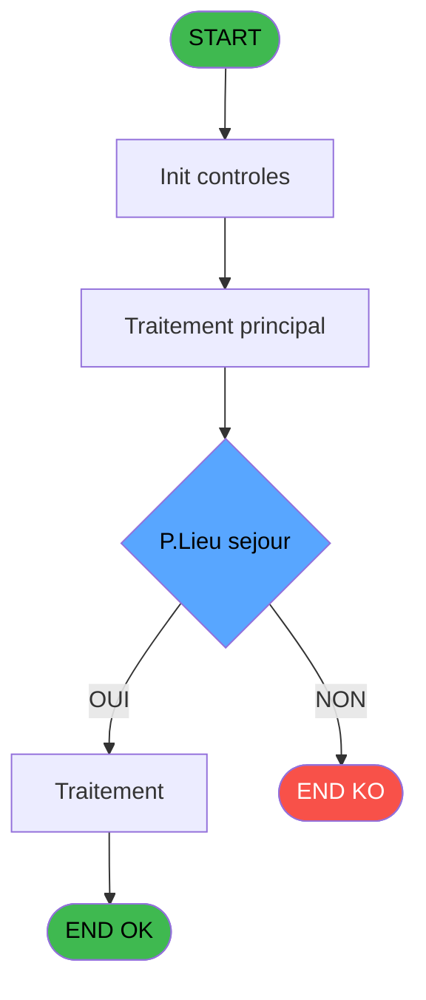
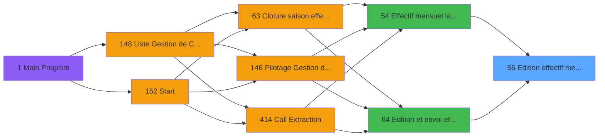
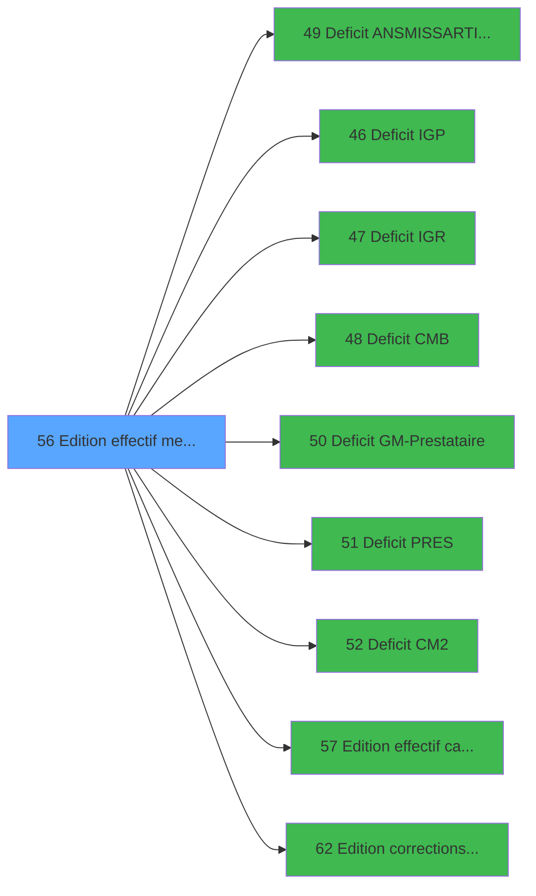

# PBP IDE 56 - Edition effectif mensuel

> **Analyse**: Phases 1-4 2026-02-03 09:00 -> 09:00 (21s) | Assemblage 09:00
> **Pipeline**: V7.2 Enrichi
> **Structure**: 4 onglets (Resume | Ecrans | Donnees | Connexions)

<!-- TAB:Resume -->

## 1. FICHE D'IDENTITE

| Attribut | Valeur |
|----------|--------|
| Projet | PBP |
| IDE Position | 56 |
| Nom Programme | Edition effectif mensuel |
| Fichier source | `Prg_56.xml` |
| Domaine metier | Impression |
| Taches | 13 (0 ecrans visibles) |
| Tables modifiees | 0 |
| Programmes appeles | 9 |

## 2. DESCRIPTION FONCTIONNELLE

**Edition effectif mensuel** assure la gestion complete de ce processus, accessible depuis [Edition et envoi effectif (IDE 64)](PBP-IDE-64.md), [Effectif mensuel lancement (IDE 54)](PBP-IDE-54.md).

Le flux de traitement s'organise en **3 blocs fonctionnels** :

- **Traitement** (10 taches) : traitements metier divers
- **Impression** (2 taches) : generation de tickets et documents
- **Calcul** (1 tache) : calculs de montants, stocks ou compteurs

**Logique metier** : 15 regles identifiees couvrant conditions metier.

Detail : phases du traitement

#### Phase 1 : Impression (2 taches)

- **56** - Edition effectif mensuel
- **56.1** - Edition effectif mensuel **[[ECRAN]](#ecran-t2)**

Delegue a : [Edition effectif calcul dates (IDE 57)](PBP-IDE-57.md), [Edition corrections effectif (IDE 62)](PBP-IDE-62.md)

#### Phase 2 : Calcul (1 tache)

- **56.1.1** - Calcul capacite

#### Phase 3 : Traitement (10 taches)

- **56.1.1.1** - Cumul Plafond Lit **[[ECRAN]](#ecran-t4)**
- **56.1.1.2** - Cumul Lit Table Import
- **56.1.2** - Cumul GM tranférés HP/SP **[[ECRAN]](#ecran-t6)**
- **56.1.3** - Execute SQL command **[[ECRAN]](#ecran-t7)**
- **56.1.4** - Execute SQL command **[[ECRAN]](#ecran-t8)**
- **56.1.5** - Execute SQL command **[[ECRAN]](#ecran-t9)**
- **56.1.6** - Recuperer sejour **[[ECRAN]](#ecran-t10)**
- **56.1.7** - Recuperer sejour **[[ECRAN]](#ecran-t11)**
- **56.2** - Pilotage Gestion de Crise
- **56.3** - Pilotage Gestion de Crise

Delegue a : [Deficit ANS/MISS/ARTI/DOCT (IDE 49)](PBP-IDE-49.md), [Deficit IGP (IDE 46)](PBP-IDE-46.md), [Deficit IGR (IDE 47)](PBP-IDE-47.md), [Deficit CMB (IDE 48)](PBP-IDE-48.md), [Deficit GM-Prestataire (IDE 50)](PBP-IDE-50.md), [Deficit PRES (IDE 51)](PBP-IDE-51.md), [Deficit CM2 (IDE 52)](PBP-IDE-52.md)

## 3. BLOCS FONCTIONNELS

### 3.1 Impression (2 taches)

Generation des documents et tickets.

---

#### 56 - Edition effectif mensuel

**Role** : Generation du document : Edition effectif mensuel.
**Delegue a** : [Edition effectif calcul dates (IDE 57)](PBP-IDE-57.md), [Edition corrections effectif (IDE 62)](PBP-IDE-62.md)

---

#### 56.1 - Edition effectif mensuel [[ECRAN]](#ecran-t2)

**Role** : Generation du document : Edition effectif mensuel.
**Ecran** : 355 x 121 DLU | [Voir mockup](#ecran-t2)
**Delegue a** : [Edition effectif calcul dates (IDE 57)](PBP-IDE-57.md), [Edition corrections effectif (IDE 62)](PBP-IDE-62.md)

### 3.2 Calcul (1 tache)

Calculs metier : montants, stocks, compteurs.

---

#### 56.1.1 - Calcul capacite

**Role** : Calcul : Calcul capacite.
**Variables liees** : HW (V.Capacite M1), HX (V.Capacite M2), HY (V.Capacite M3), HZ (V.Capacite M4), IA (V.Capacite M5)

### 3.3 Traitement (10 taches)

Traitements internes.

---

#### 56.1.1.1 - Cumul Plafond Lit [[ECRAN]](#ecran-t4)

**Role** : Traitement : Cumul Plafond Lit.
**Ecran** : 488 x 0 DLU | [Voir mockup](#ecran-t4)
**Variables liees** : L (V.Cumul sur 1er mois), M (V.Cumul sur dernier mois), KB (v Cumul Gm Arrivés), KC (v Cumul Gm Transportés / Packag), KD (v Cumul GM V/V)
**Delegue a** : [Deficit ANS/MISS/ARTI/DOCT (IDE 49)](PBP-IDE-49.md), [Deficit IGP (IDE 46)](PBP-IDE-46.md), [Deficit IGR (IDE 47)](PBP-IDE-47.md)

---

#### 56.1.1.2 - Cumul Lit Table Import

**Role** : Traitement : Cumul Lit Table Import.
**Variables liees** : L (V.Cumul sur 1er mois), M (V.Cumul sur dernier mois), KB (v Cumul Gm Arrivés), KC (v Cumul Gm Transportés / Packag), KD (v Cumul GM V/V)
**Delegue a** : [Deficit ANS/MISS/ARTI/DOCT (IDE 49)](PBP-IDE-49.md), [Deficit IGP (IDE 46)](PBP-IDE-46.md), [Deficit IGR (IDE 47)](PBP-IDE-47.md)

---

#### 56.1.2 - Cumul GM tranférés HP/SP [[ECRAN]](#ecran-t6)

**Role** : Traitement : Cumul GM tranférés HP/SP.
**Ecran** : 681 x 0 DLU | [Voir mockup](#ecran-t6)
**Variables liees** : L (V.Cumul sur 1er mois), M (V.Cumul sur dernier mois), KB (v Cumul Gm Arrivés), KC (v Cumul Gm Transportés / Packag), KD (v Cumul GM V/V)
**Delegue a** : [Deficit ANS/MISS/ARTI/DOCT (IDE 49)](PBP-IDE-49.md), [Deficit IGP (IDE 46)](PBP-IDE-46.md), [Deficit IGR (IDE 47)](PBP-IDE-47.md)

---

#### 56.1.3 - Execute SQL command [[ECRAN]](#ecran-t7)

**Role** : Traitement : Execute SQL command.
**Ecran** : 120 x 195 DLU | [Voir mockup](#ecran-t7)
**Delegue a** : [Deficit ANS/MISS/ARTI/DOCT (IDE 49)](PBP-IDE-49.md), [Deficit IGP (IDE 46)](PBP-IDE-46.md), [Deficit IGR (IDE 47)](PBP-IDE-47.md)

---

#### 56.1.4 - Execute SQL command [[ECRAN]](#ecran-t8)

**Role** : Traitement : Execute SQL command.
**Ecran** : 120 x 195 DLU | [Voir mockup](#ecran-t8)
**Delegue a** : [Deficit ANS/MISS/ARTI/DOCT (IDE 49)](PBP-IDE-49.md), [Deficit IGP (IDE 46)](PBP-IDE-46.md), [Deficit IGR (IDE 47)](PBP-IDE-47.md)

---

#### 56.1.5 - Execute SQL command [[ECRAN]](#ecran-t9)

**Role** : Traitement : Execute SQL command.
**Ecran** : 120 x 195 DLU | [Voir mockup](#ecran-t9)
**Delegue a** : [Deficit ANS/MISS/ARTI/DOCT (IDE 49)](PBP-IDE-49.md), [Deficit IGP (IDE 46)](PBP-IDE-46.md), [Deficit IGR (IDE 47)](PBP-IDE-47.md)

---

#### 56.1.6 - Recuperer sejour [[ECRAN]](#ecran-t10)

**Role** : Consultation/chargement : Recuperer sejour.
**Ecran** : 681 x 0 DLU | [Voir mockup](#ecran-t10)
**Variables liees** : C (P.Lieu sejour), D (P.Premier lieu sejour), F (P Lieu de Sejour Saisie ?), MZ (v.Detail28-JHD GM Prest.Sejour)
**Delegue a** : [Deficit ANS/MISS/ARTI/DOCT (IDE 49)](PBP-IDE-49.md), [Deficit IGP (IDE 46)](PBP-IDE-46.md), [Deficit IGR (IDE 47)](PBP-IDE-47.md)

---

#### 56.1.7 - Recuperer sejour [[ECRAN]](#ecran-t11)

**Role** : Consultation/chargement : Recuperer sejour.
**Ecran** : 681 x 0 DLU | [Voir mockup](#ecran-t11)
**Variables liees** : C (P.Lieu sejour), D (P.Premier lieu sejour), F (P Lieu de Sejour Saisie ?), MZ (v.Detail28-JHD GM Prest.Sejour)
**Delegue a** : [Deficit ANS/MISS/ARTI/DOCT (IDE 49)](PBP-IDE-49.md), [Deficit IGP (IDE 46)](PBP-IDE-46.md), [Deficit IGR (IDE 47)](PBP-IDE-47.md)

---

#### 56.2 - Pilotage Gestion de Crise

**Role** : Gestion du moyen de paiement : Pilotage Gestion de Crise.
**Variables liees** : A (P.Appel de gestion crise)
**Delegue a** : [Deficit ANS/MISS/ARTI/DOCT (IDE 49)](PBP-IDE-49.md), [Deficit IGP (IDE 46)](PBP-IDE-46.md), [Deficit IGR (IDE 47)](PBP-IDE-47.md)

---

#### 56.3 - Pilotage Gestion de Crise

**Role** : Gestion du moyen de paiement : Pilotage Gestion de Crise.
**Variables liees** : A (P.Appel de gestion crise)
**Delegue a** : [Deficit ANS/MISS/ARTI/DOCT (IDE 49)](PBP-IDE-49.md), [Deficit IGP (IDE 46)](PBP-IDE-46.md), [Deficit IGR (IDE 47)](PBP-IDE-47.md)

## 5. REGLES METIER

15 regles identifiees:

### Autres (15 regles)

#### [RM-001] Traitement si P.Lieu sejour [C] est renseigne

| Element | Detail |
|---------|--------|
| **Condition** | `P.Lieu sejour [C]<>'' AND [AT]<>0` |
| **Si vrai** | [AT] |
| **Si faux** | [AC]) |
| **Variables** | C (P.Lieu sejour) |
| **Expression source** | Expression 47 : `IF(P.Lieu sejour [C]<>'' AND [AT]<>0,[AT],[AC])` |
| **Exemple** | Si P.Lieu sejour [C]<>'' AND [AT]<>0 → [AT]. Sinon → [AC]) |

#### [RM-002] Traitement si P.Lieu sejour [C] est renseigne

| Element | Detail |
|---------|--------|
| **Condition** | `P.Lieu sejour [C]<>'' AND [AU]<>0` |
| **Si vrai** | [AU] |
| **Si faux** | [AD]) |
| **Variables** | C (P.Lieu sejour) |
| **Expression source** | Expression 48 : `IF(P.Lieu sejour [C]<>'' AND [AU]<>0,[AU],[AD])` |
| **Exemple** | Si P.Lieu sejour [C]<>'' AND [AU]<>0 → [AU]. Sinon → [AD]) |

#### [RM-003] Traitement si P.Lieu sejour [C] est renseigne

| Element | Detail |
|---------|--------|
| **Condition** | `P.Lieu sejour [C]<>'' AND [AV]<>0` |
| **Si vrai** | [AV] |
| **Si faux** | [AE]) |
| **Variables** | C (P.Lieu sejour) |
| **Expression source** | Expression 49 : `IF(P.Lieu sejour [C]<>'' AND [AV]<>0,[AV],[AE])` |
| **Exemple** | Si P.Lieu sejour [C]<>'' AND [AV]<>0 → [AV]. Sinon → [AE]) |

#### [RM-004] Traitement si P.Lieu sejour [C] est renseigne

| Element | Detail |
|---------|--------|
| **Condition** | `P.Lieu sejour [C]<>'' AND v.budget_total_jhd_S2 [BD]<>0` |
| **Si vrai** | v.budget_total_jhd_S2 [BD] |
| **Si faux** | [AM]) |
| **Variables** | C (P.Lieu sejour), BD (v.budget_total_jhd_S2) |
| **Expression source** | Expression 50 : `IF(P.Lieu sejour [C]<>'' AND v.budget_total_jhd_S2 [BD]<>0,v` |
| **Exemple** | Si P.Lieu sejour [C]<>'' AND v.budget_total_jhd_S2 [BD]<>0 → v.budget_total_jhd_S2 [BD]. Sinon → [AM]) |

#### [RM-005] Traitement si P.Lieu sejour [C] est renseigne

| Element | Detail |
|---------|--------|
| **Condition** | `P.Lieu sejour [C]<>'' AND V.Existe qualite GM PR... [BE]<>0` |
| **Si vrai** | V.Existe qualite GM PR... [BE] |
| **Si faux** | [AN]) |
| **Variables** | C (P.Lieu sejour) |
| **Expression source** | Expression 51 : `IF(P.Lieu sejour [C]<>'' AND V.Existe qualite GM PR... [BE]<` |
| **Exemple** | Si P.Lieu sejour [C]<>'' AND V.Existe qualite GM PR... [BE]<>0 → V.Existe qualite GM PR... [BE]. Sinon → [AN]) |

#### [RM-006] Traitement si P.Lieu sejour [C] est renseigne

| Element | Detail |
|---------|--------|
| **Condition** | `P.Lieu sejour [C]<>'' AND V Existe Correctif [BF]<>0` |
| **Si vrai** | V Existe Correctif [BF] |
| **Si faux** | [AO]) |
| **Variables** | C (P.Lieu sejour), BF (V Existe Correctif) |
| **Expression source** | Expression 52 : `IF(P.Lieu sejour [C]<>'' AND V Existe Correctif [BF]<>0,V Ex` |
| **Exemple** | Si P.Lieu sejour [C]<>'' AND V Existe Correctif [BF]<>0 → V Existe Correctif [BF]. Sinon → [AO]) |

#### [RM-007] Traitement si P.Lieu sejour [C] est renseigne

| Element | Detail |
|---------|--------|
| **Condition** | `P.Lieu sejour [C]<>'' AND [AW]<>0` |
| **Si vrai** | [AW] |
| **Si faux** | [AF]) |
| **Variables** | C (P.Lieu sejour) |
| **Expression source** | Expression 54 : `IF(P.Lieu sejour [C]<>'' AND [AW]<>0,[AW],[AF])` |
| **Exemple** | Si P.Lieu sejour [C]<>'' AND [AW]<>0 → [AW]. Sinon → [AF]) |

#### [RM-008] Traitement si P.Lieu sejour [C] est renseigne

| Element | Detail |
|---------|--------|
| **Condition** | `P.Lieu sejour [C]<>'' AND [AX]<>0` |
| **Si vrai** | [AX] |
| **Si faux** | [AG]) |
| **Variables** | C (P.Lieu sejour) |
| **Expression source** | Expression 55 : `IF(P.Lieu sejour [C]<>'' AND [AX]<>0,[AX],[AG])` |
| **Exemple** | Si P.Lieu sejour [C]<>'' AND [AX]<>0 → [AX]. Sinon → [AG]) |

#### [RM-009] Traitement si P.Lieu sejour [C] est renseigne

| Element | Detail |
|---------|--------|
| **Condition** | `P.Lieu sejour [C]<>'' AND [AY]<>0` |
| **Si vrai** | [AY] |
| **Si faux** | [AH]) |
| **Variables** | C (P.Lieu sejour) |
| **Expression source** | Expression 56 : `IF(P.Lieu sejour [C]<>'' AND [AY]<>0,[AY],[AH])` |
| **Exemple** | Si P.Lieu sejour [C]<>'' AND [AY]<>0 → [AY]. Sinon → [AH]) |

#### [RM-010] Traitement si P.Lieu sejour [C] est renseigne

| Element | Detail |
|---------|--------|
| **Condition** | `P.Lieu sejour [C]<>'' AND [AZ]<>0` |
| **Si vrai** | [AZ] |
| **Si faux** | [AI]) |
| **Variables** | C (P.Lieu sejour) |
| **Expression source** | Expression 57 : `IF(P.Lieu sejour [C]<>'' AND [AZ]<>0,[AZ],[AI])` |
| **Exemple** | Si P.Lieu sejour [C]<>'' AND [AZ]<>0 → [AZ]. Sinon → [AI]) |

#### [RM-011] Traitement si P.Lieu sejour [C] est renseigne

| Element | Detail |
|---------|--------|
| **Condition** | `P.Lieu sejour [C]<>'' AND v.budget_total_jhp_S2 [BB]<>0` |
| **Si vrai** | v.budget_total_jhp_S2 [BB] |
| **Si faux** | [AK]) |
| **Variables** | C (P.Lieu sejour), BB (v.budget_total_jhp_S2) |
| **Expression source** | Expression 58 : `IF(P.Lieu sejour [C]<>'' AND v.budget_total_jhp_S2 [BB]<>0,v` |
| **Exemple** | Si P.Lieu sejour [C]<>'' AND v.budget_total_jhp_S2 [BB]<>0 → v.budget_total_jhp_S2 [BB]. Sinon → [AK]) |

#### [RM-012] Traitement si P.Lieu sejour [C] est renseigne

| Element | Detail |
|---------|--------|
| **Condition** | `P.Lieu sejour [C]<>'' AND v.budget_total_jh_vrl_S2 [BC]<>0` |
| **Si vrai** | v.budget_total_jh_vrl_S2 [BC] |
| **Si faux** | [AL]) |
| **Variables** | C (P.Lieu sejour), BC (v.budget_total_jh_vrl_S2) |
| **Expression source** | Expression 59 : `IF(P.Lieu sejour [C]<>'' AND v.budget_total_jh_vrl_S2 [BC]<>` |
| **Exemple** | Si P.Lieu sejour [C]<>'' AND v.budget_total_jh_vrl_S2 [BC]<>0 → v.budget_total_jh_vrl_S2 [BC]. Sinon → [AL]) |

#### [RM-013] Si P.Reporter? [H] alors [AA]-14 sinon V.Date debut [I])

| Element | Detail |
|---------|--------|
| **Condition** | `P.Reporter? [H]` |
| **Si vrai** | [AA]-14 |
| **Si faux** | V.Date debut [I]) |
| **Variables** | H (P.Reporter?), I (V.Date debut) |
| **Expression source** | Expression 62 : `IF(P.Reporter? [H],[AA]-14,V.Date debut [I])` |
| **Exemple** | Si P.Reporter? [H] → [AA]-14. Sinon → V.Date debut [I]) |

#### [RM-014] Si Range(Month(P.Date de fin [B]) alors 1 sinon 6),v Budget GM Arrivés [BG],v Budget GM V/V Trans.... [BJ])

| Element | Detail |
|---------|--------|
| **Condition** | `Range(Month(P.Date de fin [B])` |
| **Si vrai** | 1 |
| **Si faux** | 6),v Budget GM Arrivés [BG],v Budget GM V/V Trans.... [BJ]) |
| **Variables** | B (P.Date de fin), BG (v Budget GM Arrivés) |
| **Expression source** | Expression 65 : `IF(Range(Month(P.Date de fin [B]),1,6),v Budget GM Arrivés [` |
| **Exemple** | Si Range(Month(P.Date de fin [B]) → 1. Sinon → 6),v Budget GM Arrivés [BG],v Budget GM V/V Trans.... [BJ]) |

#### [RM-015] Si P.TypeCalendrier [G] vaut 'C' alors 'comptable', sinon 'operationnel'

| Element | Detail |
|---------|--------|
| **Condition** | `P.TypeCalendrier [G]='C'` |
| **Si vrai** | 'comptable' |
| **Si faux** | 'operationnel') |
| **Variables** | G (P.TypeCalendrier) |
| **Expression source** | Expression 73 : `IF(P.TypeCalendrier [G]='C','comptable','operationnel')` |
| **Exemple** | Si P.TypeCalendrier [G]='C' → 'comptable'. Sinon → 'operationnel') |

## 6. CONTEXTE

- **Appele par**: [Edition et envoi effectif (IDE 64)](PBP-IDE-64.md), [Effectif mensuel lancement (IDE 54)](PBP-IDE-54.md)
- **Appelle**: 9 programmes | **Tables**: 11 (W:0 R:4 L:8) | **Taches**: 13 | **Expressions**: 78

<!-- TAB:Ecrans -->

## 8. ECRANS

*(Programme sans ecran visible)*

## 9. NAVIGATION

### 9.3 Structure hierarchique (13 taches)

| Position | Tache | Type | Dimensions | Bloc |
|----------|-------|------|------------|------|
| **56.1** | [**Edition effectif mensuel** (56)](#t1) | - | - | Impression |
| 56.1.1 | [Edition effectif mensuel (56.1)](#t2) [mockup](#ecran-t2) | - | 355x121 | |
| **56.2** | [**Calcul capacite** (56.1.1)](#t3) | - | - | Calcul |
| **56.3** | [**Cumul Plafond Lit** (56.1.1.1)](#t4) [mockup](#ecran-t4) | - | 488x0 | Traitement |
| 56.3.1 | [Cumul Lit Table Import (56.1.1.2)](#t5) | - | - | |
| 56.3.2 | [Cumul GM tranférés HP/SP (56.1.2)](#t6) [mockup](#ecran-t6) | - | 681x0 | |
| 56.3.3 | [Execute SQL command (56.1.3)](#t7) [mockup](#ecran-t7) | - | 120x195 | |
| 56.3.4 | [Execute SQL command (56.1.4)](#t8) [mockup](#ecran-t8) | - | 120x195 | |
| 56.3.5 | [Execute SQL command (56.1.5)](#t9) [mockup](#ecran-t9) | - | 120x195 | |
| 56.3.6 | [Recuperer sejour (56.1.6)](#t10) [mockup](#ecran-t10) | - | 681x0 | |
| 56.3.7 | [Recuperer sejour (56.1.7)](#t11) [mockup](#ecran-t11) | - | 681x0 | |
| 56.3.8 | [Pilotage Gestion de Crise (56.2)](#t12) | MDI | - | |
| 56.3.9 | [Pilotage Gestion de Crise (56.3)](#t13) | MDI | - | |

### 9.4 Algorigramme

> **Legende**: Vert = START/END OK | Rouge = END KO | Bleu = Decisions
> *Algorigramme auto-genere. Utiliser `/algorigramme` pour une synthese metier detaillee.*

<!-- TAB:Donnees -->

## 10. TABLES

### Tables utilisees (11)

| ID | Nom | Description | Type | R | W | L | Usages |
|----|-----|-------------|------|---|---|---|--------|
| 69 | initialisation___ini |  | DB | R |   |   | 1 |
| 77 | articles_________art | Articles et stock | DB | R |   |   | 2 |
| 81 | societe__________soc |  | DB |   |   | L | 1 |
| 118 | tables_imports |  | DB | R |   | L | 5 |
| 120 | tables_qualites__qua |  | DB |   |   | L | 1 |
| 372 | pv_budget |  | DB |   |   | L | 1 |
| 473 | comptage_caisse | Sessions de caisse | TMP | R |   |   | 1 |
| 802 | type_prestation | Prestations/services vendus | DB |   |   | L | 2 |
| 824 | fac_pied_tva_pro |  | DB |   |   | L | 1 |
| 834 | tpe_par_terminal |  | DB |   |   | L | 1 |
| 851 | correspittivi |  | DB |   |   | L | 2 |

### Colonnes par table (6 / 4 tables avec colonnes identifiees)

Table 69 - initialisation___ini (R) - 1 usages

| Lettre | Variable | Acces | Type |
|--------|----------|-------|------|
| A | P.Appel de gestion crise | R | Logical |
| B | P.Date de fin | R | Date |
| C | P.Lieu sejour | R | Alpha |
| D | P.Premier lieu sejour | R | Alpha |
| E | P.Nom lieu | R | Alpha |
| F | P Lieu de Sejour Saisie ? | R | Logical |
| G | P.TypeCalendrier | R | Unicode |
| H | P.Reporter? | R | Logical |
| I | V.Date debut | R | Date |
| J | V.Date fin | R | Date |
| K | V.Code village | R | Alpha |
| L | V.Cumul sur 1er mois | R | Logical |
| M | V.Cumul sur dernier mois | R | Logical |
| N | V.Date debut ete | R | Date |
| O | V.Date fin ete | R | Date |
| P | V.Date debut hiver | R | Date |
| Q | V.Date fin hiver | R | Date |
| R | V.Saison | R | Alpha |
| S | V.Date-14 | R | Logical |
| T | v.DateReporte | R | Date |
| U | NbrJoursSaison1 | R | Numeric |
| V | NbrJoursSemestre1 | R | Numeric |
| W | NbrJoursSaison2 | R | Numeric |
| X | NbrJoursSemestre2 | R | Numeric |
| Y | v.budget_total_jhp_S1 | R | Numeric |
| Z | v.budget_total_jh_vrl_S1 | R | Numeric |
| BA | v.budget_total_jhd_S1 | R | Numeric |
| BB | v.budget_total_jhp_S2 | R | Numeric |
| BC | v.budget_total_jh_vrl_S2 | R | Numeric |
| BD | v.budget_total_jhd_S2 | R | Numeric |
| BE | V.Existe qualite GM PRES ? | R | Logical |
| BF | V Existe Correctif | R | Logical |
| BG | v Budget GM Arrivés | R | Numeric |
| BH | v Budget GM Transportés Package | R | Numeric |
| BI | v Buget GM V/V | R | Numeric |
| BJ | v Budget GM V/V Trans. A HP | R | Numeric |
| BK | v Budget GM V/V Trans. R HP | R | Numeric |
| BL | v Budget GM V/V Trans. A SP | R | Numeric |
| BM | v Budget GM V/V Trans. R SP | R | Numeric |
| BN | v Budget GM V/V Trans. A+R | R | Numeric |
| BO | LibelleTypeCalendrier | R | Alpha |
| BP | V.DateDebutSemestre | R | Date |
| BQ | V.DateFinSemestre | R | Date |

Table 77 - articles_________art (R) - 2 usages

| Lettre | Variable | Acces | Type |
|--------|----------|-------|------|
| A | P. JH Sejour en Mois n | R | Numeric |
| B | P. JH Sejour en Mois n+1 | R | Numeric |
| C | P. Mois | R | Numeric |
| D | P.Date debut | R | Date |
| E | P.Date fin | R | Date |
| F | L.AnnéeMois | R | Alpha |
| G | L. Séjour 1 Mois n | R | Numeric |
| H | L. Séjour 2 Mois n | R | Numeric |
| I | L. Séjour 3 Mois n+1 | R | Numeric |
| J | L. Séjour Total n | R | Numeric |
| K | L. Séjour Total n+1 | R | Numeric |
| L | v. Vente NA | R | Numeric |

Table 118 - tables_imports (R/L) - 5 usages

| Lettre | Variable | Acces | Type |
|--------|----------|-------|------|
| A | V.Avc JHP | R | Numeric |
| B | V.Avc JHD | R | Numeric |
| C | V.Cumul JHP | R | Numeric |
| D | V.Cumul JH economat | R | Numeric |
| E | GM ORDI M1 | R | Numeric |
| F | GM ORDI M2 | R | Numeric |
| G | GM ORDI M3 | R | Numeric |
| H | GM ORDI M4 | R | Numeric |
| I | GM ORDI M5 | R | Numeric |
| J | GM ORDI M6 | R | Numeric |
| K | GM PROP M1 | R | Numeric |
| L | GM PROP M2 | R | Numeric |
| M | GM PROP M3 | R | Numeric |
| N | GM PROP M4 | R | Numeric |
| O | GM PROP M5 | R | Numeric |
| P | GM PROP M6 | R | Numeric |
| Q | GM CLUB M1 | R | Numeric |
| R | GM CLUB M2 | R | Numeric |
| S | GM CLUB M3 | R | Numeric |
| T | GM CLUB M4 | R | Numeric |
| U | GM CLUB M5 | R | Numeric |
| V | GM CLUB M6 | R | Numeric |
| W | GM SEM M1 | R | Numeric |
| X | GM SEM M2 | R | Numeric |
| Y | GM SEM M3 | R | Numeric |
| Z | GM SEM M4 | R | Numeric |
| BA | GM SEM M5 | R | Numeric |
| BB | GM SEM M6 | R | Numeric |
| BC | GM VSL M1 | R | Numeric |
| BD | GM VSL M2 | R | Numeric |
| BE | GM VSL M3 | R | Numeric |
| BF | GM VSL M4 | R | Numeric |
| BG | GM VSL M5 | R | Numeric |
| BH | GM VSL M6 | R | Numeric |
| BI | GM VRL SP M1 | R | Numeric |
| BJ | GM VRL SP M2 | R | Numeric |
| BK | GM VRL SP M3 | R | Numeric |
| BL | GM VRL SP M4 | R | Numeric |
| BM | GM VRL SP M5 | R | Numeric |
| BN | GM VRL SP M6 | R | Numeric |
| BO | GM VRL HP M1 | R | Numeric |
| BP | GM VRL HP M2 | R | Numeric |
| BQ | GM VRL HP M3 | R | Numeric |
| BR | GM VRL HP M4 | R | Numeric |
| BS | GM VRL HP M5 | R | Numeric |
| BT | GM VRL HP M6 | R | Numeric |
| BU | JHD GE M1 | R | Numeric |
| BV | JHD GE M2 | R | Numeric |
| BW | JHD GE M3 | R | Numeric |
| BX | JHD GE M4 | R | Numeric |
| BY | JHD GE M5 | R | Numeric |
| BZ | JHD GE M6 | R | Numeric |
| CA | JHD GO M1 | R | Numeric |
| CB | JHD GO M2 | R | Numeric |
| CC | JHD GO M3 | R | Numeric |
| CD | JHD GO M4 | R | Numeric |
| CE | JHD GO M5 | R | Numeric |
| CF | JHD GO M6 | R | Numeric |
| CG | JHD GM AV DEJ M1 | R | Numeric |
| CH | JHD GM AV DEJ M2 | R | Numeric |
| CI | JHD GM AV DEJ M3 | R | Numeric |
| CJ | JHD GM AV DEJ M4 | R | Numeric |
| CK | JHD GM AV DEJ M5 | R | Numeric |
| CL | JHD GM AV DEJ M6 | R | Numeric |
| CM | JHD IGR ech M1 | R | Numeric |
| CN | JHD IGR ech M2 | R | Numeric |
| CO | JHD IGR ech M3 | R | Numeric |
| CP | JHD IGR ech M4 | R | Numeric |
| CQ | JHD IGR ech M5 | R | Numeric |
| CR | JHD IGR ech M6 | R | Numeric |
| CS | JHD EXC M1 | R | Numeric |
| CT | JHD EXC M2 | R | Numeric |
| CU | JHD EXC M3 | R | Numeric |
| CV | JHD EXC M4 | R | Numeric |
| CW | JHD EXC M5 | R | Numeric |
| CX | JHD EXC M6 | R | Numeric |
| CY | JHD IGR M1 | R | Numeric |
| CZ | JHD IGR M2 | R | Numeric |
| DA | JHD IGR M3 | R | Numeric |
| DB | JHD IGR M4 | R | Numeric |
| DC | JHD IGR M5 | R | Numeric |
| DD | JHD IGR M6 | R | Numeric |
| DE | JHD IGP M1 | R | Numeric |
| DF | JHD IGP M2 | R | Numeric |
| DG | JHD IGP M3 | R | Numeric |
| DH | JHD IGP M4 | R | Numeric |
| DI | JHD IGP M5 | R | Numeric |
| DJ | JHD IGP M6 | R | Numeric |
| DK | JHD BUR M1 | R | Numeric |
| DL | JHD BUR M2 | R | Numeric |
| DM | JHD BUR M3 | R | Numeric |
| DN | JHD BUR M4 | R | Numeric |
| DO | JHD BUR M5 | R | Numeric |
| DP | JHD BUR M6 | R | Numeric |
| DQ | JHD FOUR M1 | R | Numeric |
| DR | JHD FOUR M2 | R | Numeric |
| DS | JHD FOUR M3 | R | Numeric |
| DT | JHD FOUR M4 | R | Numeric |
| DU | JHD FOUR M5 | R | Numeric |
| DV | JHD FOUR M6 | R | Numeric |
| DW | JHD FOUR CM2 M1 | R | Numeric |
| DX | JHD FOUR CM2 M2 | R | Numeric |
| DY | JHD FOUR CM2 M3 | R | Numeric |
| DZ | JHD FOUR CM2 M4 | R | Numeric |
| EA | JHD FOUR CM2 M5 | R | Numeric |
| EB | JHD FOUR CM2 M6 | R | Numeric |
| EC | JHD GO MISS M1 | R | Numeric |
| ED | JHD GO MISS M2 | R | Numeric |
| EE | JHD GO MISS M3 | R | Numeric |
| EF | JHD GO MISS M4 | R | Numeric |
| EG | JHD GO MISS M5 | R | Numeric |
| EH | JHD GO MISS M6 | R | Numeric |
| EI | JHD GO ART M1 | R | Numeric |
| EJ | JHD GO ART M2 | R | Numeric |
| EK | JHD GO ART M3 | R | Numeric |
| EL | JHD GO ART M4 | R | Numeric |
| EM | JHD GO ART M5 | R | Numeric |
| EN | JHD GO ART M6 | R | Numeric |
| EO | JHD GO EDUC M1 | R | Numeric |
| EP | JHD GO EDUC M2 | R | Numeric |
| EQ | JHD GO EDUC M3 | R | Numeric |
| ER | JHD GO EDUC M4 | R | Numeric |
| ES | JHD GO EDUC M5 | R | Numeric |
| ET | JHD GO EDUC M6 | R | Numeric |
| EU | JHD GO MED M1 | R | Numeric |
| EV | JHD GO MED M2 | R | Numeric |
| EW | JHD GO MED M3 | R | Numeric |
| EX | JHD GO MED M4 | R | Numeric |
| EY | JHD GO MED M5 | R | Numeric |
| EZ | JHD GO MED M6 | R | Numeric |
| FA | JHD GO STA M1 | R | Numeric |
| FB | JHD GO STA M2 | R | Numeric |
| FC | JHD GO STA M3 | R | Numeric |
| FD | JHD GO STA M4 | R | Numeric |
| FE | JHD GO STA M5 | R | Numeric |
| FF | JHD GO STA M6 | R | Numeric |
| FG | JHD GO ANS M1 | R | Numeric |
| FH | JHD GO ANS M2 | R | Numeric |
| FI | JHD GO ANS M3 | R | Numeric |
| FJ | JHD GO ANS M4 | R | Numeric |
| FK | JHD GO ANS M5 | R | Numeric |
| FL | JHD GO ANS M6 | R | Numeric |
| FM | JHD GO PRES SEJ M1 | R | Numeric |
| FN | JHD GO PRES SEJ M2 | R | Numeric |
| FO | JHD GO PRES SEJ M3 | R | Numeric |
| FP | JHD GO PRES SEJ M4 | R | Numeric |
| FQ | JHD GO PRES SEJ M5 | R | Numeric |
| FR | JHD GO PRES SEJ M6 | R | Numeric |
| FS | JHD GO PRES REP M1 | R | Numeric |
| FT | JHD GO PRES REP M2 | R | Numeric |
| FU | JHD GO PRES REP M3 | R | Numeric |
| FV | JHD GO PRES REP M4 | R | Numeric |
| FW | JHD GO PRES REP M5 | R | Numeric |
| FX | JHD GO PRES REP M6 | R | Numeric |
| FY | Total JH hors place M1 | R | Numeric |
| FZ | Total JH hors place M2 | R | Numeric |
| GA | Total JH hors place M3 | R | Numeric |
| GB | Total JH hors place M4 | R | Numeric |
| GC | Total JH hors place M5 | R | Numeric |
| GD | Total JH hors place M6 | R | Numeric |
| GE | Total JHP M1 | R | Numeric |
| GF | Total JHP M2 | R | Numeric |
| GG | Total JHP M3 | R | Numeric |
| GH | Total JHP M4 | R | Numeric |
| GI | Total JHP M5 | R | Numeric |
| GJ | Total JHP M6 | R | Numeric |
| GK | Total JH VRL M1 | R | Numeric |
| GL | Total JH VRL M2 | R | Numeric |
| GM | Total JH VRL M3 | R | Numeric |
| GN | Total JH VRL M4 | R | Numeric |
| GO | Total JH VRL M5 | R | Numeric |
| GP | Total JH VRL M6 | R | Numeric |
| GQ | Total JH DEF M1 | R | Numeric |
| GR | Total JH DEF M2 | R | Numeric |
| GS | Total JH DEF M3 | R | Numeric |
| GT | Total JH DEF M4 | R | Numeric |
| GU | Total JH DEF M5 | R | Numeric |
| GV | Total JH DEF M6 | R | Numeric |
| GW | Total JH eco M1 | R | Numeric |
| GX | Total JH eco M2 | R | Numeric |
| GY | Total JH eco M3 | R | Numeric |
| GZ | Total JH eco M4 | R | Numeric |
| HA | Total JH eco M5 | R | Numeric |
| HB | Total JH eco M6 | R | Numeric |
| HC | V.AnneeMois | R | Alpha |
| HD | V.Num mois | R | Numeric |
| HE | V.Nom M1 | R | Alpha |
| HF | V.Nom M2 | R | Alpha |
| HG | V.Nom M3 | R | Alpha |
| HH | V.Nom M4 | R | Alpha |
| HI | V.Nom M5 | R | Alpha |
| HJ | V.Nom M6 | R | Alpha |
| HK | V.Nb jours d'exploitation budge | R | Numeric |
| HL | V.Nb jour M1 | R | Numeric |
| HM | V.Nb jour M2 | R | Numeric |
| HN | V.Nb jour M3 | R | Numeric |
| HO | V.Nb jour M4 | R | Numeric |
| HP | V.Nb jour M5 | R | Numeric |
| HQ | V.Nb jour M6 | R | Numeric |
| HR | V.Nb passe | R | Numeric |
| HS | V.Chaine mois | R | Alpha |
| HT | V.A cheval sur 2 saison | R | Logical |
| HU | V.Dernier mois ete | R | Numeric |
| HV | V.Dernier mois hiver | R | Numeric |
| HW | V.Capacite M1 | R | Numeric |
| HX | V.Capacite M2 | R | Numeric |
| HY | V.Capacite M3 | R | Numeric |
| HZ | V.Capacite M4 | R | Numeric |
| IA | V.Capacite M5 | R | Numeric |
| IB | V.Capacite M6 | R | Numeric |
| IC | V.Capacite Totale | R | Numeric |
| ID | V.Capacite budget | R | Numeric |
| IE | V lien Nb/Lit Lieu | R | Logical |
| IF | v GM Arrivés M1 | R | Numeric |
| IG | v GMTranspPackage M1 | R | Numeric |
| IH | v GM VV M1 | R | Numeric |
| II | v GM V/V Trans A HP M1 | R | Numeric |
| IJ | v GM V/V Trans R HP M1 | R | Numeric |
| IK | v GM V/V Trans A SP M1 | R | Numeric |
| IL | v GM V/V Trans R SP M1 | R | Numeric |
| IM | v GM V/V Trans T  A+R M1 | R | Numeric |
| IN | v GM Arrivés M2 | R | Numeric |
| IO | v GMTranspPackage M2 | R | Numeric |
| IP | v GM VV M2 | R | Numeric |
| IQ | v GM V/V Trans A HP M2 | R | Numeric |
| IR | v GM V/V Trans R HP M2 | R | Numeric |
| IS | v GM V/V Trans A SP M2 | R | Numeric |
| IT | v GM V/V Trans R SP M2 | R | Numeric |
| IU | v GM V/V Trans T  A+R M2 | R | Numeric |
| IV | v GM Arrivés M3 | R | Numeric |
| IW | v GMTranspPackage M3 | R | Numeric |
| IX | v GM VV M3 | R | Numeric |
| IY | v GM V/V Trans A HP M3 | R | Numeric |
| IZ | v GM V/V Trans R HP M3 | R | Numeric |
| JA | v GM V/V Trans A SP M3 | R | Numeric |
| JB | v GM V/V Trans R SP M3 | R | Numeric |
| JC | v GM V/V Trans T  A+R M3 | R | Numeric |
| JD | v GM Arrivés M4 | R | Numeric |
| JE | v GMTranspPackage M4 | R | Numeric |
| JF | v GM VV M4 | R | Numeric |
| JG | v GM V/V Trans A HP M4 | R | Numeric |
| JH | v GM V/V Trans R HP M4 | R | Numeric |
| JI | v GM V/V Trans A SP M4 | R | Numeric |
| JJ | v GM V/V Trans R SP M4 | R | Numeric |
| JK | v GM V/V Trans T  A+R M4 | R | Numeric |
| JL | v GM Arrivés M5 | R | Numeric |
| JM | v GMTranspPackage M5 | R | Numeric |
| JN | v GM VV M5 | R | Numeric |
| JO | v GM V/V Trans A HP M5 | R | Numeric |
| JP | v GM V/V Trans R HP M5 | R | Numeric |
| JQ | v GM V/V Trans A SP M5 | R | Numeric |
| JR | v GM V/V Trans R SP M5 | R | Numeric |
| JS | v GM V/V Trans T  A+R M5 | R | Numeric |
| JT | v GM Arrivés M6 | R | Numeric |
| JU | v GMTranspPackage M6 | R | Numeric |
| JV | v GM VV M6 | R | Numeric |
| JW | v GM V/V Trans A HP M6 | R | Numeric |
| JX | v GM V/V Trans R HP M6 | R | Numeric |
| JY | v GM V/V Trans A SP M6 | R | Numeric |
| JZ | v GM V/V Trans R SP M6 | R | Numeric |
| KA | v GM V/V Trans T  A+R M6 | R | Numeric |
| KB | v Cumul Gm Arrivés | R | Numeric |
| KC | v Cumul Gm Transportés / Packag | R | Numeric |
| KD | v Cumul GM V/V | R | Numeric |
| KE | v Cumul GM V/V A HP | R | Numeric |
| KF | v Cumul GM V/V R HP | R | Numeric |
| KG | v Cumul GM V/V A SP | R | Numeric |
| KH | v Cumul GM V/V R SP | R | Numeric |
| KI | v Cumul GM V/V A+R Total | R | Numeric |
| KJ | v Reel/Budget Gm Arrivés | R | Numeric |
| KK | v Reel/Budget Gm Trans/Package | R | Numeric |
| KL | v Reel/Budget Gm V/V | R | Numeric |
| KM | v Reel/Budget Gm Trans A HP | R | Numeric |
| KN | v Reel/Budget Gm Trans R HP | R | Numeric |
| KO | v Reel/Budget Gm Trans A SP | R | Numeric |
| KP | v Reel/Budget Gm Trans R SP | R | Numeric |
| KQ | v Reel/Budget Gm Tran A+R | R | Numeric |
| KR | JH sur Place VSL GM M1 | R | Numeric |
| KS | JH sur Place VSL GM M2 | R | Numeric |
| KT | JH sur Place VSL GM M3 | R | Numeric |
| KU | JH sur Place VSL GM M4 | R | Numeric |
| KV | JH sur Place VSL GM M5 | R | Numeric |
| KW | JH sur Place VSL GM M6 | R | Numeric |
| KX | JH sur Place VSL FAM GO M1 | R | Numeric |
| KY | JH sur Place VSL FAM GO M2 | R | Numeric |
| KZ | JH sur Place VSL FAM GO M3 | R | Numeric |
| LA | JH sur Place VSL FAM GO M4 | R | Numeric |
| LB | JH sur Place VSL FAM GO M5 | R | Numeric |
| LC | JH sur Place VSL FAM GO M6 | R | Numeric |
| LD | JH SP VSL FAM GO M0->M1 | R | Numeric |
| LE | JH SP VSL FAM GO M1->M2 | R | Numeric |
| LF | JH SP VSL FAM GO M2->M3 | R | Numeric |
| LG | JH SP VSL FAM GO M3->M4 | R | Numeric |
| LH | JH SP VSL FAM GO M4->M5 | R | Numeric |
| LI | JH SP VSL FAM GO M5->M6 | R | Numeric |
| LJ | JH SP VSL FAM GO M1 calcule | R | Numeric |
| LK | JH SP VSL FAM GO M2 calcule | R | Numeric |
| LL | JH SP VSL FAM GO M3 calcule | R | Numeric |
| LM | JH SP VSL FAM GO M4 calcule | R | Numeric |
| LN | JH SP VSL FAM GO M5 calcule | R | Numeric |
| LO | JH SP VSL FAM GO M6 calcule | R | Numeric |
| LP | Total JH sur place VSL GM | R | Numeric |
| LQ | Total JH sur place VSL FAMGO | R | Numeric |
| LR | V.Num M1 | R | Numeric |
| LS | V.Num M2 | R | Numeric |
| LT | V.Num M3 | R | Numeric |
| LU | V.Num M4 | R | Numeric |
| LV | V.Num M5 | R | Numeric |
| LW | V.Num M6 | R | Numeric |
| LX | v.Entete | R | Alpha |
| LY | v.Detail1-GM ORDI | R | Alpha |
| LZ | v.Detail2-GM PROP | R | Alpha |
| MA | v.Detail3-GM SEM | R | Alpha |
| MB | v.Detail4-GM CLUB | R | Alpha |
| MC | v.Detail5-Total JH hors place | R | Alpha |
| MD | v.Detail6-JH sur place VSL GM | R | Alpha |
| ME | v.Detail7-JH sur placVSL FAM GO | R | Alpha |
| MF | v.Detail8-JH sur place VSL | R | Alpha |
| MG | v.Detail9-Total JH Payantes(HDS | R | Alpha |
| MH | v.Detail10-VRL encaissé. Sur pl | R | Alpha |
| MI | v.Detail11-VRL encaissé. hor pl | R | Alpha |
| MJ | v.Detail12-Total JH VRL | R | Alpha |
| MK | v.Detail13JHD GE (+ tickets GE) | R | Alpha |
| ML | v.Detail14-JHD GO | R | Alpha |
| MM | v.Detail15-JHD GM parti avt dej | R | Alpha |
| MN | v.Detail16-JHD GM / IGR Echange | R | Alpha |
| MO | v.Detail17-JHD - Excursions | R | Alpha |
| MP | v.Detail18-JHD IGR | R | Alpha |
| MQ | v.Detail19-JHD IGP | R | Alpha |
| MR | v.Detail20-JHD IGP Hors CDV | R | Alpha |
| MS | v.Detail21-JHD Fournisseurs/Sur | R | Alpha |
| MT | v.Detail22-JHD Guides/GO Miss/G | R | Alpha |
| MU | v.Detail23-JHD GO Artiste | R | Alpha |
| MV | v.Detail24-JHD GO Eductour | R | Alpha |
| MW | v.Detail25-JHD GO Médecin | R | Alpha |
| MX | v.Detail26-JHD GO Stagiaire | R | Alpha |
| MY | v.Detail27-JHD Accomp non salar | R | Alpha |
| MZ | v.Detail28-JHD GM Prest.Sejour | R | Alpha |
| NA | v.Detail29-JHD GM Prest Repas | R | Alpha |
| NB | v.Detail30-Total JH Déficit | R | Alpha |
| NC | v.Detail31-Totaux JH Economat | R | Alpha |
| ND | v.Det32-Nbre GM Arri.(HP/HR/HC) | R | Alpha |
| NE | v.Det33-Nbre GM trans/package | R | Alpha |
| NF | v.Det34-Nbre de GM V/V | R | Alpha |
| NG | v.Det35-Nbre GMV/V tran.AllerHP | R | Alpha |
| NH | v.Det36-Nbre GMV/V tran.RetouHP | R | Alpha |
| NI | v.Det37-Nbre GMV/V tran.AllerSP | R | Alpha |
| NJ | v.Det38-Nbre GMV/V tran.RetouSP | R | Alpha |
| NK | v.Det39-Nbre GMV/V tran(TotA+R) | R | Alpha |
| NL | v.Det01-Nbre Jrs Exploit. | R | Alpha |
| NM | v.Det02-Capacite | R | Alpha |
| NN | v.Det03-Tx rempl. réalise | R | Alpha |

Table 473 - comptage_caisse (R) - 1 usages

| Lettre | Variable | Acces | Type |
|--------|----------|-------|------|
| A | P.GM V/V Trans. A HP | R | Numeric |
| B | P.GM V/V Trans. R HP | R | Numeric |
| C | P.GM V/V Trans. A SP | R | Numeric |
| D | P.GM V/V Trans. R SP | R | Numeric |
| E | P.GM V/V Trans. Total | R | Numeric |
| F | v.lien effectif_personne | R | Logical |

## 11. VARIABLES

### 11.1 Parametres entrants (8)

Variables recues du programme appelant ([Edition et envoi effectif (IDE 64)](PBP-IDE-64.md)).

| Lettre | Nom | Type | Usage dans |
|--------|-----|------|-----------|
| A | P.Appel de gestion crise | Logical | [56.2](#t12), [56.3](#t13) |
| B | P.Date de fin | Date | 11x parametre entrant |
| C | P.Lieu sejour | Alpha | [56.1.6](#t10), [56.1.7](#t11) |
| D | P.Premier lieu sejour | Alpha | - |
| E | P.Nom lieu | Alpha | - |
| F | P Lieu de Sejour Saisie ? | Logical | [56.1.6](#t10), [56.1.7](#t11) |
| G | P.TypeCalendrier | Unicode | 3x parametre entrant |
| H | P.Reporter? | Logical | 1x parametre entrant |

### 11.2 Variables de session (172)

Variables persistantes pendant toute la session.

| Lettre | Nom | Type | Usage dans |
|--------|-----|------|-----------|
| I | V.Date debut | Date | 1x session |
| J | V.Date fin | Date | 3x session |
| K | V.Code village | Alpha | - |
| L | V.Cumul sur 1er mois | Logical | - |
| M | V.Cumul sur dernier mois | Logical | - |
| N | V.Date debut ete | Date | - |
| O | V.Date fin ete | Date | - |
| P | V.Date debut hiver | Date | - |
| Q | V.Date fin hiver | Date | - |
| R | V.Saison | Alpha | - |
| S | V.Date-14 | Logical | - |
| T | v.DateReporte | Date | - |
| Y | v.budget_total_jhp_S1 | Numeric | - |
| Z | v.budget_total_jh_vrl_S1 | Numeric | - |
| BA | v.budget_total_jhd_S1 | Numeric | - |
| BB | v.budget_total_jhp_S2 | Numeric | 1x session |
| BC | v.budget_total_jh_vrl_S2 | Numeric | 1x session |
| BD | v.budget_total_jhd_S2 | Numeric | 1x session |
| BE | V.Existe qualite GM PRES ? | Logical | - |
| BF | V Existe Correctif | Logical | 1x session |
| BG | v Budget GM Arrivés | Numeric | 2x session |
| BH | v Budget GM Transportés Package | Numeric | - |
| BI | v Buget GM V/V | Numeric | 2x session |
| BJ | v Budget GM V/V Trans. A HP | Numeric | - |
| BK | v Budget GM V/V Trans. R HP | Numeric | - |
| BL | v Budget GM V/V Trans. A SP | Numeric | - |
| BM | v Budget GM V/V Trans. R SP | Numeric | - |
| BN | v Budget GM V/V Trans. A+R | Numeric | - |
| BP | V.DateDebutSemestre | Date | 1x session |
| BQ | V.DateFinSemestre | Date | - |
| HC | V.AnneeMois | Alpha | - |
| HD | V.Num mois | Numeric | - |
| HE | V.Nom M1 | Alpha | - |
| HF | V.Nom M2 | Alpha | - |
| HG | V.Nom M3 | Alpha | - |
| HH | V.Nom M4 | Alpha | - |
| HI | V.Nom M5 | Alpha | - |
| HJ | V.Nom M6 | Alpha | - |
| HK | V.Nb jours d'exploitation budge | Numeric | - |
| HL | V.Nb jour M1 | Numeric | - |
| HM | V.Nb jour M2 | Numeric | - |
| HN | V.Nb jour M3 | Numeric | - |
| HO | V.Nb jour M4 | Numeric | - |
| HP | V.Nb jour M5 | Numeric | - |
| HQ | V.Nb jour M6 | Numeric | - |
| HR | V.Nb passe | Numeric | - |
| HS | V.Chaine mois | Alpha | - |
| HT | V.A cheval sur 2 saison | Logical | - |
| HU | V.Dernier mois ete | Numeric | - |
| HV | V.Dernier mois hiver | Numeric | - |
| HW | V.Capacite M1 | Numeric | - |
| HX | V.Capacite M2 | Numeric | - |
| HY | V.Capacite M3 | Numeric | - |
| HZ | V.Capacite M4 | Numeric | - |
| IA | V.Capacite M5 | Numeric | - |
| IB | V.Capacite M6 | Numeric | - |
| IC | V.Capacite Totale | Numeric | - |
| ID | V.Capacite budget | Numeric | - |
| IE | V lien Nb/Lit Lieu | Logical | - |
| IF | v GM Arrivés M1 | Numeric | - |
| IG | v GMTranspPackage M1 | Numeric | - |
| IH | v GM VV M1 | Numeric | - |
| II | v GM V/V Trans A HP M1 | Numeric | - |
| IJ | v GM V/V Trans R HP M1 | Numeric | - |
| IK | v GM V/V Trans A SP M1 | Numeric | - |
| IL | v GM V/V Trans R SP M1 | Numeric | - |
| IM | v GM V/V Trans T  A+R M1 | Numeric | - |
| IN | v GM Arrivés M2 | Numeric | - |
| IO | v GMTranspPackage M2 | Numeric | - |
| IP | v GM VV M2 | Numeric | - |
| IQ | v GM V/V Trans A HP M2 | Numeric | - |
| IR | v GM V/V Trans R HP M2 | Numeric | - |
| IS | v GM V/V Trans A SP M2 | Numeric | - |
| IT | v GM V/V Trans R SP M2 | Numeric | - |
| IU | v GM V/V Trans T  A+R M2 | Numeric | - |
| IV | v GM Arrivés M3 | Numeric | - |
| IW | v GMTranspPackage M3 | Numeric | - |
| IX | v GM VV M3 | Numeric | - |
| IY | v GM V/V Trans A HP M3 | Numeric | - |
| IZ | v GM V/V Trans R HP M3 | Numeric | - |
| JA | v GM V/V Trans A SP M3 | Numeric | - |
| JB | v GM V/V Trans R SP M3 | Numeric | - |
| JC | v GM V/V Trans T  A+R M3 | Numeric | - |
| JD | v GM Arrivés M4 | Numeric | - |
| JE | v GMTranspPackage M4 | Numeric | - |
| JF | v GM VV M4 | Numeric | - |
| JG | v GM V/V Trans A HP M4 | Numeric | - |
| JH | v GM V/V Trans R HP M4 | Numeric | - |
| JI | v GM V/V Trans A SP M4 | Numeric | - |
| JJ | v GM V/V Trans R SP M4 | Numeric | - |
| JK | v GM V/V Trans T  A+R M4 | Numeric | - |
| JL | v GM Arrivés M5 | Numeric | - |
| JM | v GMTranspPackage M5 | Numeric | - |
| JN | v GM VV M5 | Numeric | - |
| JO | v GM V/V Trans A HP M5 | Numeric | - |
| JP | v GM V/V Trans R HP M5 | Numeric | - |
| JQ | v GM V/V Trans A SP M5 | Numeric | - |
| JR | v GM V/V Trans R SP M5 | Numeric | - |
| JS | v GM V/V Trans T  A+R M5 | Numeric | - |
| JT | v GM Arrivés M6 | Numeric | - |
| JU | v GMTranspPackage M6 | Numeric | - |
| JV | v GM VV M6 | Numeric | - |
| JW | v GM V/V Trans A HP M6 | Numeric | - |
| JX | v GM V/V Trans R HP M6 | Numeric | - |
| JY | v GM V/V Trans A SP M6 | Numeric | - |
| JZ | v GM V/V Trans R SP M6 | Numeric | - |
| KA | v GM V/V Trans T  A+R M6 | Numeric | - |
| KB | v Cumul Gm Arrivés | Numeric | - |
| KC | v Cumul Gm Transportés / Packag | Numeric | - |
| KD | v Cumul GM V/V | Numeric | - |
| KE | v Cumul GM V/V A HP | Numeric | - |
| KF | v Cumul GM V/V R HP | Numeric | - |
| KG | v Cumul GM V/V A SP | Numeric | - |
| KH | v Cumul GM V/V R SP | Numeric | - |
| KI | v Cumul GM V/V A+R Total | Numeric | - |
| KJ | v Reel/Budget Gm Arrivés | Numeric | - |
| KK | v Reel/Budget Gm Trans/Package | Numeric | - |
| KL | v Reel/Budget Gm V/V | Numeric | - |
| KM | v Reel/Budget Gm Trans A HP | Numeric | - |
| KN | v Reel/Budget Gm Trans R HP | Numeric | - |
| KO | v Reel/Budget Gm Trans A SP | Numeric | - |
| KP | v Reel/Budget Gm Trans R SP | Numeric | - |
| KQ | v Reel/Budget Gm Tran A+R | Numeric | - |
| LR | V.Num M1 | Numeric | - |
| LS | V.Num M2 | Numeric | - |
| LT | V.Num M3 | Numeric | - |
| LU | V.Num M4 | Numeric | - |
| LV | V.Num M5 | Numeric | - |
| LW | V.Num M6 | Numeric | - |
| LX | v.Entete | Alpha | - |
| LY | v.Detail1-GM ORDI | Alpha | - |
| LZ | v.Detail2-GM PROP | Alpha | - |
| MA | v.Detail3-GM SEM | Alpha | - |
| MB | v.Detail4-GM CLUB | Alpha | - |
| MC | v.Detail5-Total JH hors place | Alpha | - |
| MD | v.Detail6-JH sur place VSL GM | Alpha | - |
| ME | v.Detail7-JH sur placVSL FAM GO | Alpha | - |
| MF | v.Detail8-JH sur place VSL | Alpha | - |
| MG | v.Detail9-Total JH Payantes(HDS | Alpha | - |
| MH | v.Detail10-VRL encaissé. Sur pl | Alpha | - |
| MI | v.Detail11-VRL encaissé. hor pl | Alpha | - |
| MJ | v.Detail12-Total JH VRL | Alpha | - |
| MK | v.Detail13JHD GE (+ tickets GE) | Alpha | - |
| ML | v.Detail14-JHD GO | Alpha | - |
| MM | v.Detail15-JHD GM parti avt dej | Alpha | - |
| MN | v.Detail16-JHD GM / IGR Echange | Alpha | - |
| MO | v.Detail17-JHD - Excursions | Alpha | - |
| MP | v.Detail18-JHD IGR | Alpha | - |
| MQ | v.Detail19-JHD IGP | Alpha | - |
| MR | v.Detail20-JHD IGP Hors CDV | Alpha | - |
| MS | v.Detail21-JHD Fournisseurs/Sur | Alpha | - |
| MT | v.Detail22-JHD Guides/GO Miss/G | Alpha | - |
| MU | v.Detail23-JHD GO Artiste | Alpha | - |
| MV | v.Detail24-JHD GO Eductour | Alpha | - |
| MW | v.Detail25-JHD GO Médecin | Alpha | - |
| MX | v.Detail26-JHD GO Stagiaire | Alpha | - |
| MY | v.Detail27-JHD Accomp non salar | Alpha | - |
| MZ | v.Detail28-JHD GM Prest.Sejour | Alpha | - |
| NA | v.Detail29-JHD GM Prest Repas | Alpha | - |
| NB | v.Detail30-Total JH Déficit | Alpha | - |
| NC | v.Detail31-Totaux JH Economat | Alpha | - |
| ND | v.Det32-Nbre GM Arri.(HP/HR/HC) | Alpha | - |
| NE | v.Det33-Nbre GM trans/package | Alpha | - |
| NF | v.Det34-Nbre de GM V/V | Alpha | - |
| NG | v.Det35-Nbre GMV/V tran.AllerHP | Alpha | - |
| NH | v.Det36-Nbre GMV/V tran.RetouHP | Alpha | - |
| NI | v.Det37-Nbre GMV/V tran.AllerSP | Alpha | - |
| NJ | v.Det38-Nbre GMV/V tran.RetouSP | Alpha | - |
| NK | v.Det39-Nbre GMV/V tran(TotA+R) | Alpha | - |
| NL | v.Det01-Nbre Jrs Exploit. | Alpha | - |
| NM | v.Det02-Capacite | Alpha | - |
| NN | v.Det03-Tx rempl. réalise | Alpha | - |

### 11.3 Autres (172)

Variables diverses.

| Lettre | Nom | Type | Usage dans |
|--------|-----|------|-----------|
| U | NbrJoursSaison1 | Numeric | 3x refs |
| V | NbrJoursSemestre1 | Numeric | 3x refs |
| W | NbrJoursSaison2 | Numeric | 3x refs |
| X | NbrJoursSemestre2 | Numeric | 3x refs |
| BO | LibelleTypeCalendrier | Alpha | - |
| BR | GM VRL HP M4 | Numeric | - |
| BS | GM VRL HP M5 | Numeric | - |
| BT | GM VRL HP M6 | Numeric | 1x refs |
| BU | JHD GE M1 | Numeric | - |
| BV | JHD GE M2 | Numeric | - |
| BW | JHD GE M3 | Numeric | - |
| BX | JHD GE M4 | Numeric | 1x refs |
| BY | JHD GE M5 | Numeric | 1x refs |
| BZ | JHD GE M6 | Numeric | 1x refs |
| CA | JHD GO M1 | Numeric | 1x refs |
| CB | JHD GO M2 | Numeric | - |
| CC | JHD GO M3 | Numeric | 2x refs |
| CD | JHD GO M4 | Numeric | - |
| CE | JHD GO M5 | Numeric | - |
| CF | JHD GO M6 | Numeric | - |
| CG | JHD GM AV DEJ M1 | Numeric | - |
| CH | JHD GM AV DEJ M2 | Numeric | - |
| CI | JHD GM AV DEJ M3 | Numeric | - |
| CJ | JHD GM AV DEJ M4 | Numeric | - |
| CK | JHD GM AV DEJ M5 | Numeric | - |
| CL | JHD GM AV DEJ M6 | Numeric | - |
| CM | JHD IGR ech M1 | Numeric | - |
| CN | JHD IGR ech M2 | Numeric | - |
| CO | JHD IGR ech M3 | Numeric | - |
| CP | JHD IGR ech M4 | Numeric | - |
| CQ | JHD IGR ech M5 | Numeric | - |
| CR | JHD IGR ech M6 | Numeric | - |
| CS | JHD EXC M1 | Numeric | - |
| CT | JHD EXC M2 | Numeric | - |
| CU | JHD EXC M3 | Numeric | - |
| CV | JHD EXC M4 | Numeric | - |
| CW | JHD EXC M5 | Numeric | - |
| CX | JHD EXC M6 | Numeric | - |
| CY | JHD IGR M1 | Numeric | - |
| CZ | JHD IGR M2 | Numeric | - |
| DA | JHD IGR M3 | Numeric | - |
| DB | JHD IGR M4 | Numeric | - |
| DC | JHD IGR M5 | Numeric | - |
| DD | JHD IGR M6 | Numeric | - |
| DE | JHD IGP M1 | Numeric | - |
| DF | JHD IGP M2 | Numeric | - |
| DG | JHD IGP M3 | Numeric | - |
| DH | JHD IGP M4 | Numeric | - |
| DI | JHD IGP M5 | Numeric | - |
| DJ | JHD IGP M6 | Numeric | - |
| DK | JHD BUR M1 | Numeric | - |
| DL | JHD BUR M2 | Numeric | - |
| DM | JHD BUR M3 | Numeric | - |
| DN | JHD BUR M4 | Numeric | - |
| DO | JHD BUR M5 | Numeric | - |
| DP | JHD BUR M6 | Numeric | - |
| DQ | JHD FOUR M1 | Numeric | - |
| DR | JHD FOUR M2 | Numeric | - |
| DS | JHD FOUR M3 | Numeric | - |
| DT | JHD FOUR M4 | Numeric | - |
| DU | JHD FOUR M5 | Numeric | - |
| DV | JHD FOUR M6 | Numeric | - |
| DW | JHD FOUR CM2 M1 | Numeric | - |
| DX | JHD FOUR CM2 M2 | Numeric | - |
| DY | JHD FOUR CM2 M3 | Numeric | - |
| DZ | JHD FOUR CM2 M4 | Numeric | - |
| EA | JHD FOUR CM2 M5 | Numeric | - |
| EB | JHD FOUR CM2 M6 | Numeric | - |
| EC | JHD GO MISS M1 | Numeric | - |
| ED | JHD GO MISS M2 | Numeric | - |
| EE | JHD GO MISS M3 | Numeric | - |
| EF | JHD GO MISS M4 | Numeric | - |
| EG | JHD GO MISS M5 | Numeric | - |
| EH | JHD GO MISS M6 | Numeric | - |
| EI | JHD GO ART M1 | Numeric | - |
| EJ | JHD GO ART M2 | Numeric | - |
| EK | JHD GO ART M3 | Numeric | - |
| EL | JHD GO ART M4 | Numeric | - |
| EM | JHD GO ART M5 | Numeric | - |
| EN | JHD GO ART M6 | Numeric | - |
| EO | JHD GO EDUC M1 | Numeric | - |
| EP | JHD GO EDUC M2 | Numeric | - |
| EQ | JHD GO EDUC M3 | Numeric | - |
| ER | JHD GO EDUC M4 | Numeric | - |
| ES | JHD GO EDUC M5 | Numeric | - |
| ET | JHD GO EDUC M6 | Numeric | - |
| EU | JHD GO MED M1 | Numeric | - |
| EV | JHD GO MED M2 | Numeric | - |
| EW | JHD GO MED M3 | Numeric | - |
| EX | JHD GO MED M4 | Numeric | - |
| EY | JHD GO MED M5 | Numeric | - |
| EZ | JHD GO MED M6 | Numeric | - |
| FA | JHD GO STA M1 | Numeric | - |
| FB | JHD GO STA M2 | Numeric | - |
| FC | JHD GO STA M3 | Numeric | - |
| FD | JHD GO STA M4 | Numeric | - |
| FE | JHD GO STA M5 | Numeric | - |
| FF | JHD GO STA M6 | Numeric | - |
| FG | JHD GO ANS M1 | Numeric | - |
| FH | JHD GO ANS M2 | Numeric | - |
| FI | JHD GO ANS M3 | Numeric | - |
| FJ | JHD GO ANS M4 | Numeric | - |
| FK | JHD GO ANS M5 | Numeric | - |
| FL | JHD GO ANS M6 | Numeric | - |
| FM | JHD GO PRES SEJ M1 | Numeric | - |
| FN | JHD GO PRES SEJ M2 | Numeric | - |
| FO | JHD GO PRES SEJ M3 | Numeric | - |
| FP | JHD GO PRES SEJ M4 | Numeric | - |
| FQ | JHD GO PRES SEJ M5 | Numeric | - |
| FR | JHD GO PRES SEJ M6 | Numeric | - |
| FS | JHD GO PRES REP M1 | Numeric | - |
| FT | JHD GO PRES REP M2 | Numeric | - |
| FU | JHD GO PRES REP M3 | Numeric | - |
| FV | JHD GO PRES REP M4 | Numeric | - |
| FW | JHD GO PRES REP M5 | Numeric | - |
| FX | JHD GO PRES REP M6 | Numeric | - |
| FY | Total JH hors place M1 | Numeric | - |
| FZ | Total JH hors place M2 | Numeric | - |
| GA | Total JH hors place M3 | Numeric | - |
| GB | Total JH hors place M4 | Numeric | - |
| GC | Total JH hors place M5 | Numeric | - |
| GD | Total JH hors place M6 | Numeric | - |
| GE | Total JHP M1 | Numeric | - |
| GF | Total JHP M2 | Numeric | - |
| GG | Total JHP M3 | Numeric | - |
| GH | Total JHP M4 | Numeric | - |
| GI | Total JHP M5 | Numeric | - |
| GJ | Total JHP M6 | Numeric | - |
| GK | Total JH VRL M1 | Numeric | - |
| GL | Total JH VRL M2 | Numeric | - |
| GM | Total JH VRL M3 | Numeric | - |
| GN | Total JH VRL M4 | Numeric | - |
| GO | Total JH VRL M5 | Numeric | - |
| GP | Total JH VRL M6 | Numeric | - |
| GQ | Total JH DEF M1 | Numeric | - |
| GR | Total JH DEF M2 | Numeric | - |
| GS | Total JH DEF M3 | Numeric | - |
| GT | Total JH DEF M4 | Numeric | - |
| GU | Total JH DEF M5 | Numeric | - |
| GV | Total JH DEF M6 | Numeric | - |
| GW | Total JH eco M1 | Numeric | - |
| GX | Total JH eco M2 | Numeric | - |
| GY | Total JH eco M3 | Numeric | - |
| GZ | Total JH eco M4 | Numeric | - |
| HA | Total JH eco M5 | Numeric | - |
| HB | Total JH eco M6 | Numeric | - |
| KR | JH sur Place VSL GM M1 | Numeric | - |
| KS | JH sur Place VSL GM M2 | Numeric | - |
| KT | JH sur Place VSL GM M3 | Numeric | - |
| KU | JH sur Place VSL GM M4 | Numeric | - |
| KV | JH sur Place VSL GM M5 | Numeric | - |
| KW | JH sur Place VSL GM M6 | Numeric | - |
| KX | JH sur Place VSL FAM GO M1 | Numeric | - |
| KY | JH sur Place VSL FAM GO M2 | Numeric | - |
| KZ | JH sur Place VSL FAM GO M3 | Numeric | - |
| LA | JH sur Place VSL FAM GO M4 | Numeric | - |
| LB | JH sur Place VSL FAM GO M5 | Numeric | - |
| LC | JH sur Place VSL FAM GO M6 | Numeric | - |
| LD | JH SP VSL FAM GO M0->M1 | Numeric | - |
| LE | JH SP VSL FAM GO M1->M2 | Numeric | - |
| LF | JH SP VSL FAM GO M2->M3 | Numeric | - |
| LG | JH SP VSL FAM GO M3->M4 | Numeric | - |
| LH | JH SP VSL FAM GO M4->M5 | Numeric | - |
| LI | JH SP VSL FAM GO M5->M6 | Numeric | - |
| LJ | JH SP VSL FAM GO M1 calcule | Numeric | - |
| LK | JH SP VSL FAM GO M2 calcule | Numeric | - |
| LL | JH SP VSL FAM GO M3 calcule | Numeric | - |
| LM | JH SP VSL FAM GO M4 calcule | Numeric | - |
| LN | JH SP VSL FAM GO M5 calcule | Numeric | - |
| LO | JH SP VSL FAM GO M6 calcule | Numeric | - |
| LP | Total JH sur place VSL GM | Numeric | - |
| LQ | Total JH sur place VSL FAMGO | Numeric | - |

Toutes les 352 variables (liste complete)

| Cat | Lettre | Nom Variable | Type |
|-----|--------|--------------|------|
| P0 | **A** | P.Appel de gestion crise | Logical |
| P0 | **B** | P.Date de fin | Date |
| P0 | **C** | P.Lieu sejour | Alpha |
| P0 | **D** | P.Premier lieu sejour | Alpha |
| P0 | **E** | P.Nom lieu | Alpha |
| P0 | **F** | P Lieu de Sejour Saisie ? | Logical |
| P0 | **G** | P.TypeCalendrier | Unicode |
| P0 | **H** | P.Reporter? | Logical |
| V. | **I** | V.Date debut | Date |
| V. | **J** | V.Date fin | Date |
| V. | **K** | V.Code village | Alpha |
| V. | **L** | V.Cumul sur 1er mois | Logical |
| V. | **M** | V.Cumul sur dernier mois | Logical |
| V. | **N** | V.Date debut ete | Date |
| V. | **O** | V.Date fin ete | Date |
| V. | **P** | V.Date debut hiver | Date |
| V. | **Q** | V.Date fin hiver | Date |
| V. | **R** | V.Saison | Alpha |
| V. | **S** | V.Date-14 | Logical |
| V. | **T** | v.DateReporte | Date |
| V. | **Y** | v.budget_total_jhp_S1 | Numeric |
| V. | **Z** | v.budget_total_jh_vrl_S1 | Numeric |
| V. | **BA** | v.budget_total_jhd_S1 | Numeric |
| V. | **BB** | v.budget_total_jhp_S2 | Numeric |
| V. | **BC** | v.budget_total_jh_vrl_S2 | Numeric |
| V. | **BD** | v.budget_total_jhd_S2 | Numeric |
| V. | **BE** | V.Existe qualite GM PRES ? | Logical |
| V. | **BF** | V Existe Correctif | Logical |
| V. | **BG** | v Budget GM Arrivés | Numeric |
| V. | **BH** | v Budget GM Transportés Package | Numeric |
| V. | **BI** | v Buget GM V/V | Numeric |
| V. | **BJ** | v Budget GM V/V Trans. A HP | Numeric |
| V. | **BK** | v Budget GM V/V Trans. R HP | Numeric |
| V. | **BL** | v Budget GM V/V Trans. A SP | Numeric |
| V. | **BM** | v Budget GM V/V Trans. R SP | Numeric |
| V. | **BN** | v Budget GM V/V Trans. A+R | Numeric |
| V. | **BP** | V.DateDebutSemestre | Date |
| V. | **BQ** | V.DateFinSemestre | Date |
| V. | **HC** | V.AnneeMois | Alpha |
| V. | **HD** | V.Num mois | Numeric |
| V. | **HE** | V.Nom M1 | Alpha |
| V. | **HF** | V.Nom M2 | Alpha |
| V. | **HG** | V.Nom M3 | Alpha |
| V. | **HH** | V.Nom M4 | Alpha |
| V. | **HI** | V.Nom M5 | Alpha |
| V. | **HJ** | V.Nom M6 | Alpha |
| V. | **HK** | V.Nb jours d'exploitation budge | Numeric |
| V. | **HL** | V.Nb jour M1 | Numeric |
| V. | **HM** | V.Nb jour M2 | Numeric |
| V. | **HN** | V.Nb jour M3 | Numeric |
| V. | **HO** | V.Nb jour M4 | Numeric |
| V. | **HP** | V.Nb jour M5 | Numeric |
| V. | **HQ** | V.Nb jour M6 | Numeric |
| V. | **HR** | V.Nb passe | Numeric |
| V. | **HS** | V.Chaine mois | Alpha |
| V. | **HT** | V.A cheval sur 2 saison | Logical |
| V. | **HU** | V.Dernier mois ete | Numeric |
| V. | **HV** | V.Dernier mois hiver | Numeric |
| V. | **HW** | V.Capacite M1 | Numeric |
| V. | **HX** | V.Capacite M2 | Numeric |
| V. | **HY** | V.Capacite M3 | Numeric |
| V. | **HZ** | V.Capacite M4 | Numeric |
| V. | **IA** | V.Capacite M5 | Numeric |
| V. | **IB** | V.Capacite M6 | Numeric |
| V. | **IC** | V.Capacite Totale | Numeric |
| V. | **ID** | V.Capacite budget | Numeric |
| V. | **IE** | V lien Nb/Lit Lieu | Logical |
| V. | **IF** | v GM Arrivés M1 | Numeric |
| V. | **IG** | v GMTranspPackage M1 | Numeric |
| V. | **IH** | v GM VV M1 | Numeric |
| V. | **II** | v GM V/V Trans A HP M1 | Numeric |
| V. | **IJ** | v GM V/V Trans R HP M1 | Numeric |
| V. | **IK** | v GM V/V Trans A SP M1 | Numeric |
| V. | **IL** | v GM V/V Trans R SP M1 | Numeric |
| V. | **IM** | v GM V/V Trans T  A+R M1 | Numeric |
| V. | **IN** | v GM Arrivés M2 | Numeric |
| V. | **IO** | v GMTranspPackage M2 | Numeric |
| V. | **IP** | v GM VV M2 | Numeric |
| V. | **IQ** | v GM V/V Trans A HP M2 | Numeric |
| V. | **IR** | v GM V/V Trans R HP M2 | Numeric |
| V. | **IS** | v GM V/V Trans A SP M2 | Numeric |
| V. | **IT** | v GM V/V Trans R SP M2 | Numeric |
| V. | **IU** | v GM V/V Trans T  A+R M2 | Numeric |
| V. | **IV** | v GM Arrivés M3 | Numeric |
| V. | **IW** | v GMTranspPackage M3 | Numeric |
| V. | **IX** | v GM VV M3 | Numeric |
| V. | **IY** | v GM V/V Trans A HP M3 | Numeric |
| V. | **IZ** | v GM V/V Trans R HP M3 | Numeric |
| V. | **JA** | v GM V/V Trans A SP M3 | Numeric |
| V. | **JB** | v GM V/V Trans R SP M3 | Numeric |
| V. | **JC** | v GM V/V Trans T  A+R M3 | Numeric |
| V. | **JD** | v GM Arrivés M4 | Numeric |
| V. | **JE** | v GMTranspPackage M4 | Numeric |
| V. | **JF** | v GM VV M4 | Numeric |
| V. | **JG** | v GM V/V Trans A HP M4 | Numeric |
| V. | **JH** | v GM V/V Trans R HP M4 | Numeric |
| V. | **JI** | v GM V/V Trans A SP M4 | Numeric |
| V. | **JJ** | v GM V/V Trans R SP M4 | Numeric |
| V. | **JK** | v GM V/V Trans T  A+R M4 | Numeric |
| V. | **JL** | v GM Arrivés M5 | Numeric |
| V. | **JM** | v GMTranspPackage M5 | Numeric |
| V. | **JN** | v GM VV M5 | Numeric |
| V. | **JO** | v GM V/V Trans A HP M5 | Numeric |
| V. | **JP** | v GM V/V Trans R HP M5 | Numeric |
| V. | **JQ** | v GM V/V Trans A SP M5 | Numeric |
| V. | **JR** | v GM V/V Trans R SP M5 | Numeric |
| V. | **JS** | v GM V/V Trans T  A+R M5 | Numeric |
| V. | **JT** | v GM Arrivés M6 | Numeric |
| V. | **JU** | v GMTranspPackage M6 | Numeric |
| V. | **JV** | v GM VV M6 | Numeric |
| V. | **JW** | v GM V/V Trans A HP M6 | Numeric |
| V. | **JX** | v GM V/V Trans R HP M6 | Numeric |
| V. | **JY** | v GM V/V Trans A SP M6 | Numeric |
| V. | **JZ** | v GM V/V Trans R SP M6 | Numeric |
| V. | **KA** | v GM V/V Trans T  A+R M6 | Numeric |
| V. | **KB** | v Cumul Gm Arrivés | Numeric |
| V. | **KC** | v Cumul Gm Transportés / Packag | Numeric |
| V. | **KD** | v Cumul GM V/V | Numeric |
| V. | **KE** | v Cumul GM V/V A HP | Numeric |
| V. | **KF** | v Cumul GM V/V R HP | Numeric |
| V. | **KG** | v Cumul GM V/V A SP | Numeric |
| V. | **KH** | v Cumul GM V/V R SP | Numeric |
| V. | **KI** | v Cumul GM V/V A+R Total | Numeric |
| V. | **KJ** | v Reel/Budget Gm Arrivés | Numeric |
| V. | **KK** | v Reel/Budget Gm Trans/Package | Numeric |
| V. | **KL** | v Reel/Budget Gm V/V | Numeric |
| V. | **KM** | v Reel/Budget Gm Trans A HP | Numeric |
| V. | **KN** | v Reel/Budget Gm Trans R HP | Numeric |
| V. | **KO** | v Reel/Budget Gm Trans A SP | Numeric |
| V. | **KP** | v Reel/Budget Gm Trans R SP | Numeric |
| V. | **KQ** | v Reel/Budget Gm Tran A+R | Numeric |
| V. | **LR** | V.Num M1 | Numeric |
| V. | **LS** | V.Num M2 | Numeric |
| V. | **LT** | V.Num M3 | Numeric |
| V. | **LU** | V.Num M4 | Numeric |
| V. | **LV** | V.Num M5 | Numeric |
| V. | **LW** | V.Num M6 | Numeric |
| V. | **LX** | v.Entete | Alpha |
| V. | **LY** | v.Detail1-GM ORDI | Alpha |
| V. | **LZ** | v.Detail2-GM PROP | Alpha |
| V. | **MA** | v.Detail3-GM SEM | Alpha |
| V. | **MB** | v.Detail4-GM CLUB | Alpha |
| V. | **MC** | v.Detail5-Total JH hors place | Alpha |
| V. | **MD** | v.Detail6-JH sur place VSL GM | Alpha |
| V. | **ME** | v.Detail7-JH sur placVSL FAM GO | Alpha |
| V. | **MF** | v.Detail8-JH sur place VSL | Alpha |
| V. | **MG** | v.Detail9-Total JH Payantes(HDS | Alpha |
| V. | **MH** | v.Detail10-VRL encaissé. Sur pl | Alpha |
| V. | **MI** | v.Detail11-VRL encaissé. hor pl | Alpha |
| V. | **MJ** | v.Detail12-Total JH VRL | Alpha |
| V. | **MK** | v.Detail13JHD GE (+ tickets GE) | Alpha |
| V. | **ML** | v.Detail14-JHD GO | Alpha |
| V. | **MM** | v.Detail15-JHD GM parti avt dej | Alpha |
| V. | **MN** | v.Detail16-JHD GM / IGR Echange | Alpha |
| V. | **MO** | v.Detail17-JHD - Excursions | Alpha |
| V. | **MP** | v.Detail18-JHD IGR | Alpha |
| V. | **MQ** | v.Detail19-JHD IGP | Alpha |
| V. | **MR** | v.Detail20-JHD IGP Hors CDV | Alpha |
| V. | **MS** | v.Detail21-JHD Fournisseurs/Sur | Alpha |
| V. | **MT** | v.Detail22-JHD Guides/GO Miss/G | Alpha |
| V. | **MU** | v.Detail23-JHD GO Artiste | Alpha |
| V. | **MV** | v.Detail24-JHD GO Eductour | Alpha |
| V. | **MW** | v.Detail25-JHD GO Médecin | Alpha |
| V. | **MX** | v.Detail26-JHD GO Stagiaire | Alpha |
| V. | **MY** | v.Detail27-JHD Accomp non salar | Alpha |
| V. | **MZ** | v.Detail28-JHD GM Prest.Sejour | Alpha |
| V. | **NA** | v.Detail29-JHD GM Prest Repas | Alpha |
| V. | **NB** | v.Detail30-Total JH Déficit | Alpha |
| V. | **NC** | v.Detail31-Totaux JH Economat | Alpha |
| V. | **ND** | v.Det32-Nbre GM Arri.(HP/HR/HC) | Alpha |
| V. | **NE** | v.Det33-Nbre GM trans/package | Alpha |
| V. | **NF** | v.Det34-Nbre de GM V/V | Alpha |
| V. | **NG** | v.Det35-Nbre GMV/V tran.AllerHP | Alpha |
| V. | **NH** | v.Det36-Nbre GMV/V tran.RetouHP | Alpha |
| V. | **NI** | v.Det37-Nbre GMV/V tran.AllerSP | Alpha |
| V. | **NJ** | v.Det38-Nbre GMV/V tran.RetouSP | Alpha |
| V. | **NK** | v.Det39-Nbre GMV/V tran(TotA+R) | Alpha |
| V. | **NL** | v.Det01-Nbre Jrs Exploit. | Alpha |
| V. | **NM** | v.Det02-Capacite | Alpha |
| V. | **NN** | v.Det03-Tx rempl. réalise | Alpha |
| Autre | **U** | NbrJoursSaison1 | Numeric |
| Autre | **V** | NbrJoursSemestre1 | Numeric |
| Autre | **W** | NbrJoursSaison2 | Numeric |
| Autre | **X** | NbrJoursSemestre2 | Numeric |
| Autre | **BO** | LibelleTypeCalendrier | Alpha |
| Autre | **BR** | GM VRL HP M4 | Numeric |
| Autre | **BS** | GM VRL HP M5 | Numeric |
| Autre | **BT** | GM VRL HP M6 | Numeric |
| Autre | **BU** | JHD GE M1 | Numeric |
| Autre | **BV** | JHD GE M2 | Numeric |
| Autre | **BW** | JHD GE M3 | Numeric |
| Autre | **BX** | JHD GE M4 | Numeric |
| Autre | **BY** | JHD GE M5 | Numeric |
| Autre | **BZ** | JHD GE M6 | Numeric |
| Autre | **CA** | JHD GO M1 | Numeric |
| Autre | **CB** | JHD GO M2 | Numeric |
| Autre | **CC** | JHD GO M3 | Numeric |
| Autre | **CD** | JHD GO M4 | Numeric |
| Autre | **CE** | JHD GO M5 | Numeric |
| Autre | **CF** | JHD GO M6 | Numeric |
| Autre | **CG** | JHD GM AV DEJ M1 | Numeric |
| Autre | **CH** | JHD GM AV DEJ M2 | Numeric |
| Autre | **CI** | JHD GM AV DEJ M3 | Numeric |
| Autre | **CJ** | JHD GM AV DEJ M4 | Numeric |
| Autre | **CK** | JHD GM AV DEJ M5 | Numeric |
| Autre | **CL** | JHD GM AV DEJ M6 | Numeric |
| Autre | **CM** | JHD IGR ech M1 | Numeric |
| Autre | **CN** | JHD IGR ech M2 | Numeric |
| Autre | **CO** | JHD IGR ech M3 | Numeric |
| Autre | **CP** | JHD IGR ech M4 | Numeric |
| Autre | **CQ** | JHD IGR ech M5 | Numeric |
| Autre | **CR** | JHD IGR ech M6 | Numeric |
| Autre | **CS** | JHD EXC M1 | Numeric |
| Autre | **CT** | JHD EXC M2 | Numeric |
| Autre | **CU** | JHD EXC M3 | Numeric |
| Autre | **CV** | JHD EXC M4 | Numeric |
| Autre | **CW** | JHD EXC M5 | Numeric |
| Autre | **CX** | JHD EXC M6 | Numeric |
| Autre | **CY** | JHD IGR M1 | Numeric |
| Autre | **CZ** | JHD IGR M2 | Numeric |
| Autre | **DA** | JHD IGR M3 | Numeric |
| Autre | **DB** | JHD IGR M4 | Numeric |
| Autre | **DC** | JHD IGR M5 | Numeric |
| Autre | **DD** | JHD IGR M6 | Numeric |
| Autre | **DE** | JHD IGP M1 | Numeric |
| Autre | **DF** | JHD IGP M2 | Numeric |
| Autre | **DG** | JHD IGP M3 | Numeric |
| Autre | **DH** | JHD IGP M4 | Numeric |
| Autre | **DI** | JHD IGP M5 | Numeric |
| Autre | **DJ** | JHD IGP M6 | Numeric |
| Autre | **DK** | JHD BUR M1 | Numeric |
| Autre | **DL** | JHD BUR M2 | Numeric |
| Autre | **DM** | JHD BUR M3 | Numeric |
| Autre | **DN** | JHD BUR M4 | Numeric |
| Autre | **DO** | JHD BUR M5 | Numeric |
| Autre | **DP** | JHD BUR M6 | Numeric |
| Autre | **DQ** | JHD FOUR M1 | Numeric |
| Autre | **DR** | JHD FOUR M2 | Numeric |
| Autre | **DS** | JHD FOUR M3 | Numeric |
| Autre | **DT** | JHD FOUR M4 | Numeric |
| Autre | **DU** | JHD FOUR M5 | Numeric |
| Autre | **DV** | JHD FOUR M6 | Numeric |
| Autre | **DW** | JHD FOUR CM2 M1 | Numeric |
| Autre | **DX** | JHD FOUR CM2 M2 | Numeric |
| Autre | **DY** | JHD FOUR CM2 M3 | Numeric |
| Autre | **DZ** | JHD FOUR CM2 M4 | Numeric |
| Autre | **EA** | JHD FOUR CM2 M5 | Numeric |
| Autre | **EB** | JHD FOUR CM2 M6 | Numeric |
| Autre | **EC** | JHD GO MISS M1 | Numeric |
| Autre | **ED** | JHD GO MISS M2 | Numeric |
| Autre | **EE** | JHD GO MISS M3 | Numeric |
| Autre | **EF** | JHD GO MISS M4 | Numeric |
| Autre | **EG** | JHD GO MISS M5 | Numeric |
| Autre | **EH** | JHD GO MISS M6 | Numeric |
| Autre | **EI** | JHD GO ART M1 | Numeric |
| Autre | **EJ** | JHD GO ART M2 | Numeric |
| Autre | **EK** | JHD GO ART M3 | Numeric |
| Autre | **EL** | JHD GO ART M4 | Numeric |
| Autre | **EM** | JHD GO ART M5 | Numeric |
| Autre | **EN** | JHD GO ART M6 | Numeric |
| Autre | **EO** | JHD GO EDUC M1 | Numeric |
| Autre | **EP** | JHD GO EDUC M2 | Numeric |
| Autre | **EQ** | JHD GO EDUC M3 | Numeric |
| Autre | **ER** | JHD GO EDUC M4 | Numeric |
| Autre | **ES** | JHD GO EDUC M5 | Numeric |
| Autre | **ET** | JHD GO EDUC M6 | Numeric |
| Autre | **EU** | JHD GO MED M1 | Numeric |
| Autre | **EV** | JHD GO MED M2 | Numeric |
| Autre | **EW** | JHD GO MED M3 | Numeric |
| Autre | **EX** | JHD GO MED M4 | Numeric |
| Autre | **EY** | JHD GO MED M5 | Numeric |
| Autre | **EZ** | JHD GO MED M6 | Numeric |
| Autre | **FA** | JHD GO STA M1 | Numeric |
| Autre | **FB** | JHD GO STA M2 | Numeric |
| Autre | **FC** | JHD GO STA M3 | Numeric |
| Autre | **FD** | JHD GO STA M4 | Numeric |
| Autre | **FE** | JHD GO STA M5 | Numeric |
| Autre | **FF** | JHD GO STA M6 | Numeric |
| Autre | **FG** | JHD GO ANS M1 | Numeric |
| Autre | **FH** | JHD GO ANS M2 | Numeric |
| Autre | **FI** | JHD GO ANS M3 | Numeric |
| Autre | **FJ** | JHD GO ANS M4 | Numeric |
| Autre | **FK** | JHD GO ANS M5 | Numeric |
| Autre | **FL** | JHD GO ANS M6 | Numeric |
| Autre | **FM** | JHD GO PRES SEJ M1 | Numeric |
| Autre | **FN** | JHD GO PRES SEJ M2 | Numeric |
| Autre | **FO** | JHD GO PRES SEJ M3 | Numeric |
| Autre | **FP** | JHD GO PRES SEJ M4 | Numeric |
| Autre | **FQ** | JHD GO PRES SEJ M5 | Numeric |
| Autre | **FR** | JHD GO PRES SEJ M6 | Numeric |
| Autre | **FS** | JHD GO PRES REP M1 | Numeric |
| Autre | **FT** | JHD GO PRES REP M2 | Numeric |
| Autre | **FU** | JHD GO PRES REP M3 | Numeric |
| Autre | **FV** | JHD GO PRES REP M4 | Numeric |
| Autre | **FW** | JHD GO PRES REP M5 | Numeric |
| Autre | **FX** | JHD GO PRES REP M6 | Numeric |
| Autre | **FY** | Total JH hors place M1 | Numeric |
| Autre | **FZ** | Total JH hors place M2 | Numeric |
| Autre | **GA** | Total JH hors place M3 | Numeric |
| Autre | **GB** | Total JH hors place M4 | Numeric |
| Autre | **GC** | Total JH hors place M5 | Numeric |
| Autre | **GD** | Total JH hors place M6 | Numeric |
| Autre | **GE** | Total JHP M1 | Numeric |
| Autre | **GF** | Total JHP M2 | Numeric |
| Autre | **GG** | Total JHP M3 | Numeric |
| Autre | **GH** | Total JHP M4 | Numeric |
| Autre | **GI** | Total JHP M5 | Numeric |
| Autre | **GJ** | Total JHP M6 | Numeric |
| Autre | **GK** | Total JH VRL M1 | Numeric |
| Autre | **GL** | Total JH VRL M2 | Numeric |
| Autre | **GM** | Total JH VRL M3 | Numeric |
| Autre | **GN** | Total JH VRL M4 | Numeric |
| Autre | **GO** | Total JH VRL M5 | Numeric |
| Autre | **GP** | Total JH VRL M6 | Numeric |
| Autre | **GQ** | Total JH DEF M1 | Numeric |
| Autre | **GR** | Total JH DEF M2 | Numeric |
| Autre | **GS** | Total JH DEF M3 | Numeric |
| Autre | **GT** | Total JH DEF M4 | Numeric |
| Autre | **GU** | Total JH DEF M5 | Numeric |
| Autre | **GV** | Total JH DEF M6 | Numeric |
| Autre | **GW** | Total JH eco M1 | Numeric |
| Autre | **GX** | Total JH eco M2 | Numeric |
| Autre | **GY** | Total JH eco M3 | Numeric |
| Autre | **GZ** | Total JH eco M4 | Numeric |
| Autre | **HA** | Total JH eco M5 | Numeric |
| Autre | **HB** | Total JH eco M6 | Numeric |
| Autre | **KR** | JH sur Place VSL GM M1 | Numeric |
| Autre | **KS** | JH sur Place VSL GM M2 | Numeric |
| Autre | **KT** | JH sur Place VSL GM M3 | Numeric |
| Autre | **KU** | JH sur Place VSL GM M4 | Numeric |
| Autre | **KV** | JH sur Place VSL GM M5 | Numeric |
| Autre | **KW** | JH sur Place VSL GM M6 | Numeric |
| Autre | **KX** | JH sur Place VSL FAM GO M1 | Numeric |
| Autre | **KY** | JH sur Place VSL FAM GO M2 | Numeric |
| Autre | **KZ** | JH sur Place VSL FAM GO M3 | Numeric |
| Autre | **LA** | JH sur Place VSL FAM GO M4 | Numeric |
| Autre | **LB** | JH sur Place VSL FAM GO M5 | Numeric |
| Autre | **LC** | JH sur Place VSL FAM GO M6 | Numeric |
| Autre | **LD** | JH SP VSL FAM GO M0->M1 | Numeric |
| Autre | **LE** | JH SP VSL FAM GO M1->M2 | Numeric |
| Autre | **LF** | JH SP VSL FAM GO M2->M3 | Numeric |
| Autre | **LG** | JH SP VSL FAM GO M3->M4 | Numeric |
| Autre | **LH** | JH SP VSL FAM GO M4->M5 | Numeric |
| Autre | **LI** | JH SP VSL FAM GO M5->M6 | Numeric |
| Autre | **LJ** | JH SP VSL FAM GO M1 calcule | Numeric |
| Autre | **LK** | JH SP VSL FAM GO M2 calcule | Numeric |
| Autre | **LL** | JH SP VSL FAM GO M3 calcule | Numeric |
| Autre | **LM** | JH SP VSL FAM GO M4 calcule | Numeric |
| Autre | **LN** | JH SP VSL FAM GO M5 calcule | Numeric |
| Autre | **LO** | JH SP VSL FAM GO M6 calcule | Numeric |
| Autre | **LP** | Total JH sur place VSL GM | Numeric |
| Autre | **LQ** | Total JH sur place VSL FAMGO | Numeric |

## 12. EXPRESSIONS

**78 / 78 expressions decodees (100%)**

### 12.1 Repartition par type

| Type | Expressions | Regles |
|------|-------------|--------|
| CALCULATION | 1 | 0 |
| CALCUL | 3 | 0 |
| CONDITION | 22 | 15 |
| CONSTANTE | 7 | 0 |
| FORMAT | 30 | 0 |
| OTHER | 10 | 0 |
| NEGATION | 1 | 0 |
| REFERENCE_VG | 4 | 0 |

### 12.2 Expressions cles par type

#### CALCULATION (1 expressions)

| Type | IDE | Expression | Regle |
|------|-----|------------|-------|
| CALCULATION | 53 | `JHD GE M4 [BX]+JHD GE M5 [BY]+JHD GE M6 [BZ]+JHD GO M1 [CA]` | - |

#### CALCUL (3 expressions)

| Type | IDE | Expression | Regle |
|------|-----|------------|-------|
| CALCUL | 70 | `MAX((v Buget GM V/V [BI]*NbrJoursSaison1 [U]/NbrJoursSemestre1 [V] ) + (v Budget GM V/V Trans.... [BL]*NbrJoursSaison2 [W]/NbrJoursSemestre2 [X]),0)` | - |
| CALCUL | 69 | `MAX( (v Budget GM Transporté... [BH]*NbrJoursSaison1 [U]/NbrJoursSemestre1 [V] ) + (v Budget GM V/V Trans.... [BK]*NbrJoursSaison2 [W]/NbrJoursSemestre2 [X]),0)` | - |
| CALCUL | 68 | `MAX((v Budget GM Arrivés [BG]*NbrJoursSaison1 [U]/NbrJoursSemestre1 [V] ) + (v Budget GM V/V Trans.... [BJ]*NbrJoursSaison2 [W]/NbrJoursSemestre2 [X]),0)` | - |

#### CONDITION (22 expressions)

| Type | IDE | Expression | Regle |
|------|-----|------------|-------|
| CONDITION | 58 | `IF(P.Lieu sejour [C]<>'' AND v.budget_total_jhp_S2 [BB]<>0,v.budget_total_jhp_S2 [BB],[AK])` | [RM-011](#rm-RM-011) |
| CONDITION | 57 | `IF(P.Lieu sejour [C]<>'' AND [AZ]<>0,[AZ],[AI])` | [RM-010](#rm-RM-010) |
| CONDITION | 56 | `IF(P.Lieu sejour [C]<>'' AND [AY]<>0,[AY],[AH])` | [RM-009](#rm-RM-009) |
| CONDITION | 59 | `IF(P.Lieu sejour [C]<>'' AND v.budget_total_jh_vrl_S2 [BC]<>0,v.budget_total_jh_vrl_S2 [BC],[AL])` | [RM-012](#rm-RM-012) |
| CONDITION | 73 | `IF(P.TypeCalendrier [G]='C','comptable','operationnel')` | [RM-015](#rm-RM-015) |
| ... | | *+17 autres* | |

#### CONSTANTE (7 expressions)

| Type | IDE | Expression | Regle |
|------|-----|------------|-------|
| CONSTANTE | 37 | `'GM'` | - |
| CONSTANTE | 38 | `'PRES'` | - |
| CONSTANTE | 78 | `'DOCT'` | - |
| CONSTANTE | 36 | `'PRES'` | - |
| CONSTANTE | 33 | `'ANS'` | - |
| ... | | *+2 autres* | |

#### FORMAT (30 expressions)

| Type | IDE | Expression | Regle |
|------|-----|------------|-------|
| FORMAT | 24 | `FileExist(Trim(Translate('%club_exportdata%'))&'trsft\'&Trim(VG33)&IF(P.Lieu sejour [C]<>'','_'&Trim(P.Lieu sejour [C])&'_','_')&'EFF_Deficit_ANS_'&Trim(DStr(Date(),'YYYYMM'))&'.htm')` | - |
| FORMAT | 25 | `FileExist(Trim(Translate('%club_exportdata%'))&'trsft\'&Trim(VG33)&IF(P.Lieu sejour [C]<>'','_'&Trim(P.Lieu sejour [C])&'_','_')&'EFF_Deficit_MISS_'&Trim(DStr(Date(),'YYYYMM'))&'.htm')` | - |
| FORMAT | 26 | `FileExist(Trim(Translate('%club_exportdata%'))&'trsft\'&Trim(VG33)&IF(P.Lieu sejour [C]<>'','_'&Trim(P.Lieu sejour [C])&'_','_')&'EFF_Deficit_ARTI_'&Trim(DStr(Date(),'YYYYMM'))&'.htm')` | - |
| FORMAT | 23 | `FileExist(Trim(Translate('%club_exportdata%'))&'trsft\'&Trim(VG33)&IF(P.Lieu sejour [C]<>'','_'&Trim(P.Lieu sejour [C])&'_','_')&'EFF_Deficit_Rep_Enc_HP_'&Trim(DStr(Date(),'YYYYMM'))&'.htm')` | - |
| FORMAT | 17 | `FileExist(Trim(Translate('%club_exportdata%'))&'trsft\'&Trim(VG33)&IF(P.Lieu sejour [C]<>'','_'&Trim(P.Lieu sejour [C])&'_','_')&'EFF_effectif_mensuel_'&Trim(DStr(Date(),'YYYYMM'))&'.htm')` | - |
| ... | | *+25 autres* | |

#### OTHER (10 expressions)

| Type | IDE | Expression | Regle |
|------|-----|------------|-------|
| OTHER | 41 | `P Lieu de Sejour Saisie ? [F]` | - |
| OTHER | 39 | `V.DateDebutSemestre [BP]` | - |
| OTHER | 43 | `GM VRL HP M6 [BT]` | - |
| OTHER | 60 | `NOT(VG74)` | - |
| OTHER | 45 | `P.Lieu sejour [C]` | - |
| ... | | *+5 autres* | |

#### NEGATION (1 expressions)

| Type | IDE | Expression | Regle |
|------|-----|------------|-------|
| NEGATION | 32 | `NOT P.Appel de gestion crise [A]` | - |

#### REFERENCE_VG (4 expressions)

| Type | IDE | Expression | Regle |
|------|-----|------------|-------|
| REFERENCE_VG | 61 | `VG74` | - |
| REFERENCE_VG | 76 | `VG80` | - |
| REFERENCE_VG | 40 | `VG47` | - |
| REFERENCE_VG | 44 | `VG47` | - |

### 12.3 Toutes les expressions (78)

Voir les 78 expressions

#### CALCULATION (1)

| IDE | Expression Decodee |
|-----|-------------------|
| 53 | `JHD GE M4 [BX]+JHD GE M5 [BY]+JHD GE M6 [BZ]+JHD GO M1 [CA]` |

#### CALCUL (3)

| IDE | Expression Decodee |
|-----|-------------------|
| 68 | `MAX((v Budget GM Arrivés [BG]*NbrJoursSaison1 [U]/NbrJoursSemestre1 [V] ) + (v Budget GM V/V Trans.... [BJ]*NbrJoursSaison2 [W]/NbrJoursSemestre2 [X]),0)` |
| 69 | `MAX( (v Budget GM Transporté... [BH]*NbrJoursSaison1 [U]/NbrJoursSemestre1 [V] ) + (v Budget GM V/V Trans.... [BK]*NbrJoursSaison2 [W]/NbrJoursSemestre2 [X]),0)` |
| 70 | `MAX((v Buget GM V/V [BI]*NbrJoursSaison1 [U]/NbrJoursSemestre1 [V] ) + (v Budget GM V/V Trans.... [BL]*NbrJoursSaison2 [W]/NbrJoursSemestre2 [X]),0)` |

#### CONDITION (22)

| IDE | Expression Decodee |
|-----|-------------------|
| 47 | `IF(P.Lieu sejour [C]<>'' AND [AT]<>0,[AT],[AC])` |
| 48 | `IF(P.Lieu sejour [C]<>'' AND [AU]<>0,[AU],[AD])` |
| 49 | `IF(P.Lieu sejour [C]<>'' AND [AV]<>0,[AV],[AE])` |
| 50 | `IF(P.Lieu sejour [C]<>'' AND v.budget_total_jhd_S2 [BD]<>0,v.budget_total_jhd_S2 [BD],[AM])` |
| 51 | `IF(P.Lieu sejour [C]<>'' AND V.Existe qualite GM PR... [BE]<>0,V.Existe qualite GM PR... [BE],[AN])` |
| 52 | `IF(P.Lieu sejour [C]<>'' AND V Existe Correctif [BF]<>0,V Existe Correctif [BF],[AO])` |
| 54 | `IF(P.Lieu sejour [C]<>'' AND [AW]<>0,[AW],[AF])` |
| 55 | `IF(P.Lieu sejour [C]<>'' AND [AX]<>0,[AX],[AG])` |
| 56 | `IF(P.Lieu sejour [C]<>'' AND [AY]<>0,[AY],[AH])` |
| 57 | `IF(P.Lieu sejour [C]<>'' AND [AZ]<>0,[AZ],[AI])` |
| 58 | `IF(P.Lieu sejour [C]<>'' AND v.budget_total_jhp_S2 [BB]<>0,v.budget_total_jhp_S2 [BB],[AK])` |
| 59 | `IF(P.Lieu sejour [C]<>'' AND v.budget_total_jh_vrl_S2 [BC]<>0,v.budget_total_jh_vrl_S2 [BC],[AL])` |
| 62 | `IF(P.Reporter? [H],[AA]-14,V.Date debut [I])` |
| 65 | `IF(Range(Month(P.Date de fin [B]),1,6),v Budget GM Arrivés [BG],v Budget GM V/V Trans.... [BJ])` |
| 66 | `IF(Range(Month(P.Date de fin [B]),1,6),v Budget GM Transporté... [BH],v Budget GM V/V Trans.... [BK])` |
| 67 | `IF(Range(Month(P.Date de fin [B]),1,6),v Buget GM V/V [BI],v Budget GM V/V Trans.... [BL])` |
| 73 | `IF(P.TypeCalendrier [G]='C','comptable','operationnel')` |
| 74 | `IF(Range(Month(P.Date de fin [B]),1,6),DVal('01/01/'&Str(Year(P.Date de fin [B]),'4'),'DD/MM/YYYY'),DVal('01/07/'&Str(Year(P.Date de fin [B]),'4'),'DD/MM/YYYY'))` |
| 75 | `IF(Range(Month(P.Date de fin [B]),1,6),DVal('30/06/'&Str(Year(P.Date de fin [B]),'4'),'DD/MM/YYYY'),DVal('31/12/'&Str(Year(P.Date de fin [B]),'4'),'DD/MM/YYYY'))` |
| 46 | `P.Lieu sejour [C]<>''` |
| 71 | `P.TypeCalendrier [G] = 'C'` |
| 72 | `P.TypeCalendrier [G] = 'O'` |

#### CONSTANTE (7)

| IDE | Expression Decodee |
|-----|-------------------|
| 33 | `'ANS'` |
| 34 | `'MISS'` |
| 35 | `'ARTI'` |
| 36 | `'PRES'` |
| 37 | `'GM'` |
| 38 | `'PRES'` |
| 78 | `'DOCT'` |

#### FORMAT (30)

| IDE | Expression Decodee |
|-----|-------------------|
| 1 | `DVal('01/05/'&Str(Year(P.Date de fin [B]),'4'),'DD/MM/YYYY')` |
| 2 | `DVal('31/10/'&Str(Year(P.Date de fin [B]),'4'),'DD/MM/YYYY')` |
| 3 | `DVal('01/11/'&Str(IF(Range(Month(P.Date de fin [B]),5,12),Year(P.Date de fin [B]),Year(P.Date de fin [B])-1),'4'),'DD/MM/YYYY')` |
| 4 | `DVal('30/04/'&Str(IF(Range(Month(P.Date de fin [B]),5,12),Year(P.Date de fin [B])+1,Year(P.Date de fin [B])),'4'),'DD/MM/YYYY')` |
| 6 | `Trim(Translate('%club_exportdata%'))&'trsft\'&Trim(VG33)&IF(P.Lieu sejour [C]<>'','_'&Trim(P.Lieu sejour [C])&'_','_')&'EFF_effectif_mensuel_' & IF(VG74,Trim(JHD GO M3 [CC]) & '_','') &Trim(DStr(Date(),'YYYYMM'))&'.htm'` |
| 7 | `Trim(Translate('%club_exportdata%'))&'trsft\'&Trim(VG33)&IF(P.Lieu sejour [C]<>'','_'&Trim(P.Lieu sejour [C])&'_','_')&'EFF_Deficit_IGP_'&Trim(DStr(Date(),'YYYYMM'))&'.htm'` |
| 8 | `Trim(Translate('%club_exportdata%'))&'trsft\'&Trim(VG33)&IF(P.Lieu sejour [C]<>'','_'&Trim(P.Lieu sejour [C])&'_','_')&'EFF_Deficit_IGR_'&Trim(DStr(Date(),'YYYYMM'))&'.htm'` |
| 9 | `Trim(Translate('%club_exportdata%'))&'trsft\'&Trim(VG33)&IF(P.Lieu sejour [C]<>'','_'&Trim(P.Lieu sejour [C])&'_','_')&'EFF_Deficit_Rep_Enc_HP_'&Trim(DStr(Date(),'YYYYMM'))&'.htm'` |
| 10 | `Trim(Translate('%club_exportdata%'))&'trsft\'&Trim(VG33)&IF(P.Lieu sejour [C]<>'','_'&Trim(P.Lieu sejour [C])&'_','_')&'EFF_Deficit_ANS_'&Trim(DStr(Date(),'YYYYMM'))&'.htm'` |
| 11 | `Trim(Translate('%club_exportdata%'))&'trsft\'&Trim(VG33)&IF(P.Lieu sejour [C]<>'','_'&Trim(P.Lieu sejour [C])&'_','_')&'EFF_Deficit_MISS_'&Trim(DStr(Date(),'YYYYMM'))&'.htm'` |
| 12 | `Trim(Translate('%club_exportdata%'))&'trsft\'&Trim(VG33)&IF(P.Lieu sejour [C]<>'','_'&Trim(P.Lieu sejour [C])&'_','_')&'EFF_Deficit_ARTI_'&Trim(DStr(Date(),'YYYYMM'))&'.htm'` |
| 13 | `Trim(Translate('%club_exportdata%'))&'trsft\'&Trim(VG33)&IF(P.Lieu sejour [C]<>'','_'&Trim(P.Lieu sejour [C])&'_','_')&'EFF_Deficit_DOCT_'&Trim(DStr(Date(),'YYYYMM'))&'.htm'` |
| 14 | `Trim(Translate('%club_exportdata%'))&'trsft\'&Trim(VG33)&IF(P.Lieu sejour [C]<>'','_'&
Trim(P.Lieu sejour [C])&'_','_')&'EFF_Deficit_PRES_'&Trim(DStr(Date(),'YYYYMM'))&'.htm'` |
| 15 | `Trim(Translate('%club_exportdata%'))&'trsft\'&Trim(VG33)&IF(P.Lieu sejour [C]<>'','_'&
Trim(P.Lieu sejour [C])&'_','_')&'EFF_Deficit_GM_PRES_'&Trim(DStr(Date(),'YYYYMM'))&'.htm'` |
| 16 | `Trim(Translate('%club_exportdata%'))&'trsft\'&Trim(VG33)&IF(P.Lieu sejour [C]<>'','_'&Trim(P.Lieu sejour [C])&'_','_')&'EFF_Deficit_CM2_'&Trim(DStr(Date(),'YYYYMM'))&'.htm'` |
| 17 | `FileExist(Trim(Translate('%club_exportdata%'))&'trsft\'&Trim(VG33)&IF(P.Lieu sejour [C]<>'','_'&Trim(P.Lieu sejour [C])&'_','_')&'EFF_effectif_mensuel_'&Trim(DStr(Date(),'YYYYMM'))&'.htm')` |
| 21 | `FileExist(Trim(Translate('%club_exportdata%'))&'trsft\'&Trim(VG33)&IF(P.Lieu sejour [C]<>'','_'&Trim(P.Lieu sejour [C])&'_','_')&'EFF_Deficit_IGP_'&Trim(DStr(Date(),'YYYYMM'))&'.htm')` |
| 22 | `FileExist(Trim(Translate('%club_exportdata%'))&'trsft\'&Trim(VG33)&IF(P.Lieu sejour [C]<>'','_'&Trim(P.Lieu sejour [C])&'_','_')&'EFF_Deficit_IGR_'&Trim(DStr(Date(),'YYYYMM'))&'.htm')` |
| 23 | `FileExist(Trim(Translate('%club_exportdata%'))&'trsft\'&Trim(VG33)&IF(P.Lieu sejour [C]<>'','_'&Trim(P.Lieu sejour [C])&'_','_')&'EFF_Deficit_Rep_Enc_HP_'&Trim(DStr(Date(),'YYYYMM'))&'.htm')` |
| 24 | `FileExist(Trim(Translate('%club_exportdata%'))&'trsft\'&Trim(VG33)&IF(P.Lieu sejour [C]<>'','_'&Trim(P.Lieu sejour [C])&'_','_')&'EFF_Deficit_ANS_'&Trim(DStr(Date(),'YYYYMM'))&'.htm')` |
| 25 | `FileExist(Trim(Translate('%club_exportdata%'))&'trsft\'&Trim(VG33)&IF(P.Lieu sejour [C]<>'','_'&Trim(P.Lieu sejour [C])&'_','_')&'EFF_Deficit_MISS_'&Trim(DStr(Date(),'YYYYMM'))&'.htm')` |
| 26 | `FileExist(Trim(Translate('%club_exportdata%'))&'trsft\'&Trim(VG33)&IF(P.Lieu sejour [C]<>'','_'&Trim(P.Lieu sejour [C])&'_','_')&'EFF_Deficit_ARTI_'&Trim(DStr(Date(),'YYYYMM'))&'.htm')` |
| 27 | `FileExist(Trim(Translate('%club_exportdata%'))&'trsft\'&Trim(VG33)&IF(P.Lieu sejour [C]<>'','_'&Trim(P.Lieu sejour [C])&'_','_')&'EFF_Deficit_DOCT_'&Trim(DStr(Date(),'YYYYMM'))&'.htm')` |
| 28 | `FileExist(Trim(Translate('%club_exportdata%'))&'trsft\'&Trim(VG33)&
IF(P.Lieu sejour [C]<>'','_'&Trim(P.Lieu sejour [C])&'_','_')&'EFF_Deficit_GM_PRES_'&
Trim(DStr(Date(),'YYYYMM'))&'.htm')` |
| 29 | `FileExist(Trim(Translate('%club_exportdata%'))&'trsft\'&Trim(VG33)&IF(P.Lieu sejour [C]<>'','_'&Trim(P.Lieu sejour [C])&'_','_')&'EFF_Deficit_PRES_'&Trim(DStr(Date(),'YYYYMM'))&'.htm')` |
| 30 | `FileExist(Trim(Translate('%club_exportdata%'))&'trsft\'&Trim(VG33)&IF(P.Lieu sejour [C]<>'','_'&Trim(P.Lieu sejour [C])&'_','_')&'EFF_Deficit_CM2_'&Trim(DStr(Date(),'YYYYMM'))&'.htm')` |
| 42 | `'c:\temp\'&Trim(VG33)&'_'&IF(Trim(P.Lieu sejour [C])<>'',Trim(P.Lieu sejour [C])&'_','')&'EFF_Correctifs_'&Trim(DStr(Date(),'YYYYMM'))&'.htm'` |
| 63 | `DVal('30/06/'&Str(Year(P.Date de fin [B]),'4'),'DD/MM/YYYY') - DVal('01/01/'&Str(Year(P.Date de fin [B]),'4'),'DD/MM/YYYY')` |
| 64 | `DVal('31/12/'&Str(Year(P.Date de fin [B]),'4'),'DD/MM/YYYY') - DVal('01/07/'&Str(Year(P.Date de fin [B]),'4'),'DD/MM/YYYY')` |
| 77 | `Trim(Translate('%club_exportdata%'))&'trsft\'&Trim(VG33)&IF(P.Lieu sejour [C]<>'','_'&Trim(P.Lieu sejour [C])&'_','_')&'EFF_effectif_mensuel_ivs_' & IF(VG74,Trim(JHD GO M3 [CC]) & '_','') &Trim(DStr(Date(),'YYYYMM'))&'.htm'` |

#### OTHER (10)

| IDE | Expression Decodee |
|-----|-------------------|
| 5 | `GetParam('SOCIETE')` |
| 18 | `BOM(V.Date fin [J])` |
| 19 | `EOM(V.Date fin [J])` |
| 20 | `V.Date fin [J]` |
| 31 | `Delay(15)` |
| 39 | `V.DateDebutSemestre [BP]` |
| 41 | `P Lieu de Sejour Saisie ? [F]` |
| 43 | `GM VRL HP M6 [BT]` |
| 45 | `P.Lieu sejour [C]` |
| 60 | `NOT(VG74)` |

#### NEGATION (1)

| IDE | Expression Decodee |
|-----|-------------------|
| 32 | `NOT P.Appel de gestion crise [A]` |

#### REFERENCE_VG (4)

| IDE | Expression Decodee |
|-----|-------------------|
| 40 | `VG47` |
| 44 | `VG47` |
| 61 | `VG74` |
| 76 | `VG80` |

<!-- TAB:Connexions -->

## 13. GRAPHE D'APPELS

### 13.1 Chaine depuis Main (Callers)

Main -> ... -> [Edition et envoi effectif (IDE 64)](PBP-IDE-64.md) -> **Edition effectif mensuel (IDE 56)**

Main -> ... -> [Effectif mensuel lancement (IDE 54)](PBP-IDE-54.md) -> **Edition effectif mensuel (IDE 56)**

### 13.2 Callers

| IDE | Nom Programme | Nb Appels |
|-----|---------------|-----------|
| [64](PBP-IDE-64.md) | Edition et envoi effectif | 4 |
| [54](PBP-IDE-54.md) | Effectif mensuel lancement | 2 |

### 13.3 Callees (programmes appeles)

### 13.4 Detail Callees avec contexte

| IDE | Nom Programme | Appels | Contexte |
|-----|---------------|--------|----------|
| [49](PBP-IDE-49.md) | Deficit ANS/MISS/ARTI/DOCT | 4 | Sous-programme |
| [46](PBP-IDE-46.md) | Deficit IGP | 1 | Sous-programme |
| [47](PBP-IDE-47.md) | Deficit IGR | 1 | Sous-programme |
| [48](PBP-IDE-48.md) | Deficit CMB | 1 | Sous-programme |
| [50](PBP-IDE-50.md) | Deficit GM-Prestataire | 1 | Sous-programme |
| [51](PBP-IDE-51.md) | Deficit PRES | 1 | Sous-programme |
| [52](PBP-IDE-52.md) | Deficit CM2 | 1 | Sous-programme |
| [57](PBP-IDE-57.md) | Edition effectif calcul dates | 1 | Impression ticket/document |
| [62](PBP-IDE-62.md) | Edition corrections effectif | 1 | Impression ticket/document |

## 14. RECOMMANDATIONS MIGRATION

### 14.1 Profil du programme

| Metrique | Valeur | Impact migration |
|----------|--------|-----------------|
| Lignes de logique | 1508 | Programme volumineux |
| Expressions | 78 | Logique moderee |
| Tables WRITE | 0 | Impact faible |
| Sous-programmes | 9 | Dependances moderees |
| Ecrans visibles | 0 | Ecran unique ou traitement batch |
| Code desactive | 1.6% (24 / 1508) | Code sain |
| Regles metier | 15 | Logique metier riche |

### 14.2 Plan de migration par bloc

#### Impression (2 taches: 1 ecran, 1 traitement)

- **Strategie** : Templates HTML -> PDF via wkhtmltopdf ou Puppeteer.
- `PrintService` injectable avec choix imprimante

#### Calcul (1 tache: 0 ecran, 1 traitement)

- **Strategie** : Services de calcul purs (Domain Services).
- Migrer la logique de calcul (stock, compteurs, montants)

#### Traitement (10 taches: 7 ecrans, 3 traitements)

- **Strategie** : Orchestrateur avec 7 ecrans (Razor/React) et 3 traitements backend (services).
- Les ecrans deviennent des composants UI, les traitements invisibles deviennent des services injectables.
- 9 sous-programme(s) a migrer ou a reutiliser depuis les services existants.
- Decomposer les taches en services unitaires testables.

### 14.3 Dependances critiques

| Dependance | Type | Appels | Impact |
|------------|------|--------|--------|
| [Deficit ANS/MISS/ARTI/DOCT (IDE 49)](PBP-IDE-49.md) | Sous-programme | 4x | **CRITIQUE** - Sous-programme |
| [Deficit CM2 (IDE 52)](PBP-IDE-52.md) | Sous-programme | 1x | Normale - Sous-programme |
| [Deficit PRES (IDE 51)](PBP-IDE-51.md) | Sous-programme | 1x | Normale - Sous-programme |
| [Edition corrections effectif (IDE 62)](PBP-IDE-62.md) | Sous-programme | 1x | Normale - Impression ticket/document |
| [Edition effectif calcul dates (IDE 57)](PBP-IDE-57.md) | Sous-programme | 1x | Normale - Impression ticket/document |
| [Deficit IGR (IDE 47)](PBP-IDE-47.md) | Sous-programme | 1x | Normale - Sous-programme |
| [Deficit IGP (IDE 46)](PBP-IDE-46.md) | Sous-programme | 1x | Normale - Sous-programme |
| [Deficit GM-Prestataire (IDE 50)](PBP-IDE-50.md) | Sous-programme | 1x | Normale - Sous-programme |
| [Deficit CMB (IDE 48)](PBP-IDE-48.md) | Sous-programme | 1x | Normale - Sous-programme |

---
*Spec DETAILED generee par Pipeline V7.2 - 2026-02-03 09:00*
