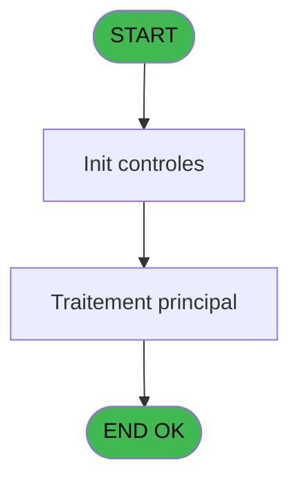
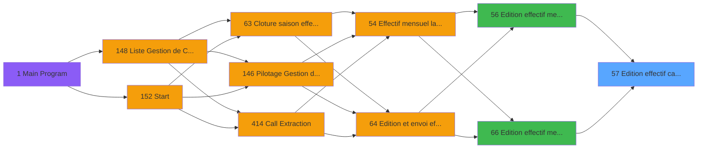

# PBP IDE 57 - Edition effectif calcul dates

> **Analyse**: Phases 1-4 2026-02-03 09:00 -> 09:00 (20s) | Assemblage 09:00
> **Pipeline**: V7.2 Enrichi
> **Structure**: 4 onglets (Resume | Ecrans | Donnees | Connexions)

<!-- TAB:Resume -->

## 1. FICHE D'IDENTITE

| Attribut | Valeur |
|----------|--------|
| Projet | PBP |
| IDE Position | 57 |
| Nom Programme | Edition effectif calcul dates |
| Fichier source | `Prg_57.xml` |
| Domaine metier | Impression |
| Taches | 1 (0 ecrans visibles) |
| Tables modifiees | 0 |
| Programmes appeles | 0 |

## 2. DESCRIPTION FONCTIONNELLE

**Edition effectif calcul dates** assure la gestion complete de ce processus, accessible depuis [Edition effectif mensuel (IDE 56)](PBP-IDE-56.md), [Edition effectif mensuel V3 (IDE 66)](PBP-IDE-66.md).

Le flux de traitement s'organise en **1 blocs fonctionnels** :

- **Traitement** (1 tache) : traitements metier divers

**Logique metier** : 4 regles identifiees couvrant conditions metier.

## 3. BLOCS FONCTIONNELS

### 3.1 Traitement (1 tache)

Traitements internes.

---

#### 57 - Pilotage Gestion de Crise

**Role** : Gestion du moyen de paiement : Pilotage Gestion de Crise.

## 5. REGLES METIER

4 regles identifiees:

### Autres (4 regles)

#### [RM-001] Si DVal('01/01/'&Str(Year(P.DateFinSaisie [B]) alors '4') sinon 'DD/MM/YYYY') > P.DateOuverture [K], DVal('01/01/'&Str(Year(P.DateFinSaisie [B]),'4'),'DD/MM/YYYY'), P.DateOuverture [K])

| Element | Detail |
|---------|--------|
| **Condition** | `DVal('01/01/'&Str(Year(P.DateFinSaisie [B])` |
| **Si vrai** | '4') |
| **Si faux** | 'DD/MM/YYYY') > P.DateOuverture [K], DVal('01/01/'&Str(Year(P.DateFinSaisie [B]),'4'),'DD/MM/YYYY'), P.DateOuverture [K]) |
| **Variables** | B (P.DateFinSaisie), K (P.DateOuverture) |
| **Expression source** | Expression 18 : `IF(DVal('01/01/'&Str(Year(P.DateFinSaisie [B]),'4'),'DD/MM/Y` |
| **Exemple** | Si DVal('01/01/'&Str(Year(P.DateFinSaisie [B]) → '4') |

#### [RM-002] Si DVal('01/07/'&Str(Year(P.DateFinSaisie [B]) alors '4') sinon 'DD/MM/YYYY') > P.DateOuverture [K], DVal('01/07/'&Str(Year(P.DateFinSaisie [B]),'4'),'DD/MM/YYYY'), P.DateOuverture [K])

| Element | Detail |
|---------|--------|
| **Condition** | `DVal('01/07/'&Str(Year(P.DateFinSaisie [B])` |
| **Si vrai** | '4') |
| **Si faux** | 'DD/MM/YYYY') > P.DateOuverture [K], DVal('01/07/'&Str(Year(P.DateFinSaisie [B]),'4'),'DD/MM/YYYY'), P.DateOuverture [K]) |
| **Variables** | B (P.DateFinSaisie), K (P.DateOuverture) |
| **Expression source** | Expression 22 : `IF(DVal('01/07/'&Str(Year(P.DateFinSaisie [B]),'4'),'DD/MM/Y` |
| **Exemple** | Si DVal('01/07/'&Str(Year(P.DateFinSaisie [B]) → '4') |

#### [RM-003] Si P.DateDebutEte [C] > P.DateOuverture [K] alors P.DateDebutEte [C] sinon P.DateOuverture [K])

| Element | Detail |
|---------|--------|
| **Condition** | `P.DateDebutEte [C] > P.DateOuverture [K]` |
| **Si vrai** | P.DateDebutEte [C] |
| **Si faux** | P.DateOuverture [K]) |
| **Variables** | C (P.DateDebutEte), K (P.DateOuverture) |
| **Expression source** | Expression 23 : `IF(P.DateDebutEte [C] > P.DateOuverture [K],P.DateDebutEte [` |
| **Exemple** | Si P.DateDebutEte [C] > P.DateOuverture [K] → P.DateDebutEte [C]. Sinon → P.DateOuverture [K]) |

#### [RM-004] Si P.DateDebutHiver [E] > P.DateOuverture [K] alors P.DateDebutHiver [E] sinon P.DateOuverture [K])

| Element | Detail |
|---------|--------|
| **Condition** | `P.DateDebutHiver [E] > P.DateOuverture [K]` |
| **Si vrai** | P.DateDebutHiver [E] |
| **Si faux** | P.DateOuverture [K]) |
| **Variables** | E (P.DateDebutHiver), K (P.DateOuverture) |
| **Expression source** | Expression 24 : `IF(P.DateDebutHiver [E] > P.DateOuverture [K],P.DateDebutHiv` |
| **Exemple** | Si P.DateDebutHiver [E] > P.DateOuverture [K] → P.DateDebutHiver [E]. Sinon → P.DateOuverture [K]) |

## 6. CONTEXTE

- **Appele par**: [Edition effectif mensuel (IDE 56)](PBP-IDE-56.md), [Edition effectif mensuel V3 (IDE 66)](PBP-IDE-66.md)
- **Appelle**: 0 programmes | **Tables**: 0 (W:0 R:0 L:0) | **Taches**: 1 | **Expressions**: 36

<!-- TAB:Ecrans -->

## 8. ECRANS

*(Programme sans ecran visible)*

## 9. NAVIGATION

### 9.3 Structure hierarchique (1 tache)

| Position | Tache | Type | Dimensions | Bloc |
|----------|-------|------|------------|------|
| **57.1** | [**Pilotage Gestion de Crise** (57)](#t13) | MDI | - | Traitement |

### 9.4 Algorigramme

> **Legende**: Vert = START/END OK | Rouge = END KO | Bleu = Decisions
> *Algorigramme auto-genere. Utiliser `/algorigramme` pour une synthese metier detaillee.*

<!-- TAB:Donnees -->

## 10. TABLES

### Tables utilisees (0)

| ID | Nom | Description | Type | R | W | L | Usages |
|----|-----|-------------|------|---|---|---|--------|

### Colonnes par table (0 / 0 tables avec colonnes identifiees)

## 11. VARIABLES

### 11.1 Parametres entrants (16)

Variables recues du programme appelant ([Edition effectif mensuel (IDE 56)](PBP-IDE-56.md)).

| Lettre | Nom | Type | Usage dans |
|--------|-----|------|-----------|
| A | P.Saision | Alpha | - |
| B | P.DateFinSaisie | Date | 16x parametre entrant |
| C | P.DateDebutEte | Date | 3x parametre entrant |
| D | P.DateFinEte | Date | 1x parametre entrant |
| E | P.DateDebutHiver | Date | 3x parametre entrant |
| F | P.DateFinHiver | Date | 1x parametre entrant |
| G | P.VillageSaisonnier | Alpha | 2x parametre entrant |
| H | P.DateDebutEdition | Date | 6x parametre entrant |
| I | P.DateFinEdition | Date | 4x parametre entrant |
| J | P.TypeCalendrier | Unicode | 2x parametre entrant |
| K | P.DateOuverture | Date | 5x parametre entrant |
| L | P.DateFermeture | Date | 2x parametre entrant |
| M | P.CumulSur1erMois | Logical | - |
| N | P.NbrJoursSaison1 | Numeric | - |
| O | P.NbrJoursSaison2 | Numeric | - |
| P | P.date-14 | Logical | 1x parametre entrant |

### 11.2 Variables de session (4)

Variables persistantes pendant toute la session.

| Lettre | Nom | Type | Usage dans |
|--------|-----|------|-----------|
| Q | v.DateDebutS1 | Date | 1x session |
| R | v.DateFinS1 | Date | 1x session |
| S | v.DateDebutS2 | Date | 1x session |
| T | v.DateFinS2 | Date | - |

Toutes les 20 variables (liste complete)

| Cat | Lettre | Nom Variable | Type |
|-----|--------|--------------|------|
| P0 | **A** | P.Saision | Alpha |
| P0 | **B** | P.DateFinSaisie | Date |
| P0 | **C** | P.DateDebutEte | Date |
| P0 | **D** | P.DateFinEte | Date |
| P0 | **E** | P.DateDebutHiver | Date |
| P0 | **F** | P.DateFinHiver | Date |
| P0 | **G** | P.VillageSaisonnier | Alpha |
| P0 | **H** | P.DateDebutEdition | Date |
| P0 | **I** | P.DateFinEdition | Date |
| P0 | **J** | P.TypeCalendrier | Unicode |
| P0 | **K** | P.DateOuverture | Date |
| P0 | **L** | P.DateFermeture | Date |
| P0 | **M** | P.CumulSur1erMois | Logical |
| P0 | **N** | P.NbrJoursSaison1 | Numeric |
| P0 | **O** | P.NbrJoursSaison2 | Numeric |
| P0 | **P** | P.date-14 | Logical |
| V. | **Q** | v.DateDebutS1 | Date |
| V. | **R** | v.DateFinS1 | Date |
| V. | **S** | v.DateDebutS2 | Date |
| V. | **T** | v.DateFinS2 | Date |

## 12. EXPRESSIONS

**36 / 36 expressions decodees (100%)**

### 12.1 Repartition par type

| Type | Expressions | Regles |
|------|-------------|--------|
| CALCULATION | 3 | 0 |
| CONDITION | 14 | 4 |
| CONSTANTE | 3 | 0 |
| FORMAT | 10 | 0 |
| OTHER | 3 | 0 |
| CAST_LOGIQUE | 2 | 0 |
| NEGATION | 1 | 0 |

### 12.2 Expressions cles par type

#### CALCULATION (3 expressions)

| Type | IDE | Expression | Regle |
|------|-----|------------|-------|
| CALCULATION | 33 | `P.DateFinEdition [I] - P.DateDebutEdition [H]` | - |
| CALCULATION | 19 | `P.DateDebutEdition [H] - 14` | - |
| CALCULATION | 15 | `P.DateFermeture [L]+7` | - |

#### CONDITION (14 expressions)

| Type | IDE | Expression | Regle |
|------|-----|------------|-------|
| CONDITION | 22 | `IF(DVal('01/07/'&Str(Year(P.DateFinSaisie [B]),'4'),'DD/MM/YYYY') > P.DateOuverture [K], DVal('01/07/'&Str(Year(P.DateFinSaisie [B]),'4'),'DD/MM/YYYY'), P.DateOuverture [K])` | [RM-002](#rm-RM-002) |
| CONDITION | 23 | `IF(P.DateDebutEte [C] > P.DateOuverture [K],P.DateDebutEte [C],P.DateOuverture [K])` | [RM-003](#rm-RM-003) |
| CONDITION | 24 | `IF(P.DateDebutHiver [E] > P.DateOuverture [K],P.DateDebutHiver [E],P.DateOuverture [K])` | [RM-004](#rm-RM-004) |
| CONDITION | 18 | `IF(DVal('01/01/'&Str(Year(P.DateFinSaisie [B]),'4'),'DD/MM/YYYY') > P.DateOuverture [K], DVal('01/01/'&Str(Year(P.DateFinSaisie [B]),'4'),'DD/MM/YYYY'), P.DateOuverture [K])` | [RM-001](#rm-RM-001) |
| CONDITION | 25 | `P.TypeCalendrier [J] = 'O'` | - |
| ... | | *+9 autres* | |

#### CONSTANTE (3 expressions)

| Type | IDE | Expression | Regle |
|------|-----|------------|-------|
| CONSTANTE | 34 | `0` | - |
| CONSTANTE | 12 | `'H'` | - |
| CONSTANTE | 11 | `'E'` | - |

#### FORMAT (10 expressions)

| Type | IDE | Expression | Regle |
|------|-----|------------|-------|
| FORMAT | 29 | `DVal('01/07/'&Str(Year(P.DateFinSaisie [B]),'4'),'DD/MM/YYYY')` | - |
| FORMAT | 28 | `DVal('30/06/'&Str(Year(P.DateFinSaisie [B]),'4'),'DD/MM/YYYY')` | - |
| FORMAT | 30 | `DVal('31/12/'&Str(Year(P.DateFinSaisie [B]),'4'),'DD/MM/YYYY')` | - |
| FORMAT | 36 | `P.DateFinEdition [I] - DVal('01/07/'&Str(Year(P.DateFinSaisie [B]),'4'),'DD/MM/YYYY')` | - |
| FORMAT | 35 | `DVal('30/06/'&Str(Year(P.DateFinSaisie [B]),'4'),'DD/MM/YYYY') - P.DateDebutEdition [H]` | - |
| ... | | *+5 autres* | |

#### OTHER (3 expressions)

| Type | IDE | Expression | Regle |
|------|-----|------------|-------|
| OTHER | 13 | `P.DateFinSaisie [B]` | - |
| OTHER | 5 | `P.DateDebutHiver [E]` | - |
| OTHER | 4 | `P.DateDebutEte [C]` | - |

#### CAST_LOGIQUE (2 expressions)

| Type | IDE | Expression | Regle |
|------|-----|------------|-------|
| CAST_LOGIQUE | 20 | `'TRUE'LOG` | - |
| CAST_LOGIQUE | 10 | `'FALSE'LOG` | - |

#### NEGATION (1 expressions)

| Type | IDE | Expression | Regle |
|------|-----|------------|-------|
| NEGATION | 17 | `NOT ExpCalc('13'EXP)` | - |

### 12.3 Toutes les expressions (36)

Voir les 36 expressions

#### CALCULATION (3)

| IDE | Expression Decodee |
|-----|-------------------|
| 15 | `P.DateFermeture [L]+7` |
| 19 | `P.DateDebutEdition [H] - 14` |
| 33 | `P.DateFinEdition [I] - P.DateDebutEdition [H]` |

#### CONDITION (14)

| IDE | Expression Decodee |
|-----|-------------------|
| 16 | `P.DateFinSaisie [B]>P.DateFermeture [L]+7` |
| 18 | `IF(DVal('01/01/'&Str(Year(P.DateFinSaisie [B]),'4'),'DD/MM/YYYY') > P.DateOuverture [K], DVal('01/01/'&Str(Year(P.DateFinSaisie [B]),'4'),'DD/MM/YYYY'), P.DateOuverture [K])` |
| 22 | `IF(DVal('01/07/'&Str(Year(P.DateFinSaisie [B]),'4'),'DD/MM/YYYY') > P.DateOuverture [K], DVal('01/07/'&Str(Year(P.DateFinSaisie [B]),'4'),'DD/MM/YYYY'), P.DateOuverture [K])` |
| 23 | `IF(P.DateDebutEte [C] > P.DateOuverture [K],P.DateDebutEte [C],P.DateOuverture [K])` |
| 24 | `IF(P.DateDebutHiver [E] > P.DateOuverture [K],P.DateDebutHiver [E],P.DateOuverture [K])` |
| 1 | `P.VillageSaisonnier [G]='O'` |
| 2 | `P.DateFinSaisie [B]>=P.DateDebutEte [C] AND P.DateFinSaisie [B] <=P.DateFinEte [D]` |
| 3 | `P.DateFinSaisie [B] >=P.DateDebutHiver [E] AND P.DateFinSaisie [B]<=P.DateFinHiver [F]` |
| 14 | `P.VillageSaisonnier [G]='N'` |
| 21 | `P.DateDebutEdition [H] = P.DateOuverture [K]` |
| 25 | `P.TypeCalendrier [J] = 'O'` |
| 26 | `P.TypeCalendrier [J] = 'C'` |
| 31 | `(P.DateDebutEdition [H] >= P.date-14 [P] AND P.DateDebutEdition [H] <= v.DateDebutS1 [Q] AND P.DateFinEdition [I] >= P.date-14 [P] AND P.DateFinEdition [I] <= v.DateDebutS1 [Q])` |
| 32 | `(P.DateDebutEdition [H] >= v.DateFinS1 [R] AND P.DateDebutEdition [H] <= v.DateDebutS2 [S] AND P.DateFinEdition [I] >= v.DateFinS1 [R] AND P.DateFinEdition [I] <= v.DateDebutS2 [S])` |

#### CONSTANTE (3)

| IDE | Expression Decodee |
|-----|-------------------|
| 11 | `'E'` |
| 12 | `'H'` |
| 34 | `0` |

#### FORMAT (10)

| IDE | Expression Decodee |
|-----|-------------------|
| 6 | `DVal('01/01/'&Str(Year(P.DateFinSaisie [B]),'4'),'DD/MM/YYYY')` |
| 7 | `P.DateFinSaisie [B] >= DVal('01/01/'&Str(Year(P.DateFinSaisie [B]),'4'),'DD/MM/YYYY')AND P.DateFinSaisie [B] <= DVal('30/06/'&Str(Year(P.DateFinSaisie [B]),'4'),'DD/MM/YYYY')` |
| 8 | `DVal('01/07/'&Str(Year(P.DateFinSaisie [B]),'4'),'DD/MM/YYYY')` |
| 9 | `P.DateFinSaisie [B] >= DVal('01/07/'&Str(Year(P.DateFinSaisie [B]),'4'),'DD/MM/YYYY')AND P.DateFinSaisie [B] <= DVal('31/12/'&Str(Year(P.DateFinSaisie [B]),'4'),'DD/MM/YYYY')` |
| 27 | `DVal('01/01/'&Str(Year(P.DateFinSaisie [B]),'4'),'DD/MM/YYYY')` |
| 28 | `DVal('30/06/'&Str(Year(P.DateFinSaisie [B]),'4'),'DD/MM/YYYY')` |
| 29 | `DVal('01/07/'&Str(Year(P.DateFinSaisie [B]),'4'),'DD/MM/YYYY')` |
| 30 | `DVal('31/12/'&Str(Year(P.DateFinSaisie [B]),'4'),'DD/MM/YYYY')` |
| 35 | `DVal('30/06/'&Str(Year(P.DateFinSaisie [B]),'4'),'DD/MM/YYYY') - P.DateDebutEdition [H]` |
| 36 | `P.DateFinEdition [I] - DVal('01/07/'&Str(Year(P.DateFinSaisie [B]),'4'),'DD/MM/YYYY')` |

#### OTHER (3)

| IDE | Expression Decodee |
|-----|-------------------|
| 4 | `P.DateDebutEte [C]` |
| 5 | `P.DateDebutHiver [E]` |
| 13 | `P.DateFinSaisie [B]` |

#### CAST_LOGIQUE (2)

| IDE | Expression Decodee |
|-----|-------------------|
| 10 | `'FALSE'LOG` |
| 20 | `'TRUE'LOG` |

#### NEGATION (1)

| IDE | Expression Decodee |
|-----|-------------------|
| 17 | `NOT ExpCalc('13'EXP)` |

<!-- TAB:Connexions -->

## 13. GRAPHE D'APPELS

### 13.1 Chaine depuis Main (Callers)

Main -> ... -> [Edition effectif mensuel (IDE 56)](PBP-IDE-56.md) -> **Edition effectif calcul dates (IDE 57)**

Main -> ... -> [Edition effectif mensuel V3 (IDE 66)](PBP-IDE-66.md) -> **Edition effectif calcul dates (IDE 57)**

### 13.2 Callers

| IDE | Nom Programme | Nb Appels |
|-----|---------------|-----------|
| [56](PBP-IDE-56.md) | Edition effectif mensuel | 1 |
| [66](PBP-IDE-66.md) | Edition effectif mensuel V3 | 1 |

### 13.3 Callees (programmes appeles)

### 13.4 Detail Callees avec contexte

| IDE | Nom Programme | Appels | Contexte |
|-----|---------------|--------|----------|
| - | (aucun) | - | - |

## 14. RECOMMANDATIONS MIGRATION

### 14.1 Profil du programme

| Metrique | Valeur | Impact migration |
|----------|--------|-----------------|
| Lignes de logique | 89 | Programme compact |
| Expressions | 36 | Peu de logique |
| Tables WRITE | 0 | Impact faible |
| Sous-programmes | 0 | Peu de dependances |
| Ecrans visibles | 0 | Ecran unique ou traitement batch |
| Code desactive | 2.2% (2 / 89) | Code sain |
| Regles metier | 4 | Quelques regles a preserver |

### 14.2 Plan de migration par bloc

#### Traitement (1 tache: 0 ecran, 1 traitement)

- **Strategie** : 1 service(s) backend injectable(s) (Domain Services).
- Decomposer les taches en services unitaires testables.

### 14.3 Dependances critiques

| Dependance | Type | Appels | Impact |
|------------|------|--------|--------|

---
*Spec DETAILED generee par Pipeline V7.2 - 2026-02-03 09:01*
