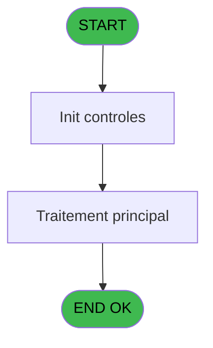

# PBP IDE 59 - Edition allergens

> **Analyse**: Phases 1-4 2026-02-03 09:01 -> 09:02 (20s) | Assemblage 09:02
> **Pipeline**: V7.2 Enrichi
> **Structure**: 4 onglets (Resume | Ecrans | Donnees | Connexions)

<!-- TAB:Resume -->

## 1. FICHE D'IDENTITE

| Attribut | Valeur |
|----------|--------|
| Projet | PBP |
| IDE Position | 59 |
| Nom Programme | Edition allergens |
| Fichier source | `Prg_59.xml` |
| Domaine metier | Impression |
| Taches | 1 (0 ecrans visibles) |
| Tables modifiees | 0 |
| Programmes appeles | 0 |

## 2. DESCRIPTION FONCTIONNELLE

**Edition allergens** assure la gestion complete de ce processus, accessible depuis [Effectif economat (IDE 53)](PBP-IDE-53.md).

Le flux de traitement s'organise en **1 blocs fonctionnels** :

- **Impression** (1 tache) : generation de tickets et documents

## 3. BLOCS FONCTIONNELS

### 3.1 Impression (1 tache)

Generation des documents et tickets.

---

#### 59 - Edition effectif allergies

**Role** : Generation du document : Edition effectif allergies.

## 5. REGLES METIER

*(Aucune regle metier identifiee)*

## 6. CONTEXTE

- **Appele par**: [Effectif economat (IDE 53)](PBP-IDE-53.md)
- **Appelle**: 0 programmes | **Tables**: 0 (W:0 R:0 L:0) | **Taches**: 1 | **Expressions**: 15

<!-- TAB:Ecrans -->

## 8. ECRANS

*(Programme sans ecran visible)*

## 9. NAVIGATION

### 9.3 Structure hierarchique (1 tache)

| Position | Tache | Type | Dimensions | Bloc |
|----------|-------|------|------------|------|
| **59.1** | [**Edition effectif allergies** (59)](#t13) | - | - | Impression |

### 9.4 Algorigramme

> **Legende**: Vert = START/END OK | Rouge = END KO | Bleu = Decisions
> *Algorigramme auto-genere. Utiliser `/algorigramme` pour une synthese metier detaillee.*

<!-- TAB:Donnees -->

## 10. TABLES

### Tables utilisees (0)

| ID | Nom | Description | Type | R | W | L | Usages |
|----|-----|-------------|------|---|---|---|--------|

### Colonnes par table (0 / 0 tables avec colonnes identifiees)

## 11. VARIABLES

### 11.1 Parametres entrants (4)

Variables recues du programme appelant ([Effectif economat (IDE 53)](PBP-IDE-53.md)).

| Lettre | Nom | Type | Usage dans |
|--------|-----|------|-----------|
| A | P.Date | Date | - |
| B | P.Code village | Alpha | - |
| C | P.Lieu sejour | Alpha | - |
| D | P.Nom lieu | Alpha | - |

### 11.2 Variables de session (7)

Variables persistantes pendant toute la session.

| Lettre | Nom | Type | Usage dans |
|--------|-----|------|-----------|
| E | v. no_allergie | Numeric | - |
| F | v. label fr | Unicode | - |
| G | v. label en | Unicode | 3x session |
| H | v. nb real midi | Numeric | - |
| I | v. nb real soir | Numeric | - |
| J | v. nb prev midi | Numeric | - |
| K | v. nb prev soir | Numeric | - |

## 12. EXPRESSIONS

**15 / 15 expressions decodees (100%)**

### 12.1 Repartition par type

| Type | Expressions | Regles |
|------|-------------|--------|
| FORMAT | 8 | 0 |
| REFERENCE_VG | 1 | 0 |
| CONDITION | 1 | 0 |
| OTHER | 4 | 0 |
| STRING | 1 | 0 |

### 12.2 Expressions cles par type

#### FORMAT (8 expressions)

| Type | IDE | Expression | Regle |
|------|-----|------------|-------|
| FORMAT | 13 | `Str([FS],'8')` | - |
| FORMAT | 12 | `Str([FQ],'8')` | - |
| FORMAT | 15 | `Str([FT],'8')` | - |
| FORMAT | 14 | `Str([FR],'8')` | - |
| FORMAT | 2 | `DStr(v. label en [G]+1,'DD/MM/YYYY')` | - |
| ... | | *+3 autres* | |

#### REFERENCE_VG (1 expressions)

| Type | IDE | Expression | Regle |
|------|-----|------------|-------|
| REFERENCE_VG | 4 | `VG37` | - |

#### CONDITION (1 expressions)

| Type | IDE | Expression | Regle |
|------|-----|------------|-------|
| CONDITION | 6 | `[EM]<>''` | - |

#### OTHER (4 expressions)

| Type | IDE | Expression | Regle |
|------|-----|------------|-------|
| OTHER | 9 | `MlsTrans('Prévisionnel du')` | - |
| OTHER | 10 | `[FN]` | - |
| OTHER | 7 | `MlsTrans('Effectifs Quotidiens')` | - |
| OTHER | 8 | `MlsTrans('Réalisations du')` | - |

#### STRING (1 expressions)

| Type | IDE | Expression | Regle |
|------|-----|------------|-------|
| STRING | 11 | `Trim([FN])` | - |

<!-- TAB:Connexions -->

## 13. GRAPHE D'APPELS

### 13.1 Chaine depuis Main (Callers)

Main -> ... -> [Effectif economat (IDE 53)](PBP-IDE-53.md) -> **Edition allergens (IDE 59)**

### 13.2 Callers

| IDE | Nom Programme | Nb Appels |
|-----|---------------|-----------|
| [53](PBP-IDE-53.md) | Effectif economat | 2 |

### 13.3 Callees (programmes appeles)

### 13.4 Detail Callees avec contexte

| IDE | Nom Programme | Appels | Contexte |
|-----|---------------|--------|----------|
| - | (aucun) | - | - |

## 14. RECOMMANDATIONS MIGRATION

### 14.1 Profil du programme

| Metrique | Valeur | Impact migration |
|----------|--------|-----------------|
| Lignes de logique | 15 | Programme compact |
| Expressions | 15 | Peu de logique |
| Tables WRITE | 0 | Impact faible |
| Sous-programmes | 0 | Peu de dependances |
| Ecrans visibles | 0 | Ecran unique ou traitement batch |
| Code desactive | 0% (0 / 15) | Code sain |
| Regles metier | 0 | Pas de regle identifiee |

### 14.2 Plan de migration par bloc

#### Impression (1 tache: 0 ecran, 1 traitement)

- **Strategie** : Templates HTML -> PDF via wkhtmltopdf ou Puppeteer.
- `PrintService` injectable avec choix imprimante

### 14.3 Dependances critiques

| Dependance | Type | Appels | Impact |
|------------|------|--------|--------|

---
*Spec DETAILED generee par Pipeline V7.2 - 2026-02-03 09:02*
