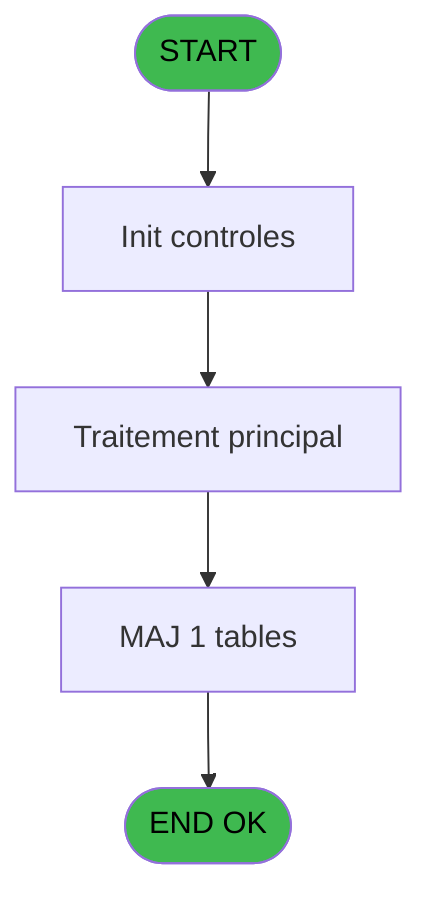
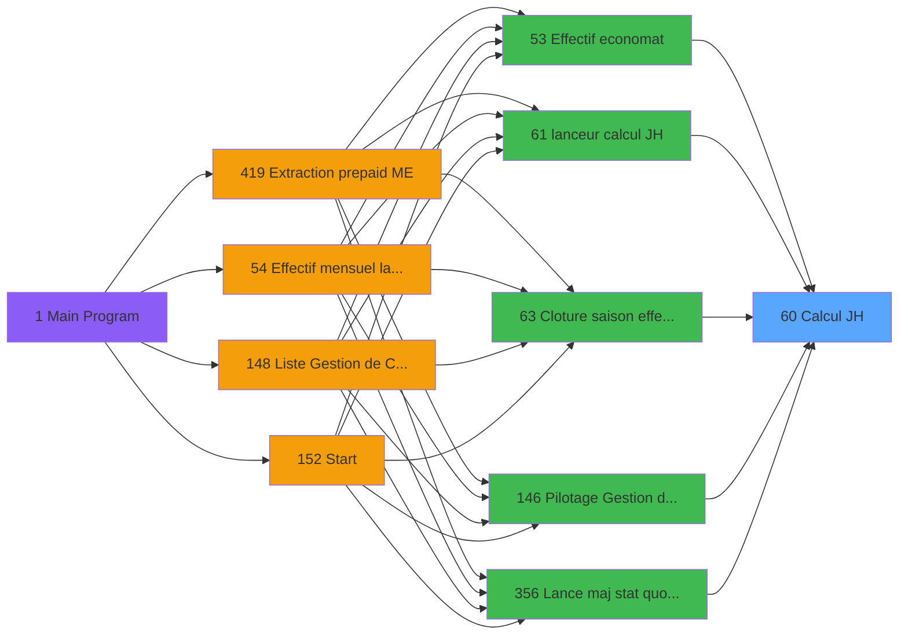

# PBP IDE 60 - Calcul JH

> **Analyse**: Phases 1-4 2026-02-03 09:02 -> 09:02 (21s) | Assemblage 09:02
> **Pipeline**: V7.2 Enrichi
> **Structure**: 4 onglets (Resume | Ecrans | Donnees | Connexions)

<!-- TAB:Resume -->

## 1. FICHE D'IDENTITE

| Attribut | Valeur |
|----------|--------|
| Projet | PBP |
| IDE Position | 60 |
| Nom Programme | Calcul JH |
| Fichier source | `Prg_60.xml` |
| Domaine metier | General |
| Taches | 12 (0 ecrans visibles) |
| Tables modifiees | 1 |
| Programmes appeles | 0 |

## 2. DESCRIPTION FONCTIONNELLE

**Calcul JH** assure la gestion complete de ce processus, accessible depuis [Effectif economat (IDE 53)](PBP-IDE-53.md), [lanceur calcul JH (IDE 61)](PBP-IDE-61.md), [Cloture saison effectif (IDE 63)](PBP-IDE-63.md), [Pilotage Gestion de Crise (IDE 146)](PBP-IDE-146.md), [Lance maj stat quot pour test (IDE 356)](PBP-IDE-356.md).

Le flux de traitement s'organise en **4 blocs fonctionnels** :

- **Traitement** (5 taches) : traitements metier divers
- **Validation** (4 taches) : controles et verifications de coherence
- **Creation** (2 taches) : insertion d'enregistrements en base (mouvements, prestations)
- **Calcul** (1 tache) : calculs de montants, stocks ou compteurs

**Donnees modifiees** : 1 tables en ecriture (pv_invoicehistoline).

Detail : phases du traitement

#### Phase 1 : Calcul (1 tache)

- **60** - Calcul JH

#### Phase 2 : Traitement (5 taches)

- **60.1** - Ecriture PV
- **60.2** - ecriture jh ecomat quotidienne
- **60.2.1.2** - update SQL
- **60.2.2.2** - update SQL
- **60.3** - recup village

#### Phase 3 : Validation (4 taches)

- **60.2.1** - verif exist jh quotidienne **[[ECRAN]](#ecran-t4)**
- **60.2.2** - verif exist jh quotidienne **[[ECRAN]](#ecran-t10)**
- **60.2.3** - verif exist jh quotidienne **[[ECRAN]](#ecran-t25)**
- **60.2.4** - verif exist jh quotidienne **[[ECRAN]](#ecran-t30)**

#### Phase 4 : Creation (2 taches)

- **60.2.1.1** - insert SQL
- **60.2.2.1** - insert SQL

#### Tables impactees

| Table | Operations | Role metier |
|-------|-----------|-------------|
| pv_invoicehistoline | **W** (1 usages) | Historique / journal |

## 3. BLOCS FONCTIONNELS

### 3.1 Calcul (1 tache)

Calculs metier : montants, stocks, compteurs.

---

#### 60 - Calcul JH

**Role** : Calcul : Calcul JH.

### 3.2 Traitement (5 taches)

Traitements internes.

---

#### 60.1 - Ecriture PV

**Role** : Traitement : Ecriture PV.

---

#### 60.2 - ecriture jh ecomat quotidienne

**Role** : Traitement : ecriture jh ecomat quotidienne.

---

#### 60.2.1.2 - update SQL

**Role** : Traitement : update SQL.

---

#### 60.2.2.2 - update SQL

**Role** : Traitement : update SQL.

---

#### 60.3 - recup village

**Role** : Consultation/chargement : recup village.
**Variables liees** : F (V.Village)

### 3.3 Validation (4 taches)

Controles de coherence : 4 taches verifient les donnees et conditions.

---

#### 60.2.1 - verif exist jh quotidienne [[ECRAN]](#ecran-t4)

**Role** : Verification : verif exist jh quotidienne.
**Ecran** : 171 x 195 DLU | [Voir mockup](#ecran-t4)
**Variables liees** : B (V.Existe qualite ?)

---

#### 60.2.2 - verif exist jh quotidienne [[ECRAN]](#ecran-t10)

**Role** : Verification : verif exist jh quotidienne.
**Ecran** : 171 x 195 DLU | [Voir mockup](#ecran-t10)
**Variables liees** : B (V.Existe qualite ?)

---

#### 60.2.3 - verif exist jh quotidienne [[ECRAN]](#ecran-t25)

**Role** : Verification : verif exist jh quotidienne.
**Ecran** : 171 x 195 DLU | [Voir mockup](#ecran-t25)
**Variables liees** : B (V.Existe qualite ?)

---

#### 60.2.4 - verif exist jh quotidienne [[ECRAN]](#ecran-t30)

**Role** : Verification : verif exist jh quotidienne.
**Ecran** : 171 x 195 DLU | [Voir mockup](#ecran-t30)
**Variables liees** : B (V.Existe qualite ?)

### 3.4 Creation (2 taches)

Insertion de nouveaux enregistrements en base.

---

#### 60.2.1.1 - insert SQL

**Role** : Creation d'enregistrement : insert SQL.

---

#### 60.2.2.1 - insert SQL

**Role** : Creation d'enregistrement : insert SQL.

## 5. REGLES METIER

*(Aucune regle metier identifiee)*

## 6. CONTEXTE

- **Appele par**: [Effectif economat (IDE 53)](PBP-IDE-53.md), [lanceur calcul JH (IDE 61)](PBP-IDE-61.md), [Cloture saison effectif (IDE 63)](PBP-IDE-63.md), [Pilotage Gestion de Crise (IDE 146)](PBP-IDE-146.md), [Lance maj stat quot pour test (IDE 356)](PBP-IDE-356.md)
- **Appelle**: 0 programmes | **Tables**: 4 (W:1 R:1 L:2) | **Taches**: 12 | **Expressions**: 17

<!-- TAB:Ecrans -->

## 8. ECRANS

*(Programme sans ecran visible)*

## 9. NAVIGATION

### 9.3 Structure hierarchique (12 taches)

| Position | Tache | Type | Dimensions | Bloc |
|----------|-------|------|------------|------|
| **60.1** | [**Calcul JH** (60)](#t1) | - | - | Calcul |
| **60.2** | [**Ecriture PV** (60.1)](#t2) | - | - | Traitement |
| 60.2.1 | [ecriture jh ecomat quotidienne (60.2)](#t3) | - | - | |
| 60.2.2 | [update SQL (60.2.1.2)](#t6) | - | - | |
| 60.2.3 | [update SQL (60.2.2.2)](#t12) | - | - | |
| 60.2.4 | [recup village (60.3)](#t13) | - | - | |
| **60.3** | [**verif exist jh quotidienne** (60.2.1)](#t4) [mockup](#ecran-t4) | - | 171x195 | Validation |
| 60.3.1 | [verif exist jh quotidienne (60.2.2)](#t10) [mockup](#ecran-t10) | - | 171x195 | |
| 60.3.2 | [verif exist jh quotidienne (60.2.3)](#t25) [mockup](#ecran-t25) | - | 171x195 | |
| 60.3.3 | [verif exist jh quotidienne (60.2.4)](#t30) [mockup](#ecran-t30) | - | 171x195 | |
| **60.4** | [**insert SQL** (60.2.1.1)](#t5) | - | - | Creation |
| 60.4.1 | [insert SQL (60.2.2.1)](#t11) | - | - | |

### 9.4 Algorigramme

> **Legende**: Vert = START/END OK | Rouge = END KO | Bleu = Decisions
> *Algorigramme auto-genere. Utiliser `/algorigramme` pour une synthese metier detaillee.*

<!-- TAB:Donnees -->

## 10. TABLES

### Tables utilisees (4)

| ID | Nom | Description | Type | R | W | L | Usages |
|----|-----|-------------|------|---|---|---|--------|
| 69 | initialisation___ini |  | DB | R |   |   | 2 |
| 120 | tables_qualites__qua |  | DB |   |   | L | 1 |
| 392 | pv_invoicehistoline | Historique / journal | DB |   | **W** |   | 1 |
| 824 | fac_pied_tva_pro |  | DB |   |   | L | 1 |

### Colonnes par table (1 / 2 tables avec colonnes identifiees)

Table 69 - initialisation___ini (R) - 2 usages

| Lettre | Variable | Acces | Type |
|--------|----------|-------|------|
| A | P.Date | R | Date |
| B | V.Existe qualite ? | R | Logical |
| C | V.JHP jour | R | Numeric |
| D | V.JHD jour | R | Numeric |
| E | V.JHE jour | R | Numeric |
| F | V.Village | R | Alpha |
| G | V.JHP mensuel | R | Numeric |
| H | V.JHP total | R | Numeric |
| I | V.JHD mensuel | R | Numeric |
| J | V.JHD Total | R | Numeric |
| K | V.JHE total | R | Numeric |
| L | V.JHE mensuel | R | Numeric |

Table 392 - pv_invoicehistoline (**W**) - 1 usages

*Table utilisee uniquement en Link ou aucune colonne Real identifiee dans le DataView.*

## 11. VARIABLES

### 11.1 Parametres entrants (1)

Variables recues du programme appelant ([Effectif economat (IDE 53)](PBP-IDE-53.md)).

| Lettre | Nom | Type | Usage dans |
|--------|-----|------|-----------|
| A | P.Date | Date | 1x parametre entrant |

### 11.2 Variables de session (11)

Variables persistantes pendant toute la session.

| Lettre | Nom | Type | Usage dans |
|--------|-----|------|-----------|
| B | V.Existe qualite ? | Logical | 2x session |
| C | V.JHP jour | Numeric | 2x session |
| D | V.JHD jour | Numeric | 4x session |
| E | V.JHE jour | Numeric | 4x session |
| F | V.Village | Alpha | - |
| G | V.JHP mensuel | Numeric | - |
| H | V.JHP total | Numeric | 2x session |
| I | V.JHD mensuel | Numeric | - |
| J | V.JHD Total | Numeric | - |
| K | V.JHE total | Numeric | - |
| L | V.JHE mensuel | Numeric | - |

## 12. EXPRESSIONS

**17 / 17 expressions decodees (100%)**

### 12.1 Repartition par type

| Type | Expressions | Regles |
|------|-------------|--------|
| CALCULATION | 6 | 0 |
| CONSTANTE | 5 | 0 |
| OTHER | 3 | 0 |
| CONDITION | 3 | 0 |

### 12.2 Expressions cles par type

#### CALCULATION (6 expressions)

| Type | IDE | Expression | Regle |
|------|-----|------------|-------|
| CALCULATION | 9 | `[S]+(V.JHD jour [D]+V.JHE jour [E]+[AE]+[AF])/2` | - |
| CALCULATION | 10 | `[R]+[S]` | - |
| CALCULATION | 17 | `[Y]+[AA]` | - |
| CALCULATION | 5 | `[R]+(V.JHD jour [D]+V.JHE jour [E]+[AE]+[AF])/2` | - |
| CALCULATION | 6 | `[Y]+(V.JHD jour [D]+V.JHE jour [E]+[AE]+[AF])/2` | - |
| ... | | *+1 autres* | |

#### CONSTANTE (5 expressions)

| Type | IDE | Expression | Regle |
|------|-----|------------|-------|
| CONSTANTE | 14 | `'maint2'` | - |
| CONSTANTE | 15 | `'maint3'` | - |
| CONSTANTE | 13 | `'maint1'` | - |
| CONSTANTE | 1 | `'C'` | - |
| CONSTANTE | 12 | `'economat'` | - |

#### OTHER (3 expressions)

| Type | IDE | Expression | Regle |
|------|-----|------------|-------|
| OTHER | 4 | `V.JHP jour [C]` | - |
| OTHER | 3 | `V.Existe qualite ? [B]` | - |
| OTHER | 2 | `BOM([W])` | - |

#### CONDITION (3 expressions)

| Type | IDE | Expression | Regle |
|------|-----|------------|-------|
| CONDITION | 16 | `P.Date [A]=[W]` | - |
| CONDITION | 11 | `V.JHP total [H]='JHD' OR (V.Existe qualite ? [B]='IGR' AND V.JHP jour [C]<>'HCMB') OR V.JHP jour [C]='AVDJ' OR V.Existe qualite ? [B]='VRL'` | - |
| CONDITION | 8 | `V.JHP total [H]='JHP'` | - |

<!-- TAB:Connexions -->

## 13. GRAPHE D'APPELS

### 13.1 Chaine depuis Main (Callers)

Main -> ... -> [Effectif economat (IDE 53)](PBP-IDE-53.md) -> **Calcul JH (IDE 60)**

Main -> ... -> [lanceur calcul JH (IDE 61)](PBP-IDE-61.md) -> **Calcul JH (IDE 60)**

Main -> ... -> [Cloture saison effectif (IDE 63)](PBP-IDE-63.md) -> **Calcul JH (IDE 60)**

Main -> ... -> [Pilotage Gestion de Crise (IDE 146)](PBP-IDE-146.md) -> **Calcul JH (IDE 60)**

Main -> ... -> [Lance maj stat quot pour test (IDE 356)](PBP-IDE-356.md) -> **Calcul JH (IDE 60)**

### 13.2 Callers

| IDE | Nom Programme | Nb Appels |
|-----|---------------|-----------|
| [53](PBP-IDE-53.md) | Effectif economat | 1 |
| [61](PBP-IDE-61.md) | lanceur calcul JH | 1 |
| [63](PBP-IDE-63.md) | Cloture saison effectif | 1 |
| [146](PBP-IDE-146.md) | Pilotage Gestion de Crise | 1 |
| [356](PBP-IDE-356.md) | Lance maj stat quot pour test | 1 |

### 13.3 Callees (programmes appeles)

### 13.4 Detail Callees avec contexte

| IDE | Nom Programme | Appels | Contexte |
|-----|---------------|--------|----------|
| - | (aucun) | - | - |

## 14. RECOMMANDATIONS MIGRATION

### 14.1 Profil du programme

| Metrique | Valeur | Impact migration |
|----------|--------|-----------------|
| Lignes de logique | 111 | Programme compact |
| Expressions | 17 | Peu de logique |
| Tables WRITE | 1 | Impact faible |
| Sous-programmes | 0 | Peu de dependances |
| Ecrans visibles | 0 | Ecran unique ou traitement batch |
| Code desactive | 0% (0 / 111) | Code sain |
| Regles metier | 0 | Pas de regle identifiee |

### 14.2 Plan de migration par bloc

#### Calcul (1 tache: 0 ecran, 1 traitement)

- **Strategie** : Services de calcul purs (Domain Services).
- Migrer la logique de calcul (stock, compteurs, montants)

#### Traitement (5 taches: 0 ecran, 5 traitements)

- **Strategie** : 5 service(s) backend injectable(s) (Domain Services).
- Decomposer les taches en services unitaires testables.

#### Validation (4 taches: 4 ecrans, 0 traitement)

- **Strategie** : FluentValidation avec validators specifiques.
- Chaque tache de validation -> un validator injectable

#### Creation (2 taches: 0 ecran, 2 traitements)

- **Strategie** : Repository pattern avec Entity Framework Core.
- Insertion via `IRepository<T>.CreateAsync()`

### 14.3 Dependances critiques

| Dependance | Type | Appels | Impact |
|------------|------|--------|--------|
| pv_invoicehistoline | Table WRITE (Database) | 1x | Schema + repository |

---
*Spec DETAILED generee par Pipeline V7.2 - 2026-02-03 09:02*
