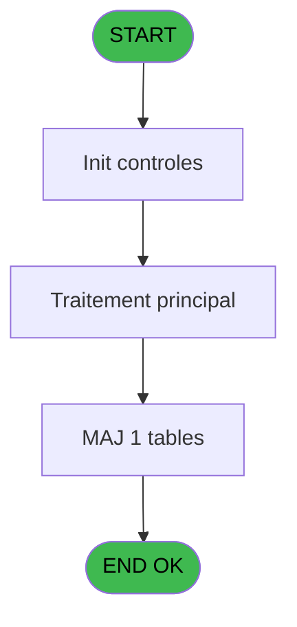
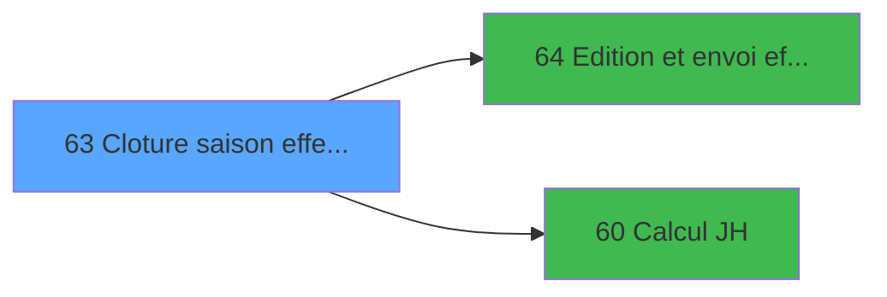

# PBP IDE 63 - Cloture saison effectif

> **Analyse**: Phases 1-4 2026-02-03 09:03 -> 09:04 (20s) | Assemblage 09:04
> **Pipeline**: V7.2 Enrichi
> **Structure**: 4 onglets (Resume | Ecrans | Donnees | Connexions)

<!-- TAB:Resume -->

## 1. FICHE D'IDENTITE

| Attribut | Valeur |
|----------|--------|
| Projet | PBP |
| IDE Position | 63 |
| Nom Programme | Cloture saison effectif |
| Fichier source | `Prg_63.xml` |
| Domaine metier | General |
| Taches | 2 (0 ecrans visibles) |
| Tables modifiees | 1 |
| Programmes appeles | 2 |

## 2. DESCRIPTION FONCTIONNELLE

**Cloture saison effectif** assure la gestion complete de ce processus, accessible depuis [Effectif mensuel lancement (IDE 54)](PBP-IDE-54.md).

Le flux de traitement s'organise en **1 blocs fonctionnels** :

- **Traitement** (2 taches) : traitements metier divers

**Donnees modifiees** : 1 tables en ecriture (##_pv_rentals_dat).

## 3. BLOCS FONCTIONNELS

### 3.1 Traitement (2 taches)

Traitements internes.

---

#### 63 - Lancement effectif [[ECRAN]](#ecran-t1)

**Role** : Traitement : Lancement effectif.
**Ecran** : 535 x 25 DLU (MDI) | [Voir mockup](#ecran-t1)
**Variables liees** : A (V.Date calc effectif fin saison)

---

#### 63.1 - Maj cloture

**Role** : Traitement : Maj cloture.

## 5. REGLES METIER

*(Aucune regle metier identifiee)*

## 6. CONTEXTE

- **Appele par**: [Effectif mensuel lancement (IDE 54)](PBP-IDE-54.md)
- **Appelle**: 2 programmes | **Tables**: 2 (W:1 R:1 L:0) | **Taches**: 2 | **Expressions**: 14

<!-- TAB:Ecrans -->

## 8. ECRANS

*(Programme sans ecran visible)*

## 9. NAVIGATION

### 9.3 Structure hierarchique (2 taches)

| Position | Tache | Type | Dimensions | Bloc |
|----------|-------|------|------------|------|
| **63.1** | [**Lancement effectif** (63)](#t1) [mockup](#ecran-t1) | MDI | 535x25 | Traitement |
| 63.1.1 | [Maj cloture (63.1)](#t20) | - | - | |

### 9.4 Algorigramme

> **Legende**: Vert = START/END OK | Rouge = END KO | Bleu = Decisions
> *Algorigramme auto-genere. Utiliser `/algorigramme` pour une synthese metier detaillee.*

<!-- TAB:Donnees -->

## 10. TABLES

### Tables utilisees (2)

| ID | Nom | Description | Type | R | W | L | Usages |
|----|-----|-------------|------|---|---|---|--------|
| 372 | pv_budget |  | DB | R |   |   | 1 |
| 838 | ##_pv_rentals_dat |  | DB |   | **W** |   | 1 |

### Colonnes par table (0 / 2 tables avec colonnes identifiees)

Table 372 - pv_budget (R) - 1 usages

*Table utilisee uniquement en Link ou aucune colonne Real identifiee dans le DataView.*

Table 838 - ##_pv_rentals_dat (**W**) - 1 usages

*Table utilisee uniquement en Link ou aucune colonne Real identifiee dans le DataView.*

## 11. VARIABLES

*(Programme sans variables locales mappees)*

## 12. EXPRESSIONS

**14 / 14 expressions decodees (100%)**

### 12.1 Repartition par type

| Type | Expressions | Regles |
|------|-------------|--------|
| CONDITION | 3 | 0 |
| CALCULATION | 4 | 0 |
| CONSTANTE | 1 | 0 |
| DATE | 1 | 0 |
| CAST_LOGIQUE | 1 | 0 |
| OTHER | 4 | 0 |

### 12.2 Expressions cles par type

#### CONDITION (3 expressions)

| Type | IDE | Expression | Regle |
|------|-----|------------|-------|
| CONDITION | 11 | `Month([AA])<>Month([AA]+7)` | - |
| CONDITION | 10 | `Month([AA])=Month([AA]+7)` | - |
| CONDITION | 3 | `[BF]<=[AA]+7` | - |

#### CALCULATION (4 expressions)

| Type | IDE | Expression | Regle |
|------|-----|------------|-------|
| CALCULATION | 8 | `BOM([AA]+7)` | - |
| CALCULATION | 12 | `EOM([AA]+7)` | - |
| CALCULATION | 5 | `[BF]-1` | - |
| CALCULATION | 6 | `[BF]+1` | - |

#### CONSTANTE (1 expressions)

| Type | IDE | Expression | Regle |
|------|-----|------------|-------|
| CONSTANTE | 13 | `'CLOEFF'` | - |

#### DATE (1 expressions)

| Type | IDE | Expression | Regle |
|------|-----|------------|-------|
| DATE | 2 | `Date()` | - |

#### CAST_LOGIQUE (1 expressions)

| Type | IDE | Expression | Regle |
|------|-----|------------|-------|
| CAST_LOGIQUE | 1 | `'TRUE'LOG` | - |

#### OTHER (4 expressions)

| Type | IDE | Expression | Regle |
|------|-----|------------|-------|
| OTHER | 9 | `EOM([AA])` | - |
| OTHER | 14 | `{1,27}` | - |
| OTHER | 4 | `[BF]` | - |
| OTHER | 7 | `BOM([AA])` | - |

<!-- TAB:Connexions -->

## 13. GRAPHE D'APPELS

### 13.1 Chaine depuis Main (Callers)

Main -> ... -> [Effectif mensuel lancement (IDE 54)](PBP-IDE-54.md) -> **Cloture saison effectif (IDE 63)**

### 13.2 Callers

| IDE | Nom Programme | Nb Appels |
|-----|---------------|-----------|
| [54](PBP-IDE-54.md) | Effectif mensuel lancement | 1 |

### 13.3 Callees (programmes appeles)

### 13.4 Detail Callees avec contexte

| IDE | Nom Programme | Appels | Contexte |
|-----|---------------|--------|----------|
| [64](PBP-IDE-64.md) | Edition et envoi effectif | 2 | Impression ticket/document |
| [60](PBP-IDE-60.md) | Calcul JH | 1 | Calcul de donnees |

## 14. RECOMMANDATIONS MIGRATION

### 14.1 Profil du programme

| Metrique | Valeur | Impact migration |
|----------|--------|-----------------|
| Lignes de logique | 28 | Programme compact |
| Expressions | 14 | Peu de logique |
| Tables WRITE | 1 | Impact faible |
| Sous-programmes | 2 | Peu de dependances |
| Ecrans visibles | 0 | Ecran unique ou traitement batch |
| Code desactive | 0% (0 / 28) | Code sain |
| Regles metier | 0 | Pas de regle identifiee |

### 14.2 Plan de migration par bloc

#### Traitement (2 taches: 1 ecran, 1 traitement)

- **Strategie** : Orchestrateur avec 1 ecrans (Razor/React) et 1 traitements backend (services).
- Les ecrans deviennent des composants UI, les traitements invisibles deviennent des services injectables.
- 2 sous-programme(s) a migrer ou a reutiliser depuis les services existants.
- Decomposer les taches en services unitaires testables.

### 14.3 Dependances critiques

| Dependance | Type | Appels | Impact |
|------------|------|--------|--------|
| ##_pv_rentals_dat | Table WRITE (Database) | 1x | Schema + repository |
| [Edition et envoi effectif (IDE 64)](PBP-IDE-64.md) | Sous-programme | 2x | Haute - Impression ticket/document |
| [Calcul JH (IDE 60)](PBP-IDE-60.md) | Sous-programme | 1x | Normale - Calcul de donnees |

---
*Spec DETAILED generee par Pipeline V7.2 - 2026-02-03 09:04*
