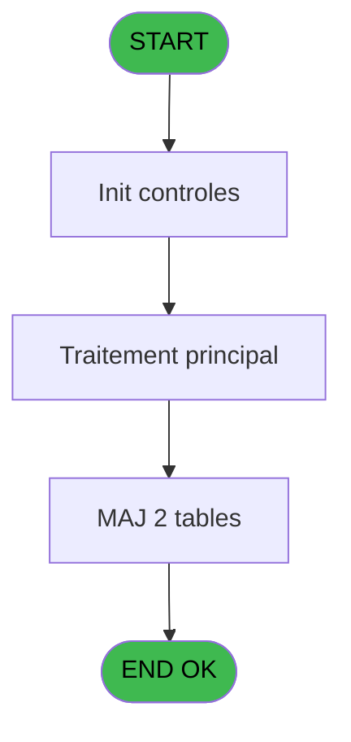
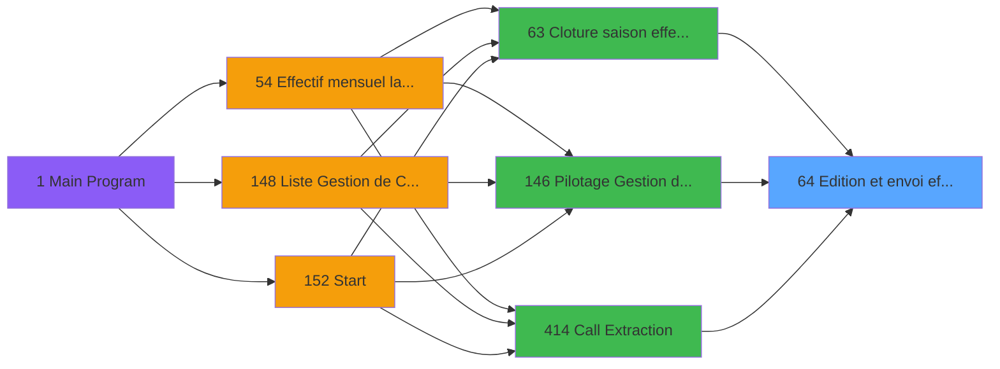
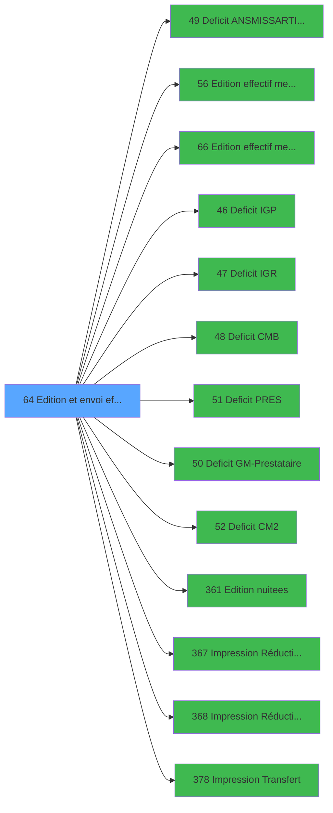

# PBP IDE 64 - Edition et envoi effectif

> **Analyse**: Phases 1-4 2026-02-03 09:04 -> 09:04 (20s) | Assemblage 09:04
> **Pipeline**: V7.2 Enrichi
> **Structure**: 4 onglets (Resume | Ecrans | Donnees | Connexions)

<!-- TAB:Resume -->

## 1. FICHE D'IDENTITE

| Attribut | Valeur |
|----------|--------|
| Projet | PBP |
| IDE Position | 64 |
| Nom Programme | Edition et envoi effectif |
| Fichier source | `Prg_64.xml` |
| Domaine metier | Impression |
| Taches | 4 (0 ecrans visibles) |
| Tables modifiees | 2 |
| Programmes appeles | 13 |

## 2. DESCRIPTION FONCTIONNELLE

**Edition et envoi effectif** assure la gestion complete de ce processus, accessible depuis [Cloture saison effectif (IDE 63)](PBP-IDE-63.md), [Pilotage Gestion de Crise (IDE 146)](PBP-IDE-146.md), [Call Extraction (IDE 414)](PBP-IDE-414.md).

Le flux de traitement s'organise en **1 blocs fonctionnels** :

- **Traitement** (4 taches) : traitements metier divers

**Donnees modifiees** : 2 tables en ecriture (tables_imports, ##_pv_rentals_dat).

Detail : phases du traitement

#### Phase 1 : Traitement (4 taches)

- **64** - Lancement effectif **[[ECRAN]](#ecran-t1)**
- **64.1** - ecrit trace envoi effectif
- **64.2** - par lieu sejour
- **64.3** - suppr fichier html par sejour

Delegue a : [Deficit ANS/MISS/ARTI/DOCT (IDE 49)](PBP-IDE-49.md), [Deficit IGP (IDE 46)](PBP-IDE-46.md), [Deficit IGR (IDE 47)](PBP-IDE-47.md), [Deficit CMB (IDE 48)](PBP-IDE-48.md), [Deficit PRES (IDE 51)](PBP-IDE-51.md), [Deficit GM-Prestataire (IDE 50)](PBP-IDE-50.md), [Deficit CM2 (IDE 52)](PBP-IDE-52.md), [Impression Réduction  VRL (IDE 367)](PBP-IDE-367.md), [Impression Réduction   VSL (IDE 368)](PBP-IDE-368.md)

#### Tables impactees

| Table | Operations | Role metier |
|-------|-----------|-------------|
| tables_imports | R/**W** (2 usages) |  |
| ##_pv_rentals_dat | **W**/L (2 usages) |  |

## 3. BLOCS FONCTIONNELS

### 3.1 Traitement (4 taches)

Traitements internes.

---

#### 64 - Lancement effectif [[ECRAN]](#ecran-t1)

**Role** : Traitement : Lancement effectif.
**Ecran** : 535 x 25 DLU (MDI) | [Voir mockup](#ecran-t1)

3 sous-taches directes

| Tache | Nom | Bloc |
|-------|-----|------|
| [64.1](#t2) | ecrit trace envoi effectif | Traitement |
| [64.2](#t8) | par lieu sejour | Traitement |
| [64.3](#t18) | suppr fichier html par sejour | Traitement |

**Variables liees** : E (V.Existe envoi effectif ?), H (V.Date calc effectif fin saison)
**Delegue a** : [Deficit ANS/MISS/ARTI/DOCT (IDE 49)](PBP-IDE-49.md), [Deficit IGP (IDE 46)](PBP-IDE-46.md), [Deficit IGR (IDE 47)](PBP-IDE-47.md)

---

#### 64.1 - ecrit trace envoi effectif

**Role** : Traitement : ecrit trace envoi effectif.
**Variables liees** : E (V.Existe envoi effectif ?), H (V.Date calc effectif fin saison)
**Delegue a** : [Deficit ANS/MISS/ARTI/DOCT (IDE 49)](PBP-IDE-49.md), [Deficit IGP (IDE 46)](PBP-IDE-46.md), [Deficit IGR (IDE 47)](PBP-IDE-47.md)

---

#### 64.2 - par lieu sejour

**Role** : Traitement : par lieu sejour.
**Variables liees** : C (p.Nombre de lieu de sejour), G (V.Nb lieu sejour)
**Delegue a** : [Deficit ANS/MISS/ARTI/DOCT (IDE 49)](PBP-IDE-49.md), [Deficit IGP (IDE 46)](PBP-IDE-46.md), [Deficit IGR (IDE 47)](PBP-IDE-47.md)

---

#### 64.3 - suppr fichier html par sejour

**Role** : Traitement : suppr fichier html par sejour.
**Variables liees** : C (p.Nombre de lieu de sejour), G (V.Nb lieu sejour)
**Delegue a** : [Deficit ANS/MISS/ARTI/DOCT (IDE 49)](PBP-IDE-49.md), [Deficit IGP (IDE 46)](PBP-IDE-46.md), [Deficit IGR (IDE 47)](PBP-IDE-47.md)

## 5. REGLES METIER

*(Aucune regle metier identifiee)*

## 6. CONTEXTE

- **Appele par**: [Cloture saison effectif (IDE 63)](PBP-IDE-63.md), [Pilotage Gestion de Crise (IDE 146)](PBP-IDE-146.md), [Call Extraction (IDE 414)](PBP-IDE-414.md)
- **Appelle**: 13 programmes | **Tables**: 6 (W:2 R:2 L:4) | **Taches**: 4 | **Expressions**: 81

<!-- TAB:Ecrans -->

## 8. ECRANS

*(Programme sans ecran visible)*

## 9. NAVIGATION

### 9.3 Structure hierarchique (4 taches)

| Position | Tache | Type | Dimensions | Bloc |
|----------|-------|------|------------|------|
| **64.1** | [**Lancement effectif** (64)](#t1) [mockup](#ecran-t1) | MDI | 535x25 | Traitement |
| 64.1.1 | [ecrit trace envoi effectif (64.1)](#t2) | - | - | |
| 64.1.2 | [par lieu sejour (64.2)](#t8) | - | - | |
| 64.1.3 | [suppr fichier html par sejour (64.3)](#t18) | - | - | |

### 9.4 Algorigramme

> **Legende**: Vert = START/END OK | Rouge = END KO | Bleu = Decisions
> *Algorigramme auto-genere. Utiliser `/algorigramme` pour une synthese metier detaillee.*

<!-- TAB:Donnees -->

## 10. TABLES

### Tables utilisees (6)

| ID | Nom | Description | Type | R | W | L | Usages |
|----|-----|-------------|------|---|---|---|--------|
| 69 | initialisation___ini |  | DB | R |   |   | 1 |
| 81 | societe__________soc |  | DB |   |   | L | 1 |
| 118 | tables_imports |  | DB | R | **W** |   | 2 |
| 120 | tables_qualites__qua |  | DB |   |   | L | 1 |
| 372 | pv_budget |  | DB |   |   | L | 1 |
| 838 | ##_pv_rentals_dat |  | DB |   | **W** | L | 2 |

### Colonnes par table (1 / 3 tables avec colonnes identifiees)

Table 69 - initialisation___ini (R) - 1 usages

| Lettre | Variable | Acces | Type |
|--------|----------|-------|------|
| A | p.Date debut | R | Date |
| B | p.Date fin | R | Date |
| C | p.Nombre de lieu de sejour | R | Numeric |
| D | p.cloture ? | R | Logical |
| E | V.Existe envoi effectif ? | R | Logical |
| F | V.Existe qualite GM PRES ? | R | Logical |
| G | V.Nb lieu sejour | R | Numeric |
| H | V.Date calc effectif fin saison | R | Date |

Table 118 - tables_imports (R/**W**) - 2 usages

*Table utilisee uniquement en Link ou aucune colonne Real identifiee dans le DataView.*

Table 838 - ##_pv_rentals_dat (**W**/L) - 2 usages

*Table utilisee uniquement en Link ou aucune colonne Real identifiee dans le DataView.*

## 11. VARIABLES

### 11.1 Parametres entrants (4)

Variables recues du programme appelant ([Cloture saison effectif (IDE 63)](PBP-IDE-63.md)).

| Lettre | Nom | Type | Usage dans |
|--------|-----|------|-----------|
| A | p.Date debut | Date | - |
| B | p.Date fin | Date | - |
| C | p.Nombre de lieu de sejour | Numeric | - |
| D | p.cloture ? | Logical | - |

### 11.2 Variables de session (4)

Variables persistantes pendant toute la session.

| Lettre | Nom | Type | Usage dans |
|--------|-----|------|-----------|
| E | V.Existe envoi effectif ? | Logical | - |
| F | V.Existe qualite GM PRES ? | Logical | - |
| G | V.Nb lieu sejour | Numeric | - |
| H | V.Date calc effectif fin saison | Date | - |

## 12. EXPRESSIONS

**81 / 81 expressions decodees (100%)**

### 12.1 Repartition par type

| Type | Expressions | Regles |
|------|-------------|--------|
| CONCATENATION | 8 | 0 |
| CONSTANTE | 20 | 0 |
| FORMAT | 26 | 0 |
| DATE | 1 | 0 |
| CAST_LOGIQUE | 4 | 0 |
| REFERENCE_VG | 6 | 0 |
| OTHER | 12 | 0 |
| CONDITION | 3 | 0 |
| NEGATION | 1 | 0 |

### 12.2 Expressions cles par type

#### CONCATENATION (8 expressions)

| Type | IDE | Expression | Regle |
|------|-----|------------|-------|
| CONCATENATION | 59 | `Translate('%club_exe%')&'zip -j '&Translate('%club_exportdata%')&'trsft\'&Trim([V])&'_EFF_'&DStr (EOM([BI]),'YYYYMMDD')&' '&Translate('%club_exportdata%')&'trsft\'&Trim([V])&'*.htm'` | - |
| CONCATENATION | 63 | `'cmd /c del /Q '&Trim(Translate('%club_exportdata%'))&'trsft\*.csv'` | - |
| CONCATENATION | 62 | `Translate('%club_exe%')&'zip -j '&Translate('%club_exportdata%')&'trsft\'&Trim([V])&'_EFF_'&DStr (EOM([BI]),'YYYYMMDD')&' '&Translate('%club_exportdata%')&'trsft\'&Trim([V])&'*.csv'` | - |
| CONCATENATION | 60 | `Translate('%club_exe%')&'zip -j '&Translate('%club_exportdata%')&'trsft\'&Trim([V])&'_EFF_'&DStr (EOM([BI]),'YYYYMMDD')&' '&Translate('%club_exportdata%')&'trsft\*.pdf'` | - |
| CONCATENATION | 57 | `'cmd /c del /Q '&Trim(Translate('%club_exportdata%'))&'trsft\*.htm'` | - |
| ... | | *+3 autres* | |

#### CONSTANTE (20 expressions)

| Type | IDE | Expression | Regle |
|------|-----|------------|-------|
| CONSTANTE | 70 | `'ANS'` | - |
| CONSTANTE | 71 | `'MISS'` | - |
| CONSTANTE | 65 | `' and vente_vrl_vsl.vrlvsl_pourcentage_reduction < 100'` | - |
| CONSTANTE | 53 | `'O'` | - |
| CONSTANTE | 64 | `'DOCT'` | - |
| ... | | *+15 autres* | |

#### FORMAT (26 expressions)

| Type | IDE | Expression | Regle |
|------|-----|------------|-------|
| FORMAT | 33 | `Translate('%club_exe%')&'zip -j '&Translate('%club_exportdata%')&'trsft\'&Trim([V])&'_EFF_'&DStr (EOM([BI]),'YYYYMMDD')&' '&Translate('%club_exportdata%')&'trsft\'&Trim([V])&'_EFF_Deficit_ANS_'&Trim(DStr([BI],'YYYYMM'))&'.htm'` | - |
| FORMAT | 34 | `Translate('%club_exe%')&'zip -j '&Translate('%club_exportdata%')&'trsft\'&Trim([V])&'_EFF_'&DStr (EOM([BI]),'YYYYMMDD')&' '&Translate('%club_exportdata%')&'trsft\'&Trim([V])&'_EFF_Deficit_PRES_'&Trim(DStr([BI],'YYYYMM'))&'.htm'` | - |
| FORMAT | 35 | `Translate('%club_exe%')&'zip -j '&Translate('%club_exportdata%')&'trsft\'&Trim([V])&'_EFF_'&DStr (EOM([BI]),'YYYYMMDD')&' '&Translate('%club_exportdata%')&'trsft\'&Trim([V])&'_EFF_Deficit_MISS_'&Trim(DStr([BI],'YYYYMM'))&'.htm'` | - |
| FORMAT | 30 | `Translate('%club_exe%')&'zip -j '&Translate('%club_exportdata%')&'trsft\'&Trim([V])&'_EFF_'&DStr (EOM([BI]),'YYYYMMDD')&' '&Translate('%club_exportdata%')&'trsft\'&Trim([V])&'_EFF_Deficit_IGP_'&Trim(DStr([BI],'YYYYMM'))&'.htm'` | - |
| FORMAT | 31 | `Translate('%club_exe%')&'zip -j '&Translate('%club_exportdata%')&'trsft\'&Trim([V])&'_EFF_'&DStr (EOM([BI]),'YYYYMMDD')&' '&Translate('%club_exportdata%')&'trsft\'&Trim([V])&'_EFF_Deficit_IGR_'&Trim(DStr([BI],'YYYYMM'))&'.htm'` | - |
| ... | | *+21 autres* | |

#### DATE (1 expressions)

| Type | IDE | Expression | Regle |
|------|-----|------------|-------|
| DATE | 10 | `BOM(Date())+1` | - |

#### CAST_LOGIQUE (4 expressions)

| Type | IDE | Expression | Regle |
|------|-----|------------|-------|
| CAST_LOGIQUE | 11 | `'TRUE'LOG` | - |
| CAST_LOGIQUE | 69 | `'TRUE'LOG` | - |
| CAST_LOGIQUE | 1 | `'TRUE'LOG` | - |
| CAST_LOGIQUE | 9 | `'TRUE'LOG` | - |

#### REFERENCE_VG (6 expressions)

| Type | IDE | Expression | Regle |
|------|-----|------------|-------|
| REFERENCE_VG | 48 | `VG71` | - |
| REFERENCE_VG | 54 | `VG74` | - |
| REFERENCE_VG | 76 | `VG71` | - |
| REFERENCE_VG | 12 | `VG41` | - |
| REFERENCE_VG | 21 | `VG47` | - |
| ... | | *+1 autres* | |

#### OTHER (12 expressions)

| Type | IDE | Expression | Regle |
|------|-----|------------|-------|
| OTHER | 73 | `{1,41}` | - |
| OTHER | 67 | `p.Nombre de lieu de se... [C]` | - |
| OTHER | 55 | `NOT(VG74)` | - |
| OTHER | 77 | `VG71 AND VG74` | - |
| OTHER | 75 | `NOT(VG71) AND VG74` | - |
| ... | | *+7 autres* | |

#### CONDITION (3 expressions)

| Type | IDE | Expression | Regle |
|------|-----|------------|-------|
| CONDITION | 68 | `Counter(0)=1` | - |
| CONDITION | 66 | `p.Nombre de lieu de se... [C]<>'N' AND p.Nombre de lieu de se... [C]<>'G'` | - |
| CONDITION | 22 | `(VG43 OR VG71) AND [AP]>1 AND [AU]='O'` | - |

#### NEGATION (1 expressions)

| Type | IDE | Expression | Regle |
|------|-----|------------|-------|
| NEGATION | 44 | `NOT [BK]` | - |

### 12.3 Toutes les expressions (81)

Voir les 81 expressions

#### CONCATENATION (8)

| IDE | Expression Decodee |
|-----|-------------------|
| 56 | `'cmd /c del /Q '&Trim(Translate('%club_exportdata%'))&'trsft\*.zip'` |
| 57 | `'cmd /c del /Q '&Trim(Translate('%club_exportdata%'))&'trsft\*.htm'` |
| 58 | `'cmd /c del /Q '&Trim(Translate('%club_exportdata%'))&'trsft\*.pdf'` |
| 61 | `'cmd /c del /Q '&Trim(Translate('%club_exportdata%'))&'trsft\*.csv'` |
| 63 | `'cmd /c del /Q '&Trim(Translate('%club_exportdata%'))&'trsft\*.csv'` |
| 59 | `Translate('%club_exe%')&'zip -j '&Translate('%club_exportdata%')&'trsft\'&Trim([V])&'_EFF_'&DStr (EOM([BI]),'YYYYMMDD')&' '&Translate('%club_exportdata%')&'trsft\'&Trim([V])&'*.htm'` |
| 60 | `Translate('%club_exe%')&'zip -j '&Translate('%club_exportdata%')&'trsft\'&Trim([V])&'_EFF_'&DStr (EOM([BI]),'YYYYMMDD')&' '&Translate('%club_exportdata%')&'trsft\*.pdf'` |
| 62 | `Translate('%club_exe%')&'zip -j '&Translate('%club_exportdata%')&'trsft\'&Trim([V])&'_EFF_'&DStr (EOM([BI]),'YYYYMMDD')&' '&Translate('%club_exportdata%')&'trsft\'&Trim([V])&'*.csv'` |

#### CONSTANTE (20)

| IDE | Expression Decodee |
|-----|-------------------|
| 13 | `'ANS'` |
| 14 | `'MISS'` |
| 15 | `'ARTI'` |
| 16 | `'PRES'` |
| 18 | `'GM'` |
| 19 | `'PRES'` |
| 23 | `''` |
| 46 | `'T'` |
| 47 | `'Tous'` |
| 52 | `'C'` |
| 53 | `'O'` |
| 64 | `'DOCT'` |
| 65 | `' and vente_vrl_vsl.vrlvsl_pourcentage_reduction < 100'` |
| 70 | `'ANS'` |
| 71 | `'MISS'` |
| 72 | `'ARTI'` |
| 78 | `'C'` |
| 79 | `'O'` |
| 80 | `'DOCT'` |
| 81 | `''` |

#### FORMAT (26)

| IDE | Expression Decodee |
|-----|-------------------|
| 2 | `FileDelete(Translate('%club_exportdata%')&'trsft\'&Trim([V])&'_EFF_effectif_mensuel_'&Trim(DStr([BI],'YYYYMM'))&'.htm')` |
| 3 | `FileDelete(Translate('%club_exportdata%')&'trsft\'&Trim([V])&'_EFF_Deficit_IGP_'&Trim(DStr([BI],'YYYYMM'))&'.htm')` |
| 4 | `FileDelete(Translate('%club_exportdata%')&'trsft\'&Trim([V])&'_EFF_Deficit_IGR_'&Trim(DStr([BI],'YYYYMM'))&'.htm')` |
| 5 | `FileDelete(Translate('%club_exportdata%')&'trsft\'&Trim([V])&'_EFF_Deficit_Rep_Enc_HP_'&Trim(DStr([BI],'YYYYMM'))&'.htm')` |
| 6 | `FileDelete(Translate('%club_exportdata%')&'trsft\'&Trim([V])&'_EFF_Deficit_ANS_'&Trim(DStr([BI],'YYYYMM'))&'.htm')` |
| 7 | `FileDelete(Translate('%club_exportdata%')&'trsft\'&Trim([V])&'_EFF_Deficit_PRES_'&Trim(DStr([BI],'YYYYMM'))&'.htm')` |
| 8 | `FileDelete(Translate('%club_exportdata%')&'trsft\'&Trim([V])&'_EFF_Releves_nuitees_'&Trim(DStr([BI],'YYYYMM'))&'.htm')` |
| 24 | `FileDelete(Translate('%club_exportdata%')&'trsft\'&Trim([V])&'_EFF_Deficit_MISS_'&Trim(DStr([BI],'YYYYMM'))&'.htm')` |
| 25 | `FileDelete(Translate('%club_exportdata%')&'trsft\'&Trim([V])&'_EFF_Deficit_CM2_'&Trim(DStr([BI],'YYYYMM'))&'.htm')` |
| 26 | `Translate('%club_exe%')&'zip -j '&Translate('%club_exportdata%')&'trsft\'&Trim([V])&'_EFF_'&DStr (EOM([BI]),'YYYYMMDD')&' '&Translate('%club_exportdata%')&'trsft\'&Trim([V])&'_EFF_Releves_nuitees_'&Trim(DStr([BI],'YYYYMM'))&'.htm'` |
| 27 | `Translate('%club_exe%')&'zip -j '&Translate('%club_exportdata%')&'trsft\'&Trim([V])&'_EFF_'&DStr (EOM([BI]),'YYYYMMDD')&' '&Translate('%club_exportdata%')&'trsft\'&Trim([V])&'_EFF_effectif_mensuel_comptable_'&Trim(DStr([BI],'YYYYMM'))&'.htm'` |
| 28 | `Translate('%club_exe%')&'zip -j '&Translate('%club_exportdata%')&'trsft\'&Trim([V])&'_EFF_'&DStr (EOM([BI]),'YYYYMMDD')&' '&Translate('%club_exportdata%')&'trsft\'&Trim([V])&'_EFF_effectif_mensuel_operationnel_'&Trim(DStr([BI],'YYYYMM'))&'.htm'` |
| 29 | `Translate('%club_exe%')&'zip -j '&Translate('%club_exportdata%')&'trsft\'&Trim([V])&'_EFF_'&DStr (EOM([BI]),'YYYYMMDD')&' '&Translate('%club_exportdata%')&'trsft\'&Trim([V])&'_EFF_effectif_mensuel_'&Trim(DStr([BI],'YYYYMM'))&'.htm'` |
| 30 | `Translate('%club_exe%')&'zip -j '&Translate('%club_exportdata%')&'trsft\'&Trim([V])&'_EFF_'&DStr (EOM([BI]),'YYYYMMDD')&' '&Translate('%club_exportdata%')&'trsft\'&Trim([V])&'_EFF_Deficit_IGP_'&Trim(DStr([BI],'YYYYMM'))&'.htm'` |
| 31 | `Translate('%club_exe%')&'zip -j '&Translate('%club_exportdata%')&'trsft\'&Trim([V])&'_EFF_'&DStr (EOM([BI]),'YYYYMMDD')&' '&Translate('%club_exportdata%')&'trsft\'&Trim([V])&'_EFF_Deficit_IGR_'&Trim(DStr([BI],'YYYYMM'))&'.htm'` |
| 32 | `Translate('%club_exe%')&'zip -j '&Translate('%club_exportdata%')&'trsft\'&Trim([V])&'_EFF_'&DStr (EOM([BI]),'YYYYMMDD')&' '&Translate('%club_exportdata%')&'trsft\'&Trim([V])&'_EFF_Deficit_Rep_Enc_HP_'&Trim(DStr([BI],'YYYYMM'))&'.htm'` |
| 33 | `Translate('%club_exe%')&'zip -j '&Translate('%club_exportdata%')&'trsft\'&Trim([V])&'_EFF_'&DStr (EOM([BI]),'YYYYMMDD')&' '&Translate('%club_exportdata%')&'trsft\'&Trim([V])&'_EFF_Deficit_ANS_'&Trim(DStr([BI],'YYYYMM'))&'.htm'` |
| 34 | `Translate('%club_exe%')&'zip -j '&Translate('%club_exportdata%')&'trsft\'&Trim([V])&'_EFF_'&DStr (EOM([BI]),'YYYYMMDD')&' '&Translate('%club_exportdata%')&'trsft\'&Trim([V])&'_EFF_Deficit_PRES_'&Trim(DStr([BI],'YYYYMM'))&'.htm'` |
| 35 | `Translate('%club_exe%')&'zip -j '&Translate('%club_exportdata%')&'trsft\'&Trim([V])&'_EFF_'&DStr (EOM([BI]),'YYYYMMDD')&' '&Translate('%club_exportdata%')&'trsft\'&Trim([V])&'_EFF_Deficit_MISS_'&Trim(DStr([BI],'YYYYMM'))&'.htm'` |
| 36 | `Translate('%club_exe%')&'zip -j '&Translate('%club_exportdata%')&'trsft\'&Trim([V])&'_EFF_'&DStr (EOM([BI]),'YYYYMMDD')&' '&Translate('%club_exportdata%')&'trsft\'&Trim([V])&'_EFF_Deficit_CM2_'&Trim(DStr([BI],'YYYYMM'))&'.htm'` |
| 37 | `Translate('%club_exe%')&'zip -j '&Translate('%club_exportdata%')&'trsft\'&Trim([V])&'_EFF_'&DStr (EOM([BI]),'YYYYMMDD')&' '&Trim(Translate('%club_exportdata%'))&'trsft\vrl_reduc_'&Trim([V])&'_'&Trim(DStr(EOM([BI]),'DD_MM_YYYY'))&'.pdf'` |
| 38 | `Translate('%club_exe%')&'zip -j '&Translate('%club_exportdata%')&'trsft\'&Trim([V])&'_EFF_'&DStr (EOM([BI]),'YYYYMMDD')&' '&Trim(Translate('%club_exportdata%'))&'trsft\vsl_reduc_'&Trim([V])&'_'&Trim(DStr(EOM([BI]),'DD_MM_YYYY'))&'.pdf'` |
| 39 | `Translate('%club_exe%')&'zip -j '&Translate('%club_exportdata%')&'trsft\'&Trim([V])&'_EFF_'&DStr (EOM([BI]),'YYYYMMDD')&' '&Trim(Translate('%club_exportdata%'))&'trsft\'&Trim([V])&'_EFF_Transfert_'&Trim(DStr(Date()-2,'YYYYMM'))&'.pdf'` |
| 40 | `FileDelete(Trim(Translate('%club_exportdata%'))&'trsft\vrl_reduc_'&Trim([V])&'_'&Trim(DStr(EOM([BI]),'DD_MM_YYYY'))&'.pdf')` |
| 41 | `FileDelete(Trim(Translate('%club_exportdata%'))&'trsft\vsl_reduc_'&Trim([V])&'_'&Trim(DStr(EOM([BI]),'DD_MM_YYYY'))&'.pdf')` |
| 42 | `FileDelete(Trim(Translate('%club_exportdata%'))&'trsft\'&Trim([V])&'_EFF_Transfert_'&Trim(DStr(Date()-2,'YYYYMM'))&'.pdf')` |

#### DATE (1)

| IDE | Expression Decodee |
|-----|-------------------|
| 10 | `BOM(Date())+1` |

#### CAST_LOGIQUE (4)

| IDE | Expression Decodee |
|-----|-------------------|
| 1 | `'TRUE'LOG` |
| 9 | `'TRUE'LOG` |
| 11 | `'TRUE'LOG` |
| 69 | `'TRUE'LOG` |

#### REFERENCE_VG (6)

| IDE | Expression Decodee |
|-----|-------------------|
| 12 | `VG41` |
| 21 | `VG47` |
| 45 | `VG65` |
| 48 | `VG71` |
| 54 | `VG74` |
| 76 | `VG71` |

#### OTHER (12)

| IDE | Expression Decodee |
|-----|-------------------|
| 17 | `GetParam('SOCIETE')` |
| 20 | `[AO]` |
| 43 | `[BG]` |
| 49 | `VG71 AND VG74` |
| 50 | `NOT(VG71)` |
| 51 | `NOT(VG71) AND VG74` |
| 55 | `NOT(VG74)` |
| 67 | `p.Nombre de lieu de se... [C]` |
| 73 | `{1,41}` |
| 74 | `NOT(VG71)` |
| 75 | `NOT(VG71) AND VG74` |
| 77 | `VG71 AND VG74` |

#### CONDITION (3)

| IDE | Expression Decodee |
|-----|-------------------|
| 22 | `(VG43 OR VG71) AND [AP]>1 AND [AU]='O'` |
| 66 | `p.Nombre de lieu de se... [C]<>'N' AND p.Nombre de lieu de se... [C]<>'G'` |
| 68 | `Counter(0)=1` |

#### NEGATION (1)

| IDE | Expression Decodee |
|-----|-------------------|
| 44 | `NOT [BK]` |

<!-- TAB:Connexions -->

## 13. GRAPHE D'APPELS

### 13.1 Chaine depuis Main (Callers)

Main -> ... -> [Cloture saison effectif (IDE 63)](PBP-IDE-63.md) -> **Edition et envoi effectif (IDE 64)**

Main -> ... -> [Pilotage Gestion de Crise (IDE 146)](PBP-IDE-146.md) -> **Edition et envoi effectif (IDE 64)**

Main -> ... -> [Call Extraction (IDE 414)](PBP-IDE-414.md) -> **Edition et envoi effectif (IDE 64)**

### 13.2 Callers

| IDE | Nom Programme | Nb Appels |
|-----|---------------|-----------|
| [63](PBP-IDE-63.md) | Cloture saison effectif | 2 |
| [146](PBP-IDE-146.md) | Pilotage Gestion de Crise | 1 |
| [414](PBP-IDE-414.md) | Call Extraction | 1 |

### 13.3 Callees (programmes appeles)

### 13.4 Detail Callees avec contexte

| IDE | Nom Programme | Appels | Contexte |
|-----|---------------|--------|----------|
| [49](PBP-IDE-49.md) | Deficit ANS/MISS/ARTI/DOCT | 8 | Sous-programme |
| [56](PBP-IDE-56.md) | Edition effectif mensuel | 4 | Impression ticket/document |
| [66](PBP-IDE-66.md) | Edition effectif mensuel V3 | 4 | Impression ticket/document |
| [46](PBP-IDE-46.md) | Deficit IGP | 2 | Sous-programme |
| [47](PBP-IDE-47.md) | Deficit IGR | 2 | Sous-programme |
| [48](PBP-IDE-48.md) | Deficit CMB | 2 | Sous-programme |
| [51](PBP-IDE-51.md) | Deficit PRES | 2 | Sous-programme |
| [50](PBP-IDE-50.md) | Deficit GM-Prestataire | 1 | Sous-programme |
| [52](PBP-IDE-52.md) | Deficit CM2 | 1 | Sous-programme |
| [361](PBP-IDE-361.md) | Edition nuitees | 1 | Impression ticket/document |
| [367](PBP-IDE-367.md) | Impression Réduction  VRL | 1 | Sous-programme |
| [368](PBP-IDE-368.md) | Impression Réduction   VSL | 1 | Sous-programme |
| [378](PBP-IDE-378.md) |   Impression Transfert | 1 | Transfert donnees |

## 14. RECOMMANDATIONS MIGRATION

### 14.1 Profil du programme

| Metrique | Valeur | Impact migration |
|----------|--------|-----------------|
| Lignes de logique | 161 | Programme compact |
| Expressions | 81 | Logique moderee |
| Tables WRITE | 2 | Impact faible |
| Sous-programmes | 13 | Forte dependance |
| Ecrans visibles | 0 | Ecran unique ou traitement batch |
| Code desactive | 16.1% (26 / 161) | Nettoyer avant migration |
| Regles metier | 0 | Pas de regle identifiee |

### 14.2 Plan de migration par bloc

#### Traitement (4 taches: 1 ecran, 3 traitements)

- **Strategie** : Orchestrateur avec 1 ecrans (Razor/React) et 3 traitements backend (services).
- Les ecrans deviennent des composants UI, les traitements invisibles deviennent des services injectables.
- 13 sous-programme(s) a migrer ou a reutiliser depuis les services existants.
- Decomposer les taches en services unitaires testables.

### 14.3 Dependances critiques

| Dependance | Type | Appels | Impact |
|------------|------|--------|--------|
| tables_imports | Table WRITE (Database) | 1x | Schema + repository |
| ##_pv_rentals_dat | Table WRITE (Database) | 1x | Schema + repository |
| [Deficit ANS/MISS/ARTI/DOCT (IDE 49)](PBP-IDE-49.md) | Sous-programme | 8x | **CRITIQUE** - Sous-programme |
| [Edition effectif mensuel V3 (IDE 66)](PBP-IDE-66.md) | Sous-programme | 4x | **CRITIQUE** - Impression ticket/document |
| [Edition effectif mensuel (IDE 56)](PBP-IDE-56.md) | Sous-programme | 4x | **CRITIQUE** - Impression ticket/document |
| [Deficit CMB (IDE 48)](PBP-IDE-48.md) | Sous-programme | 2x | Haute - Sous-programme |
| [Deficit PRES (IDE 51)](PBP-IDE-51.md) | Sous-programme | 2x | Haute - Sous-programme |
| [Deficit IGP (IDE 46)](PBP-IDE-46.md) | Sous-programme | 2x | Haute - Sous-programme |
| [Deficit IGR (IDE 47)](PBP-IDE-47.md) | Sous-programme | 2x | Haute - Sous-programme |
| [Impression Réduction  VRL (IDE 367)](PBP-IDE-367.md) | Sous-programme | 1x | Normale - Sous-programme |
| [Impression Réduction   VSL (IDE 368)](PBP-IDE-368.md) | Sous-programme | 1x | Normale - Sous-programme |
| [  Impression Transfert (IDE 378)](PBP-IDE-378.md) | Sous-programme | 1x | Normale - Transfert donnees |

---
*Spec DETAILED generee par Pipeline V7.2 - 2026-02-03 09:04*
