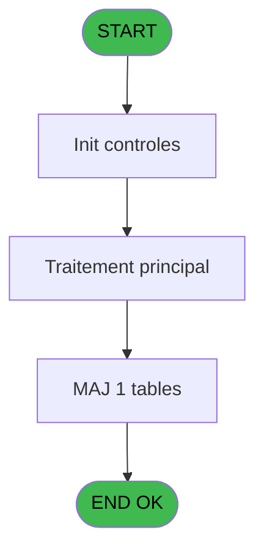

# PBP IDE 65 - Edition effectif quotidien V3

> **Analyse**: Phases 1-4 2026-02-03 09:04 -> 09:05 (22s) | Assemblage 09:05
> **Pipeline**: V7.2 Enrichi
> **Structure**: 4 onglets (Resume | Ecrans | Donnees | Connexions)

<!-- TAB:Resume -->

## 1. FICHE D'IDENTITE

| Attribut | Valeur |
|----------|--------|
| Projet | PBP |
| IDE Position | 65 |
| Nom Programme | Edition effectif quotidien V3 |
| Fichier source | `Prg_65.xml` |
| Domaine metier | Impression |
| Taches | 1 (0 ecrans visibles) |
| Tables modifiees | 1 |
| Programmes appeles | 0 |

## 2. DESCRIPTION FONCTIONNELLE

**Edition effectif quotidien V3** assure la gestion complete de ce processus, accessible depuis [Effectif economat (IDE 53)](PBP-IDE-53.md).

Le flux de traitement s'organise en **1 blocs fonctionnels** :

- **Impression** (1 tache) : generation de tickets et documents

**Donnees modifiees** : 1 tables en ecriture (Table_949).

## 3. BLOCS FONCTIONNELS

### 3.1 Impression (1 tache)

Generation des documents et tickets.

---

#### 65 - Edition effectif quotidien V3

**Role** : Generation du document : Edition effectif quotidien V3.

## 5. REGLES METIER

*(Aucune regle metier identifiee)*

## 6. CONTEXTE

- **Appele par**: [Effectif economat (IDE 53)](PBP-IDE-53.md)
- **Appelle**: 0 programmes | **Tables**: 1 (W:1 R:0 L:0) | **Taches**: 1 | **Expressions**: 213

<!-- TAB:Ecrans -->

## 8. ECRANS

*(Programme sans ecran visible)*

## 9. NAVIGATION

### 9.3 Structure hierarchique (1 tache)

| Position | Tache | Type | Dimensions | Bloc |
|----------|-------|------|------------|------|
| **65.1** | [**Edition effectif quotidien V3** (65)](#t1) | - | - | Impression |

### 9.4 Algorigramme

> **Legende**: Vert = START/END OK | Rouge = END KO | Bleu = Decisions
> *Algorigramme auto-genere. Utiliser `/algorigramme` pour une synthese metier detaillee.*

<!-- TAB:Donnees -->

## 10. TABLES

### Tables utilisees (1)

| ID | Nom | Description | Type | R | W | L | Usages |
|----|-----|-------------|------|---|---|---|--------|
| 949 | Table_949 |  | MEM |   | **W** |   | 1 |

### Colonnes par table (1 / 1 tables avec colonnes identifiees)

Table 949 - Table_949 (**W**) - 1 usages

| Lettre | Variable | Acces | Type |
|--------|----------|-------|------|
| A | P.Date | W | Date |
| B | P.Code village | W | Alpha |
| C | P.Lieu sejour | W | Alpha |
| D | P.Nom lieu | W | Alpha |
| E | GM ORDI prev midi | W | Numeric |
| F | GM ORDI prev soir | W | Numeric |
| G | GM ORDI real midi | W | Numeric |
| H | GM ORDI real soir | W | Numeric |
| I | GM PROP prev midi | W | Numeric |
| J | GM PROP prev soir | W | Numeric |
| K | GM PROP real midi | W | Numeric |
| L | GM PROP real soir | W | Numeric |
| M | GM CLUB prev midi | W | Numeric |
| N | GM CLUB prev soir | W | Numeric |
| O | GM CLUB real midi | W | Numeric |
| P | GM CLUB real soir | W | Numeric |
| Q | GM SEM prev midi | W | Numeric |
| R | GM SEM prev soir | W | Numeric |
| S | GM SEM real midi | W | Numeric |
| T | GM SEM real soir | W | Numeric |
| U | GM VSL prev midi | W | Numeric |
| V | GM VSL prev soir | W | Numeric |
| W | GM VSL real midi | W | Numeric |
| X | GM VSL real soir | W | Numeric |
| Y | Total repas payant prev midi | W | Numeric |
| Z | Total repas payant prev soir | W | Numeric |
| BA | Total repas payant real midi | W | Numeric |
| BB | Total repas payant real soir | W | Numeric |
| BC | Nb JHP prev | W | Numeric |
| BD | NB JHP real | W | Numeric |
| BE | VRL prev midi | W | Numeric |
| BF | VRL prev soir | W | Numeric |
| BG | VRL real midi | W | Numeric |
| BH | VRL real soir | W | Numeric |
| BI | VRL HP CMB prev midi | W | Numeric |
| BJ | VRL HP CMB prev soir | W | Numeric |
| BK | VRL HP CMB real midi | W | Numeric |
| BL | VRL HP CMB real soir | W | Numeric |
| BM | Total repas VRL prev midi | W | Numeric |
| BN | Total repas VRL prev soir | W | Numeric |
| BO | Total repas VRL real midi | W | Numeric |
| BP | Total repas VRL real soir | W | Numeric |
| BQ | Nb JH vrl prev | W | Numeric |
| BR | Nb JH vrl real | W | Numeric |
| BS | Total JHP prev | W | Numeric |
| BT | Total JHP real | W | Numeric |
| BU | GO VILL prev midi | W | Numeric |
| BV | GO VILL prev soir | W | Numeric |
| BW | GO VILL real midi | W | Numeric |
| BX | GO VILL real soir | W | Numeric |
| BY | GO LOC prev midi | W | Numeric |
| BZ | GO LOC prev soir | W | Numeric |
| CA | GO LOC real midi | W | Numeric |
| CB | GO LOC real soir | W | Numeric |
| CC | GO VILL + LOC prev midi | W | Numeric |
| CD | GO VILL + LOC prev soir | W | Numeric |
| CE | GO VILL + LOC real midi | W | Numeric |
| CF | GO VILL + LOC real soir | W | Numeric |
| CG | GO OFFI prev midi | W | Numeric |
| CH | GO OFFI prev soir | W | Numeric |
| CI | GO OFFI real midi | W | Numeric |
| CJ | GO OFFI real soir | W | Numeric |
| CK | GO MARI prev midi | W | Numeric |
| CL | GO MARI prev soir | W | Numeric |
| CM | GO MARI real midi | W | Numeric |
| CN | GO MARI real soir | W | Numeric |
| CO | GE prev midi | W | Numeric |
| CP | GE prev soir | W | Numeric |
| CQ | GE real midi | W | Numeric |
| CR | GE real soir | W | Numeric |
| CS | GO MISS prev midi | W | Numeric |
| CT | GO MISS prev soir | W | Numeric |
| CU | GO MISS real midi | W | Numeric |
| CV | GO MISS real soir | W | Numeric |
| CW | GO ARTI prev midi | W | Numeric |
| CX | GO ARTI prev soir | W | Numeric |
| CY | GO ARTI real midi | W | Numeric |
| CZ | GO ARTI real soir | W | Numeric |
| DA | GO DOCT prev midi | W | Numeric |
| DB | GO DOCT prev soir | W | Numeric |
| DC | GO DOCT real midi | W | Numeric |
| DD | GO DOCT real soir | W | Numeric |
| DE | GO EDUC prev midi | W | Numeric |
| DF | GO EDUC prev soir | W | Numeric |
| DG | GO EDUC real midi | W | Numeric |
| DH | GO EDUC real soir | W | Numeric |
| DI | GO STAG prev midi | W | Numeric |
| DJ | GO STAG prev soir | W | Numeric |
| DK | GO STAG real midi | W | Numeric |
| DL | GO STAG real soir | W | Numeric |
| DM | GO IGP prev midi | W | Numeric |
| DN | GO IGP prev soir | W | Numeric |
| DO | GO IGP real midi | W | Numeric |
| DP | GO IGP real soir | W | Numeric |
| DQ | GO IGP2 prev midi | W | Numeric |
| DR | GO IGP2 prev soir | W | Numeric |
| DS | GO IGP2 real midi | W | Numeric |
| DT | GO IGP2 real soir | W | Numeric |
| DU | Tot GO IGP real midi | W | Numeric |
| DV | Tot GO IGP real soir | W | Numeric |
| DW | GO IGPV prev midi | W | Numeric |
| DX | GO IGPV prev soir | W | Numeric |
| DY | GO IGPV real midi | W | Numeric |
| DZ | GO IGPV real soir | W | Numeric |
| EA | IGR prev midi | W | Numeric |
| EB | IGR prev soir | W | Numeric |
| EC | IGR real midi | W | Numeric |
| ED | IGR real soir | W | Numeric |
| EE | IGR VSHIP prev midi | W | Numeric |
| EF | IGR VSHIP prev soir | W | Numeric |
| EG | IGR VSHIP real midi | W | Numeric |
| EH | IGR VSHIP real soir | W | Numeric |
| EI | GO ANS prev midi | W | Numeric |
| EJ | GO ANS prev soir | W | Numeric |
| EK | GO ANS real midi | W | Numeric |
| EL | GO ANS real soir | W | Numeric |
| EM | EXC real midi | W | Numeric |
| EN | EXC real soir | W | Numeric |
| EO | EXC prev midi | W | Numeric |
| EP | EXC prev soir | W | Numeric |
| EQ | ECH real midi | W | Numeric |
| ER | ECH real soir | W | Numeric |
| ES | ECH prev midi | W | Numeric |
| ET | ECH prev soir | W | Numeric |
| EU | GM SEJ PRES prev midi | W | Numeric |
| EV | GM SEJ PRES prev soir | W | Numeric |
| EW | GM SEJ PRES real midi | W | Numeric |
| EX | GM SEJ PRES real soir | W | Numeric |
| EY | IGR REPAS PRES prev midi | W | Numeric |
| EZ | IGR REPAS PRES prev soir | W | Numeric |
| FA | IGR REPAS PRES real midi | W | Numeric |
| FB | IGR REPAS PRES real soir | W | Numeric |
| FC | Total repas deficit prev midi | W | Numeric |
| FD | Total repas deficit prev soir | W | Numeric |
| FE | Total repas deficit real midi | W | Numeric |
| FF | Total repas deficit real soir | W | Numeric |
| FG | Nb JH deficit prev | W | Numeric |
| FH | NB JH deficit real | W | Numeric |
| FI | Nb repas Total prev midi | W | Numeric |
| FJ | Nb repas Total prev soir | W | Numeric |
| FK | Nb repas Total real midi | W | Numeric |
| FL | Nb repas Total real soir | W | Numeric |
| FM | Nb JH economat prev | W | Numeric |
| FN | Nb JH economat real | W | Numeric |

## 11. VARIABLES

### 11.1 Parametres entrants (4)

Variables recues du programme appelant ([Effectif economat (IDE 53)](PBP-IDE-53.md)).

| Lettre | Nom | Type | Usage dans |
|--------|-----|------|-----------|
| A | P.Date | Date | - |
| B | P.Code village | Alpha | - |
| C | P.Lieu sejour | Alpha | - |
| D | P.Nom lieu | Alpha | - |

### 11.2 Autres (140)

Variables diverses.

| Lettre | Nom | Type | Usage dans |
|--------|-----|------|-----------|
| E | GM ORDI prev midi | Numeric | - |
| F | GM ORDI prev soir | Numeric | - |
| G | GM ORDI real midi | Numeric | 7x refs |
| H | GM ORDI real soir | Numeric | - |
| I | GM PROP prev midi | Numeric | - |
| J | GM PROP prev soir | Numeric | - |
| K | GM PROP real midi | Numeric | - |
| L | GM PROP real soir | Numeric | 2x refs |
| M | GM CLUB prev midi | Numeric | 2x refs |
| N | GM CLUB prev soir | Numeric | 2x refs |
| O | GM CLUB real midi | Numeric | 2x refs |
| P | GM CLUB real soir | Numeric | 2x refs |
| Q | GM SEM prev midi | Numeric | 2x refs |
| R | GM SEM prev soir | Numeric | 2x refs |
| S | GM SEM real midi | Numeric | 2x refs |
| T | GM SEM real soir | Numeric | 2x refs |
| U | GM VSL prev midi | Numeric | 2x refs |
| V | GM VSL prev soir | Numeric | 2x refs |
| W | GM VSL real midi | Numeric | 2x refs |
| X | GM VSL real soir | Numeric | 2x refs |
| Y | Total repas payant prev midi | Numeric | - |
| Z | Total repas payant prev soir | Numeric | - |
| BA | Total repas payant real midi | Numeric | - |
| BB | Total repas payant real soir | Numeric | - |
| BC | Nb JHP prev | Numeric | 2x refs |
| BD | NB JHP real | Numeric | 2x refs |
| BE | VRL prev midi | Numeric | 3x refs |
| BF | VRL prev soir | Numeric | 3x refs |
| BG | VRL real midi | Numeric | 3x refs |
| BH | VRL real soir | Numeric | 2x refs |
| BI | VRL HP CMB prev midi | Numeric | 2x refs |
| BJ | VRL HP CMB prev soir | Numeric | 2x refs |
| BK | VRL HP CMB real midi | Numeric | 2x refs |
| BL | VRL HP CMB real soir | Numeric | 2x refs |
| BM | Total repas VRL prev midi | Numeric | 2x refs |
| BN | Total repas VRL prev soir | Numeric | 2x refs |
| BO | Total repas VRL real midi | Numeric | 2x refs |
| BP | Total repas VRL real soir | Numeric | - |
| BQ | Nb JH vrl prev | Numeric | - |
| BR | Nb JH vrl real | Numeric | - |
| BS | Total JHP prev | Numeric | - |
| BT | Total JHP real | Numeric | 2x refs |
| BU | GO VILL prev midi | Numeric | 2x refs |
| BV | GO VILL prev soir | Numeric | 2x refs |
| BW | GO VILL real midi | Numeric | 2x refs |
| BX | GO VILL real soir | Numeric | 2x refs |
| BY | GO LOC prev midi | Numeric | 2x refs |
| BZ | GO LOC prev soir | Numeric | 2x refs |
| CA | GO LOC real midi | Numeric | 2x refs |
| CB | GO LOC real soir | Numeric | 3x refs |
| CC | GO VILL + LOC prev midi | Numeric | 3x refs |
| CD | GO VILL + LOC prev soir | Numeric | 2x refs |
| CE | GO VILL + LOC real midi | Numeric | 2x refs |
| CF | GO VILL + LOC real soir | Numeric | 2x refs |
| CG | GO OFFI prev midi | Numeric | 2x refs |
| CH | GO OFFI prev soir | Numeric | 2x refs |
| CI | GO OFFI real midi | Numeric | 2x refs |
| CJ | GO OFFI real soir | Numeric | 2x refs |
| CK | GO MARI prev midi | Numeric | 2x refs |
| CL | GO MARI prev soir | Numeric | 2x refs |
| CM | GO MARI real midi | Numeric | 2x refs |
| CN | GO MARI real soir | Numeric | 2x refs |
| CO | GE prev midi | Numeric | 2x refs |
| CP | GE prev soir | Numeric | 2x refs |
| CQ | GE real midi | Numeric | 2x refs |
| CR | GE real soir | Numeric | 1x refs |
| CS | GO MISS prev midi | Numeric | 1x refs |
| CT | GO MISS prev soir | Numeric | - |
| CU | GO MISS real midi | Numeric | - |
| CV | GO MISS real soir | Numeric | - |
| CW | GO ARTI prev midi | Numeric | 2x refs |
| CX | GO ARTI prev soir | Numeric | 2x refs |
| CY | GO ARTI real midi | Numeric | 2x refs |
| CZ | GO ARTI real soir | Numeric | 2x refs |
| DA | GO DOCT prev midi | Numeric | - |
| DB | GO DOCT prev soir | Numeric | - |
| DC | GO DOCT real midi | Numeric | - |
| DD | GO DOCT real soir | Numeric | - |
| DE | GO EDUC prev midi | Numeric | - |
| DF | GO EDUC prev soir | Numeric | - |
| DG | GO EDUC real midi | Numeric | 2x refs |
| DH | GO EDUC real soir | Numeric | 2x refs |
| DI | GO STAG prev midi | Numeric | 2x refs |
| DJ | GO STAG prev soir | Numeric | 2x refs |
| DK | GO STAG real midi | Numeric | 2x refs |
| DL | GO STAG real soir | Numeric | 2x refs |
| DM | GO IGP prev midi | Numeric | 2x refs |
| DN | GO IGP prev soir | Numeric | 2x refs |
| DO | GO IGP real midi | Numeric | 4x refs |
| DP | GO IGP real soir | Numeric | 3x refs |
| DQ | GO IGP2 prev midi | Numeric | 2x refs |
| DR | GO IGP2 prev soir | Numeric | - |
| DS | GO IGP2 real midi | Numeric | 2x refs |
| DT | GO IGP2 real soir | Numeric | - |
| DU | Tot GO IGP real midi | Numeric | 1x refs |
| DV | Tot GO IGP real soir | Numeric | - |
| DW | GO IGPV prev midi | Numeric | - |
| DX | GO IGPV prev soir | Numeric | - |
| DY | GO IGPV real midi | Numeric | - |
| DZ | GO IGPV real soir | Numeric | 1x refs |
| EA | IGR prev midi | Numeric | 1x refs |
| EB | IGR prev soir | Numeric | 1x refs |
| EC | IGR real midi | Numeric | 1x refs |
| ED | IGR real soir | Numeric | 1x refs |
| EE | IGR VSHIP prev midi | Numeric | 1x refs |
| EF | IGR VSHIP prev soir | Numeric | 1x refs |
| EG | IGR VSHIP real midi | Numeric | 1x refs |
| EH | IGR VSHIP real soir | Numeric | 2x refs |
| EI | GO ANS prev midi | Numeric | 2x refs |
| EJ | GO ANS prev soir | Numeric | 2x refs |
| EK | GO ANS real midi | Numeric | 2x refs |
| EL | GO ANS real soir | Numeric | - |
| EM | EXC real midi | Numeric | 3x refs |
| EN | EXC real soir | Numeric | - |
| EO | EXC prev midi | Numeric | - |
| EP | EXC prev soir | Numeric | - |
| EQ | ECH real midi | Numeric | 2x refs |
| ER | ECH real soir | Numeric | 2x refs |
| ES | ECH prev midi | Numeric | 2x refs |
| ET | ECH prev soir | Numeric | 2x refs |
| EU | GM SEJ PRES prev midi | Numeric | 2x refs |
| EV | GM SEJ PRES prev soir | Numeric | 2x refs |
| EW | GM SEJ PRES real midi | Numeric | 2x refs |
| EX | GM SEJ PRES real soir | Numeric | 2x refs |
| EY | IGR REPAS PRES prev midi | Numeric | 2x refs |
| EZ | IGR REPAS PRES prev soir | Numeric | 2x refs |
| FA | IGR REPAS PRES real midi | Numeric | 2x refs |
| FB | IGR REPAS PRES real soir | Numeric | 2x refs |
| FC | Total repas deficit prev midi | Numeric | - |
| FD | Total repas deficit prev soir | Numeric | - |
| FE | Total repas deficit real midi | Numeric | - |
| FF | Total repas deficit real soir | Numeric | - |
| FG | Nb JH deficit prev | Numeric | 2x refs |
| FH | NB JH deficit real | Numeric | 2x refs |
| FI | Nb repas Total prev midi | Numeric | 2x refs |
| FJ | Nb repas Total prev soir | Numeric | 2x refs |
| FK | Nb repas Total real midi | Numeric | 2x refs |
| FL | Nb repas Total real soir | Numeric | - |
| FM | Nb JH economat prev | Numeric | - |
| FN | Nb JH economat real | Numeric | - |

Toutes les 144 variables (liste complete)

| Cat | Lettre | Nom Variable | Type |
|-----|--------|--------------|------|
| P0 | **A** | P.Date | Date |
| P0 | **B** | P.Code village | Alpha |
| P0 | **C** | P.Lieu sejour | Alpha |
| P0 | **D** | P.Nom lieu | Alpha |
| Autre | **E** | GM ORDI prev midi | Numeric |
| Autre | **F** | GM ORDI prev soir | Numeric |
| Autre | **G** | GM ORDI real midi | Numeric |
| Autre | **H** | GM ORDI real soir | Numeric |
| Autre | **I** | GM PROP prev midi | Numeric |
| Autre | **J** | GM PROP prev soir | Numeric |
| Autre | **K** | GM PROP real midi | Numeric |
| Autre | **L** | GM PROP real soir | Numeric |
| Autre | **M** | GM CLUB prev midi | Numeric |
| Autre | **N** | GM CLUB prev soir | Numeric |
| Autre | **O** | GM CLUB real midi | Numeric |
| Autre | **P** | GM CLUB real soir | Numeric |
| Autre | **Q** | GM SEM prev midi | Numeric |
| Autre | **R** | GM SEM prev soir | Numeric |
| Autre | **S** | GM SEM real midi | Numeric |
| Autre | **T** | GM SEM real soir | Numeric |
| Autre | **U** | GM VSL prev midi | Numeric |
| Autre | **V** | GM VSL prev soir | Numeric |
| Autre | **W** | GM VSL real midi | Numeric |
| Autre | **X** | GM VSL real soir | Numeric |
| Autre | **Y** | Total repas payant prev midi | Numeric |
| Autre | **Z** | Total repas payant prev soir | Numeric |
| Autre | **BA** | Total repas payant real midi | Numeric |
| Autre | **BB** | Total repas payant real soir | Numeric |
| Autre | **BC** | Nb JHP prev | Numeric |
| Autre | **BD** | NB JHP real | Numeric |
| Autre | **BE** | VRL prev midi | Numeric |
| Autre | **BF** | VRL prev soir | Numeric |
| Autre | **BG** | VRL real midi | Numeric |
| Autre | **BH** | VRL real soir | Numeric |
| Autre | **BI** | VRL HP CMB prev midi | Numeric |
| Autre | **BJ** | VRL HP CMB prev soir | Numeric |
| Autre | **BK** | VRL HP CMB real midi | Numeric |
| Autre | **BL** | VRL HP CMB real soir | Numeric |
| Autre | **BM** | Total repas VRL prev midi | Numeric |
| Autre | **BN** | Total repas VRL prev soir | Numeric |
| Autre | **BO** | Total repas VRL real midi | Numeric |
| Autre | **BP** | Total repas VRL real soir | Numeric |
| Autre | **BQ** | Nb JH vrl prev | Numeric |
| Autre | **BR** | Nb JH vrl real | Numeric |
| Autre | **BS** | Total JHP prev | Numeric |
| Autre | **BT** | Total JHP real | Numeric |
| Autre | **BU** | GO VILL prev midi | Numeric |
| Autre | **BV** | GO VILL prev soir | Numeric |
| Autre | **BW** | GO VILL real midi | Numeric |
| Autre | **BX** | GO VILL real soir | Numeric |
| Autre | **BY** | GO LOC prev midi | Numeric |
| Autre | **BZ** | GO LOC prev soir | Numeric |
| Autre | **CA** | GO LOC real midi | Numeric |
| Autre | **CB** | GO LOC real soir | Numeric |
| Autre | **CC** | GO VILL + LOC prev midi | Numeric |
| Autre | **CD** | GO VILL + LOC prev soir | Numeric |
| Autre | **CE** | GO VILL + LOC real midi | Numeric |
| Autre | **CF** | GO VILL + LOC real soir | Numeric |
| Autre | **CG** | GO OFFI prev midi | Numeric |
| Autre | **CH** | GO OFFI prev soir | Numeric |
| Autre | **CI** | GO OFFI real midi | Numeric |
| Autre | **CJ** | GO OFFI real soir | Numeric |
| Autre | **CK** | GO MARI prev midi | Numeric |
| Autre | **CL** | GO MARI prev soir | Numeric |
| Autre | **CM** | GO MARI real midi | Numeric |
| Autre | **CN** | GO MARI real soir | Numeric |
| Autre | **CO** | GE prev midi | Numeric |
| Autre | **CP** | GE prev soir | Numeric |
| Autre | **CQ** | GE real midi | Numeric |
| Autre | **CR** | GE real soir | Numeric |
| Autre | **CS** | GO MISS prev midi | Numeric |
| Autre | **CT** | GO MISS prev soir | Numeric |
| Autre | **CU** | GO MISS real midi | Numeric |
| Autre | **CV** | GO MISS real soir | Numeric |
| Autre | **CW** | GO ARTI prev midi | Numeric |
| Autre | **CX** | GO ARTI prev soir | Numeric |
| Autre | **CY** | GO ARTI real midi | Numeric |
| Autre | **CZ** | GO ARTI real soir | Numeric |
| Autre | **DA** | GO DOCT prev midi | Numeric |
| Autre | **DB** | GO DOCT prev soir | Numeric |
| Autre | **DC** | GO DOCT real midi | Numeric |
| Autre | **DD** | GO DOCT real soir | Numeric |
| Autre | **DE** | GO EDUC prev midi | Numeric |
| Autre | **DF** | GO EDUC prev soir | Numeric |
| Autre | **DG** | GO EDUC real midi | Numeric |
| Autre | **DH** | GO EDUC real soir | Numeric |
| Autre | **DI** | GO STAG prev midi | Numeric |
| Autre | **DJ** | GO STAG prev soir | Numeric |
| Autre | **DK** | GO STAG real midi | Numeric |
| Autre | **DL** | GO STAG real soir | Numeric |
| Autre | **DM** | GO IGP prev midi | Numeric |
| Autre | **DN** | GO IGP prev soir | Numeric |
| Autre | **DO** | GO IGP real midi | Numeric |
| Autre | **DP** | GO IGP real soir | Numeric |
| Autre | **DQ** | GO IGP2 prev midi | Numeric |
| Autre | **DR** | GO IGP2 prev soir | Numeric |
| Autre | **DS** | GO IGP2 real midi | Numeric |
| Autre | **DT** | GO IGP2 real soir | Numeric |
| Autre | **DU** | Tot GO IGP real midi | Numeric |
| Autre | **DV** | Tot GO IGP real soir | Numeric |
| Autre | **DW** | GO IGPV prev midi | Numeric |
| Autre | **DX** | GO IGPV prev soir | Numeric |
| Autre | **DY** | GO IGPV real midi | Numeric |
| Autre | **DZ** | GO IGPV real soir | Numeric |
| Autre | **EA** | IGR prev midi | Numeric |
| Autre | **EB** | IGR prev soir | Numeric |
| Autre | **EC** | IGR real midi | Numeric |
| Autre | **ED** | IGR real soir | Numeric |
| Autre | **EE** | IGR VSHIP prev midi | Numeric |
| Autre | **EF** | IGR VSHIP prev soir | Numeric |
| Autre | **EG** | IGR VSHIP real midi | Numeric |
| Autre | **EH** | IGR VSHIP real soir | Numeric |
| Autre | **EI** | GO ANS prev midi | Numeric |
| Autre | **EJ** | GO ANS prev soir | Numeric |
| Autre | **EK** | GO ANS real midi | Numeric |
| Autre | **EL** | GO ANS real soir | Numeric |
| Autre | **EM** | EXC real midi | Numeric |
| Autre | **EN** | EXC real soir | Numeric |
| Autre | **EO** | EXC prev midi | Numeric |
| Autre | **EP** | EXC prev soir | Numeric |
| Autre | **EQ** | ECH real midi | Numeric |
| Autre | **ER** | ECH real soir | Numeric |
| Autre | **ES** | ECH prev midi | Numeric |
| Autre | **ET** | ECH prev soir | Numeric |
| Autre | **EU** | GM SEJ PRES prev midi | Numeric |
| Autre | **EV** | GM SEJ PRES prev soir | Numeric |
| Autre | **EW** | GM SEJ PRES real midi | Numeric |
| Autre | **EX** | GM SEJ PRES real soir | Numeric |
| Autre | **EY** | IGR REPAS PRES prev midi | Numeric |
| Autre | **EZ** | IGR REPAS PRES prev soir | Numeric |
| Autre | **FA** | IGR REPAS PRES real midi | Numeric |
| Autre | **FB** | IGR REPAS PRES real soir | Numeric |
| Autre | **FC** | Total repas deficit prev midi | Numeric |
| Autre | **FD** | Total repas deficit prev soir | Numeric |
| Autre | **FE** | Total repas deficit real midi | Numeric |
| Autre | **FF** | Total repas deficit real soir | Numeric |
| Autre | **FG** | Nb JH deficit prev | Numeric |
| Autre | **FH** | NB JH deficit real | Numeric |
| Autre | **FI** | Nb repas Total prev midi | Numeric |
| Autre | **FJ** | Nb repas Total prev soir | Numeric |
| Autre | **FK** | Nb repas Total real midi | Numeric |
| Autre | **FL** | Nb repas Total real soir | Numeric |
| Autre | **FM** | Nb JH economat prev | Numeric |
| Autre | **FN** | Nb JH economat real | Numeric |

## 12. EXPRESSIONS

**213 / 213 expressions decodees (100%)**

### 12.1 Repartition par type

| Type | Expressions | Regles |
|------|-------------|--------|
| CALCULATION | 144 | 0 |
| CONDITION | 64 | 0 |
| FORMAT | 4 | 0 |
| REFERENCE_VG | 1 | 0 |

### 12.2 Expressions cles par type

#### CALCULATION (144 expressions)

| Type | IDE | Expression | Regle |
|------|-----|------------|-------|
| CALCULATION | 101 | `[AR]+[AT]` | - |
| CALCULATION | 100 | `[AI]+[AK]` | - |
| CALCULATION | 103 | `([AL]+[AM])/2` | - |
| CALCULATION | 102 | `[AS]+[AU]` | - |
| CALCULATION | 99 | `[AH]+[AJ]` | - |
| ... | | *+139 autres* | |

#### CONDITION (64 expressions)

| Type | IDE | Expression | Regle |
|------|-----|------------|-------|
| CONDITION | 161 | `[FR]='IGR' AND [FS]='VSP'  AND [FT]='DEJ'` | - |
| CONDITION | 162 | `[FR]='IGR' AND [FS]='VSP'  AND [FT]='DIN'` | - |
| CONDITION | 159 | `[FR]='GM' AND [FS]='IGPV' AND [FT]='DEJ'` | - |
| CONDITION | 160 | `[FR]='GM' AND [FS]='IGPV' AND [FT]='DIN'` | - |
| CONDITION | 170 | `[FR]='IGR' AND [FS]='EXC' AND [FT]='DEJ'` | - |
| ... | | *+59 autres* | |

#### FORMAT (4 expressions)

| Type | IDE | Expression | Regle |
|------|-----|------------|-------|
| FORMAT | 5 | `'c:\temp\'&Trim(Tot GO IGP real midi [DU])&IF(EXC real midi [EM]<>'','_'&Trim(EXC real midi [EM])&'_','_')&'effectif_quotidien_'&Trim(DStr(Date(),'YYYYMMDD'))&'.htm'` | - |
| FORMAT | 167 | `DStr(GM ORDI real midi [G],'DD/MM/YYYY')` | - |
| FORMAT | 1 | `DStr(GM ORDI real midi [G]-1,'DD/MM/YYYY')` | - |
| FORMAT | 2 | `DStr(GM ORDI real midi [G]+1,'DD/MM/YYYY')` | - |

#### REFERENCE_VG (1 expressions)

| Type | IDE | Expression | Regle |
|------|-----|------------|-------|
| REFERENCE_VG | 6 | `VG37` | - |

### 12.3 Toutes les expressions (213)

Voir les 213 expressions

#### CALCULATION (144)

| IDE | Expression Decodee |
|-----|-------------------|
| 3 | `GM ORDI real midi [G]-1` |
| 4 | `GM ORDI real midi [G]+1` |
| 7 | `GM PROP real soir [L]+[FV]` |
| 8 | `IGR VSHIP prev soir [EF]+[FV]` |
| 9 | `IGR prev soir [EB]+[FV]` |
| 10 | `GO OFFI real soir [CJ]+[FV]` |
| 11 | `GO IGP real midi [DO]+[FV]` |
| 12 | `GO LOC real soir [CB]+[FV]` |
| 13 | `GO VILL real soir [BX]+[FV]` |
| 14 | `Total JHP real [BT]+[FV]` |
| 15 | `VRL HP CMB real soir [BL]+[FV]` |
| 16 | `VRL real soir [BH]+[FV]` |
| 17 | `NB JHP real [BD]+[FV]` |
| 18 | `[AZ]+[FV]` |
| 19 | `GO STAG real midi [DK]+[FV]` |
| 20 | `GO EDUC real midi [DG]+[FV]` |
| 21 | `[AJ]+[FV]` |
| 22 | `[AH]+[FV]` |
| 23 | `[AB]+[FV]` |
| 24 | `GM VSL real soir [X]+[FV]` |
| 25 | `GM SEM real soir [T]+[FV]` |
| 26 | `GM CLUB real soir [P]+[FV]` |
| 27 | `GO VILL + LOC real soir [CF]+[FV]` |
| 28 | `GM CLUB prev midi [M]+[FV]` |
| 29 | `IGR VSHIP real midi [EG]+[FV]` |
| 30 | `IGR real midi [EC]+[FV]` |
| 31 | `GO MARI prev midi [CK]+[FV]` |
| 32 | `GO IGP real soir [DP]+[FV]` |
| 33 | `GO VILL + LOC prev midi [CC]+[FV]` |
| 34 | `GO LOC prev midi [BY]+[FV]` |
| 35 | `GO VILL prev midi [BU]+[FV]` |
| 36 | `Total repas VRL prev midi [BM]+[FV]` |
| 37 | `VRL HP CMB prev midi [BI]+[FV]` |
| 38 | `VRL prev midi [BE]+[FV]` |
| 39 | `Total repas payant rea... [BA]+[FV]` |
| 40 | `GO STAG real soir [DL]+[FV]` |
| 41 | `GO EDUC real soir [DH]+[FV]` |
| 42 | `[AK]+[FV]` |
| 43 | `[AI]+[FV]` |
| 44 | `[AC]+[FV]` |
| 45 | `Total repas payant pre... [Y]+[FV]` |
| 46 | `GM VSL prev midi [U]+[FV]` |
| 47 | `GM SEM prev midi [Q]+[FV]` |
| 48 | `GO OFFI prev midi [CG]+[FV]` |
| 49 | `GM CLUB prev soir [N]+[FU]` |
| 50 | `IGR real soir [ED]+[FU]` |
| 51 | `GO IGPV real soir [DZ]+[FU]` |
| 52 | `GO MARI prev soir [CL]+[FU]` |
| 53 | `GO IGP2 prev midi [DQ]+[FU]` |
| 54 | `GO VILL + LOC prev soir [CD]+[FU]` |
| 55 | `GO LOC prev soir [BZ]+[FU]` |
| 56 | `GO VILL prev soir [BV]+[FU]` |
| 57 | `Total repas VRL prev soir [BN]+[FU]` |
| 58 | `VRL HP CMB prev soir [BJ]+[FU]` |
| 59 | `VRL prev soir [BF]+[FU]` |
| 60 | `Total repas payant rea... [BB]+[FU]` |
| 61 | `GO IGP prev midi [DM]+[FU]` |
| 62 | `GO STAG prev midi [DI]+[FU]` |
| 63 | `[AT]+[FU]` |
| 64 | `[AR]+[FU]` |
| 65 | `[AS]+[FU]` |
| 66 | `[AD]+[FU]` |
| 67 | `Total repas payant pre... [Z]+[FU]` |
| 68 | `GM VSL prev soir [V]+[FU]` |
| 69 | `GM SEM prev soir [R]+[FU]` |
| 70 | `GO OFFI prev soir [CH]+[FU]` |
| 71 | `GM CLUB real midi [O]+[FU]` |
| 72 | `IGR VSHIP prev midi [EE]+[FU]` |
| 73 | `IGR prev midi [EA]+[FU]` |
| 74 | `GO MARI real midi [CM]+[FU]` |
| 75 | `GO IGP2 real midi [DS]+[FU]` |
| 76 | `GO VILL + LOC real midi [CE]+[FU]` |
| 77 | `GO LOC real midi [CA]+[FU]` |
| 78 | `GO VILL real midi [BW]+[FU]` |
| 79 | `Total repas VRL real midi [BO]+[FU]` |
| 80 | `VRL HP CMB real midi [BK]+[FU]` |
| 81 | `VRL real midi [BG]+[FU]` |
| 82 | `Nb JHP prev [BC]+[FU]` |
| 83 | `GO IGP prev soir [DN]+[FU]` |
| 84 | `GO STAG prev soir [DJ]+[FU]` |
| 85 | `[AU]+[FU]` |
| 86 | `[AE]+[FU]` |
| 87 | `[AA]+[FU]` |
| 88 | `GM VSL real midi [W]+[FU]` |
| 89 | `GM SEM real midi [S]+[FU]` |
| 90 | `GO OFFI real midi [CI]+[FU]` |
| 91 | `GM PROP real soir [L]+GM CLUB real soir [P]+GM SEM real soir [T]+GM VSL real soir [X]+[AB]` |
| 92 | `GM CLUB prev midi [M]+GM SEM prev midi [Q]+GM VSL prev midi [U]+Total repas payant pre... [Y]+[AC]` |
| 93 | `GM CLUB prev soir [N]+GM SEM prev soir [R]+GM VSL prev soir [V]+Total repas payant pre... [Z]+[AD]` |
| 94 | `GM CLUB real midi [O]+GM SEM real midi [S]+GM VSL real midi [W]+[AA]+[AE]` |
| 95 | `(GO ARTI prev midi [CW]+GO ARTI prev soir [CX])/2` |
| 96 | `(GO ARTI real midi [CY]+GO ARTI real soir [CZ])/2` |
| 97 | `GO LOC real soir [CB]+GO IGP real midi [DO]` |
| 98 | `GO VILL + LOC prev midi [CC]+GO IGP real soir [DP]` |
| 99 | `[AH]+[AJ]` |
| 100 | `[AI]+[AK]` |
| 101 | `[AR]+[AT]` |
| 102 | `[AS]+[AU]` |
| 103 | `([AL]+[AM])/2` |
| 104 | `([AN]+[AO])/2` |
| 105 | `GO EDUC real midi [DG]+GO STAG real midi [DK]` |
| 106 | `GO EDUC real soir [DH]+GO STAG real soir [DL]` |
| 107 | `GO STAG prev midi [DI]+GO IGP prev midi [DM]` |
| 108 | `GO STAG prev soir [DJ]+GO IGP prev soir [DN]` |
| 109 | `[AV]+ECH real midi [EQ]+GM SEJ PRES prev midi [EU]+[AZ]+NB JHP real [BD]+VRL real soir [BH]+VRL HP CMB real soir [BL]+Total JHP real [BT]+GO VILL real soir [BX]+GO LOC real soir [CB]+GO IGP real midi [DO]+IGR REPAS PRES prev midi [EY]+GO VILL + LOC real soir [CF]+Total repas deficit pr... [FD]+GO OFFI real soir [CJ]+IGR VSHIP real soir [EH]+NB JH deficit real [FH]` |
| 110 | `[AW]+ECH real soir [ER]+GM SEJ PRES prev soir [EV]+Total repas payant rea... [BA]+VRL prev midi [BE]+VRL HP CMB prev midi [BI]+Total repas VRL prev midi [BM]+GO VILL prev midi [BU]+GO LOC prev midi [BY]+GO VILL + LOC prev midi [CC]+GO IGP real soir [DP]+IGR REPAS PRES prev soir [EZ]+GO OFFI prev midi [CG]+Total repas deficit re... [FE]+GO MARI prev midi [CK]+GO ANS prev midi [EI]+Nb repas Total prev midi [FI]` |
| 111 | `[AX]+ECH prev midi [ES]+GM SEJ PRES real midi [EW]+Total repas payant rea... [BB]+VRL prev soir [BF]+VRL HP CMB prev soir [BJ]+Total repas VRL prev soir [BN]+GO VILL prev soir [BV]+GO LOC prev soir [BZ]+[GJ]+IGR REPAS PRES real midi [FA]+GO OFFI prev soir [CH]+Total repas deficit re... [FF]+GO MARI prev soir [CL]+GO ANS prev soir [EJ]+Nb repas Total prev soir [FJ]` |
| 112 | `[AY]+ECH prev soir [ET]+GM SEJ PRES real soir [EX]+Nb JHP prev [BC]+VRL real midi [BG]+VRL HP CMB real midi [BK]+Total repas VRL real midi [BO]+GO VILL real midi [BW]+GO LOC real midi [CA]+[GI]+IGR REPAS PRES real soir [FB]+GO OFFI real midi [CI]+Nb JH deficit prev [FG]+GO MARI real midi [CM]+GO ANS real midi [EK]+Nb repas Total real midi [FK]` |
| 113 | `(GO MARI real soir [CN]+GE prev midi [CO])/2` |
| 114 | `(GE prev soir [CP]+GE real midi [CQ])/2` |
| 115 | `GO ARTI prev midi [CW]+[AL]+GO MARI real soir [CN]` |
| 116 | `GO ARTI prev soir [CX]+[AM]+GE prev midi [CO]` |
| 117 | `GO ARTI real midi [CY]+[AN]+GE prev soir [CP]` |
| 118 | `GO ARTI real soir [CZ]+[AO]+GE real midi [CQ]` |
| 119 | `[AF]+[AP]+GE real soir [CR]` |
| 120 | `[AG]+[AQ]+GO MISS prev midi [CS]` |
| 168 | `[AG]+[AQ]` |
| 169 | `[AF]+[AP]` |
| 180 | `GO ANS prev soir [EJ]+[FU]` |
| 181 | `Nb repas Total prev soir [FJ]+[FU]` |
| 182 | `GO ANS real midi [EK]+[FU]` |
| 183 | `Nb repas Total real midi [FK]+[FU]` |
| 184 | `IGR VSHIP real soir [EH]+[FV]` |
| 185 | `NB JH deficit real [FH]+[FV]` |
| 186 | `GO ANS prev midi [EI]+[FV]` |
| 187 | `Nb repas Total prev midi [FI]+[FV]` |
| 190 | `ECH prev midi [ES]+[FU]` |
| 191 | `ECH prev soir [ET]+[FU]` |
| 192 | `GM SEJ PRES real midi [EW]+[FU]` |
| 193 | `GM SEJ PRES real soir [EX]+[FU]` |
| 194 | `IGR REPAS PRES real midi [FA]+[FU]` |
| 195 | `IGR REPAS PRES real soir [FB]+[FU]` |
| 196 | `Total repas deficit re... [FF]+[FU]` |
| 197 | `Nb JH deficit prev [FG]+[FU]` |
| 198 | `ECH real midi [EQ]+[FU]` |
| 199 | `ECH real soir [ER]+[FV]` |
| 200 | `GM SEJ PRES prev midi [EU]+[FV]` |
| 201 | `GM SEJ PRES prev soir [EV]+[FV]` |
| 202 | `IGR REPAS PRES prev midi [EY]+[FV]` |
| 203 | `IGR REPAS PRES prev soir [EZ]+[FV]` |
| 204 | `Total repas deficit pr... [FD]+[FV]` |
| 205 | `Total repas deficit re... [FE]+[FV]` |
| 210 | `GO VILL + LOC prev soir [CD]+GO IGP2 prev midi [DQ]` |
| 211 | `GO VILL + LOC real midi [CE]+GO IGP2 real midi [DS]` |

#### CONDITION (64)

| IDE | Expression Decodee |
|-----|-------------------|
| 165 | `[FQ]=GM ORDI real midi [G]-1` |
| 166 | `[FQ]=GM ORDI real midi [G]+1` |
| 121 | `[FR]='GM' AND [FS]='ORDI' AND [FT]='DEJ'` |
| 122 | `[FR]='GM' AND [FS]='ORDI' AND [FT]='DIN'` |
| 123 | `[FR]='GM' AND [FS]='PROP' AND [FT]='DEJ'` |
| 124 | `[FR]='GM' AND [FS]='PROP' AND [FT]='DIN'` |
| 125 | `[FR]='GM' AND [FS]='CLUB' AND [FT]='DEJ'` |
| 126 | `[FR]='GM' AND [FS]='CLUB' AND [FT]='DIN'` |
| 127 | `[FR]='GM' AND [FS]='SEM' AND [FT]='DEJ'` |
| 128 | `[FR]='GM' AND [FS]='SEM' AND [FT]='DIN'` |
| 129 | `[FR]='GM' AND [FS]='VSL'  AND [FT]='DEJ'` |
| 130 | `[FR]='GM' AND [FS]='VSL'  AND [FT]='DIN'` |
| 131 | `[FR]='VRL' AND [FS]='' AND [FT]='DEJ'` |
| 132 | `[FR]='VRL' AND [FS]='' AND [FT]='DIN'` |
| 133 | `[FR]='VRL' AND [FS]='CMB' AND [FT]='DEJ'` |
| 134 | `[FR]='VRL' AND [FS]='CMB' AND [FT]='DIN'` |
| 135 | `[FR]='GO' AND [FS]='VILL' AND [FT]='DEJ'` |
| 136 | `[FR]='GO' AND [FS]='VILL' AND [FT]='DIN'` |
| 137 | `[FR]='GO' AND [FS]='LOC' AND [FT]='DEJ'` |
| 138 | `[FR]='GO' AND [FS]='LOC' AND [FT]='DIN'` |
| 139 | `[FR]='GO' AND [FS]='OFFI' AND [FT]='DEJ'` |
| 140 | `[FR]='GO' AND [FS]='OFFI' AND [FT]='DIN'` |
| 141 | `[FR]='GO' AND [FS]='MARI' AND [FT]='DEJ'` |
| 142 | `[FR]='GO' AND [FS]='MARI' AND [FT]='DIN'` |
| 143 | `[FR]='GO' AND [FS]='GE' AND [FT]='DEJ'` |
| 144 | `[FR]='GO' AND [FS]='GE' AND [FT]='DIN'` |
| 145 | `[FR]='GO' AND [FS]='MISS' AND [FT]='DEJ'` |
| 146 | `[FR]='GO' AND [FS]='MISS' AND [FT]='DIN'` |
| 147 | `[FR]='GO' AND [FS]='ARTI' AND [FT]='DEJ'` |
| 148 | `[FR]='GO' AND [FS]='ARTI' AND [FT]='DIN'` |
| 149 | `[FR]='GO' AND [FS]='DOCT' AND [FT]='DEJ'` |
| 150 | `[FR]='GO' AND [FS]='DOCT' AND [FT]='DIN'` |
| 151 | `[FR]='GO' AND [FS]='EDUC' AND [FT]='DEJ'` |
| 152 | `[FR]='GO' AND [FS]='EDUC' AND [FT]='DIN'` |
| 153 | `[FR]='GO' AND [FS]='STAG' AND [FT]='DEJ'` |
| 154 | `[FR]='GO' AND [FS]='STAG' AND [FT]='DIN'` |
| 155 | `[FR]='GM' AND [FS]='IGP'  AND [FT]='DEJ'` |
| 156 | `[FR]='GM' AND [FS]='IGP'  AND [FT]='DIN'` |
| 157 | `[FR]='GM' AND [FS]='IGP2'  AND [FT]='DEJ'` |
| 158 | `[FR]='GM' AND [FS]='IGP2'  AND [FT]='DIN'` |
| 159 | `[FR]='GM' AND [FS]='IGPV' AND [FT]='DEJ'` |
| 160 | `[FR]='GM' AND [FS]='IGPV' AND [FT]='DIN'` |
| 161 | `[FR]='IGR' AND [FS]='VSP'  AND [FT]='DEJ'` |
| 162 | `[FR]='IGR' AND [FS]='VSP'  AND [FT]='DIN'` |
| 163 | `[FR]='GO' AND [FS]='ANS' AND [FT]='DEJ'` |
| 164 | `[FR]='GO' AND [FS]='ANS' AND [FT]='DIN'` |
| 170 | `[FR]='IGR' AND [FS]='EXC' AND [FT]='DEJ'` |
| 171 | `[FR]='IGR' AND [FS]='EXC' AND [FT]='DIN'` |
| 172 | `[FR]='IGR' AND [FS]='ECH' AND [FT]='DEJ'` |
| 173 | `[FR]='IGR' AND [FS]='ECH' AND [FT]='DIN'` |
| 174 | `IN([FR],'GM','IGR') AND [FS]='PRES' AND [FT]='DEJ'` |
| 175 | `IN([FR],'GM','IGR') AND [FS]='PRES' AND [FT]='DIN'` |
| 176 | `[FR]='GM' AND [FS]='PRES' AND [FT]='DEJ'` |
| 177 | `[FR]='GM' AND [FS]='PRES' AND [FT]='DIN'` |
| 178 | `[FR]='IGR' AND [FS]='PRES' AND [FT]='DEJ'` |
| 179 | `[FR]='IGR' AND [FS]='PRES' AND [FT]='DIN'` |
| 188 | `CndRange(EXC real midi [EM]<>'',EXC real midi [EM])` |
| 189 | `EXC real midi [EM]<>''` |
| 206 | `[FR]='GM' AND [FS]='PRES' AND [FT]='DEJ'` |
| 207 | `[FR]='GM' AND [FS]='PRES' AND [FT]='DIN'` |
| 208 | `[FR]='IGR' AND [FS]='PRES' AND [FT]='DEJ'` |
| 209 | `[FR]='IGR' AND [FS]='PRES' AND [FT]='DIN'` |
| 212 | `[FR]='IGR' AND NOT IN([FS],'PRES','ECH','EXC','VSP') AND [FT]='DEJ'` |
| 213 | `[FR]='IGR' AND NOT IN([FS],'PRES','ECH','EXC','VSP') AND [FT]='DIN'` |

#### FORMAT (4)

| IDE | Expression Decodee |
|-----|-------------------|
| 1 | `DStr(GM ORDI real midi [G]-1,'DD/MM/YYYY')` |
| 2 | `DStr(GM ORDI real midi [G]+1,'DD/MM/YYYY')` |
| 5 | `'c:\temp\'&Trim(Tot GO IGP real midi [DU])&IF(EXC real midi [EM]<>'','_'&Trim(EXC real midi [EM])&'_','_')&'effectif_quotidien_'&Trim(DStr(Date(),'YYYYMMDD'))&'.htm'` |
| 167 | `DStr(GM ORDI real midi [G],'DD/MM/YYYY')` |

#### REFERENCE_VG (1)

| IDE | Expression Decodee |
|-----|-------------------|
| 6 | `VG37` |

<!-- TAB:Connexions -->

## 13. GRAPHE D'APPELS

### 13.1 Chaine depuis Main (Callers)

Main -> ... -> [Effectif economat (IDE 53)](PBP-IDE-53.md) -> **Edition effectif quotidien V3 (IDE 65)**

### 13.2 Callers

| IDE | Nom Programme | Nb Appels |
|-----|---------------|-----------|
| [53](PBP-IDE-53.md) | Effectif economat | 2 |

### 13.3 Callees (programmes appeles)

### 13.4 Detail Callees avec contexte

| IDE | Nom Programme | Appels | Contexte |
|-----|---------------|--------|----------|
| - | (aucun) | - | - |

## 14. RECOMMANDATIONS MIGRATION

### 14.1 Profil du programme

| Metrique | Valeur | Impact migration |
|----------|--------|-----------------|
| Lignes de logique | 327 | Taille moyenne |
| Expressions | 213 | Beaucoup de logique conditionnelle |
| Tables WRITE | 1 | Impact faible |
| Sous-programmes | 0 | Peu de dependances |
| Ecrans visibles | 0 | Ecran unique ou traitement batch |
| Code desactive | 1.2% (4 / 327) | Code sain |
| Regles metier | 0 | Pas de regle identifiee |

### 14.2 Plan de migration par bloc

#### Impression (1 tache: 0 ecran, 1 traitement)

- **Strategie** : Templates HTML -> PDF via wkhtmltopdf ou Puppeteer.
- `PrintService` injectable avec choix imprimante

### 14.3 Dependances critiques

| Dependance | Type | Appels | Impact |
|------------|------|--------|--------|
| Table_949 | Table WRITE (Memory) | 1x | Schema + repository |

---
*Spec DETAILED generee par Pipeline V7.2 - 2026-02-03 09:05*
