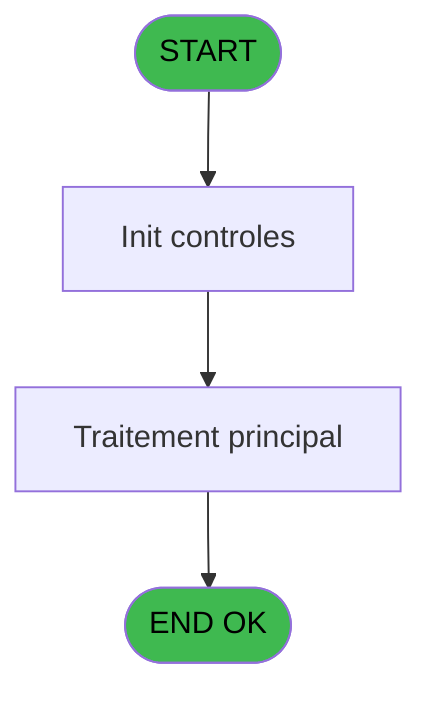
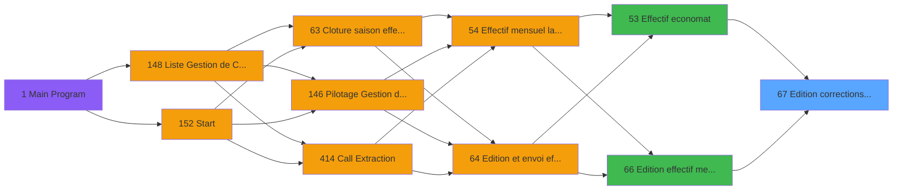

# PBP IDE 67 - Edition corrections effectifV3

> **Analyse**: Phases 1-4 2026-02-03 09:05 -> 09:06 (20s) | Assemblage 09:06
> **Pipeline**: V7.2 Enrichi
> **Structure**: 4 onglets (Resume | Ecrans | Donnees | Connexions)

<!-- TAB:Resume -->

## 1. FICHE D'IDENTITE

| Attribut | Valeur |
|----------|--------|
| Projet | PBP |
| IDE Position | 67 |
| Nom Programme | Edition corrections effectifV3 |
| Fichier source | `Prg_67.xml` |
| Domaine metier | Impression |
| Taches | 4 (0 ecrans visibles) |
| Tables modifiees | 0 |
| Programmes appeles | 0 |

## 2. DESCRIPTION FONCTIONNELLE

**Edition corrections effectifV3** assure la gestion complete de ce processus, accessible depuis [Effectif economat (IDE 53)](PBP-IDE-53.md), [Edition effectif mensuel V3 (IDE 66)](PBP-IDE-66.md).

Le flux de traitement s'organise en **2 blocs fonctionnels** :

- **Traitement** (3 taches) : traitements metier divers
- **Impression** (1 tache) : generation de tickets et documents

Detail : phases du traitement

#### Phase 1 : Impression (1 tache)

- **67** - Edition corrections effectifV3

#### Phase 2 : Traitement (3 taches)

- **67.1** - Repas
- **67.2** - Personnes
- **67.3** - Qualites

## 3. BLOCS FONCTIONNELS

### 3.1 Impression (1 tache)

Generation des documents et tickets.

---

#### 67 - Edition corrections effectifV3

**Role** : Generation du document : Edition corrections effectifV3.

### 3.2 Traitement (3 taches)

Traitements internes.

---

#### 67.1 - Repas

**Role** : Traitement : Repas.

---

#### 67.2 - Personnes

**Role** : Traitement : Personnes.

---

#### 67.3 - Qualites

**Role** : Traitement : Qualites.

## 5. REGLES METIER

*(Aucune regle metier identifiee)*

## 6. CONTEXTE

- **Appele par**: [Effectif economat (IDE 53)](PBP-IDE-53.md), [Edition effectif mensuel V3 (IDE 66)](PBP-IDE-66.md)
- **Appelle**: 0 programmes | **Tables**: 4 (W:0 R:3 L:2) | **Taches**: 4 | **Expressions**: 15

<!-- TAB:Ecrans -->

## 8. ECRANS

*(Programme sans ecran visible)*

## 9. NAVIGATION

### 9.3 Structure hierarchique (4 taches)

| Position | Tache | Type | Dimensions | Bloc |
|----------|-------|------|------------|------|
| **67.1** | [**Edition corrections effectifV3** (67)](#t1) | - | - | Impression |
| **67.2** | [**Repas** (67.1)](#t2) | - | - | Traitement |
| 67.2.1 | [Personnes (67.2)](#t3) | - | - | |
| 67.2.2 | [Qualites (67.3)](#t4) | - | - | |

### 9.4 Algorigramme

> **Legende**: Vert = START/END OK | Rouge = END KO | Bleu = Decisions
> *Algorigramme auto-genere. Utiliser `/algorigramme` pour une synthese metier detaillee.*

<!-- TAB:Donnees -->

## 10. TABLES

### Tables utilisees (4)

| ID | Nom | Description | Type | R | W | L | Usages |
|----|-----|-------------|------|---|---|---|--------|
| 825 | fac_hebergement_pro | Hebergement (chambres) | DB | R |   |   | 1 |
| 831 | import_go_erreur_affection |  | DB | R |   |   | 1 |
| 834 | tpe_par_terminal |  | DB |   |   | L | 1 |
| 949 | Table_949 |  | MEM | R |   | L | 2 |

### Colonnes par table (1 / 3 tables avec colonnes identifiees)

Table 825 - fac_hebergement_pro (R) - 1 usages

*Table utilisee uniquement en Link ou aucune colonne Real identifiee dans le DataView.*

Table 831 - import_go_erreur_affection (R) - 1 usages

*Table utilisee uniquement en Link ou aucune colonne Real identifiee dans le DataView.*

Table 949 - Table_949 (R/L) - 2 usages

| Lettre | Variable | Acces | Type |
|--------|----------|-------|------|
| A | V.Total ajust midi | R | Numeric |
| B | V.Total ajust soir | R | Numeric |

## 11. VARIABLES

### 11.1 Parametres entrants (7)

Variables recues du programme appelant ([Effectif economat (IDE 53)](PBP-IDE-53.md)).

| Lettre | Nom | Type | Usage dans |
|--------|-----|------|-----------|
| A | P.Date debut | Date | - |
| B | P.Date fin | Date | - |
| C | P.Existe correctif ? | Logical | - |
| D | P.Lieu sejour | Alpha | 2x parametre entrant |
| E | P.Premier lieu sejour | Alpha | - |
| F | P.Nom lieu | Alpha | - |
| G | P.Lieu Sejour Saisie | Logical | - |

### 11.2 Variables de session (2)

Variables persistantes pendant toute la session.

| Lettre | Nom | Type | Usage dans |
|--------|-----|------|-----------|
| H | V.Clause where lieu sejour | Alpha | - |
| I | V.Clause where lieu sejour repa | Alpha | - |

## 12. EXPRESSIONS

**15 / 15 expressions decodees (100%)**

### 12.1 Repartition par type

| Type | Expressions | Regles |
|------|-------------|--------|
| CONDITION | 5 | 0 |
| FORMAT | 1 | 0 |
| DATE | 1 | 0 |
| CAST_LOGIQUE | 2 | 0 |
| OTHER | 4 | 0 |
| CONCATENATION | 1 | 0 |
| STRING | 1 | 0 |

### 12.2 Expressions cles par type

#### CONDITION (5 expressions)

| Type | IDE | Expression | Regle |
|------|-----|------------|-------|
| CONDITION | 11 | `{1,4}<>''` | - |
| CONDITION | 13 | `[AG]<>0` | - |
| CONDITION | 6 | `CndRange({1,4}<>'',{1,4})` | - |
| CONDITION | 12 | `[S]<=[AH]-2` | - |
| CONDITION | 9 | `CASE([AA],'DEJ','Midi','DIN','Soir','DDE','Midi et soir','')` | - |

#### FORMAT (1 expressions)

| Type | IDE | Expression | Regle |
|------|-----|------------|-------|
| FORMAT | 1 | `'c:\temp\'&Trim(VG33)&IF(P.Lieu sejour [D]<>'','_'&Trim(P.Lieu sejour [D])&'_','_')&'EFF_Correctifs_'&Trim(DStr(Date(),'YYYYMM'))&'.htm'` | - |

#### DATE (1 expressions)

| Type | IDE | Expression | Regle |
|------|-----|------------|-------|
| DATE | 14 | `Date()` | - |

#### CAST_LOGIQUE (2 expressions)

| Type | IDE | Expression | Regle |
|------|-----|------------|-------|
| CAST_LOGIQUE | 5 | `'TRUE'LOG` | - |
| CAST_LOGIQUE | 2 | `'FALSE'LOG` | - |

#### OTHER (4 expressions)

| Type | IDE | Expression | Regle |
|------|-----|------------|-------|
| OTHER | 7 | `[V]` | - |
| OTHER | 15 | `{1,1}` | - |
| OTHER | 3 | `{1,1}` | - |
| OTHER | 4 | `{1,2}` | - |

#### CONCATENATION (1 expressions)

| Type | IDE | Expression | Regle |
|------|-----|------------|-------|
| CONCATENATION | 8 | `Trim(P.Lieu sejour [D])&' '&Trim([W])` | - |

#### STRING (1 expressions)

| Type | IDE | Expression | Regle |
|------|-----|------------|-------|
| STRING | 10 | `Trim(VG37)` | - |

<!-- TAB:Connexions -->

## 13. GRAPHE D'APPELS

### 13.1 Chaine depuis Main (Callers)

Main -> ... -> [Effectif economat (IDE 53)](PBP-IDE-53.md) -> **Edition corrections effectifV3 (IDE 67)**

Main -> ... -> [Edition effectif mensuel V3 (IDE 66)](PBP-IDE-66.md) -> **Edition corrections effectifV3 (IDE 67)**

### 13.2 Callers

| IDE | Nom Programme | Nb Appels |
|-----|---------------|-----------|
| [53](PBP-IDE-53.md) | Effectif economat | 2 |
| [66](PBP-IDE-66.md) | Edition effectif mensuel V3 | 1 |

### 13.3 Callees (programmes appeles)

### 13.4 Detail Callees avec contexte

| IDE | Nom Programme | Appels | Contexte |
|-----|---------------|--------|----------|
| - | (aucun) | - | - |

## 14. RECOMMANDATIONS MIGRATION

### 14.1 Profil du programme

| Metrique | Valeur | Impact migration |
|----------|--------|-----------------|
| Lignes de logique | 83 | Programme compact |
| Expressions | 15 | Peu de logique |
| Tables WRITE | 0 | Impact faible |
| Sous-programmes | 0 | Peu de dependances |
| Ecrans visibles | 0 | Ecran unique ou traitement batch |
| Code desactive | 0% (0 / 83) | Code sain |
| Regles metier | 0 | Pas de regle identifiee |

### 14.2 Plan de migration par bloc

#### Impression (1 tache: 0 ecran, 1 traitement)

- **Strategie** : Templates HTML -> PDF via wkhtmltopdf ou Puppeteer.
- `PrintService` injectable avec choix imprimante

#### Traitement (3 taches: 0 ecran, 3 traitements)

- **Strategie** : 3 service(s) backend injectable(s) (Domain Services).
- Decomposer les taches en services unitaires testables.

### 14.3 Dependances critiques

| Dependance | Type | Appels | Impact |
|------------|------|--------|--------|

---
*Spec DETAILED generee par Pipeline V7.2 - 2026-02-03 09:06*
