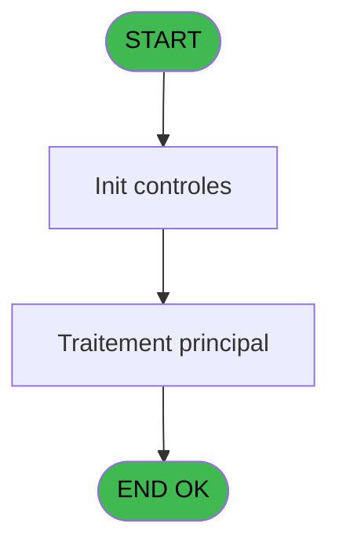
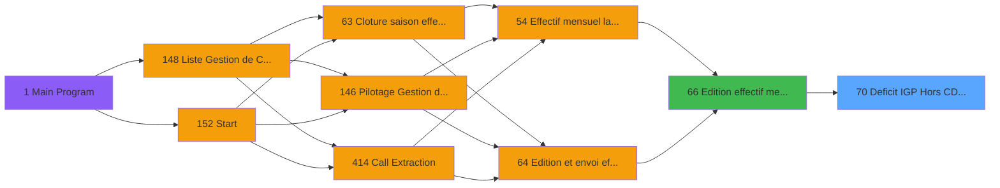

# PBP IDE 70 - Deficit IGP Hors CDV V3

> **Analyse**: Phases 1-4 2026-02-03 09:07 -> 09:07 (21s) | Assemblage 09:07
> **Pipeline**: V7.2 Enrichi
> **Structure**: 4 onglets (Resume | Ecrans | Donnees | Connexions)

<!-- TAB:Resume -->

## 1. FICHE D'IDENTITE

| Attribut | Valeur |
|----------|--------|
| Projet | PBP |
| IDE Position | 70 |
| Nom Programme | Deficit IGP Hors CDV V3 |
| Fichier source | `Prg_70.xml` |
| Domaine metier | General |
| Taches | 1 (0 ecrans visibles) |
| Tables modifiees | 0 |
| Programmes appeles | 0 |

## 2. DESCRIPTION FONCTIONNELLE

**Deficit IGP Hors CDV V3** assure la gestion complete de ce processus, accessible depuis [Edition effectif mensuel V3 (IDE 66)](PBP-IDE-66.md).

Le flux de traitement s'organise en **1 blocs fonctionnels** :

- **Traitement** (1 tache) : traitements metier divers

**Logique metier** : 2 regles identifiees couvrant conditions metier.

## 3. BLOCS FONCTIONNELS

### 3.1 Traitement (1 tache)

Traitements internes.

---

#### 70 - Deficit IGP Hors CDV V3

**Role** : Traitement : Deficit IGP Hors CDV V3.

## 5. REGLES METIER

2 regles identifiees:

### Autres (2 regles)

#### [RM-001] Si [AQ]<P.Gestion crise ? [F] alors P.Gestion crise ? [F] sinon [AQ])

| Element | Detail |
|---------|--------|
| **Condition** | `[AQ]<P.Gestion crise ? [F]` |
| **Si vrai** | P.Gestion crise ? [F] |
| **Si faux** | [AQ]) |
| **Variables** | F (P.Gestion crise ?) |
| **Expression source** | Expression 22 : `IF([AQ]<P.Gestion crise ? [F],P.Gestion crise ? [F],[AQ])` |
| **Exemple** | Si [AQ]<P.Gestion crise ? [F] → P.Gestion crise ? [F]. Sinon → [AQ]) |

#### [RM-002] Si [AS]>V.Nb JH du mois [G] alors V.Nb JH du mois [G] sinon [AS])

| Element | Detail |
|---------|--------|
| **Condition** | `[AS]>V.Nb JH du mois [G]` |
| **Si vrai** | V.Nb JH du mois [G] |
| **Si faux** | [AS]) |
| **Variables** | G (V.Nb JH du mois) |
| **Expression source** | Expression 23 : `IF([AS]>V.Nb JH du mois [G],V.Nb JH du mois [G],[AS])` |
| **Exemple** | Si [AS]>V.Nb JH du mois [G] → V.Nb JH du mois [G]. Sinon → [AS]) |

## 6. CONTEXTE

- **Appele par**: [Edition effectif mensuel V3 (IDE 66)](PBP-IDE-66.md)
- **Appelle**: 0 programmes | **Tables**: 3 (W:0 R:1 L:2) | **Taches**: 1 | **Expressions**: 38

<!-- TAB:Ecrans -->

## 8. ECRANS

*(Programme sans ecran visible)*

## 9. NAVIGATION

### 9.3 Structure hierarchique (1 tache)

| Position | Tache | Type | Dimensions | Bloc |
|----------|-------|------|------------|------|
| **70.1** | [**Deficit IGP Hors CDV V3** (70)](#t1) | - | - | Traitement |

### 9.4 Algorigramme

> **Legende**: Vert = START/END OK | Rouge = END KO | Bleu = Decisions
> *Algorigramme auto-genere. Utiliser `/algorigramme` pour une synthese metier detaillee.*

<!-- TAB:Donnees -->

## 10. TABLES

### Tables utilisees (3)

| ID | Nom | Description | Type | R | W | L | Usages |
|----|-----|-------------|------|---|---|---|--------|
| 802 | type_prestation | Prestations/services vendus | DB |   |   | L | 1 |
| 834 | tpe_par_terminal |  | DB | R |   |   | 1 |
| 949 | Table_949 |  | MEM |   |   | L | 1 |

### Colonnes par table (1 / 1 tables avec colonnes identifiees)

Table 834 - tpe_par_terminal (R) - 1 usages

| Lettre | Variable | Acces | Type |
|--------|----------|-------|------|
| A | P.Date debut | R | Date |
| B | P.Date fin | R | Date |
| C | P.Code village | R | Alpha |
| D | P.Lieu sejour | R | Alpha |
| E | P.Nom lieu sejour | R | Alpha |
| F | P.Gestion crise ? | R | Logical |
| G | V.Nb JH du mois | R | Numeric |
| H | V.Total JH | R | Numeric |
| I | V.Date debut | R | Date |
| J | V.Date fin | R | Date |
| K | V.Date debut premiere periode | R | Date |
| L | V.Date fin derniere periode | R | Date |
| M | V.Date debut sej | R | Date |
| N | V.Date fin sej | R | Date |
| O | V.Heure debut premiere periode | R | Alpha |
| P | V.Heure fin derniere periode | R | Alpha |

## 11. VARIABLES

### 11.1 Parametres entrants (6)

Variables recues du programme appelant ([Edition effectif mensuel V3 (IDE 66)](PBP-IDE-66.md)).

| Lettre | Nom | Type | Usage dans |
|--------|-----|------|-----------|
| A | P.Date debut | Date | 1x parametre entrant |
| B | P.Date fin | Date | 1x parametre entrant |
| C | P.Code village | Alpha | 1x parametre entrant |
| D | P.Lieu sejour | Alpha | - |
| E | P.Nom lieu sejour | Alpha | - |
| F | P.Gestion crise ? | Logical | 4x parametre entrant |

### 11.2 Variables de session (10)

Variables persistantes pendant toute la session.

| Lettre | Nom | Type | Usage dans |
|--------|-----|------|-----------|
| G | V.Nb JH du mois | Numeric | 2x session |
| H | V.Total JH | Numeric | - |
| I | V.Date debut | Date | - |
| J | V.Date fin | Date | - |
| K | V.Date debut premiere periode | Date | - |
| L | V.Date fin derniere periode | Date | - |
| M | V.Date debut sej | Date | - |
| N | V.Date fin sej | Date | - |
| O | V.Heure debut premiere periode | Alpha | - |
| P | V.Heure fin derniere periode | Alpha | - |

Toutes les 16 variables (liste complete)

| Cat | Lettre | Nom Variable | Type |
|-----|--------|--------------|------|
| P0 | **A** | P.Date debut | Date |
| P0 | **B** | P.Date fin | Date |
| P0 | **C** | P.Code village | Alpha |
| P0 | **D** | P.Lieu sejour | Alpha |
| P0 | **E** | P.Nom lieu sejour | Alpha |
| P0 | **F** | P.Gestion crise ? | Logical |
| V. | **G** | V.Nb JH du mois | Numeric |
| V. | **H** | V.Total JH | Numeric |
| V. | **I** | V.Date debut | Date |
| V. | **J** | V.Date fin | Date |
| V. | **K** | V.Date debut premiere periode | Date |
| V. | **L** | V.Date fin derniere periode | Date |
| V. | **M** | V.Date debut sej | Date |
| V. | **N** | V.Date fin sej | Date |
| V. | **O** | V.Heure debut premiere periode | Alpha |
| V. | **P** | V.Heure fin derniere periode | Alpha |

## 12. EXPRESSIONS

**38 / 38 expressions decodees (100%)**

### 12.1 Repartition par type

| Type | Expressions | Regles |
|------|-------------|--------|
| CALCULATION | 2 | 0 |
| CONDITION | 10 | 2 |
| CONSTANTE | 6 | 0 |
| FORMAT | 1 | 0 |
| OTHER | 18 | 0 |
| STRING | 1 | 0 |

### 12.2 Expressions cles par type

#### CALCULATION (2 expressions)

| Type | IDE | Expression | Regle |
|------|-----|------------|-------|
| CALCULATION | 38 | `[AO]+(([EF]+[EJ])/2)` | - |
| CALCULATION | 16 | `[AN]+[AO]` | - |

#### CONDITION (10 expressions)

| Type | IDE | Expression | Regle |
|------|-----|------------|-------|
| CONDITION | 23 | `IF([AS]>V.Nb JH du mois [G],V.Nb JH du mois [G],[AS])` | [RM-002](#rm-RM-002) |
| CONDITION | 22 | `IF([AQ]<P.Gestion crise ? [F],P.Gestion crise ? [F],[AQ])` | [RM-001](#rm-RM-001) |
| CONDITION | 30 | `[AQ]<[DG] OR [DG]=0` | - |
| CONDITION | 27 | `[BW]>[DE] OR [DE]=0` | - |
| CONDITION | 33 | `[AO]<>0` | - |
| ... | | *+5 autres* | |

#### CONSTANTE (6 expressions)

| Type | IDE | Expression | Regle |
|------|-----|------------|-------|
| CONSTANTE | 4 | `'IGP Hors CDV'` | - |
| CONSTANTE | 21 | `0` | - |
| CONSTANTE | 32 | `''` | - |
| CONSTANTE | 1 | `'Invitant'` | - |
| CONSTANTE | 2 | `'Invités gratuits pensions Hors Chef de village'` | - |
| ... | | *+1 autres* | |

#### FORMAT (1 expressions)

| Type | IDE | Expression | Regle |
|------|-----|------------|-------|
| FORMAT | 5 | `Trim(Translate('%club_exportdata%'))&'trsft\'&Trim([BU])&IF([CT]<>'','_'&Trim([CT])&'_','_')&'EFF_Deficit_IGP_'&IF([DF],Trim(DStr(Date()-2,'YYYYMM')),Trim(DStr(Date(),'YYYYMM')))&'.htm'` | - |

#### OTHER (18 expressions)

| Type | IDE | Expression | Regle |
|------|-----|------------|-------|
| OTHER | 25 | `[BW]` | - |
| OTHER | 28 | `[AQ]` | - |
| OTHER | 18 | `V.Nb JH du mois [G]` | - |
| OTHER | 24 | `[BV]` | - |
| OTHER | 29 | `[AS]` | - |
| ... | | *+13 autres* | |

#### STRING (1 expressions)

| Type | IDE | Expression | Regle |
|------|-----|------------|-------|
| STRING | 13 | `Trim(VG37)` | - |

### 12.3 Toutes les expressions (38)

Voir les 38 expressions

#### CALCULATION (2)

| IDE | Expression Decodee |
|-----|-------------------|
| 16 | `[AN]+[AO]` |
| 38 | `[AO]+(([EF]+[EJ])/2)` |

#### CONDITION (10)

| IDE | Expression Decodee |
|-----|-------------------|
| 22 | `IF([AQ]<P.Gestion crise ? [F],P.Gestion crise ? [F],[AQ])` |
| 23 | `IF([AS]>V.Nb JH du mois [G],V.Nb JH du mois [G],[AS])` |
| 6 | `[DW]='GM' AND [DX]='IGP'` |
| 19 | `CndRange([CT]<>'',[CT])` |
| 20 | `[CT]<>''` |
| 26 | `[BV]<[DD] OR [DD]=0` |
| 27 | `[BW]>[DE] OR [DE]=0` |
| 30 | `[AQ]<[DG] OR [DG]=0` |
| 31 | `[AS]>[DH] OR [DH]=0` |
| 33 | `[AO]<>0` |

#### CONSTANTE (6)

| IDE | Expression Decodee |
|-----|-------------------|
| 1 | `'Invitant'` |
| 2 | `'Invités gratuits pensions Hors Chef de village'` |
| 3 | `'800180385'` |
| 4 | `'IGP Hors CDV'` |
| 21 | `0` |
| 32 | `''` |

#### FORMAT (1)

| IDE | Expression Decodee |
|-----|-------------------|
| 5 | `Trim(Translate('%club_exportdata%'))&'trsft\'&Trim([BU])&IF([CT]<>'','_'&Trim([CT])&'_','_')&'EFF_Deficit_IGP_'&IF([DF],Trim(DStr(Date()-2,'YYYYMM')),Trim(DStr(Date(),'YYYYMM')))&'.htm'` |

#### OTHER (18)

| IDE | Expression Decodee |
|-----|-------------------|
| 7 | `P.Date debut [A]` |
| 8 | `P.Date fin [B]` |
| 9 | `P.Code village [C]` |
| 10 | `GetParam('SOCIETE')` |
| 11 | `[EB]` |
| 12 | `[EC]` |
| 14 | `Day(EOM(P.Gestion crise ? [F]))` |
| 15 | `CMonth(P.Gestion crise ? [F])` |
| 17 | `P.Gestion crise ? [F]` |
| 18 | `V.Nb JH du mois [G]` |
| 24 | `[BV]` |
| 25 | `[BW]` |
| 28 | `[AQ]` |
| 29 | `[AS]` |
| 34 | `[DK]` |
| 35 | `[DL]` |
| 36 | `[DW]` |
| 37 | `[DX]` |

#### STRING (1)

| IDE | Expression Decodee |
|-----|-------------------|
| 13 | `Trim(VG37)` |

<!-- TAB:Connexions -->

## 13. GRAPHE D'APPELS

### 13.1 Chaine depuis Main (Callers)

Main -> ... -> [Edition effectif mensuel V3 (IDE 66)](PBP-IDE-66.md) -> **Deficit IGP Hors CDV V3 (IDE 70)**

### 13.2 Callers

| IDE | Nom Programme | Nb Appels |
|-----|---------------|-----------|
| [66](PBP-IDE-66.md) | Edition effectif mensuel V3 | 1 |

### 13.3 Callees (programmes appeles)

### 13.4 Detail Callees avec contexte

| IDE | Nom Programme | Appels | Contexte |
|-----|---------------|--------|----------|
| - | (aucun) | - | - |

## 14. RECOMMANDATIONS MIGRATION

### 14.1 Profil du programme

| Metrique | Valeur | Impact migration |
|----------|--------|-----------------|
| Lignes de logique | 90 | Programme compact |
| Expressions | 38 | Peu de logique |
| Tables WRITE | 0 | Impact faible |
| Sous-programmes | 0 | Peu de dependances |
| Ecrans visibles | 0 | Ecran unique ou traitement batch |
| Code desactive | 0% (0 / 90) | Code sain |
| Regles metier | 2 | Quelques regles a preserver |

### 14.2 Plan de migration par bloc

#### Traitement (1 tache: 0 ecran, 1 traitement)

- **Strategie** : 1 service(s) backend injectable(s) (Domain Services).
- Decomposer les taches en services unitaires testables.

### 14.3 Dependances critiques

| Dependance | Type | Appels | Impact |
|------------|------|--------|--------|

---
*Spec DETAILED generee par Pipeline V7.2 - 2026-02-03 09:07*
