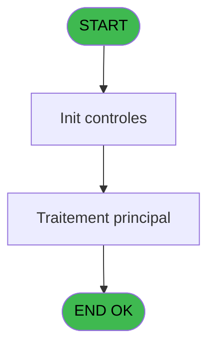
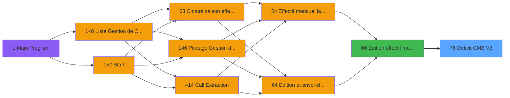

# PBP IDE 76 - Deficit CMB V3

> **Analyse**: Phases 1-4 2026-02-03 09:10 -> 09:11 (20s) | Assemblage 09:11
> **Pipeline**: V7.2 Enrichi
> **Structure**: 4 onglets (Resume | Ecrans | Donnees | Connexions)

<!-- TAB:Resume -->

## 1. FICHE D'IDENTITE

| Attribut | Valeur |
|----------|--------|
| Projet | PBP |
| IDE Position | 76 |
| Nom Programme | Deficit CMB V3 |
| Fichier source | `Prg_76.xml` |
| Domaine metier | General |
| Taches | 1 (0 ecrans visibles) |
| Tables modifiees | 0 |
| Programmes appeles | 0 |

## 2. DESCRIPTION FONCTIONNELLE

**Deficit CMB V3** assure la gestion complete de ce processus, accessible depuis [Edition effectif mensuel V3 (IDE 66)](PBP-IDE-66.md).

Le flux de traitement s'organise en **1 blocs fonctionnels** :

- **Traitement** (1 tache) : traitements metier divers

## 3. BLOCS FONCTIONNELS

### 3.1 Traitement (1 tache)

Traitements internes.

---

#### 76 - Deficit IGR

**Role** : Traitement : Deficit IGR.

## 5. REGLES METIER

*(Aucune regle metier identifiee)*

## 6. CONTEXTE

- **Appele par**: [Edition effectif mensuel V3 (IDE 66)](PBP-IDE-66.md)
- **Appelle**: 0 programmes | **Tables**: 1 (W:0 R:1 L:0) | **Taches**: 1 | **Expressions**: 14

<!-- TAB:Ecrans -->

## 8. ECRANS

*(Programme sans ecran visible)*

## 9. NAVIGATION

### 9.3 Structure hierarchique (1 tache)

| Position | Tache | Type | Dimensions | Bloc |
|----------|-------|------|------------|------|
| **76.1** | [**Deficit IGR** (76)](#t8) | - | - | Traitement |

### 9.4 Algorigramme

> **Legende**: Vert = START/END OK | Rouge = END KO | Bleu = Decisions
> *Algorigramme auto-genere. Utiliser `/algorigramme` pour une synthese metier detaillee.*

<!-- TAB:Donnees -->

## 10. TABLES

### Tables utilisees (1)

| ID | Nom | Description | Type | R | W | L | Usages |
|----|-----|-------------|------|---|---|---|--------|
| 949 | Table_949 |  | MEM | R |   |   | 1 |

### Colonnes par table (1 / 1 tables avec colonnes identifiees)

Table 949 - Table_949 (R) - 1 usages

| Lettre | Variable | Acces | Type |
|--------|----------|-------|------|
| A | P.Date debut | R | Date |
| B | P.Date fin | R | Date |
| C | P.Code village | R | Alpha |
| D | P.Lieu sejour | R | Alpha |
| E | P.Nom lieu sejour | R | Alpha |
| F | P.Gestion crise ? | R | Logical |
| G | V.Total jh | R | Numeric |
| H | V.NBJH | R | Numeric |

## 11. VARIABLES

### 11.1 Parametres entrants (6)

Variables recues du programme appelant ([Edition effectif mensuel V3 (IDE 66)](PBP-IDE-66.md)).

| Lettre | Nom | Type | Usage dans |
|--------|-----|------|-----------|
| A | P.Date debut | Date | - |
| B | P.Date fin | Date | - |
| C | P.Code village | Alpha | - |
| D | P.Lieu sejour | Alpha | - |
| E | P.Nom lieu sejour | Alpha | - |
| F | P.Gestion crise ? | Logical | - |

### 11.2 Variables de session (2)

Variables persistantes pendant toute la session.

| Lettre | Nom | Type | Usage dans |
|--------|-----|------|-----------|
| G | V.Total jh | Numeric | - |
| H | V.NBJH | Numeric | - |

## 12. EXPRESSIONS

**14 / 14 expressions decodees (100%)**

### 12.1 Repartition par type

| Type | Expressions | Regles |
|------|-------------|--------|
| CONDITION | 4 | 0 |
| CONSTANTE | 4 | 0 |
| FORMAT | 1 | 0 |
| OTHER | 4 | 0 |
| STRING | 1 | 0 |

### 12.2 Expressions cles par type

#### CONDITION (4 expressions)

| Type | IDE | Expression | Regle |
|------|-----|------------|-------|
| CONDITION | 11 | `CndRange([CZ]<>'',[CZ])` | - |
| CONDITION | 12 | `[CZ]<>''` | - |
| CONDITION | 3 | `[CU]+(([EB]+[EF])*IF([DZ]<>'DDE',0.5,1))` | - |
| CONDITION | 6 | `[EK] + (([EB]+[EF])*IF([DZ]<>'DDE',0.5,1))` | - |

#### CONSTANTE (4 expressions)

| Type | IDE | Expression | Regle |
|------|-----|------------|-------|
| CONSTANTE | 13 | `0` | - |
| CONSTANTE | 14 | `'VRLHP'` | - |
| CONSTANTE | 1 | `'VRL'` | - |
| CONSTANTE | 2 | `'CMB'` | - |

#### FORMAT (1 expressions)

| Type | IDE | Expression | Regle |
|------|-----|------------|-------|
| FORMAT | 10 | `Trim(Translate('%club_exportdata%'))&'trsft\'&Trim([CY])&IF([CZ]<>'','_'&Trim([CZ])&'_','_')&'EFF_Deficit_Rep_Enc_HP_'&IF([DI],Trim(DStr(Date()-2,'YYYYMM')),Trim(DStr(Date(),'YYYYMM')))&'.htm'` | - |

#### OTHER (4 expressions)

| Type | IDE | Expression | Regle |
|------|-----|------------|-------|
| OTHER | 8 | `Day(EOM([CW]))` | - |
| OTHER | 9 | `CMonth([CW])` | - |
| OTHER | 4 | `[CW]` | - |
| OTHER | 5 | `[CX]` | - |

#### STRING (1 expressions)

| Type | IDE | Expression | Regle |
|------|-----|------------|-------|
| STRING | 7 | `Trim(VG37)` | - |

<!-- TAB:Connexions -->

## 13. GRAPHE D'APPELS

### 13.1 Chaine depuis Main (Callers)

Main -> ... -> [Edition effectif mensuel V3 (IDE 66)](PBP-IDE-66.md) -> **Deficit CMB V3 (IDE 76)**

### 13.2 Callers

| IDE | Nom Programme | Nb Appels |
|-----|---------------|-----------|
| [66](PBP-IDE-66.md) | Edition effectif mensuel V3 | 1 |

### 13.3 Callees (programmes appeles)

### 13.4 Detail Callees avec contexte

| IDE | Nom Programme | Appels | Contexte |
|-----|---------------|--------|----------|
| - | (aucun) | - | - |

## 14. RECOMMANDATIONS MIGRATION

### 14.1 Profil du programme

| Metrique | Valeur | Impact migration |
|----------|--------|-----------------|
| Lignes de logique | 38 | Programme compact |
| Expressions | 14 | Peu de logique |
| Tables WRITE | 0 | Impact faible |
| Sous-programmes | 0 | Peu de dependances |
| Ecrans visibles | 0 | Ecran unique ou traitement batch |
| Code desactive | 0% (0 / 38) | Code sain |
| Regles metier | 0 | Pas de regle identifiee |

### 14.2 Plan de migration par bloc

#### Traitement (1 tache: 0 ecran, 1 traitement)

- **Strategie** : 1 service(s) backend injectable(s) (Domain Services).
- Decomposer les taches en services unitaires testables.

### 14.3 Dependances critiques

| Dependance | Type | Appels | Impact |
|------------|------|--------|--------|

---
*Spec DETAILED generee par Pipeline V7.2 - 2026-02-03 09:11*
