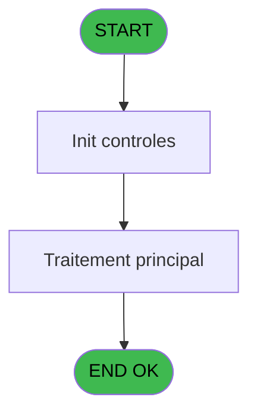
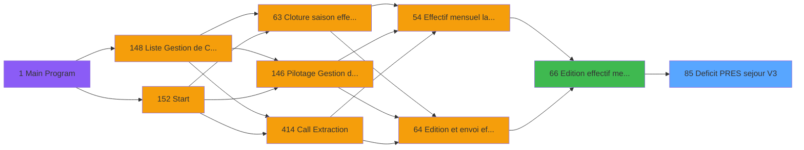

# PBP IDE 85 - Deficit PRES sejour V3

> **Analyse**: Phases 1-4 2026-02-03 09:15 -> 09:15 (20s) | Assemblage 09:15
> **Pipeline**: V7.2 Enrichi
> **Structure**: 4 onglets (Resume | Ecrans | Donnees | Connexions)

<!-- TAB:Resume -->

## 1. FICHE D'IDENTITE

| Attribut | Valeur |
|----------|--------|
| Projet | PBP |
| IDE Position | 85 |
| Nom Programme | Deficit PRES sejour V3 |
| Fichier source | `Prg_85.xml` |
| Domaine metier | General |
| Taches | 2 (0 ecrans visibles) |
| Tables modifiees | 0 |
| Programmes appeles | 0 |

## 2. DESCRIPTION FONCTIONNELLE

**Deficit PRES sejour V3** assure la gestion complete de ce processus, accessible depuis [Edition effectif mensuel V3 (IDE 66)](PBP-IDE-66.md).

Le flux de traitement s'organise en **1 blocs fonctionnels** :

- **Traitement** (2 taches) : traitements metier divers

**Logique metier** : 2 regles identifiees couvrant conditions metier.

## 3. BLOCS FONCTIONNELS

### 3.1 Traitement (2 taches)

Traitements internes.

---

#### 85 - GMPRES

**Role** : Traitement : GMPRES.

---

#### 85.1 - Deficit GO GMPRESS V3

**Role** : Traitement : Deficit GO GMPRESS V3.

## 5. REGLES METIER

2 regles identifiees:

### Autres (2 regles)

#### [RM-001] Si [AQ]<{1 alors 1} sinon {1,1},[AQ])

| Element | Detail |
|---------|--------|
| **Condition** | `[AQ]<{1` |
| **Si vrai** | 1} |
| **Si faux** | {1,1},[AQ]) |
| **Expression source** | Expression 18 : `IF([AQ]<{1,1},{1,1},[AQ])` |
| **Exemple** | Si [AQ]<{1 → 1}. Sinon → {1,1},[AQ]) |

#### [RM-002] Si [AS]>{1 alors 2} sinon {1,2},[AS])

| Element | Detail |
|---------|--------|
| **Condition** | `[AS]>{1` |
| **Si vrai** | 2} |
| **Si faux** | {1,2},[AS]) |
| **Expression source** | Expression 19 : `IF([AS]>{1,2},{1,2},[AS])` |
| **Exemple** | Si [AS]>{1 → 2}. Sinon → {1,2},[AS]) |

## 6. CONTEXTE

- **Appele par**: [Edition effectif mensuel V3 (IDE 66)](PBP-IDE-66.md)
- **Appelle**: 0 programmes | **Tables**: 2 (W:0 R:1 L:1) | **Taches**: 2 | **Expressions**: 39

<!-- TAB:Ecrans -->

## 8. ECRANS

*(Programme sans ecran visible)*

## 9. NAVIGATION

### 9.3 Structure hierarchique (2 taches)

| Position | Tache | Type | Dimensions | Bloc |
|----------|-------|------|------------|------|
| **85.1** | [**GMPRES** (85)](#t2) | - | - | Traitement |
| 85.1.1 | [Deficit GO GMPRESS V3 (85.1)](#t9) | - | - | |

### 9.4 Algorigramme

> **Legende**: Vert = START/END OK | Rouge = END KO | Bleu = Decisions
> *Algorigramme auto-genere. Utiliser `/algorigramme` pour une synthese metier detaillee.*

<!-- TAB:Donnees -->

## 10. TABLES

### Tables utilisees (2)

| ID | Nom | Description | Type | R | W | L | Usages |
|----|-----|-------------|------|---|---|---|--------|
| 834 | tpe_par_terminal |  | DB | R |   |   | 1 |
| 949 | Table_949 |  | MEM |   |   | L | 1 |

### Colonnes par table (1 / 1 tables avec colonnes identifiees)

Table 834 - tpe_par_terminal (R) - 1 usages

| Lettre | Variable | Acces | Type |
|--------|----------|-------|------|
| A | V.Nb JH du mois | R | Numeric |
| B | V.Nb repas | R | Numeric |
| C | V.Date debut | R | Date |
| D | V.Date fin | R | Date |
| E | V.Nb jh absence | R | Numeric |
| F | V.Date debut premiere periode | R | Date |
| G | V.Date fin derniere periode | R | Date |
| H | V.Date debut sej | R | Date |
| I | V.Date fin sej | R | Date |
| J | V.Heure debut premiere periode | R | Alpha |
| K | V.Heure fin derniere periode | R | Alpha |

## 11. VARIABLES

### 11.1 Parametres entrants (6)

Variables recues du programme appelant ([Edition effectif mensuel V3 (IDE 66)](PBP-IDE-66.md)).

| Lettre | Nom | Type | Usage dans |
|--------|-----|------|-----------|
| A | P.Date debut | Date | 2x parametre entrant |
| B | P.Date fin | Date | - |
| C | P.Code village | Alpha | - |
| D | P.Lieu sejour | Alpha | 1x parametre entrant |
| E | P.Nom lieu | Alpha | 2x parametre entrant |
| F | P.Gestion crise ? | Logical | - |

### 11.2 Variables de session (5)

Variables persistantes pendant toute la session.

| Lettre | Nom | Type | Usage dans |
|--------|-----|------|-----------|
| G | V.Total nb jh | Numeric | - |
| H | V.Total | Numeric | - |
| I | V.Date fin sej | Date | - |
| J | V.Heure debut premiere periode | Alpha | - |
| K | V.Heure fin derniere periode | Alpha | - |

## 12. EXPRESSIONS

**39 / 39 expressions decodees (100%)**

### 12.1 Repartition par type

| Type | Expressions | Regles |
|------|-------------|--------|
| CALCULATION | 3 | 0 |
| CONDITION | 9 | 2 |
| CONSTANTE | 7 | 0 |
| FORMAT | 1 | 0 |
| OTHER | 18 | 0 |
| STRING | 1 | 0 |

### 12.2 Expressions cles par type

#### CALCULATION (3 expressions)

| Type | IDE | Expression | Regle |
|------|-----|------------|-------|
| CALCULATION | 38 | `[ER]+([EH]+[EL])` | - |
| CALCULATION | 37 | `[ES]+([EH]+[EL])/2` | - |
| CALCULATION | 20 | `{1,12}+[ES]` | - |

#### CONDITION (9 expressions)

| Type | IDE | Expression | Regle |
|------|-----|------------|-------|
| CONDITION | 19 | `IF([AS]>{1,2},{1,2},[AS])` | [RM-002](#rm-RM-002) |
| CONDITION | 18 | `IF([AQ]<{1,1},{1,1},[AQ])` | [RM-001](#rm-RM-001) |
| CONDITION | 29 | `[AQ]<[DG] OR [DG]=0` | - |
| CONDITION | 30 | `[AS]>[DH] OR [DH]=0` | - |
| CONDITION | 39 | `[ER]<>0` | - |
| ... | | *+4 autres* | |

#### CONSTANTE (7 expressions)

| Type | IDE | Expression | Regle |
|------|-----|------------|-------|
| CONSTANTE | 31 | `''` | - |
| CONSTANTE | 34 | `'GM'` | - |
| CONSTANTE | 35 | `'PRES'` | - |
| CONSTANTE | 26 | `0` | - |
| CONSTANTE | 1 | `'Activité'` | - |
| ... | | *+2 autres* | |

#### FORMAT (1 expressions)

| Type | IDE | Expression | Regle |
|------|-----|------------|-------|
| FORMAT | 4 | `Trim(Translate('%club_exportdata%'))&'trsft\'&Trim(P.Lieu sejour [D])&IF(P.Nom lieu [E]<>'','_'&Trim(P.Nom lieu [E])&'_','_')&'EFF_Deficit_PRESS_'&IF(V.Heure fin derniere p... [K],Trim(DStr(Date()-2,'YYYYMM')),Trim(DStr(Date(),'YYYYMM')))&'.htm'` | - |

#### OTHER (18 expressions)

| Type | IDE | Expression | Regle |
|------|-----|------------|-------|
| OTHER | 22 | `[CB]` | - |
| OTHER | 23 | `[CC]` | - |
| OTHER | 16 | `{1,1}` | - |
| OTHER | 17 | `[DY]` | - |
| OTHER | 27 | `[AQ]` | - |
| ... | | *+13 autres* | |

#### STRING (1 expressions)

| Type | IDE | Expression | Regle |
|------|-----|------------|-------|
| STRING | 5 | `Trim(VG37)` | - |

### 12.3 Toutes les expressions (39)

Voir les 39 expressions

#### CALCULATION (3)

| IDE | Expression Decodee |
|-----|-------------------|
| 20 | `{1,12}+[ES]` |
| 37 | `[ES]+([EH]+[EL])/2` |
| 38 | `[ER]+([EH]+[EL])` |

#### CONDITION (9)

| IDE | Expression Decodee |
|-----|-------------------|
| 18 | `IF([AQ]<{1,1},{1,1},[AQ])` |
| 19 | `IF([AS]>{1,2},{1,2},[AS])` |
| 8 | `P.Nom lieu [E]<>''` |
| 21 | `CndRange({1,5}<>'',{1,5})` |
| 24 | `[CB]<[DC] OR [DC]=0` |
| 25 | `[CC]>[DD] OR [DD]=0` |
| 29 | `[AQ]<[DG] OR [DG]=0` |
| 30 | `[AS]>[DH] OR [DH]=0` |
| 39 | `[ER]<>0` |

#### CONSTANTE (7)

| IDE | Expression Decodee |
|-----|-------------------|
| 1 | `'Activité'` |
| 2 | `'Prestataires séjour'` |
| 3 | `'800200201'` |
| 26 | `0` |
| 31 | `''` |
| 34 | `'GM'` |
| 35 | `'PRES'` |

#### FORMAT (1)

| IDE | Expression Decodee |
|-----|-------------------|
| 4 | `Trim(Translate('%club_exportdata%'))&'trsft\'&Trim(P.Lieu sejour [D])&IF(P.Nom lieu [E]<>'','_'&Trim(P.Nom lieu [E])&'_','_')&'EFF_Deficit_PRESS_'&IF(V.Heure fin derniere p... [K],Trim(DStr(Date()-2,'YYYYMM')),Trim(DStr(Date(),'YYYYMM')))&'.htm'` |

#### OTHER (18)

| IDE | Expression Decodee |
|-----|-------------------|
| 6 | `CMonth(P.Date debut [A])` |
| 7 | `Day(EOM(P.Date debut [A]))` |
| 9 | `{1,1}` |
| 10 | `{1,2}` |
| 11 | `GetParam('SOCIETE')` |
| 12 | `[EC]` |
| 13 | `[ED]` |
| 14 | `[EE]` |
| 15 | `{1,2}` |
| 16 | `{1,1}` |
| 17 | `[DY]` |
| 22 | `[CB]` |
| 23 | `[CC]` |
| 27 | `[AQ]` |
| 28 | `[AS]` |
| 32 | `[DL]` |
| 33 | `[DM]` |
| 36 | `[DZ]` |

#### STRING (1)

| IDE | Expression Decodee |
|-----|-------------------|
| 5 | `Trim(VG37)` |

<!-- TAB:Connexions -->

## 13. GRAPHE D'APPELS

### 13.1 Chaine depuis Main (Callers)

Main -> ... -> [Edition effectif mensuel V3 (IDE 66)](PBP-IDE-66.md) -> **Deficit PRES sejour V3 (IDE 85)**

### 13.2 Callers

| IDE | Nom Programme | Nb Appels |
|-----|---------------|-----------|
| [66](PBP-IDE-66.md) | Edition effectif mensuel V3 | 1 |

### 13.3 Callees (programmes appeles)

### 13.4 Detail Callees avec contexte

| IDE | Nom Programme | Appels | Contexte |
|-----|---------------|--------|----------|
| - | (aucun) | - | - |

## 14. RECOMMANDATIONS MIGRATION

### 14.1 Profil du programme

| Metrique | Valeur | Impact migration |
|----------|--------|-----------------|
| Lignes de logique | 90 | Programme compact |
| Expressions | 39 | Peu de logique |
| Tables WRITE | 0 | Impact faible |
| Sous-programmes | 0 | Peu de dependances |
| Ecrans visibles | 0 | Ecran unique ou traitement batch |
| Code desactive | 0% (0 / 90) | Code sain |
| Regles metier | 2 | Quelques regles a preserver |

### 14.2 Plan de migration par bloc

#### Traitement (2 taches: 0 ecran, 2 traitements)

- **Strategie** : 2 service(s) backend injectable(s) (Domain Services).
- Decomposer les taches en services unitaires testables.

### 14.3 Dependances critiques

| Dependance | Type | Appels | Impact |
|------------|------|--------|--------|

---
*Spec DETAILED generee par Pipeline V7.2 - 2026-02-03 09:15*
