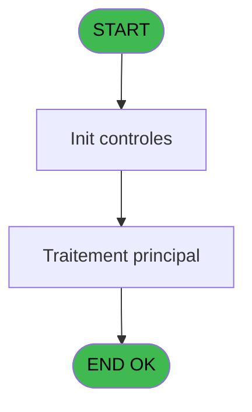
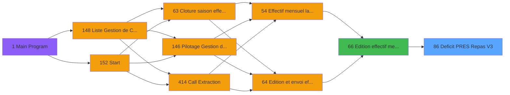

# PBP IDE 86 - Deficit PRES Repas V3?

> **Analyse**: Phases 1-4 2026-02-03 09:15 -> 09:15 (21s) | Assemblage 09:15
> **Pipeline**: V7.2 Enrichi
> **Structure**: 4 onglets (Resume | Ecrans | Donnees | Connexions)

<!-- TAB:Resume -->

## 1. FICHE D'IDENTITE

| Attribut | Valeur |
|----------|--------|
| Projet | PBP |
| IDE Position | 86 |
| Nom Programme | Deficit PRES Repas V3? |
| Fichier source | `Prg_86.xml` |
| Domaine metier | General |
| Taches | 2 (0 ecrans visibles) |
| Tables modifiees | 0 |
| Programmes appeles | 0 |

## 2. DESCRIPTION FONCTIONNELLE

**Deficit PRES Repas V3?** assure la gestion complete de ce processus, accessible depuis [Edition effectif mensuel V3 (IDE 66)](PBP-IDE-66.md).

Le flux de traitement s'organise en **1 blocs fonctionnels** :

- **Traitement** (2 taches) : traitements metier divers

## 3. BLOCS FONCTIONNELS

### 3.1 Traitement (2 taches)

Traitements internes.

---

#### 86.1 - Deficit IGR PRES

**Role** : Traitement : Deficit IGR PRES.

---

#### 86 - IGRPRESS

**Role** : Traitement : IGRPRESS.

## 5. REGLES METIER

*(Aucune regle metier identifiee)*

## 6. CONTEXTE

- **Appele par**: [Edition effectif mensuel V3 (IDE 66)](PBP-IDE-66.md)
- **Appelle**: 0 programmes | **Tables**: 1 (W:0 R:1 L:0) | **Taches**: 2 | **Expressions**: 24

<!-- TAB:Ecrans -->

## 8. ECRANS

*(Programme sans ecran visible)*

## 9. NAVIGATION

### 9.3 Structure hierarchique (2 taches)

| Position | Tache | Type | Dimensions | Bloc |
|----------|-------|------|------------|------|
| **86.1** | [**Deficit IGR PRES** (86.1)](#t1) | - | - | Traitement |
| 86.1.1 | [IGRPRESS (86)](#t2) | - | - | |

### 9.4 Algorigramme

> **Legende**: Vert = START/END OK | Rouge = END KO | Bleu = Decisions
> *Algorigramme auto-genere. Utiliser `/algorigramme` pour une synthese metier detaillee.*

<!-- TAB:Donnees -->

## 10. TABLES

### Tables utilisees (1)

| ID | Nom | Description | Type | R | W | L | Usages |
|----|-----|-------------|------|---|---|---|--------|
| 949 | Table_949 |  | MEM | R |   |   | 1 |

### Colonnes par table (1 / 1 tables avec colonnes identifiees)

Table 949 - Table_949 (R) - 1 usages

| Lettre | Variable | Acces | Type |
|--------|----------|-------|------|
| A | V.Nb repas midi | R | Numeric |
| B | V.Nb repas soir | R | Numeric |
| C | V.Nb jh midi | R | Numeric |
| D | V.Nb jh soir | R | Numeric |

## 11. VARIABLES

### 11.1 Parametres entrants (2)

Variables recues du programme appelant ([Edition effectif mensuel V3 (IDE 66)](PBP-IDE-66.md)).

| Lettre | Nom | Type | Usage dans |
|--------|-----|------|-----------|
| E | P.Nom lieu | Alpha | 2x parametre entrant |
| F | P.Gestion crise ? | Logical | - |

### 11.2 Variables de session (5)

Variables persistantes pendant toute la session.

| Lettre | Nom | Type | Usage dans |
|--------|-----|------|-----------|
| A | V.Nb repas midi | Numeric | 2x session |
| B | V.Nb repas soir | Numeric | - |
| C | V.Nb jh midi | Numeric | - |
| D | V.Nb jh soir | Numeric | 1x session |
| G | V.Total nb jh | Numeric | - |

## 12. EXPRESSIONS

**24 / 24 expressions decodees (100%)**

### 12.1 Repartition par type

| Type | Expressions | Regles |
|------|-------------|--------|
| CALCULATION | 7 | 0 |
| CONSTANTE | 5 | 0 |
| FORMAT | 1 | 0 |
| OTHER | 5 | 0 |
| CONDITION | 5 | 0 |
| STRING | 1 | 0 |

### 12.2 Expressions cles par type

#### CALCULATION (7 expressions)

| Type | IDE | Expression | Regle |
|------|-----|------------|-------|
| CALCULATION | 21 | `[DI]+(([EC]+[EG])/2)` | - |
| CALCULATION | 22 | `[DF]+[DG]` | - |
| CALCULATION | 23 | `[DH]+[DI]` | - |
| CALCULATION | 20 | `[DG]+[EC] + [EG]` | - |
| CALCULATION | 17 | `[DF]+[EC] +[EG]` | - |
| ... | | *+2 autres* | |

#### CONSTANTE (5 expressions)

| Type | IDE | Expression | Regle |
|------|-----|------------|-------|
| CONSTANTE | 13 | `'PRES'` | - |
| CONSTANTE | 15 | `0` | - |
| CONSTANTE | 12 | `'IGR'` | - |
| CONSTANTE | 1 | `'Prestataires Repas'` | - |
| CONSTANTE | 2 | `'800200210'` | - |

#### FORMAT (1 expressions)

| Type | IDE | Expression | Regle |
|------|-----|------------|-------|
| FORMAT | 3 | `Trim(Translate('%club_exportdata%'))&'trsft\'&Trim(V.Nb jh soir [D])&IF(P.Nom lieu [E]<>'','_'&Trim(P.Nom lieu [E])&'_','_')&'EFF_Deficit_PRESR_'&IF([K],Trim(DStr(Date()-2,'YYYYMM')),Trim(DStr(Date(),'YYYYMM')))&'.htm'` | - |

#### OTHER (5 expressions)

| Type | IDE | Expression | Regle |
|------|-----|------------|-------|
| OTHER | 10 | `{1,1}` | - |
| OTHER | 11 | `{1,2}` | - |
| OTHER | 8 | `'GM Prestataire '&[DW]` | - |
| OTHER | 5 | `CMonth(V.Nb repas midi [A])` | - |
| OTHER | 6 | `Day(EOM(V.Nb repas midi [A]))` | - |

#### CONDITION (5 expressions)

| Type | IDE | Expression | Regle |
|------|-----|------------|-------|
| CONDITION | 16 | `[EA]='DIN' OR [EA]='DDE'` | - |
| CONDITION | 24 | `CndRange({1,5}<>'',{1,5})` | - |
| CONDITION | 14 | `[EA]='DEJ' OR [EA]='DDE'` | - |
| CONDITION | 7 | `P.Nom lieu [E]<>''` | - |
| CONDITION | 9 | `[DV]<>''` | - |

#### STRING (1 expressions)

| Type | IDE | Expression | Regle |
|------|-----|------------|-------|
| STRING | 4 | `Trim(VG37)` | - |

### 12.3 Toutes les expressions (24)

Voir les 24 expressions

#### CALCULATION (7)

| IDE | Expression Decodee |
|-----|-------------------|
| 17 | `[DF]+[EC] +[EG]` |
| 18 | `[DH]+(([EC]+[EG])/2)` |
| 19 | `{1,3}+(([EC]+[EG])/2)` |
| 20 | `[DG]+[EC] + [EG]` |
| 21 | `[DI]+(([EC]+[EG])/2)` |
| 22 | `[DF]+[DG]` |
| 23 | `[DH]+[DI]` |

#### CONSTANTE (5)

| IDE | Expression Decodee |
|-----|-------------------|
| 1 | `'Prestataires Repas'` |
| 2 | `'800200210'` |
| 12 | `'IGR'` |
| 13 | `'PRES'` |
| 15 | `0` |

#### FORMAT (1)

| IDE | Expression Decodee |
|-----|-------------------|
| 3 | `Trim(Translate('%club_exportdata%'))&'trsft\'&Trim(V.Nb jh soir [D])&IF(P.Nom lieu [E]<>'','_'&Trim(P.Nom lieu [E])&'_','_')&'EFF_Deficit_PRESR_'&IF([K],Trim(DStr(Date()-2,'YYYYMM')),Trim(DStr(Date(),'YYYYMM')))&'.htm'` |

#### OTHER (5)

| IDE | Expression Decodee |
|-----|-------------------|
| 5 | `CMonth(V.Nb repas midi [A])` |
| 6 | `Day(EOM(V.Nb repas midi [A]))` |
| 8 | `'GM Prestataire '&[DW]` |
| 10 | `{1,1}` |
| 11 | `{1,2}` |

#### CONDITION (5)

| IDE | Expression Decodee |
|-----|-------------------|
| 7 | `P.Nom lieu [E]<>''` |
| 9 | `[DV]<>''` |
| 14 | `[EA]='DEJ' OR [EA]='DDE'` |
| 16 | `[EA]='DIN' OR [EA]='DDE'` |
| 24 | `CndRange({1,5}<>'',{1,5})` |

#### STRING (1)

| IDE | Expression Decodee |
|-----|-------------------|
| 4 | `Trim(VG37)` |

<!-- TAB:Connexions -->

## 13. GRAPHE D'APPELS

### 13.1 Chaine depuis Main (Callers)

Main -> ... -> [Edition effectif mensuel V3 (IDE 66)](PBP-IDE-66.md) -> **Deficit PRES Repas V3? (IDE 86)**

### 13.2 Callers

| IDE | Nom Programme | Nb Appels |
|-----|---------------|-----------|
| [66](PBP-IDE-66.md) | Edition effectif mensuel V3 | 1 |

### 13.3 Callees (programmes appeles)

### 13.4 Detail Callees avec contexte

| IDE | Nom Programme | Appels | Contexte |
|-----|---------------|--------|----------|
| - | (aucun) | - | - |

## 14. RECOMMANDATIONS MIGRATION

### 14.1 Profil du programme

| Metrique | Valeur | Impact migration |
|----------|--------|-----------------|
| Lignes de logique | 48 | Programme compact |
| Expressions | 24 | Peu de logique |
| Tables WRITE | 0 | Impact faible |
| Sous-programmes | 0 | Peu de dependances |
| Ecrans visibles | 0 | Ecran unique ou traitement batch |
| Code desactive | 0% (0 / 48) | Code sain |
| Regles metier | 0 | Pas de regle identifiee |

### 14.2 Plan de migration par bloc

#### Traitement (2 taches: 0 ecran, 2 traitements)

- **Strategie** : 2 service(s) backend injectable(s) (Domain Services).
- Decomposer les taches en services unitaires testables.

### 14.3 Dependances critiques

| Dependance | Type | Appels | Impact |
|------------|------|--------|--------|

---
*Spec DETAILED generee par Pipeline V7.2 - 2026-02-03 09:15*
