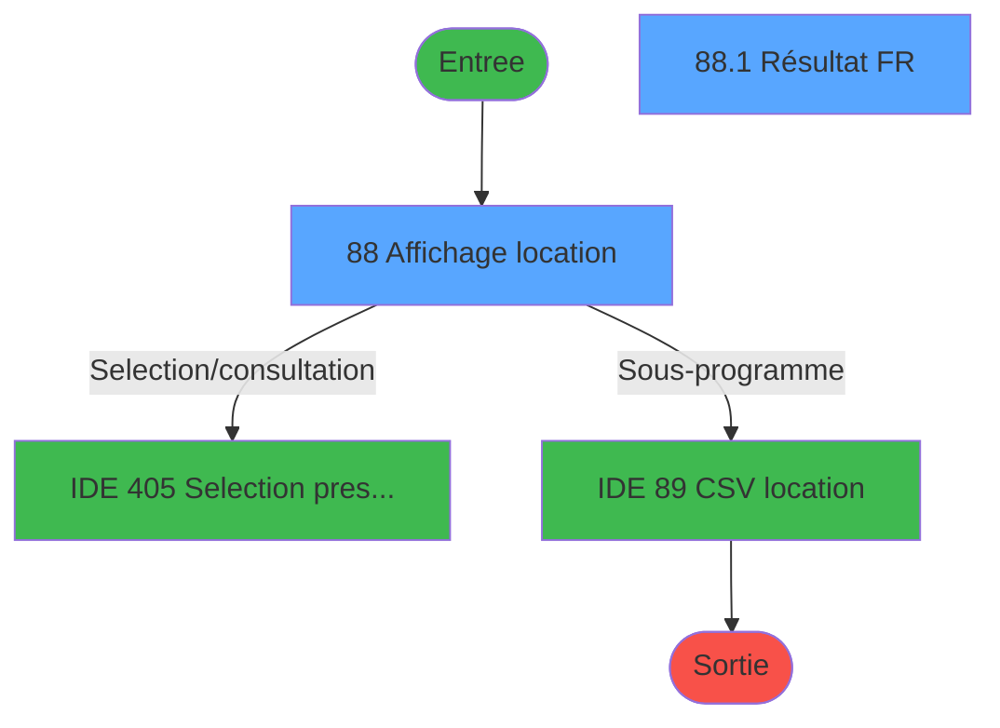
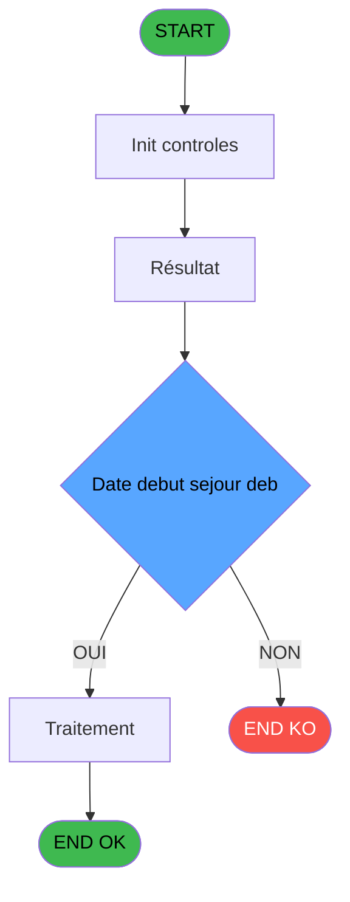
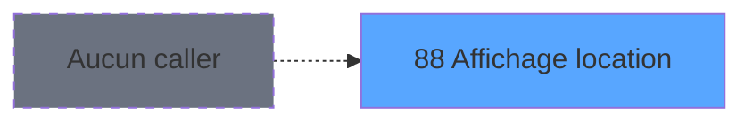
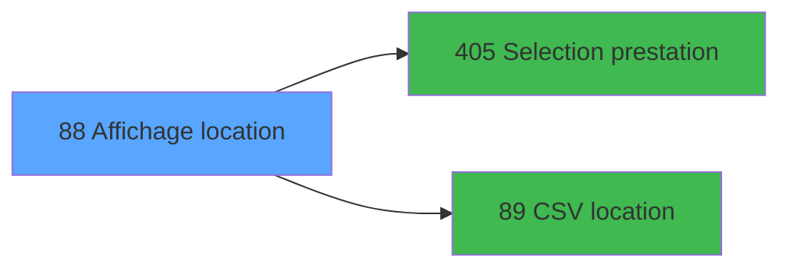

# PBP IDE 88 - Affichage location

> **Analyse**: Phases 1-4 2026-02-03 09:16 -> 09:16 (19s) | Assemblage 09:16
> **Pipeline**: V7.2 Enrichi
> **Structure**: 4 onglets (Resume | Ecrans | Donnees | Connexions)

<!-- TAB:Resume -->

## 1. FICHE D'IDENTITE

| Attribut | Valeur |
|----------|--------|
| Projet | PBP |
| IDE Position | 88 |
| Nom Programme | Affichage location |
| Fichier source | `Prg_88.xml` |
| Domaine metier | General |
| Taches | 4 (2 ecrans visibles) |
| Tables modifiees | 0 |
| Programmes appeles | 2 |
| :warning: Statut | **ORPHELIN_POTENTIEL** |

## 2. DESCRIPTION FONCTIONNELLE

**Affichage location** assure la gestion complete de ce processus.

Le flux de traitement s'organise en **2 blocs fonctionnels** :

- **Traitement** (3 taches) : traitements metier divers
- **Consultation** (1 tache) : ecrans de recherche, selection et consultation

**Logique metier** : 1 regles identifiees couvrant valeurs par defaut.

Detail : phases du traitement

#### Phase 1 : Consultation (1 tache)

- **88** - Affichage location **[[ECRAN]](#ecran-t1)**

Delegue a : [Selection prestation (IDE 405)](PBP-IDE-405.md)

#### Phase 2 : Traitement (3 taches)

- **88.1** - Résultat FR **[[ECRAN]](#ecran-t2)**
- **88.1.1** - Ecriture reponse
- **88.1.2** - Ecriture reponse

Delegue a : [CSV location (IDE 89)](PBP-IDE-89.md)

## 3. BLOCS FONCTIONNELS

### 3.1 Consultation (1 tache)

Ecrans de recherche et consultation.

---

#### 88 - Affichage location [[ECRAN]](#ecran-t1)

**Role** : Reinitialisation : Affichage location.
**Ecran** : 1773 x 358 DLU (MDI) | [Voir mockup](#ecran-t1)
**Delegue a** : [Selection prestation (IDE 405)](PBP-IDE-405.md)

### 3.2 Traitement (3 taches)

Traitements internes.

---

#### 88.1 - Résultat FR [[ECRAN]](#ecran-t2)

**Role** : Traitement : Résultat FR.
**Ecran** : 883 x 267 DLU (Modal) | [Voir mockup](#ecran-t2)
**Delegue a** : [CSV location (IDE 89)](PBP-IDE-89.md)

---

#### 88.1.1 - Ecriture reponse

**Role** : Traitement : Ecriture reponse.
**Delegue a** : [CSV location (IDE 89)](PBP-IDE-89.md)

---

#### 88.1.2 - Ecriture reponse

**Role** : Traitement : Ecriture reponse.
**Delegue a** : [CSV location (IDE 89)](PBP-IDE-89.md)

## 5. REGLES METIER

1 regles identifiees:

### Autres (1 regles)

#### [RM-001] Valeur par defaut si w0_Date debut sejour deb [A]<>0,'B.gmr_debut_sejour> est vide

| Element | Detail |
|---------|--------|
| **Condition** | `w0_Date debut sejour deb [A]<>0` |
| **Si vrai** | 'B.gmr_debut_sejour>='''&DStr(w0_Date debut sejour deb [A] |
| **Si faux** | 'YYYYMMDD')&'''','')&IF(w0_Date debut sejour deb [A]<>0 AND [DA]<>0,' and ','')&IF([DA]<>0,'B.gmr_debut_sejour<='''&DStr([DA],'YYYYMMDD')&'''','') |
| **Variables** | A (w0_Date debut sejour deb) |
| **Expression source** | Expression 9 : `IF(w0_Date debut sejour deb [A]<>0,'B.gmr_debut_sejour>='''&` |
| **Exemple** | Si w0_Date debut sejour deb [A]<>0 → 'B.gmr_debut_sejour>='''&DStr(w0_Date debut sejour deb [A] |

## 6. CONTEXTE

- **Appele par**: (aucun)
- **Appelle**: 2 programmes | **Tables**: 11 (W:0 R:3 L:8) | **Taches**: 4 | **Expressions**: 14

<!-- TAB:Ecrans -->

## 8. ECRANS

### 8.1 Forms visibles (2 / 4)

| # | Position | Tache | Nom | Type | Largeur | Hauteur | Bloc |
|---|----------|-------|-----|------|---------|---------|------|
| 1 | 88 | 88 | Affichage location | MDI | 1773 | 358 | Consultation |
| 2 | 88.1 | 88.1 | Résultat FR | Modal | 883 | 267 | Traitement |

### 8.2 Mockups Ecrans

---

#### 88 - Affichage location
**Tache** : [88](#t1) | **Type** : MDI | **Dimensions** : 1773 x 358 DLU
**Bloc** : Consultation | **Titre IDE** : Affichage location

<!-- FORM-DATA:
{
    "width":  1773,
    "vFactor":  8,
    "type":  "MDI",
    "hFactor":  8,
    "controls":  [
                     {
                         "x":  1,
                         "type":  "label",
                         "var":  "",
                         "y":  0,
                         "w":  1758,
                         "fmt":  "",
                         "name":  "",
                         "h":  20,
                         "color":  "1",
                         "text":  "",
                         "parent":  null
                     },
                     {
                         "x":  12,
                         "type":  "label",
                         "var":  "",
                         "y":  23,
                         "w":  1751,
                         "fmt":  "",
                         "name":  "",
                         "h":  61,
                         "color":  "195",
                         "text":  "Critères",
                         "parent":  null
                     },
                     {
                         "x":  21,
                         "type":  "label",
                         "var":  "",
                         "y":  35,
                         "w":  143,
                         "fmt":  "",
                         "name":  "",
                         "h":  9,
                         "color":  "",
                         "text":  "Date début séjour",
                         "parent":  5
                     },
                     {
                         "x":  21,
                         "type":  "label",
                         "var":  "",
                         "y":  51,
                         "w":  100,
                         "fmt":  "",
                         "name":  "",
                         "h":  9,
                         "color":  "",
                         "text":  "Prestation",
                         "parent":  5
                     },
                     {
                         "x":  21,
                         "type":  "label",
                         "var":  "",
                         "y":  64,
                         "w":  154,
                         "fmt":  "",
                         "name":  "",
                         "h":  12,
                         "color":  "",
                         "text":  "Type questionnaire",
                         "parent":  5
                     },
                     {
                         "x":  343,
                         "type":  "label",
                         "var":  "",
                         "y":  35,
                         "w":  29,
                         "fmt":  "",
                         "name":  "",
                         "h":  9,
                         "color":  "",
                         "text":  "au",
                         "parent":  5
                     },
                     {
                         "x":  6,
                         "type":  "edit",
                         "var":  "",
                         "y":  2,
                         "w":  267,
                         "fmt":  "20",
                         "name":  "",
                         "h":  8,
                         "color":  "",
                         "text":  "",
                         "parent":  1
                     },
                     {
                         "x":  1472,
                         "type":  "edit",
                         "var":  "",
                         "y":  5,
                         "w":  267,
                         "fmt":  "WWW DD MMM YYYYT",
                         "name":  "",
                         "h":  8,
                         "color":  "",
                         "text":  "",
                         "parent":  1
                     },
                     {
                         "x":  6,
                         "type":  "edit",
                         "var":  "",
                         "y":  11,
                         "w":  331,
                         "fmt":  "25",
                         "name":  "",
                         "h":  8,
                         "color":  "",
                         "text":  "",
                         "parent":  1
                     },
                     {
                         "x":  173,
                         "type":  "edit",
                         "var":  "",
                         "y":  35,
                         "w":  126,
                         "fmt":  "##/##/####Z",
                         "name":  "w0_Date_debut_sejour_deb",
                         "h":  10,
                         "color":  "110",
                         "text":  "",
                         "parent":  5
                     },
                     {
                         "x":  309,
                         "type":  "button",
                         "var":  "",
                         "y":  34,
                         "w":  25,
                         "fmt":  "...",
                         "name":  "b_Date_deb_sej_deb",
                         "h":  10,
                         "color":  "",
                         "text":  "",
                         "parent":  5
                     },
                     {
                         "x":  378,
                         "type":  "edit",
                         "var":  "",
                         "y":  35,
                         "w":  126,
                         "fmt":  "##/##/####Z",
                         "name":  "w0_date_debut_sejour_fin",
                         "h":  10,
                         "color":  "110",
                         "text":  "",
                         "parent":  5
                     },
                     {
                         "x":  519,
                         "type":  "button",
                         "var":  "",
                         "y":  35,
                         "w":  25,
                         "fmt":  "...",
                         "name":  "b_Date_deb_sej_fin",
                         "h":  10,
                         "color":  "",
                         "text":  "",
                         "parent":  5
                     },
                     {
                         "x":  173,
                         "type":  "edit",
                         "var":  "",
                         "y":  50,
                         "w":  126,
                         "fmt":  "",
                         "name":  "w0_Prestation",
                         "h":  10,
                         "color":  "110",
                         "text":  "",
                         "parent":  5
                     },
                     {
                         "x":  309,
                         "type":  "button",
                         "var":  "",
                         "y":  50,
                         "w":  25,
                         "fmt":  "...",
                         "name":  "b_Prestations",
                         "h":  10,
                         "color":  "",
                         "text":  "",
                         "parent":  5
                     },
                     {
                         "x":  344,
                         "type":  "edit",
                         "var":  "",
                         "y":  50,
                         "w":  232,
                         "fmt":  "",
                         "name":  "libelle",
                         "h":  10,
                         "color":  "142",
                         "text":  "",
                         "parent":  5
                     },
                     {
                         "x":  1443,
                         "type":  "button",
                         "var":  "",
                         "y":  63,
                         "w":  154,
                         "fmt":  "Rechercher",
                         "name":  "",
                         "h":  18,
                         "color":  "",
                         "text":  "",
                         "parent":  5
                     },
                     {
                         "x":  1599,
                         "type":  "button",
                         "var":  "",
                         "y":  63,
                         "w":  154,
                         "fmt":  "Quitter",
                         "name":  "",
                         "h":  18,
                         "color":  "",
                         "text":  "",
                         "parent":  null
                     },
                     {
                         "x":  173,
                         "type":  "combobox",
                         "var":  "",
                         "y":  64,
                         "w":  267,
                         "fmt":  "",
                         "name":  "w0_Type questionnaire",
                         "h":  12,
                         "color":  "",
                         "text":  "TOUS",
                         "parent":  5
                     },
                     {
                         "x":  5,
                         "type":  "subform",
                         "var":  "",
                         "y":  88,
                         "w":  1765,
                         "fmt":  "",
                         "name":  "RESULTAT",
                         "h":  266,
                         "color":  "",
                         "text":  "",
                         "parent":  null
                     }
                 ],
    "taskId":  "88",
    "height":  358
}
-->

<strong>Champs : 8 champs</strong>

| Pos (x,y) | Nom | Variable | Type |
|-----------|-----|----------|------|
| 6,2 | 20 | - | edit |
| 1472,5 | WWW DD MMM YYYYT | - | edit |
| 6,11 | 25 | - | edit |
| 173,35 | w0_Date_debut_sejour_deb | - | edit |
| 378,35 | w0_date_debut_sejour_fin | - | edit |
| 173,50 | w0_Prestation | - | edit |
| 344,50 | libelle | - | edit |
| 173,64 | w0_Type questionnaire | - | combobox |

<strong>Boutons : 5 boutons</strong>

| Bouton | Pos (x,y) | Action |
|--------|-----------|--------|
| ... | 309,34 | Bouton fonctionnel |
| ... | 519,35 | Bouton fonctionnel |
| ... | 309,50 | Bouton fonctionnel |
| Rechercher | 1443,63 | Ouvre la selection |
| Quitter | 1599,63 | Quitte le programme |

---

#### 88.1 - Résultat FR
**Tache** : [88.1](#t2) | **Type** : Modal | **Dimensions** : 883 x 267 DLU
**Bloc** : Traitement | **Titre IDE** : Résultat FR

<!-- FORM-DATA:
{
    "width":  883,
    "vFactor":  8,
    "type":  "Modal",
    "hFactor":  4,
    "controls":  [
                     {
                         "x":  3,
                         "type":  "table",
                         "var":  "",
                         "name":  "",
                         "titleH":  12,
                         "color":  "110",
                         "w":  1952,
                         "y":  1,
                         "fmt":  "",
                         "parent":  null,
                         "text":  "",
                         "rowH":  15,
                         "h":  233,
                         "cols":  [
                                      {
                                          "title":  "Type questionnaire",
                                          "layer":  1,
                                          "w":  112
                                      },
                                      {
                                          "title":  "Nom",
                                          "layer":  2,
                                          "w":  108
                                      },
                                      {
                                          "title":  "Prénom",
                                          "layer":  3,
                                          "w":  84
                                      },
                                      {
                                          "title":  "Prestation",
                                          "layer":  4,
                                          "w":  89
                                      },
                                      {
                                          "title":  "Début séjour",
                                          "layer":  5,
                                          "w":  52
                                      },
                                      {
                                          "title":  "Fin séjour",
                                          "layer":  6,
                                          "w":  51
                                      },
                                      {
                                          "title":  "Age",
                                          "layer":  7,
                                          "w":  20
                                      },
                                      {
                                          "title":  "Sexe",
                                          "layer":  8,
                                          "w":  25
                                      },
                                      {
                                          "title":  "N° chambre",
                                          "layer":  9,
                                          "w":  48
                                      },
                                      {
                                          "title":  "Taille",
                                          "layer":  10,
                                          "w":  29
                                      },
                                      {
                                          "title":  "Poids",
                                          "layer":  11,
                                          "w":  38
                                      },
                                      {
                                          "title":  "Type pratique",
                                          "layer":  12,
                                          "w":  82
                                      },
                                      {
                                          "title":  "Niveau pratique",
                                          "layer":  13,
                                          "w":  78
                                      },
                                      {
                                          "title":  "Type glisse",
                                          "layer":  14,
                                          "w":  85
                                      },
                                      {
                                          "title":  "Casque",
                                          "layer":  15,
                                          "w":  63
                                      },
                                      {
                                          "title":  "Réglage",
                                          "layer":  16,
                                          "w":  84
                                      },
                                      {
                                          "title":  "Pointure ski",
                                          "layer":  17,
                                          "w":  56
                                      },
                                      {
                                          "title":  "Pointure",
                                          "layer":  18,
                                          "w":  48
                                      },
                                      {
                                          "title":  "Type cours",
                                          "layer":  19,
                                          "w":  80
                                      },
                                      {
                                          "title":  "Niveau cours",
                                          "layer":  20,
                                          "w":  82
                                      },
                                      {
                                          "title":  "Langue",
                                          "layer":  21,
                                          "w":  178
                                      },
                                      {
                                          "title":  "Nom contact",
                                          "layer":  22,
                                          "w":  178
                                      },
                                      {
                                          "title":  "Prénom contact",
                                          "layer":  23,
                                          "w":  178
                                      },
                                      {
                                          "title":  "N° portable",
                                          "layer":  24,
                                          "w":  101
                                      }
                                  ],
                         "rows":  24
                     },
                     {
                         "x":  6,
                         "type":  "label",
                         "var":  "",
                         "y":  239,
                         "w":  872,
                         "fmt":  "",
                         "name":  "",
                         "h":  24,
                         "color":  "1",
                         "text":  "",
                         "parent":  null
                     },
                     {
                         "x":  7,
                         "type":  "edit",
                         "var":  "",
                         "y":  16,
                         "w":  107,
                         "fmt":  "",
                         "name":  "tqu_libelle",
                         "h":  10,
                         "color":  "110",
                         "text":  "",
                         "parent":  2
                     },
                     {
                         "x":  118,
                         "type":  "edit",
                         "var":  "",
                         "y":  16,
                         "w":  104,
                         "fmt":  "",
                         "name":  "gmr_nom__30_",
                         "h":  10,
                         "color":  "110",
                         "text":  "",
                         "parent":  2
                     },
                     {
                         "x":  227,
                         "type":  "edit",
                         "var":  "",
                         "y":  16,
                         "w":  64,
                         "fmt":  "",
                         "name":  "gmr_prenom__8_",
                         "h":  10,
                         "color":  "110",
                         "text":  "",
                         "parent":  2
                     },
                     {
                         "x":  311,
                         "type":  "edit",
                         "var":  "",
                         "y":  16,
                         "w":  84,
                         "fmt":  "30",
                         "name":  "",
                         "h":  10,
                         "color":  "110",
                         "text":  "",
                         "parent":  2
                     },
                     {
                         "x":  399,
                         "type":  "edit",
                         "var":  "",
                         "y":  16,
                         "w":  47,
                         "fmt":  "DD/MM/YYYYZ",
                         "name":  "gmr_debut_sejour",
                         "h":  10,
                         "color":  "110",
                         "text":  "",
                         "parent":  2
                     },
                     {
                         "x":  451,
                         "type":  "edit",
                         "var":  "",
                         "y":  16,
                         "w":  46,
                         "fmt":  "DD/MM/YYYYZ",
                         "name":  "gmr_fin_sejour",
                         "h":  10,
                         "color":  "110",
                         "text":  "",
                         "parent":  2
                     },
                     {
                         "x":  500,
                         "type":  "edit",
                         "var":  "",
                         "y":  16,
                         "w":  16,
                         "fmt":  "3Z",
                         "name":  "gmr_age_num",
                         "h":  10,
                         "color":  "110",
                         "text":  "",
                         "parent":  2
                     },
                     {
                         "x":  531,
                         "type":  "edit",
                         "var":  "",
                         "y":  16,
                         "w":  6,
                         "fmt":  "",
                         "name":  "gmr_sexe",
                         "h":  10,
                         "color":  "110",
                         "text":  "",
                         "parent":  2
                     },
                     {
                         "x":  548,
                         "type":  "edit",
                         "var":  "",
                         "y":  16,
                         "w":  43,
                         "fmt":  "",
                         "name":  "heb_nom_logement",
                         "h":  10,
                         "color":  "110",
                         "text":  "",
                         "parent":  2
                     },
                     {
                         "x":  596,
                         "type":  "edit",
                         "var":  "",
                         "y":  16,
                         "w":  22,
                         "fmt":  "3Z",
                         "name":  "eci_taille",
                         "h":  10,
                         "color":  "110",
                         "text":  "",
                         "parent":  2
                     },
                     {
                         "x":  625,
                         "type":  "edit",
                         "var":  "",
                         "y":  16,
                         "w":  31,
                         "fmt":  "N3.2Z",
                         "name":  "eci_poids",
                         "h":  10,
                         "color":  "110",
                         "text":  "",
                         "parent":  2
                     },
                     {
                         "x":  663,
                         "type":  "combobox",
                         "var":  "",
                         "y":  16,
                         "w":  78,
                         "fmt":  "",
                         "name":  "eci_type_pratique",
                         "h":  12,
                         "color":  "110",
                         "text":  "",
                         "parent":  2
                     },
                     {
                         "x":  743,
                         "type":  "combobox",
                         "var":  "",
                         "y":  16,
                         "w":  75,
                         "fmt":  "",
                         "name":  "eci_niveau_pratique",
                         "h":  12,
                         "color":  "110",
                         "text":  "",
                         "parent":  2
                     },
                     {
                         "x":  824,
                         "type":  "combobox",
                         "var":  "",
                         "y":  16,
                         "w":  79,
                         "fmt":  "",
                         "name":  "eci_type_glisse",
                         "h":  12,
                         "color":  "110",
                         "text":  "",
                         "parent":  2
                     },
                     {
                         "x":  908,
                         "type":  "combobox",
                         "var":  "",
                         "y":  16,
                         "w":  56,
                         "fmt":  "",
                         "name":  "eci_casque",
                         "h":  12,
                         "color":  "110",
                         "text":  "",
                         "parent":  2
                     },
                     {
                         "x":  971,
                         "type":  "combobox",
                         "var":  "",
                         "y":  16,
                         "w":  78,
                         "fmt":  "",
                         "name":  "eci_reglage",
                         "h":  12,
                         "color":  "110",
                         "text":  "",
                         "parent":  2
                     },
                     {
                         "x":  1055,
                         "type":  "edit",
                         "var":  "",
                         "y":  16,
                         "w":  52,
                         "fmt":  "",
                         "name":  "eci_pointure_ski",
                         "h":  10,
                         "color":  "110",
                         "text":  "",
                         "parent":  2
                     },
                     {
                         "x":  1111,
                         "type":  "edit",
                         "var":  "",
                         "y":  16,
                         "w":  42,
                         "fmt":  "",
                         "name":  "eci_pointure_chaussure",
                         "h":  10,
                         "color":  "110",
                         "text":  "",
                         "parent":  2
                     },
                     {
                         "x":  1159,
                         "type":  "combobox",
                         "var":  "",
                         "y":  16,
                         "w":  75,
                         "fmt":  "",
                         "name":  "eci_type_cours",
                         "h":  12,
                         "color":  "110",
                         "text":  "",
                         "parent":  2
                     },
                     {
                         "x":  1239,
                         "type":  "edit",
                         "var":  "",
                         "y":  16,
                         "w":  75,
                         "fmt":  "",
                         "name":  "eci_niv_cours COURS",
                         "h":  10,
                         "color":  "110",
                         "text":  "",
                         "parent":  2
                     },
                     {
                         "x":  1321,
                         "type":  "edit",
                         "var":  "",
                         "y":  16,
                         "w":  171,
                         "fmt":  "",
                         "name":  "eci_langue_parlee",
                         "h":  10,
                         "color":  "110",
                         "text":  "",
                         "parent":  2
                     },
                     {
                         "x":  1499,
                         "type":  "edit",
                         "var":  "",
                         "y":  16,
                         "w":  171,
                         "fmt":  "",
                         "name":  "eci_nom_contact",
                         "h":  10,
                         "color":  "110",
                         "text":  "",
                         "parent":  2
                     },
                     {
                         "x":  1677,
                         "type":  "edit",
                         "var":  "",
                         "y":  16,
                         "w":  171,
                         "fmt":  "",
                         "name":  "eci_prenom_contact",
                         "h":  10,
                         "color":  "110",
                         "text":  "",
                         "parent":  2
                     },
                     {
                         "x":  1855,
                         "type":  "edit",
                         "var":  "",
                         "y":  16,
                         "w":  95,
                         "fmt":  "",
                         "name":  "eci_num_portable",
                         "h":  10,
                         "color":  "110",
                         "text":  "",
                         "parent":  2
                     },
                     {
                         "x":  717,
                         "type":  "button",
                         "var":  "",
                         "y":  242,
                         "w":  78,
                         "fmt":  "\u0026Modification",
                         "name":  "",
                         "h":  18,
                         "color":  "",
                         "text":  "",
                         "parent":  null
                     },
                     {
                         "x":  797,
                         "type":  "button",
                         "var":  "",
                         "y":  242,
                         "w":  78,
                         "fmt":  "\u0026Extraction",
                         "name":  "",
                         "h":  18,
                         "color":  "",
                         "text":  "",
                         "parent":  null
                     }
                 ],
    "taskId":  "88.1",
    "height":  267
}
-->

<strong>Champs : 24 champs</strong>

| Pos (x,y) | Nom | Variable | Type |
|-----------|-----|----------|------|
| 7,16 | tqu_libelle | - | edit |
| 118,16 | gmr_nom__30_ | - | edit |
| 227,16 | gmr_prenom__8_ | - | edit |
| 311,16 | 30 | - | edit |
| 399,16 | gmr_debut_sejour | - | edit |
| 451,16 | gmr_fin_sejour | - | edit |
| 500,16 | gmr_age_num | - | edit |
| 531,16 | gmr_sexe | - | edit |
| 548,16 | heb_nom_logement | - | edit |
| 596,16 | eci_taille | - | edit |
| 625,16 | eci_poids | - | edit |
| 663,16 | eci_type_pratique | - | combobox |
| 743,16 | eci_niveau_pratique | - | combobox |
| 824,16 | eci_type_glisse | - | combobox |
| 908,16 | eci_casque | - | combobox |
| 971,16 | eci_reglage | - | combobox |
| 1055,16 | eci_pointure_ski | - | edit |
| 1111,16 | eci_pointure_chaussure | - | edit |
| 1159,16 | eci_type_cours | - | combobox |
| 1239,16 | eci_niv_cours COURS | - | edit |
| 1321,16 | eci_langue_parlee | - | edit |
| 1499,16 | eci_nom_contact | - | edit |
| 1677,16 | eci_prenom_contact | - | edit |
| 1855,16 | eci_num_portable | - | edit |

<strong>Boutons : 2 boutons</strong>

| Bouton | Pos (x,y) | Action |
|--------|-----------|--------|
| Modification | 717,242 | Modifie l'element |
| Extraction | 797,242 | Bouton fonctionnel |

## 9. NAVIGATION

### 9.1 Enchainement des ecrans

**Detail par enchainement :**

| Depuis | Action | Vers | Retour |
|--------|--------|------|--------|
| Affichage location | Selection/consultation | [Selection prestation (IDE 405)](PBP-IDE-405.md) | Retour ecran |
| Affichage location | Sous-programme | [CSV location (IDE 89)](PBP-IDE-89.md) | Retour ecran |

### 9.3 Structure hierarchique (4 taches)

| Position | Tache | Type | Dimensions | Bloc |
|----------|-------|------|------------|------|
| **88.1** | [**Affichage location** (88)](#t1) [mockup](#ecran-t1) | MDI | 1773x358 | Consultation |
| **88.2** | [**Résultat FR** (88.1)](#t2) [mockup](#ecran-t2) | Modal | 883x267 | Traitement |
| 88.2.1 | [Ecriture reponse (88.1.1)](#t3) | - | - | |
| 88.2.2 | [Ecriture reponse (88.1.2)](#t6) | - | - | |

### 9.4 Algorigramme

> **Legende**: Vert = START/END OK | Rouge = END KO | Bleu = Decisions
> *Algorigramme auto-genere. Utiliser `/algorigramme` pour une synthese metier detaillee.*

<!-- TAB:Donnees -->

## 10. TABLES

### Tables utilisees (11)

| ID | Nom | Description | Type | R | W | L | Usages |
|----|-----|-------------|------|---|---|---|--------|
| 30 | gm-recherche_____gmr | Index de recherche | DB | R |   |   | 1 |
| 34 | hebergement______heb | Hebergement (chambres) | DB |   |   | L | 1 |
| 135 | libelle_prestation | Prestations/services vendus | DB | R |   |   | 1 |
| 382 | pv_discount_reasons |  | DB |   |   | L | 1 |
| 402 | pv_sboarder_types |  | DB |   |   | L | 1 |
| 403 | pv_sellers |  | DB |   |   | L | 1 |
| 413 | pv_tva |  | DB |   |   | L | 1 |
| 804 | valeur_credit_bar_defaut |  | DB |   |   | L | 1 |
| 805 | vente_par_moyen_paiement | Donnees de ventes | DB | R |   |   | 2 |
| 806 | sale_channel |  | DB |   |   | L | 2 |
| 812 | Prestations         supprime | Prestations/services vendus | DB |   |   | L | 1 |

### Colonnes par table (5 / 3 tables avec colonnes identifiees)

Table 30 - gm-recherche_____gmr (R) - 1 usages

| Lettre | Variable | Acces | Type |
|--------|----------|-------|------|
| A | V.Existe prestations ? | R | Logical |
| B | V.Existe lignes ? | R | Logical |
| C | v.Excel local installé | R | Logical |

Table 135 - libelle_prestation (R) - 1 usages

| Lettre | Variable | Acces | Type |
|--------|----------|-------|------|
| A | w0_Date debut sejour deb | R | Date |
| B | b_Date debut sejour deb | R | Alpha |
| C | w0_Date debut sejour fin | R | Date |
| D | b_Date debut sejour fin | R | Alpha |
| E | w0_Code prestation | R | Alpha |
| F | b_Prestations | R | Alpha |
| G | w0_Type questionnaire | R | Alpha |
| H | b_Quitter | R | Alpha |
| I | b_Modification | R | Alpha |
| J | b_Extraction | R | Alpha |
| K | V.Clause where | R | Alpha |

Table 805 - vente_par_moyen_paiement (R) - 2 usages

| Lettre | Variable | Acces | Type |
|--------|----------|-------|------|
| A | Type question | R | Alpha |
| B | Code reponse | R | Alpha |
| C | Valeur reponse | R | Alpha |

## 11. VARIABLES

### 11.1 Variables de session (1)

Variables persistantes pendant toute la session.

| Lettre | Nom | Type | Usage dans |
|--------|-----|------|-----------|
| K | V.Clause where | Alpha | - |

### 11.2 Autres (10)

Variables diverses.

| Lettre | Nom | Type | Usage dans |
|--------|-----|------|-----------|
| A | w0_Date debut sejour deb | Date | 2x refs |
| B | b_Date debut sejour deb | Alpha | 1x refs |
| C | w0_Date debut sejour fin | Date | - |
| D | b_Date debut sejour fin | Alpha | - |
| E | w0_Code prestation | Alpha | - |
| F | b_Prestations | Alpha | - |
| G | w0_Type questionnaire | Alpha | - |
| H | b_Quitter | Alpha | - |
| I | b_Modification | Alpha | - |
| J | b_Extraction | Alpha | - |

## 12. EXPRESSIONS

**14 / 14 expressions decodees (100%)**

### 12.1 Repartition par type

| Type | Expressions | Regles |
|------|-------------|--------|
| CONDITION | 2 | 5 |
| CONSTANTE | 4 | 0 |
| DATE | 3 | 0 |
| OTHER | 4 | 0 |
| REFERENCE_VG | 1 | 0 |

### 12.2 Expressions cles par type

#### CONDITION (2 expressions)

| Type | IDE | Expression | Regle |
|------|-----|------------|-------|
| CONDITION | 9 | `IF(w0_Date debut sejour deb [A]<>0,'B.gmr_debut_sejour>='''&DStr(w0_Date debut sejour deb [A],'YYYYMMDD')&'''','')&IF(w0_Date debut sejour deb [A]<>0 AND [DA]<>0,' and ','')&IF([DA]<>0,'B.gmr_debut_sejour<='''&DStr([DA],'YYYYMMDD')&'''','')` | [RM-001](#rm-RM-001) |
| CONDITION | 11 | `w0_Date debut sejour deb [A]>[DA]` | - |

#### CONSTANTE (4 expressions)

| Type | IDE | Expression | Regle |
|------|-----|------------|-------|
| CONSTANTE | 10 | `'TOUS'` | - |
| CONSTANTE | 12 | `60` | - |
| CONSTANTE | 3 | `'...'` | - |
| CONSTANTE | 8 | `'RESULTAT'` | - |

#### DATE (3 expressions)

| Type | IDE | Expression | Regle |
|------|-----|------------|-------|
| DATE | 14 | `Date()+7` | - |
| DATE | 13 | `Date()` | - |
| DATE | 6 | `Date ()` | - |

#### OTHER (4 expressions)

| Type | IDE | Expression | Regle |
|------|-----|------------|-------|
| OTHER | 4 | `MlsTrans('Easy Arrival : Location')` | - |
| OTHER | 7 | `GetParam ('VILLAGE')` | - |
| OTHER | 1 | `GetParam('SOCIETE')` | - |
| OTHER | 2 | `b_Date debut sejour deb [B]` | - |

#### REFERENCE_VG (1 expressions)

| Type | IDE | Expression | Regle |
|------|-----|------------|-------|
| REFERENCE_VG | 5 | `VG2` | - |

<!-- TAB:Connexions -->

## 13. GRAPHE D'APPELS

### 13.1 Chaine depuis Main (Callers)

**Chemin**: (pas de callers directs)

### 13.2 Callers

| IDE | Nom Programme | Nb Appels |
|-----|---------------|-----------|
| - | (aucun) | - |

### 13.3 Callees (programmes appeles)

### 13.4 Detail Callees avec contexte

| IDE | Nom Programme | Appels | Contexte |
|-----|---------------|--------|----------|
| [405](PBP-IDE-405.md) | Selection prestation | 2 | Selection/consultation |
| [89](PBP-IDE-89.md) | CSV location | 1 | Sous-programme |

## 14. RECOMMANDATIONS MIGRATION

### 14.1 Profil du programme

| Metrique | Valeur | Impact migration |
|----------|--------|-----------------|
| Lignes de logique | 280 | Taille moyenne |
| Expressions | 14 | Peu de logique |
| Tables WRITE | 0 | Impact faible |
| Sous-programmes | 2 | Peu de dependances |
| Ecrans visibles | 2 | Quelques ecrans |
| Code desactive | 0% (0 / 280) | Code sain |
| Regles metier | 1 | Quelques regles a preserver |

### 14.2 Plan de migration par bloc

#### Consultation (1 tache: 1 ecran, 0 traitement)

- **Strategie** : Composants de recherche/selection en modales.
- 1 ecran : Affichage location

#### Traitement (3 taches: 1 ecran, 2 traitements)

- **Strategie** : Orchestrateur avec 1 ecrans (Razor/React) et 2 traitements backend (services).
- Les ecrans deviennent des composants UI, les traitements invisibles deviennent des services injectables.
- 2 sous-programme(s) a migrer ou a reutiliser depuis les services existants.
- Decomposer les taches en services unitaires testables.

### 14.3 Dependances critiques

| Dependance | Type | Appels | Impact |
|------------|------|--------|--------|
| [Selection prestation (IDE 405)](PBP-IDE-405.md) | Sous-programme | 2x | Haute - Selection/consultation |
| [CSV location (IDE 89)](PBP-IDE-89.md) | Sous-programme | 1x | Normale - Sous-programme |

---
*Spec DETAILED generee par Pipeline V7.2 - 2026-02-03 09:16*
