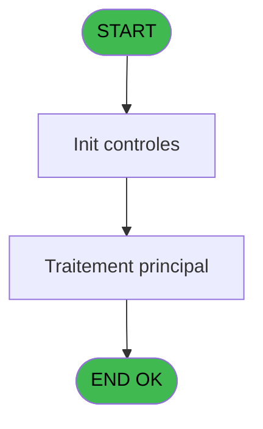

# PBP IDE 89 - CSV location

> **Analyse**: Phases 1-4 2026-02-03 09:16 -> 09:17 (19s) | Assemblage 09:17
> **Pipeline**: V7.2 Enrichi
> **Structure**: 4 onglets (Resume | Ecrans | Donnees | Connexions)

<!-- TAB:Resume -->

## 1. FICHE D'IDENTITE

| Attribut | Valeur |
|----------|--------|
| Projet | PBP |
| IDE Position | 89 |
| Nom Programme | CSV location |
| Fichier source | `Prg_89.xml` |
| Domaine metier | General |
| Taches | 1 (0 ecrans visibles) |
| Tables modifiees | 0 |
| Programmes appeles | 0 |

## 2. DESCRIPTION FONCTIONNELLE

**CSV location** assure la gestion complete de ce processus, accessible depuis [Affichage location (IDE 88)](PBP-IDE-88.md).

Le flux de traitement s'organise en **1 blocs fonctionnels** :

- **Traitement** (1 tache) : traitements metier divers

**Logique metier** : 1 regles identifiees couvrant conditions metier.

## 3. BLOCS FONCTIONNELS

### 3.1 Traitement (1 tache)

Traitements internes.

---

#### 89 - CSV Résultat [[ECRAN]](#ecran-t4)

**Role** : Traitement : CSV Résultat.
**Ecran** : 880 x 265 DLU (Modal) | [Voir mockup](#ecran-t4)

## 5. REGLES METIER

1 regles identifiees:

### Autres (1 regles)

#### [RM-001] Traitement si Trim([O]) est renseigne

| Element | Detail |
|---------|--------|
| **Condition** | `Trim([O])<>''` |
| **Si vrai** | 'TYPPRA' |
| **Si faux** | 'TYPGLI') |
| **Expression source** | Expression 11 : `IF(Trim([O])<>'','TYPPRA','TYPGLI')` |
| **Exemple** | Si Trim([O])<>'' → 'TYPPRA'. Sinon → 'TYPGLI') |

## 6. CONTEXTE

- **Appele par**: [Affichage location (IDE 88)](PBP-IDE-88.md)
- **Appelle**: 0 programmes | **Tables**: 9 (W:0 R:1 L:8) | **Taches**: 1 | **Expressions**: 46

<!-- TAB:Ecrans -->

## 8. ECRANS

*(Programme sans ecran visible)*

## 9. NAVIGATION

### 9.3 Structure hierarchique (1 tache)

| Position | Tache | Type | Dimensions | Bloc |
|----------|-------|------|------------|------|
| **89.1** | [**CSV Résultat** (89)](#t4) [mockup](#ecran-t4) | Modal | 880x265 | Traitement |

### 9.4 Algorigramme

> **Legende**: Vert = START/END OK | Rouge = END KO | Bleu = Decisions
> *Algorigramme auto-genere. Utiliser `/algorigramme` pour une synthese metier detaillee.*

<!-- TAB:Donnees -->

## 10. TABLES

### Tables utilisees (9)

| ID | Nom | Description | Type | R | W | L | Usages |
|----|-----|-------------|------|---|---|---|--------|
| 30 | gm-recherche_____gmr | Index de recherche | DB |   |   | L | 1 |
| 31 | gm-complet_______gmc |  | DB |   |   | L | 1 |
| 34 | hebergement______heb | Hebergement (chambres) | DB |   |   | L | 1 |
| 402 | pv_sboarder_types |  | DB |   |   | L | 1 |
| 403 | pv_sellers |  | DB |   |   | L | 1 |
| 413 | pv_tva |  | DB | R |   |   | 1 |
| 804 | valeur_credit_bar_defaut |  | DB |   |   | L | 1 |
| 807 | plafond_lit |  | DB |   |   | L | 1 |
| 812 | Prestations         supprime | Prestations/services vendus | DB |   |   | L | 1 |

### Colonnes par table (2 / 1 tables avec colonnes identifiees)

Table 413 - pv_tva (R) - 1 usages

| Lettre | Variable | Acces | Type |
|--------|----------|-------|------|
| A | P.Code prestation | R | Alpha |
| B | P.Type questionnaire | R | Alpha |
| C | P.Clause where | R | Alpha |
| D | P.Existe ligne ? | R | Logical |
| E | V.Existe pv prestations ? | R | Logical |
| F | V.Ligne export old | R | Alpha |
| G | V.Ligne export csv new | R | Unicode |
| H | V.Position reglage | R | Alpha |

## 11. VARIABLES

### 11.1 Parametres entrants (4)

Variables recues du programme appelant ([Affichage location (IDE 88)](PBP-IDE-88.md)).

| Lettre | Nom | Type | Usage dans |
|--------|-----|------|-----------|
| A | P.Code prestation | Alpha | 2x parametre entrant |
| B | P.Type questionnaire | Alpha | 2x parametre entrant |
| C | P.Clause where | Alpha | 2x parametre entrant |
| D | P.Existe ligne ? | Logical | 3x parametre entrant |

### 11.2 Variables de session (4)

Variables persistantes pendant toute la session.

| Lettre | Nom | Type | Usage dans |
|--------|-----|------|-----------|
| E | V.Existe pv prestations ? | Logical | - |
| F | V.Ligne export old | Alpha | - |
| G | V.Ligne export csv new | Unicode | - |
| H | V.Position reglage | Alpha | 2x session |

## 12. EXPRESSIONS

**46 / 46 expressions decodees (100%)**

### 12.1 Repartition par type

| Type | Expressions | Regles |
|------|-------------|--------|
| FORMAT | 5 | 0 |
| CONDITION | 7 | 5 |
| CONSTANTE | 11 | 0 |
| OTHER | 21 | 0 |
| CAST_LOGIQUE | 1 | 0 |
| CONCATENATION | 1 | 0 |

### 12.2 Expressions cles par type

#### FORMAT (5 expressions)

| Type | IDE | Expression | Regle |
|------|-----|------------|-------|
| FORMAT | 45 | `RepStr([EF],'="','')` | - |
| FORMAT | 46 | `RepStr([HP],'"','')` | - |
| FORMAT | 22 | `'="'&DStr([AW],'DD/MM/YYYY')&'"'&VG36&'="'&Trim([BD])&'"'&VG36&'="'&Trim([AO])&'"'&VG36&'="'&Trim([AN])&'"'&VG36&'="'&IF([GC],Trim([GD]),Trim(P.Existe ligne ? [D]))&'"'&VG36&'="'&[AU]&'"'&VG36&'="'&Trim([HB])&'"'&VG36&'="'&IF(Trim([K])<>'',Trim([K]),Trim([J]))&'"'&VG36&'="'&Trim([HA])&'"'&VG36&'="'&Trim(Str(V.Position reglage [H],'3'))&'"'&VG36&'="'&Trim(Str([I],'3.2'))&'"'&VG36&'="'&Str([AV],'3')&'"'&VG36&'="'&Trim([HC])&'"'&VG36&'="'&Trim([HE])&'"'&VG36&'="'&Trim([GI])&VG36&'="'&Trim([FB])&'"'&VG36&'="'&Trim([DH])&'"'&VG36&'="'& IF([HM]='00/00/0000'DATE OR [HM]='01/01/1901'DATE, '', DStr([HM], 'DD/MM/YYYY'))&'"'` | - |
| FORMAT | 36 | `Val(Trim(RepStr([K],',','.')),'2.1')*10` | - |
| FORMAT | 21 | `'="'&DStr([AW],'DD/MM/YYYY')&'"'&VG36&'="'&Trim([BD])&'"'&VG36&'="'&Trim([AO])&'"'&VG36&'="'&Trim([AN])&'"'&VG36&'="'&IF([GC],Trim([GD]),Trim(P.Existe ligne ? [D]))&'"'&VG36&'="'&[AU]&'"'&VG36&'="'&Trim([ET])&'"'&VG36&'="'&IF(Trim([K])<>'',Trim([K]),Trim([J]))&'"'&VG36&'="'&Trim([EP])&'"'&VG36&'="'&Trim(Str(V.Position reglage [H],'3'))&'"'&VG36&'="'&Trim(Str([I],'3.2'))&'"'&VG36&'="'&Str([AV],'3')&'"'&VG36&'="'&Trim([EX])&'"'&VG36&'="'&Trim([GH])&'"'&VG36&'="'&Trim([GI])&'"'&VG36&'="'&Trim([FB])&'"'&VG36&'="'&Trim([DH])&'"'&VG36&'="'& IF([HM]='00/00/0000'DATE OR [HM]='01/01/1901'DATE, '', DStr([HM], 'DD/MM/YYYY'))&'"'` | - |

#### CONDITION (7 expressions)

| Type | IDE | Expression | Regle |
|------|-----|------------|-------|
| CONDITION | 11 | `IF(Trim([O])<>'','TYPPRA','TYPGLI')` | [RM-001](#rm-RM-001) |
| CONDITION | 37 | `[I]<>0 AND [K]<>''` | - |
| CONDITION | 40 | `VG35='FRA'` | - |
| CONDITION | 41 | `VG35<>'FRA'` | - |
| CONDITION | 7 | `CndRange([EC]<>'',[EC])` | - |
| ... | | *+2 autres* | |

#### CONSTANTE (11 expressions)

| Type | IDE | Expression | Regle |
|------|-----|------------|-------|
| CONSTANTE | 18 | `'c:\temp\ea_location.csv'` | - |
| CONSTANTE | 17 | `61` | - |
| CONSTANTE | 19 | `'c:\temp\ea_location_new.csv'` | - |
| CONSTANTE | 30 | `'SKIN'` | - |
| CONSTANTE | 28 | `60` | - |
| ... | | *+6 autres* | |

#### OTHER (21 expressions)

| Type | IDE | Expression | Regle |
|------|-----|------------|-------|
| OTHER | 33 | `[FP]` | - |
| OTHER | 34 | `[FQ]` | - |
| OTHER | 32 | `[FO]` | - |
| OTHER | 29 | `[CN]` | - |
| OTHER | 31 | `P.Existe ligne ? [D]` | - |
| ... | | *+16 autres* | |

#### CAST_LOGIQUE (1 expressions)

| Type | IDE | Expression | Regle |
|------|-----|------------|-------|
| CAST_LOGIQUE | 27 | `'TRUE'LOG` | - |

#### CONCATENATION (1 expressions)

| Type | IDE | Expression | Regle |
|------|-----|------------|-------|
| CONCATENATION | 42 | `MlsTrans('Date Arrivee')&VG36&MlsTrans('Chambre')&VG36&MlsTrans('Nom')&VG36&MlsTrans('Prenom')&VG36&MlsTrans('Prestation')&VG36&MlsTrans('Sexe')&VG36&MlsTrans('Type glisse')&VG36&MlsTrans('Pointure')&VG36&MlsTrans('Niveau pratique')&VG36&MlsTrans('Taille')&VG36&MlsTrans('Poids')&VG36&MlsTrans('Age')&VG36&MlsTrans('Reglage')&VG36&MlsTrans('Casque')&VG36&MlsTrans('Reglage AFNOR')&VG36&MlsTrans('Type cours'&VG36&'Niveau cours')&VG36&MlsTrans('Naissance')` | - |

### 12.3 Toutes les expressions (46)

Voir les 46 expressions

#### FORMAT (5)

| IDE | Expression Decodee |
|-----|-------------------|
| 36 | `Val(Trim(RepStr([K],',','.')),'2.1')*10` |
| 21 | `'="'&DStr([AW],'DD/MM/YYYY')&'"'&VG36&'="'&Trim([BD])&'"'&VG36&'="'&Trim([AO])&'"'&VG36&'="'&Trim([AN])&'"'&VG36&'="'&IF([GC],Trim([GD]),Trim(P.Existe ligne ? [D]))&'"'&VG36&'="'&[AU]&'"'&VG36&'="'&Trim([ET])&'"'&VG36&'="'&IF(Trim([K])<>'',Trim([K]),Trim([J]))&'"'&VG36&'="'&Trim([EP])&'"'&VG36&'="'&Trim(Str(V.Position reglage [H],'3'))&'"'&VG36&'="'&Trim(Str([I],'3.2'))&'"'&VG36&'="'&Str([AV],'3')&'"'&VG36&'="'&Trim([EX])&'"'&VG36&'="'&Trim([GH])&'"'&VG36&'="'&Trim([GI])&'"'&VG36&'="'&Trim([FB])&'"'&VG36&'="'&Trim([DH])&'"'&VG36&'="'& IF([HM]='00/00/0000'DATE OR [HM]='01/01/1901'DATE, '', DStr([HM], 'DD/MM/YYYY'))&'"'` |
| 22 | `'="'&DStr([AW],'DD/MM/YYYY')&'"'&VG36&'="'&Trim([BD])&'"'&VG36&'="'&Trim([AO])&'"'&VG36&'="'&Trim([AN])&'"'&VG36&'="'&IF([GC],Trim([GD]),Trim(P.Existe ligne ? [D]))&'"'&VG36&'="'&[AU]&'"'&VG36&'="'&Trim([HB])&'"'&VG36&'="'&IF(Trim([K])<>'',Trim([K]),Trim([J]))&'"'&VG36&'="'&Trim([HA])&'"'&VG36&'="'&Trim(Str(V.Position reglage [H],'3'))&'"'&VG36&'="'&Trim(Str([I],'3.2'))&'"'&VG36&'="'&Str([AV],'3')&'"'&VG36&'="'&Trim([HC])&'"'&VG36&'="'&Trim([HE])&'"'&VG36&'="'&Trim([GI])&VG36&'="'&Trim([FB])&'"'&VG36&'="'&Trim([DH])&'"'&VG36&'="'& IF([HM]='00/00/0000'DATE OR [HM]='01/01/1901'DATE, '', DStr([HM], 'DD/MM/YYYY'))&'"'` |
| 45 | `RepStr([EF],'="','')` |
| 46 | `RepStr([HP],'"','')` |

#### CONDITION (7)

| IDE | Expression Decodee |
|-----|-------------------|
| 11 | `IF(Trim([O])<>'','TYPPRA','TYPGLI')` |
| 7 | `CndRange([EC]<>'',[EC])` |
| 8 | `CndRange([ED]<>'TOUS',[ED])` |
| 20 | `Counter(0)=1` |
| 37 | `[I]<>0 AND [K]<>''` |
| 40 | `VG35='FRA'` |
| 41 | `VG35<>'FRA'` |

#### CONSTANTE (11)

| IDE | Expression Decodee |
|-----|-------------------|
| 4 | `'H'` |
| 6 | `'L'` |
| 9 | `'TYPPRA'` |
| 10 | `'NIVPRA'` |
| 12 | `'POSPLA'` |
| 16 | `'CASQUE'` |
| 17 | `61` |
| 18 | `'c:\temp\ea_location.csv'` |
| 19 | `'c:\temp\ea_location_new.csv'` |
| 28 | `60` |
| 30 | `'SKIN'` |

#### OTHER (21)

| IDE | Expression Decodee |
|-----|-------------------|
| 1 | `P.Code prestation [A]` |
| 2 | `P.Type questionnaire [B]` |
| 3 | `P.Clause where [C]` |
| 5 | `[AW]` |
| 13 | `P.Code prestation [A]` |
| 14 | `P.Type questionnaire [B]` |
| 15 | `P.Clause where [C]` |
| 23 | `[M]` |
| 24 | `[L]` |
| 25 | `[BL]` |
| 26 | `[O]` |
| 29 | `[CN]` |
| 31 | `P.Existe ligne ? [D]` |
| 32 | `[FO]` |
| 33 | `[FP]` |
| 34 | `[FQ]` |
| 35 | `[N]` |
| 38 | `[GT]` |
| 39 | `[GU]` |
| 43 | `[DC]` |
| 44 | `[GK]` |

#### CAST_LOGIQUE (1)

| IDE | Expression Decodee |
|-----|-------------------|
| 27 | `'TRUE'LOG` |

#### CONCATENATION (1)

| IDE | Expression Decodee |
|-----|-------------------|
| 42 | `MlsTrans('Date Arrivee')&VG36&MlsTrans('Chambre')&VG36&MlsTrans('Nom')&VG36&MlsTrans('Prenom')&VG36&MlsTrans('Prestation')&VG36&MlsTrans('Sexe')&VG36&MlsTrans('Type glisse')&VG36&MlsTrans('Pointure')&VG36&MlsTrans('Niveau pratique')&VG36&MlsTrans('Taille')&VG36&MlsTrans('Poids')&VG36&MlsTrans('Age')&VG36&MlsTrans('Reglage')&VG36&MlsTrans('Casque')&VG36&MlsTrans('Reglage AFNOR')&VG36&MlsTrans('Type cours'&VG36&'Niveau cours')&VG36&MlsTrans('Naissance')` |

<!-- TAB:Connexions -->

## 13. GRAPHE D'APPELS

### 13.1 Chaine depuis Main (Callers)

Main -> ... -> [Affichage location (IDE 88)](PBP-IDE-88.md) -> **CSV location (IDE 89)**

### 13.2 Callers

| IDE | Nom Programme | Nb Appels |
|-----|---------------|-----------|
| [88](PBP-IDE-88.md) | Affichage location | 1 |

### 13.3 Callees (programmes appeles)

### 13.4 Detail Callees avec contexte

| IDE | Nom Programme | Appels | Contexte |
|-----|---------------|--------|----------|
| - | (aucun) | - | - |

## 14. RECOMMANDATIONS MIGRATION

### 14.1 Profil du programme

| Metrique | Valeur | Impact migration |
|----------|--------|-----------------|
| Lignes de logique | 174 | Programme compact |
| Expressions | 46 | Peu de logique |
| Tables WRITE | 0 | Impact faible |
| Sous-programmes | 0 | Peu de dependances |
| Ecrans visibles | 0 | Ecran unique ou traitement batch |
| Code desactive | 0% (0 / 174) | Code sain |
| Regles metier | 1 | Quelques regles a preserver |

### 14.2 Plan de migration par bloc

#### Traitement (1 tache: 1 ecran, 0 traitement)

- **Strategie** : 1 composant(s) UI (Razor/React) avec formulaires et validation.
- Decomposer les taches en services unitaires testables.

### 14.3 Dependances critiques

| Dependance | Type | Appels | Impact |
|------------|------|--------|--------|

---
*Spec DETAILED generee par Pipeline V7.2 - 2026-02-03 09:17*
