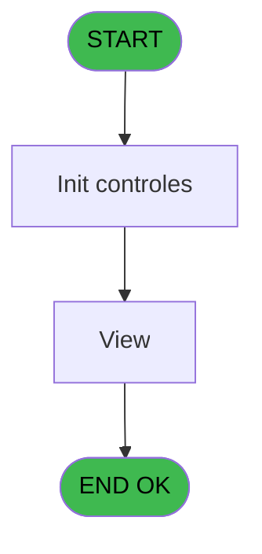

# PBP IDE 9 - Auto Credits Bar

> **Analyse**: Phases 1-4 2026-02-03 00:58 -> 00:58 (20s) | Assemblage 00:58
> **Pipeline**: V7.2 Enrichi
> **Structure**: 4 onglets (Resume | Ecrans | Donnees | Connexions)

<!-- TAB:Resume -->

## 1. FICHE D'IDENTITE

| Attribut | Valeur |
|----------|--------|
| Projet | PBP |
| IDE Position | 9 |
| Nom Programme | Auto Credits Bar |
| Fichier source | `Prg_9.xml` |
| Domaine metier | General |
| Taches | 5 (0 ecrans visibles) |
| Tables modifiees | 0 |
| Programmes appeles | 1 |
| :warning: Statut | **ORPHELIN_POTENTIEL** |

## 2. DESCRIPTION FONCTIONNELLE

**Auto Credits Bar** assure la gestion complete de ce processus.

Le flux de traitement s'organise en **2 blocs fonctionnels** :

- **Traitement** (4 taches) : traitements metier divers
- **Calcul** (1 tache) : calculs de montants, stocks ou compteurs

**Logique metier** : 1 regles identifiees couvrant conditions metier.

Detail : phases du traitement

#### Phase 1 : Traitement (4 taches)

- **9.1** - Automate Credit Bar **[[ECRAN]](#ecran-t1)**
- **9** - Auto Credits Bar
- **9.1.1** - (sans nom)
- **9.3** - View

Delegue a : [Maj Crédit Conso / Type (IDE 10)](PBP-IDE-10.md)

#### Phase 2 : Calcul (1 tache)

- **9.2** - Comptes Spéciaux **[[ECRAN]](#ecran-t5)**

## 3. BLOCS FONCTIONNELS

### 3.1 Traitement (4 taches)

Traitements internes.

---

#### 9.1 - Automate Credit Bar [[ECRAN]](#ecran-t1)

**Role** : Calcul fidelite/avantage : Automate Credit Bar.
**Ecran** : 424 x 401 DLU | [Voir mockup](#ecran-t1)

3 sous-taches directes

| Tache | Nom | Bloc |
|-------|-----|------|
| [9](#t2) | Auto Credits Bar | Traitement |
| [9.1.1](#t4) | (sans nom) | Traitement |
| [9.3](#t6) | View | Traitement |

**Delegue a** : [Maj Crédit Conso / Type (IDE 10)](PBP-IDE-10.md)

---

#### 9 - Auto Credits Bar

**Role** : Calcul fidelite/avantage : Auto Credits Bar.
**Delegue a** : [Maj Crédit Conso / Type (IDE 10)](PBP-IDE-10.md)

---

#### 9.1.1 - (sans nom)

**Role** : Traitement interne.
**Delegue a** : [Maj Crédit Conso / Type (IDE 10)](PBP-IDE-10.md)

---

#### 9.3 - View

**Role** : Traitement : View.
**Delegue a** : [Maj Crédit Conso / Type (IDE 10)](PBP-IDE-10.md)

### 3.2 Calcul (1 tache)

Calculs metier : montants, stocks, compteurs.

---

#### 9.2 - Comptes Spéciaux [[ECRAN]](#ecran-t5)

**Role** : Traitement : Comptes Spéciaux.
**Ecran** : 839 x 0 DLU | [Voir mockup](#ecran-t5)

## 5. REGLES METIER

1 regles identifiees:

### Autres (1 regles)

#### [RM-001] Si V Nbre de jour reel [E]<EOM(Date()) alors V Nbre de jour reel [E] sinon EOM(Date()))

| Element | Detail |
|---------|--------|
| **Condition** | `V Nbre de jour reel [E]<EOM(Date())` |
| **Si vrai** | V Nbre de jour reel [E] |
| **Si faux** | EOM(Date())) |
| **Variables** | E (V Nbre de jour reel) |
| **Expression source** | Expression 5 : `IF(V Nbre de jour reel [E]<EOM(Date()),V Nbre de jour reel [` |
| **Exemple** | Si V Nbre de jour reel [E]<EOM(Date()) → V Nbre de jour reel [E]. Sinon → EOM(Date())) |

## 6. CONTEXTE

- **Appele par**: (aucun)
- **Appelle**: 1 programmes | **Tables**: 6 (W:0 R:4 L:2) | **Taches**: 5 | **Expressions**: 5

<!-- TAB:Ecrans -->

## 8. ECRANS

*(Programme sans ecran visible)*

## 9. NAVIGATION

### 9.3 Structure hierarchique (5 taches)

| Position | Tache | Type | Dimensions | Bloc |
|----------|-------|------|------------|------|
| **9.1** | [**Automate Credit Bar** (9.1)](#t1) [mockup](#ecran-t1) | - | 424x401 | Traitement |
| 9.1.1 | [Auto Credits Bar (9)](#t2) | - | - | |
| 9.1.2 | [(sans nom) (9.1.1)](#t4) | - | - | |
| 9.1.3 | [View (9.3)](#t6) | - | - | |
| **9.2** | [**Comptes Spéciaux** (9.2)](#t5) [mockup](#ecran-t5) | - | 839x0 | Calcul |

### 9.4 Algorigramme

> **Legende**: Vert = START/END OK | Rouge = END KO | Bleu = Decisions
> *Algorigramme auto-genere. Utiliser `/algorigramme` pour une synthese metier detaillee.*

<!-- TAB:Donnees -->

## 10. TABLES

### Tables utilisees (6)

| ID | Nom | Description | Type | R | W | L | Usages |
|----|-----|-------------|------|---|---|---|--------|
| 34 | hebergement______heb | Hebergement (chambres) | DB | R |   |   | 1 |
| 35 | personnel_go______go |  | DB | R |   |   | 1 |
| 131 | fichier_validation |  | DB |   |   | L | 1 |
| 372 | pv_budget |  | DB | R |   |   | 1 |
| 785 | effectif_quotidien |  | DB |   |   | L | 1 |
| 846 | stat_lieu_vente | Statistiques point de vente | TMP | R |   |   | 1 |

### Colonnes par table (4 / 4 tables avec colonnes identifiees)

Table 34 - hebergement______heb (R) - 1 usages

| Lettre | Variable | Acces | Type |
|--------|----------|-------|------|
| A | v.Nb Jours | R | Numeric |
| B | v.date debut | R | Date |
| C | v.date fin | R | Date |
| D | v.Montant | R | Numeric |

Table 35 - personnel_go______go (R) - 1 usages

| Lettre | Variable | Acces | Type |
|--------|----------|-------|------|
| A | v Nbre de jour | R | Numeric |
| B | v Date de Début Calculée | R | Date |
| C | v Date de Fin Calculée | R | Date |
| D | v Montant à créditer | R | Numeric |

Table 372 - pv_budget (R) - 1 usages

| Lettre | Variable | Acces | Type |
|--------|----------|-------|------|
| A | V.Clause where | R | Alpha |
| B | v.date Debut Personnel | R | Date |
| C | v.date Fin Personnel | R | Date |

Table 846 - stat_lieu_vente (R) - 1 usages

| Lettre | Variable | Acces | Type |
|--------|----------|-------|------|
| A | V Nbre/ Jour Mois | R | Numeric |
| B | V Heure | R | Time |
| C | V Date Debut | R | Date |
| D | V Date de Fin | R | Date |
| E | V Nbre de jour reel | R | Numeric |
| F | V vcb_Montant*Nbre de jour | R | Numeric |

## 11. VARIABLES

### 11.1 Variables de session (6)

Variables persistantes pendant toute la session.

| Lettre | Nom | Type | Usage dans |
|--------|-----|------|-----------|
| A | V Nbre/ Jour Mois | Numeric | - |
| B | V Heure | Time | - |
| C | V Date Debut | Date | 1x session |
| D | V Date de Fin | Date | - |
| E | V Nbre de jour reel | Numeric | 1x session |
| F | V vcb_Montant*Nbre de jour | Numeric | - |

## 12. EXPRESSIONS

**5 / 5 expressions decodees (100%)**

### 12.1 Repartition par type

| Type | Expressions | Regles |
|------|-------------|--------|
| CONDITION | 2 | 5 |
| FORMAT | 1 | 0 |
| DATE | 2 | 0 |

### 12.2 Expressions cles par type

#### CONDITION (2 expressions)

| Type | IDE | Expression | Regle |
|------|-----|------------|-------|
| CONDITION | 5 | `IF(V Nbre de jour reel [E]<EOM(Date()),V Nbre de jour reel [E],EOM(Date()))` | [RM-001](#rm-RM-001) |
| CONDITION | 2 | `V Date Debut [C]='N' OR Trim(V Date Debut [C])=''` | - |

#### FORMAT (1 expressions)

| Type | IDE | Expression | Regle |
|------|-----|------------|-------|
| FORMAT | 1 | `'valide__o_n_ = ''O'''&' AND go_date_fin > '''&DStr(Date(),'YYYYMMDD')&''''` | - |

#### DATE (2 expressions)

| Type | IDE | Expression | Regle |
|------|-----|------------|-------|
| DATE | 4 | `EOM(Date())` | - |
| DATE | 3 | `BOM(Date())` | - |

<!-- TAB:Connexions -->

## 13. GRAPHE D'APPELS

### 13.1 Chaine depuis Main (Callers)

**Chemin**: (pas de callers directs)

### 13.2 Callers

| IDE | Nom Programme | Nb Appels |
|-----|---------------|-----------|
| - | (aucun) | - |

### 13.3 Callees (programmes appeles)

### 13.4 Detail Callees avec contexte

| IDE | Nom Programme | Appels | Contexte |
|-----|---------------|--------|----------|
| [10](PBP-IDE-10.md) | Maj Crédit Conso / Type | 1 | Mise a jour donnees |

## 14. RECOMMANDATIONS MIGRATION

### 14.1 Profil du programme

| Metrique | Valeur | Impact migration |
|----------|--------|-----------------|
| Lignes de logique | 94 | Programme compact |
| Expressions | 5 | Peu de logique |
| Tables WRITE | 0 | Impact faible |
| Sous-programmes | 1 | Peu de dependances |
| Ecrans visibles | 0 | Ecran unique ou traitement batch |
| Code desactive | 1.1% (1 / 94) | Code sain |
| Regles metier | 1 | Quelques regles a preserver |

### 14.2 Plan de migration par bloc

#### Traitement (4 taches: 1 ecran, 3 traitements)

- **Strategie** : Orchestrateur avec 1 ecrans (Razor/React) et 3 traitements backend (services).
- Les ecrans deviennent des composants UI, les traitements invisibles deviennent des services injectables.
- 1 sous-programme(s) a migrer ou a reutiliser depuis les services existants.
- Decomposer les taches en services unitaires testables.

#### Calcul (1 tache: 1 ecran, 0 traitement)

- **Strategie** : Services de calcul purs (Domain Services).
- Migrer la logique de calcul (stock, compteurs, montants)

### 14.3 Dependances critiques

| Dependance | Type | Appels | Impact |
|------------|------|--------|--------|
| [Maj Crédit Conso / Type (IDE 10)](PBP-IDE-10.md) | Sous-programme | 1x | Normale - Mise a jour donnees |

---
*Spec DETAILED generee par Pipeline V7.2 - 2026-02-03 00:58*
