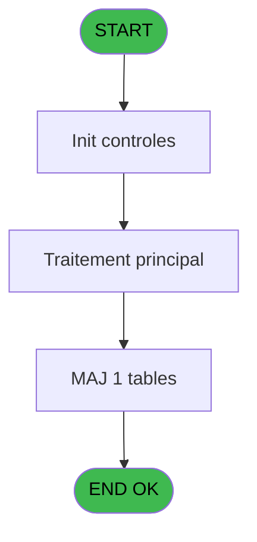

# PBP IDE 90 - Calcul position reglage

> **Analyse**: Phases 1-4 2026-02-03 09:17 -> 09:17 (19s) | Assemblage 09:17
> **Pipeline**: V7.2 Enrichi
> **Structure**: 4 onglets (Resume | Ecrans | Donnees | Connexions)

<!-- TAB:Resume -->

## 1. FICHE D'IDENTITE

| Attribut | Valeur |
|----------|--------|
| Projet | PBP |
| IDE Position | 90 |
| Nom Programme | Calcul position reglage |
| Fichier source | `Prg_90.xml` |
| Domaine metier | General |
| Taches | 2 (0 ecrans visibles) |
| Tables modifiees | 1 |
| Programmes appeles | 0 |
| :warning: Statut | **ORPHELIN_POTENTIEL** |

## 2. DESCRIPTION FONCTIONNELLE

**Calcul position reglage** assure la gestion complete de ce processus.

Le flux de traitement s'organise en **2 blocs fonctionnels** :

- **Traitement** (1 tache) : traitements metier divers
- **Reglement** (1 tache) : gestion des moyens de paiement et reglements

**Donnees modifiees** : 1 tables en ecriture (import_go_sequence).

Detail : phases du traitement

#### Phase 1 : Reglement (1 tache)

- **90** - Calcul position reglage

#### Phase 2 : Traitement (1 tache)

- **90.1** - Lecture nouvelle ligne

#### Tables impactees

| Table | Operations | Role metier |
|-------|-----------|-------------|
| import_go_sequence | R/**W** (2 usages) |  |

## 3. BLOCS FONCTIONNELS

### 3.1 Reglement (1 tache)

Gestion des moyens de paiement : 1 tache de reglement.

---

#### 90 - Calcul position reglage

**Role** : Calcul : Calcul position reglage.
**Variables liees** : F (P.Position reglage)

### 3.2 Traitement (1 tache)

Traitements internes.

---

#### 90.1 - Lecture nouvelle ligne

**Role** : Creation d'enregistrement : Lecture nouvelle ligne.
**Variables liees** : G (V.Ligne a traiter)

## 5. REGLES METIER

*(Aucune regle metier identifiee)*

## 6. CONTEXTE

- **Appele par**: (aucun)
- **Appelle**: 0 programmes | **Tables**: 1 (W:1 R:1 L:0) | **Taches**: 2 | **Expressions**: 16

<!-- TAB:Ecrans -->

## 8. ECRANS

*(Programme sans ecran visible)*

## 9. NAVIGATION

### 9.3 Structure hierarchique (2 taches)

| Position | Tache | Type | Dimensions | Bloc |
|----------|-------|------|------------|------|
| **90.1** | [**Calcul position reglage** (90)](#t1) | - | - | Reglement |
| **90.2** | [**Lecture nouvelle ligne** (90.1)](#t2) | - | - | Traitement |

### 9.4 Algorigramme

> **Legende**: Vert = START/END OK | Rouge = END KO | Bleu = Decisions
> *Algorigramme auto-genere. Utiliser `/algorigramme` pour une synthese metier detaillee.*

<!-- TAB:Donnees -->

## 10. TABLES

### Tables utilisees (1)

| ID | Nom | Description | Type | R | W | L | Usages |
|----|-----|-------------|------|---|---|---|--------|
| 830 | import_go_sequence |  | DB | R | **W** |   | 2 |

### Colonnes par table (1 / 1 tables avec colonnes identifiees)

Table 830 - import_go_sequence (R/**W**) - 2 usages

| Lettre | Variable | Acces | Type |
|--------|----------|-------|------|
| A | P.Sexe | W | Alpha |
| B | P.Age | W | Numeric |
| C | P.Poids | W | Numeric |
| D | P.Pointure | W | Numeric |
| E | P.Niveau pratique | W | Alpha |
| F | P.Position reglage | W | Alpha |
| G | V.Ligne a traiter | W | Numeric |

## 11. VARIABLES

### 11.1 Parametres entrants (6)

Variables recues en parametre.

| Lettre | Nom | Type | Usage dans |
|--------|-----|------|-----------|
| A | P.Sexe | Alpha | 1x parametre entrant |
| B | P.Age | Numeric | 1x parametre entrant |
| C | P.Poids | Numeric | 1x parametre entrant |
| D | P.Pointure | Numeric | 4x parametre entrant |
| E | P.Niveau pratique | Alpha | - |
| F | P.Position reglage | Alpha | - |

### 11.2 Variables de session (1)

Variables persistantes pendant toute la session.

| Lettre | Nom | Type | Usage dans |
|--------|-----|------|-----------|
| G | V.Ligne a traiter | Numeric | 2x session |

## 12. EXPRESSIONS

**16 / 16 expressions decodees (100%)**

### 12.1 Repartition par type

| Type | Expressions | Regles |
|------|-------------|--------|
| CALCULATION | 3 | 0 |
| OTHER | 5 | 0 |
| CONDITION | 8 | 0 |

### 12.2 Expressions cles par type

#### CALCULATION (3 expressions)

| Type | IDE | Expression | Regle |
|------|-----|------------|-------|
| CALCULATION | 14 | `[N]+2` | - |
| CALCULATION | 13 | `[N]-3` | - |
| CALCULATION | 9 | `[N]+1` | - |

#### OTHER (5 expressions)

| Type | IDE | Expression | Regle |
|------|-----|------------|-------|
| OTHER | 8 | `V.Ligne a traiter [G]` | - |
| OTHER | 15 | `[L]` | - |
| OTHER | 3 | `P.Age [B]` | - |
| OTHER | 1 | `P.Poids [C]` | - |
| OTHER | 2 | `P.Sexe [A]` | - |

#### CONDITION (8 expressions)

| Type | IDE | Expression | Regle |
|------|-----|------------|-------|
| CONDITION | 11 | `[M]<50` | - |
| CONDITION | 10 | `[M]>=25` | - |
| CONDITION | 16 | `[N]<>V.Ligne a traiter [G]` | - |
| CONDITION | 12 | `[M]>=50` | - |
| CONDITION | 5 | `P.Pointure [D]='2'` | - |
| ... | | *+3 autres* | |

<!-- TAB:Connexions -->

## 13. GRAPHE D'APPELS

### 13.1 Chaine depuis Main (Callers)

**Chemin**: (pas de callers directs)

### 13.2 Callers

| IDE | Nom Programme | Nb Appels |
|-----|---------------|-----------|
| - | (aucun) | - |

### 13.3 Callees (programmes appeles)

### 13.4 Detail Callees avec contexte

| IDE | Nom Programme | Appels | Contexte |
|-----|---------------|--------|----------|
| - | (aucun) | - | - |

## 14. RECOMMANDATIONS MIGRATION

### 14.1 Profil du programme

| Metrique | Valeur | Impact migration |
|----------|--------|-----------------|
| Lignes de logique | 42 | Programme compact |
| Expressions | 16 | Peu de logique |
| Tables WRITE | 1 | Impact faible |
| Sous-programmes | 0 | Peu de dependances |
| Ecrans visibles | 0 | Ecran unique ou traitement batch |
| Code desactive | 0% (0 / 42) | Code sain |
| Regles metier | 0 | Pas de regle identifiee |

### 14.2 Plan de migration par bloc

#### Reglement (1 tache: 0 ecran, 1 traitement)

- **Strategie** : Service `IReglementService` avec pattern Strategy par mode de paiement.
- Integration TPE si applicable

#### Traitement (1 tache: 0 ecran, 1 traitement)

- **Strategie** : 1 service(s) backend injectable(s) (Domain Services).
- Decomposer les taches en services unitaires testables.

### 14.3 Dependances critiques

| Dependance | Type | Appels | Impact |
|------------|------|--------|--------|
| import_go_sequence | Table WRITE (Database) | 1x | Schema + repository |

---
*Spec DETAILED generee par Pipeline V7.2 - 2026-02-03 09:17*
