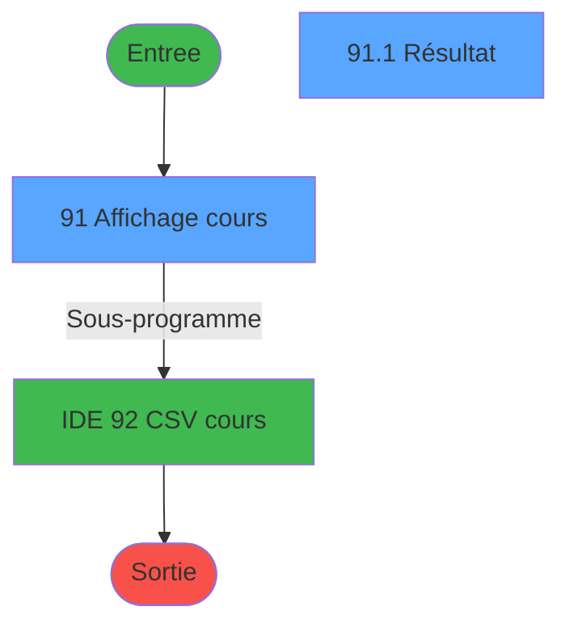
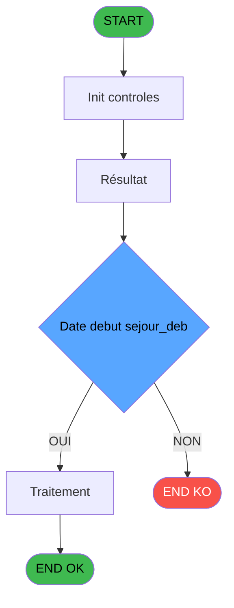
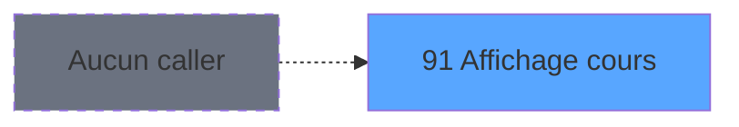
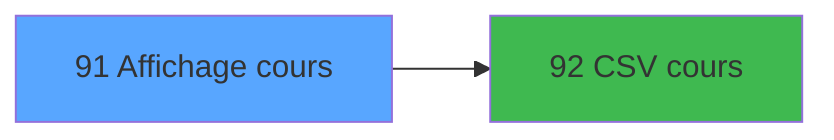

# PBP IDE 91 - Affichage cours

> **Analyse**: Phases 1-4 2026-02-03 09:17 -> 09:18 (19s) | Assemblage 09:18
> **Pipeline**: V7.2 Enrichi
> **Structure**: 4 onglets (Resume | Ecrans | Donnees | Connexions)

<!-- TAB:Resume -->

## 1. FICHE D'IDENTITE

| Attribut | Valeur |
|----------|--------|
| Projet | PBP |
| IDE Position | 91 |
| Nom Programme | Affichage cours |
| Fichier source | `Prg_91.xml` |
| Domaine metier | General |
| Taches | 3 (2 ecrans visibles) |
| Tables modifiees | 0 |
| Programmes appeles | 1 |
| :warning: Statut | **ORPHELIN_POTENTIEL** |

## 2. DESCRIPTION FONCTIONNELLE

**Affichage cours** assure la gestion complete de ce processus.

Le flux de traitement s'organise en **2 blocs fonctionnels** :

- **Traitement** (2 taches) : traitements metier divers
- **Consultation** (1 tache) : ecrans de recherche, selection et consultation

**Logique metier** : 1 regles identifiees couvrant valeurs par defaut.

Detail : phases du traitement

#### Phase 1 : Consultation (1 tache)

- **91** - Affichage cours **[[ECRAN]](#ecran-t1)**

#### Phase 2 : Traitement (2 taches)

- **91.1** - Résultat **[[ECRAN]](#ecran-t2)**
- **91.1.1** - Ecriture reponse

Delegue a : [CSV cours (IDE 92)](PBP-IDE-92.md)

## 3. BLOCS FONCTIONNELS

### 3.1 Consultation (1 tache)

Ecrans de recherche et consultation.

---

#### 91 - Affichage cours [[ECRAN]](#ecran-t1)

**Role** : Reinitialisation : Affichage cours.
**Ecran** : 1774 x 358 DLU (MDI) | [Voir mockup](#ecran-t1)

### 3.2 Traitement (2 taches)

Traitements internes.

---

#### 91.1 - Résultat [[ECRAN]](#ecran-t2)

**Role** : Traitement : Résultat.
**Ecran** : 880 x 265 DLU (Modal) | [Voir mockup](#ecran-t2)
**Delegue a** : [CSV cours (IDE 92)](PBP-IDE-92.md)

---

#### 91.1.1 - Ecriture reponse

**Role** : Traitement : Ecriture reponse.
**Delegue a** : [CSV cours (IDE 92)](PBP-IDE-92.md)

## 5. REGLES METIER

1 regles identifiees:

### Autres (1 regles)

#### [RM-001] Valeur par defaut si w0_Date debut sejour_deb [A]<>0,'B.gmr_debut_sejour> est vide

| Element | Detail |
|---------|--------|
| **Condition** | `w0_Date debut sejour_deb [A]<>0` |
| **Si vrai** | 'B.gmr_debut_sejour>='''&DStr(w0_Date debut sejour_deb [A] |
| **Si faux** | 'YYYYMMDD')&'''','')&IF(w0_Date debut sejour_deb [A]<>0 AND [CY]<>0,' and ','')&IF([CY]<>0,'B.gmr_debut_sejour<='''&DStr([CY],'YYYYMMDD')&'''','') |
| **Variables** | A (w0_Date debut sejour_deb) |
| **Expression source** | Expression 7 : `IF(w0_Date debut sejour_deb [A]<>0,'B.gmr_debut_sejour>='''&` |
| **Exemple** | Si w0_Date debut sejour_deb [A]<>0 → 'B.gmr_debut_sejour>='''&DStr(w0_Date debut sejour_deb [A] |

## 6. CONTEXTE

- **Appele par**: (aucun)
- **Appelle**: 1 programmes | **Tables**: 6 (W:0 R:2 L:4) | **Taches**: 3 | **Expressions**: 18

<!-- TAB:Ecrans -->

## 8. ECRANS

### 8.1 Forms visibles (2 / 3)

| # | Position | Tache | Nom | Type | Largeur | Hauteur | Bloc |
|---|----------|-------|-----|------|---------|---------|------|
| 1 | 91 | 91 | Affichage cours | MDI | 1774 | 358 | Consultation |
| 2 | 91.1 | 91.1 | Résultat | Modal | 880 | 265 | Traitement |

### 8.2 Mockups Ecrans

---

#### 91 - Affichage cours
**Tache** : [91](#t1) | **Type** : MDI | **Dimensions** : 1774 x 358 DLU
**Bloc** : Consultation | **Titre IDE** : Affichage cours

<!-- FORM-DATA:
{
    "width":  1774,
    "vFactor":  8,
    "type":  "MDI",
    "hFactor":  8,
    "controls":  [
                     {
                         "x":  1,
                         "type":  "label",
                         "var":  "",
                         "y":  0,
                         "w":  1758,
                         "fmt":  "",
                         "name":  "",
                         "h":  20,
                         "color":  "1",
                         "text":  "",
                         "parent":  null
                     },
                     {
                         "x":  10,
                         "type":  "label",
                         "var":  "",
                         "y":  25,
                         "w":  1751,
                         "fmt":  "",
                         "name":  "",
                         "h":  61,
                         "color":  "195",
                         "text":  "Critères",
                         "parent":  null
                     },
                     {
                         "x":  18,
                         "type":  "label",
                         "var":  "",
                         "y":  38,
                         "w":  143,
                         "fmt":  "",
                         "name":  "",
                         "h":  9,
                         "color":  "",
                         "text":  "Date début séjour",
                         "parent":  5
                     },
                     {
                         "x":  18,
                         "type":  "label",
                         "var":  "",
                         "y":  66,
                         "w":  154,
                         "fmt":  "",
                         "name":  "",
                         "h":  12,
                         "color":  "",
                         "text":  "Type questionnaire",
                         "parent":  5
                     },
                     {
                         "x":  326,
                         "type":  "label",
                         "var":  "",
                         "y":  38,
                         "w":  29,
                         "fmt":  "",
                         "name":  "",
                         "h":  9,
                         "color":  "",
                         "text":  "au",
                         "parent":  5
                     },
                     {
                         "x":  6,
                         "type":  "edit",
                         "var":  "",
                         "y":  2,
                         "w":  267,
                         "fmt":  "20",
                         "name":  "",
                         "h":  8,
                         "color":  "",
                         "text":  "",
                         "parent":  1
                     },
                     {
                         "x":  1472,
                         "type":  "edit",
                         "var":  "",
                         "y":  5,
                         "w":  267,
                         "fmt":  "WWW DD MMM YYYYT",
                         "name":  "",
                         "h":  8,
                         "color":  "",
                         "text":  "",
                         "parent":  1
                     },
                     {
                         "x":  6,
                         "type":  "edit",
                         "var":  "",
                         "y":  11,
                         "w":  331,
                         "fmt":  "25",
                         "name":  "",
                         "h":  8,
                         "color":  "",
                         "text":  "",
                         "parent":  1
                     },
                     {
                         "x":  169,
                         "type":  "edit",
                         "var":  "",
                         "y":  37,
                         "w":  126,
                         "fmt":  "##/##/####Z",
                         "name":  "w0_Date_debut_sejour_deb",
                         "h":  10,
                         "color":  "110",
                         "text":  "",
                         "parent":  5
                     },
                     {
                         "x":  295,
                         "type":  "button",
                         "var":  "",
                         "y":  37,
                         "w":  25,
                         "fmt":  "...",
                         "name":  "b_Date_deb_sej_deb",
                         "h":  10,
                         "color":  "",
                         "text":  "",
                         "parent":  5
                     },
                     {
                         "x":  363,
                         "type":  "edit",
                         "var":  "",
                         "y":  37,
                         "w":  126,
                         "fmt":  "##/##/####Z",
                         "name":  "w0_date_debut_sejour_fin",
                         "h":  10,
                         "color":  "110",
                         "text":  "",
                         "parent":  5
                     },
                     {
                         "x":  489,
                         "type":  "button",
                         "var":  "",
                         "y":  37,
                         "w":  25,
                         "fmt":  "...",
                         "name":  "b_Date_deb_sej_fin",
                         "h":  10,
                         "color":  "",
                         "text":  "",
                         "parent":  5
                     },
                     {
                         "x":  1429,
                         "type":  "button",
                         "var":  "",
                         "y":  63,
                         "w":  154,
                         "fmt":  "Rechercher",
                         "name":  "",
                         "h":  18,
                         "color":  "",
                         "text":  "",
                         "parent":  5
                     },
                     {
                         "x":  1594,
                         "type":  "button",
                         "var":  "",
                         "y":  63,
                         "w":  154,
                         "fmt":  "Quitter",
                         "name":  "",
                         "h":  18,
                         "color":  "",
                         "text":  "",
                         "parent":  null
                     },
                     {
                         "x":  169,
                         "type":  "combobox",
                         "var":  "",
                         "y":  66,
                         "w":  358,
                         "fmt":  "",
                         "name":  "w0_Type questionnaire",
                         "h":  12,
                         "color":  "",
                         "text":  "TOUS",
                         "parent":  5
                     },
                     {
                         "x":  5,
                         "type":  "subform",
                         "var":  "",
                         "y":  88,
                         "w":  1765,
                         "fmt":  "",
                         "name":  "RESULTAT",
                         "h":  266,
                         "color":  "",
                         "text":  "",
                         "parent":  null
                     }
                 ],
    "taskId":  "91",
    "height":  358
}
-->

<strong>Champs : 6 champs</strong>

| Pos (x,y) | Nom | Variable | Type |
|-----------|-----|----------|------|
| 6,2 | 20 | - | edit |
| 1472,5 | WWW DD MMM YYYYT | - | edit |
| 6,11 | 25 | - | edit |
| 169,37 | w0_Date_debut_sejour_deb | - | edit |
| 363,37 | w0_date_debut_sejour_fin | - | edit |
| 169,66 | w0_Type questionnaire | - | combobox |

<strong>Boutons : 4 boutons</strong>

| Bouton | Pos (x,y) | Action |
|--------|-----------|--------|
| ... | 295,37 | Bouton fonctionnel |
| ... | 489,37 | Bouton fonctionnel |
| Rechercher | 1429,63 | Ouvre la selection |
| Quitter | 1594,63 | Quitte le programme |

---

#### 91.1 - Résultat
**Tache** : [91.1](#t2) | **Type** : Modal | **Dimensions** : 880 x 265 DLU
**Bloc** : Traitement | **Titre IDE** : Résultat

<!-- FORM-DATA:
{
    "width":  880,
    "vFactor":  8,
    "type":  "Modal",
    "hFactor":  4,
    "controls":  [
                     {
                         "x":  3,
                         "type":  "table",
                         "var":  "",
                         "name":  "",
                         "titleH":  12,
                         "color":  "110",
                         "w":  1325,
                         "y":  1,
                         "fmt":  "",
                         "parent":  null,
                         "text":  "",
                         "rowH":  15,
                         "h":  233,
                         "cols":  [
                                      {
                                          "title":  "Type questionnaire",
                                          "layer":  1,
                                          "w":  166
                                      },
                                      {
                                          "title":  "Nom",
                                          "layer":  2,
                                          "w":  110
                                      },
                                      {
                                          "title":  "Prénom",
                                          "layer":  3,
                                          "w":  73
                                      },
                                      {
                                          "title":  "Début séjour",
                                          "layer":  4,
                                          "w":  53
                                      },
                                      {
                                          "title":  "Fin séjour",
                                          "layer":  5,
                                          "w":  58
                                      },
                                      {
                                          "title":  "Age",
                                          "layer":  6,
                                          "w":  23
                                      },
                                      {
                                          "title":  "Sexe",
                                          "layer":  7,
                                          "w":  24
                                      },
                                      {
                                          "title":  "N° chambre",
                                          "layer":  8,
                                          "w":  45
                                      },
                                      {
                                          "title":  "Type cours",
                                          "layer":  9,
                                          "w":  75
                                      },
                                      {
                                          "title":  "Niveau cours",
                                          "layer":  10,
                                          "w":  91
                                      },
                                      {
                                          "title":  "Langue",
                                          "layer":  11,
                                          "w":  153
                                      },
                                      {
                                          "title":  "Nom contact",
                                          "layer":  12,
                                          "w":  178
                                      },
                                      {
                                          "title":  "Prénom contact",
                                          "layer":  13,
                                          "w":  174
                                      },
                                      {
                                          "title":  "N° portable",
                                          "layer":  14,
                                          "w":  99
                                      }
                                  ],
                         "rows":  14
                     },
                     {
                         "x":  6,
                         "type":  "label",
                         "var":  "",
                         "y":  239,
                         "w":  872,
                         "fmt":  "",
                         "name":  "",
                         "h":  24,
                         "color":  "1",
                         "text":  "",
                         "parent":  null
                     },
                     {
                         "x":  7,
                         "type":  "edit",
                         "var":  "",
                         "y":  16,
                         "w":  159,
                         "fmt":  "",
                         "name":  "tqu_libelle",
                         "h":  10,
                         "color":  "110",
                         "text":  "",
                         "parent":  2
                     },
                     {
                         "x":  173,
                         "type":  "edit",
                         "var":  "",
                         "y":  16,
                         "w":  106,
                         "fmt":  "",
                         "name":  "gmr_nom__30_",
                         "h":  10,
                         "color":  "110",
                         "text":  "",
                         "parent":  2
                     },
                     {
                         "x":  283,
                         "type":  "edit",
                         "var":  "",
                         "y":  16,
                         "w":  65,
                         "fmt":  "",
                         "name":  "gmr_prenom__8_",
                         "h":  10,
                         "color":  "110",
                         "text":  "",
                         "parent":  2
                     },
                     {
                         "x":  355,
                         "type":  "edit",
                         "var":  "",
                         "y":  16,
                         "w":  49,
                         "fmt":  "DD/MM/YYYYZ",
                         "name":  "gmr_debut_sejour",
                         "h":  10,
                         "color":  "110",
                         "text":  "",
                         "parent":  2
                     },
                     {
                         "x":  409,
                         "type":  "edit",
                         "var":  "",
                         "y":  16,
                         "w":  52,
                         "fmt":  "DD/MM/YYYYZ",
                         "name":  "gmr_fin_sejour",
                         "h":  10,
                         "color":  "110",
                         "text":  "",
                         "parent":  2
                     },
                     {
                         "x":  467,
                         "type":  "edit",
                         "var":  "",
                         "y":  16,
                         "w":  16,
                         "fmt":  "3Z",
                         "name":  "gmr_age_num",
                         "h":  10,
                         "color":  "110",
                         "text":  "",
                         "parent":  2
                     },
                     {
                         "x":  497,
                         "type":  "edit",
                         "var":  "",
                         "y":  16,
                         "w":  6,
                         "fmt":  "",
                         "name":  "gmr_sexe",
                         "h":  10,
                         "color":  "110",
                         "text":  "",
                         "parent":  2
                     },
                     {
                         "x":  515,
                         "type":  "edit",
                         "var":  "",
                         "y":  16,
                         "w":  39,
                         "fmt":  "",
                         "name":  "heb_nom_logement",
                         "h":  10,
                         "color":  "110",
                         "text":  "",
                         "parent":  2
                     },
                     {
                         "x":  560,
                         "type":  "combobox",
                         "var":  "",
                         "y":  16,
                         "w":  68,
                         "fmt":  "",
                         "name":  "eci_type_cours",
                         "h":  12,
                         "color":  "110",
                         "text":  "",
                         "parent":  2
                     },
                     {
                         "x":  634,
                         "type":  "edit",
                         "var":  "",
                         "y":  16,
                         "w":  84,
                         "fmt":  "",
                         "name":  "eci_niv_cours_0001",
                         "h":  10,
                         "color":  "110",
                         "text":  "",
                         "parent":  2
                     },
                     {
                         "x":  724,
                         "type":  "edit",
                         "var":  "",
                         "y":  16,
                         "w":  149,
                         "fmt":  "",
                         "name":  "eci_langue_parlee",
                         "h":  10,
                         "color":  "110",
                         "text":  "",
                         "parent":  2
                     },
                     {
                         "x":  878,
                         "type":  "edit",
                         "var":  "",
                         "y":  16,
                         "w":  171,
                         "fmt":  "",
                         "name":  "eci_nom_contact",
                         "h":  10,
                         "color":  "110",
                         "text":  "",
                         "parent":  2
                     },
                     {
                         "x":  1056,
                         "type":  "edit",
                         "var":  "",
                         "y":  16,
                         "w":  165,
                         "fmt":  "",
                         "name":  "eci_prenom_contact",
                         "h":  10,
                         "color":  "110",
                         "text":  "",
                         "parent":  2
                     },
                     {
                         "x":  1228,
                         "type":  "edit",
                         "var":  "",
                         "y":  16,
                         "w":  95,
                         "fmt":  "",
                         "name":  "eci_num_portable",
                         "h":  10,
                         "color":  "110",
                         "text":  "",
                         "parent":  2
                     },
                     {
                         "x":  516,
                         "type":  "button",
                         "var":  "",
                         "y":  242,
                         "w":  116,
                         "fmt":  "\u0026Modification",
                         "name":  "",
                         "h":  18,
                         "color":  "",
                         "text":  "",
                         "parent":  31
                     },
                     {
                         "x":  637,
                         "type":  "button",
                         "var":  "",
                         "y":  242,
                         "w":  116,
                         "fmt":  "Extraction \u0026Publipostage",
                         "name":  "Publipostage",
                         "h":  18,
                         "color":  "",
                         "text":  "",
                         "parent":  31
                     },
                     {
                         "x":  758,
                         "type":  "button",
                         "var":  "",
                         "y":  242,
                         "w":  116,
                         "fmt":  "Extraction \u0026Excel",
                         "name":  "Excel",
                         "h":  18,
                         "color":  "",
                         "text":  "",
                         "parent":  31
                     }
                 ],
    "taskId":  "91.1",
    "height":  265
}
-->

<strong>Champs : 14 champs</strong>

| Pos (x,y) | Nom | Variable | Type |
|-----------|-----|----------|------|
| 7,16 | tqu_libelle | - | edit |
| 173,16 | gmr_nom__30_ | - | edit |
| 283,16 | gmr_prenom__8_ | - | edit |
| 355,16 | gmr_debut_sejour | - | edit |
| 409,16 | gmr_fin_sejour | - | edit |
| 467,16 | gmr_age_num | - | edit |
| 497,16 | gmr_sexe | - | edit |
| 515,16 | heb_nom_logement | - | edit |
| 560,16 | eci_type_cours | - | combobox |
| 634,16 | eci_niv_cours_0001 | - | edit |
| 724,16 | eci_langue_parlee | - | edit |
| 878,16 | eci_nom_contact | - | edit |
| 1056,16 | eci_prenom_contact | - | edit |
| 1228,16 | eci_num_portable | - | edit |

<strong>Boutons : 3 boutons</strong>

| Bouton | Pos (x,y) | Action |
|--------|-----------|--------|
| Modification | 516,242 | Modifie l'element |
| Extraction Publipostage | 637,242 | Bouton fonctionnel |
| Extraction Excel | 758,242 | Bouton fonctionnel |

## 9. NAVIGATION

### 9.1 Enchainement des ecrans

**Detail par enchainement :**

| Depuis | Action | Vers | Retour |
|--------|--------|------|--------|
| Affichage cours | Sous-programme | [CSV cours (IDE 92)](PBP-IDE-92.md) | Retour ecran |

### 9.3 Structure hierarchique (3 taches)

| Position | Tache | Type | Dimensions | Bloc |
|----------|-------|------|------------|------|
| **91.1** | [**Affichage cours** (91)](#t1) [mockup](#ecran-t1) | MDI | 1774x358 | Consultation |
| **91.2** | [**Résultat** (91.1)](#t2) [mockup](#ecran-t2) | Modal | 880x265 | Traitement |
| 91.2.1 | [Ecriture reponse (91.1.1)](#t3) | - | - | |

### 9.4 Algorigramme

> **Legende**: Vert = START/END OK | Rouge = END KO | Bleu = Decisions
> *Algorigramme auto-genere. Utiliser `/algorigramme` pour une synthese metier detaillee.*

<!-- TAB:Donnees -->

## 10. TABLES

### Tables utilisees (6)

| ID | Nom | Description | Type | R | W | L | Usages |
|----|-----|-------------|------|---|---|---|--------|
| 30 | gm-recherche_____gmr | Index de recherche | DB | R |   |   | 1 |
| 34 | hebergement______heb | Hebergement (chambres) | DB |   |   | L | 1 |
| 804 | valeur_credit_bar_defaut |  | DB |   |   | L | 1 |
| 805 | vente_par_moyen_paiement | Donnees de ventes | DB | R |   |   | 1 |
| 806 | sale_channel |  | DB |   |   | L | 1 |
| 812 | Prestations         supprime | Prestations/services vendus | DB |   |   | L | 1 |

### Colonnes par table (3 / 2 tables avec colonnes identifiees)

Table 30 - gm-recherche_____gmr (R) - 1 usages

| Lettre | Variable | Acces | Type |
|--------|----------|-------|------|
| A | V.Existe ligne ? | R | Logical |
| B | v.Excel local installé ? | R | Logical |

Table 805 - vente_par_moyen_paiement (R) - 1 usages

| Lettre | Variable | Acces | Type |
|--------|----------|-------|------|
| A | Type question | R | Alpha |
| B | Code reponse | R | Alpha |
| C | Valeur reponse | R | Alpha |

## 11. VARIABLES

### 11.1 Variables de session (1)

Variables persistantes pendant toute la session.

| Lettre | Nom | Type | Usage dans |
|--------|-----|------|-----------|
| I | V.Clause where | Alpha | - |

### 11.2 Autres (8)

Variables diverses.

| Lettre | Nom | Type | Usage dans |
|--------|-----|------|-----------|
| A | w0_Date debut sejour_deb | Date | 3x refs |
| B | b_Date_deb_sej_deb | Alpha | 1x refs |
| C | w0_Date debut sejour fin | Date | 1x refs |
| D | b_Date_deb_sej_fin | Alpha | - |
| E | w0_Type questionnaire | Alpha | - |
| F | b_Quitter | Alpha | 1x refs |
| G | b_Modification | Alpha | 1x refs |
| H | b_Extraction | Alpha | - |

## 12. EXPRESSIONS

**18 / 18 expressions decodees (100%)**

### 12.1 Repartition par type

| Type | Expressions | Regles |
|------|-------------|--------|
| CONDITION | 3 | 5 |
| CONSTANTE | 5 | 0 |
| DATE | 1 | 0 |
| OTHER | 8 | 0 |
| REFERENCE_VG | 1 | 0 |

### 12.2 Expressions cles par type

#### CONDITION (3 expressions)

| Type | IDE | Expression | Regle |
|------|-----|------------|-------|
| CONDITION | 7 | `IF(w0_Date debut sejour_deb [A]<>0,'B.gmr_debut_sejour>='''&DStr(w0_Date debut sejour_deb [A],'YYYYMMDD')&'''','')&IF(w0_Date debut sejour_deb [A]<>0 AND [CY]<>0,' and ','')&IF([CY]<>0,'B.gmr_debut_sejour<='''&DStr([CY],'YYYYMMDD')&'''','')` | [RM-001](#rm-RM-001) |
| CONDITION | 18 | `CndRange({1,3}<>'TOUS',{1,3})` | - |
| CONDITION | 9 | `w0_Date debut sejour_deb [A]>[CY]` | - |

#### CONSTANTE (5 expressions)

| Type | IDE | Expression | Regle |
|------|-----|------------|-------|
| CONSTANTE | 10 | `61` | - |
| CONSTANTE | 16 | `'H'` | - |
| CONSTANTE | 8 | `'TOUS'` | - |
| CONSTANTE | 1 | `'...'` | - |
| CONSTANTE | 6 | `'RESULTAT'` | - |

#### DATE (1 expressions)

| Type | IDE | Expression | Regle |
|------|-----|------------|-------|
| DATE | 4 | `Date ()` | - |

#### OTHER (8 expressions)

| Type | IDE | Expression | Regle |
|------|-----|------------|-------|
| OTHER | 14 | `b_Date_deb_sej_deb [B]` | - |
| OTHER | 13 | `w0_Date debut sejour_deb [A]` | - |
| OTHER | 17 | `[AW]` | - |
| OTHER | 15 | `w0_Date debut sejour fin [C]` | - |
| OTHER | 5 | `GetParam ('VILLAGE')` | - |
| ... | | *+3 autres* | |

#### REFERENCE_VG (1 expressions)

| Type | IDE | Expression | Regle |
|------|-----|------------|-------|
| REFERENCE_VG | 3 | `VG2` | - |

<!-- TAB:Connexions -->

## 13. GRAPHE D'APPELS

### 13.1 Chaine depuis Main (Callers)

**Chemin**: (pas de callers directs)

### 13.2 Callers

| IDE | Nom Programme | Nb Appels |
|-----|---------------|-----------|
| - | (aucun) | - |

### 13.3 Callees (programmes appeles)

### 13.4 Detail Callees avec contexte

| IDE | Nom Programme | Appels | Contexte |
|-----|---------------|--------|----------|
| [92](PBP-IDE-92.md) | CSV cours | 1 | Sous-programme |

## 14. RECOMMANDATIONS MIGRATION

### 14.1 Profil du programme

| Metrique | Valeur | Impact migration |
|----------|--------|-----------------|
| Lignes de logique | 151 | Programme compact |
| Expressions | 18 | Peu de logique |
| Tables WRITE | 0 | Impact faible |
| Sous-programmes | 1 | Peu de dependances |
| Ecrans visibles | 2 | Quelques ecrans |
| Code desactive | 0% (0 / 151) | Code sain |
| Regles metier | 1 | Quelques regles a preserver |

### 14.2 Plan de migration par bloc

#### Consultation (1 tache: 1 ecran, 0 traitement)

- **Strategie** : Composants de recherche/selection en modales.
- 1 ecran : Affichage cours

#### Traitement (2 taches: 1 ecran, 1 traitement)

- **Strategie** : Orchestrateur avec 1 ecrans (Razor/React) et 1 traitements backend (services).
- Les ecrans deviennent des composants UI, les traitements invisibles deviennent des services injectables.
- 1 sous-programme(s) a migrer ou a reutiliser depuis les services existants.
- Decomposer les taches en services unitaires testables.

### 14.3 Dependances critiques

| Dependance | Type | Appels | Impact |
|------------|------|--------|--------|
| [CSV cours (IDE 92)](PBP-IDE-92.md) | Sous-programme | 1x | Normale - Sous-programme |

---
*Spec DETAILED generee par Pipeline V7.2 - 2026-02-03 09:18*
