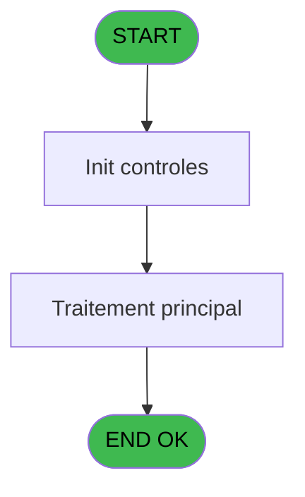

# PBP IDE 92 - CSV cours

> **Analyse**: Phases 1-4 2026-02-03 09:18 -> 09:18 (19s) | Assemblage 09:18
> **Pipeline**: V7.2 Enrichi
> **Structure**: 4 onglets (Resume | Ecrans | Donnees | Connexions)

<!-- TAB:Resume -->

## 1. FICHE D'IDENTITE

| Attribut | Valeur |
|----------|--------|
| Projet | PBP |
| IDE Position | 92 |
| Nom Programme | CSV cours |
| Fichier source | `Prg_92.xml` |
| Domaine metier | General |
| Taches | 1 (0 ecrans visibles) |
| Tables modifiees | 0 |
| Programmes appeles | 0 |

## 2. DESCRIPTION FONCTIONNELLE

**CSV cours** assure la gestion complete de ce processus, accessible depuis [Affichage cours (IDE 91)](PBP-IDE-91.md).

Le flux de traitement s'organise en **1 blocs fonctionnels** :

- **Traitement** (1 tache) : traitements metier divers

## 3. BLOCS FONCTIONNELS

### 3.1 Traitement (1 tache)

Traitements internes.

---

#### 92 - CSV Résultat [[ECRAN]](#ecran-t4)

**Role** : Traitement : CSV Résultat.
**Ecran** : 880 x 265 DLU (Modal) | [Voir mockup](#ecran-t4)

## 5. REGLES METIER

*(Aucune regle metier identifiee)*

## 6. CONTEXTE

- **Appele par**: [Affichage cours (IDE 91)](PBP-IDE-91.md)
- **Appelle**: 0 programmes | **Tables**: 6 (W:0 R:1 L:5) | **Taches**: 1 | **Expressions**: 26

<!-- TAB:Ecrans -->

## 8. ECRANS

*(Programme sans ecran visible)*

## 9. NAVIGATION

### 9.3 Structure hierarchique (1 tache)

| Position | Tache | Type | Dimensions | Bloc |
|----------|-------|------|------------|------|
| **92.1** | [**CSV Résultat** (92)](#t4) [mockup](#ecran-t4) | Modal | 880x265 | Traitement |

### 9.4 Algorigramme

> **Legende**: Vert = START/END OK | Rouge = END KO | Bleu = Decisions
> *Algorigramme auto-genere. Utiliser `/algorigramme` pour une synthese metier detaillee.*

<!-- TAB:Donnees -->

## 10. TABLES

### Tables utilisees (6)

| ID | Nom | Description | Type | R | W | L | Usages |
|----|-----|-------------|------|---|---|---|--------|
| 30 | gm-recherche_____gmr | Index de recherche | DB | R |   |   | 1 |
| 31 | gm-complet_______gmc |  | DB |   |   | L | 1 |
| 34 | hebergement______heb | Hebergement (chambres) | DB |   |   | L | 1 |
| 804 | valeur_credit_bar_defaut |  | DB |   |   | L | 1 |
| 807 | plafond_lit |  | DB |   |   | L | 1 |
| 812 | Prestations         supprime | Prestations/services vendus | DB |   |   | L | 1 |

### Colonnes par table (1 / 1 tables avec colonnes identifiees)

Table 30 - gm-recherche_____gmr (R) - 1 usages

| Lettre | Variable | Acces | Type |
|--------|----------|-------|------|
| A | P.Type questionnaire | R | Alpha |
| B | P.Clause where | R | Alpha |
| C | P.Existe ligne ? | R | Logical |
| D | P.Publipostage | R | Logical |
| E | V.Ligne export old | R | Alpha |
| F | V.Ligne export csv new | R | Unicode |

## 11. VARIABLES

### 11.1 Parametres entrants (4)

Variables recues du programme appelant ([Affichage cours (IDE 91)](PBP-IDE-91.md)).

| Lettre | Nom | Type | Usage dans |
|--------|-----|------|-----------|
| A | P.Type questionnaire | Alpha | 3x parametre entrant |
| B | P.Clause where | Alpha | 3x parametre entrant |
| C | P.Existe ligne ? | Logical | 3x parametre entrant |
| D | P.Publipostage | Logical | - |

### 11.2 Variables de session (2)

Variables persistantes pendant toute la session.

| Lettre | Nom | Type | Usage dans |
|--------|-----|------|-----------|
| E | V.Ligne export old | Alpha | - |
| F | V.Ligne export csv new | Unicode | - |

## 12. EXPRESSIONS

**26 / 26 expressions decodees (100%)**

### 12.1 Repartition par type

| Type | Expressions | Regles |
|------|-------------|--------|
| CONSTANTE | 6 | 0 |
| FORMAT | 7 | 0 |
| OTHER | 7 | 0 |
| CONDITION | 4 | 0 |
| CONCATENATION | 1 | 0 |
| CAST_LOGIQUE | 1 | 0 |

### 12.2 Expressions cles par type

#### CONSTANTE (6 expressions)

| Type | IDE | Expression | Regle |
|------|-----|------------|-------|
| CONSTANTE | 9 | `'c:\temp\ea_cours.csv'` | - |
| CONSTANTE | 10 | `'c:\temp\ea_cours_new.csv'` | - |
| CONSTANTE | 18 | `61` | - |
| CONSTANTE | 4 | `'H'` | - |
| CONSTANTE | 6 | `'C'` | - |
| ... | | *+1 autres* | |

#### FORMAT (7 expressions)

| Type | IDE | Expression | Regle |
|------|-----|------------|-------|
| FORMAT | 24 | `RepStr([EF],'"','')` | - |
| FORMAT | 25 | `RepStr([EF],'="','')` | - |
| FORMAT | 26 | `RepStr([GF],'"','')` | - |
| FORMAT | 22 | `RepStr([EF],'=','')` | - |
| FORMAT | 13 | `'="'&Trim([FQ])&'"'&VG36&'="'&Trim(P.Type questionnaire [A])&'"'&VG36&'="'&Str(P.Clause where [B],'########P0')&'"'&VG36&'="'&Str(P.Existe ligne ? [C],'2L')&'"'&VG36&'="'&DStr([AW],'DD/MM/YYYY')&'"'&VG36&'="'&DStr([AX],'DD/MM/YYYY')&'"'&VG36&'="'&Trim([BD])&'"'&VG36&'="'&Trim([AO])&'"'&VG36&'="'&Trim([AN])&'"'&VG36&'="'&Trim(Str([AV],'3'))&'"'&VG36&'="'&Trim([AU])&'"'&VG36&'="'&IF(Trim([FB])='',Trim([FQ]),Trim([FB]))&'"'&VG36&'="'&Trim([FJ])&'"'&VG36&'="'&Trim([FK])&'"'&VG36&'="'&Trim([FL])&'"'&VG36&'="'&Trim([FM])&'"'&VG36&'="'&Trim([FN])&'"'&VG36&'="'&Trim([FR])&'"'&VG36&'="'&Trim([FS])&'"'&VG36&'="'&Trim([FT])&'"'&VG36&'="'` | - |
| ... | | *+2 autres* | |

#### OTHER (7 expressions)

| Type | IDE | Expression | Regle |
|------|-----|------------|-------|
| OTHER | 16 | `[FI]` | - |
| OTHER | 19 | `[CN]` | - |
| OTHER | 23 | `[FZ]` | - |
| OTHER | 5 | `[AW]` | - |
| OTHER | 1 | `P.Type questionnaire [A]` | - |
| ... | | *+2 autres* | |

#### CONDITION (4 expressions)

| Type | IDE | Expression | Regle |
|------|-----|------------|-------|
| CONDITION | 20 | `VG35='FRA'` | - |
| CONDITION | 21 | `VG35<>'FRA'` | - |
| CONDITION | 7 | `CndRange([ED]<>'TOUS',[ED])` | - |
| CONDITION | 12 | `Counter(0)=1` | - |

#### CONCATENATION (1 expressions)

| Type | IDE | Expression | Regle |
|------|-----|------------|-------|
| CONCATENATION | 11 | `'Type questionnaire'&VG36&'Societe'&VG36&'Compte'&VG36&'Filiation'&VG36&'Date debut'&VG36&'Date fin'&VG36&'Chambre'&VG36&'Nom'&VG36&'Prénom'&VG36&'Age'&VG36&'Sexe'&VG36&'Type cours'&VG36&'Niveau de cours'&VG36&'Langue parlée'&VG36&'Nom contact'&VG36&'Prénom contact'&VG36&'Numéro de portable contact'&VG36&'Nom contact 2'&VG36&'Prénom contact 2'&VG36&'Numéro de portable contact 2'&VG36&'Nom contact 3'&VG36&'Prénom contact 3'&VG36&'Numéro de portable contact 3'&VG36&'Numéro de téléphone skieur ou snowboardeur'&VG36&'Naissance'` | - |

#### CAST_LOGIQUE (1 expressions)

| Type | IDE | Expression | Regle |
|------|-----|------------|-------|
| CAST_LOGIQUE | 17 | `'TRUE'LOG` | - |

### 12.3 Toutes les expressions (26)

Voir les 26 expressions

#### CONSTANTE (6)

| IDE | Expression Decodee |
|-----|-------------------|
| 4 | `'H'` |
| 6 | `'C'` |
| 8 | `'TYPCOU'` |
| 9 | `'c:\temp\ea_cours.csv'` |
| 10 | `'c:\temp\ea_cours_new.csv'` |
| 18 | `61` |

#### FORMAT (7)

| IDE | Expression Decodee |
|-----|-------------------|
| 13 | `'="'&Trim([FQ])&'"'&VG36&'="'&Trim(P.Type questionnaire [A])&'"'&VG36&'="'&Str(P.Clause where [B],'########P0')&'"'&VG36&'="'&Str(P.Existe ligne ? [C],'2L')&'"'&VG36&'="'&DStr([AW],'DD/MM/YYYY')&'"'&VG36&'="'&DStr([AX],'DD/MM/YYYY')&'"'&VG36&'="'&Trim([BD])&'"'&VG36&'="'&Trim([AO])&'"'&VG36&'="'&Trim([AN])&'"'&VG36&'="'&Trim(Str([AV],'3'))&'"'&VG36&'="'&Trim([AU])&'"'&VG36&'="'&IF(Trim([FB])='',Trim([FQ]),Trim([FB]))&'"'&VG36&'="'&Trim([FJ])&'"'&VG36&'="'&Trim([FK])&'"'&VG36&'="'&Trim([FL])&'"'&VG36&'="'&Trim([FM])&'"'&VG36&'="'&Trim([FN])&'"'&VG36&'="'&Trim([FR])&'"'&VG36&'="'&Trim([FS])&'"'&VG36&'="'&Trim([FT])&'"'&VG36&'="'` |
| 14 | `'="'&Trim([FQ])&'"'&VG36&'="'&Trim(P.Type questionnaire [A])&'"'&VG36&'="'&Str(P.Clause where [B],'########P0')&'"'&VG36&'="'&Str(P.Existe ligne ? [C],'2L')&'"'&VG36&'="'&DStr([AW],'DD/MM/YYYY')&'"'&VG36&'="'&DStr([AX],'DD/MM/YYYY')&'"'&VG36&'="'&Trim([BD])&'"'&VG36&'="'&Trim([AO])&'"'&VG36&'="'&Trim([AN])&'"'&VG36&'="'&Trim(Str([AV],'3'))&'"'&VG36&'="'&Trim([AU])&'"'&VG36&'="'&IF(Trim([FY])='',Trim([FQ]),Trim([FB]))&'"'&VG36&'="'&Trim([FJ])&'"'&VG36&'="'&Trim([FK])&'"'&VG36&'="'&Trim([FL])&'"'&VG36&'="'&Trim([FM])&'"'&VG36&'="'&Trim([FN])&'"'&VG36&'="'&Trim([FR])&'"'&VG36&'="'&Trim([FS])&'"'&VG36&'="'&Trim([FT])&'"'&VG36&'="'` |
| 15 | `Trim([EF])&Trim([FU])&'"'&VG36&'="'&Trim([FV])&'"'&VG36&'="'&Trim([FW])&'"'&VG36&'="'&Trim([FX])&'"'&VG36&'="'&IF([GD]='00/00/0000'DATE OR [GD]='01/01/1901'DATE, '', DStr([GD], 'DD/MM/YYYY'))&'"'` |
| 22 | `RepStr([EF],'=','')` |
| 24 | `RepStr([EF],'"','')` |
| 25 | `RepStr([EF],'="','')` |
| 26 | `RepStr([GF],'"','')` |

#### OTHER (7)

| IDE | Expression Decodee |
|-----|-------------------|
| 1 | `P.Type questionnaire [A]` |
| 2 | `P.Clause where [B]` |
| 3 | `P.Existe ligne ? [C]` |
| 5 | `[AW]` |
| 16 | `[FI]` |
| 19 | `[CN]` |
| 23 | `[FZ]` |

#### CONDITION (4)

| IDE | Expression Decodee |
|-----|-------------------|
| 7 | `CndRange([ED]<>'TOUS',[ED])` |
| 12 | `Counter(0)=1` |
| 20 | `VG35='FRA'` |
| 21 | `VG35<>'FRA'` |

#### CONCATENATION (1)

| IDE | Expression Decodee |
|-----|-------------------|
| 11 | `'Type questionnaire'&VG36&'Societe'&VG36&'Compte'&VG36&'Filiation'&VG36&'Date debut'&VG36&'Date fin'&VG36&'Chambre'&VG36&'Nom'&VG36&'Prénom'&VG36&'Age'&VG36&'Sexe'&VG36&'Type cours'&VG36&'Niveau de cours'&VG36&'Langue parlée'&VG36&'Nom contact'&VG36&'Prénom contact'&VG36&'Numéro de portable contact'&VG36&'Nom contact 2'&VG36&'Prénom contact 2'&VG36&'Numéro de portable contact 2'&VG36&'Nom contact 3'&VG36&'Prénom contact 3'&VG36&'Numéro de portable contact 3'&VG36&'Numéro de téléphone skieur ou snowboardeur'&VG36&'Naissance'` |

#### CAST_LOGIQUE (1)

| IDE | Expression Decodee |
|-----|-------------------|
| 17 | `'TRUE'LOG` |

<!-- TAB:Connexions -->

## 13. GRAPHE D'APPELS

### 13.1 Chaine depuis Main (Callers)

Main -> ... -> [Affichage cours (IDE 91)](PBP-IDE-91.md) -> **CSV cours (IDE 92)**

### 13.2 Callers

| IDE | Nom Programme | Nb Appels |
|-----|---------------|-----------|
| [91](PBP-IDE-91.md) | Affichage cours | 1 |

### 13.3 Callees (programmes appeles)

### 13.4 Detail Callees avec contexte

| IDE | Nom Programme | Appels | Contexte |
|-----|---------------|--------|----------|
| - | (aucun) | - | - |

## 14. RECOMMANDATIONS MIGRATION

### 14.1 Profil du programme

| Metrique | Valeur | Impact migration |
|----------|--------|-----------------|
| Lignes de logique | 87 | Programme compact |
| Expressions | 26 | Peu de logique |
| Tables WRITE | 0 | Impact faible |
| Sous-programmes | 0 | Peu de dependances |
| Ecrans visibles | 0 | Ecran unique ou traitement batch |
| Code desactive | 0% (0 / 87) | Code sain |
| Regles metier | 0 | Pas de regle identifiee |

### 14.2 Plan de migration par bloc

#### Traitement (1 tache: 1 ecran, 0 traitement)

- **Strategie** : 1 composant(s) UI (Razor/React) avec formulaires et validation.
- Decomposer les taches en services unitaires testables.

### 14.3 Dependances critiques

| Dependance | Type | Appels | Impact |
|------------|------|--------|--------|

---
*Spec DETAILED generee par Pipeline V7.2 - 2026-02-03 09:18*
