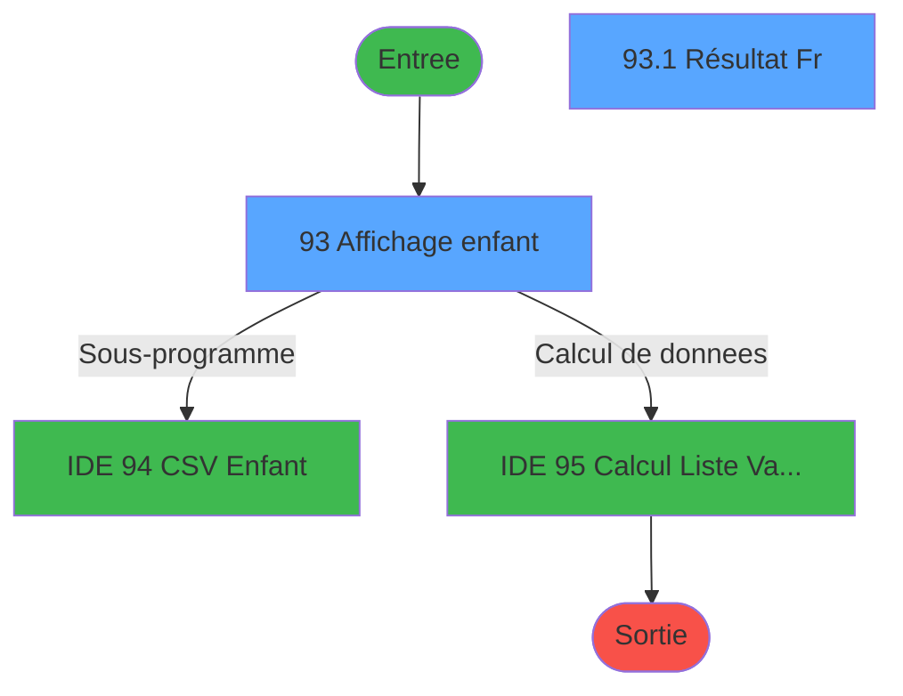
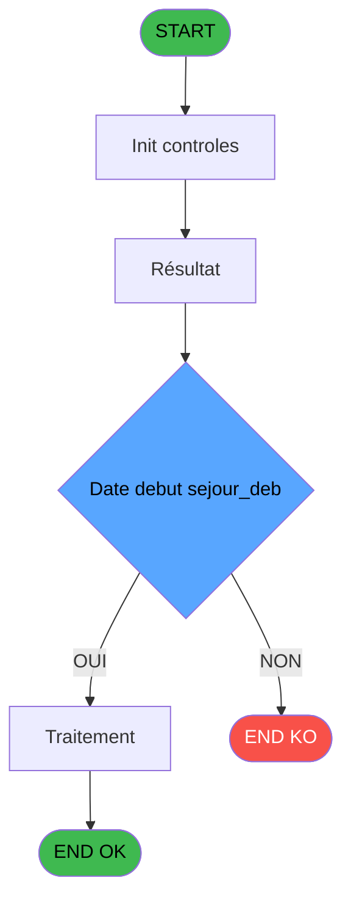
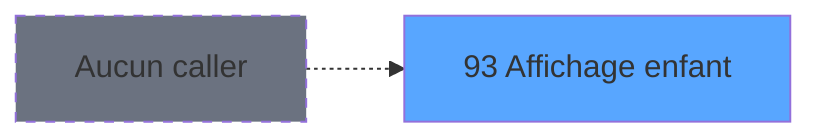
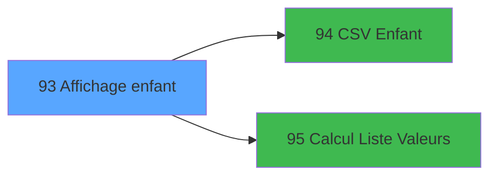

# PBP IDE 93 - Affichage enfant

> **Analyse**: Phases 1-4 2026-02-03 09:18 -> 09:19 (20s) | Assemblage 09:19
> **Pipeline**: V7.2 Enrichi
> **Structure**: 4 onglets (Resume | Ecrans | Donnees | Connexions)

<!-- TAB:Resume -->

## 1. FICHE D'IDENTITE

| Attribut | Valeur |
|----------|--------|
| Projet | PBP |
| IDE Position | 93 |
| Nom Programme | Affichage enfant |
| Fichier source | `Prg_93.xml` |
| Domaine metier | General |
| Taches | 2 (2 ecrans visibles) |
| Tables modifiees | 0 |
| Programmes appeles | 2 |
| :warning: Statut | **ORPHELIN_POTENTIEL** |

## 2. DESCRIPTION FONCTIONNELLE

**Affichage enfant** assure la gestion complete de ce processus.

Le flux de traitement s'organise en **2 blocs fonctionnels** :

- **Traitement** (1 tache) : traitements metier divers
- **Consultation** (1 tache) : ecrans de recherche, selection et consultation

**Logique metier** : 1 regles identifiees couvrant valeurs par defaut.

Detail : phases du traitement

#### Phase 1 : Consultation (1 tache)

- **93** - Affichage enfant **[[ECRAN]](#ecran-t1)**

#### Phase 2 : Traitement (1 tache)

- **93.1** - Résultat Fr **[[ECRAN]](#ecran-t2)**

Delegue a : [CSV Enfant (IDE 94)](PBP-IDE-94.md)

## 3. BLOCS FONCTIONNELS

### 3.1 Consultation (1 tache)

Ecrans de recherche et consultation.

---

#### 93 - Affichage enfant [[ECRAN]](#ecran-t1)

**Role** : Reinitialisation : Affichage enfant.
**Ecran** : 1770 x 358 DLU (MDI) | [Voir mockup](#ecran-t1)

### 3.2 Traitement (1 tache)

Traitements internes.

---

#### 93.1 - Résultat Fr [[ECRAN]](#ecran-t2)

**Role** : Traitement : Résultat Fr.
**Ecran** : 880 x 257 DLU (Modal) | [Voir mockup](#ecran-t2)
**Delegue a** : [CSV Enfant (IDE 94)](PBP-IDE-94.md)

## 5. REGLES METIER

1 regles identifiees:

### Autres (1 regles)

#### [RM-001] Valeur par defaut si w0_Date debut sejour_deb [A]<>0,'B.gmr_debut_sejour> est vide

| Element | Detail |
|---------|--------|
| **Condition** | `w0_Date debut sejour_deb [A]<>0` |
| **Si vrai** | 'B.gmr_debut_sejour>='''&DStr(w0_Date debut sejour_deb [A] |
| **Si faux** | 'YYYYMMDD')&'''','')&IF(w0_Date debut sejour_deb [A]<>0 AND [CZ]<>0,' and ','')&IF([CZ]<>0,'B.gmr_debut_sejour<='''&DStr([CZ],'YYYYMMDD')&'''','') |
| **Variables** | A (w0_Date debut sejour_deb) |
| **Expression source** | Expression 7 : `IF(w0_Date debut sejour_deb [A]<>0,'B.gmr_debut_sejour>='''&` |
| **Exemple** | Si w0_Date debut sejour_deb [A]<>0 → 'B.gmr_debut_sejour>='''&DStr(w0_Date debut sejour_deb [A] |

## 6. CONTEXTE

- **Appele par**: (aucun)
- **Appelle**: 2 programmes | **Tables**: 4 (W:0 R:1 L:3) | **Taches**: 2 | **Expressions**: 23

<!-- TAB:Ecrans -->

## 8. ECRANS

### 8.1 Forms visibles (2 / 2)

| # | Position | Tache | Nom | Type | Largeur | Hauteur | Bloc |
|---|----------|-------|-----|------|---------|---------|------|
| 1 | 93 | 93 | Affichage enfant | MDI | 1770 | 358 | Consultation |
| 2 | 93.1 | 93.1 | Résultat Fr | Modal | 880 | 257 | Traitement |

### 8.2 Mockups Ecrans

---

#### 93 - Affichage enfant
**Tache** : [93](#t1) | **Type** : MDI | **Dimensions** : 1770 x 358 DLU
**Bloc** : Consultation | **Titre IDE** : Affichage enfant

<!-- FORM-DATA:
{
    "width":  1770,
    "vFactor":  8,
    "type":  "MDI",
    "hFactor":  8,
    "controls":  [
                     {
                         "x":  1,
                         "type":  "label",
                         "var":  "",
                         "y":  0,
                         "w":  1758,
                         "fmt":  "",
                         "name":  "",
                         "h":  20,
                         "color":  "1",
                         "text":  "",
                         "parent":  null
                     },
                     {
                         "x":  10,
                         "type":  "label",
                         "var":  "",
                         "y":  25,
                         "w":  1751,
                         "fmt":  "",
                         "name":  "",
                         "h":  70,
                         "color":  "195",
                         "text":  "Critères",
                         "parent":  null
                     },
                     {
                         "x":  18,
                         "type":  "label",
                         "var":  "",
                         "y":  38,
                         "w":  143,
                         "fmt":  "",
                         "name":  "",
                         "h":  9,
                         "color":  "",
                         "text":  "Date début séjour",
                         "parent":  5
                     },
                     {
                         "x":  18,
                         "type":  "label",
                         "var":  "",
                         "y":  51,
                         "w":  100,
                         "fmt":  "",
                         "name":  "",
                         "h":  9,
                         "color":  "",
                         "text":  "Age",
                         "parent":  5
                     },
                     {
                         "x":  18,
                         "type":  "label",
                         "var":  "",
                         "y":  64,
                         "w":  154,
                         "fmt":  "",
                         "name":  "",
                         "h":  12,
                         "color":  "",
                         "text":  "Type questionnaire",
                         "parent":  5
                     },
                     {
                         "x":  323,
                         "type":  "label",
                         "var":  "",
                         "y":  51,
                         "w":  22,
                         "fmt":  "",
                         "name":  "",
                         "h":  9,
                         "color":  "",
                         "text":  "au",
                         "parent":  5
                     },
                     {
                         "x":  323,
                         "type":  "label",
                         "var":  "",
                         "y":  38,
                         "w":  29,
                         "fmt":  "",
                         "name":  "",
                         "h":  9,
                         "color":  "",
                         "text":  "au",
                         "parent":  5
                     },
                     {
                         "x":  18,
                         "type":  "label",
                         "var":  "",
                         "y":  80,
                         "w":  154,
                         "fmt":  "",
                         "name":  "",
                         "h":  12,
                         "color":  "",
                         "text":  "Cours",
                         "parent":  5
                     },
                     {
                         "x":  6,
                         "type":  "edit",
                         "var":  "",
                         "y":  2,
                         "w":  267,
                         "fmt":  "20",
                         "name":  "",
                         "h":  8,
                         "color":  "",
                         "text":  "",
                         "parent":  1
                     },
                     {
                         "x":  1472,
                         "type":  "edit",
                         "var":  "",
                         "y":  5,
                         "w":  267,
                         "fmt":  "WWW DD MMM YYYYT",
                         "name":  "",
                         "h":  8,
                         "color":  "",
                         "text":  "",
                         "parent":  1
                     },
                     {
                         "x":  6,
                         "type":  "edit",
                         "var":  "",
                         "y":  11,
                         "w":  331,
                         "fmt":  "25",
                         "name":  "",
                         "h":  8,
                         "color":  "",
                         "text":  "",
                         "parent":  1
                     },
                     {
                         "x":  169,
                         "type":  "edit",
                         "var":  "",
                         "y":  37,
                         "w":  126,
                         "fmt":  "##/##/####Z",
                         "name":  "w0_Date_debut_sejour_deb",
                         "h":  10,
                         "color":  "110",
                         "text":  "",
                         "parent":  5
                     },
                     {
                         "x":  295,
                         "type":  "button",
                         "var":  "",
                         "y":  36,
                         "w":  25,
                         "fmt":  "...",
                         "name":  "b_Date_deb_sej_deb",
                         "h":  10,
                         "color":  "",
                         "text":  "",
                         "parent":  5
                     },
                     {
                         "x":  352,
                         "type":  "edit",
                         "var":  "",
                         "y":  37,
                         "w":  126,
                         "fmt":  "##/##/####Z",
                         "name":  "w0_date_debut_sejour_fin",
                         "h":  10,
                         "color":  "110",
                         "text":  "",
                         "parent":  5
                     },
                     {
                         "x":  479,
                         "type":  "button",
                         "var":  "",
                         "y":  37,
                         "w":  25,
                         "fmt":  "...",
                         "name":  "b_Date_deb_sej_fin",
                         "h":  10,
                         "color":  "",
                         "text":  "",
                         "parent":  5
                     },
                     {
                         "x":  169,
                         "type":  "edit",
                         "var":  "",
                         "y":  51,
                         "w":  126,
                         "fmt":  "3Z",
                         "name":  "Age_du",
                         "h":  10,
                         "color":  "110",
                         "text":  "",
                         "parent":  5
                     },
                     {
                         "x":  352,
                         "type":  "edit",
                         "var":  "",
                         "y":  51,
                         "w":  126,
                         "fmt":  "3Z",
                         "name":  "Age_au",
                         "h":  10,
                         "color":  "110",
                         "text":  "",
                         "parent":  5
                     },
                     {
                         "x":  1429,
                         "type":  "button",
                         "var":  "",
                         "y":  73,
                         "w":  154,
                         "fmt":  "Rechercher",
                         "name":  "",
                         "h":  18,
                         "color":  "",
                         "text":  "",
                         "parent":  5
                     },
                     {
                         "x":  1594,
                         "type":  "button",
                         "var":  "",
                         "y":  73,
                         "w":  154,
                         "fmt":  "Quitter",
                         "name":  "",
                         "h":  18,
                         "color":  "",
                         "text":  "",
                         "parent":  null
                     },
                     {
                         "x":  172,
                         "type":  "combobox",
                         "var":  "",
                         "y":  64,
                         "w":  302,
                         "fmt":  "",
                         "name":  "w0_Type questionnaire",
                         "h":  12,
                         "color":  "",
                         "text":  "TOUS",
                         "parent":  5
                     },
                     {
                         "x":  5,
                         "type":  "subform",
                         "var":  "",
                         "y":  97,
                         "w":  1765,
                         "fmt":  "",
                         "name":  "RESULTAT",
                         "h":  257,
                         "color":  "",
                         "text":  "",
                         "parent":  null
                     },
                     {
                         "x":  172,
                         "type":  "combobox",
                         "var":  "",
                         "y":  80,
                         "w":  302,
                         "fmt":  "",
                         "name":  "w0_cours",
                         "h":  12,
                         "color":  "",
                         "text":  "TOUS",
                         "parent":  5
                     }
                 ],
    "taskId":  "93",
    "height":  358
}
-->

<strong>Champs : 9 champs</strong>

| Pos (x,y) | Nom | Variable | Type |
|-----------|-----|----------|------|
| 6,2 | 20 | - | edit |
| 1472,5 | WWW DD MMM YYYYT | - | edit |
| 6,11 | 25 | - | edit |
| 169,37 | w0_Date_debut_sejour_deb | - | edit |
| 352,37 | w0_date_debut_sejour_fin | - | edit |
| 169,51 | Age_du | - | edit |
| 352,51 | Age_au | - | edit |
| 172,64 | w0_Type questionnaire | - | combobox |
| 172,80 | w0_cours | - | combobox |

<strong>Boutons : 4 boutons</strong>

| Bouton | Pos (x,y) | Action |
|--------|-----------|--------|
| ... | 295,36 | Bouton fonctionnel |
| ... | 479,37 | Bouton fonctionnel |
| Rechercher | 1429,73 | Ouvre la selection |
| Quitter | 1594,73 | Quitte le programme |

---

#### 93.1 - Résultat Fr
**Tache** : [93.1](#t2) | **Type** : Modal | **Dimensions** : 880 x 257 DLU
**Bloc** : Traitement | **Titre IDE** : Résultat Fr

<!-- FORM-DATA:
{
    "width":  880,
    "vFactor":  8,
    "type":  "Modal",
    "hFactor":  4,
    "controls":  [
                     {
                         "x":  3,
                         "type":  "table",
                         "var":  "",
                         "name":  "",
                         "titleH":  12,
                         "color":  "110",
                         "w":  2506,
                         "y":  1,
                         "fmt":  "",
                         "parent":  null,
                         "text":  "",
                         "rowH":  15,
                         "h":  233,
                         "cols":  [
                                      {
                                          "title":  "Type questionnaire",
                                          "layer":  1,
                                          "w":  147
                                      },
                                      {
                                          "title":  "Nom",
                                          "layer":  2,
                                          "w":  112
                                      },
                                      {
                                          "title":  "Prénom",
                                          "layer":  3,
                                          "w":  72
                                      },
                                      {
                                          "title":  "Début séjour",
                                          "layer":  4,
                                          "w":  57
                                      },
                                      {
                                          "title":  "Fin séjour",
                                          "layer":  5,
                                          "w":  56
                                      },
                                      {
                                          "title":  "Age",
                                          "layer":  6,
                                          "w":  24
                                      },
                                      {
                                          "title":  "Sexe",
                                          "layer":  7,
                                          "w":  25
                                      },
                                      {
                                          "title":  "N° chambre",
                                          "layer":  8,
                                          "w":  63
                                      },
                                      {
                                          "title":  "Poids",
                                          "layer":  9,
                                          "w":  57
                                      },
                                      {
                                          "title":  "Langue parlée",
                                          "layer":  10,
                                          "w":  156
                                      },
                                      {
                                          "title":  "Nom contact",
                                          "layer":  11,
                                          "w":  179
                                      },
                                      {
                                          "title":  "Prénom contact",
                                          "layer":  12,
                                          "w":  177
                                      },
                                      {
                                          "title":  "N° portable",
                                          "layer":  13,
                                          "w":  113
                                      },
                                      {
                                          "title":  "Couches",
                                          "layer":  14,
                                          "w":  83
                                      },
                                      {
                                          "title":  "Maquillage",
                                          "layer":  15,
                                          "w":  62
                                      },
                                      {
                                          "title":  "Doudou",
                                          "layer":  16,
                                          "w":  53
                                      },
                                      {
                                          "title":  "Savoir nager",
                                          "layer":  17,
                                          "w":  56
                                      },
                                      {
                                          "title":  "Position sommeil",
                                          "layer":  18,
                                          "w":  81
                                      },
                                      {
                                          "title":  "Autonomie",
                                          "layer":  19,
                                          "w":  61
                                      },
                                      {
                                          "title":  "Nom personne autorisée",
                                          "layer":  20,
                                          "w":  178
                                      },
                                      {
                                          "title":  "Prénom personne autorisée",
                                          "layer":  21,
                                          "w":  178
                                      },
                                      {
                                          "title":  "N° portable autorisé",
                                          "layer":  22,
                                          "w":  178
                                      },
                                      {
                                          "title":  "Paracétamol",
                                          "layer":  23,
                                          "w":  77
                                      },
                                      {
                                          "title":  "Allergies",
                                          "layer":  24,
                                          "w":  90
                                      },
                                      {
                                          "title":  "Aliments non mangés",
                                          "layer":  25,
                                          "w":  87
                                      },
                                      {
                                          "title":  "Sieste",
                                          "layer":  26,
                                          "w":  81
                                      }
                                  ],
                         "rows":  26
                     },
                     {
                         "x":  6,
                         "type":  "label",
                         "var":  "",
                         "y":  231,
                         "w":  872,
                         "fmt":  "",
                         "name":  "",
                         "h":  24,
                         "color":  "1",
                         "text":  "",
                         "parent":  null
                     },
                     {
                         "x":  7,
                         "type":  "edit",
                         "var":  "",
                         "y":  16,
                         "w":  140,
                         "fmt":  "",
                         "name":  "tqu_libelle",
                         "h":  10,
                         "color":  "110",
                         "text":  "",
                         "parent":  2
                     },
                     {
                         "x":  155,
                         "type":  "edit",
                         "var":  "",
                         "y":  16,
                         "w":  105,
                         "fmt":  "",
                         "name":  "gmr_nom__30_",
                         "h":  10,
                         "color":  "110",
                         "text":  "",
                         "parent":  2
                     },
                     {
                         "x":  268,
                         "type":  "edit",
                         "var":  "",
                         "y":  16,
                         "w":  65,
                         "fmt":  "",
                         "name":  "gmr_prenom__8_",
                         "h":  10,
                         "color":  "110",
                         "text":  "",
                         "parent":  2
                     },
                     {
                         "x":  340,
                         "type":  "edit",
                         "var":  "",
                         "y":  16,
                         "w":  49,
                         "fmt":  "DD/MM/YYYYZ",
                         "name":  "gmr_debut_sejour",
                         "h":  10,
                         "color":  "110",
                         "text":  "",
                         "parent":  2
                     },
                     {
                         "x":  397,
                         "type":  "edit",
                         "var":  "",
                         "y":  16,
                         "w":  48,
                         "fmt":  "DD/MM/YYYYZ",
                         "name":  "gmr_fin_sejour",
                         "h":  10,
                         "color":  "110",
                         "text":  "",
                         "parent":  2
                     },
                     {
                         "x":  452,
                         "type":  "edit",
                         "var":  "",
                         "y":  16,
                         "w":  16,
                         "fmt":  "3Z",
                         "name":  "gmr_age_num",
                         "h":  10,
                         "color":  "110",
                         "text":  "",
                         "parent":  2
                     },
                     {
                         "x":  481,
                         "type":  "edit",
                         "var":  "",
                         "y":  16,
                         "w":  6,
                         "fmt":  "",
                         "name":  "gmr_sexe",
                         "h":  10,
                         "color":  "110",
                         "text":  "",
                         "parent":  2
                     },
                     {
                         "x":  512,
                         "type":  "edit",
                         "var":  "",
                         "y":  16,
                         "w":  43,
                         "fmt":  "",
                         "name":  "heb_nom_logement",
                         "h":  10,
                         "color":  "110",
                         "text":  "",
                         "parent":  2
                     },
                     {
                         "x":  575,
                         "type":  "edit",
                         "var":  "",
                         "y":  16,
                         "w":  31,
                         "fmt":  "N3.2Z",
                         "name":  "eci_poids",
                         "h":  10,
                         "color":  "110",
                         "text":  "",
                         "parent":  2
                     },
                     {
                         "x":  622,
                         "type":  "edit",
                         "var":  "",
                         "y":  16,
                         "w":  145,
                         "fmt":  "",
                         "name":  "eci_langue_parlee",
                         "h":  10,
                         "color":  "110",
                         "text":  "",
                         "parent":  2
                     },
                     {
                         "x":  776,
                         "type":  "edit",
                         "var":  "",
                         "y":  16,
                         "w":  171,
                         "fmt":  "",
                         "name":  "eci_nom_contact",
                         "h":  10,
                         "color":  "110",
                         "text":  "",
                         "parent":  2
                     },
                     {
                         "x":  955,
                         "type":  "edit",
                         "var":  "",
                         "y":  16,
                         "w":  171,
                         "fmt":  "",
                         "name":  "eci_prenom_contact",
                         "h":  10,
                         "color":  "110",
                         "text":  "",
                         "parent":  2
                     },
                     {
                         "x":  1134,
                         "type":  "edit",
                         "var":  "",
                         "y":  16,
                         "w":  105,
                         "fmt":  "",
                         "name":  "eci_num_portable",
                         "h":  10,
                         "color":  "110",
                         "text":  "",
                         "parent":  2
                     },
                     {
                         "x":  1245,
                         "type":  "combobox",
                         "var":  "",
                         "y":  16,
                         "w":  79,
                         "fmt":  "",
                         "name":  "eci_couches",
                         "h":  12,
                         "color":  "110",
                         "text":  "",
                         "parent":  2
                     },
                     {
                         "x":  1329,
                         "type":  "combobox",
                         "var":  "",
                         "y":  16,
                         "w":  56,
                         "fmt":  "",
                         "name":  "eci_maquillage",
                         "h":  12,
                         "color":  "110",
                         "text":  "",
                         "parent":  2
                     },
                     {
                         "x":  1390,
                         "type":  "combobox",
                         "var":  "",
                         "y":  16,
                         "w":  48,
                         "fmt":  "",
                         "name":  "eci_doudou",
                         "h":  12,
                         "color":  "110",
                         "text":  "",
                         "parent":  2
                     },
                     {
                         "x":  1442,
                         "type":  "combobox",
                         "var":  "",
                         "y":  16,
                         "w":  52,
                         "fmt":  "",
                         "name":  "eci_nager",
                         "h":  12,
                         "color":  "110",
                         "text":  "",
                         "parent":  2
                     },
                     {
                         "x":  1498,
                         "type":  "combobox",
                         "var":  "",
                         "y":  16,
                         "w":  78,
                         "fmt":  "",
                         "name":  "eci_position_dormir",
                         "h":  12,
                         "color":  "110",
                         "text":  "",
                         "parent":  2
                     },
                     {
                         "x":  1579,
                         "type":  "combobox",
                         "var":  "",
                         "y":  16,
                         "w":  56,
                         "fmt":  "",
                         "name":  "eci_autonomie",
                         "h":  12,
                         "color":  "110",
                         "text":  "",
                         "parent":  2
                     },
                     {
                         "x":  1641,
                         "type":  "edit",
                         "var":  "",
                         "y":  16,
                         "w":  171,
                         "fmt":  "",
                         "name":  "eci_nom_autorise",
                         "h":  10,
                         "color":  "110",
                         "text":  "",
                         "parent":  2
                     },
                     {
                         "x":  1819,
                         "type":  "edit",
                         "var":  "",
                         "y":  16,
                         "w":  171,
                         "fmt":  "",
                         "name":  "eci_prenom_autorise",
                         "h":  10,
                         "color":  "110",
                         "text":  "",
                         "parent":  2
                     },
                     {
                         "x":  1997,
                         "type":  "edit",
                         "var":  "",
                         "y":  16,
                         "w":  171,
                         "fmt":  "",
                         "name":  "eci_portable_autorise",
                         "h":  10,
                         "color":  "110",
                         "text":  "",
                         "parent":  2
                     },
                     {
                         "x":  2174,
                         "type":  "combobox",
                         "var":  "",
                         "y":  16,
                         "w":  74,
                         "fmt":  "",
                         "name":  "eci_niveau_pratique",
                         "h":  12,
                         "color":  "110",
                         "text":  "",
                         "parent":  2
                     },
                     {
                         "x":  2252,
                         "type":  "combobox",
                         "var":  "",
                         "y":  16,
                         "w":  74,
                         "fmt":  "",
                         "name":  "eci_presence_allergies_0001",
                         "h":  12,
                         "color":  "110",
                         "text":  "",
                         "parent":  2
                     },
                     {
                         "x":  2342,
                         "type":  "edit",
                         "var":  "",
                         "y":  16,
                         "w":  80,
                         "fmt":  "4Z",
                         "name":  "eci_nom_autorise",
                         "h":  10,
                         "color":  "110",
                         "text":  "",
                         "parent":  2
                     },
                     {
                         "x":  2429,
                         "type":  "combobox",
                         "var":  "",
                         "y":  16,
                         "w":  74,
                         "fmt":  "",
                         "name":  "eci_sieste_0001",
                         "h":  12,
                         "color":  "110",
                         "text":  "",
                         "parent":  2
                     },
                     {
                         "x":  517,
                         "type":  "button",
                         "var":  "",
                         "y":  234,
                         "w":  116,
                         "fmt":  "\u0026Modification",
                         "name":  "",
                         "h":  18,
                         "color":  "",
                         "text":  "",
                         "parent":  31
                     },
                     {
                         "x":  638,
                         "type":  "button",
                         "var":  "",
                         "y":  234,
                         "w":  116,
                         "fmt":  "Extraction \u0026Publipostage",
                         "name":  "Publipostage",
                         "h":  18,
                         "color":  "",
                         "text":  "",
                         "parent":  31
                     },
                     {
                         "x":  759,
                         "type":  "button",
                         "var":  "",
                         "y":  234,
                         "w":  116,
                         "fmt":  "Extraction \u0026Excel",
                         "name":  "Excel",
                         "h":  18,
                         "color":  "",
                         "text":  "",
                         "parent":  31
                     }
                 ],
    "taskId":  "93.1",
    "height":  257
}
-->

<strong>Champs : 26 champs</strong>

| Pos (x,y) | Nom | Variable | Type |
|-----------|-----|----------|------|
| 7,16 | tqu_libelle | - | edit |
| 155,16 | gmr_nom__30_ | - | edit |
| 268,16 | gmr_prenom__8_ | - | edit |
| 340,16 | gmr_debut_sejour | - | edit |
| 397,16 | gmr_fin_sejour | - | edit |
| 452,16 | gmr_age_num | - | edit |
| 481,16 | gmr_sexe | - | edit |
| 512,16 | heb_nom_logement | - | edit |
| 575,16 | eci_poids | - | edit |
| 622,16 | eci_langue_parlee | - | edit |
| 776,16 | eci_nom_contact | - | edit |
| 955,16 | eci_prenom_contact | - | edit |
| 1134,16 | eci_num_portable | - | edit |
| 1245,16 | eci_couches | - | combobox |
| 1329,16 | eci_maquillage | - | combobox |
| 1390,16 | eci_doudou | - | combobox |
| 1442,16 | eci_nager | - | combobox |
| 1498,16 | eci_position_dormir | - | combobox |
| 1579,16 | eci_autonomie | - | combobox |
| 1641,16 | eci_nom_autorise | - | edit |
| 1819,16 | eci_prenom_autorise | - | edit |
| 1997,16 | eci_portable_autorise | - | edit |
| 2174,16 | eci_niveau_pratique | - | combobox |
| 2252,16 | eci_presence_allergies_0001 | - | combobox |
| 2342,16 | eci_nom_autorise | - | edit |
| 2429,16 | eci_sieste_0001 | - | combobox |

<strong>Boutons : 3 boutons</strong>

| Bouton | Pos (x,y) | Action |
|--------|-----------|--------|
| Modification | 517,234 | Modifie l'element |
| Extraction Publipostage | 638,234 | Bouton fonctionnel |
| Extraction Excel | 759,234 | Bouton fonctionnel |

## 9. NAVIGATION

### 9.1 Enchainement des ecrans

**Detail par enchainement :**

| Depuis | Action | Vers | Retour |
|--------|--------|------|--------|
| Affichage enfant | Sous-programme | [CSV Enfant (IDE 94)](PBP-IDE-94.md) | Retour ecran |
| Affichage enfant | Calcul de donnees | [Calcul Liste Valeurs (IDE 95)](PBP-IDE-95.md) | Retour ecran |

### 9.3 Structure hierarchique (2 taches)

| Position | Tache | Type | Dimensions | Bloc |
|----------|-------|------|------------|------|
| **93.1** | [**Affichage enfant** (93)](#t1) [mockup](#ecran-t1) | MDI | 1770x358 | Consultation |
| **93.2** | [**Résultat Fr** (93.1)](#t2) [mockup](#ecran-t2) | Modal | 880x257 | Traitement |

### 9.4 Algorigramme

> **Legende**: Vert = START/END OK | Rouge = END KO | Bleu = Decisions
> *Algorigramme auto-genere. Utiliser `/algorigramme` pour une synthese metier detaillee.*

<!-- TAB:Donnees -->

## 10. TABLES

### Tables utilisees (4)

| ID | Nom | Description | Type | R | W | L | Usages |
|----|-----|-------------|------|---|---|---|--------|
| 30 | gm-recherche_____gmr | Index de recherche | DB | R |   |   | 1 |
| 34 | hebergement______heb | Hebergement (chambres) | DB |   |   | L | 1 |
| 804 | valeur_credit_bar_defaut |  | DB |   |   | L | 1 |
| 812 | Prestations         supprime | Prestations/services vendus | DB |   |   | L | 1 |

### Colonnes par table (1 / 1 tables avec colonnes identifiees)

Table 30 - gm-recherche_____gmr (R) - 1 usages

| Lettre | Variable | Acces | Type |
|--------|----------|-------|------|
| A | v.Existe ligne ? | R | Logical |
| B | v.Confirmation Extraction | R | Numeric |
| C | v.Liste Allergies FR | R | Unicode |
| D | v.Liste Allergies EN | R | Unicode |
| E | v.Esxcel local installlé | R | Logical |

## 11. VARIABLES

### 11.1 Variables de session (1)

Variables persistantes pendant toute la session.

| Lettre | Nom | Type | Usage dans |
|--------|-----|------|-----------|
| L | V.Clause where | Alpha | - |

### 11.2 Autres (11)

Variables diverses.

| Lettre | Nom | Type | Usage dans |
|--------|-----|------|-----------|
| A | w0_Date debut sejour_deb | Date | 4x refs |
| B | b_Date_deb_sej_deb | Alpha | 4x refs |
| C | w0_Date debut sejour_fin | Date | 1x refs |
| D | b_Date_deb_sej_fin | Alpha | - |
| E | Age du | Numeric | - |
| F | Age au | Numeric | - |
| G | w0_Type questionnaire | Alpha | - |
| H | w0_cours | Alpha | - |
| I | b_Quitter | Alpha | - |
| J | b_Modification | Alpha | - |
| K | b_Extraction | Alpha | - |

## 12. EXPRESSIONS

**23 / 23 expressions decodees (100%)**

### 12.1 Repartition par type

| Type | Expressions | Regles |
|------|-------------|--------|
| CONDITION | 5 | 5 |
| CONSTANTE | 9 | 0 |
| DATE | 1 | 0 |
| OTHER | 6 | 0 |
| REFERENCE_VG | 1 | 0 |
| FORMAT | 1 | 0 |

### 12.2 Expressions cles par type

#### CONDITION (5 expressions)

| Type | IDE | Expression | Regle |
|------|-----|------------|-------|
| CONDITION | 7 | `IF(w0_Date debut sejour_deb [A]<>0,'B.gmr_debut_sejour>='''&DStr(w0_Date debut sejour_deb [A],'YYYYMMDD')&'''','')&IF(w0_Date debut sejour_deb [A]<>0 AND [CZ]<>0,' and ','')&IF([CZ]<>0,'B.gmr_debut_sejour<='''&DStr([CZ],'YYYYMMDD')&'''','')` | [RM-001](#rm-RM-001) |
| CONDITION | 13 | `b_Date_deb_sej_deb [B]<>0 OR [CY]<>0` | - |
| CONDITION | 22 | `CndRange({1,3}<>'TOUS',{1,3})` | - |
| CONDITION | 9 | `w0_Date debut sejour_deb [A]>[CZ]` | - |
| CONDITION | 10 | `b_Date_deb_sej_deb [B]>[CY]` | - |

#### CONSTANTE (9 expressions)

| Type | IDE | Expression | Regle |
|------|-----|------------|-------|
| CONSTANTE | 19 | `'H'` | - |
| CONSTANTE | 15 | `61` | - |
| CONSTANTE | 23 | `'SOMMEI'` | - |
| CONSTANTE | 21 | `'E'` | - |
| CONSTANTE | 14 | `62` | - |
| ... | | *+4 autres* | |

#### DATE (1 expressions)

| Type | IDE | Expression | Regle |
|------|-----|------------|-------|
| DATE | 4 | `Date ()` | - |

#### OTHER (6 expressions)

| Type | IDE | Expression | Regle |
|------|-----|------------|-------|
| OTHER | 17 | `b_Date_deb_sej_deb [B]` | - |
| OTHER | 18 | `w0_Date debut sejour_fin [C]` | - |
| OTHER | 20 | `[AW]` | - |
| OTHER | 2 | `MlsTrans('Easy Arrival : Enfant')` | - |
| OTHER | 5 | `GetParam ('VILLAGE')` | - |
| ... | | *+1 autres* | |

#### REFERENCE_VG (1 expressions)

| Type | IDE | Expression | Regle |
|------|-----|------------|-------|
| REFERENCE_VG | 3 | `VG2` | - |

#### FORMAT (1 expressions)

| Type | IDE | Expression | Regle |
|------|-----|------------|-------|
| FORMAT | 12 | `Trim([CX])&IF(w0_Date debut sejour_deb [A]<>0 OR [CZ]<>0,' and ','')&IF(b_Date_deb_sej_deb [B]<>0,'B.gmr_age_num>='&Trim(Str(b_Date_deb_sej_deb [B],'3')),'')&IF(b_Date_deb_sej_deb [B]<>0 AND [CY]<>0,' and ','')&IF([CY]<>0,'B.gmr_age_num<='&Trim(Str([CY],'3')),'')` | - |

### 12.3 Toutes les expressions (23)

Voir les 23 expressions

#### CONDITION (5)

| IDE | Expression Decodee |
|-----|-------------------|
| 7 | `IF(w0_Date debut sejour_deb [A]<>0,'B.gmr_debut_sejour>='''&DStr(w0_Date debut sejour_deb [A],'YYYYMMDD')&'''','')&IF(w0_Date debut sejour_deb [A]<>0 AND [CZ]<>0,' and ','')&IF([CZ]<>0,'B.gmr_debut_sejour<='''&DStr([CZ],'YYYYMMDD')&'''','')` |
| 9 | `w0_Date debut sejour_deb [A]>[CZ]` |
| 10 | `b_Date_deb_sej_deb [B]>[CY]` |
| 13 | `b_Date_deb_sej_deb [B]<>0 OR [CY]<>0` |
| 22 | `CndRange({1,3}<>'TOUS',{1,3})` |

#### CONSTANTE (9)

| IDE | Expression Decodee |
|-----|-------------------|
| 1 | `'...'` |
| 6 | `'RESULTAT'` |
| 8 | `'TOUS'` |
| 11 | `''` |
| 14 | `62` |
| 15 | `61` |
| 19 | `'H'` |
| 21 | `'E'` |
| 23 | `'SOMMEI'` |

#### DATE (1)

| IDE | Expression Decodee |
|-----|-------------------|
| 4 | `Date ()` |

#### OTHER (6)

| IDE | Expression Decodee |
|-----|-------------------|
| 2 | `MlsTrans('Easy Arrival : Enfant')` |
| 5 | `GetParam ('VILLAGE')` |
| 16 | `w0_Date debut sejour_deb [A]` |
| 17 | `b_Date_deb_sej_deb [B]` |
| 18 | `w0_Date debut sejour_fin [C]` |
| 20 | `[AW]` |

#### REFERENCE_VG (1)

| IDE | Expression Decodee |
|-----|-------------------|
| 3 | `VG2` |

#### FORMAT (1)

| IDE | Expression Decodee |
|-----|-------------------|
| 12 | `Trim([CX])&IF(w0_Date debut sejour_deb [A]<>0 OR [CZ]<>0,' and ','')&IF(b_Date_deb_sej_deb [B]<>0,'B.gmr_age_num>='&Trim(Str(b_Date_deb_sej_deb [B],'3')),'')&IF(b_Date_deb_sej_deb [B]<>0 AND [CY]<>0,' and ','')&IF([CY]<>0,'B.gmr_age_num<='&Trim(Str([CY],'3')),'')` |

<!-- TAB:Connexions -->

## 13. GRAPHE D'APPELS

### 13.1 Chaine depuis Main (Callers)

**Chemin**: (pas de callers directs)

### 13.2 Callers

| IDE | Nom Programme | Nb Appels |
|-----|---------------|-----------|
| - | (aucun) | - |

### 13.3 Callees (programmes appeles)

### 13.4 Detail Callees avec contexte

| IDE | Nom Programme | Appels | Contexte |
|-----|---------------|--------|----------|
| [94](PBP-IDE-94.md) | CSV Enfant | 1 | Sous-programme |
| [95](PBP-IDE-95.md) | Calcul Liste Valeurs | 1 | Calcul de donnees |

## 14. RECOMMANDATIONS MIGRATION

### 14.1 Profil du programme

| Metrique | Valeur | Impact migration |
|----------|--------|-----------------|
| Lignes de logique | 148 | Programme compact |
| Expressions | 23 | Peu de logique |
| Tables WRITE | 0 | Impact faible |
| Sous-programmes | 2 | Peu de dependances |
| Ecrans visibles | 2 | Quelques ecrans |
| Code desactive | 0.7% (1 / 148) | Code sain |
| Regles metier | 1 | Quelques regles a preserver |

### 14.2 Plan de migration par bloc

#### Consultation (1 tache: 1 ecran, 0 traitement)

- **Strategie** : Composants de recherche/selection en modales.
- 1 ecran : Affichage enfant

#### Traitement (1 tache: 1 ecran, 0 traitement)

- **Strategie** : 1 composant(s) UI (Razor/React) avec formulaires et validation.
- 2 sous-programme(s) a migrer ou a reutiliser depuis les services existants.
- Decomposer les taches en services unitaires testables.

### 14.3 Dependances critiques

| Dependance | Type | Appels | Impact |
|------------|------|--------|--------|
| [Calcul Liste Valeurs (IDE 95)](PBP-IDE-95.md) | Sous-programme | 1x | Normale - Calcul de donnees |
| [CSV Enfant (IDE 94)](PBP-IDE-94.md) | Sous-programme | 1x | Normale - Sous-programme |

---
*Spec DETAILED generee par Pipeline V7.2 - 2026-02-03 09:19*
