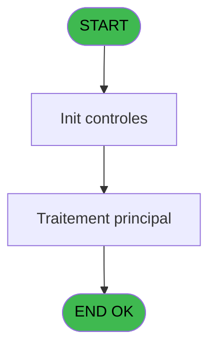

# PBP IDE 94 - CSV Enfant

> **Analyse**: Phases 1-4 2026-02-03 09:19 -> 09:19 (20s) | Assemblage 09:19
> **Pipeline**: V7.2 Enrichi
> **Structure**: 4 onglets (Resume | Ecrans | Donnees | Connexions)

<!-- TAB:Resume -->

## 1. FICHE D'IDENTITE

| Attribut | Valeur |
|----------|--------|
| Projet | PBP |
| IDE Position | 94 |
| Nom Programme | CSV Enfant |
| Fichier source | `Prg_94.xml` |
| Domaine metier | General |
| Taches | 3 (0 ecrans visibles) |
| Tables modifiees | 0 |
| Programmes appeles | 1 |

## 2. DESCRIPTION FONCTIONNELLE

**CSV Enfant** assure la gestion complete de ce processus, accessible depuis [Affichage enfant (IDE 93)](PBP-IDE-93.md).

Le flux de traitement s'organise en **1 blocs fonctionnels** :

- **Traitement** (3 taches) : traitements metier divers

## 3. BLOCS FONCTIONNELS

### 3.1 Traitement (3 taches)

Traitements internes.

---

#### 94 - CSV Résultat [[ECRAN]](#ecran-t4)

**Role** : Traitement : CSV Résultat.
**Ecran** : 880 x 265 DLU (Modal) | [Voir mockup](#ecran-t4)

---

#### 94.1 - location PVE

**Role** : Traitement : location PVE.
**Variables liees** : I (v.Existe location ?), J (v.Detail location csv)

---

#### 94.2 - Service Skin activé ?

**Role** : Traitement : Service Skin activé ?.
**Variables liees** : K (v.Service SKIN activé ?)

## 5. REGLES METIER

*(Aucune regle metier identifiee)*

## 6. CONTEXTE

- **Appele par**: [Affichage enfant (IDE 93)](PBP-IDE-93.md)
- **Appelle**: 1 programmes | **Tables**: 11 (W:0 R:3 L:8) | **Taches**: 3 | **Expressions**: 48

<!-- TAB:Ecrans -->

## 8. ECRANS

*(Programme sans ecran visible)*

## 9. NAVIGATION

### 9.3 Structure hierarchique (3 taches)

| Position | Tache | Type | Dimensions | Bloc |
|----------|-------|------|------------|------|
| **94.1** | [**CSV Résultat** (94)](#t4) [mockup](#ecran-t4) | Modal | 880x265 | Traitement |
| 94.1.1 | [location PVE (94.1)](#t5) | - | - | |
| 94.1.2 | [Service Skin activé ? (94.2)](#t6) | - | - | |

### 9.4 Algorigramme

> **Legende**: Vert = START/END OK | Rouge = END KO | Bleu = Decisions
> *Algorigramme auto-genere. Utiliser `/algorigramme` pour une synthese metier detaillee.*

<!-- TAB:Donnees -->

## 10. TABLES

### Tables utilisees (11)

| ID | Nom | Description | Type | R | W | L | Usages |
|----|-----|-------------|------|---|---|---|--------|
| 30 | gm-recherche_____gmr | Index de recherche | DB | R |   |   | 1 |
| 31 | gm-complet_______gmc |  | DB |   |   | L | 1 |
| 34 | hebergement______heb | Hebergement (chambres) | DB |   |   | L | 1 |
| 67 | tables___________tab |  | DB | R |   |   | 1 |
| 382 | pv_discount_reasons |  | DB |   |   | L | 1 |
| 389 | pv_equipment_inventory |  | DB | R |   |   | 1 |
| 404 | pv_sellers_by_week |  | DB |   |   | L | 1 |
| 419 | realise_articles_caution | Articles et stock | DB |   |   | L | 1 |
| 804 | valeur_credit_bar_defaut |  | DB |   |   | L | 1 |
| 807 | plafond_lit |  | DB |   |   | L | 1 |
| 812 | Prestations         supprime | Prestations/services vendus | DB |   |   | L | 1 |

### Colonnes par table (2 / 3 tables avec colonnes identifiees)

Table 30 - gm-recherche_____gmr (R) - 1 usages

| Lettre | Variable | Acces | Type |
|--------|----------|-------|------|
| A | P.Type questionnaire | R | Alpha |
| B | P.Clause where | R | Alpha |
| C | P.Existe ligne ? | R | Logical |
| D | P.Extraction Publipostage | R | Logical |
| E | v.Ligne export faux csv | R | Alpha |
| F | v.Ligne export vrai csv | R | Unicode |
| G | v.Liste Allergies FR | R | Unicode |
| H | v.Liste Allergies EN | R | Unicode |
| I | v.Existe location ? | R | Logical |
| J | v.Detail location csv | R | Alpha |
| K | v.Service SKIN activé ? | R | Logical |

Table 67 - tables___________tab (R) - 1 usages

*Table utilisee uniquement en Link ou aucune colonne Real identifiee dans le DataView.*

Table 389 - pv_equipment_inventory (R) - 1 usages

| Lettre | Variable | Acces | Type |
|--------|----------|-------|------|
| A | v.Ski | R | Alpha |
| B | v.Chaussure | R | Alpha |
| C | v.Casque/Autre | R | Alpha |

## 11. VARIABLES

### 11.1 Parametres entrants (4)

Variables recues du programme appelant ([Affichage enfant (IDE 93)](PBP-IDE-93.md)).

| Lettre | Nom | Type | Usage dans |
|--------|-----|------|-----------|
| A | P.Type questionnaire | Alpha | 1x parametre entrant |
| B | P.Clause where | Alpha | 1x parametre entrant |
| C | P.Existe ligne ? | Logical | 1x parametre entrant |
| D | P.Extraction Publipostage | Logical | - |

### 11.2 Variables de session (7)

Variables persistantes pendant toute la session.

| Lettre | Nom | Type | Usage dans |
|--------|-----|------|-----------|
| E | v.Ligne export faux csv | Alpha | - |
| F | v.Ligne export vrai csv | Unicode | - |
| G | v.Liste Allergies FR | Unicode | - |
| H | v.Liste Allergies EN | Unicode | - |
| I | v.Existe location ? | Logical | - |
| J | v.Detail location csv | Alpha | - |
| K | v.Service SKIN activé ? | Logical | - |

## 12. EXPRESSIONS

**48 / 48 expressions decodees (100%)**

### 12.1 Repartition par type

| Type | Expressions | Regles |
|------|-------------|--------|
| CONCATENATION | 3 | 0 |
| CONSTANTE | 16 | 0 |
| FORMAT | 7 | 0 |
| OTHER | 18 | 0 |
| CONDITION | 3 | 0 |
| CAST_LOGIQUE | 1 | 0 |

### 12.2 Expressions cles par type

#### CONCATENATION (3 expressions)

| Type | IDE | Expression | Regle |
|------|-----|------------|-------|
| CONCATENATION | 18 | `Trim([EF])&VG36&'="'&IF(ISNULL([LA]),'',Trim([LA]))&'"'&VG36&'="'&Trim([IT])&'"'&VG36&'="'&Trim([HX])&'"'&IF([KH], VG36&Trim([JM]), '')` | - |
| CONCATENATION | 16 | `Trim([EF])&VG36&'="'&IF(ISNULL([LA]),'',Trim([LA]))&'"'&VG36&'="'&Trim([IT])&'"'&VG36&'="'&Trim([HX])&'"'&IF([KH], VG36&Trim([JM]), '')` | - |
| CONCATENATION | 37 | `MlsTrans('Nom')&VG36&MlsTrans('Prénom')&VG36&MlsTrans('Sexe')&VG36&MlsTrans('Age')&VG36&MlsTrans('Date naissance')&VG36&MlsTrans('Autonome 8 ans')&VG36&MlsTrans('Date arrivée')&VG36&MlsTrans('Date départ')&VG36&MlsTrans('Chambre')&VG36&MlsTrans('Nationalité')&VG36&MlsTrans('Langue parlée')&VG36&MlsTrans('Nom personne à contacter')&VG36&MlsTrans('Prenom personne à contacter')&VG36&MlsTrans('Numéro portable personne à contacter')&VG36&MlsTrans('Nom 2 personne à contacter')&VG36&MlsTrans('Prenom 2 personne à contacter')&VG36&MlsTrans('Numéro portable 2 personne à contacter')&VG36&MlsTrans('Nom 3 personne à contacter')&VG36&MlsTrans('Prenom 3 personne à contacter')&VG36&MlsTrans('Numéro portable 3 personne à contacter')&VG36&MlsTrans('Nom personne autorisée')&VG36&MlsTrans('Prenom personne autorisée')&VG36&MlsTrans('Numéro portable personne autorisée')&VG36&MlsTrans('Nom 2 personne autorisée')&VG36&MlsTrans('Prenom 2 personne autorisée')&VG36&MlsTrans('Numéro portable 2 personne autorisée')&VG36&MlsTrans('Nom 3 personne autorisée')&VG36&MlsTrans('Prenom 3 personne autorisée')&VG36&MlsTrans('Numéro portable 3 personne autorisée')&VG36&MlsTrans('Maquillage')&VG36&MlsTrans('Sait nager')&VG36&MlsTrans('Paracetamol')&VG36&MlsTrans('Poids enfant')&VG36&MlsTrans('Couches')&VG36&MlsTrans('Doudou')&VG36&MlsTrans('Position pour dormir')&VG36&MlsTrans('Allergies')&VG36&MlsTrans('Aliments non mangés')&VG36&MlsTrans('Sieste')&VG36&MlsTrans('Surnom')&IF([KH],VG36&MlsTrans('Cours')&VG36&MlsTrans('Niveau')&VG36&MlsTrans('Ski/Snow')&VG36&MlsTrans('Chaussure')&VG36&MlsTrans('Casque'), '')` | - |

#### CONSTANTE (16 expressions)

| Type | IDE | Expression | Regle |
|------|-----|------------|-------|
| CONSTANTE | 33 | `60` | - |
| CONSTANTE | 36 | `''` | - |
| CONSTANTE | 30 | `62` | - |
| CONSTANTE | 32 | `61` | - |
| CONSTANTE | 47 | `'VSERV'` | - |
| ... | | *+11 autres* | |

#### FORMAT (7 expressions)

| Type | IDE | Expression | Regle |
|------|-----|------------|-------|
| FORMAT | 39 | `RepStr([EF],'="','')` | - |
| FORMAT | 41 | `RepStr([EF],'"','')` | - |
| FORMAT | 42 | `RepStr([KZ],'"','')` | - |
| FORMAT | 17 | `Trim([EF])&'"'&VG36&'="'&Trim([FQ])&'"'&VG36&'="'&Trim([FR])&'"'&VG36&'="'&Trim([FS])&'"'&VG36&'="'&Trim([JN])&'"'&VG36&'="'&Trim([JO])&'"'&VG36&'="'&Trim([JP])&'"'&VG36&'="'&Trim([JQ])&'"'&VG36&'="'&Trim([JR])&'"'&VG36&'="'&Trim([JS])&'"'&VG36&'="'&Trim([JU])&'"'&VG36&'="'&Trim([JW])&'"'&VG36&'="'&Trim([JY])&'"'&VG36&'="'&Trim(Str([FI],'N3.2'))&'"'&VG36&'="'&Trim([JT])&'"'&VG36&'="'&Trim([JV])&'"'&VG36&'="'&Trim([JX])&VG36&'="'&Trim([KS])&'"'&VG36&'="'&Trim([KM])&'"'&VG36&'="'&Trim([KY])&'"'` | - |
| FORMAT | 13 | `'="'&Trim([AO])&'"'&VG36&'="'&Trim([AN])&'"'&VG36&'="'&Trim([AU])&'"'&VG36&'="'&Trim(Str([AV],'3'))&'"'&VG36&'="'&DStr([GX],'DD/MM/YYYY')&'"'&VG36&'="'&Trim([IX])&'"'&VG36&'="'&Trim(DStr([AW],'DD/MM/YYYY'))&'"'&VG36&'="'&Trim(DStr([AX],'DD/MM/YYYY'))&'"'&VG36&'="'&Trim([BD])&'"'&VG36&'="'&Trim([GW])&'"'&VG36&'="'&Trim([FJ])&'"'&VG36&'="'&Trim([FK])&'"'&VG36&'="'&Trim([FM])&'"'&VG36&'="'&Trim([FL])&'"'&VG36&'="'&Trim([IN])&'"'&VG36&'="'&Trim([IG])&'"'&VG36&'="'&Trim([IH])&'"'&VG36&'="'&Trim([II])&'"'&VG36&'="'&Trim([IK])&'"'&VG36&'="'&Trim([IL])` | - |
| ... | | *+2 autres* | |

#### OTHER (18 expressions)

| Type | IDE | Expression | Regle |
|------|-----|------------|-------|
| OTHER | 28 | `[KI]` | - |
| OTHER | 29 | `[KT]` | - |
| OTHER | 26 | `[FT]` | - |
| OTHER | 27 | `[IY]` | - |
| OTHER | 31 | `[CN]` | - |
| ... | | *+13 autres* | |

#### CONDITION (3 expressions)

| Type | IDE | Expression | Regle |
|------|-----|------------|-------|
| CONDITION | 46 | `Trim([KJ])<>''` | - |
| CONDITION | 38 | `VG35='FRA'` | - |
| CONDITION | 7 | `CndRange([ED]<>'TOUS',[ED])` | - |

#### CAST_LOGIQUE (1 expressions)

| Type | IDE | Expression | Regle |
|------|-----|------------|-------|
| CAST_LOGIQUE | 22 | `'TRUE'LOG` | - |

### 12.3 Toutes les expressions (48)

Voir les 48 expressions

#### CONCATENATION (3)

| IDE | Expression Decodee |
|-----|-------------------|
| 37 | `MlsTrans('Nom')&VG36&MlsTrans('Prénom')&VG36&MlsTrans('Sexe')&VG36&MlsTrans('Age')&VG36&MlsTrans('Date naissance')&VG36&MlsTrans('Autonome 8 ans')&VG36&MlsTrans('Date arrivée')&VG36&MlsTrans('Date départ')&VG36&MlsTrans('Chambre')&VG36&MlsTrans('Nationalité')&VG36&MlsTrans('Langue parlée')&VG36&MlsTrans('Nom personne à contacter')&VG36&MlsTrans('Prenom personne à contacter')&VG36&MlsTrans('Numéro portable personne à contacter')&VG36&MlsTrans('Nom 2 personne à contacter')&VG36&MlsTrans('Prenom 2 personne à contacter')&VG36&MlsTrans('Numéro portable 2 personne à contacter')&VG36&MlsTrans('Nom 3 personne à contacter')&VG36&MlsTrans('Prenom 3 personne à contacter')&VG36&MlsTrans('Numéro portable 3 personne à contacter')&VG36&MlsTrans('Nom personne autorisée')&VG36&MlsTrans('Prenom personne autorisée')&VG36&MlsTrans('Numéro portable personne autorisée')&VG36&MlsTrans('Nom 2 personne autorisée')&VG36&MlsTrans('Prenom 2 personne autorisée')&VG36&MlsTrans('Numéro portable 2 personne autorisée')&VG36&MlsTrans('Nom 3 personne autorisée')&VG36&MlsTrans('Prenom 3 personne autorisée')&VG36&MlsTrans('Numéro portable 3 personne autorisée')&VG36&MlsTrans('Maquillage')&VG36&MlsTrans('Sait nager')&VG36&MlsTrans('Paracetamol')&VG36&MlsTrans('Poids enfant')&VG36&MlsTrans('Couches')&VG36&MlsTrans('Doudou')&VG36&MlsTrans('Position pour dormir')&VG36&MlsTrans('Allergies')&VG36&MlsTrans('Aliments non mangés')&VG36&MlsTrans('Sieste')&VG36&MlsTrans('Surnom')&IF([KH],VG36&MlsTrans('Cours')&VG36&MlsTrans('Niveau')&VG36&MlsTrans('Ski/Snow')&VG36&MlsTrans('Chaussure')&VG36&MlsTrans('Casque'), '')` |
| 16 | `Trim([EF])&VG36&'="'&IF(ISNULL([LA]),'',Trim([LA]))&'"'&VG36&'="'&Trim([IT])&'"'&VG36&'="'&Trim([HX])&'"'&IF([KH], VG36&Trim([JM]), '')` |
| 18 | `Trim([EF])&VG36&'="'&IF(ISNULL([LA]),'',Trim([LA]))&'"'&VG36&'="'&Trim([IT])&'"'&VG36&'="'&Trim([HX])&'"'&IF([KH], VG36&Trim([JM]), '')` |

#### CONSTANTE (16)

| IDE | Expression Decodee |
|-----|-------------------|
| 4 | `'H'` |
| 6 | `'E'` |
| 8 | `'COUCHE'` |
| 9 | `'OUINON'` |
| 10 | `'SIESTE'` |
| 11 | `'c:\temp\ea_enfant.csv'` |
| 12 | `'c:\temp\ea_enfant_new.csv'` |
| 24 | `'SOMMEIL'` |
| 30 | `62` |
| 32 | `61` |
| 33 | `60` |
| 36 | `''` |
| 44 | `'LISALL'` |
| 45 | `'0'` |
| 47 | `'VSERV'` |
| 48 | `'SKIN'` |

#### FORMAT (7)

| IDE | Expression Decodee |
|-----|-------------------|
| 13 | `'="'&Trim([AO])&'"'&VG36&'="'&Trim([AN])&'"'&VG36&'="'&Trim([AU])&'"'&VG36&'="'&Trim(Str([AV],'3'))&'"'&VG36&'="'&DStr([GX],'DD/MM/YYYY')&'"'&VG36&'="'&Trim([IX])&'"'&VG36&'="'&Trim(DStr([AW],'DD/MM/YYYY'))&'"'&VG36&'="'&Trim(DStr([AX],'DD/MM/YYYY'))&'"'&VG36&'="'&Trim([BD])&'"'&VG36&'="'&Trim([GW])&'"'&VG36&'="'&Trim([FJ])&'"'&VG36&'="'&Trim([FK])&'"'&VG36&'="'&Trim([FM])&'"'&VG36&'="'&Trim([FL])&'"'&VG36&'="'&Trim([IN])&'"'&VG36&'="'&Trim([IG])&'"'&VG36&'="'&Trim([IH])&'"'&VG36&'="'&Trim([II])&'"'&VG36&'="'&Trim([IK])&'"'&VG36&'="'&Trim([IL])` |
| 14 | `'="'&Trim([AO])&'"'&VG36&'="'&Trim([AN])&'"'&VG36&'="'&Trim([AU])&'"'&VG36&'="'&Trim(Str([AV],'3'))&'"'&VG36&'="'&DStr([GX],'DD/MM/YYYY')&'"'&VG36&'="'&Trim([JZ])&'"'&VG36&'="'&Trim(DStr([AW],'DD/MM/YYYY'))&'"'&VG36&'="'&Trim(DStr([AX],'DD/MM/YYYY'))&'"'&VG36&'="'&Trim([BD])&'"'&VG36&'="'&Trim([GW])&'"'&VG36&'="'&Trim([FJ])&'"'&VG36&'="'&Trim([FK])&'"'&VG36&'="'&Trim([FM])&'"'&VG36&'="'&Trim([FL])&'"'&VG36&'="'&Trim([IN])&'"'&VG36&'="'&Trim([IG])&'"'&VG36&'="'&Trim([IH])&'"'&VG36&'="'&Trim([II])&'"'&VG36&'="'&Trim([IK])&'"'&VG36&'="'&Trim([IL])` |
| 15 | `Trim([EF])&'"'&VG36&'="'&Trim([FQ])&'"'&VG36&'="'&Trim([FR])&'"'&VG36&'="'&Trim([FS])&'"'&VG36&'="'&Trim([JN])&'"'&VG36&'="'&Trim([JO])&'"'&VG36&'="'&Trim([JP])&'"'&VG36&'="'&Trim([JQ])&'"'&VG36&'="'&Trim([JR])&'"'&VG36&'="'&Trim([JS])&'"'&VG36&'="'&Trim([FF])&'"'&VG36&'="'&Trim([GD])&'"'&VG36&'="'&Trim([GP])&'"'&VG36&'="'&Trim(Str([FI],'N3.2Z'))&'"'&VG36&'="'&Trim([FB])&'"'&VG36&'="'&Trim([FY])&'"'&VG36&'="'&Trim([GH])&'"'&VG36&'="'&Trim([KR])&'"'&VG36&'="'&Trim([KL])&'"'&VG36&'="'&Trim([KX])&'"'` |
| 17 | `Trim([EF])&'"'&VG36&'="'&Trim([FQ])&'"'&VG36&'="'&Trim([FR])&'"'&VG36&'="'&Trim([FS])&'"'&VG36&'="'&Trim([JN])&'"'&VG36&'="'&Trim([JO])&'"'&VG36&'="'&Trim([JP])&'"'&VG36&'="'&Trim([JQ])&'"'&VG36&'="'&Trim([JR])&'"'&VG36&'="'&Trim([JS])&'"'&VG36&'="'&Trim([JU])&'"'&VG36&'="'&Trim([JW])&'"'&VG36&'="'&Trim([JY])&'"'&VG36&'="'&Trim(Str([FI],'N3.2'))&'"'&VG36&'="'&Trim([JT])&'"'&VG36&'="'&Trim([JV])&'"'&VG36&'="'&Trim([JX])&VG36&'="'&Trim([KS])&'"'&VG36&'="'&Trim([KM])&'"'&VG36&'="'&Trim([KY])&'"'` |
| 39 | `RepStr([EF],'="','')` |
| 41 | `RepStr([EF],'"','')` |
| 42 | `RepStr([KZ],'"','')` |

#### OTHER (18)

| IDE | Expression Decodee |
|-----|-------------------|
| 1 | `P.Type questionnaire [A]` |
| 2 | `P.Clause where [B]` |
| 3 | `P.Existe ligne ? [C]` |
| 5 | `[AW]` |
| 19 | `[FN]` |
| 20 | `[AD]` |
| 21 | `[AE]` |
| 23 | `[AF]` |
| 25 | `[FO]` |
| 26 | `[FT]` |
| 27 | `[IY]` |
| 28 | `[KI]` |
| 29 | `[KT]` |
| 31 | `[CN]` |
| 34 | `[GZ]` |
| 35 | `[IP]` |
| 40 | `[KB]` |
| 43 | `[KH]` |

#### CONDITION (3)

| IDE | Expression Decodee |
|-----|-------------------|
| 7 | `CndRange([ED]<>'TOUS',[ED])` |
| 38 | `VG35='FRA'` |
| 46 | `Trim([KJ])<>''` |

#### CAST_LOGIQUE (1)

| IDE | Expression Decodee |
|-----|-------------------|
| 22 | `'TRUE'LOG` |

<!-- TAB:Connexions -->

## 13. GRAPHE D'APPELS

### 13.1 Chaine depuis Main (Callers)

Main -> ... -> [Affichage enfant (IDE 93)](PBP-IDE-93.md) -> **CSV Enfant (IDE 94)**

### 13.2 Callers

| IDE | Nom Programme | Nb Appels |
|-----|---------------|-----------|
| [93](PBP-IDE-93.md) | Affichage enfant | 1 |

### 13.3 Callees (programmes appeles)

### 13.4 Detail Callees avec contexte

| IDE | Nom Programme | Appels | Contexte |
|-----|---------------|--------|----------|
| [95](PBP-IDE-95.md) | Calcul Liste Valeurs | 1 | Calcul de donnees |

## 14. RECOMMANDATIONS MIGRATION

### 14.1 Profil du programme

| Metrique | Valeur | Impact migration |
|----------|--------|-----------------|
| Lignes de logique | 269 | Taille moyenne |
| Expressions | 48 | Peu de logique |
| Tables WRITE | 0 | Impact faible |
| Sous-programmes | 1 | Peu de dependances |
| Ecrans visibles | 0 | Ecran unique ou traitement batch |
| Code desactive | 0% (0 / 269) | Code sain |
| Regles metier | 0 | Pas de regle identifiee |

### 14.2 Plan de migration par bloc

#### Traitement (3 taches: 1 ecran, 2 traitements)

- **Strategie** : Orchestrateur avec 1 ecrans (Razor/React) et 2 traitements backend (services).
- Les ecrans deviennent des composants UI, les traitements invisibles deviennent des services injectables.
- 1 sous-programme(s) a migrer ou a reutiliser depuis les services existants.
- Decomposer les taches en services unitaires testables.

### 14.3 Dependances critiques

| Dependance | Type | Appels | Impact |
|------------|------|--------|--------|
| [Calcul Liste Valeurs (IDE 95)](PBP-IDE-95.md) | Sous-programme | 1x | Normale - Calcul de donnees |

---
*Spec DETAILED generee par Pipeline V7.2 - 2026-02-03 09:19*
