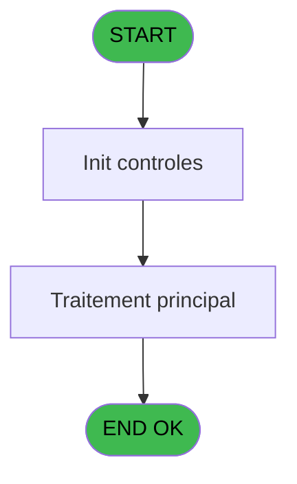
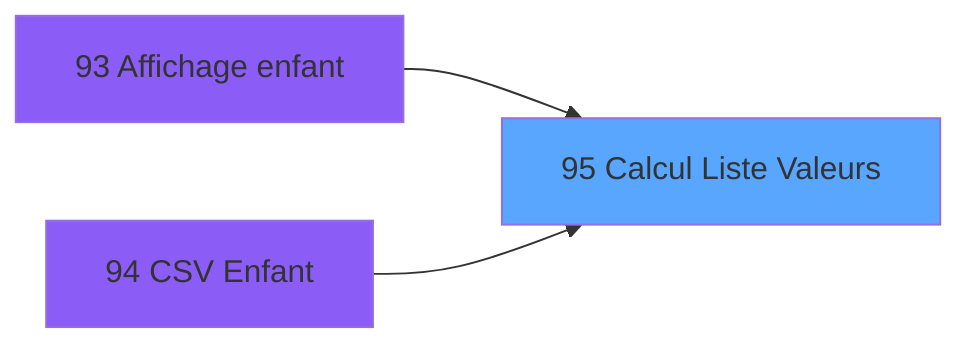

# PBP IDE 95 - Calcul Liste Valeurs

> **Analyse**: Phases 1-4 2026-02-03 09:19 -> 09:20 (19s) | Assemblage 09:20
> **Pipeline**: V7.2 Enrichi
> **Structure**: 4 onglets (Resume | Ecrans | Donnees | Connexions)

<!-- TAB:Resume -->

## 1. FICHE D'IDENTITE

| Attribut | Valeur |
|----------|--------|
| Projet | PBP |
| IDE Position | 95 |
| Nom Programme | Calcul Liste Valeurs |
| Fichier source | `Prg_95.xml` |
| Domaine metier | General |
| Taches | 1 (0 ecrans visibles) |
| Tables modifiees | 0 |
| Programmes appeles | 0 |

## 2. DESCRIPTION FONCTIONNELLE

**Calcul Liste Valeurs** assure la gestion complete de ce processus, accessible depuis [Affichage enfant (IDE 93)](PBP-IDE-93.md), [CSV Enfant (IDE 94)](PBP-IDE-94.md).

Le flux de traitement s'organise en **1 blocs fonctionnels** :

- **Calcul** (1 tache) : calculs de montants, stocks ou compteurs

## 3. BLOCS FONCTIONNELS

### 3.1 Calcul (1 tache)

Calculs metier : montants, stocks, compteurs.

---

#### 95 - Calcul Liste Valeurs

**Role** : Calcul : Calcul Liste Valeurs.
**Variables liees** : A (P.i.Liste Codes), E (P.o.Liste Valeurs Fr), F (P.o.Liste Valeurs En)

## 5. REGLES METIER

*(Aucune regle metier identifiee)*

## 6. CONTEXTE

- **Appele par**: [Affichage enfant (IDE 93)](PBP-IDE-93.md), [CSV Enfant (IDE 94)](PBP-IDE-94.md)
- **Appelle**: 0 programmes | **Tables**: 1 (W:0 R:1 L:0) | **Taches**: 1 | **Expressions**: 9

<!-- TAB:Ecrans -->

## 8. ECRANS

*(Programme sans ecran visible)*

## 9. NAVIGATION

### 9.3 Structure hierarchique (1 tache)

| Position | Tache | Type | Dimensions | Bloc |
|----------|-------|------|------------|------|
| **95.1** | [**Calcul Liste Valeurs** (95)](#t1) | - | - | Calcul |

### 9.4 Algorigramme

> **Legende**: Vert = START/END OK | Rouge = END KO | Bleu = Decisions
> *Algorigramme auto-genere. Utiliser `/algorigramme` pour une synthese metier detaillee.*

<!-- TAB:Donnees -->

## 10. TABLES

### Tables utilisees (1)

| ID | Nom | Description | Type | R | W | L | Usages |
|----|-----|-------------|------|---|---|---|--------|
| 807 | plafond_lit |  | DB | R |   |   | 1 |

### Colonnes par table (1 / 1 tables avec colonnes identifiees)

Table 807 - plafond_lit (R) - 1 usages

| Lettre | Variable | Acces | Type |
|--------|----------|-------|------|
| A | P.i.Liste Codes | R | Unicode |
| B | P.i.Type Question | R | Unicode |
| C | P.i.Categorie Reponse | R | Unicode |
| D | P.i.Retour Chariot ? | R | Logical |
| E | P.o.Liste Valeurs Fr | R | Unicode |
| F | P.o.Liste Valeurs En | R | Unicode |

## 11. VARIABLES

### 11.1 Parametres entrants (6)

Variables recues du programme appelant ([Affichage enfant (IDE 93)](PBP-IDE-93.md)).

| Lettre | Nom | Type | Usage dans |
|--------|-----|------|-----------|
| A | P.i.Liste Codes | Unicode | 2x parametre entrant |
| B | P.i.Type Question | Unicode | 2x parametre entrant |
| C | P.i.Categorie Reponse | Unicode | - |
| D | P.i.Retour Chariot ? | Logical | - |
| E | P.o.Liste Valeurs Fr | Unicode | - |
| F | P.o.Liste Valeurs En | Unicode | - |

## 12. EXPRESSIONS

**9 / 9 expressions decodees (100%)**

### 12.1 Repartition par type

| Type | Expressions | Regles |
|------|-------------|--------|
| CONDITION | 1 | 0 |
| CALCULATION | 3 | 0 |
| CONCATENATION | 2 | 0 |
| CONSTANTE | 1 | 0 |
| OTHER | 2 | 0 |

### 12.2 Expressions cles par type

#### CONDITION (1 expressions)

| Type | IDE | Expression | Regle |
|------|-----|------------|-------|
| CONDITION | 1 | `Counter(0)>StrTokenCnt (Trim(P.i.Liste Codes [A]),'/')` | - |

#### CALCULATION (3 expressions)

| Type | IDE | Expression | Regle |
|------|-----|------------|-------|
| CALCULATION | 9 | `Left([J],Len(Trim([J]))-1)` | - |
| CALCULATION | 8 | `Left(P.i.Type Question [B],Len(Trim(P.i.Type Question [B]))-1)` | - |
| CALCULATION | 4 | `StrToken(P.i.Liste Codes [A],Counter(0),'/')` | - |

#### CONCATENATION (2 expressions)

| Type | IDE | Expression | Regle |
|------|-----|------------|-------|
| CONCATENATION | 7 | `Trim([J])&Trim([K])&IF([L],ASCIIChr (13),'/')` | - |
| CONCATENATION | 6 | `Trim(P.i.Type Question [B])&Trim([I])&IF([L],ASCIIChr (13),'/')` | - |

#### CONSTANTE (1 expressions)

| Type | IDE | Expression | Regle |
|------|-----|------------|-------|
| CONSTANTE | 5 | `''` | - |

#### OTHER (2 expressions)

| Type | IDE | Expression | Regle |
|------|-----|------------|-------|
| OTHER | 3 | `[H]` | - |
| OTHER | 2 | `[G]` | - |

<!-- TAB:Connexions -->

## 13. GRAPHE D'APPELS

### 13.1 Chaine depuis Main (Callers)

Main -> ... -> [Affichage enfant (IDE 93)](PBP-IDE-93.md) -> **Calcul Liste Valeurs (IDE 95)**

Main -> ... -> [CSV Enfant (IDE 94)](PBP-IDE-94.md) -> **Calcul Liste Valeurs (IDE 95)**

### 13.2 Callers

| IDE | Nom Programme | Nb Appels |
|-----|---------------|-----------|
| [93](PBP-IDE-93.md) | Affichage enfant | 1 |
| [94](PBP-IDE-94.md) | CSV Enfant | 1 |

### 13.3 Callees (programmes appeles)

### 13.4 Detail Callees avec contexte

| IDE | Nom Programme | Appels | Contexte |
|-----|---------------|--------|----------|
| - | (aucun) | - | - |

## 14. RECOMMANDATIONS MIGRATION

### 14.1 Profil du programme

| Metrique | Valeur | Impact migration |
|----------|--------|-----------------|
| Lignes de logique | 23 | Programme compact |
| Expressions | 9 | Peu de logique |
| Tables WRITE | 0 | Impact faible |
| Sous-programmes | 0 | Peu de dependances |
| Ecrans visibles | 0 | Ecran unique ou traitement batch |
| Code desactive | 0% (0 / 23) | Code sain |
| Regles metier | 0 | Pas de regle identifiee |

### 14.2 Plan de migration par bloc

#### Calcul (1 tache: 0 ecran, 1 traitement)

- **Strategie** : Services de calcul purs (Domain Services).
- Migrer la logique de calcul (stock, compteurs, montants)

### 14.3 Dependances critiques

| Dependance | Type | Appels | Impact |
|------------|------|--------|--------|

---
*Spec DETAILED generee par Pipeline V7.2 - 2026-02-03 09:20*
