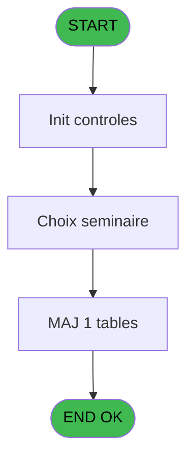
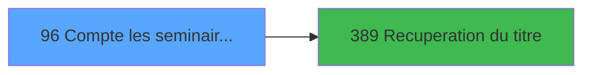

# PBP IDE 96 - Compte les seminaires(Chambre)

> **Analyse**: Phases 1-4 2026-02-03 09:20 -> 09:20 (20s) | Assemblage 09:20
> **Pipeline**: V7.2 Enrichi
> **Structure**: 4 onglets (Resume | Ecrans | Donnees | Connexions)

<!-- TAB:Resume -->

## 1. FICHE D'IDENTITE

| Attribut | Valeur |
|----------|--------|
| Projet | PBP |
| IDE Position | 96 |
| Nom Programme | Compte les seminaires(Chambre) |
| Fichier source | `Prg_96.xml` |
| Domaine metier | Comptabilite |
| Taches | 4 (1 ecrans visibles) |
| Tables modifiees | 1 |
| Programmes appeles | 1 |

## 2. DESCRIPTION FONCTIONNELLE

**Compte les seminaires(Chambre)** assure la gestion complete de ce processus, accessible depuis [Preparation étiquettes(Chambre (IDE 97)](PBP-IDE-97.md).

Le flux de traitement s'organise en **4 blocs fonctionnels** :

- **Creation** (1 tache) : insertion d'enregistrements en base (mouvements, prestations)
- **Consultation** (1 tache) : ecrans de recherche, selection et consultation
- **Calcul** (1 tache) : calculs de montants, stocks ou compteurs
- **Traitement** (1 tache) : traitements metier divers

**Donnees modifiees** : 1 tables en ecriture (tempo_ecr_previsions).

Detail : phases du traitement

#### Phase 1 : Calcul (1 tache)

- **96** - Compte les seminaires(Chambre) **[[ECRAN]](#ecran-t1)**

#### Phase 2 : Traitement (1 tache)

- **96.1** - generation des seminaires **[[ECRAN]](#ecran-t2)**

Delegue a : [Recuperation du titre (IDE 389)](PBP-IDE-389.md)

#### Phase 3 : Creation (1 tache)

- **96.1.1** - Creation temp

#### Phase 4 : Consultation (1 tache)

- **96.2** - Choix seminaire **[[ECRAN]](#ecran-t4)**

Delegue a : [Recuperation du titre (IDE 389)](PBP-IDE-389.md)

#### Tables impactees

| Table | Operations | Role metier |
|-------|-----------|-------------|
| tempo_ecr_previsions | **W** (2 usages) | Table temporaire ecran |

## 3. BLOCS FONCTIONNELS

### 3.1 Calcul (1 tache)

Calculs metier : montants, stocks, compteurs.

---

#### 96 - Compte les seminaires(Chambre) [[ECRAN]](#ecran-t1)

**Role** : Traitement : Compte les seminaires(Chambre).
**Ecran** : 424 x 55 DLU (MDI) | [Voir mockup](#ecran-t1)

### 3.2 Traitement (1 tache)

Traitements internes.

---

#### 96.1 - generation des seminaires [[ECRAN]](#ecran-t2)

**Role** : Traitement : generation des seminaires.
**Ecran** : 278 x 195 DLU | [Voir mockup](#ecran-t2)
**Delegue a** : [Recuperation du titre (IDE 389)](PBP-IDE-389.md)

### 3.3 Creation (1 tache)

Insertion de nouveaux enregistrements en base.

---

#### 96.1.1 - Creation temp

**Role** : Creation d'enregistrement : Creation temp.

### 3.4 Consultation (1 tache)

Ecrans de recherche et consultation.

---

#### 96.2 - Choix seminaire [[ECRAN]](#ecran-t4)

**Role** : Selection par l'operateur : Choix seminaire.
**Ecran** : 442 x 213 DLU (MDI) | [Voir mockup](#ecran-t4)
**Variables liees** : B (P0 Date seminaire du), C (P0 Date seminaire au), D (P0 nom seminaire)

## 5. REGLES METIER

*(Aucune regle metier identifiee)*

## 6. CONTEXTE

- **Appele par**: [Preparation étiquettes(Chambre (IDE 97)](PBP-IDE-97.md)
- **Appelle**: 1 programmes | **Tables**: 1 (W:1 R:0 L:0) | **Taches**: 4 | **Expressions**: 3

<!-- TAB:Ecrans -->

## 8. ECRANS

### 8.1 Forms visibles (1 / 4)

| # | Position | Tache | Nom | Type | Largeur | Hauteur | Bloc |
|---|----------|-------|-----|------|---------|---------|------|
| 1 | 96.2 | 96.2 | Choix seminaire | MDI | 442 | 213 | Consultation |

### 8.2 Mockups Ecrans

---

#### 96.2 - Choix seminaire
**Tache** : [96.2](#t4) | **Type** : MDI | **Dimensions** : 442 x 213 DLU
**Bloc** : Consultation | **Titre IDE** : Choix seminaire

<!-- FORM-DATA:
{
    "width":  442,
    "vFactor":  8,
    "type":  "MDI",
    "hFactor":  4,
    "controls":  [
                     {
                         "x":  2,
                         "type":  "label",
                         "var":  "",
                         "y":  2,
                         "w":  436,
                         "fmt":  "",
                         "name":  "",
                         "h":  17,
                         "color":  "",
                         "text":  "",
                         "parent":  null
                     },
                     {
                         "x":  37,
                         "type":  "table",
                         "var":  "",
                         "name":  "",
                         "titleH":  12,
                         "color":  "110",
                         "w":  284,
                         "y":  26,
                         "fmt":  "",
                         "parent":  null,
                         "text":  "",
                         "rowH":  14,
                         "h":  154,
                         "cols":  [
                                      {
                                          "title":  "Séminaire",
                                          "layer":  1,
                                          "w":  125
                                      },
                                      {
                                          "title":  "Date début",
                                          "layer":  2,
                                          "w":  73
                                      },
                                      {
                                          "title":  "Date fin",
                                          "layer":  3,
                                          "w":  69
                                      }
                                  ],
                         "rows":  3
                     },
                     {
                         "x":  2,
                         "type":  "label",
                         "var":  "",
                         "y":  186,
                         "w":  436,
                         "fmt":  "",
                         "name":  "",
                         "h":  24,
                         "color":  "",
                         "text":  "",
                         "parent":  null
                     },
                     {
                         "x":  40,
                         "type":  "edit",
                         "var":  "",
                         "y":  40,
                         "w":  119,
                         "fmt":  "",
                         "name":  "SEM Seminaire",
                         "h":  10,
                         "color":  "110",
                         "text":  "",
                         "parent":  4
                     },
                     {
                         "x":  165,
                         "type":  "edit",
                         "var":  "",
                         "y":  40,
                         "w":  63,
                         "fmt":  "",
                         "name":  "SEM date Debut",
                         "h":  10,
                         "color":  "110",
                         "text":  "",
                         "parent":  4
                     },
                     {
                         "x":  238,
                         "type":  "edit",
                         "var":  "",
                         "y":  40,
                         "w":  63,
                         "fmt":  "",
                         "name":  "SEM date fin",
                         "h":  10,
                         "color":  "110",
                         "text":  "",
                         "parent":  4
                     },
                     {
                         "x":  344,
                         "type":  "button",
                         "var":  "",
                         "y":  189,
                         "w":  80,
                         "fmt":  "Selectionner",
                         "name":  "Bouton Edition",
                         "h":  18,
                         "color":  "",
                         "text":  "",
                         "parent":  null
                     },
                     {
                         "x":  13,
                         "type":  "edit",
                         "var":  "",
                         "y":  6,
                         "w":  114,
                         "fmt":  "30",
                         "name":  "",
                         "h":  8,
                         "color":  "",
                         "text":  "",
                         "parent":  1
                     },
                     {
                         "x":  318,
                         "type":  "edit",
                         "var":  "",
                         "y":  6,
                         "w":  114,
                         "fmt":  "WWW DD MMM YYYYZ",
                         "name":  "",
                         "h":  8,
                         "color":  "",
                         "text":  "",
                         "parent":  1
                     },
                     {
                         "x":  340,
                         "type":  "image",
                         "var":  "",
                         "y":  73,
                         "w":  80,
                         "fmt":  "",
                         "name":  "",
                         "h":  54,
                         "color":  "",
                         "text":  "",
                         "parent":  null
                     },
                     {
                         "x":  11,
                         "type":  "button",
                         "var":  "",
                         "y":  189,
                         "w":  80,
                         "fmt":  "\u0026Quitter",
                         "name":  "",
                         "h":  18,
                         "color":  "",
                         "text":  "",
                         "parent":  null
                     }
                 ],
    "taskId":  "96.2",
    "height":  213
}
-->

<strong>Champs : 5 champs</strong>

| Pos (x,y) | Nom | Variable | Type |
|-----------|-----|----------|------|
| 40,40 | SEM Seminaire | - | edit |
| 165,40 | SEM date Debut | - | edit |
| 238,40 | SEM date fin | - | edit |
| 13,6 | 30 | - | edit |
| 318,6 | WWW DD MMM YYYYZ | - | edit |

<strong>Boutons : 2 boutons</strong>

| Bouton | Pos (x,y) | Action |
|--------|-----------|--------|
| Selectionner | 344,189 | Ouvre la selection |
| Quitter | 11,189 | Quitte le programme |

## 9. NAVIGATION

Ecran unique: **Choix seminaire**

### 9.3 Structure hierarchique (4 taches)

| Position | Tache | Type | Dimensions | Bloc |
|----------|-------|------|------------|------|
| **96.1** | [**Compte les seminaires(Chambre)** (96)](#t1) [mockup](#ecran-t1) | MDI | 424x55 | Calcul |
| **96.2** | [**generation des seminaires** (96.1)](#t2) [mockup](#ecran-t2) | - | 278x195 | Traitement |
| **96.3** | [**Creation temp** (96.1.1)](#t3) | MDI | - | Creation |
| **96.4** | [**Choix seminaire** (96.2)](#t4) [mockup](#ecran-t4) | MDI | 442x213 | Consultation |

### 9.4 Algorigramme

> **Legende**: Vert = START/END OK | Rouge = END KO | Bleu = Decisions
> *Algorigramme auto-genere. Utiliser `/algorigramme` pour une synthese metier detaillee.*

<!-- TAB:Donnees -->

## 10. TABLES

### Tables utilisees (1)

| ID | Nom | Description | Type | R | W | L | Usages |
|----|-----|-------------|------|---|---|---|--------|
| 597 | tempo_ecr_previsions | Table temporaire ecran | TMP |   | **W** |   | 2 |

### Colonnes par table (1 / 1 tables avec colonnes identifiees)

Table 597 - tempo_ecr_previsions (**W**) - 2 usages

| Lettre | Variable | Acces | Type |
|--------|----------|-------|------|
| A | b.Edition | W | Alpha |
| B | v Titre | W | Alpha |

## 11. VARIABLES

### 11.1 Parametres entrants (4)

Variables recues du programme appelant ([Preparation étiquettes(Chambre (IDE 97)](PBP-IDE-97.md)).

| Lettre | Nom | Type | Usage dans |
|--------|-----|------|-----------|
| A | P0 Societe | Alpha | - |
| B | P0 Date seminaire du | Date | - |
| C | P0 Date seminaire au | Date | - |
| D | P0 nom seminaire | Alpha | - |

## 12. EXPRESSIONS

**3 / 3 expressions decodees (100%)**

### 12.1 Repartition par type

| Type | Expressions | Regles |
|------|-------------|--------|
| CALCULATION | 1 | 0 |
| CONSTANTE | 1 | 0 |
| OTHER | 1 | 0 |

### 12.2 Expressions cles par type

#### CALCULATION (1 expressions)

| Type | IDE | Expression | Regle |
|------|-----|------------|-------|
| CALCULATION | 1 | `'00/00/0000'DATE` | - |

#### CONSTANTE (1 expressions)

| Type | IDE | Expression | Regle |
|------|-----|------------|-------|
| CONSTANTE | 2 | `''` | - |

#### OTHER (1 expressions)

| Type | IDE | Expression | Regle |
|------|-----|------------|-------|
| OTHER | 3 | `DbDel('{597,2}'DSOURCE,'')` | - |

<!-- TAB:Connexions -->

## 13. GRAPHE D'APPELS

### 13.1 Chaine depuis Main (Callers)

Main -> ... -> [Preparation étiquettes(Chambre (IDE 97)](PBP-IDE-97.md) -> **Compte les seminaires(Chambre) (IDE 96)**

### 13.2 Callers

| IDE | Nom Programme | Nb Appels |
|-----|---------------|-----------|
| [97](PBP-IDE-97.md) | Preparation étiquettes(Chambre | 1 |

### 13.3 Callees (programmes appeles)

### 13.4 Detail Callees avec contexte

| IDE | Nom Programme | Appels | Contexte |
|-----|---------------|--------|----------|
| [389](PBP-IDE-389.md) | Recuperation du titre | 2 | Recuperation donnees |

## 14. RECOMMANDATIONS MIGRATION

### 14.1 Profil du programme

| Metrique | Valeur | Impact migration |
|----------|--------|-----------------|
| Lignes de logique | 38 | Programme compact |
| Expressions | 3 | Peu de logique |
| Tables WRITE | 1 | Impact faible |
| Sous-programmes | 1 | Peu de dependances |
| Ecrans visibles | 1 | Ecran unique ou traitement batch |
| Code desactive | 5.3% (2 / 38) | A verifier |
| Regles metier | 0 | Pas de regle identifiee |

### 14.2 Plan de migration par bloc

#### Calcul (1 tache: 1 ecran, 0 traitement)

- **Strategie** : Services de calcul purs (Domain Services).
- Migrer la logique de calcul (stock, compteurs, montants)

#### Traitement (1 tache: 1 ecran, 0 traitement)

- **Strategie** : 1 composant(s) UI (Razor/React) avec formulaires et validation.
- 1 sous-programme(s) a migrer ou a reutiliser depuis les services existants.
- Decomposer les taches en services unitaires testables.

#### Creation (1 tache: 0 ecran, 1 traitement)

- **Strategie** : Repository pattern avec Entity Framework Core.
- Insertion via `IRepository<T>.CreateAsync()`

#### Consultation (1 tache: 1 ecran, 0 traitement)

- **Strategie** : Composants de recherche/selection en modales.
- 1 ecran : Choix seminaire

### 14.3 Dependances critiques

| Dependance | Type | Appels | Impact |
|------------|------|--------|--------|
| tempo_ecr_previsions | Table WRITE (Temp) | 2x | Schema + repository |
| [Recuperation du titre (IDE 389)](PBP-IDE-389.md) | Sous-programme | 2x | Haute - Recuperation donnees |

---
*Spec DETAILED generee par Pipeline V7.2 - 2026-02-03 09:20*
