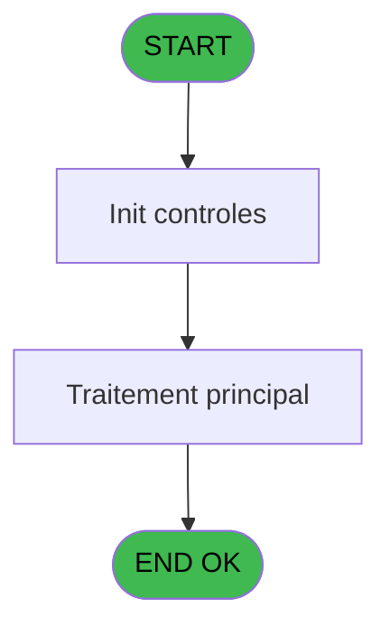
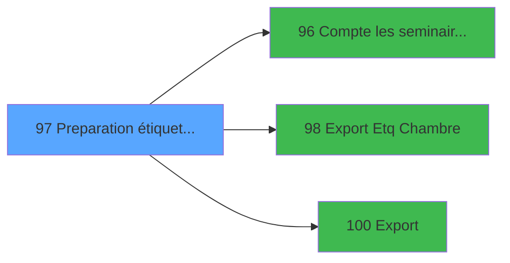

# PBP IDE 97 - Preparation étiquettes(Chambre

> **Analyse**: Phases 1-4 2026-02-03 09:20 -> 09:21 (21s) | Assemblage 09:21
> **Pipeline**: V7.2 Enrichi
> **Structure**: 4 onglets (Resume | Ecrans | Donnees | Connexions)

<!-- TAB:Resume -->

## 1. FICHE D'IDENTITE

| Attribut | Valeur |
|----------|--------|
| Projet | PBP |
| IDE Position | 97 |
| Nom Programme | Preparation étiquettes(Chambre |
| Fichier source | `Prg_97.xml` |
| Domaine metier | General |
| Taches | 1 (1 ecrans visibles) |
| Tables modifiees | 0 |
| Programmes appeles | 3 |
| :warning: Statut | **ORPHELIN_POTENTIEL** |

## 2. DESCRIPTION FONCTIONNELLE

**Preparation étiquettes(Chambre** assure la gestion complete de ce processus.

Le flux de traitement s'organise en **1 blocs fonctionnels** :

- **Traitement** (1 tache) : traitements metier divers

**Logique metier** : 1 regles identifiees couvrant conditions metier.

## 3. BLOCS FONCTIONNELS

### 3.1 Traitement (1 tache)

Traitements internes.

---

#### 97 - Preparation  export etiquettes [[ECRAN]](#ecran-t1)

**Role** : Traitement : Preparation  export etiquettes.
**Ecran** : 642 x 163 DLU (MDI) | [Voir mockup](#ecran-t1)
**Delegue a** : [Export Etq (Chambre (IDE 98)](PBP-IDE-98.md), [Export (IDE 100)](PBP-IDE-100.md)

## 5. REGLES METIER

1 regles identifiees:

### Autres (1 regles)

#### [RM-001] Si [M]='S' alors v.seminaire [C] sinon '')

| Element | Detail |
|---------|--------|
| **Condition** | `[M]='S'` |
| **Si vrai** | v.seminaire [C] |
| **Si faux** | '') |
| **Variables** | C (v.seminaire) |
| **Expression source** | Expression 19 : `IF([M]='S',v.seminaire [C],'')` |
| **Exemple** | Si [M]='S' → v.seminaire [C]. Sinon → '') |

## 6. CONTEXTE

- **Appele par**: (aucun)
- **Appelle**: 3 programmes | **Tables**: 0 (W:0 R:0 L:0) | **Taches**: 1 | **Expressions**: 20

<!-- TAB:Ecrans -->

## 8. ECRANS

### 8.1 Forms visibles (1 / 1)

| # | Position | Tache | Nom | Type | Largeur | Hauteur | Bloc |
|---|----------|-------|-----|------|---------|---------|------|
| 1 | 97 | 97 | Preparation  export etiquettes | MDI | 642 | 163 | Traitement |

### 8.2 Mockups Ecrans

---

#### 97 - Preparation  export etiquettes
**Tache** : [97](#t1) | **Type** : MDI | **Dimensions** : 642 x 163 DLU
**Bloc** : Traitement | **Titre IDE** : Preparation  export etiquettes

<!-- FORM-DATA:
{
    "width":  642,
    "vFactor":  8,
    "type":  "MDI",
    "hFactor":  8,
    "controls":  [
                     {
                         "x":  27,
                         "type":  "label",
                         "var":  "",
                         "y":  95,
                         "w":  86,
                         "fmt":  "",
                         "name":  "",
                         "h":  9,
                         "color":  "",
                         "text":  "Séminaire :",
                         "parent":  24
                     },
                     {
                         "x":  31,
                         "type":  "label",
                         "var":  "",
                         "y":  36,
                         "w":  98,
                         "fmt":  "",
                         "name":  "",
                         "h":  10,
                         "color":  "",
                         "text":  "Date début :",
                         "parent":  24
                     },
                     {
                         "x":  4,
                         "type":  "label",
                         "var":  "",
                         "y":  2,
                         "w":  631,
                         "fmt":  "",
                         "name":  "",
                         "h":  19,
                         "color":  "1",
                         "text":  "",
                         "parent":  null
                     },
                     {
                         "x":  8,
                         "type":  "label",
                         "var":  "",
                         "y":  138,
                         "w":  631,
                         "fmt":  "",
                         "name":  "",
                         "h":  24,
                         "color":  "1",
                         "text":  "",
                         "parent":  null
                     },
                     {
                         "x":  11,
                         "type":  "label",
                         "var":  "",
                         "y":  24,
                         "w":  415,
                         "fmt":  "",
                         "name":  "",
                         "h":  110,
                         "color":  "195",
                         "text":  "Paramètres",
                         "parent":  null
                     },
                     {
                         "x":  435,
                         "type":  "label",
                         "var":  "",
                         "y":  24,
                         "w":  192,
                         "fmt":  "",
                         "name":  "",
                         "h":  110,
                         "color":  "",
                         "text":  "",
                         "parent":  null
                     },
                     {
                         "x":  26,
                         "type":  "label",
                         "var":  "",
                         "y":  113,
                         "w":  122,
                         "fmt":  "",
                         "name":  "",
                         "h":  9,
                         "color":  "",
                         "text":  "Type d\u0027éditon :",
                         "parent":  24
                     },
                     {
                         "x":  27,
                         "type":  "label",
                         "var":  "",
                         "y":  75,
                         "w":  86,
                         "fmt":  "",
                         "name":  "",
                         "h":  9,
                         "color":  "",
                         "text":  "Client",
                         "parent":  24
                     },
                     {
                         "x":  156,
                         "type":  "edit",
                         "var":  "",
                         "y":  36,
                         "w":  122,
                         "fmt":  "",
                         "name":  "v.date debut",
                         "h":  10,
                         "color":  "110",
                         "text":  "",
                         "parent":  24
                     },
                     {
                         "x":  280,
                         "type":  "button",
                         "var":  "",
                         "y":  36,
                         "w":  26,
                         "fmt":  "...",
                         "name":  "b.Date début",
                         "h":  10,
                         "color":  "",
                         "text":  "",
                         "parent":  24
                     },
                     {
                         "x":  156,
                         "type":  "edit",
                         "var":  "",
                         "y":  57,
                         "w":  122,
                         "fmt":  "##/##/####Z",
                         "name":  "v.date fin",
                         "h":  10,
                         "color":  "110",
                         "text":  "",
                         "parent":  24
                     },
                     {
                         "x":  280,
                         "type":  "button",
                         "var":  "",
                         "y":  57,
                         "w":  26,
                         "fmt":  "...",
                         "name":  "b.Date fin",
                         "h":  10,
                         "color":  "",
                         "text":  "",
                         "parent":  24
                     },
                     {
                         "x":  156,
                         "type":  "edit",
                         "var":  "",
                         "y":  94,
                         "w":  230,
                         "fmt":  "",
                         "name":  "v. seminaire",
                         "h":  10,
                         "color":  "110",
                         "text":  "",
                         "parent":  24
                     },
                     {
                         "x":  154,
                         "type":  "combobox",
                         "var":  "",
                         "y":  112,
                         "w":  146,
                         "fmt":  "",
                         "name":  "b.type d\u0027edtion",
                         "h":  12,
                         "color":  "",
                         "text":  "1,2",
                         "parent":  24
                     },
                     {
                         "x":  476,
                         "type":  "button",
                         "var":  "",
                         "y":  141,
                         "w":  148,
                         "fmt":  "",
                         "name":  "B.Lancement",
                         "h":  18,
                         "color":  "",
                         "text":  "",
                         "parent":  null
                     },
                     {
                         "x":  18,
                         "type":  "button",
                         "var":  "",
                         "y":  141,
                         "w":  154,
                         "fmt":  "Quitter",
                         "name":  "",
                         "h":  18,
                         "color":  "",
                         "text":  "",
                         "parent":  null
                     },
                     {
                         "x":  390,
                         "type":  "button",
                         "var":  "",
                         "y":  94,
                         "w":  26,
                         "fmt":  "...",
                         "name":  "b. Recherhce",
                         "h":  10,
                         "color":  "",
                         "text":  "",
                         "parent":  24
                     },
                     {
                         "x":  10,
                         "type":  "edit",
                         "var":  "",
                         "y":  3,
                         "w":  267,
                         "fmt":  "20",
                         "name":  "",
                         "h":  8,
                         "color":  "",
                         "text":  "",
                         "parent":  18
                     },
                     {
                         "x":  371,
                         "type":  "edit",
                         "var":  "",
                         "y":  8,
                         "w":  254,
                         "fmt":  "WWW DD MMM YYYYT",
                         "name":  "",
                         "h":  8,
                         "color":  "",
                         "text":  "",
                         "parent":  18
                     },
                     {
                         "x":  10,
                         "type":  "edit",
                         "var":  "",
                         "y":  11,
                         "w":  331,
                         "fmt":  "25",
                         "name":  "VG.NOM VILLAGE",
                         "h":  8,
                         "color":  "",
                         "text":  "",
                         "parent":  18
                     },
                     {
                         "x":  447,
                         "type":  "image",
                         "var":  "",
                         "y":  32,
                         "w":  170,
                         "fmt":  "",
                         "name":  "",
                         "h":  59,
                         "color":  "",
                         "text":  "",
                         "parent":  32
                     },
                     {
                         "x":  156,
                         "type":  "combobox",
                         "var":  "",
                         "y":  75,
                         "w":  229,
                         "fmt":  "",
                         "name":  "v. choix client",
                         "h":  12,
                         "color":  "",
                         "text":  "T,W,S",
                         "parent":  24
                     }
                 ],
    "taskId":  "97",
    "height":  163
}
-->

<strong>Champs : 8 champs</strong>

| Pos (x,y) | Nom | Variable | Type |
|-----------|-----|----------|------|
| 156,36 | v.date debut | - | edit |
| 156,57 | v.date fin | - | edit |
| 156,94 | v. seminaire | - | edit |
| 154,112 | b.type d'edtion | - | combobox |
| 10,3 | 20 | - | edit |
| 371,8 | WWW DD MMM YYYYT | - | edit |
| 10,11 | VG.NOM VILLAGE | - | edit |
| 156,75 | v. choix client | - | combobox |

<strong>Boutons : 5 boutons</strong>

| Bouton | Pos (x,y) | Action |
|--------|-----------|--------|
| ... | 280,36 | Bouton fonctionnel |
| ... | 280,57 | Bouton fonctionnel |
| B.Lancement | 476,141 | Bouton fonctionnel |
| Quitter | 18,141 | Quitte le programme |
| ... | 390,94 | Bouton fonctionnel |

## 9. NAVIGATION

Ecran unique: **Preparation  export etiquettes**

### 9.3 Structure hierarchique (1 tache)

| Position | Tache | Type | Dimensions | Bloc |
|----------|-------|------|------------|------|
| **97.1** | [**Preparation  export etiquettes** (97)](#t1) [mockup](#ecran-t1) | MDI | 642x163 | Traitement |

### 9.4 Algorigramme

> **Legende**: Vert = START/END OK | Rouge = END KO | Bleu = Decisions
> *Algorigramme auto-genere. Utiliser `/algorigramme` pour une synthese metier detaillee.*

<!-- TAB:Donnees -->

## 10. TABLES

### Tables utilisees (0)

| ID | Nom | Description | Type | R | W | L | Usages |
|----|-----|-------------|------|---|---|---|--------|

### Colonnes par table (0 / 0 tables avec colonnes identifiees)

## 11. VARIABLES

### 11.1 Variables de session (4)

Variables persistantes pendant toute la session.

| Lettre | Nom | Type | Usage dans |
|--------|-----|------|-----------|
| A | v.date debut | Date | - |
| B | v.date fin | Date | - |
| C | v.seminaire | Alpha | 2x session |
| H | v. choix client | Alpha | - |

### 11.2 Autres (5)

Variables diverses.

| Lettre | Nom | Type | Usage dans |
|--------|-----|------|-----------|
| D | b.Lancement | Alpha | - |
| E | b. Recherhce | Alpha | - |
| F | b.Date début | Alpha | - |
| G | b.Date fin | Alpha | - |
| I | b.type d'edtion | Alpha | - |

## 12. EXPRESSIONS

**20 / 20 expressions decodees (100%)**

### 12.1 Repartition par type

| Type | Expressions | Regles |
|------|-------------|--------|
| CONDITION | 6 | 5 |
| CONSTANTE | 6 | 0 |
| DATE | 3 | 0 |
| OTHER | 2 | 0 |
| REFERENCE_VG | 2 | 0 |
| CONCATENATION | 1 | 0 |

### 12.2 Expressions cles par type

#### CONDITION (6 expressions)

| Type | IDE | Expression | Regle |
|------|-----|------------|-------|
| CONDITION | 19 | `IF([M]='S',v.seminaire [C],'')` | [RM-001](#rm-RM-001) |
| CONDITION | 20 | `[M]='W'` | - |
| CONDITION | 18 | `[M]='S' AND Trim(v.seminaire [C])=''` | - |
| CONDITION | 16 | `[M]='S'` | - |
| CONDITION | 12 | `[L]='2'` | - |
| ... | | *+1 autres* | |

#### CONSTANTE (6 expressions)

| Type | IDE | Expression | Regle |
|------|-----|------------|-------|
| CONSTANTE | 11 | `'Traitement terminé'` | - |
| CONSTANTE | 14 | `'1'` | - |
| CONSTANTE | 15 | `'T'` | - |
| CONSTANTE | 1 | `'...'` | - |
| CONSTANTE | 2 | `'Lancer'` | - |
| ... | | *+1 autres* | |

#### DATE (3 expressions)

| Type | IDE | Expression | Regle |
|------|-----|------------|-------|
| DATE | 10 | `Date()+6` | - |
| DATE | 9 | `Date()` | - |
| DATE | 8 | `Date()` | - |

#### OTHER (2 expressions)

| Type | IDE | Expression | Regle |
|------|-----|------------|-------|
| OTHER | 5 | `SetCrsr (1)` | - |
| OTHER | 4 | `SetCrsr (2)` | - |

#### REFERENCE_VG (2 expressions)

| Type | IDE | Expression | Regle |
|------|-----|------------|-------|
| REFERENCE_VG | 7 | `VG37` | - |
| REFERENCE_VG | 6 | `VG2` | - |

#### CONCATENATION (1 expressions)

| Type | IDE | Expression | Regle |
|------|-----|------------|-------|
| CONCATENATION | 17 | `MlsTrans('Saisie obligatoire')&': '&MlsTrans('Séminaire')` | - |

<!-- TAB:Connexions -->

## 13. GRAPHE D'APPELS

### 13.1 Chaine depuis Main (Callers)

**Chemin**: (pas de callers directs)

### 13.2 Callers

| IDE | Nom Programme | Nb Appels |
|-----|---------------|-----------|
| - | (aucun) | - |

### 13.3 Callees (programmes appeles)

### 13.4 Detail Callees avec contexte

| IDE | Nom Programme | Appels | Contexte |
|-----|---------------|--------|----------|
| [96](PBP-IDE-96.md) | Compte les seminaires(Chambre) | 1 | Sous-programme |
| [98](PBP-IDE-98.md) | Export Etq (Chambre | 1 | Sous-programme |
| [100](PBP-IDE-100.md) | Export | 1 | Sous-programme |

## 14. RECOMMANDATIONS MIGRATION

### 14.1 Profil du programme

| Metrique | Valeur | Impact migration |
|----------|--------|-----------------|
| Lignes de logique | 22 | Programme compact |
| Expressions | 20 | Peu de logique |
| Tables WRITE | 0 | Impact faible |
| Sous-programmes | 3 | Peu de dependances |
| Ecrans visibles | 1 | Ecran unique ou traitement batch |
| Code desactive | 0% (0 / 22) | Code sain |
| Regles metier | 1 | Quelques regles a preserver |

### 14.2 Plan de migration par bloc

#### Traitement (1 tache: 1 ecran, 0 traitement)

- **Strategie** : 1 composant(s) UI (Razor/React) avec formulaires et validation.
- 3 sous-programme(s) a migrer ou a reutiliser depuis les services existants.
- Decomposer les taches en services unitaires testables.

### 14.3 Dependances critiques

| Dependance | Type | Appels | Impact |
|------------|------|--------|--------|
| [Export (IDE 100)](PBP-IDE-100.md) | Sous-programme | 1x | Normale - Sous-programme |
| [Export Etq (Chambre (IDE 98)](PBP-IDE-98.md) | Sous-programme | 1x | Normale - Sous-programme |
| [Compte les seminaires(Chambre) (IDE 96)](PBP-IDE-96.md) | Sous-programme | 1x | Normale - Sous-programme |

---
*Spec DETAILED generee par Pipeline V7.2 - 2026-02-03 09:21*
