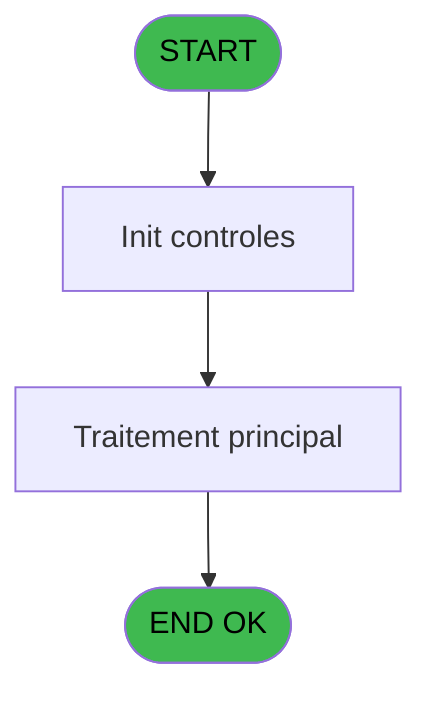

# PBP IDE 98 - Export Etq (Chambre

> **Analyse**: Phases 1-4 2026-02-03 09:21 -> 09:21 (20s) | Assemblage 09:21
> **Pipeline**: V7.2 Enrichi
> **Structure**: 4 onglets (Resume | Ecrans | Donnees | Connexions)

<!-- TAB:Resume -->

## 1. FICHE D'IDENTITE

| Attribut | Valeur |
|----------|--------|
| Projet | PBP |
| IDE Position | 98 |
| Nom Programme | Export Etq (Chambre |
| Fichier source | `Prg_98.xml` |
| Domaine metier | General |
| Taches | 2 (0 ecrans visibles) |
| Tables modifiees | 0 |
| Programmes appeles | 0 |

## 2. DESCRIPTION FONCTIONNELLE

**Export Etq (Chambre** assure la gestion complete de ce processus, accessible depuis [Preparation étiquettes(Chambre (IDE 97)](PBP-IDE-97.md).

Le flux de traitement s'organise en **1 blocs fonctionnels** :

- **Traitement** (2 taches) : traitements metier divers

**Logique metier** : 7 regles identifiees couvrant conditions metier, valeurs par defaut.

## 3. BLOCS FONCTIONNELS

### 3.1 Traitement (2 taches)

Traitements internes.

---

#### 98 - Export Etq (Chambre [[ECRAN]](#ecran-t1)

**Role** : Traitement : Export Etq (Chambre.
**Ecran** : 726 x 543 DLU (MDI) | [Voir mockup](#ecran-t1)

---

#### 98.1 - export [[ECRAN]](#ecran-t4)

**Role** : Traitement : export.
**Ecran** : 145 x 59 DLU (MDI) | [Voir mockup](#ecran-t4)

## 5. REGLES METIER

7 regles identifiees:

### Autres (7 regles)

#### [RM-001] Si [AA]='10' alors 'AM' sinon 'PM')

| Element | Detail |
|---------|--------|
| **Condition** | `[AA]='10'` |
| **Si vrai** | 'AM' |
| **Si faux** | 'PM') |
| **Expression source** | Expression 12 : `IF ([AA]='10','AM','PM')` |
| **Exemple** | Si [AA]='10' → 'AM'. Sinon → 'PM') |

#### [RM-002] Si [AC]='10' alors 'AM' sinon 'PM')

| Element | Detail |
|---------|--------|
| **Condition** | `[AC]='10'` |
| **Si vrai** | 'AM' |
| **Si faux** | 'PM') |
| **Expression source** | Expression 13 : `IF ([AC]='10','AM','PM')` |
| **Exemple** | Si [AC]='10' → 'AM'. Sinon → 'PM') |

#### [RM-003] Si [DL] OR [DK] OR [DJ] alors 'EA'&ExpCalc('48'EXP) sinon '')

| Element | Detail |
|---------|--------|
| **Condition** | `[DL] OR [DK] OR [DJ]` |
| **Si vrai** | 'EA'&ExpCalc('48'EXP) |
| **Si faux** | '') |
| **Expression source** | Expression 33 : `IF([DL] OR [DK] OR [DJ],'EA'&ExpCalc('48'EXP),'')` |
| **Exemple** | Si [DL] OR [DK] OR [DJ] → 'EA'&ExpCalc('48'EXP). Sinon → '') |

#### [RM-004] Si [DL] alors VG61 sinon '') & IF([DK],VG62,'') & IF([DJ],VG63,'')

| Element | Detail |
|---------|--------|
| **Condition** | `[DL]` |
| **Si vrai** | VG61 |
| **Si faux** | '') & IF([DK],VG62,'') & IF([DJ],VG63,'') |
| **Expression source** | Expression 34 : `IF([DL],VG61,'') & IF([DK],VG62,'') & IF([DJ],VG63,'')` |
| **Exemple** | Si [DL] → VG61. Sinon → '') & IF([DK],VG62,'') & IF([DJ],VG63,'') |

#### [RM-005] Traitement si Trim([DV]) est renseigne

| Element | Detail |
|---------|--------|
| **Condition** | `Trim([DV])<>''` |
| **Si vrai** | 'ECI' |
| **Si faux** | '') |
| **Expression source** | Expression 35 : `IF(Trim([DV])<>'','ECI','')` |
| **Exemple** | Si Trim([DV])<>'' → 'ECI'. Sinon → '') |

#### [RM-006] Traitement si Trim([DQ]) est renseigne

| Element | Detail |
|---------|--------|
| **Condition** | `Trim([DQ])<>''` |
| **Si vrai** | 'Up' |
| **Si faux** | '') |
| **Expression source** | Expression 36 : `IF(Trim([DQ])<>'','Up','')` |
| **Exemple** | Si Trim([DQ])<>'' → 'Up'. Sinon → '') |

#### [RM-007] Valeur par defaut si [DW],V.age1 [K] est vide

| Element | Detail |
|---------|--------|
| **Condition** | `[DW]` |
| **Si vrai** | V.age1 [K]='' |
| **Si faux** | 'TRUE'LOG) |
| **Variables** | K (V.age1) |
| **Expression source** | Expression 37 : `IF([DW],V.age1 [K]='','TRUE'LOG)` |
| **Exemple** | Si [DW] → V.age1 [K]=''. Sinon → 'TRUE'LOG) |

## 6. CONTEXTE

- **Appele par**: [Preparation étiquettes(Chambre (IDE 97)](PBP-IDE-97.md)
- **Appelle**: 0 programmes | **Tables**: 10 (W:0 R:1 L:9) | **Taches**: 2 | **Expressions**: 44

<!-- TAB:Ecrans -->

## 8. ECRANS

*(Programme sans ecran visible)*

## 9. NAVIGATION

### 9.3 Structure hierarchique (2 taches)

| Position | Tache | Type | Dimensions | Bloc |
|----------|-------|------|------------|------|
| **98.1** | [**Export Etq (Chambre** (98)](#t1) [mockup](#ecran-t1) | MDI | 726x543 | Traitement |
| 98.1.1 | [export (98.1)](#t4) [mockup](#ecran-t4) | MDI | 145x59 | |

### 9.4 Algorigramme

> **Legende**: Vert = START/END OK | Rouge = END KO | Bleu = Decisions
> *Algorigramme auto-genere. Utiliser `/algorigramme` pour une synthese metier detaillee.*

<!-- TAB:Donnees -->

## 10. TABLES

### Tables utilisees (10)

| ID | Nom | Description | Type | R | W | L | Usages |
|----|-----|-------------|------|---|---|---|--------|
| 31 | gm-complet_______gmc |  | DB | R |   |   | 2 |
| 34 | hebergement______heb | Hebergement (chambres) | DB |   |   | L | 2 |
| 35 | personnel_go______go |  | DB |   |   | L | 1 |
| 36 | client_gm |  | DB |   |   | L | 1 |
| 39 | depot_garantie___dga | Depots et garanties | DB |   |   | L | 1 |
| 103 | logement_client__loc |  | DB |   |   | L | 2 |
| 113 | tables_village |  | DB |   |   | L | 2 |
| 285 | email |  | DB |   |   | L | 2 |
| 358 | import_mod |  | DB |   |   | L | 1 |
| 804 | valeur_credit_bar_defaut |  | DB |   |   | L | 1 |

### Colonnes par table (2 / 1 tables avec colonnes identifiees)

Table 31 - gm-complet_______gmc (R) - 2 usages

| Lettre | Variable | Acces | Type |
|--------|----------|-------|------|
| A | P.Date Debut | R | Date |
| B | P.Date Fin | R | Date |
| C | P.Seminaire | R | Alpha |
| D | P. Sans GM-SEM | R | Logical |
| E | V.nom_prenom1 | R | Alpha |
| F | V.nom_prenom2 | R | Alpha |
| G | V.nom_prenom3 | R | Alpha |
| H | V.nom_prenom4 | R | Alpha |
| I | V.nom_prenom5 | R | Alpha |
| J | V.nom_prenom6 | R | Alpha |
| K | V.age1 | R | Alpha |
| L | V.age2 | R | Alpha |
| M | V.age3 | R | Alpha |
| N | V.age4 | R | Alpha |
| O | V.age5 | R | Alpha |
| P | V.age6 | R | Alpha |
| Q | v lien Hebergement | R | Logical |
| R | v. Existe ECI Q60 | R | Logical |
| S | v. Existe ECI Q61 | R | Logical |
| T | v. Existe ECI Q62 | R | Logical |
| U | v Iteration chambre | R | Numeric |
| V | v etq/Total | R | Numeric |
| W | Nbre etq/Groupe | R | Numeric |
| X | Num_Groupe | R | Numeric |

## 11. VARIABLES

### 11.1 Parametres entrants (4)

Variables recues du programme appelant ([Preparation étiquettes(Chambre (IDE 97)](PBP-IDE-97.md)).

| Lettre | Nom | Type | Usage dans |
|--------|-----|------|-----------|
| A | P.Date Debut | Date | 1x parametre entrant |
| B | P.Date Fin | Date | 2x parametre entrant |
| C | P.Seminaire | Alpha | - |
| D | P. Sans GM-SEM | Logical | 1x parametre entrant |

### 11.2 Variables de session (18)

Variables persistantes pendant toute la session.

| Lettre | Nom | Type | Usage dans |
|--------|-----|------|-----------|
| E | V.nom_prenom1 | Alpha | 1x session |
| F | V.nom_prenom2 | Alpha | - |
| G | V.nom_prenom3 | Alpha | - |
| H | V.nom_prenom4 | Alpha | 1x session |
| I | V.nom_prenom5 | Alpha | 1x session |
| J | V.nom_prenom6 | Alpha | 1x session |
| K | V.age1 | Alpha | 1x session |
| L | V.age2 | Alpha | - |
| M | V.age3 | Alpha | - |
| N | V.age4 | Alpha | - |
| O | V.age5 | Alpha | - |
| P | V.age6 | Alpha | - |
| Q | v lien Hebergement | Logical | - |
| R | v. Existe ECI Q60 | Logical | - |
| S | v. Existe ECI Q61 | Logical | - |
| T | v. Existe ECI Q62 | Logical | - |
| U | v Iteration chambre | Numeric | - |
| V | v etq/Total | Numeric | - |

### 11.3 Autres (2)

Variables diverses.

| Lettre | Nom | Type | Usage dans |
|--------|-----|------|-----------|
| W | Nbre etq/Groupe | Numeric | - |
| X | Num_Groupe | Numeric | - |

Toutes les 24 variables (liste complete)

| Cat | Lettre | Nom Variable | Type |
|-----|--------|--------------|------|
| P0 | **A** | P.Date Debut | Date |
| P0 | **B** | P.Date Fin | Date |
| P0 | **C** | P.Seminaire | Alpha |
| P0 | **D** | P. Sans GM-SEM | Logical |
| V. | **E** | V.nom_prenom1 | Alpha |
| V. | **F** | V.nom_prenom2 | Alpha |
| V. | **G** | V.nom_prenom3 | Alpha |
| V. | **H** | V.nom_prenom4 | Alpha |
| V. | **I** | V.nom_prenom5 | Alpha |
| V. | **J** | V.nom_prenom6 | Alpha |
| V. | **K** | V.age1 | Alpha |
| V. | **L** | V.age2 | Alpha |
| V. | **M** | V.age3 | Alpha |
| V. | **N** | V.age4 | Alpha |
| V. | **O** | V.age5 | Alpha |
| V. | **P** | V.age6 | Alpha |
| V. | **Q** | v lien Hebergement | Logical |
| V. | **R** | v. Existe ECI Q60 | Logical |
| V. | **S** | v. Existe ECI Q61 | Logical |
| V. | **T** | v. Existe ECI Q62 | Logical |
| V. | **U** | v Iteration chambre | Numeric |
| V. | **V** | v etq/Total | Numeric |
| Autre | **W** | Nbre etq/Groupe | Numeric |
| Autre | **X** | Num_Groupe | Numeric |

## 12. EXPRESSIONS

**44 / 44 expressions decodees (100%)**

### 12.1 Repartition par type

| Type | Expressions | Regles |
|------|-------------|--------|
| CALCULATION | 4 | 0 |
| CONDITION | 14 | 6 |
| CAST_LOGIQUE | 1 | 5 |
| CONSTANTE | 10 | 0 |
| OTHER | 13 | 0 |
| CONCATENATION | 1 | 0 |
| FORMAT | 1 | 0 |

### 12.2 Expressions cles par type

#### CALCULATION (4 expressions)

| Type | IDE | Expression | Regle |
|------|-----|------------|-------|
| CALCULATION | 28 | `[CS]+1` | - |
| CALCULATION | 29 | `[CT]+1` | - |
| CALCULATION | 18 | `[CE]+1` | - |
| CALCULATION | 27 | `[CR]+1` | - |

#### CONDITION (14 expressions)

| Type | IDE | Expression | Regle |
|------|-----|------------|-------|
| CONDITION | 34 | `IF([DL],VG61,'') & IF([DK],VG62,'') & IF([DJ],VG63,'')` | [RM-004](#rm-RM-004) |
| CONDITION | 35 | `IF(Trim([DV])<>'','ECI','')` | [RM-005](#rm-RM-005) |
| CONDITION | 36 | `IF(Trim([DQ])<>'','Up','')` | [RM-006](#rm-RM-006) |
| CONDITION | 12 | `IF ([AA]='10','AM','PM')` | [RM-001](#rm-RM-001) |
| CONDITION | 13 | `IF ([AC]='10','AM','PM')` | [RM-002](#rm-RM-002) |
| ... | | *+9 autres* | |

#### CAST_LOGIQUE (1 expressions)

| Type | IDE | Expression | Regle |
|------|-----|------------|-------|
| CAST_LOGIQUE | 37 | `IF([DW],V.age1 [K]='','TRUE'LOG)` | [RM-007](#rm-RM-007) |

#### CONSTANTE (10 expressions)

| Type | IDE | Expression | Regle |
|------|-----|------------|-------|
| CONSTANTE | 26 | `''` | - |
| CONSTANTE | 19 | `''` | - |
| CONSTANTE | 30 | `60` | - |
| CONSTANTE | 32 | `62` | - |
| CONSTANTE | 31 | `61` | - |
| ... | | *+5 autres* | |

#### OTHER (13 expressions)

| Type | IDE | Expression | Regle |
|------|-----|------------|-------|
| OTHER | 40 | `[ED]` | - |
| OTHER | 39 | `[EC]` | - |
| OTHER | 38 | `[EB]` | - |
| OTHER | 43 | `[EG]` | - |
| OTHER | 42 | `[EF]` | - |
| ... | | *+8 autres* | |

#### CONCATENATION (1 expressions)

| Type | IDE | Expression | Regle |
|------|-----|------------|-------|
| CONCATENATION | 14 | `Trim (P. Sans GM-SEM [D])&'  '&Trim (V.nom_prenom1 [E])` | - |

#### FORMAT (1 expressions)

| Type | IDE | Expression | Regle |
|------|-----|------------|-------|
| FORMAT | 44 | `Trim(Str([DY],'2'))` | - |

### 12.3 Toutes les expressions (44)

Voir les 44 expressions

#### CALCULATION (4)

| IDE | Expression Decodee |
|-----|-------------------|
| 18 | `[CE]+1` |
| 27 | `[CR]+1` |
| 28 | `[CS]+1` |
| 29 | `[CT]+1` |

#### CONDITION (14)

| IDE | Expression Decodee |
|-----|-------------------|
| 12 | `IF ([AA]='10','AM','PM')` |
| 13 | `IF ([AC]='10','AM','PM')` |
| 33 | `IF([DL] OR [DK] OR [DJ],'EA'&ExpCalc('48'EXP),'')` |
| 34 | `IF([DL],VG61,'') & IF([DK],VG62,'') & IF([DJ],VG63,'')` |
| 35 | `IF(Trim([DV])<>'','ECI','')` |
| 36 | `IF(Trim([DQ])<>'','Up','')` |
| 20 | `[CE]=1` |
| 21 | `[CE]=2` |
| 22 | `[CE]=3` |
| 23 | `[CE]=4` |
| 24 | `[CE]=5` |
| 25 | `[CE]=6` |
| 15 | `CndRange(Trim(P.Date Fin [B])<>'',P.Date Fin [B])` |
| 16 | `Trim(P.Date Fin [B])=''` |

#### CAST_LOGIQUE (1)

| IDE | Expression Decodee |
|-----|-------------------|
| 37 | `IF([DW],V.age1 [K]='','TRUE'LOG)` |

#### CONSTANTE (10)

| IDE | Expression Decodee |
|-----|-------------------|
| 3 | `'c:\temp\etiquettes.txt'` |
| 4 | `'H'` |
| 9 | `'VBATI'` |
| 10 | `'F'` |
| 17 | `0` |
| 19 | `''` |
| 26 | `''` |
| 30 | `60` |
| 31 | `61` |
| 32 | `62` |

#### OTHER (13)

| IDE | Expression Decodee |
|-----|-------------------|
| 1 | `P.Date Debut [A]` |
| 2 | `[CH]` |
| 5 | `V.nom_prenom4 [H]` |
| 6 | `V.nom_prenom5 [I]` |
| 7 | `V.nom_prenom6 [J]` |
| 8 | `[Y]` |
| 11 | `[AJ]` |
| 38 | `[EB]` |
| 39 | `[EC]` |
| 40 | `[ED]` |
| 41 | `[EE]` |
| 42 | `[EF]` |
| 43 | `[EG]` |

#### CONCATENATION (1)

| IDE | Expression Decodee |
|-----|-------------------|
| 14 | `Trim (P. Sans GM-SEM [D])&'  '&Trim (V.nom_prenom1 [E])` |

#### FORMAT (1)

| IDE | Expression Decodee |
|-----|-------------------|
| 44 | `Trim(Str([DY],'2'))` |

<!-- TAB:Connexions -->

## 13. GRAPHE D'APPELS

### 13.1 Chaine depuis Main (Callers)

Main -> ... -> [Preparation étiquettes(Chambre (IDE 97)](PBP-IDE-97.md) -> **Export Etq (Chambre (IDE 98)**

### 13.2 Callers

| IDE | Nom Programme | Nb Appels |
|-----|---------------|-----------|
| [97](PBP-IDE-97.md) | Preparation étiquettes(Chambre | 1 |

### 13.3 Callees (programmes appeles)

### 13.4 Detail Callees avec contexte

| IDE | Nom Programme | Appels | Contexte |
|-----|---------------|--------|----------|
| - | (aucun) | - | - |

## 14. RECOMMANDATIONS MIGRATION

### 14.1 Profil du programme

| Metrique | Valeur | Impact migration |
|----------|--------|-----------------|
| Lignes de logique | 254 | Taille moyenne |
| Expressions | 44 | Peu de logique |
| Tables WRITE | 0 | Impact faible |
| Sous-programmes | 0 | Peu de dependances |
| Ecrans visibles | 0 | Ecran unique ou traitement batch |
| Code desactive | 0% (0 / 254) | Code sain |
| Regles metier | 7 | Quelques regles a preserver |

### 14.2 Plan de migration par bloc

#### Traitement (2 taches: 2 ecrans, 0 traitement)

- **Strategie** : 2 composant(s) UI (Razor/React) avec formulaires et validation.
- Decomposer les taches en services unitaires testables.

### 14.3 Dependances critiques

| Dependance | Type | Appels | Impact |
|------------|------|--------|--------|

---
*Spec DETAILED generee par Pipeline V7.2 - 2026-02-03 09:21*
