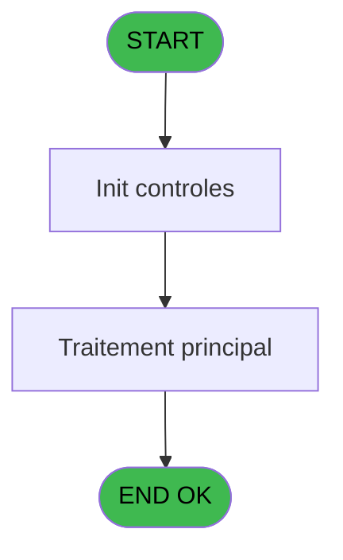
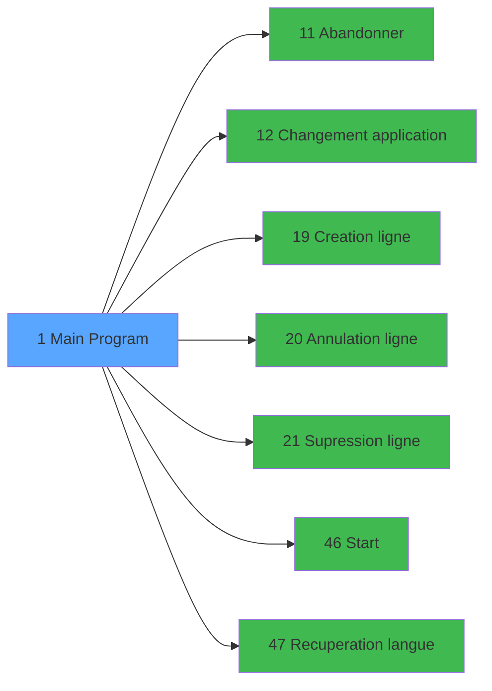

# PBS IDE 1 - Main Program

> **Analyse**: Phases 1-4 2026-02-03 16:58 -> 16:58 (18s) | Assemblage 16:58
> **Pipeline**: V7.2 Enrichi
> **Structure**: 4 onglets (Resume | Ecrans | Donnees | Connexions)

<!-- TAB:Resume -->

## 1. FICHE D'IDENTITE

| Attribut | Valeur |
|----------|--------|
| Projet | PBS |
| IDE Position | 1 |
| Nom Programme | Main Program |
| Fichier source | `Prg_1.xml` |
| Dossier IDE | General |
| Taches | 1 (1 ecrans visibles) |
| Tables modifiees | 0 |
| Programmes appeles | 7 |
| :warning: Statut | **ORPHELIN_POTENTIEL** |

## 2. DESCRIPTION FONCTIONNELLE

**Main Program** assure la gestion complete de ce processus.

Le flux de traitement s'organise en **1 blocs fonctionnels** :

- **Traitement** (1 tache) : traitements metier divers

## 3. BLOCS FONCTIONNELS

### 3.1 Traitement (1 tache)

Traitements internes.

---

#### 1 - Planning Setup [[ECRAN]](#ecran-t1)

**Role** : Traitement : Planning Setup.
**Ecran** : 320 x 200 DLU (Type11) | [Voir mockup](#ecran-t1)
**Delegue a** : [Abandonner (IDE 11)](PBS-IDE-11.md), [Changement application (IDE 12)](PBS-IDE-12.md), [  Annulation ligne (IDE 20)](PBS-IDE-20.md)

## 5. REGLES METIER

*(Aucune regle metier identifiee)*

## 6. CONTEXTE

- **Appele par**: (aucun)
- **Appelle**: 7 programmes | **Tables**: 0 (W:0 R:0 L:0) | **Taches**: 1 | **Expressions**: 33

<!-- TAB:Ecrans -->

## 8. ECRANS

### 8.1 Forms visibles (1 / 1)

| # | Position | Tache | Nom | Type | Largeur | Hauteur | Bloc |
|---|----------|-------|-----|------|---------|---------|------|
| 1 | 1 | 1 | Planning Setup | Type11 | 320 | 200 | Traitement |

### 8.2 Mockups Ecrans

## 9. NAVIGATION

Ecran unique: **Planning Setup**

### 9.3 Structure hierarchique (1 tache)

| Position | Tache | Type | Dimensions | Bloc |
|----------|-------|------|------------|------|
| **1.1** | [**Planning Setup** (1)](#t1) [mockup](#ecran-t1) | Type11 | 320x200 | Traitement |

### 9.4 Algorigramme

> **Legende**: Vert = START/END OK | Rouge = END KO | Bleu = Decisions
> *Algorigramme auto-genere. Utiliser `/algorigramme` pour une synthese metier detaillee.*

<!-- TAB:Donnees -->

## 10. TABLES

### Tables utilisees (0)

| ID | Nom | Description | Type | R | W | L | Usages |
|----|-----|-------------|------|---|---|---|--------|

### Colonnes par table (0 / 0 tables avec colonnes identifiees)

## 11. VARIABLES

### 11.1 Variables globales (28)

Variables globales partagees entre programmes.

| Lettre | Nom | Type | Usage dans |
|--------|-----|------|-----------|
| A | VG.LOGIN | Alpha | - |
| B | VG.USER | Alpha | - |
| C | VG.DRT ACCES TOUT | Logical | 1x variable globale |
| D | VG.FORFAIT SKI ? | Logical | - |
| E | VG.AFFECTATION CHAMBRE ? | Logical | - |
| F | VG.TABLEAU REMPLISSAGE ? | Logical | 1x variable globale |
| G | VG.Nb decimales | Numeric | - |
| H | VG.CALCUL EFFECTIF ? | Logical | 1x variable globale |
| I | VG.TAXE SEJOUR ? | Logical | - |
| J | VG.Date version | Alpha | 2x variable globale |
| K | VG.Version | Alpha | - |
| L | VG.Masque montant | Alpha | 2x variable globale |
| M | VG.LIT BEBE ACTIF ? | Logical | - |
| N | VG.CALCUL EFFECTIF 2.0 ACTIF ? | Logical | - |
| O | VG.IND SEJOUR ACTIF? | Logical | - |
| P | VG.SOCIETE | Alpha | - |
| Q | VG.LIEU SEJOUR DEFAUT | Alpha | - |
| R | VG.SEPARATEUR | Alpha | - |
| S | VG.PYR ACTIF ? | Logical | - |
| T | VG.Room ready ? | Logical | - |
| U | VG.Room ready Club Med API ? | Logical | - |
| V | VG.Room ready Fullsix désact. ? | Logical | - |
| W | VG.Etis housekeeping | Logical | 1x variable globale |
| X | VG.Fiche police Brésil | Logical | 1x variable globale |
| Y | VG.Transfert v2 | Logical | 1x variable globale |
| Z | VG.Fusion Liste Operations | Logical | - |
| BA | VG.Critére Logement additionnel | Logical | - |
| BB | VG Traitement bateau | Logical | - |

Toutes les 28 variables (liste complete)

| Cat | Lettre | Nom Variable | Type |
|-----|--------|--------------|------|
| VG | **A** | VG.LOGIN | Alpha |
| VG | **B** | VG.USER | Alpha |
| VG | **C** | VG.DRT ACCES TOUT | Logical |
| VG | **D** | VG.FORFAIT SKI ? | Logical |
| VG | **E** | VG.AFFECTATION CHAMBRE ? | Logical |
| VG | **F** | VG.TABLEAU REMPLISSAGE ? | Logical |
| VG | **G** | VG.Nb decimales | Numeric |
| VG | **H** | VG.CALCUL EFFECTIF ? | Logical |
| VG | **I** | VG.TAXE SEJOUR ? | Logical |
| VG | **J** | VG.Date version | Alpha |
| VG | **K** | VG.Version | Alpha |
| VG | **L** | VG.Masque montant | Alpha |
| VG | **M** | VG.LIT BEBE ACTIF ? | Logical |
| VG | **N** | VG.CALCUL EFFECTIF 2.0 ACTIF ? | Logical |
| VG | **O** | VG.IND SEJOUR ACTIF? | Logical |
| VG | **P** | VG.SOCIETE | Alpha |
| VG | **Q** | VG.LIEU SEJOUR DEFAUT | Alpha |
| VG | **R** | VG.SEPARATEUR | Alpha |
| VG | **S** | VG.PYR ACTIF ? | Logical |
| VG | **T** | VG.Room ready ? | Logical |
| VG | **U** | VG.Room ready Club Med API ? | Logical |
| VG | **V** | VG.Room ready Fullsix désact. ? | Logical |
| VG | **W** | VG.Etis housekeeping | Logical |
| VG | **X** | VG.Fiche police Brésil | Logical |
| VG | **Y** | VG.Transfert v2 | Logical |
| VG | **Z** | VG.Fusion Liste Operations | Logical |
| VG | **BA** | VG.Critére Logement additionnel | Logical |
| VG | **BB** | VG Traitement bateau | Logical |

## 12. EXPRESSIONS

**33 / 33 expressions decodees (100%)**

### 12.1 Repartition par type

| Type | Expressions | Regles |
|------|-------------|--------|
| CONCATENATION | 1 | 0 |
| CONSTANTE | 19 | 0 |
| CONDITION | 2 | 0 |
| CAST_LOGIQUE | 1 | 0 |
| OTHER | 10 | 0 |

### 12.2 Expressions cles par type

#### CONCATENATION (1 expressions)

| Type | IDE | Expression | Regle |
|------|-----|------------|-------|
| CONCATENATION | 23 | `'Planning Setup - V '&Trim(ExpCalc('16'EXP))&' - '&Trim(ExpCalc('15'EXP))` | - |

#### CONSTANTE (19 expressions)

| Type | IDE | Expression | Regle |
|------|-----|------------|-------|
| CONSTANTE | 16 | `'CAA'` | - |
| CONSTANTE | 18 | `'TAX'` | - |
| CONSTANTE | 14 | `'TRA'` | - |
| CONSTANTE | 15 | `'FLO'` | - |
| CONSTANTE | 21 | `'03/11/2025'` | - |
| ... | | *+14 autres* | |

#### CONDITION (2 expressions)

| Type | IDE | Expression | Regle |
|------|-----|------------|-------|
| CONDITION | 32 | `Translate ('%club_traitement_bateau%')='O'` | - |
| CONDITION | 1 | `RunMode ()<=2` | - |

#### CAST_LOGIQUE (1 expressions)

| Type | IDE | Expression | Regle |
|------|-----|------------|-------|
| CAST_LOGIQUE | 2 | `CallProg(ProgIdx('hasRight','TRUE'LOG),VG.DRT ACCES TOUT [C],'ACCESALL')` | - |

#### OTHER (10 expressions)

| Type | IDE | Expression | Regle |
|------|-----|------------|-------|
| OTHER | 29 | `MnuShow('API',VG.Etis housekeeping [W] OR VG.Fiche police Brésil [X] OR VG.Transfert v2 [Y])` | - |
| OTHER | 28 | `Translate('%club_excel_separator%')` | - |
| OTHER | 30 | `MnuShow('TRA',VG.Fusion Liste Operat... [Z])` | - |
| OTHER | 33 | `VG.Fusion Liste Operat... [Z]` | - |
| OTHER | 31 | `MnuShow('maj_ensemble',NOT([AB]))` | - |
| ... | | *+5 autres* | |

### 12.3 Toutes les expressions (33)

Voir les 33 expressions

#### CONCATENATION (1)

| IDE | Expression Decodee |
|-----|-------------------|
| 23 | `'Planning Setup - V '&Trim(ExpCalc('16'EXP))&' - '&Trim(ExpCalc('15'EXP))` |

#### CONSTANTE (19)

| IDE | Expression Decodee |
|-----|-------------------|
| 3 | `'SKI'` |
| 4 | `'1.00'` |
| 6 | `'PS'` |
| 7 | `'CHA'` |
| 8 | `'RMP'` |
| 9 | `'EFF'` |
| 10 | `'PYR'` |
| 11 | `'ROR'` |
| 12 | `'ETS'` |
| 13 | `'FDP'` |
| 14 | `'TRA'` |
| 15 | `'FLO'` |
| 16 | `'CAA'` |
| 18 | `'TAX'` |
| 21 | `'03/11/2025'` |
| 22 | `'3.15'` |
| 24 | `'BEB'` |
| 25 | `'2.00'` |
| 26 | `'3.00'` |

#### CONDITION (2)

| IDE | Expression Decodee |
|-----|-------------------|
| 1 | `RunMode ()<=2` |
| 32 | `Translate ('%club_traitement_bateau%')='O'` |

#### CAST_LOGIQUE (1)

| IDE | Expression Decodee |
|-----|-------------------|
| 2 | `CallProg(ProgIdx('hasRight','TRUE'LOG),VG.DRT ACCES TOUT [C],'ACCESALL')` |

#### OTHER (10)

| IDE | Expression Decodee |
|-----|-------------------|
| 5 | `MnuShow('TRAGE',VG.TABLEAU REMPLISSAGE ? [F])` |
| 17 | `MnuShow('REPQUA',VG.Date version [J])` |
| 19 | `MnuShow('PARAMTAX',VG.Masque montant [L])` |
| 20 | `MnuShow('PARAMSTAT',VG.Masque montant [L])` |
| 27 | `MnuShow('PLAFLIT',VG.CALCUL EFFECTIF ? [H] OR VG.Date version [J])` |
| 28 | `Translate('%club_excel_separator%')` |
| 29 | `MnuShow('API',VG.Etis housekeeping [W] OR VG.Fiche police Brésil [X] OR VG.Transfert v2 [Y])` |
| 30 | `MnuShow('TRA',VG.Fusion Liste Operat... [Z])` |
| 31 | `MnuShow('maj_ensemble',NOT([AB]))` |
| 33 | `VG.Fusion Liste Operat... [Z]` |

<!-- TAB:Connexions -->

## 13. GRAPHE D'APPELS

### 13.1 Chaine depuis Main (Callers)

**Chemin**: (pas de callers directs)

### 13.2 Callers

| IDE | Nom Programme | Nb Appels |
|-----|---------------|-----------|
| - | (aucun) | - |

### 13.3 Callees (programmes appeles)

### 13.4 Detail Callees avec contexte

| IDE | Nom Programme | Appels | Contexte |
|-----|---------------|--------|----------|
| [11](PBS-IDE-11.md) | Abandonner | 1 | Sous-programme |
| [12](PBS-IDE-12.md) | Changement application | 1 | Sous-programme |
| [19](PBS-IDE-19.md) |   Creation ligne | 1 | Sous-programme |
| [20](PBS-IDE-20.md) |   Annulation ligne | 1 | Sous-programme |
| [21](PBS-IDE-21.md) |   Supression ligne | 1 | Sous-programme |
| [46](PBS-IDE-46.md) | Start | 1 | Sous-programme |
| [47](PBS-IDE-47.md) |   Recuperation langue | 1 | Recuperation donnees |

## 14. RECOMMANDATIONS MIGRATION

### 14.1 Profil du programme

| Metrique | Valeur | Impact migration |
|----------|--------|-----------------|
| Lignes de logique | 70 | Programme compact |
| Expressions | 33 | Peu de logique |
| Tables WRITE | 0 | Impact faible |
| Sous-programmes | 7 | Dependances moderees |
| Ecrans visibles | 1 | Ecran unique ou traitement batch |
| Code desactive | 0% (0 / 70) | Code sain |
| Regles metier | 0 | Pas de regle identifiee |

### 14.2 Plan de migration par bloc

#### Traitement (1 tache: 1 ecran, 0 traitement)

- **Strategie** : 1 composant(s) UI (Razor/React) avec formulaires et validation.
- 7 sous-programme(s) a migrer ou a reutiliser depuis les services existants.
- Decomposer les taches en services unitaires testables.

### 14.3 Dependances critiques

| Dependance | Type | Appels | Impact |
|------------|------|--------|--------|
| [  Supression ligne (IDE 21)](PBS-IDE-21.md) | Sous-programme | 1x | Normale - Sous-programme |
| [Start (IDE 46)](PBS-IDE-46.md) | Sous-programme | 1x | Normale - Sous-programme |
| [  Recuperation langue (IDE 47)](PBS-IDE-47.md) | Sous-programme | 1x | Normale - Recuperation donnees |
| [  Annulation ligne (IDE 20)](PBS-IDE-20.md) | Sous-programme | 1x | Normale - Sous-programme |
| [Abandonner (IDE 11)](PBS-IDE-11.md) | Sous-programme | 1x | Normale - Sous-programme |
| [Changement application (IDE 12)](PBS-IDE-12.md) | Sous-programme | 1x | Normale - Sous-programme |
| [  Creation ligne (IDE 19)](PBS-IDE-19.md) | Sous-programme | 1x | Normale - Sous-programme |

---
*Spec DETAILED generee par Pipeline V7.2 - 2026-02-03 16:58*
