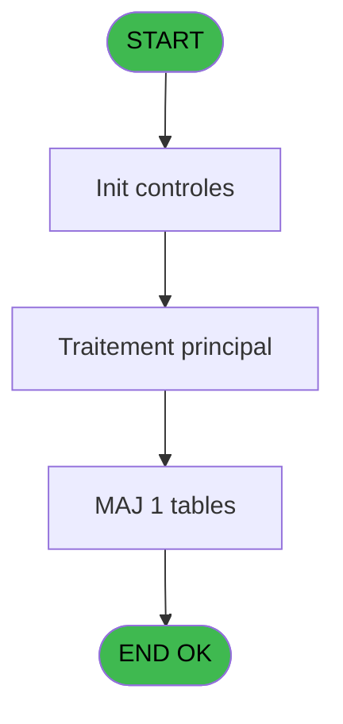
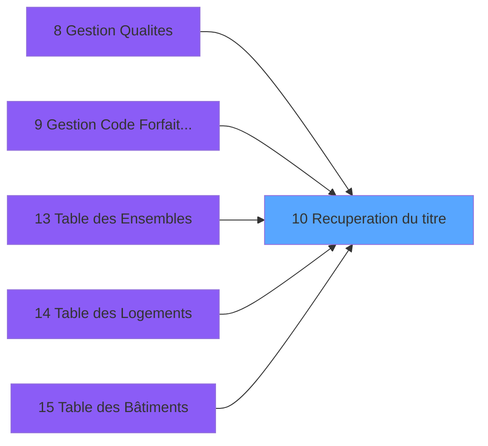

# PBS IDE 10 - Recuperation du titre

> **Analyse**: Phases 1-4 2026-02-03 17:02 -> 17:02 (15s) | Assemblage 17:02
> **Pipeline**: V7.2 Enrichi
> **Structure**: 4 onglets (Resume | Ecrans | Donnees | Connexions)

<!-- TAB:Resume -->

## 1. FICHE D'IDENTITE

| Attribut | Valeur |
|----------|--------|
| Projet | PBS |
| IDE Position | 10 |
| Nom Programme | Recuperation du titre |
| Fichier source | `Prg_10.xml` |
| Dossier IDE | Divers |
| Taches | 1 (0 ecrans visibles) |
| Tables modifiees | 1 |
| Programmes appeles | 0 |

## 2. DESCRIPTION FONCTIONNELLE

**Recuperation du titre** assure la gestion complete de ce processus, accessible depuis [Logement client (IDE 22)](PBS-IDE-22.md), [Logement client pms-626 evo (IDE 23)](PBS-IDE-23.md), [Logement personnel (IDE 34)](PBS-IDE-34.md), [Logement exterieur (IDE 38)](PBS-IDE-38.md), [Logement client pms-626 (IDE 99)](PBS-IDE-99.md), [Gestion Qualites (IDE 8)](PBS-IDE-8.md), [Gestion Code Forfait TAI (IDE 9)](PBS-IDE-9.md), [Table des Ensembles (IDE 13)](PBS-IDE-13.md), [Table des Logements (IDE 14)](PBS-IDE-14.md), [Table des Bâtiments (IDE 15)](PBS-IDE-15.md), [Table des Vues (IDE 16)](PBS-IDE-16.md), [Table des Equipements (IDE 17)](PBS-IDE-17.md), [ Duplication Logement Client (IDE 29)](PBS-IDE-29.md), [ Duplication Logement Perso (IDE 35)](PBS-IDE-35.md), [Duplication Logement Exterieur (IDE 39)](PBS-IDE-39.md), [Gestion Qualites (IDE 45)](PBS-IDE-45.md), [Gestion des Imports ########## (IDE 61)](PBS-IDE-61.md), [  Zoom Codes Import (IDE 62)](PBS-IDE-62.md), [Gestion Code Prestation (IDE 64)](PBS-IDE-64.md), [Gestion Code Prestat° PMS-623 (IDE 65)](PBS-IDE-65.md).

Le flux de traitement s'organise en **1 blocs fonctionnels** :

- **Traitement** (1 tache) : traitements metier divers

**Donnees modifiees** : 1 tables en ecriture (arc_transac_detail_bar).

## 3. BLOCS FONCTIONNELS

### 3.1 Traitement (1 tache)

Traitements internes.

---

#### 10 - Recuperation du titre

**Role** : Consultation/chargement : Recuperation du titre.

## 5. REGLES METIER

*(Aucune regle metier identifiee)*

## 6. CONTEXTE

- **Appele par**: [Logement client (IDE 22)](PBS-IDE-22.md), [Logement client pms-626 evo (IDE 23)](PBS-IDE-23.md), [Logement personnel (IDE 34)](PBS-IDE-34.md), [Logement exterieur (IDE 38)](PBS-IDE-38.md), [Logement client pms-626 (IDE 99)](PBS-IDE-99.md), [Gestion Qualites (IDE 8)](PBS-IDE-8.md), [Gestion Code Forfait TAI (IDE 9)](PBS-IDE-9.md), [Table des Ensembles (IDE 13)](PBS-IDE-13.md), [Table des Logements (IDE 14)](PBS-IDE-14.md), [Table des Bâtiments (IDE 15)](PBS-IDE-15.md), [Table des Vues (IDE 16)](PBS-IDE-16.md), [Table des Equipements (IDE 17)](PBS-IDE-17.md), [ Duplication Logement Client (IDE 29)](PBS-IDE-29.md), [ Duplication Logement Perso (IDE 35)](PBS-IDE-35.md), [Duplication Logement Exterieur (IDE 39)](PBS-IDE-39.md), [Gestion Qualites (IDE 45)](PBS-IDE-45.md), [Gestion des Imports ########## (IDE 61)](PBS-IDE-61.md), [  Zoom Codes Import (IDE 62)](PBS-IDE-62.md), [Gestion Code Prestation (IDE 64)](PBS-IDE-64.md), [Gestion Code Prestat° PMS-623 (IDE 65)](PBS-IDE-65.md)
- **Appelle**: 0 programmes | **Tables**: 1 (W:1 R:0 L:0) | **Taches**: 1 | **Expressions**: 4

<!-- TAB:Ecrans -->

## 8. ECRANS

*(Programme sans ecran visible)*

## 9. NAVIGATION

### 9.3 Structure hierarchique (1 tache)

| Position | Tache | Type | Dimensions | Bloc |
|----------|-------|------|------------|------|
| **10.1** | [**Recuperation du titre** (10)](#t1) | MDI | - | Traitement |

### 9.4 Algorigramme

> **Legende**: Vert = START/END OK | Rouge = END KO | Bleu = Decisions
> *Algorigramme auto-genere. Utiliser `/algorigramme` pour une synthese metier detaillee.*

<!-- TAB:Donnees -->

## 10. TABLES

### Tables utilisees (1)

| ID | Nom | Description | Type | R | W | L | Usages |
|----|-----|-------------|------|---|---|---|--------|
| 719 | arc_transac_detail_bar |  | DB |   | **W** |   | 1 |

### Colonnes par table (1 / 1 tables avec colonnes identifiees)

Table 719 - arc_transac_detail_bar (**W**) - 1 usages

| Lettre | Variable | Acces | Type |
|--------|----------|-------|------|
| A | > code ecran | W | Numeric |
| B | < nom ecran | W | Alpha |

## 11. VARIABLES

### 11.1 Autres (2)

Variables diverses.

| Lettre | Nom | Type | Usage dans |
|--------|-----|------|-----------|
| A | > code ecran | Numeric | 1x refs |
| B | < nom ecran | Alpha | - |

## 12. EXPRESSIONS

**4 / 4 expressions decodees (100%)**

### 12.1 Repartition par type

| Type | Expressions | Regles |
|------|-------------|--------|
| CONCATENATION | 1 | 0 |
| CONSTANTE | 1 | 0 |
| OTHER | 1 | 0 |
| CONDITION | 1 | 0 |

### 12.2 Expressions cles par type

#### CONCATENATION (1 expressions)

| Type | IDE | Expression | Regle |
|------|-----|------------|-------|
| CONCATENATION | 4 | `Trim ([F])&' - '&Trim ([G])` | - |

#### CONSTANTE (1 expressions)

| Type | IDE | Expression | Regle |
|------|-----|------------|-------|
| CONSTANTE | 3 | `'PS'` | - |

#### OTHER (1 expressions)

| Type | IDE | Expression | Regle |
|------|-----|------------|-------|
| OTHER | 1 | `GetParam ('CODELANGUE')` | - |

#### CONDITION (1 expressions)

| Type | IDE | Expression | Regle |
|------|-----|------------|-------|
| CONDITION | 2 | `> code ecran [A]` | - |

<!-- TAB:Connexions -->

## 13. GRAPHE D'APPELS

### 13.1 Chaine depuis Main (Callers)

Main -> ... -> [Logement client (IDE 22)](PBS-IDE-22.md) -> **Recuperation du titre (IDE 10)**

Main -> ... -> [Logement client pms-626 evo (IDE 23)](PBS-IDE-23.md) -> **Recuperation du titre (IDE 10)**

Main -> ... -> [Logement personnel (IDE 34)](PBS-IDE-34.md) -> **Recuperation du titre (IDE 10)**

Main -> ... -> [Logement exterieur (IDE 38)](PBS-IDE-38.md) -> **Recuperation du titre (IDE 10)**

Main -> ... -> [Logement client pms-626 (IDE 99)](PBS-IDE-99.md) -> **Recuperation du titre (IDE 10)**

Main -> ... -> [Gestion Qualites (IDE 8)](PBS-IDE-8.md) -> **Recuperation du titre (IDE 10)**

Main -> ... -> [Gestion Code Forfait TAI (IDE 9)](PBS-IDE-9.md) -> **Recuperation du titre (IDE 10)**

Main -> ... -> [Table des Ensembles (IDE 13)](PBS-IDE-13.md) -> **Recuperation du titre (IDE 10)**

Main -> ... -> [Table des Logements (IDE 14)](PBS-IDE-14.md) -> **Recuperation du titre (IDE 10)**

Main -> ... -> [Table des Bâtiments (IDE 15)](PBS-IDE-15.md) -> **Recuperation du titre (IDE 10)**

Main -> ... -> [Table des Vues (IDE 16)](PBS-IDE-16.md) -> **Recuperation du titre (IDE 10)**

Main -> ... -> [Table des Equipements (IDE 17)](PBS-IDE-17.md) -> **Recuperation du titre (IDE 10)**

Main -> ... -> [ Duplication Logement Client (IDE 29)](PBS-IDE-29.md) -> **Recuperation du titre (IDE 10)**

Main -> ... -> [ Duplication Logement Perso (IDE 35)](PBS-IDE-35.md) -> **Recuperation du titre (IDE 10)**

Main -> ... -> [Duplication Logement Exterieur (IDE 39)](PBS-IDE-39.md) -> **Recuperation du titre (IDE 10)**

Main -> ... -> [Gestion Qualites (IDE 45)](PBS-IDE-45.md) -> **Recuperation du titre (IDE 10)**

Main -> ... -> [Gestion des Imports ########## (IDE 61)](PBS-IDE-61.md) -> **Recuperation du titre (IDE 10)**

Main -> ... -> [  Zoom Codes Import (IDE 62)](PBS-IDE-62.md) -> **Recuperation du titre (IDE 10)**

Main -> ... -> [Gestion Code Prestation (IDE 64)](PBS-IDE-64.md) -> **Recuperation du titre (IDE 10)**

Main -> ... -> [Gestion Code Prestat° PMS-623 (IDE 65)](PBS-IDE-65.md) -> **Recuperation du titre (IDE 10)**

### 13.2 Callers

| IDE | Nom Programme | Nb Appels |
|-----|---------------|-----------|
| [22](PBS-IDE-22.md) | Logement client | 2 |
| [23](PBS-IDE-23.md) | Logement client pms-626 evo | 2 |
| [34](PBS-IDE-34.md) | Logement personnel | 2 |
| [38](PBS-IDE-38.md) | Logement exterieur | 2 |
| [99](PBS-IDE-99.md) | Logement client pms-626 | 2 |
| [8](PBS-IDE-8.md) | Gestion Qualites | 1 |
| [9](PBS-IDE-9.md) | Gestion Code Forfait TAI | 1 |
| [13](PBS-IDE-13.md) | Table des Ensembles | 1 |
| [14](PBS-IDE-14.md) | Table des Logements | 1 |
| [15](PBS-IDE-15.md) | Table des Bâtiments | 1 |
| [16](PBS-IDE-16.md) | Table des Vues | 1 |
| [17](PBS-IDE-17.md) | Table des Equipements | 1 |
| [29](PBS-IDE-29.md) |  Duplication Logement Client | 1 |
| [35](PBS-IDE-35.md) |  Duplication Logement Perso | 1 |
| [39](PBS-IDE-39.md) | Duplication Logement Exterieur | 1 |
| [45](PBS-IDE-45.md) | Gestion Qualites | 1 |
| [61](PBS-IDE-61.md) | Gestion des Imports ########## | 1 |
| [62](PBS-IDE-62.md) |   Zoom Codes Import | 1 |
| [64](PBS-IDE-64.md) | Gestion Code Prestation | 1 |
| [65](PBS-IDE-65.md) | Gestion Code Prestat° PMS-623 | 1 |

### 13.3 Callees (programmes appeles)

### 13.4 Detail Callees avec contexte

| IDE | Nom Programme | Appels | Contexte |
|-----|---------------|--------|----------|
| - | (aucun) | - | - |

## 14. RECOMMANDATIONS MIGRATION

### 14.1 Profil du programme

| Metrique | Valeur | Impact migration |
|----------|--------|-----------------|
| Lignes de logique | 12 | Programme compact |
| Expressions | 4 | Peu de logique |
| Tables WRITE | 1 | Impact faible |
| Sous-programmes | 0 | Peu de dependances |
| Ecrans visibles | 0 | Ecran unique ou traitement batch |
| Code desactive | 0% (0 / 12) | Code sain |
| Regles metier | 0 | Pas de regle identifiee |

### 14.2 Plan de migration par bloc

#### Traitement (1 tache: 0 ecran, 1 traitement)

- **Strategie** : 1 service(s) backend injectable(s) (Domain Services).
- Decomposer les taches en services unitaires testables.

### 14.3 Dependances critiques

| Dependance | Type | Appels | Impact |
|------------|------|--------|--------|
| arc_transac_detail_bar | Table WRITE (Database) | 1x | Schema + repository |

---
*Spec DETAILED generee par Pipeline V7.2 - 2026-02-03 17:02*
