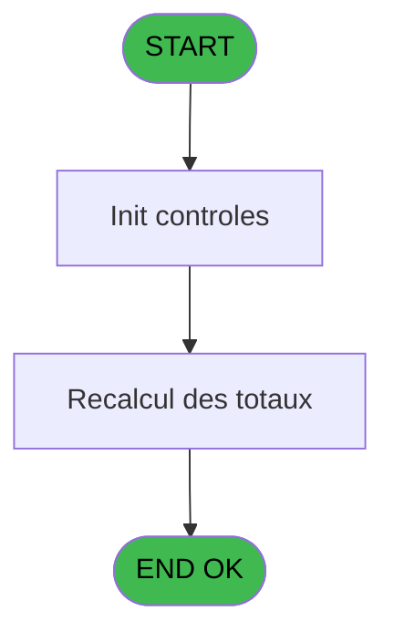
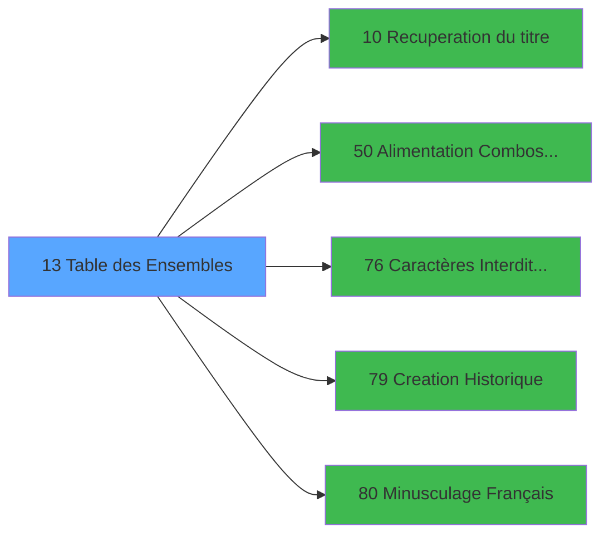

# PBS IDE 13 - Table des Ensembles

> **Analyse**: Phases 1-4 2026-02-03 17:03 -> 17:04 (16s) | Assemblage 17:04
> **Pipeline**: V7.2 Enrichi
> **Structure**: 4 onglets (Resume | Ecrans | Donnees | Connexions)

<!-- TAB:Resume -->

## 1. FICHE D'IDENTITE

| Attribut | Valeur |
|----------|--------|
| Projet | PBS |
| IDE Position | 13 |
| Nom Programme | Table des Ensembles |
| Fichier source | `Prg_13.xml` |
| Dossier IDE | Gestion |
| Taches | 3 (1 ecrans visibles) |
| Tables modifiees | 0 |
| Programmes appeles | 5 |
| :warning: Statut | **ORPHELIN_POTENTIEL** |

## 2. DESCRIPTION FONCTIONNELLE

**Table des Ensembles** assure la gestion complete de ce processus.

Le flux de traitement s'organise en **2 blocs fonctionnels** :

- **Traitement** (2 taches) : traitements metier divers
- **Calcul** (1 tache) : calculs de montants, stocks ou compteurs

**Logique metier** : 1 regles identifiees couvrant conditions metier.

Detail : phases du traitement

#### Phase 1 : Traitement (2 taches)

- **13** - Êcran **[[ECRAN]](#ecran-t1)**
- **13.1** - Mise à Jour Combo

Delegue a : [Recuperation du titre (IDE 10)](PBS-IDE-10.md), [  Alimentation Combos VILLAGE (IDE 50)](PBS-IDE-50.md), [Caractères Interdits (A6) (IDE 76)](PBS-IDE-76.md), [Minusculage Français (IDE 80)](PBS-IDE-80.md)

#### Phase 2 : Calcul (1 tache)

- **13.2** - Recalcul des totaux

## 3. BLOCS FONCTIONNELS

### 3.1 Traitement (2 taches)

Traitements internes.

---

#### 13 - Êcran [[ECRAN]](#ecran-t1)

**Role** : Traitement : Êcran.
**Ecran** : 893 x 260 DLU (MDI) | [Voir mockup](#ecran-t1)
**Delegue a** : [Recuperation du titre (IDE 10)](PBS-IDE-10.md), [  Alimentation Combos VILLAGE (IDE 50)](PBS-IDE-50.md), [Caractères Interdits (A6) (IDE 76)](PBS-IDE-76.md)

---

#### 13.1 - Mise à Jour Combo

**Role** : Traitement : Mise à Jour Combo.
**Variables liees** : D (v.MaJ Combo)
**Delegue a** : [Recuperation du titre (IDE 10)](PBS-IDE-10.md), [  Alimentation Combos VILLAGE (IDE 50)](PBS-IDE-50.md), [Caractères Interdits (A6) (IDE 76)](PBS-IDE-76.md)

### 3.2 Calcul (1 tache)

Calculs metier : montants, stocks, compteurs.

---

#### 13.2 - Recalcul des totaux

**Role** : Calcul : Recalcul des totaux.

## 5. REGLES METIER

1 regles identifiees:

### Autres (1 regles)

#### [RM-001] Si Stat (0 alors 'C'MODE) sinon 'CENS',IF (Stat (0,'M'MODE),'MENS','AENS'))

| Element | Detail |
|---------|--------|
| **Condition** | `Stat (0` |
| **Si vrai** | 'C'MODE) |
| **Si faux** | 'CENS',IF (Stat (0,'M'MODE),'MENS','AENS')) |
| **Expression source** | Expression 2 : `IF (Stat (0,'C'MODE),'CENS',IF (Stat (0,'M'MODE),'MENS','AEN` |
| **Exemple** | Si Stat (0 → 'C'MODE). Sinon → 'CENS',IF (Stat (0,'M'MODE),'MENS','AENS')) |

## 6. CONTEXTE

- **Appele par**: (aucun)
- **Appelle**: 5 programmes | **Tables**: 2 (W:0 R:1 L:1) | **Taches**: 3 | **Expressions**: 25

<!-- TAB:Ecrans -->

## 8. ECRANS

### 8.1 Forms visibles (1 / 3)

| # | Position | Tache | Nom | Type | Largeur | Hauteur | Bloc |
|---|----------|-------|-----|------|---------|---------|------|
| 1 | 13 | 13 | Êcran | MDI | 893 | 260 | Traitement |

### 8.2 Mockups Ecrans

---

#### 13 - Êcran
**Tache** : [13](#t1) | **Type** : MDI | **Dimensions** : 893 x 260 DLU
**Bloc** : Traitement | **Titre IDE** : Êcran

<!-- FORM-DATA:
{
    "width":  893,
    "vFactor":  8,
    "type":  "MDI",
    "hFactor":  8,
    "controls":  [
                     {
                         "x":  0,
                         "type":  "label",
                         "var":  "",
                         "y":  1,
                         "w":  889,
                         "fmt":  "",
                         "name":  "",
                         "h":  20,
                         "color":  "",
                         "text":  "",
                         "parent":  null
                     },
                     {
                         "x":  15,
                         "type":  "table",
                         "var":  "",
                         "name":  "",
                         "titleH":  12,
                         "color":  "110",
                         "w":  683,
                         "y":  34,
                         "fmt":  "",
                         "parent":  null,
                         "text":  "",
                         "rowH":  13,
                         "h":  185,
                         "cols":  [
                                      {
                                          "title":  "Code",
                                          "layer":  1,
                                          "w":  109
                                      },
                                      {
                                          "title":  "Libellé",
                                          "layer":  2,
                                          "w":  270
                                      },
                                      {
                                          "title":  "Chambres GM",
                                          "layer":  3,
                                          "w":  143
                                      },
                                      {
                                          "title":  "Chambres GO",
                                          "layer":  4,
                                          "w":  123
                                      }
                                  ],
                         "rows":  4
                     },
                     {
                         "x":  707,
                         "type":  "label",
                         "var":  "",
                         "y":  107,
                         "w":  181,
                         "fmt":  "",
                         "name":  "",
                         "h":  113,
                         "color":  "",
                         "text":  "",
                         "parent":  null
                     },
                     {
                         "x":  1,
                         "type":  "label",
                         "var":  "",
                         "y":  233,
                         "w":  889,
                         "fmt":  "",
                         "name":  "",
                         "h":  24,
                         "color":  "",
                         "text":  "",
                         "parent":  null
                     },
                     {
                         "x":  68,
                         "type":  "edit",
                         "var":  "",
                         "y":  48,
                         "w":  42,
                         "fmt":  "U3",
                         "name":  "CODE ALPHA6",
                         "h":  8,
                         "color":  "110",
                         "text":  "",
                         "parent":  5
                     },
                     {
                         "x":  141,
                         "type":  "edit",
                         "var":  "",
                         "y":  48,
                         "w":  232,
                         "fmt":  "",
                         "name":  "LIBELLE VINGT",
                         "h":  8,
                         "color":  "110",
                         "text":  "",
                         "parent":  5
                     },
                     {
                         "x":  409,
                         "type":  "edit",
                         "var":  "",
                         "y":  48,
                         "w":  64,
                         "fmt":  "",
                         "name":  "",
                         "h":  8,
                         "color":  "110",
                         "text":  "",
                         "parent":  5
                     },
                     {
                         "x":  6,
                         "type":  "edit",
                         "var":  "",
                         "y":  7,
                         "w":  396,
                         "fmt":  "30",
                         "name":  "",
                         "h":  8,
                         "color":  "",
                         "text":  "",
                         "parent":  1
                     },
                     {
                         "x":  672,
                         "type":  "edit",
                         "var":  "",
                         "y":  7,
                         "w":  203,
                         "fmt":  "WWW DD MMM YYYYT",
                         "name":  "",
                         "h":  8,
                         "color":  "",
                         "text":  "",
                         "parent":  1
                     },
                     {
                         "x":  725,
                         "type":  "image",
                         "var":  "",
                         "y":  32,
                         "w":  154,
                         "fmt":  "",
                         "name":  "",
                         "h":  69,
                         "color":  "",
                         "text":  "",
                         "parent":  null
                     },
                     {
                         "x":  721,
                         "type":  "button",
                         "var":  "",
                         "y":  113,
                         "w":  154,
                         "fmt":  "\u0026Visualisation",
                         "name":  "",
                         "h":  18,
                         "color":  "",
                         "text":  "",
                         "parent":  null
                     },
                     {
                         "x":  721,
                         "type":  "button",
                         "var":  "",
                         "y":  134,
                         "w":  154,
                         "fmt":  "\u0026Modification",
                         "name":  "",
                         "h":  18,
                         "color":  "",
                         "text":  "",
                         "parent":  null
                     },
                     {
                         "x":  721,
                         "type":  "button",
                         "var":  "",
                         "y":  155,
                         "w":  154,
                         "fmt":  "\u0026Creation",
                         "name":  "Création",
                         "h":  18,
                         "color":  "",
                         "text":  "",
                         "parent":  null
                     },
                     {
                         "x":  721,
                         "type":  "button",
                         "var":  "",
                         "y":  176,
                         "w":  154,
                         "fmt":  "\u0026Annulation",
                         "name":  "",
                         "h":  18,
                         "color":  "",
                         "text":  "",
                         "parent":  null
                     },
                     {
                         "x":  721,
                         "type":  "button",
                         "var":  "",
                         "y":  197,
                         "w":  154,
                         "fmt":  "\u0026Suppression",
                         "name":  "",
                         "h":  18,
                         "color":  "",
                         "text":  "",
                         "parent":  null
                     },
                     {
                         "x":  7,
                         "type":  "button",
                         "var":  "",
                         "y":  236,
                         "w":  154,
                         "fmt":  "\u0026Quitter",
                         "name":  "",
                         "h":  18,
                         "color":  "",
                         "text":  "",
                         "parent":  14
                     },
                     {
                         "x":  543,
                         "type":  "edit",
                         "var":  "",
                         "y":  48,
                         "w":  54,
                         "fmt":  "",
                         "name":  "v.NbrChambresGO",
                         "h":  8,
                         "color":  "110",
                         "text":  "",
                         "parent":  5
                     }
                 ],
    "taskId":  "13",
    "height":  260
}
-->

<strong>Champs : 6 champs</strong>

| Pos (x,y) | Nom | Variable | Type |
|-----------|-----|----------|------|
| 68,48 | CODE ALPHA6 | - | edit |
| 141,48 | LIBELLE VINGT | - | edit |
| 409,48 | (sans nom) | - | edit |
| 6,7 | 30 | - | edit |
| 672,7 | WWW DD MMM YYYYT | - | edit |
| 543,48 | v.NbrChambresGO | - | edit |

<strong>Boutons : 6 boutons</strong>

| Bouton | Pos (x,y) | Action |
|--------|-----------|--------|
| Visualisation | 721,113 | Bouton fonctionnel |
| Modification | 721,134 | Modifie l'element |
| Creation | 721,155 | Appel [Creation Historique (IDE 79)](PBS-IDE-79.md) |
| Annulation | 721,176 | Annule et retour au menu |
| Suppression | 721,197 | Supprime l'element selectionne |
| Quitter | 7,236 | Quitte le programme |

## 9. NAVIGATION

Ecran unique: **Êcran**

### 9.3 Structure hierarchique (3 taches)

| Position | Tache | Type | Dimensions | Bloc |
|----------|-------|------|------------|------|
| **13.1** | [**Êcran** (13)](#t1) [mockup](#ecran-t1) | MDI | 893x260 | Traitement |
| 13.1.1 | [Mise à Jour Combo (13.1)](#t2) | MDI | - | |
| **13.2** | [**Recalcul des totaux** (13.2)](#t3) | MDI | - | Calcul |

### 9.4 Algorigramme

> **Legende**: Vert = START/END OK | Rouge = END KO | Bleu = Decisions
> *Algorigramme auto-genere. Utiliser `/algorigramme` pour une synthese metier detaillee.*

<!-- TAB:Donnees -->

## 10. TABLES

### Tables utilisees (2)

| ID | Nom | Description | Type | R | W | L | Usages |
|----|-----|-------------|------|---|---|---|--------|
| 102 | logement_go______lop |  | DB | R |   |   | 1 |
| 113 | tables_village |  | DB |   |   | L | 1 |

### Colonnes par table (1 / 1 tables avec colonnes identifiees)

Table 102 - logement_go______lop (R) - 1 usages

| Lettre | Variable | Acces | Type |
|--------|----------|-------|------|
| A | v. titre | R | Alpha |
| B | v. code | R | Alpha |
| C | v.contrôle | R | Logical |
| D | v.MaJ Combo | R | Logical |
| E | v.Code Affecte Chambre GO | R | Logical |
| F | v.NbrChambresGM | R | Numeric |
| G | v.NbrChambresGO | R | Numeric |

## 11. VARIABLES

### 11.1 Variables de session (7)

Variables persistantes pendant toute la session.

| Lettre | Nom | Type | Usage dans |
|--------|-----|------|-----------|
| A | v. titre | Alpha | 1x session |
| B | v. code | Alpha | - |
| C | v.contrôle | Logical | 1x session |
| D | v.MaJ Combo | Logical | [13.1](#t2) |
| E | v.Code Affecte Chambre GO | Logical | 1x session |
| F | v.NbrChambresGM | Numeric | 2x session |
| G | v.NbrChambresGO | Numeric | - |

## 12. EXPRESSIONS

**25 / 25 expressions decodees (100%)**

### 12.1 Repartition par type

| Type | Expressions | Regles |
|------|-------------|--------|
| CALCULATION | 2 | 0 |
| CONDITION | 4 | 5 |
| CONSTANTE | 3 | 0 |
| DATE | 2 | 0 |
| NEGATION | 3 | 0 |
| OTHER | 7 | 0 |
| REFERENCE_VG | 2 | 0 |
| CAST_LOGIQUE | 1 | 0 |
| STRING | 1 | 0 |

### 12.2 Expressions cles par type

#### CALCULATION (2 expressions)

| Type | IDE | Expression | Regle |
|------|-----|------------|-------|
| CALCULATION | 25 | `CallProg('{207,-1}'PROG,v.NbrChambresGM [F],'lop_ensemble',Trim([I]))` | - |
| CALCULATION | 24 | `CallProg('{206,-1}'PROG,v.NbrChambresGM [F],'loc_ensemble',Trim([I]))` | - |

#### CONDITION (4 expressions)

| Type | IDE | Expression | Regle |
|------|-----|------------|-------|
| CONDITION | 2 | `IF (Stat (0,'C'MODE),'CENS',IF (Stat (0,'M'MODE),'MENS','AENS'))` | [RM-001](#rm-RM-001) |
| CONDITION | 20 | `[J]=''` | - |
| CONDITION | 19 | `[J]<>''` | - |
| CONDITION | 13 | `Stat (0,'M'MODE) AND [K]=0 AND NOT (v.Code Affecte Chambre GO [E])` | - |

#### CONSTANTE (3 expressions)

| Type | IDE | Expression | Regle |
|------|-----|------------|-------|
| CONSTANTE | 11 | `1` | - |
| CONSTANTE | 7 | `'F'` | - |
| CONSTANTE | 6 | `'VENSE'` | - |

#### DATE (2 expressions)

| Type | IDE | Expression | Regle |
|------|-----|------------|-------|
| DATE | 17 | `Date ()` | - |
| DATE | 9 | `Date ()` | - |

#### NEGATION (3 expressions)

| Type | IDE | Expression | Regle |
|------|-----|------------|-------|
| NEGATION | 15 | `NOT (Stat (0,'E'MODE))` | - |
| NEGATION | 3 | `NOT (v.contrôle [C])` | - |
| NEGATION | 1 | `NOT (Stat (0,'E'MODE))` | - |

#### OTHER (7 expressions)

| Type | IDE | Expression | Regle |
|------|-----|------------|-------|
| OTHER | 18 | `Time ()` | - |
| OTHER | 22 | `v.MaJ Combo [D]` | - |
| OTHER | 23 | `Left ([I],3)` | - |
| OTHER | 14 | `Stat (0,'E'MODE)` | - |
| OTHER | 4 | `Stat (0,'C'MODE)` | - |
| ... | | *+2 autres* | |

#### REFERENCE_VG (2 expressions)

| Type | IDE | Expression | Regle |
|------|-----|------------|-------|
| REFERENCE_VG | 16 | `VG3` | - |
| REFERENCE_VG | 10 | `VG3` | - |

#### CAST_LOGIQUE (1 expressions)

| Type | IDE | Expression | Regle |
|------|-----|------------|-------|
| CAST_LOGIQUE | 21 | `'TRUE'LOG` | - |

#### STRING (1 expressions)

| Type | IDE | Expression | Regle |
|------|-----|------------|-------|
| STRING | 8 | `Trim (v. titre [A])` | - |

### 12.3 Toutes les expressions (25)

Voir les 25 expressions

#### CALCULATION (2)

| IDE | Expression Decodee |
|-----|-------------------|
| 24 | `CallProg('{206,-1}'PROG,v.NbrChambresGM [F],'loc_ensemble',Trim([I]))` |
| 25 | `CallProg('{207,-1}'PROG,v.NbrChambresGM [F],'lop_ensemble',Trim([I]))` |

#### CONDITION (4)

| IDE | Expression Decodee |
|-----|-------------------|
| 2 | `IF (Stat (0,'C'MODE),'CENS',IF (Stat (0,'M'MODE),'MENS','AENS'))` |
| 13 | `Stat (0,'M'MODE) AND [K]=0 AND NOT (v.Code Affecte Chambre GO [E])` |
| 19 | `[J]<>''` |
| 20 | `[J]=''` |

#### CONSTANTE (3)

| IDE | Expression Decodee |
|-----|-------------------|
| 6 | `'VENSE'` |
| 7 | `'F'` |
| 11 | `1` |

#### DATE (2)

| IDE | Expression Decodee |
|-----|-------------------|
| 9 | `Date ()` |
| 17 | `Date ()` |

#### NEGATION (3)

| IDE | Expression Decodee |
|-----|-------------------|
| 1 | `NOT (Stat (0,'E'MODE))` |
| 3 | `NOT (v.contrôle [C])` |
| 15 | `NOT (Stat (0,'E'MODE))` |

#### OTHER (7)

| IDE | Expression Decodee |
|-----|-------------------|
| 4 | `Stat (0,'C'MODE)` |
| 5 | `GetParam ('SOCIETE')` |
| 12 | `Stat (0,'M'MODE)` |
| 14 | `Stat (0,'E'MODE)` |
| 18 | `Time ()` |
| 22 | `v.MaJ Combo [D]` |
| 23 | `Left ([I],3)` |

#### REFERENCE_VG (2)

| IDE | Expression Decodee |
|-----|-------------------|
| 10 | `VG3` |
| 16 | `VG3` |

#### CAST_LOGIQUE (1)

| IDE | Expression Decodee |
|-----|-------------------|
| 21 | `'TRUE'LOG` |

#### STRING (1)

| IDE | Expression Decodee |
|-----|-------------------|
| 8 | `Trim (v. titre [A])` |

<!-- TAB:Connexions -->

## 13. GRAPHE D'APPELS

### 13.1 Chaine depuis Main (Callers)

**Chemin**: (pas de callers directs)

### 13.2 Callers

| IDE | Nom Programme | Nb Appels |
|-----|---------------|-----------|
| - | (aucun) | - |

### 13.3 Callees (programmes appeles)

### 13.4 Detail Callees avec contexte

| IDE | Nom Programme | Appels | Contexte |
|-----|---------------|--------|----------|
| [10](PBS-IDE-10.md) | Recuperation du titre | 1 | Recuperation donnees |
| [50](PBS-IDE-50.md) |   Alimentation Combos VILLAGE | 1 | Sous-programme |
| [76](PBS-IDE-76.md) | Caractères Interdits (A6) | 1 | Validation saisie |
| [79](PBS-IDE-79.md) | Creation Historique | 1 | Historique/consultation |
| [80](PBS-IDE-80.md) | Minusculage Français | 1 | Sous-programme |

## 14. RECOMMANDATIONS MIGRATION

### 14.1 Profil du programme

| Metrique | Valeur | Impact migration |
|----------|--------|-----------------|
| Lignes de logique | 57 | Programme compact |
| Expressions | 25 | Peu de logique |
| Tables WRITE | 0 | Impact faible |
| Sous-programmes | 5 | Peu de dependances |
| Ecrans visibles | 1 | Ecran unique ou traitement batch |
| Code desactive | 0% (0 / 57) | Code sain |
| Regles metier | 1 | Quelques regles a preserver |

### 14.2 Plan de migration par bloc

#### Traitement (2 taches: 1 ecran, 1 traitement)

- **Strategie** : Orchestrateur avec 1 ecrans (Razor/React) et 1 traitements backend (services).
- Les ecrans deviennent des composants UI, les traitements invisibles deviennent des services injectables.
- 5 sous-programme(s) a migrer ou a reutiliser depuis les services existants.
- Decomposer les taches en services unitaires testables.

#### Calcul (1 tache: 0 ecran, 1 traitement)

- **Strategie** : Services de calcul purs (Domain Services).
- Migrer la logique de calcul (stock, compteurs, montants)

### 14.3 Dependances critiques

| Dependance | Type | Appels | Impact |
|------------|------|--------|--------|
| [Creation Historique (IDE 79)](PBS-IDE-79.md) | Sous-programme | 1x | Normale - Historique/consultation |
| [Minusculage Français (IDE 80)](PBS-IDE-80.md) | Sous-programme | 1x | Normale - Sous-programme |
| [Caractères Interdits (A6) (IDE 76)](PBS-IDE-76.md) | Sous-programme | 1x | Normale - Validation saisie |
| [Recuperation du titre (IDE 10)](PBS-IDE-10.md) | Sous-programme | 1x | Normale - Recuperation donnees |
| [  Alimentation Combos VILLAGE (IDE 50)](PBS-IDE-50.md) | Sous-programme | 1x | Normale - Sous-programme |

---
*Spec DETAILED generee par Pipeline V7.2 - 2026-02-03 17:04*
