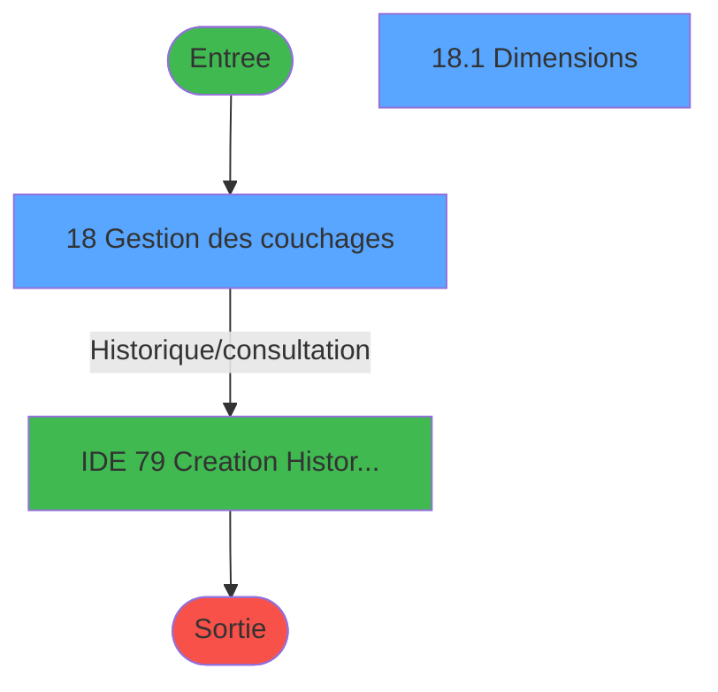
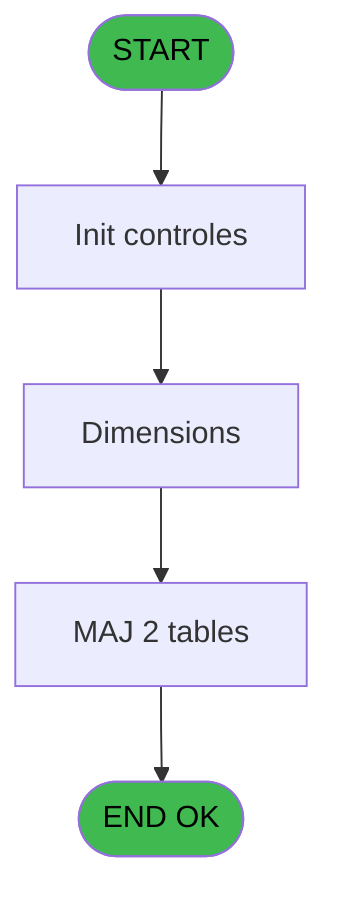

# PBS IDE 18 - Table des Lits

> **Analyse**: Phases 1-4 2026-02-03 17:05 -> 17:06 (19s) | Assemblage 17:06
> **Pipeline**: V7.2 Enrichi
> **Structure**: 4 onglets (Resume | Ecrans | Donnees | Connexions)

<!-- TAB:Resume -->

## 1. FICHE D'IDENTITE

| Attribut | Valeur |
|----------|--------|
| Projet | PBS |
| IDE Position | 18 |
| Nom Programme | Table des Lits |
| Fichier source | `Prg_18.xml` |
| Dossier IDE | Gestion |
| Taches | 2 (2 ecrans visibles) |
| Tables modifiees | 2 |
| Programmes appeles | 1 |
| :warning: Statut | **ORPHELIN_POTENTIEL** |

## 2. DESCRIPTION FONCTIONNELLE

**Table des Lits** assure la gestion complete de ce processus.

Le flux de traitement s'organise en **1 blocs fonctionnels** :

- **Traitement** (2 taches) : traitements metier divers

**Donnees modifiees** : 2 tables en ecriture (Table_1035, Table_1043).

**Logique metier** : 1 regles identifiees couvrant conditions metier.

## 3. BLOCS FONCTIONNELS

### 3.1 Traitement (2 taches)

Traitements internes.

---

#### 18 - Gestion des couchages [[ECRAN]](#ecran-t1)

**Role** : Gestion du moyen de paiement : Gestion des couchages.
**Ecran** : 898 x 252 DLU (MDI) | [Voir mockup](#ecran-t1)

---

#### 18.1 - Dimensions [[ECRAN]](#ecran-t3)

**Role** : Traitement : Dimensions.
**Ecran** : 208 x 200 DLU | [Voir mockup](#ecran-t3)

## 5. REGLES METIER

1 regles identifiees:

### Autres (1 regles)

#### [RM-001] Si Stat (0 alors 'C'MODE) sinon 'CLIT',IF (Stat (0,'M'MODE),'MLIT','ALIT'))

| Element | Detail |
|---------|--------|
| **Condition** | `Stat (0` |
| **Si vrai** | 'C'MODE) |
| **Si faux** | 'CLIT',IF (Stat (0,'M'MODE),'MLIT','ALIT')) |
| **Expression source** | Expression 2 : `IF (Stat (0,'C'MODE),'CLIT',IF (Stat (0,'M'MODE),'MLIT','ALI` |
| **Exemple** | Si Stat (0 → 'C'MODE). Sinon → 'CLIT',IF (Stat (0,'M'MODE),'MLIT','ALIT')) |

## 6. CONTEXTE

- **Appele par**: (aucun)
- **Appelle**: 1 programmes | **Tables**: 2 (W:2 R:0 L:0) | **Taches**: 2 | **Expressions**: 24

<!-- TAB:Ecrans -->

## 8. ECRANS

### 8.1 Forms visibles (2 / 2)

| # | Position | Tache | Nom | Type | Largeur | Hauteur | Bloc |
|---|----------|-------|-----|------|---------|---------|------|
| 1 | 18 | 18 | Gestion des couchages | MDI | 898 | 252 | Traitement |
| 2 | 18.1 | 18.1 | Dimensions | Type0 | 208 | 200 | Traitement |

### 8.2 Mockups Ecrans

---

#### 18 - Gestion des couchages
**Tache** : [18](#t1) | **Type** : MDI | **Dimensions** : 898 x 252 DLU
**Bloc** : Traitement | **Titre IDE** : Gestion des couchages

<!-- FORM-DATA:
{
    "width":  898,
    "vFactor":  8,
    "type":  "MDI",
    "hFactor":  8,
    "controls":  [
                     {
                         "x":  0,
                         "type":  "label",
                         "var":  "",
                         "y":  1,
                         "w":  886,
                         "fmt":  "",
                         "name":  "",
                         "h":  20,
                         "color":  "",
                         "text":  "",
                         "parent":  null
                     },
                     {
                         "x":  26,
                         "type":  "table",
                         "var":  "",
                         "name":  "",
                         "titleH":  12,
                         "color":  "110",
                         "w":  439,
                         "y":  32,
                         "fmt":  "",
                         "parent":  null,
                         "text":  "",
                         "rowH":  11,
                         "h":  180,
                         "cols":  [
                                      {
                                          "title":  "Code",
                                          "layer":  1,
                                          "w":  135
                                      },
                                      {
                                          "title":  "Libellé",
                                          "layer":  2,
                                          "w":  270
                                      }
                                  ],
                         "rows":  2
                     },
                     {
                         "x":  1,
                         "type":  "label",
                         "var":  "",
                         "y":  225,
                         "w":  886,
                         "fmt":  "",
                         "name":  "",
                         "h":  24,
                         "color":  "",
                         "text":  "",
                         "parent":  null
                     },
                     {
                         "x":  32,
                         "type":  "edit",
                         "var":  "",
                         "y":  46,
                         "w":  125,
                         "fmt":  "U10",
                         "name":  "CODE",
                         "h":  8,
                         "color":  "110",
                         "text":  "",
                         "parent":  4
                     },
                     {
                         "x":  172,
                         "type":  "edit",
                         "var":  "",
                         "y":  46,
                         "w":  259,
                         "fmt":  "",
                         "name":  "LIBELLE",
                         "h":  8,
                         "color":  "110",
                         "text":  "",
                         "parent":  4
                     },
                     {
                         "x":  6,
                         "type":  "edit",
                         "var":  "",
                         "y":  7,
                         "w":  396,
                         "fmt":  "30",
                         "name":  "",
                         "h":  8,
                         "color":  "",
                         "text":  "",
                         "parent":  1
                     },
                     {
                         "x":  669,
                         "type":  "edit",
                         "var":  "",
                         "y":  7,
                         "w":  203,
                         "fmt":  "WWW DD MMM YYYYT",
                         "name":  "",
                         "h":  8,
                         "color":  "",
                         "text":  "",
                         "parent":  1
                     },
                     {
                         "x":  7,
                         "type":  "button",
                         "var":  "",
                         "y":  228,
                         "w":  154,
                         "fmt":  "\u0026Quitter",
                         "name":  "",
                         "h":  18,
                         "color":  "",
                         "text":  "",
                         "parent":  14
                     },
                     {
                         "x":  472,
                         "type":  "subform",
                         "var":  "",
                         "y":  21,
                         "w":  416,
                         "fmt":  "",
                         "name":  "Dimensions",
                         "h":  201,
                         "color":  "",
                         "text":  "",
                         "parent":  null
                     }
                 ],
    "taskId":  "18",
    "height":  252
}
-->

<strong>Champs : 4 champs</strong>

| Pos (x,y) | Nom | Variable | Type |
|-----------|-----|----------|------|
| 32,46 | CODE | - | edit |
| 172,46 | LIBELLE | - | edit |
| 6,7 | 30 | - | edit |
| 669,7 | WWW DD MMM YYYYT | - | edit |

<strong>Boutons : 1 boutons</strong>

| Bouton | Pos (x,y) | Action |
|--------|-----------|--------|
| Quitter | 7,228 | Quitte le programme |

---

#### 18.1 - Dimensions
**Tache** : [18.1](#t3) | **Type** : Type0 | **Dimensions** : 208 x 200 DLU
**Bloc** : Traitement | **Titre IDE** : Dimensions

<!-- FORM-DATA:
{
    "width":  208,
    "vFactor":  8,
    "type":  "Type0",
    "hFactor":  4,
    "controls":  [
                     {
                         "x":  4,
                         "type":  "table",
                         "var":  "",
                         "name":  "",
                         "titleH":  12,
                         "color":  "110",
                         "w":  122,
                         "y":  11,
                         "fmt":  "",
                         "parent":  null,
                         "text":  "",
                         "rowH":  17,
                         "h":  181,
                         "cols":  [
                                      {
                                          "title":  "Largeur",
                                          "layer":  1,
                                          "w":  34
                                      },
                                      {
                                          "title":  "Longueur",
                                          "layer":  2,
                                          "w":  40
                                      },
                                      {
                                          "title":  "Age",
                                          "layer":  3,
                                          "w":  24
                                      },
                                      {
                                          "title":  "",
                                          "layer":  4,
                                          "w":  19
                                      }
                                  ],
                         "rows":  4
                     },
                     {
                         "x":  127,
                         "type":  "label",
                         "var":  "",
                         "y":  65,
                         "w":  76,
                         "fmt":  "",
                         "name":  "",
                         "h":  126,
                         "color":  "",
                         "text":  "",
                         "parent":  null
                     },
                     {
                         "x":  0,
                         "type":  "label",
                         "var":  "",
                         "y":  0,
                         "w":  208,
                         "fmt":  "",
                         "name":  "",
                         "h":  196,
                         "color":  "",
                         "text":  "Dimensions",
                         "parent":  null
                     },
                     {
                         "x":  9,
                         "type":  "edit",
                         "var":  "",
                         "y":  29,
                         "w":  26,
                         "fmt":  "",
                         "name":  "ccv_largeur",
                         "h":  8,
                         "color":  "110",
                         "text":  "",
                         "parent":  1
                     },
                     {
                         "x":  47,
                         "type":  "edit",
                         "var":  "",
                         "y":  29,
                         "w":  26,
                         "fmt":  "",
                         "name":  "ccv_longueur",
                         "h":  8,
                         "color":  "110",
                         "text":  "",
                         "parent":  1
                     },
                     {
                         "x":  82,
                         "type":  "edit",
                         "var":  "",
                         "y":  28,
                         "w":  17,
                         "fmt":  "",
                         "name":  "ccv_age_max",
                         "h":  8,
                         "color":  "110",
                         "text":  "",
                         "parent":  1
                     },
                     {
                         "x":  107,
                         "type":  "button",
                         "var":  "",
                         "y":  28,
                         "w":  13,
                         "fmt":  "U",
                         "name":  "",
                         "h":  8,
                         "color":  "43",
                         "text":  "",
                         "parent":  1
                     },
                     {
                         "x":  127,
                         "type":  "image",
                         "var":  "",
                         "y":  11,
                         "w":  76,
                         "fmt":  "",
                         "name":  "",
                         "h":  59,
                         "color":  "",
                         "text":  "",
                         "parent":  14
                     },
                     {
                         "x":  133,
                         "type":  "button",
                         "var":  "",
                         "y":  74,
                         "w":  66,
                         "fmt":  "\u0026Visualisation",
                         "name":  "",
                         "h":  18,
                         "color":  "",
                         "text":  "",
                         "parent":  8
                     },
                     {
                         "x":  133,
                         "type":  "button",
                         "var":  "",
                         "y":  103,
                         "w":  66,
                         "fmt":  "\u0026Modification",
                         "name":  "",
                         "h":  18,
                         "color":  "",
                         "text":  "",
                         "parent":  8
                     },
                     {
                         "x":  133,
                         "type":  "button",
                         "var":  "",
                         "y":  132,
                         "w":  66,
                         "fmt":  "\u0026Création",
                         "name":  "",
                         "h":  18,
                         "color":  "",
                         "text":  "",
                         "parent":  8
                     },
                     {
                         "x":  133,
                         "type":  "button",
                         "var":  "",
                         "y":  161,
                         "w":  66,
                         "fmt":  "\u0026Annulation",
                         "name":  "",
                         "h":  18,
                         "color":  "",
                         "text":  "",
                         "parent":  8
                     }
                 ],
    "taskId":  "18.1",
    "height":  200
}
-->

<strong>Champs : 3 champs</strong>

| Pos (x,y) | Nom | Variable | Type |
|-----------|-----|----------|------|
| 9,29 | ccv_largeur | - | edit |
| 47,29 | ccv_longueur | - | edit |
| 82,28 | ccv_age_max | - | edit |

<strong>Boutons : 5 boutons</strong>

| Bouton | Pos (x,y) | Action |
|--------|-----------|--------|
| U | 107,28 | Bouton fonctionnel |
| Visualisation | 133,74 | Bouton fonctionnel |
| Modification | 133,103 | Modifie l'element |
| Création | 133,132 | Bouton fonctionnel |
| Annulation | 133,161 | Annule et retour au menu |

## 9. NAVIGATION

### 9.1 Enchainement des ecrans

**Detail par enchainement :**

| Depuis | Action | Vers | Retour |
|--------|--------|------|--------|
| Gestion des couchages | Historique/consultation | [Creation Historique (IDE 79)](PBS-IDE-79.md) | Retour ecran |

### 9.3 Structure hierarchique (2 taches)

| Position | Tache | Type | Dimensions | Bloc |
|----------|-------|------|------------|------|
| **18.1** | [**Gestion des couchages** (18)](#t1) [mockup](#ecran-t1) | MDI | 898x252 | Traitement |
| 18.1.1 | [Dimensions (18.1)](#t3) [mockup](#ecran-t3) | - | 208x200 | |

### 9.4 Algorigramme

> **Legende**: Vert = START/END OK | Rouge = END KO | Bleu = Decisions
> *Algorigramme auto-genere. Utiliser `/algorigramme` pour une synthese metier detaillee.*

<!-- TAB:Donnees -->

## 10. TABLES

### Tables utilisees (2)

| ID | Nom | Description | Type | R | W | L | Usages |
|----|-----|-------------|------|---|---|---|--------|
| 1035 | Table_1035 |  | MEM |   | **W** |   | 1 |
| 1043 | Table_1043 |  | MEM |   | **W** |   | 1 |

### Colonnes par table (0 / 2 tables avec colonnes identifiees)

Table 1035 - Table_1035 (**W**) - 1 usages

*Table utilisee uniquement en Link ou aucune colonne Real identifiee dans le DataView.*

Table 1043 - Table_1043 (**W**) - 1 usages

*Table utilisee uniquement en Link ou aucune colonne Real identifiee dans le DataView.*

## 11. VARIABLES

*(Programme sans variables locales mappees)*

## 12. EXPRESSIONS

**24 / 24 expressions decodees (100%)**

### 12.1 Repartition par type

| Type | Expressions | Regles |
|------|-------------|--------|
| CONDITION | 9 | 5 |
| DATE | 1 | 0 |
| NEGATION | 2 | 0 |
| OTHER | 5 | 0 |
| REFERENCE_VG | 1 | 0 |
| FORMAT | 6 | 0 |

### 12.2 Expressions cles par type

#### CONDITION (9 expressions)

| Type | IDE | Expression | Regle |
|------|-----|------------|-------|
| CONDITION | 2 | `IF (Stat (0,'C'MODE),'CLIT',IF (Stat (0,'M'MODE),'MLIT','ALIT'))` | [RM-001](#rm-RM-001) |
| CONDITION | 21 | `[AF]<>0 AND [AG]<>0 AND NOT Range([AI],[AF],[AG])` | - |
| CONDITION | 20 | `[AE]<>0 AND [AH]>[AE]` | - |
| CONDITION | 23 | `[AG]<>0 AND [AI]>[AG]` | - |
| CONDITION | 22 | `[AI]<[AF]` | - |
| ... | | *+4 autres* | |

#### DATE (1 expressions)

| Type | IDE | Expression | Regle |
|------|-----|------------|-------|
| DATE | 5 | `Date ()` | - |

#### NEGATION (2 expressions)

| Type | IDE | Expression | Regle |
|------|-----|------------|-------|
| NEGATION | 7 | `NOT (Stat (0,'E'MODE))` | - |
| NEGATION | 1 | `NOT (Stat (0,'E'MODE))` | - |

#### OTHER (5 expressions)

| Type | IDE | Expression | Regle |
|------|-----|------------|-------|
| OTHER | 17 | `MlsTrans('Gestion des couchages')` | - |
| OTHER | 24 | `[I]` | - |
| OTHER | 6 | `Stat (0,'E'MODE)` | - |
| OTHER | 3 | `Stat (0,'C'MODE)` | - |
| OTHER | 4 | `GetParam ('SOCIETE')` | - |

#### REFERENCE_VG (1 expressions)

| Type | IDE | Expression | Regle |
|------|-----|------------|-------|
| REFERENCE_VG | 8 | `VG3` | - |

#### FORMAT (6 expressions)

| Type | IDE | Expression | Regle |
|------|-----|------------|-------|
| FORMAT | 14 | `MlsTrans('La longueur doit être supérieure ou égale à ')&Str([AF],'5LZ')&' cm !'` | - |
| FORMAT | 15 | `MlsTrans('La longueur doit être comprise entre ') & Str([AF],'5LZ') &
MlsTrans(' et ') & Str([AG],'5LZ')&' cm !'` | - |
| FORMAT | 16 | `MlsTrans('La longueur doit être inférieure ou "égale à ')&Str([AG],'5LZ')&' cm !'` | - |
| FORMAT | 11 | `MlsTrans('La largeur doit être comprise entre ') & Str([AD],'5LZ') &
MlsTrans(' et ') & Str([AE],'5LZ')&' cm !'` | - |
| FORMAT | 12 | `MlsTrans('La largeur doit être supérieure ou égale à ')&Str([AD],'5LZ')&' cm !'
` | - |
| ... | | *+1 autres* | |

### 12.3 Toutes les expressions (24)

Voir les 24 expressions

#### CONDITION (9)

| IDE | Expression Decodee |
|-----|-------------------|
| 2 | `IF (Stat (0,'C'MODE),'CLIT',IF (Stat (0,'M'MODE),'MLIT','ALIT'))` |
| 9 | `([AD]<>0 OR [AE]<>0) AND [AH]<>0` |
| 10 | `([AF]<>0 OR [AG]<>0) AND [AI]<>0` |
| 18 | `[AD]<>0 AND [AE]<>0 AND NOT Range([AH],[AD],[AE])` |
| 19 | `[AH]<[AD]` |
| 20 | `[AE]<>0 AND [AH]>[AE]` |
| 21 | `[AF]<>0 AND [AG]<>0 AND NOT Range([AI],[AF],[AG])` |
| 22 | `[AI]<[AF]` |
| 23 | `[AG]<>0 AND [AI]>[AG]` |

#### DATE (1)

| IDE | Expression Decodee |
|-----|-------------------|
| 5 | `Date ()` |

#### NEGATION (2)

| IDE | Expression Decodee |
|-----|-------------------|
| 1 | `NOT (Stat (0,'E'MODE))` |
| 7 | `NOT (Stat (0,'E'MODE))` |

#### OTHER (5)

| IDE | Expression Decodee |
|-----|-------------------|
| 3 | `Stat (0,'C'MODE)` |
| 4 | `GetParam ('SOCIETE')` |
| 6 | `Stat (0,'E'MODE)` |
| 17 | `MlsTrans('Gestion des couchages')` |
| 24 | `[I]` |

#### REFERENCE_VG (1)

| IDE | Expression Decodee |
|-----|-------------------|
| 8 | `VG3` |

#### FORMAT (6)

| IDE | Expression Decodee |
|-----|-------------------|
| 11 | `MlsTrans('La largeur doit être comprise entre ') & Str([AD],'5LZ') &
MlsTrans(' et ') & Str([AE],'5LZ')&' cm !'` |
| 12 | `MlsTrans('La largeur doit être supérieure ou égale à ')&Str([AD],'5LZ')&' cm !'
` |
| 13 | `MlsTrans('La largeur doit être supérieure ou égale à ')&Str([AE],'5LZ')&' cm'` |
| 14 | `MlsTrans('La longueur doit être supérieure ou égale à ')&Str([AF],'5LZ')&' cm !'` |
| 15 | `MlsTrans('La longueur doit être comprise entre ') & Str([AF],'5LZ') &
MlsTrans(' et ') & Str([AG],'5LZ')&' cm !'` |
| 16 | `MlsTrans('La longueur doit être inférieure ou "égale à ')&Str([AG],'5LZ')&' cm !'` |

<!-- TAB:Connexions -->

## 13. GRAPHE D'APPELS

### 13.1 Chaine depuis Main (Callers)

**Chemin**: (pas de callers directs)

### 13.2 Callers

| IDE | Nom Programme | Nb Appels |
|-----|---------------|-----------|
| - | (aucun) | - |

### 13.3 Callees (programmes appeles)

### 13.4 Detail Callees avec contexte

| IDE | Nom Programme | Appels | Contexte |
|-----|---------------|--------|----------|
| [79](PBS-IDE-79.md) | Creation Historique | 1 | Historique/consultation |

## 14. RECOMMANDATIONS MIGRATION

### 14.1 Profil du programme

| Metrique | Valeur | Impact migration |
|----------|--------|-----------------|
| Lignes de logique | 41 | Programme compact |
| Expressions | 24 | Peu de logique |
| Tables WRITE | 2 | Impact faible |
| Sous-programmes | 1 | Peu de dependances |
| Ecrans visibles | 2 | Quelques ecrans |
| Code desactive | 0% (0 / 41) | Code sain |
| Regles metier | 1 | Quelques regles a preserver |

### 14.2 Plan de migration par bloc

#### Traitement (2 taches: 2 ecrans, 0 traitement)

- **Strategie** : 2 composant(s) UI (Razor/React) avec formulaires et validation.
- 1 sous-programme(s) a migrer ou a reutiliser depuis les services existants.
- Decomposer les taches en services unitaires testables.

### 14.3 Dependances critiques

| Dependance | Type | Appels | Impact |
|------------|------|--------|--------|
| Table_1035 | Table WRITE (Memory) | 1x | Schema + repository |
| Table_1043 | Table WRITE (Memory) | 1x | Schema + repository |
| [Creation Historique (IDE 79)](PBS-IDE-79.md) | Sous-programme | 1x | Normale - Historique/consultation |

---
*Spec DETAILED generee par Pipeline V7.2 - 2026-02-03 17:06*
