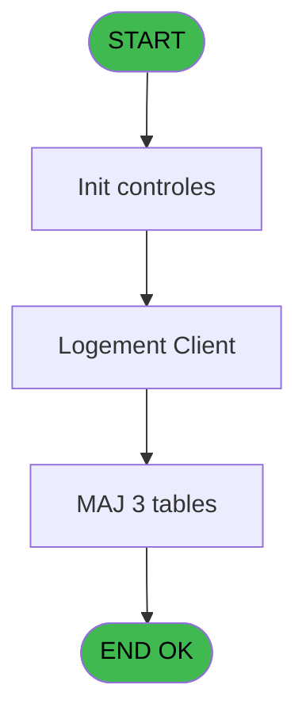
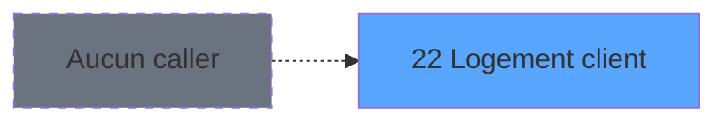
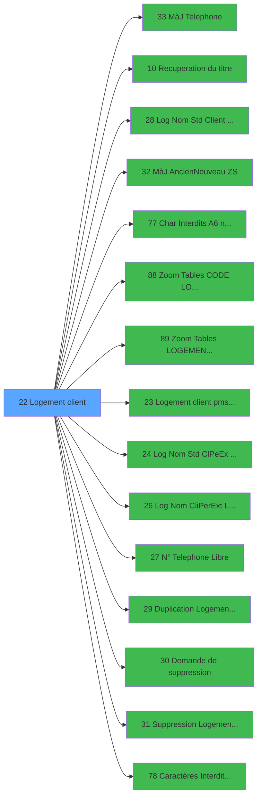

# PBS IDE 22 - Logement client

> **Analyse**: Phases 1-4 2026-02-03 17:07 -> 17:07 (14s) | Assemblage 17:07
> **Pipeline**: V7.2 Enrichi
> **Structure**: 4 onglets (Resume | Ecrans | Donnees | Connexions)

<!-- TAB:Resume -->

## 1. FICHE D'IDENTITE

| Attribut | Valeur |
|----------|--------|
| Projet | PBS |
| IDE Position | 22 |
| Nom Programme | Logement client |
| Fichier source | `Prg_22.xml` |
| Dossier IDE | Logement |
| Taches | 21 (5 ecrans visibles) |
| Tables modifiees | 3 |
| Programmes appeles | 15 |
| :warning: Statut | **ORPHELIN_POTENTIEL** |

## 2. DESCRIPTION FONCTIONNELLE

**Logement client** assure la gestion complete de ce processus.

Le flux de traitement s'organise en **4 blocs fonctionnels** :

- **Traitement** (14 taches) : traitements metier divers
- **Calcul** (3 taches) : calculs de montants, stocks ou compteurs
- **Creation** (2 taches) : insertion d'enregistrements en base (mouvements, prestations)
- **Consultation** (2 taches) : ecrans de recherche, selection et consultation

**Donnees modifiees** : 3 tables en ecriture (logement_client__loc, logement_complement, tables_village).

Detail : phases du traitement

#### Phase 1 : Traitement (14 taches)

- **22** - Logement client **[[ECRAN]](#ecran-t1)**
- **22.1** - Ecran avec chambres pickables **[[ECRAN]](#ecran-t2)**
- **22.1.1** - Communicante **[[ECRAN]](#ecran-t3)**
- **22.1.1.2** - Suppr. Communiqu.
- **22.1.1.2.1** - Suppr. Liens
- **22.1.3** - MàJ Table VILLAGE
- **22.1.4** - Proximite **[[ECRAN]](#ecran-t11)**
- **22.1.4.1** - Suppr. Proximite
- **22.1.4.1.1** - Suppr. Liens
- **22.1.5** - Lire fichier coord GPS
- **22.1.5.1** - Mise à jour
- **22.1.7** - Photos Logement **[[ECRAN]](#ecran-t33)**
- **22.1.7.1** - Compression photo
- **22.1.8** - Recup Photos

Delegue a : [MàJ Telephone (IDE 33)](PBS-IDE-33.md), [Recuperation du titre (IDE 10)](PBS-IDE-10.md), [ Log Nom Std (Client) Existe ? (IDE 28)](PBS-IDE-28.md), [MàJ Ancien/Nouveau (ZS) (IDE 32)](PBS-IDE-32.md), [Char Interdits (A6) no space (IDE 77)](PBS-IDE-77.md), [Logement client pms-626 evo (IDE 23)](PBS-IDE-23.md), [ Log Nom Std (Cl/Pe/Ex) Libre? (IDE 24)](PBS-IDE-24.md), [ Log Nom (Cli/Per/Ext) Libre ? (IDE 26)](PBS-IDE-26.md), [ N° Telephone Libre ? (IDE 27)](PBS-IDE-27.md), [ Duplication Logement Client (IDE 29)](PBS-IDE-29.md), [ Demande de suppression (IDE 30)](PBS-IDE-30.md), [ Suppression Logement Client (IDE 31)](PBS-IDE-31.md), [Caractères Interdits (TEL) (IDE 78)](PBS-IDE-78.md)

#### Phase 2 : Creation (2 taches)

- **22.1.1.1** - Creation Lien **[[ECRAN]](#ecran-t4)**
- **22.1.4.2** - Creation Lien **[[ECRAN]](#ecran-t14)**

#### Phase 3 : Consultation (2 taches)

- **22.1.2** - Rechercher **[[ECRAN]](#ecran-t9)**
- **22.1.6** - Update Pickable Selection

Delegue a : [Recuperation du titre (IDE 10)](PBS-IDE-10.md), [Zoom Tables CODE LOGEMENT (IDE 88)](PBS-IDE-88.md), [Zoom Tables LOGEMENT CLIENT (IDE 89)](PBS-IDE-89.md)

#### Phase 4 : Calcul (3 taches)

- **22.2** - Calcul Combo Code Logement
- **22.3** - Calcul Combo Etage **[[ECRAN]](#ecran-t26)**
- **22.4** - Calcul Combo Zone

#### Tables impactees

| Table | Operations | Role metier |
|-------|-----------|-------------|
| logement_complement | **W**/L (9 usages) |  |
| logement_client__loc | **W** (3 usages) |  |
| tables_village | **W** (1 usages) |  |

## 3. BLOCS FONCTIONNELS

### 3.1 Traitement (14 taches)

Traitements internes.

---

#### 22 - Logement client [[ECRAN]](#ecran-t1)

**Role** : Tache d'orchestration : point d'entree du programme (14 sous-taches). Coordonne l'enchainement des traitements.
**Ecran** : 83 x 0 DLU (MDI) | [Voir mockup](#ecran-t1)

13 sous-taches directes

| Tache | Nom | Bloc |
|-------|-----|------|
| [22.1](#t2) | Ecran avec chambres pickables **[[ECRAN]](#ecran-t2)** | Traitement |
| [22.1.1](#t3) | Communicante **[[ECRAN]](#ecran-t3)** | Traitement |
| [22.1.1.2](#t6) | Suppr. Communiqu. | Traitement |
| [22.1.1.2.1](#t7) | Suppr. Liens | Traitement |
| [22.1.3](#t10) | MàJ Table VILLAGE | Traitement |
| [22.1.4](#t11) | Proximite **[[ECRAN]](#ecran-t11)** | Traitement |
| [22.1.4.1](#t12) | Suppr. Proximite | Traitement |
| [22.1.4.1.1](#t13) | Suppr. Liens | Traitement |
| [22.1.5](#t20) | Lire fichier coord GPS | Traitement |
| [22.1.5.1](#t21) | Mise à jour | Traitement |
| [22.1.7](#t33) | Photos Logement **[[ECRAN]](#ecran-t33)** | Traitement |
| [22.1.7.1](#t34) | Compression photo | Traitement |
| [22.1.8](#t42) | Recup Photos | Traitement |

**Variables liees** : E (v.search combo code logement), I (v.search code logement), S (v.logement communicant), V (v. zoom code logement), X (v.Ancien Logement)

---

#### 22.1 - Ecran avec chambres pickables [[ECRAN]](#ecran-t2)

**Role** : Traitement : Ecran avec chambres pickables.
**Ecran** : 1506 x 365 DLU (MDI) | [Voir mockup](#ecran-t2)

---

#### 22.1.1 - Communicante [[ECRAN]](#ecran-t3)

**Role** : Traitement : Communicante.
**Ecran** : 130 x 75 DLU (Modal) | [Voir mockup](#ecran-t3)

---

#### 22.1.1.2 - Suppr. Communiqu.

**Role** : Traitement : Suppr. Communiqu..

---

#### 22.1.1.2.1 - Suppr. Liens

**Role** : Traitement : Suppr. Liens.

---

#### 22.1.3 - MàJ Table VILLAGE

**Role** : Traitement : MàJ Table VILLAGE.

---

#### 22.1.4 - Proximite [[ECRAN]](#ecran-t11)

**Role** : Traitement : Proximite.
**Ecran** : 133 x 111 DLU (Modal) | [Voir mockup](#ecran-t11)

---

#### 22.1.4.1 - Suppr. Proximite

**Role** : Traitement : Suppr. Proximite.

---

#### 22.1.4.1.1 - Suppr. Liens

**Role** : Traitement : Suppr. Liens.

---

#### 22.1.5 - Lire fichier coord GPS

**Role** : Traitement : Lire fichier coord GPS.

---

#### 22.1.5.1 - Mise à jour

**Role** : Traitement : Mise à jour.

---

#### 22.1.7 - Photos Logement [[ECRAN]](#ecran-t33)

**Role** : Traitement : Photos Logement.
**Ecran** : 1479 x 238 DLU | [Voir mockup](#ecran-t33)
**Variables liees** : E (v.search combo code logement), I (v.search code logement), S (v.logement communicant), V (v. zoom code logement), X (v.Ancien Logement)

---

#### 22.1.7.1 - Compression photo

**Role** : Traitement : Compression photo.
**Variables liees** : BJ (v.Flag maj photos), BG (loc_photo_chambre), BH (loc_photo_vue)

---

#### 22.1.8 - Recup Photos

**Role** : Consultation/chargement : Recup Photos.
**Variables liees** : BJ (v.Flag maj photos)

### 3.2 Creation (2 taches)

Insertion de nouveaux enregistrements en base.

---

#### 22.1.1.1 - Creation Lien [[ECRAN]](#ecran-t4)

**Role** : Creation d'enregistrement : Creation Lien.
**Ecran** : 158 x 75 DLU (MDI) | [Voir mockup](#ecran-t4)

---

#### 22.1.4.2 - Creation Lien [[ECRAN]](#ecran-t14)

**Role** : Creation d'enregistrement : Creation Lien.
**Ecran** : 158 x 75 DLU (MDI) | [Voir mockup](#ecran-t14)

### 3.3 Consultation (2 taches)

Ecrans de recherche et consultation.

---

#### 22.1.2 - Rechercher [[ECRAN]](#ecran-t9)

**Role** : Traitement : Rechercher.
**Ecran** : 413 x 78 DLU (MDI) | [Voir mockup](#ecran-t9)
**Delegue a** : [Zoom Tables CODE LOGEMENT (IDE 88)](PBS-IDE-88.md), [Zoom Tables LOGEMENT CLIENT (IDE 89)](PBS-IDE-89.md)

---

#### 22.1.6 - Update Pickable Selection

**Role** : Selection par l'operateur : Update Pickable Selection.
**Variables liees** : R (v.pickable ?), BF (v.pickable room)
**Delegue a** : [Zoom Tables CODE LOGEMENT (IDE 88)](PBS-IDE-88.md), [Zoom Tables LOGEMENT CLIENT (IDE 89)](PBS-IDE-89.md)

### 3.4 Calcul (3 taches)

Calculs metier : montants, stocks, compteurs.

---

#### 22.2 - Calcul Combo Code Logement

**Role** : Calcul : Calcul Combo Code Logement.
**Variables liees** : B (v. code nom standard), E (v.search combo code logement), F (v.search combo etage), G (v.search combo zone), H (v.search combo secteur)

---

#### 22.3 - Calcul Combo Etage [[ECRAN]](#ecran-t26)

**Role** : Calcul : Calcul Combo Etage.
**Ecran** : 283 x 195 DLU | [Voir mockup](#ecran-t26)
**Variables liees** : E (v.search combo code logement), F (v.search combo etage), G (v.search combo zone), H (v.search combo secteur), M (v.search etage)

---

#### 22.4 - Calcul Combo Zone

**Role** : Calcul : Calcul Combo Zone.
**Variables liees** : E (v.search combo code logement), F (v.search combo etage), G (v.search combo zone), H (v.search combo secteur), K (v.search zone)

## 5. REGLES METIER

*(Aucune regle metier identifiee)*

## 6. CONTEXTE

- **Appele par**: (aucun)
- **Appelle**: 15 programmes | **Tables**: 5 (W:3 R:0 L:3) | **Taches**: 21 | **Expressions**: 8

<!-- TAB:Ecrans -->

## 8. ECRANS

### 8.1 Forms visibles (5 / 21)

| # | Position | Tache | Nom | Type | Largeur | Hauteur | Bloc |
|---|----------|-------|-----|------|---------|---------|------|
| 1 | 22.4 | 22.1 | Ecran avec chambres pickables | MDI | 1506 | 365 | Traitement |
| 2 | 22.4.2 | 22.1.1 | Communicante | Modal | 130 | 75 | Traitement |
| 3 | 22.4.3 | 22.1.2 | Rechercher | MDI | 413 | 78 | Consultation |
| 4 | 22.4.5 | 22.1.4 | Proximite | Modal | 133 | 111 | Traitement |
| 5 | 22.4.7 | 22.1.7 | Photos Logement | Type0 | 1479 | 238 | Traitement |

### 8.2 Mockups Ecrans

---

#### 22.4 - Ecran avec chambres pickables
**Tache** : [22.1](#t2) | **Type** : MDI | **Dimensions** : 1506 x 365 DLU
**Bloc** : Traitement | **Titre IDE** : Ecran avec chambres pickables

<!-- FORM-DATA:
{
    "width":  1506,
    "vFactor":  8,
    "type":  "MDI",
    "hFactor":  8,
    "controls":  [
                     {
                         "x":  2,
                         "type":  "label",
                         "var":  "",
                         "y":  1,
                         "w":  1492,
                         "fmt":  "",
                         "name":  "",
                         "h":  20,
                         "color":  "",
                         "text":  "",
                         "parent":  null
                     },
                     {
                         "x":  6,
                         "type":  "table",
                         "var":  "",
                         "name":  "",
                         "titleH":  12,
                         "color":  "110",
                         "w":  418,
                         "y":  74,
                         "fmt":  "",
                         "parent":  null,
                         "text":  "",
                         "rowH":  12,
                         "h":  264,
                         "cols":  [
                                      {
                                          "title":  "Nom Standard",
                                          "layer":  1,
                                          "w":  152
                                      },
                                      {
                                          "title":  "Pickable",
                                          "layer":  2,
                                          "w":  229
                                      }
                                  ],
                         "rows":  2
                     },
                     {
                         "x":  430,
                         "type":  "label",
                         "var":  "",
                         "y":  73,
                         "w":  401,
                         "fmt":  "",
                         "name":  "",
                         "h":  38,
                         "color":  "",
                         "text":  "",
                         "parent":  null
                     },
                     {
                         "x":  831,
                         "type":  "label",
                         "var":  "",
                         "y":  73,
                         "w":  440,
                         "fmt":  "",
                         "name":  "",
                         "h":  38,
                         "color":  "",
                         "text":  "",
                         "parent":  null
                     },
                     {
                         "x":  451,
                         "type":  "label",
                         "var":  "",
                         "y":  78,
                         "w":  125,
                         "fmt":  "",
                         "name":  "",
                         "h":  12,
                         "color":  "",
                         "text":  "Nom Complet",
                         "parent":  5
                     },
                     {
                         "x":  1285,
                         "type":  "label",
                         "var":  "",
                         "y":  69,
                         "w":  209,
                         "fmt":  "",
                         "name":  "",
                         "h":  268,
                         "color":  "",
                         "text":  "",
                         "parent":  null
                     },
                     {
                         "x":  451,
                         "type":  "label",
                         "var":  "",
                         "y":  95,
                         "w":  94,
                         "fmt":  "",
                         "name":  "",
                         "h":  12,
                         "color":  "",
                         "text":  "N° Poste",
                         "parent":  5
                     },
                     {
                         "x":  431,
                         "type":  "label",
                         "var":  "",
                         "y":  111,
                         "w":  400,
                         "fmt":  "",
                         "name":  "",
                         "h":  104,
                         "color":  "",
                         "text":  "",
                         "parent":  null
                     },
                     {
                         "x":  831,
                         "type":  "label",
                         "var":  "",
                         "y":  111,
                         "w":  303,
                         "fmt":  "",
                         "name":  "",
                         "h":  104,
                         "color":  "",
                         "text":  "",
                         "parent":  null
                     },
                     {
                         "x":  1134,
                         "type":  "label",
                         "var":  "",
                         "y":  111,
                         "w":  137,
                         "fmt":  "",
                         "name":  "",
                         "h":  95,
                         "color":  "",
                         "text":  "",
                         "parent":  null
                     },
                     {
                         "x":  451,
                         "type":  "label",
                         "var":  "",
                         "y":  116,
                         "w":  82,
                         "fmt":  "",
                         "name":  "",
                         "h":  12,
                         "color":  "",
                         "text":  "Ensemble",
                         "parent":  18
                     },
                     {
                         "x":  839,
                         "type":  "label",
                         "var":  "",
                         "y":  116,
                         "w":  72,
                         "fmt":  "",
                         "name":  "",
                         "h":  12,
                         "color":  "",
                         "text":  "Lit Pliant",
                         "parent":  19
                     },
                     {
                         "x":  1144,
                         "type":  "label",
                         "var":  "",
                         "y":  116,
                         "w":  120,
                         "fmt":  "",
                         "name":  "",
                         "h":  8,
                         "color":  "7",
                         "text":  "Communicante",
                         "parent":  20
                     },
                     {
                         "x":  839,
                         "type":  "label",
                         "var":  "",
                         "y":  129,
                         "w":  96,
                         "fmt":  "",
                         "name":  "",
                         "h":  12,
                         "color":  "",
                         "text":  "Lit Bébé",
                         "parent":  19
                     },
                     {
                         "x":  451,
                         "type":  "label",
                         "var":  "",
                         "y":  130,
                         "w":  117,
                         "fmt":  "",
                         "name":  "",
                         "h":  12,
                         "color":  "",
                         "text":  "Logement",
                         "parent":  18
                     },
                     {
                         "x":  839,
                         "type":  "label",
                         "var":  "",
                         "y":  142,
                         "w":  86,
                         "fmt":  "",
                         "name":  "",
                         "h":  12,
                         "color":  "",
                         "text":  "Banquette",
                         "parent":  19
                     },
                     {
                         "x":  451,
                         "type":  "label",
                         "var":  "",
                         "y":  144,
                         "w":  74,
                         "fmt":  "",
                         "name":  "",
                         "h":  12,
                         "color":  "",
                         "text":  "Bâtiment",
                         "parent":  18
                     },
                     {
                         "x":  839,
                         "type":  "label",
                         "var":  "",
                         "y":  155,
                         "w":  75,
                         "fmt":  "",
                         "name":  "",
                         "h":  12,
                         "color":  "",
                         "text":  "Standing",
                         "parent":  19
                     },
                     {
                         "x":  451,
                         "type":  "label",
                         "var":  "",
                         "y":  158,
                         "w":  53,
                         "fmt":  "",
                         "name":  "",
                         "h":  12,
                         "color":  "",
                         "text":  "Etage",
                         "parent":  18
                     },
                     {
                         "x":  839,
                         "type":  "label",
                         "var":  "",
                         "y":  168,
                         "w":  65,
                         "fmt":  "",
                         "name":  "",
                         "h":  12,
                         "color":  "",
                         "text":  "Attr",
                         "parent":  19
                     },
                     {
                         "x":  451,
                         "type":  "label",
                         "var":  "",
                         "y":  172,
                         "w":  38,
                         "fmt":  "",
                         "name":  "",
                         "h":  12,
                         "color":  "",
                         "text":  "Vue",
                         "parent":  18
                     },
                     {
                         "x":  839,
                         "type":  "label",
                         "var":  "",
                         "y":  181,
                         "w":  99,
                         "fmt":  "",
                         "name":  "",
                         "h":  12,
                         "color":  "",
                         "text":  "Handicapés",
                         "parent":  19
                     },
                     {
                         "x":  451,
                         "type":  "label",
                         "var":  "",
                         "y":  186,
                         "w":  96,
                         "fmt":  "",
                         "name":  "",
                         "h":  12,
                         "color":  "",
                         "text":  "Occupation",
                         "parent":  18
                     },
                     {
                         "x":  839,
                         "type":  "label",
                         "var":  "",
                         "y":  194,
                         "w":  67,
                         "fmt":  "",
                         "name":  "",
                         "h":  12,
                         "color":  "",
                         "text":  "Défauts",
                         "parent":  19
                     },
                     {
                         "x":  1134,
                         "type":  "label",
                         "var":  "",
                         "y":  206,
                         "w":  137,
                         "fmt":  "",
                         "name":  "",
                         "h":  131,
                         "color":  "",
                         "text":  "",
                         "parent":  null
                     },
                     {
                         "x":  1149,
                         "type":  "label",
                         "var":  "",
                         "y":  210,
                         "w":  112,
                         "fmt":  "",
                         "name":  "",
                         "h":  8,
                         "color":  "7",
                         "text":  "Proximité",
                         "parent":  36
                     },
                     {
                         "x":  431,
                         "type":  "label",
                         "var":  "",
                         "y":  215,
                         "w":  399,
                         "fmt":  "",
                         "name":  "",
                         "h":  122,
                         "color":  "",
                         "text":  "",
                         "parent":  null
                     },
                     {
                         "x":  830,
                         "type":  "label",
                         "var":  "",
                         "y":  215,
                         "w":  305,
                         "fmt":  "",
                         "name":  "",
                         "h":  34,
                         "color":  "",
                         "text":  "",
                         "parent":  null
                     },
                     {
                         "x":  451,
                         "type":  "label",
                         "var":  "",
                         "y":  225,
                         "w":  115,
                         "fmt":  "",
                         "name":  "",
                         "h":  12,
                         "color":  "",
                         "text":  "Zone Ménage",
                         "parent":  38
                     },
                     {
                         "x":  839,
                         "type":  "label",
                         "var":  "",
                         "y":  218,
                         "w":  90,
                         "fmt":  "",
                         "name":  "",
                         "h":  12,
                         "color":  "",
                         "text":  "Orientation",
                         "parent":  null
                     },
                     {
                         "x":  451,
                         "type":  "label",
                         "var":  "",
                         "y":  239,
                         "w":  134,
                         "fmt":  "",
                         "name":  "",
                         "h":  12,
                         "color":  "",
                         "text":  "Secteur Ménage",
                         "parent":  38
                     },
                     {
                         "x":  839,
                         "type":  "label",
                         "var":  "",
                         "y":  234,
                         "w":  67,
                         "fmt":  "",
                         "name":  "",
                         "h":  10,
                         "color":  "",
                         "text":  "Surface",
                         "parent":  null
                     },
                     {
                         "x":  1038,
                         "type":  "label",
                         "var":  "",
                         "y":  234,
                         "w":  26,
                         "fmt":  "",
                         "name":  "",
                         "h":  10,
                         "color":  "7",
                         "text":  "m²",
                         "parent":  null
                     },
                     {
                         "x":  451,
                         "type":  "label",
                         "var":  "",
                         "y":  253,
                         "w":  98,
                         "fmt":  "",
                         "name":  "",
                         "h":  12,
                         "color":  "",
                         "text":  "N° Extérieur",
                         "parent":  38
                     },
                     {
                         "x":  830,
                         "type":  "label",
                         "var":  "",
                         "y":  249,
                         "w":  305,
                         "fmt":  "",
                         "name":  "",
                         "h":  88,
                         "color":  "",
                         "text":  "",
                         "parent":  null
                     },
                     {
                         "x":  843,
                         "type":  "label",
                         "var":  "",
                         "y":  252,
                         "w":  93,
                         "fmt":  "",
                         "name":  "",
                         "h":  8,
                         "color":  "",
                         "text":  "Abandon",
                         "parent":  48
                     },
                     {
                         "x":  451,
                         "type":  "label",
                         "var":  "",
                         "y":  267,
                         "w":  59,
                         "fmt":  "",
                         "name":  "",
                         "h":  12,
                         "color":  "",
                         "text":  "N° Fax",
                         "parent":  38
                     },
                     {
                         "x":  843,
                         "type":  "label",
                         "var":  "",
                         "y":  265,
                         "w":  56,
                         "fmt":  "",
                         "name":  "",
                         "h":  8,
                         "color":  "",
                         "text":  "Pont",
                         "parent":  48
                     },
                     {
                         "x":  1016,
                         "type":  "label",
                         "var":  "",
                         "y":  265,
                         "w":  54,
                         "fmt":  "",
                         "name":  "",
                         "h":  8,
                         "color":  "",
                         "text":  "Cote",
                         "parent":  48
                     },
                     {
                         "x":  451,
                         "type":  "label",
                         "var":  "",
                         "y":  281,
                         "w":  67,
                         "fmt":  "",
                         "name":  "",
                         "h":  12,
                         "color":  "",
                         "text":  "Bagage",
                         "parent":  38
                     },
                     {
                         "x":  843,
                         "type":  "label",
                         "var":  "",
                         "y":  276,
                         "w":  56,
                         "fmt":  "",
                         "name":  "",
                         "h":  8,
                         "color":  "",
                         "text":  "Zone",
                         "parent":  48
                     },
                     {
                         "x":  2,
                         "type":  "label",
                         "var":  "",
                         "y":  340,
                         "w":  1492,
                         "fmt":  "",
                         "name":  "",
                         "h":  24,
                         "color":  "",
                         "text":  "",
                         "parent":  null
                     },
                     {
                         "x":  451,
                         "type":  "label",
                         "var":  "",
                         "y":  200,
                         "w":  109,
                         "fmt":  "",
                         "name":  "",
                         "h":  12,
                         "color":  "",
                         "text":  "Proche centre",
                         "parent":  18
                     },
                     {
                         "x":  843,
                         "type":  "label",
                         "var":  "",
                         "y":  295,
                         "w":  91,
                         "fmt":  "",
                         "name":  "",
                         "h":  12,
                         "color":  "",
                         "text":  "La + belle",
                         "parent":  48
                     },
                     {
                         "x":  451,
                         "type":  "label",
                         "var":  "",
                         "y":  295,
                         "w":  90,
                         "fmt":  "",
                         "name":  "",
                         "h":  12,
                         "color":  "",
                         "text":  "Latitude",
                         "parent":  38
                     },
                     {
                         "x":  451,
                         "type":  "label",
                         "var":  "",
                         "y":  309,
                         "w":  104,
                         "fmt":  "",
                         "name":  "",
                         "h":  12,
                         "color":  "",
                         "text":  "Longitude",
                         "parent":  38
                     },
                     {
                         "x":  2,
                         "type":  "label",
                         "var":  "",
                         "y":  23,
                         "w":  1492,
                         "fmt":  "",
                         "name":  "",
                         "h":  47,
                         "color":  "",
                         "text":  "Recherche",
                         "parent":  null
                     },
                     {
                         "x":  22,
                         "type":  "label",
                         "var":  "",
                         "y":  34,
                         "w":  117,
                         "fmt":  "",
                         "name":  "",
                         "h":  12,
                         "color":  "",
                         "text":  "Lieu Séjour",
                         "parent":  197
                     },
                     {
                         "x":  22,
                         "type":  "label",
                         "var":  "",
                         "y":  50,
                         "w":  161,
                         "fmt":  "",
                         "name":  "",
                         "h":  10,
                         "color":  "",
                         "text":  "Code Logement",
                         "parent":  197
                     },
                     {
                         "x":  424,
                         "type":  "label",
                         "var":  "",
                         "y":  34,
                         "w":  74,
                         "fmt":  "",
                         "name":  "",
                         "h":  12,
                         "color":  "",
                         "text":  "Bâtiment",
                         "parent":  197
                     },
                     {
                         "x":  424,
                         "type":  "label",
                         "var":  "",
                         "y":  48,
                         "w":  74,
                         "fmt":  "",
                         "name":  "",
                         "h":  12,
                         "color":  "",
                         "text":  "Etage",
                         "parent":  197
                     },
                     {
                         "x":  745,
                         "type":  "label",
                         "var":  "",
                         "y":  34,
                         "w":  74,
                         "fmt":  "",
                         "name":  "",
                         "h":  12,
                         "color":  "",
                         "text":  "Zone",
                         "parent":  197
                     },
                     {
                         "x":  745,
                         "type":  "label",
                         "var":  "",
                         "y":  50,
                         "w":  74,
                         "fmt":  "",
                         "name":  "",
                         "h":  12,
                         "color":  "",
                         "text":  "Secteur",
                         "parent":  197
                     },
                     {
                         "x":  1042,
                         "type":  "label",
                         "var":  "",
                         "y":  34,
                         "w":  109,
                         "fmt":  "",
                         "name":  "",
                         "h":  12,
                         "color":  "",
                         "text":  "La + belle",
                         "parent":  197
                     },
                     {
                         "x":  1042,
                         "type":  "label",
                         "var":  "",
                         "y":  51,
                         "w":  109,
                         "fmt":  "",
                         "name":  "",
                         "h":  12,
                         "color":  "",
                         "text":  "Proche centre",
                         "parent":  197
                     },
                     {
                         "x":  1275,
                         "type":  "label",
                         "var":  "",
                         "y":  34,
                         "w":  109,
                         "fmt":  "",
                         "name":  "",
                         "h":  12,
                         "color":  "",
                         "text":  "Handicapés",
                         "parent":  197
                     },
                     {
                         "x":  1122,
                         "type":  "label",
                         "var":  "",
                         "y":  77,
                         "w":  138,
                         "fmt":  "",
                         "name":  "",
                         "h":  10,
                         "color":  "",
                         "text":  "Code Log. unitaire",
                         "parent":  null
                     },
                     {
                         "x":  835,
                         "type":  "label",
                         "var":  "",
                         "y":  77,
                         "w":  117,
                         "fmt":  "",
                         "name":  "",
                         "h":  12,
                         "color":  "",
                         "text":  "Lieu Séjour",
                         "parent":  null
                     },
                     {
                         "x":  982,
                         "type":  "label",
                         "var":  "",
                         "y":  77,
                         "w":  138,
                         "fmt":  "",
                         "name":  "",
                         "h":  10,
                         "color":  "",
                         "text":  "Code Logement",
                         "parent":  null
                     },
                     {
                         "x":  38,
                         "type":  "edit",
                         "var":  "",
                         "y":  90,
                         "w":  75,
                         "fmt":  "",
                         "name":  "LOC Nom Standard",
                         "h":  8,
                         "color":  "110",
                         "text":  "",
                         "parent":  4
                     },
                     {
                         "x":  590,
                         "type":  "edit",
                         "var":  "",
                         "y":  78,
                         "w":  182,
                         "fmt":  "",
                         "name":  "LOC Nom Complet",
                         "h":  12,
                         "color":  "110",
                         "text":  "",
                         "parent":  5
                     },
                     {
                         "x":  590,
                         "type":  "edit",
                         "var":  "",
                         "y":  95,
                         "w":  82,
                         "fmt":  "",
                         "name":  "LOC Tel Interieur",
                         "h":  12,
                         "color":  "110",
                         "text":  "",
                         "parent":  5
                     },
                     {
                         "x":  841,
                         "type":  "combobox",
                         "var":  "",
                         "y":  93,
                         "w":  139,
                         "fmt":  "",
                         "name":  "LOC Lieu Sejour",
                         "h":  12,
                         "color":  "110",
                         "text":  "1,2",
                         "parent":  6
                     },
                     {
                         "x":  998,
                         "type":  "edit",
                         "var":  "",
                         "y":  93,
                         "w":  82,
                         "fmt":  "",
                         "name":  "LOC Code Logement",
                         "h":  12,
                         "color":  "110",
                         "text":  "",
                         "parent":  6
                     },
                     {
                         "x":  1090,
                         "type":  "button",
                         "var":  "",
                         "y":  93,
                         "w":  27,
                         "fmt":  "...",
                         "name":  "v. zoom code logement",
                         "h":  12,
                         "color":  "",
                         "text":  "",
                         "parent":  6
                     },
                     {
                         "x":  590,
                         "type":  "combobox",
                         "var":  "",
                         "y":  116,
                         "w":  216,
                         "fmt":  "",
                         "name":  "LOC Ensemble",
                         "h":  12,
                         "color":  "110",
                         "text":  "111,222",
                         "parent":  18
                     },
                     {
                         "x":  590,
                         "type":  "combobox",
                         "var":  "",
                         "y":  130,
                         "w":  216,
                         "fmt":  "",
                         "name":  "LOC Logement",
                         "h":  12,
                         "color":  "110",
                         "text":  "11,22",
                         "parent":  18
                     },
                     {
                         "x":  590,
                         "type":  "combobox",
                         "var":  "",
                         "y":  144,
                         "w":  216,
                         "fmt":  "",
                         "name":  "LOC Batiment",
                         "h":  12,
                         "color":  "110",
                         "text":  "11,22",
                         "parent":  18
                     },
                     {
                         "x":  590,
                         "type":  "combobox",
                         "var":  "",
                         "y":  158,
                         "w":  216,
                         "fmt":  "",
                         "name":  "LOC Etage",
                         "h":  12,
                         "color":  "110",
                         "text":  "11,22,Sous\\-sol",
                         "parent":  18
                     },
                     {
                         "x":  590,
                         "type":  "combobox",
                         "var":  "",
                         "y":  172,
                         "w":  216,
                         "fmt":  "",
                         "name":  "LOC Vue",
                         "h":  12,
                         "color":  "110",
                         "text":  "11,22",
                         "parent":  18
                     },
                     {
                         "x":  590,
                         "type":  "combobox",
                         "var":  "",
                         "y":  186,
                         "w":  216,
                         "fmt":  "",
                         "name":  "v.Occupation Std",
                         "h":  12,
                         "color":  "110",
                         "text":  "11,22",
                         "parent":  18
                     },
                     {
                         "x":  970,
                         "type":  "combobox",
                         "var":  "",
                         "y":  116,
                         "w":  157,
                         "fmt":  "",
                         "name":  "LOC Lit Pliant",
                         "h":  12,
                         "color":  "110",
                         "text":  "1,2",
                         "parent":  19
                     },
                     {
                         "x":  970,
                         "type":  "combobox",
                         "var":  "",
                         "y":  129,
                         "w":  157,
                         "fmt":  "",
                         "name":  "LOC Lit Bebe",
                         "h":  12,
                         "color":  "110",
                         "text":  "1,2",
                         "parent":  19
                     },
                     {
                         "x":  970,
                         "type":  "combobox",
                         "var":  "",
                         "y":  142,
                         "w":  157,
                         "fmt":  "",
                         "name":  "LOC Lit Banquette",
                         "h":  12,
                         "color":  "110",
                         "text":  "1,2",
                         "parent":  19
                     },
                     {
                         "x":  970,
                         "type":  "combobox",
                         "var":  "",
                         "y":  155,
                         "w":  157,
                         "fmt":  "",
                         "name":  "LOC Standing",
                         "h":  12,
                         "color":  "110",
                         "text":  "11,22",
                         "parent":  19
                     },
                     {
                         "x":  970,
                         "type":  "combobox",
                         "var":  "",
                         "y":  168,
                         "w":  157,
                         "fmt":  "",
                         "name":  "LOC Attribution",
                         "h":  12,
                         "color":  "110",
                         "text":  "1,2",
                         "parent":  19
                     },
                     {
                         "x":  970,
                         "type":  "combobox",
                         "var":  "",
                         "y":  181,
                         "w":  157,
                         "fmt":  "",
                         "name":  "LOC Handicapes",
                         "h":  12,
                         "color":  "110",
                         "text":  "Oui,Non",
                         "parent":  19
                     },
                     {
                         "x":  970,
                         "type":  "combobox",
                         "var":  "",
                         "y":  194,
                         "w":  157,
                         "fmt":  "",
                         "name":  "LOC Defauts",
                         "h":  12,
                         "color":  "110",
                         "text":  "Oui,Non",
                         "parent":  19
                     },
                     {
                         "x":  590,
                         "type":  "combobox",
                         "var":  "",
                         "y":  225,
                         "w":  216,
                         "fmt":  "",
                         "name":  "v.Code Zone Reduit",
                         "h":  12,
                         "color":  "110",
                         "text":  "11,22",
                         "parent":  38
                     },
                     {
                         "x":  590,
                         "type":  "combobox",
                         "var":  "",
                         "y":  239,
                         "w":  216,
                         "fmt":  "",
                         "name":  "v.Code Secteur Reduit",
                         "h":  12,
                         "color":  "110",
                         "text":  "11,22",
                         "parent":  38
                     },
                     {
                         "x":  590,
                         "type":  "edit",
                         "var":  "",
                         "y":  253,
                         "w":  216,
                         "fmt":  "",
                         "name":  "TEL. EXTERIEUR",
                         "h":  12,
                         "color":  "110",
                         "text":  "",
                         "parent":  38
                     },
                     {
                         "x":  590,
                         "type":  "edit",
                         "var":  "",
                         "y":  267,
                         "w":  216,
                         "fmt":  "",
                         "name":  "FAX",
                         "h":  12,
                         "color":  "110",
                         "text":  "",
                         "parent":  38
                     },
                     {
                         "x":  590,
                         "type":  "edit",
                         "var":  "",
                         "y":  281,
                         "w":  216,
                         "fmt":  "",
                         "name":  "POINT BAGAGE",
                         "h":  12,
                         "color":  "110",
                         "text":  "",
                         "parent":  38
                     },
                     {
                         "x":  970,
                         "type":  "combobox",
                         "var":  "",
                         "y":  218,
                         "w":  157,
                         "fmt":  "",
                         "name":  "LOC Orientation",
                         "h":  12,
                         "color":  "110",
                         "text":  "11,22",
                         "parent":  null
                     },
                     {
                         "x":  970,
                         "type":  "edit",
                         "var":  "",
                         "y":  234,
                         "w":  48,
                         "fmt":  "",
                         "name":  "LOC Surface",
                         "h":  10,
                         "color":  "110",
                         "text":  "",
                         "parent":  null
                     },
                     {
                         "x":  967,
                         "type":  "edit",
                         "var":  "",
                         "y":  251,
                         "w":  157,
                         "fmt":  "",
                         "name":  "ABANDON",
                         "h":  10,
                         "color":  "110",
                         "text":  "",
                         "parent":  48
                     },
                     {
                         "x":  967,
                         "type":  "edit",
                         "var":  "",
                         "y":  264,
                         "w":  26,
                         "fmt":  "",
                         "name":  "PONT",
                         "h":  10,
                         "color":  "110",
                         "text":  "",
                         "parent":  48
                     },
                     {
                         "x":  1076,
                         "type":  "edit",
                         "var":  "",
                         "y":  264,
                         "w":  48,
                         "fmt":  "",
                         "name":  "COTE",
                         "h":  10,
                         "color":  "110",
                         "text":  "",
                         "parent":  48
                     },
                     {
                         "x":  967,
                         "type":  "edit",
                         "var":  "",
                         "y":  276,
                         "w":  157,
                         "fmt":  "",
                         "name":  "ZONE",
                         "h":  10,
                         "color":  "110",
                         "text":  "",
                         "parent":  48
                     },
                     {
                         "x":  22,
                         "type":  "edit",
                         "var":  "",
                         "y":  7,
                         "w":  267,
                         "fmt":  "20",
                         "name":  "",
                         "h":  8,
                         "color":  "",
                         "text":  "",
                         "parent":  1
                     },
                     {
                         "x":  1278,
                         "type":  "edit",
                         "var":  "",
                         "y":  7,
                         "w":  203,
                         "fmt":  "WWW DD MMM YYYYT",
                         "name":  "",
                         "h":  8,
                         "color":  "",
                         "text":  "",
                         "parent":  1
                     },
                     {
                         "x":  1298,
                         "type":  "button",
                         "var":  "",
                         "y":  83,
                         "w":  184,
                         "fmt":  "\u0026Visualisation",
                         "name":  "",
                         "h":  18,
                         "color":  "",
                         "text":  "",
                         "parent":  11
                     },
                     {
                         "x":  1298,
                         "type":  "button",
                         "var":  "",
                         "y":  104,
                         "w":  184,
                         "fmt":  "\u0026Modification",
                         "name":  "",
                         "h":  18,
                         "color":  "",
                         "text":  "",
                         "parent":  11
                     },
                     {
                         "x":  1298,
                         "type":  "button",
                         "var":  "",
                         "y":  125,
                         "w":  184,
                         "fmt":  "\u0026Creation",
                         "name":  "Création",
                         "h":  18,
                         "color":  "",
                         "text":  "",
                         "parent":  11
                     },
                     {
                         "x":  1298,
                         "type":  "button",
                         "var":  "",
                         "y":  146,
                         "w":  184,
                         "fmt":  "\u0026Annulation",
                         "name":  "",
                         "h":  18,
                         "color":  "",
                         "text":  "",
                         "parent":  11
                     },
                     {
                         "x":  1298,
                         "type":  "button",
                         "var":  "",
                         "y":  167,
                         "w":  184,
                         "fmt":  "\u0026Suppression",
                         "name":  "",
                         "h":  18,
                         "color":  "",
                         "text":  "",
                         "parent":  11
                     },
                     {
                         "x":  1307,
                         "type":  "image",
                         "var":  "",
                         "y":  229,
                         "w":  159,
                         "fmt":  "",
                         "name":  "",
                         "h":  46,
                         "color":  "",
                         "text":  "",
                         "parent":  11
                     },
                     {
                         "x":  1298,
                         "type":  "button",
                         "var":  "",
                         "y":  277,
                         "w":  184,
                         "fmt":  "C\u0026ommunicante",
                         "name":  "",
                         "h":  18,
                         "color":  "",
                         "text":  "",
                         "parent":  11
                     },
                     {
                         "x":  1298,
                         "type":  "button",
                         "var":  "",
                         "y":  297,
                         "w":  184,
                         "fmt":  "\u0026Proximité",
                         "name":  "",
                         "h":  18,
                         "color":  "",
                         "text":  "",
                         "parent":  11
                     },
                     {
                         "x":  8,
                         "type":  "button",
                         "var":  "",
                         "y":  343,
                         "w":  154,
                         "fmt":  "\u0026Quitter",
                         "name":  "",
                         "h":  18,
                         "color":  "",
                         "text":  "",
                         "parent":  61
                     },
                     {
                         "x":  169,
                         "type":  "button",
                         "var":  "",
                         "y":  343,
                         "w":  154,
                         "fmt":  "\u0026Rechercher",
                         "name":  "",
                         "h":  18,
                         "color":  "",
                         "text":  "",
                         "parent":  61
                     },
                     {
                         "x":  1298,
                         "type":  "button",
                         "var":  "",
                         "y":  188,
                         "w":  184,
                         "fmt":  "\u0026Dupliquer",
                         "name":  "",
                         "h":  18,
                         "color":  "",
                         "text":  "",
                         "parent":  11
                     },
                     {
                         "x":  590,
                         "type":  "combobox",
                         "var":  "",
                         "y":  200,
                         "w":  216,
                         "fmt":  "",
                         "name":  "LOC proche centre",
                         "h":  12,
                         "color":  "110",
                         "text":  "Oui,Non",
                         "parent":  18
                     },
                     {
                         "x":  967,
                         "type":  "combobox",
                         "var":  "",
                         "y":  295,
                         "w":  157,
                         "fmt":  "",
                         "name":  "loc_plus_belle",
                         "h":  12,
                         "color":  "110",
                         "text":  "Oui,Non",
                         "parent":  48
                     },
                     {
                         "x":  590,
                         "type":  "edit",
                         "var":  "",
                         "y":  295,
                         "w":  216,
                         "fmt":  "N3.15",
                         "name":  "loc_latitude",
                         "h":  12,
                         "color":  "110",
                         "text":  "",
                         "parent":  38
                     },
                     {
                         "x":  590,
                         "type":  "edit",
                         "var":  "",
                         "y":  309,
                         "w":  216,
                         "fmt":  "N3.15",
                         "name":  "loc_longitude",
                         "h":  12,
                         "color":  "110",
                         "text":  "",
                         "parent":  38
                     },
                     {
                         "x":  1298,
                         "type":  "button",
                         "var":  "",
                         "y":  209,
                         "w":  184,
                         "fmt":  "\u0026Import coord. GPS",
                         "name":  "",
                         "h":  18,
                         "color":  "",
                         "text":  "",
                         "parent":  11
                     },
                     {
                         "x":  195,
                         "type":  "combobox",
                         "var":  "",
                         "y":  34,
                         "w":  216,
                         "fmt":  "",
                         "name":  "v.search lieu sejour_0001",
                         "h":  12,
                         "color":  "110",
                         "text":  "1,2",
                         "parent":  197
                     },
                     {
                         "x":  195,
                         "type":  "combobox",
                         "var":  "",
                         "y":  50,
                         "w":  216,
                         "fmt":  "",
                         "name":  "v.search code logement_0001",
                         "h":  12,
                         "color":  "110",
                         "text":  "Tous",
                         "parent":  197
                     },
                     {
                         "x":  513,
                         "type":  "combobox",
                         "var":  "",
                         "y":  34,
                         "w":  216,
                         "fmt":  "",
                         "name":  "v.search batiment_0001",
                         "h":  12,
                         "color":  "110",
                         "text":  "11,22",
                         "parent":  197
                     },
                     {
                         "x":  513,
                         "type":  "combobox",
                         "var":  "",
                         "y":  48,
                         "w":  216,
                         "fmt":  "",
                         "name":  "v.search etage_0001",
                         "h":  12,
                         "color":  "110",
                         "text":  "11,22,Sous\\-sol",
                         "parent":  197
                     },
                     {
                         "x":  815,
                         "type":  "combobox",
                         "var":  "",
                         "y":  34,
                         "w":  216,
                         "fmt":  "",
                         "name":  "v.search zone_0001",
                         "h":  12,
                         "color":  "110",
                         "text":  "11,22",
                         "parent":  197
                     },
                     {
                         "x":  815,
                         "type":  "combobox",
                         "var":  "",
                         "y":  50,
                         "w":  216,
                         "fmt":  "",
                         "name":  "v.search secteur_0001",
                         "h":  12,
                         "color":  "110",
                         "text":  "11,22",
                         "parent":  197
                     },
                     {
                         "x":  1166,
                         "type":  "combobox",
                         "var":  "",
                         "y":  34,
                         "w":  82,
                         "fmt":  "",
                         "name":  "v.search etage_0002",
                         "h":  12,
                         "color":  "110",
                         "text":  "Tout,Oui,Non",
                         "parent":  197
                     },
                     {
                         "x":  1166,
                         "type":  "combobox",
                         "var":  "",
                         "y":  51,
                         "w":  82,
                         "fmt":  "",
                         "name":  "v.search proche centre_0001",
                         "h":  12,
                         "color":  "110",
                         "text":  "Tout,Oui,Non",
                         "parent":  197
                     },
                     {
                         "x":  1399,
                         "type":  "combobox",
                         "var":  "",
                         "y":  34,
                         "w":  82,
                         "fmt":  "",
                         "name":  "v.search handicapés_0001",
                         "h":  12,
                         "color":  "110",
                         "text":  "Tout,Oui,Non",
                         "parent":  197
                     },
                     {
                         "x":  1275,
                         "type":  "button",
                         "var":  "",
                         "y":  51,
                         "w":  206,
                         "fmt":  "Filtrer",
                         "name":  "Bt. Filtrer",
                         "h":  13,
                         "color":  "",
                         "text":  "",
                         "parent":  197
                     },
                     {
                         "x":  264,
                         "type":  "checkbox",
                         "var":  "",
                         "y":  89,
                         "w":  27,
                         "fmt":  "",
                         "name":  "v.pickable room",
                         "h":  9,
                         "color":  "6",
                         "text":  "",
                         "parent":  4
                     },
                     {
                         "x":  329,
                         "type":  "button",
                         "var":  "",
                         "y":  75,
                         "w":  30,
                         "fmt":  "",
                         "name":  "",
                         "h":  10,
                         "color":  "",
                         "text":  "",
                         "parent":  null
                     },
                     {
                         "x":  1298,
                         "type":  "button",
                         "var":  "",
                         "y":  317,
                         "w":  184,
                         "fmt":  "\u0026Photos",
                         "name":  "Photos",
                         "h":  18,
                         "color":  "",
                         "text":  "",
                         "parent":  null
                     },
                     {
                         "x":  1157,
                         "type":  "combobox",
                         "var":  "",
                         "y":  93,
                         "w":  99,
                         "fmt":  "",
                         "name":  "LOC logement unit",
                         "h":  12,
                         "color":  "110",
                         "text":  "1,2",
                         "parent":  null
                     }
                 ],
    "taskId":  "22.4",
    "height":  365
}
-->

<strong>Champs : 46 champs</strong>

| Pos (x,y) | Nom | Variable | Type |
|-----------|-----|----------|------|
| 38,90 | LOC Nom Standard | - | edit |
| 590,78 | LOC Nom Complet | - | edit |
| 590,95 | LOC Tel Interieur | - | edit |
| 841,93 | LOC Lieu Sejour | - | combobox |
| 998,93 | LOC Code Logement | - | edit |
| 590,116 | LOC Ensemble | - | combobox |
| 590,130 | LOC Logement | - | combobox |
| 590,144 | LOC Batiment | - | combobox |
| 590,158 | LOC Etage | - | combobox |
| 590,172 | LOC Vue | - | combobox |
| 590,186 | v.Occupation Std | - | combobox |
| 970,116 | LOC Lit Pliant | - | combobox |
| 970,129 | LOC Lit Bebe | - | combobox |
| 970,142 | LOC Lit Banquette | - | combobox |
| 970,155 | LOC Standing | - | combobox |
| 970,168 | LOC Attribution | - | combobox |
| 970,181 | LOC Handicapes | - | combobox |
| 970,194 | LOC Defauts | - | combobox |
| 590,225 | v.Code Zone Reduit | - | combobox |
| 590,239 | v.Code Secteur Reduit | - | combobox |
| 590,253 | TEL. EXTERIEUR | - | edit |
| 590,267 | FAX | - | edit |
| 590,281 | POINT BAGAGE | - | edit |
| 970,218 | LOC Orientation | - | combobox |
| 970,234 | LOC Surface | - | edit |
| 967,251 | ABANDON | - | edit |
| 967,264 | PONT | - | edit |
| 1076,264 | COTE | - | edit |
| 967,276 | ZONE | - | edit |
| 22,7 | 20 | - | edit |
| 1278,7 | WWW DD MMM YYYYT | - | edit |
| 590,200 | LOC proche centre | - | combobox |
| 967,295 | loc_plus_belle | - | combobox |
| 590,295 | loc_latitude | - | edit |
| 590,309 | loc_longitude | - | edit |
| 195,34 | v.search lieu sejour_0001 | - | combobox |
| 195,50 | v.search code logement_0001 | - | combobox |
| 513,34 | v.search batiment_0001 | - | combobox |
| 513,48 | v.search etage_0001 | - | combobox |
| 815,34 | v.search zone_0001 | - | combobox |
| 815,50 | v.search secteur_0001 | - | combobox |
| 1166,34 | v.search etage_0002 | - | combobox |
| 1166,51 | v.search proche centre_0001 | - | combobox |
| 1399,34 | v.search handicapés_0001 | - | combobox |
| 264,89 | v.pickable room | - | checkbox |
| 1157,93 | LOC logement unit | - | combobox |

<strong>Boutons : 15 boutons</strong>

| Bouton | Pos (x,y) | Action |
|--------|-----------|--------|
| ... | 1090,93 | Bouton fonctionnel |
| Visualisation | 1298,83 | Bouton fonctionnel |
| Modification | 1298,104 | Modifie l'element |
| Creation | 1298,125 | Bouton fonctionnel |
| Annulation | 1298,146 | Annule et retour au menu |
| Suppression | 1298,167 | Appel [ Demande de suppression (IDE 30)](PBS-IDE-30.md) |
| Communicante | 1298,277 | Bouton fonctionnel |
| Proximité | 1298,297 | Bouton fonctionnel |
| Quitter | 8,343 | Quitte le programme |
| Rechercher | 169,343 | Ouvre la selection |
| Dupliquer | 1298,188 | Appel [ Duplication Logement Client (IDE 29)](PBS-IDE-29.md) |
| Import coord. GPS | 1298,209 | Bouton fonctionnel |
| Filtrer | 1275,51 | Bouton fonctionnel |
| (sans nom) | 329,75 | Action declenchee |
| Photos | 1298,317 | Bouton fonctionnel |

---

#### 22.4.2 - Communicante
**Tache** : [22.1.1](#t3) | **Type** : Modal | **Dimensions** : 130 x 75 DLU
**Bloc** : Traitement | **Titre IDE** : Communicante

<!-- FORM-DATA:
{
    "width":  130,
    "vFactor":  8,
    "type":  "Modal",
    "hFactor":  8,
    "controls":  [
                     {
                         "x":  0,
                         "type":  "table",
                         "var":  "",
                         "name":  "",
                         "titleH":  12,
                         "color":  "110",
                         "w":  128,
                         "y":  0,
                         "fmt":  "",
                         "parent":  null,
                         "text":  "",
                         "rowH":  14,
                         "h":  72,
                         "cols":  [
                                      {
                                          "title":  "",
                                          "layer":  1,
                                          "w":  120
                                      }
                                  ],
                         "rows":  1
                     },
                     {
                         "x":  9,
                         "type":  "edit",
                         "var":  "",
                         "y":  3,
                         "w":  75,
                         "fmt":  "",
                         "name":  "LIBELLE COMPLEMENT",
                         "h":  8,
                         "color":  "110",
                         "text":  "",
                         "parent":  1
                     },
                     {
                         "x":  87,
                         "type":  "button",
                         "var":  "",
                         "y":  3,
                         "w":  25,
                         "fmt":  "",
                         "name":  "v.Bouton Zoom",
                         "h":  10,
                         "color":  "",
                         "text":  "",
                         "parent":  1
                     }
                 ],
    "taskId":  "22.4.2",
    "height":  75
}
-->

<strong>Champs : 1 champs</strong>

| Pos (x,y) | Nom | Variable | Type |
|-----------|-----|----------|------|
| 9,3 | LIBELLE COMPLEMENT | - | edit |

<strong>Boutons : 1 boutons</strong>

| Bouton | Pos (x,y) | Action |
|--------|-----------|--------|
| v.Bouton Zoom | 87,3 | Ouvre la selection |

---

#### 22.4.3 - Rechercher
**Tache** : [22.1.2](#t9) | **Type** : MDI | **Dimensions** : 413 x 78 DLU
**Bloc** : Consultation | **Titre IDE** : Rechercher

<!-- FORM-DATA:
{
    "width":  413,
    "vFactor":  8,
    "type":  "MDI",
    "hFactor":  8,
    "controls":  [
                     {
                         "x":  8,
                         "type":  "label",
                         "var":  "",
                         "y":  1,
                         "w":  394,
                         "fmt":  "",
                         "name":  "",
                         "h":  46,
                         "color":  "",
                         "text":  "",
                         "parent":  null
                     },
                     {
                         "x":  23,
                         "type":  "label",
                         "var":  "",
                         "y":  11,
                         "w":  224,
                         "fmt":  "",
                         "name":  "",
                         "h":  8,
                         "color":  "",
                         "text":  "Entrez votre commande",
                         "parent":  1
                     },
                     {
                         "x":  0,
                         "type":  "label",
                         "var":  "",
                         "y":  51,
                         "w":  408,
                         "fmt":  "",
                         "name":  "",
                         "h":  24,
                         "color":  "",
                         "text":  "",
                         "parent":  null
                     },
                     {
                         "x":  76,
                         "type":  "edit",
                         "var":  "",
                         "y":  25,
                         "w":  82,
                         "fmt":  "",
                         "name":  "",
                         "h":  10,
                         "color":  "110",
                         "text":  "",
                         "parent":  1
                     },
                     {
                         "x":  12,
                         "type":  "button",
                         "var":  "",
                         "y":  54,
                         "w":  154,
                         "fmt":  "",
                         "name":  "",
                         "h":  18,
                         "color":  "",
                         "text":  "",
                         "parent":  null
                     },
                     {
                         "x":  245,
                         "type":  "button",
                         "var":  "",
                         "y":  54,
                         "w":  154,
                         "fmt":  "\u0026Abandonner",
                         "name":  "",
                         "h":  18,
                         "color":  "",
                         "text":  "",
                         "parent":  null
                     },
                     {
                         "x":  288,
                         "type":  "image",
                         "var":  "",
                         "y":  3,
                         "w":  99,
                         "fmt":  "",
                         "name":  "",
                         "h":  40,
                         "color":  "",
                         "text":  "",
                         "parent":  null
                     }
                 ],
    "taskId":  "22.4.3",
    "height":  78
}
-->

<strong>Champs : 1 champs</strong>

| Pos (x,y) | Nom | Variable | Type |
|-----------|-----|----------|------|
| 76,25 | (sans nom) | - | edit |

<strong>Boutons : 2 boutons</strong>

| Bouton | Pos (x,y) | Action |
|--------|-----------|--------|
| (sans nom) | 12,54 | Action declenchee |
| Abandonner | 245,54 | Annule et retour au menu |

---

#### 22.4.5 - Proximite
**Tache** : [22.1.4](#t11) | **Type** : Modal | **Dimensions** : 133 x 111 DLU
**Bloc** : Traitement | **Titre IDE** : Proximite

<!-- FORM-DATA:
{
    "width":  133,
    "vFactor":  8,
    "type":  "Modal",
    "hFactor":  8,
    "controls":  [
                     {
                         "x":  0,
                         "type":  "table",
                         "var":  "",
                         "name":  "",
                         "titleH":  12,
                         "color":  "110",
                         "w":  125,
                         "y":  0,
                         "fmt":  "",
                         "parent":  null,
                         "text":  "",
                         "rowH":  14,
                         "h":  107,
                         "cols":  [
                                      {
                                          "title":  "",
                                          "layer":  1,
                                          "w":  124
                                      }
                                  ],
                         "rows":  1
                     },
                     {
                         "x":  8,
                         "type":  "edit",
                         "var":  "",
                         "y":  4,
                         "w":  75,
                         "fmt":  "",
                         "name":  "LIBELLE COMPLEMENT",
                         "h":  8,
                         "color":  "110",
                         "text":  "",
                         "parent":  1
                     },
                     {
                         "x":  93,
                         "type":  "button",
                         "var":  "",
                         "y":  3,
                         "w":  27,
                         "fmt":  "",
                         "name":  "v.Bouton Zoom",
                         "h":  9,
                         "color":  "",
                         "text":  "",
                         "parent":  1
                     }
                 ],
    "taskId":  "22.4.5",
    "height":  111
}
-->

<strong>Champs : 1 champs</strong>

| Pos (x,y) | Nom | Variable | Type |
|-----------|-----|----------|------|
| 8,4 | LIBELLE COMPLEMENT | - | edit |

<strong>Boutons : 1 boutons</strong>

| Bouton | Pos (x,y) | Action |
|--------|-----------|--------|
| v.Bouton Zoom | 93,3 | Ouvre la selection |

---

#### 22.4.7 - Photos Logement
**Tache** : [22.1.7](#t33) | **Type** : Type0 | **Dimensions** : 1479 x 238 DLU
**Bloc** : Traitement | **Titre IDE** : Photos Logement

<!-- FORM-DATA:
{
    "width":  1479,
    "vFactor":  8,
    "type":  "Type0",
    "hFactor":  8,
    "controls":  [
                     {
                         "x":  0,
                         "type":  "label",
                         "var":  "",
                         "y":  14,
                         "w":  736,
                         "fmt":  "",
                         "name":  "",
                         "h":  203,
                         "color":  "",
                         "text":  "",
                         "parent":  null
                     },
                     {
                         "x":  267,
                         "type":  "label",
                         "var":  "",
                         "y":  0,
                         "w":  165,
                         "fmt":  "",
                         "name":  "",
                         "h":  13,
                         "color":  "",
                         "text":  "Photo Chambre",
                         "parent":  null
                     },
                     {
                         "x":  992,
                         "type":  "label",
                         "var":  "",
                         "y":  0,
                         "w":  157,
                         "fmt":  "",
                         "name":  "",
                         "h":  13,
                         "color":  "",
                         "text":  "Photo Vue",
                         "parent":  null
                     },
                     {
                         "x":  738,
                         "type":  "label",
                         "var":  "",
                         "y":  15,
                         "w":  736,
                         "fmt":  "",
                         "name":  "",
                         "h":  203,
                         "color":  "",
                         "text":  "",
                         "parent":  null
                     },
                     {
                         "x":  437,
                         "type":  "edit",
                         "var":  "",
                         "y":  0,
                         "w":  115,
                         "fmt":  "6 Ko",
                         "name":  "",
                         "h":  13,
                         "color":  "",
                         "text":  "",
                         "parent":  null
                     },
                     {
                         "x":  1157,
                         "type":  "edit",
                         "var":  "",
                         "y":  0,
                         "w":  115,
                         "fmt":  "6 Ko",
                         "name":  "",
                         "h":  13,
                         "color":  "",
                         "text":  "",
                         "parent":  null
                     },
                     {
                         "x":  7,
                         "type":  "image",
                         "var":  "",
                         "y":  16,
                         "w":  719,
                         "fmt":  "",
                         "name":  "Photo_chambre",
                         "h":  200,
                         "color":  "",
                         "text":  "",
                         "parent":  1
                     },
                     {
                         "x":  745,
                         "type":  "image",
                         "var":  "",
                         "y":  17,
                         "w":  719,
                         "fmt":  "",
                         "name":  "Photo_chambre",
                         "h":  200,
                         "color":  "",
                         "text":  "",
                         "parent":  9
                     },
                     {
                         "x":  0,
                         "type":  "button",
                         "var":  "",
                         "y":  219,
                         "w":  155,
                         "fmt":  "\u0026Chargement",
                         "name":  "chargement_photo_chambre",
                         "h":  18,
                         "color":  "",
                         "text":  "",
                         "parent":  null
                     },
                     {
                         "x":  166,
                         "type":  "button",
                         "var":  "",
                         "y":  219,
                         "w":  155,
                         "fmt":  "\u0026Suppression",
                         "name":  "RAZ_photo_chambre",
                         "h":  18,
                         "color":  "",
                         "text":  "",
                         "parent":  null
                     },
                     {
                         "x":  738,
                         "type":  "button",
                         "var":  "",
                         "y":  220,
                         "w":  155,
                         "fmt":  "\u0026Chargement",
                         "name":  "chargement_photo_vue",
                         "h":  18,
                         "color":  "",
                         "text":  "",
                         "parent":  null
                     },
                     {
                         "x":  904,
                         "type":  "button",
                         "var":  "",
                         "y":  220,
                         "w":  155,
                         "fmt":  "\u0026Suppression",
                         "name":  "RAZ_photo_vue",
                         "h":  18,
                         "color":  "",
                         "text":  "",
                         "parent":  null
                     },
                     {
                         "x":  1317,
                         "type":  "button",
                         "var":  "",
                         "y":  220,
                         "w":  155,
                         "fmt":  "\u0026Quitter",
                         "name":  "Quitter",
                         "h":  18,
                         "color":  "",
                         "text":  "",
                         "parent":  null
                     }
                 ],
    "taskId":  "22.4.7",
    "height":  238
}
-->

<strong>Champs : 2 champs</strong>

| Pos (x,y) | Nom | Variable | Type |
|-----------|-----|----------|------|
| 437,0 | 6 Ko | - | edit |
| 1157,0 | 6 Ko | - | edit |

<strong>Boutons : 5 boutons</strong>

| Bouton | Pos (x,y) | Action |
|--------|-----------|--------|
| Chargement | 0,219 | Bouton fonctionnel |
| Suppression | 166,219 | Appel [ Demande de suppression (IDE 30)](PBS-IDE-30.md) |
| Chargement | 738,220 | Bouton fonctionnel |
| Suppression | 904,220 | Appel [ Demande de suppression (IDE 30)](PBS-IDE-30.md) |
| Quitter | 1317,220 | Quitte le programme |

## 9. NAVIGATION

### 9.1 Enchainement des ecrans

```mermaid
flowchart TD
    START([Entree])
    style START fill:#3fb950
    VF2[22.1 Ecran avec chambres...]
    style VF2 fill:#58a6ff
    VF3[22.1.1 Communicante]
    style VF3 fill:#58a6ff
    VF9[22.1.2 Rechercher]
    style VF9 fill:#58a6ff
    VF11[22.1.4 Proximite]
    style VF11 fill:#58a6ff
    VF33[22.1.7 Photos Logement]
    style VF33 fill:#58a6ff
    EXT33[IDE 33 MàJ Telephone]
    style EXT33 fill:#3fb950
    EXT10[IDE 10 Recuperation du...]
    style EXT10 fill:#3fb950
    EXT28[IDE 28 Log Nom Std Cli...]
    style EXT28 fill:#3fb950
    EXT32[IDE 32 MàJ AncienNouve...]
    style EXT32 fill:#3fb950
    EXT77[IDE 77 Char Interdits ...]
    style EXT77 fill:#3fb950
    EXT88[IDE 88 Zoom Tables COD...]
    style EXT88 fill:#3fb950
    EXT89[IDE 89 Zoom Tables LOG...]
    style EXT89 fill:#3fb950
    EXT23[IDE 23 Logement client...]
    style EXT23 fill:#3fb950
    EXT24[IDE 24 Log Nom Std ClP...]
    style EXT24 fill:#3fb950
    EXT26[IDE 26 Log Nom CliPerE...]
    style EXT26 fill:#3fb950
    EXT27[IDE 27 N° Telephone Libre]
    style EXT27 fill:#3fb950
    EXT29[IDE 29 Duplication Log...]
    style EXT29 fill:#3fb950
    EXT30[IDE 30 Demande de supp...]
    style EXT30 fill:#3fb950
    EXT31[IDE 31 Suppression Log...]
    style EXT31 fill:#3fb950
    EXT78[IDE 78 Caractères Inte...]
    style EXT78 fill:#3fb950
    FIN([Sortie])
    style FIN fill:#f85149
    START --> VF2
    VF2 -->|Sous-programme| EXT33
    VF2 -->|Recuperation donnees| EXT10
    VF2 -->|Sous-programme| EXT28
    VF2 -->|Sous-programme| EXT32
    VF2 -->|Validation saisie| EXT77
    VF2 -->|Selection/consultation| EXT88
    VF2 -->|Selection/consultation| EXT89
    VF2 -->|Sous-programme| EXT23
    EXT78 --> FIN
```

**Detail par enchainement :**

| Depuis | Action | Vers | Retour |
|--------|--------|------|--------|
| Ecran avec chambres pickables | Sous-programme | [MàJ Telephone (IDE 33)](PBS-IDE-33.md) | Retour ecran |
| Ecran avec chambres pickables | Recuperation donnees | [Recuperation du titre (IDE 10)](PBS-IDE-10.md) | Retour ecran |
| Ecran avec chambres pickables | Sous-programme | [ Log Nom Std (Client) Existe ? (IDE 28)](PBS-IDE-28.md) | Retour ecran |
| Ecran avec chambres pickables | Sous-programme | [MàJ Ancien/Nouveau (ZS) (IDE 32)](PBS-IDE-32.md) | Retour ecran |
| Ecran avec chambres pickables | Validation saisie | [Char Interdits (A6) no space (IDE 77)](PBS-IDE-77.md) | Retour ecran |
| Ecran avec chambres pickables | Selection/consultation | [Zoom Tables CODE LOGEMENT (IDE 88)](PBS-IDE-88.md) | Retour ecran |
| Ecran avec chambres pickables | Selection/consultation | [Zoom Tables LOGEMENT CLIENT (IDE 89)](PBS-IDE-89.md) | Retour ecran |
| Ecran avec chambres pickables | Sous-programme | [Logement client pms-626 evo (IDE 23)](PBS-IDE-23.md) | Retour ecran |
| Ecran avec chambres pickables | Sous-programme | [ Log Nom Std (Cl/Pe/Ex) Libre? (IDE 24)](PBS-IDE-24.md) | Retour ecran |
| Ecran avec chambres pickables | Sous-programme | [ Log Nom (Cli/Per/Ext) Libre ? (IDE 26)](PBS-IDE-26.md) | Retour ecran |
| Ecran avec chambres pickables | Sous-programme | [ N° Telephone Libre ? (IDE 27)](PBS-IDE-27.md) | Retour ecran |
| Ecran avec chambres pickables | Sous-programme | [ Duplication Logement Client (IDE 29)](PBS-IDE-29.md) | Retour ecran |
| Ecran avec chambres pickables | Sous-programme | [ Demande de suppression (IDE 30)](PBS-IDE-30.md) | Retour ecran |
| Ecran avec chambres pickables | Sous-programme | [ Suppression Logement Client (IDE 31)](PBS-IDE-31.md) | Retour ecran |
| Ecran avec chambres pickables | Validation saisie | [Caractères Interdits (TEL) (IDE 78)](PBS-IDE-78.md) | Retour ecran |

### 9.3 Structure hierarchique (21 taches)

| Position | Tache | Type | Dimensions | Bloc |
|----------|-------|------|------------|------|
| **22.1** | [**Logement client** (22)](#t1) [mockup](#ecran-t1) | MDI | 83x0 | Traitement |
| 22.1.1 | [Ecran avec chambres pickables (22.1)](#t2) [mockup](#ecran-t2) | MDI | 1506x365 | |
| 22.1.2 | [Communicante (22.1.1)](#t3) [mockup](#ecran-t3) | Modal | 130x75 | |
| 22.1.3 | [Suppr. Communiqu. (22.1.1.2)](#t6) | MDI | - | |
| 22.1.4 | [Suppr. Liens (22.1.1.2.1)](#t7) | MDI | - | |
| 22.1.5 | [MàJ Table VILLAGE (22.1.3)](#t10) | MDI | - | |
| 22.1.6 | [Proximite (22.1.4)](#t11) [mockup](#ecran-t11) | Modal | 133x111 | |
| 22.1.7 | [Suppr. Proximite (22.1.4.1)](#t12) | MDI | - | |
| 22.1.8 | [Suppr. Liens (22.1.4.1.1)](#t13) | MDI | - | |
| 22.1.9 | [Lire fichier coord GPS (22.1.5)](#t20) | - | - | |
| 22.1.10 | [Mise à jour (22.1.5.1)](#t21) | - | - | |
| 22.1.11 | [Photos Logement (22.1.7)](#t33) [mockup](#ecran-t33) | - | 1479x238 | |
| 22.1.12 | [Compression photo (22.1.7.1)](#t34) | - | - | |
| 22.1.13 | [Recup Photos (22.1.8)](#t42) | - | - | |
| **22.2** | [**Creation Lien** (22.1.1.1)](#t4) [mockup](#ecran-t4) | MDI | 158x75 | Creation |
| 22.2.1 | [Creation Lien (22.1.4.2)](#t14) [mockup](#ecran-t14) | MDI | 158x75 | |
| **22.3** | [**Rechercher** (22.1.2)](#t9) [mockup](#ecran-t9) | MDI | 413x78 | Consultation |
| 22.3.1 | [Update Pickable Selection (22.1.6)](#t22) | - | - | |
| **22.4** | [**Calcul Combo Code Logement** (22.2)](#t25) | - | - | Calcul |
| 22.4.1 | [Calcul Combo Etage (22.3)](#t26) [mockup](#ecran-t26) | - | 283x195 | |
| 22.4.2 | [Calcul Combo Zone (22.4)](#t27) | - | - | |

### 9.4 Algorigramme

> **Legende**: Vert = START/END OK | Rouge = END KO | Bleu = Decisions
> *Algorigramme auto-genere. Utiliser `/algorigramme` pour une synthese metier detaillee.*

<!-- TAB:Donnees -->

## 10. TABLES

### Tables utilisees (5)

| ID | Nom | Description | Type | R | W | L | Usages |
|----|-----|-------------|------|---|---|---|--------|
| 103 | logement_client__loc |  | DB |   | **W** |   | 3 |
| 104 | fichier_menage |  | DB |   |   | L | 1 |
| 105 | logement_complement |  | DB |   | **W** | L | 9 |
| 113 | tables_village |  | DB |   | **W** |   | 1 |
| 689 | sous_imputation_par_service | Services / filieres | DB |   |   | L | 1 |

### Colonnes par table (4 / 3 tables avec colonnes identifiees)

Table 103 - logement_client__loc (**W**) - 3 usages

| Lettre | Variable | Acces | Type |
|--------|----------|-------|------|
| BG | loc_photo_chambre | W | Blob |
| BH | loc_photo_vue | W | Blob |

Table 105 - logement_complement (**W**/L) - 9 usages

| Lettre | Variable | Acces | Type |
|--------|----------|-------|------|
| A | v.controle | W | Logical |
| B | v.Reponse | W | Numeric |
| C | v.Bouton Zoom | W | Alpha |

Table 113 - tables_village (**W**) - 1 usages

| Lettre | Variable | Acces | Type |
|--------|----------|-------|------|
| A | > Ancien code | W | Alpha |
| B | > Table | W | Alpha |
| C | > Operateur | W | Alpha |

## 11. VARIABLES

### 11.1 Variables de session (34)

Variables persistantes pendant toute la session.

| Lettre | Nom | Type | Usage dans |
|--------|-----|------|-----------|
| A | v. flag type action | Alpha | 2x session |
| B | v. code nom standard | Alpha | - |
| C | v.Recherche | Alpha | - |
| D | v. titre | Alpha | - |
| E | v.search combo code logement | Alpha | - |
| F | v.search combo etage | Alpha | - |
| G | v.search combo zone | Alpha | - |
| H | v.search combo secteur | Alpha | - |
| I | v.search code logement | Unicode | - |
| J | v.search batiment | Unicode | - |
| K | v.search zone | Unicode | - |
| L | v.search secteur | Unicode | - |
| M | v.search etage | Unicode | - |
| N | v.search plus belle | Unicode | - |
| O | v.search proche centre | Unicode | - |
| P | v.search handicapés | Unicode | - |
| Q | v.where clause | Alpha | - |
| R | v.pickable ? | Logical | - |
| S | v.logement communicant | Logical | - |
| T | v.Confirmation maj log.unit | Numeric | - |
| U | v.Ancien N° Telephone | Alpha | - |
| V | v. zoom code logement | Alpha | - |
| W | v.Ancien Ensemble | Alpha | - |
| X | v.Ancien Logement | Alpha | - |
| Y | v.Ancien Batiment | Alpha | - |
| Z | v.Ancienne Vue | Alpha | - |
| BA | v.Occupation Std | Alpha | - |
| BB | v.Ancienne Zone Menage | Alpha | - |
| BC | v.Code Zone Reduit | Alpha | - |
| BD | v.Ancien Secteur Menage | Alpha | - |
| BE | v.Code Secteur Reduit | Alpha | - |
| BF | v.pickable room | Logical | - |
| BI | v.file path | Alpha | - |
| BJ | v.Flag maj photos | Logical | - |

### 11.2 Autres (4)

Variables diverses.

| Lettre | Nom | Type | Usage dans |
|--------|-----|------|-----------|
| BG | loc_photo_chambre | Blob | - |
| BH | loc_photo_vue | Blob | - |
| BK | CHG_REASON_loc_code_logement_u | Numeric | - |
| BL | CHG_PRV_loc_code_logement_unit | Unicode | - |

Toutes les 38 variables (liste complete)

| Cat | Lettre | Nom Variable | Type |
|-----|--------|--------------|------|
| V. | **A** | v. flag type action | Alpha |
| V. | **B** | v. code nom standard | Alpha |
| V. | **C** | v.Recherche | Alpha |
| V. | **D** | v. titre | Alpha |
| V. | **E** | v.search combo code logement | Alpha |
| V. | **F** | v.search combo etage | Alpha |
| V. | **G** | v.search combo zone | Alpha |
| V. | **H** | v.search combo secteur | Alpha |
| V. | **I** | v.search code logement | Unicode |
| V. | **J** | v.search batiment | Unicode |
| V. | **K** | v.search zone | Unicode |
| V. | **L** | v.search secteur | Unicode |
| V. | **M** | v.search etage | Unicode |
| V. | **N** | v.search plus belle | Unicode |
| V. | **O** | v.search proche centre | Unicode |
| V. | **P** | v.search handicapés | Unicode |
| V. | **Q** | v.where clause | Alpha |
| V. | **R** | v.pickable ? | Logical |
| V. | **S** | v.logement communicant | Logical |
| V. | **T** | v.Confirmation maj log.unit | Numeric |
| V. | **U** | v.Ancien N° Telephone | Alpha |
| V. | **V** | v. zoom code logement | Alpha |
| V. | **W** | v.Ancien Ensemble | Alpha |
| V. | **X** | v.Ancien Logement | Alpha |
| V. | **Y** | v.Ancien Batiment | Alpha |
| V. | **Z** | v.Ancienne Vue | Alpha |
| V. | **BA** | v.Occupation Std | Alpha |
| V. | **BB** | v.Ancienne Zone Menage | Alpha |
| V. | **BC** | v.Code Zone Reduit | Alpha |
| V. | **BD** | v.Ancien Secteur Menage | Alpha |
| V. | **BE** | v.Code Secteur Reduit | Alpha |
| V. | **BF** | v.pickable room | Logical |
| V. | **BI** | v.file path | Alpha |
| V. | **BJ** | v.Flag maj photos | Logical |
| Autre | **BG** | loc_photo_chambre | Blob |
| Autre | **BH** | loc_photo_vue | Blob |
| Autre | **BK** | CHG_REASON_loc_code_logement_u | Numeric |
| Autre | **BL** | CHG_PRV_loc_code_logement_unit | Unicode |

## 12. EXPRESSIONS

**8 / 8 expressions decodees (100%)**

### 12.1 Repartition par type

| Type | Expressions | Regles |
|------|-------------|--------|
| CONSTANTE | 3 | 0 |
| CONDITION | 2 | 0 |
| CAST_LOGIQUE | 1 | 0 |
| REFERENCE_VG | 1 | 0 |
| NEGATION | 1 | 0 |

### 12.2 Expressions cles par type

#### CONSTANTE (3 expressions)

| Type | IDE | Expression | Regle |
|------|-----|------------|-------|
| CONSTANTE | 5 | `'S'` | - |
| CONSTANTE | 4 | `'Z'` | - |
| CONSTANTE | 1 | `''` | - |

#### CONDITION (2 expressions)

| Type | IDE | Expression | Regle |
|------|-----|------------|-------|
| CONDITION | 3 | `v. flag type action [A]='S'` | - |
| CONDITION | 2 | `v. flag type action [A]='' OR VG28` | - |

#### CAST_LOGIQUE (1 expressions)

| Type | IDE | Expression | Regle |
|------|-----|------------|-------|
| CAST_LOGIQUE | 6 | `INIPut('AllowUpdateInQuery=Y','FALSE'LOG)` | - |

#### REFERENCE_VG (1 expressions)

| Type | IDE | Expression | Regle |
|------|-----|------------|-------|
| REFERENCE_VG | 7 | `VG28` | - |

#### NEGATION (1 expressions)

| Type | IDE | Expression | Regle |
|------|-----|------------|-------|
| NEGATION | 8 | `NOT VG28` | - |

<!-- TAB:Connexions -->

## 13. GRAPHE D'APPELS

### 13.1 Chaine depuis Main (Callers)

**Chemin**: (pas de callers directs)

### 13.2 Callers

| IDE | Nom Programme | Nb Appels |
|-----|---------------|-----------|
| - | (aucun) | - |

### 13.3 Callees (programmes appeles)

### 13.4 Detail Callees avec contexte

| IDE | Nom Programme | Appels | Contexte |
|-----|---------------|--------|----------|
| [33](PBS-IDE-33.md) | MàJ Telephone | 3 | Sous-programme |
| [10](PBS-IDE-10.md) | Recuperation du titre | 2 | Recuperation donnees |
| [28](PBS-IDE-28.md) |  Log Nom Std (Client) Existe ? | 2 | Sous-programme |
| [32](PBS-IDE-32.md) | MàJ Ancien/Nouveau (ZS) | 2 | Sous-programme |
| [77](PBS-IDE-77.md) | Char Interdits (A6) no space | 2 | Validation saisie |
| [88](PBS-IDE-88.md) | Zoom Tables CODE LOGEMENT | 2 | Selection/consultation |
| [89](PBS-IDE-89.md) | Zoom Tables LOGEMENT CLIENT | 2 | Selection/consultation |
| [23](PBS-IDE-23.md) | Logement client pms-626 evo | 1 | Sous-programme |
| [24](PBS-IDE-24.md) |  Log Nom Std (Cl/Pe/Ex) Libre? | 1 | Sous-programme |
| [26](PBS-IDE-26.md) |  Log Nom (Cli/Per/Ext) Libre ? | 1 | Sous-programme |
| [27](PBS-IDE-27.md) |  N° Telephone Libre ? | 1 | Sous-programme |
| [29](PBS-IDE-29.md) |  Duplication Logement Client | 1 | Sous-programme |
| [30](PBS-IDE-30.md) |  Demande de suppression | 1 | Sous-programme |
| [31](PBS-IDE-31.md) |  Suppression Logement Client | 1 | Sous-programme |
| [78](PBS-IDE-78.md) | Caractères Interdits (TEL) | 1 | Validation saisie |

## 14. RECOMMANDATIONS MIGRATION

### 14.1 Profil du programme

| Metrique | Valeur | Impact migration |
|----------|--------|-----------------|
| Lignes de logique | 678 | Programme volumineux |
| Expressions | 8 | Peu de logique |
| Tables WRITE | 3 | Impact modere |
| Sous-programmes | 15 | Forte dependance |
| Ecrans visibles | 5 | Quelques ecrans |
| Code desactive | 1.2% (8 / 678) | Code sain |
| Regles metier | 0 | Pas de regle identifiee |

### 14.2 Plan de migration par bloc

#### Traitement (14 taches: 5 ecrans, 9 traitements)

- **Strategie** : Orchestrateur avec 5 ecrans (Razor/React) et 9 traitements backend (services).
- Les ecrans deviennent des composants UI, les traitements invisibles deviennent des services injectables.
- 15 sous-programme(s) a migrer ou a reutiliser depuis les services existants.
- Decomposer les taches en services unitaires testables.

#### Creation (2 taches: 2 ecrans, 0 traitement)

- **Strategie** : Repository pattern avec Entity Framework Core.
- Insertion via `IRepository<T>.CreateAsync()`

#### Consultation (2 taches: 1 ecran, 1 traitement)

- **Strategie** : Composants de recherche/selection en modales.
- 1 ecran : Rechercher

#### Calcul (3 taches: 1 ecran, 2 traitements)

- **Strategie** : Services de calcul purs (Domain Services).
- Migrer la logique de calcul (stock, compteurs, montants)

### 14.3 Dependances critiques

| Dependance | Type | Appels | Impact |
|------------|------|--------|--------|
| logement_client__loc | Table WRITE (Database) | 3x | Schema + repository |
| logement_complement | Table WRITE (Database) | 8x | Schema + repository |
| tables_village | Table WRITE (Database) | 1x | Schema + repository |
| [MàJ Telephone (IDE 33)](PBS-IDE-33.md) | Sous-programme | 3x | **CRITIQUE** - Sous-programme |
| [Char Interdits (A6) no space (IDE 77)](PBS-IDE-77.md) | Sous-programme | 2x | Haute - Validation saisie |
| [Zoom Tables CODE LOGEMENT (IDE 88)](PBS-IDE-88.md) | Sous-programme | 2x | Haute - Selection/consultation |
| [Zoom Tables LOGEMENT CLIENT (IDE 89)](PBS-IDE-89.md) | Sous-programme | 2x | Haute - Selection/consultation |
| [Recuperation du titre (IDE 10)](PBS-IDE-10.md) | Sous-programme | 2x | Haute - Recuperation donnees |
| [ Log Nom Std (Client) Existe ? (IDE 28)](PBS-IDE-28.md) | Sous-programme | 2x | Haute - Sous-programme |
| [MàJ Ancien/Nouveau (ZS) (IDE 32)](PBS-IDE-32.md) | Sous-programme | 2x | Haute - Sous-programme |
| [ Demande de suppression (IDE 30)](PBS-IDE-30.md) | Sous-programme | 1x | Normale - Sous-programme |
| [ Duplication Logement Client (IDE 29)](PBS-IDE-29.md) | Sous-programme | 1x | Normale - Sous-programme |
| [Caractères Interdits (TEL) (IDE 78)](PBS-IDE-78.md) | Sous-programme | 1x | Normale - Validation saisie |

---
*Spec DETAILED generee par Pipeline V7.2 - 2026-02-03 17:07*
