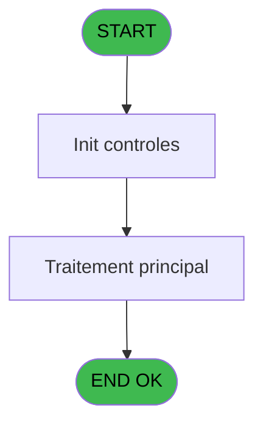
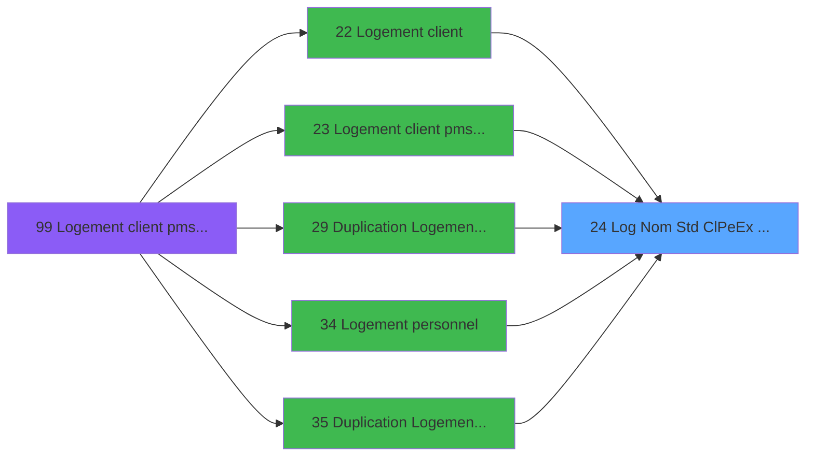

# PBS IDE 24 - Log Nom Std (Cl/Pe/Ex) Libre?

> **Analyse**: Phases 1-4 2026-02-03 17:08 -> 17:08 (14s) | Assemblage 17:08
> **Pipeline**: V7.2 Enrichi
> **Structure**: 4 onglets (Resume | Ecrans | Donnees | Connexions)

<!-- TAB:Resume -->

## 1. FICHE D'IDENTITE

| Attribut | Valeur |
|----------|--------|
| Projet | PBS |
| IDE Position | 24 |
| Nom Programme | Log Nom Std (Cl/Pe/Ex) Libre? |
| Fichier source | `Prg_24.xml` |
| Dossier IDE | Logement |
| Taches | 1 (0 ecrans visibles) |
| Tables modifiees | 0 |
| Programmes appeles | 0 |

## 2. DESCRIPTION FONCTIONNELLE

**Log Nom Std (Cl/Pe/Ex) Libre?** assure la gestion complete de ce processus, accessible depuis [Logement client (IDE 22)](PBS-IDE-22.md), [Logement client pms-626 evo (IDE 23)](PBS-IDE-23.md), [ Duplication Logement Client (IDE 29)](PBS-IDE-29.md), [Logement personnel (IDE 34)](PBS-IDE-34.md), [ Duplication Logement Perso (IDE 35)](PBS-IDE-35.md), [Logement exterieur (IDE 38)](PBS-IDE-38.md), [Duplication Logement Exterieur (IDE 39)](PBS-IDE-39.md), [Logement client pms-626 (IDE 99)](PBS-IDE-99.md).

Le flux de traitement s'organise en **1 blocs fonctionnels** :

- **Validation** (1 tache) : controles et verifications de coherence

## 3. BLOCS FONCTIONNELS

### 3.1 Validation (1 tache)

Controles de coherence : 1 tache verifie les donnees et conditions.

---

#### 24 - Verification Existant Nom

**Role** : Verification : Verification Existant Nom.

## 5. REGLES METIER

*(Aucune regle metier identifiee)*

## 6. CONTEXTE

- **Appele par**: [Logement client (IDE 22)](PBS-IDE-22.md), [Logement client pms-626 evo (IDE 23)](PBS-IDE-23.md), [ Duplication Logement Client (IDE 29)](PBS-IDE-29.md), [Logement personnel (IDE 34)](PBS-IDE-34.md), [ Duplication Logement Perso (IDE 35)](PBS-IDE-35.md), [Logement exterieur (IDE 38)](PBS-IDE-38.md), [Duplication Logement Exterieur (IDE 39)](PBS-IDE-39.md), [Logement client pms-626 (IDE 99)](PBS-IDE-99.md)
- **Appelle**: 0 programmes | **Tables**: 3 (W:0 R:1 L:2) | **Taches**: 1 | **Expressions**: 5

<!-- TAB:Ecrans -->

## 8. ECRANS

*(Programme sans ecran visible)*

## 9. NAVIGATION

### 9.3 Structure hierarchique (1 tache)

| Position | Tache | Type | Dimensions | Bloc |
|----------|-------|------|------------|------|
| **24.1** | [**Verification Existant Nom** (24)](#t1) | MDI | - | Validation |

### 9.4 Algorigramme

> **Legende**: Vert = START/END OK | Rouge = END KO | Bleu = Decisions
> *Algorigramme auto-genere. Utiliser `/algorigramme` pour une synthese metier detaillee.*

<!-- TAB:Donnees -->

## 10. TABLES

### Tables utilisees (3)

| ID | Nom | Description | Type | R | W | L | Usages |
|----|-----|-------------|------|---|---|---|--------|
| 102 | logement_go______lop |  | DB |   |   | L | 1 |
| 103 | logement_client__loc |  | DB | R |   |   | 1 |
| 106 | logement_exterieurs |  | DB |   |   | L | 1 |

### Colonnes par table (3 / 1 tables avec colonnes identifiees)

Table 103 - logement_client__loc (R) - 1 usages

| Lettre | Variable | Acces | Type |
|--------|----------|-------|------|
| A | > Code Logement | R | Alpha |
| B | < Validation ? | R | Logical |
| C | v.Lien Client ? | R | Logical |
| D | v.Lien Personnel ? | R | Logical |
| E | v.Lien Exterieur ? | R | Logical |

## 11. VARIABLES

### 11.1 Variables de session (3)

Variables persistantes pendant toute la session.

| Lettre | Nom | Type | Usage dans |
|--------|-----|------|-----------|
| C | v.Lien Client ? | Logical | 1x session |
| D | v.Lien Personnel ? | Logical | 1x session |
| E | v.Lien Exterieur ? | Logical | 1x session |

### 11.2 Autres (2)

Variables diverses.

| Lettre | Nom | Type | Usage dans |
|--------|-----|------|-----------|
| A | > Code Logement | Alpha | 1x refs |
| B | < Validation ? | Logical | - |

## 12. EXPRESSIONS

**5 / 5 expressions decodees (100%)**

### 12.1 Repartition par type

| Type | Expressions | Regles |
|------|-------------|--------|
| CAST_LOGIQUE | 2 | 0 |
| OTHER | 2 | 0 |
| CONDITION | 1 | 0 |

### 12.2 Expressions cles par type

#### CAST_LOGIQUE (2 expressions)

| Type | IDE | Expression | Regle |
|------|-----|------------|-------|
| CAST_LOGIQUE | 4 | `'FALSE'LOG` | - |
| CAST_LOGIQUE | 1 | `'TRUE'LOG` | - |

#### OTHER (2 expressions)

| Type | IDE | Expression | Regle |
|------|-----|------------|-------|
| OTHER | 5 | `v.Lien Client ? [C] OR v.Lien Personnel ? [D] OR v.Lien Exterieur ? [E]` | - |
| OTHER | 2 | `GetParam ('SOCIETE')` | - |

#### CONDITION (1 expressions)

| Type | IDE | Expression | Regle |
|------|-----|------------|-------|
| CONDITION | 3 | `> Code Logement [A]` | - |

<!-- TAB:Connexions -->

## 13. GRAPHE D'APPELS

### 13.1 Chaine depuis Main (Callers)

Main -> ... -> [Logement client (IDE 22)](PBS-IDE-22.md) -> **Log Nom Std (Cl/Pe/Ex) Libre? (IDE 24)**

Main -> ... -> [Logement client pms-626 evo (IDE 23)](PBS-IDE-23.md) -> **Log Nom Std (Cl/Pe/Ex) Libre? (IDE 24)**

Main -> ... -> [ Duplication Logement Client (IDE 29)](PBS-IDE-29.md) -> **Log Nom Std (Cl/Pe/Ex) Libre? (IDE 24)**

Main -> ... -> [Logement personnel (IDE 34)](PBS-IDE-34.md) -> **Log Nom Std (Cl/Pe/Ex) Libre? (IDE 24)**

Main -> ... -> [ Duplication Logement Perso (IDE 35)](PBS-IDE-35.md) -> **Log Nom Std (Cl/Pe/Ex) Libre? (IDE 24)**

Main -> ... -> [Logement exterieur (IDE 38)](PBS-IDE-38.md) -> **Log Nom Std (Cl/Pe/Ex) Libre? (IDE 24)**

Main -> ... -> [Duplication Logement Exterieur (IDE 39)](PBS-IDE-39.md) -> **Log Nom Std (Cl/Pe/Ex) Libre? (IDE 24)**

Main -> ... -> [Logement client pms-626 (IDE 99)](PBS-IDE-99.md) -> **Log Nom Std (Cl/Pe/Ex) Libre? (IDE 24)**

### 13.2 Callers

| IDE | Nom Programme | Nb Appels |
|-----|---------------|-----------|
| [22](PBS-IDE-22.md) | Logement client | 1 |
| [23](PBS-IDE-23.md) | Logement client pms-626 evo | 1 |
| [29](PBS-IDE-29.md) |  Duplication Logement Client | 1 |
| [34](PBS-IDE-34.md) | Logement personnel | 1 |
| [35](PBS-IDE-35.md) |  Duplication Logement Perso | 1 |
| [38](PBS-IDE-38.md) | Logement exterieur | 1 |
| [39](PBS-IDE-39.md) | Duplication Logement Exterieur | 1 |
| [99](PBS-IDE-99.md) | Logement client pms-626 | 1 |

### 13.3 Callees (programmes appeles)

### 13.4 Detail Callees avec contexte

| IDE | Nom Programme | Appels | Contexte |
|-----|---------------|--------|----------|
| - | (aucun) | - | - |

## 14. RECOMMANDATIONS MIGRATION

### 14.1 Profil du programme

| Metrique | Valeur | Impact migration |
|----------|--------|-----------------|
| Lignes de logique | 24 | Programme compact |
| Expressions | 5 | Peu de logique |
| Tables WRITE | 0 | Impact faible |
| Sous-programmes | 0 | Peu de dependances |
| Ecrans visibles | 0 | Ecran unique ou traitement batch |
| Code desactive | 0% (0 / 24) | Code sain |
| Regles metier | 0 | Pas de regle identifiee |

### 14.2 Plan de migration par bloc

#### Validation (1 tache: 0 ecran, 1 traitement)

- **Strategie** : FluentValidation avec validators specifiques.
- Chaque tache de validation -> un validator injectable

### 14.3 Dependances critiques

| Dependance | Type | Appels | Impact |
|------------|------|--------|--------|

---
*Spec DETAILED generee par Pipeline V7.2 - 2026-02-03 17:08*
