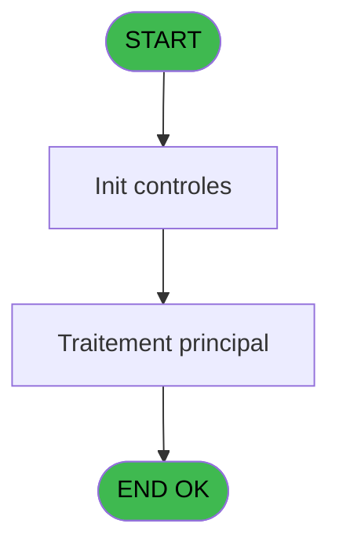
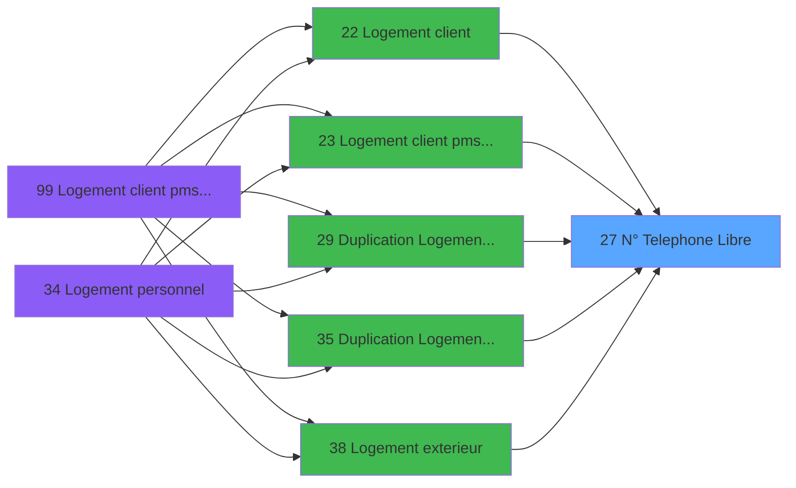

# PBS IDE 27 - N° Telephone Libre ?

> **Analyse**: Phases 1-4 2026-02-03 17:09 -> 17:09 (13s) | Assemblage 17:09
> **Pipeline**: V7.2 Enrichi
> **Structure**: 4 onglets (Resume | Ecrans | Donnees | Connexions)

<!-- TAB:Resume -->

## 1. FICHE D'IDENTITE

| Attribut | Valeur |
|----------|--------|
| Projet | PBS |
| IDE Position | 27 |
| Nom Programme | N° Telephone Libre ? |
| Fichier source | `Prg_27.xml` |
| Dossier IDE | Logement |
| Taches | 1 (0 ecrans visibles) |
| Tables modifiees | 0 |
| Programmes appeles | 0 |

## 2. DESCRIPTION FONCTIONNELLE

**N° Telephone Libre ?** assure la gestion complete de ce processus, accessible depuis [Logement client (IDE 22)](PBS-IDE-22.md), [Logement client pms-626 evo (IDE 23)](PBS-IDE-23.md), [ Duplication Logement Client (IDE 29)](PBS-IDE-29.md), [ Duplication Logement Perso (IDE 35)](PBS-IDE-35.md), [Logement exterieur (IDE 38)](PBS-IDE-38.md), [Duplication Logement Exterieur (IDE 39)](PBS-IDE-39.md), [Logement client pms-626 (IDE 99)](PBS-IDE-99.md).

Le flux de traitement s'organise en **1 blocs fonctionnels** :

- **Validation** (1 tache) : controles et verifications de coherence

## 3. BLOCS FONCTIONNELS

### 3.1 Validation (1 tache)

Controles de coherence : 1 tache verifie les donnees et conditions.

---

#### 27 - Verification Existant Nom [[ECRAN]](#ecran-t1)

**Role** : Verification : Verification Existant Nom.
**Ecran** : 170 x 108 DLU (MDI) | [Voir mockup](#ecran-t1)

## 5. REGLES METIER

*(Aucune regle metier identifiee)*

## 6. CONTEXTE

- **Appele par**: [Logement client (IDE 22)](PBS-IDE-22.md), [Logement client pms-626 evo (IDE 23)](PBS-IDE-23.md), [ Duplication Logement Client (IDE 29)](PBS-IDE-29.md), [ Duplication Logement Perso (IDE 35)](PBS-IDE-35.md), [Logement exterieur (IDE 38)](PBS-IDE-38.md), [Duplication Logement Exterieur (IDE 39)](PBS-IDE-39.md), [Logement client pms-626 (IDE 99)](PBS-IDE-99.md)
- **Appelle**: 0 programmes | **Tables**: 1 (W:0 R:1 L:0) | **Taches**: 1 | **Expressions**: 4

<!-- TAB:Ecrans -->

## 8. ECRANS

*(Programme sans ecran visible)*

## 9. NAVIGATION

### 9.3 Structure hierarchique (1 tache)

| Position | Tache | Type | Dimensions | Bloc |
|----------|-------|------|------------|------|
| **27.1** | [**Verification Existant Nom** (27)](#t1) [mockup](#ecran-t1) | MDI | 170x108 | Validation |

### 9.4 Algorigramme

> **Legende**: Vert = START/END OK | Rouge = END KO | Bleu = Decisions
> *Algorigramme auto-genere. Utiliser `/algorigramme` pour une synthese metier detaillee.*

<!-- TAB:Donnees -->

## 10. TABLES

### Tables utilisees (1)

| ID | Nom | Description | Type | R | W | L | Usages |
|----|-----|-------------|------|---|---|---|--------|
| 151 | nb_code__poste |  | DB | R |   |   | 1 |

### Colonnes par table (1 / 1 tables avec colonnes identifiees)

Table 151 - nb_code__poste (R) - 1 usages

| Lettre | Variable | Acces | Type |
|--------|----------|-------|------|
| A | >N° Telephone | R | Numeric |
| B | < Validation | R | Logical |
| C | v.Lien Existe | R | Logical |

## 11. VARIABLES

### 11.1 Variables de session (1)

Variables persistantes pendant toute la session.

| Lettre | Nom | Type | Usage dans |
|--------|-----|------|-----------|
| C | v.Lien Existe | Logical | 1x session |

### 11.2 Autres (2)

Variables diverses.

| Lettre | Nom | Type | Usage dans |
|--------|-----|------|-----------|
| A | >N° Telephone | Numeric | 1x refs |
| B | < Validation | Logical | - |

## 12. EXPRESSIONS

**4 / 4 expressions decodees (100%)**

### 12.1 Repartition par type

| Type | Expressions | Regles |
|------|-------------|--------|
| CONDITION | 1 | 0 |
| CAST_LOGIQUE | 2 | 0 |
| OTHER | 1 | 0 |

### 12.2 Expressions cles par type

#### CONDITION (1 expressions)

| Type | IDE | Expression | Regle |
|------|-----|------------|-------|
| CONDITION | 1 | `>N° Telephone [A]` | - |

#### CAST_LOGIQUE (2 expressions)

| Type | IDE | Expression | Regle |
|------|-----|------------|-------|
| CAST_LOGIQUE | 3 | `'FALSE'LOG` | - |
| CAST_LOGIQUE | 2 | `'TRUE'LOG` | - |

#### OTHER (1 expressions)

| Type | IDE | Expression | Regle |
|------|-----|------------|-------|
| OTHER | 4 | `v.Lien Existe [C]` | - |

<!-- TAB:Connexions -->

## 13. GRAPHE D'APPELS

### 13.1 Chaine depuis Main (Callers)

Main -> ... -> [Logement client (IDE 22)](PBS-IDE-22.md) -> **N° Telephone Libre ? (IDE 27)**

Main -> ... -> [Logement client pms-626 evo (IDE 23)](PBS-IDE-23.md) -> **N° Telephone Libre ? (IDE 27)**

Main -> ... -> [ Duplication Logement Client (IDE 29)](PBS-IDE-29.md) -> **N° Telephone Libre ? (IDE 27)**

Main -> ... -> [ Duplication Logement Perso (IDE 35)](PBS-IDE-35.md) -> **N° Telephone Libre ? (IDE 27)**

Main -> ... -> [Logement exterieur (IDE 38)](PBS-IDE-38.md) -> **N° Telephone Libre ? (IDE 27)**

Main -> ... -> [Duplication Logement Exterieur (IDE 39)](PBS-IDE-39.md) -> **N° Telephone Libre ? (IDE 27)**

Main -> ... -> [Logement client pms-626 (IDE 99)](PBS-IDE-99.md) -> **N° Telephone Libre ? (IDE 27)**

### 13.2 Callers

| IDE | Nom Programme | Nb Appels |
|-----|---------------|-----------|
| [22](PBS-IDE-22.md) | Logement client | 1 |
| [23](PBS-IDE-23.md) | Logement client pms-626 evo | 1 |
| [29](PBS-IDE-29.md) |  Duplication Logement Client | 1 |
| [35](PBS-IDE-35.md) |  Duplication Logement Perso | 1 |
| [38](PBS-IDE-38.md) | Logement exterieur | 1 |
| [39](PBS-IDE-39.md) | Duplication Logement Exterieur | 1 |
| [99](PBS-IDE-99.md) | Logement client pms-626 | 1 |

### 13.3 Callees (programmes appeles)

### 13.4 Detail Callees avec contexte

| IDE | Nom Programme | Appels | Contexte |
|-----|---------------|--------|----------|
| - | (aucun) | - | - |

## 14. RECOMMANDATIONS MIGRATION

### 14.1 Profil du programme

| Metrique | Valeur | Impact migration |
|----------|--------|-----------------|
| Lignes de logique | 12 | Programme compact |
| Expressions | 4 | Peu de logique |
| Tables WRITE | 0 | Impact faible |
| Sous-programmes | 0 | Peu de dependances |
| Ecrans visibles | 0 | Ecran unique ou traitement batch |
| Code desactive | 0% (0 / 12) | Code sain |
| Regles metier | 0 | Pas de regle identifiee |

### 14.2 Plan de migration par bloc

#### Validation (1 tache: 1 ecran, 0 traitement)

- **Strategie** : FluentValidation avec validators specifiques.
- Chaque tache de validation -> un validator injectable

### 14.3 Dependances critiques

| Dependance | Type | Appels | Impact |
|------------|------|--------|--------|

---
*Spec DETAILED generee par Pipeline V7.2 - 2026-02-03 17:09*
